<!-- source: https://mpp.dev/llms-full.txt -->
<!-- fetched: 2026-09-15 -->

# MPP — Machine Payments Protocol

MPP (Machine Payments Protocol) is the open standard for machine-to-machine payments via HTTP 402.

<!--
Sitemap:
- [What is MPP? Machine-to-machine HTTP 402 payments](/overview): MPP standardizes HTTP 402 for machine-to-machine payments. Learn how agents, apps, and services exchange payments in the same HTTP request.
- [Governance](/governance): An overview of how the Machine Payments Protocol is developed, maintained, and extended
- [Frequently asked questions](/faq): Answers to common questions about MPP—payment methods, settlement, pricing, security, and how the protocol compares to API keys and subscriptions.
- [Build with an LLM](/guides/building-with-an-llm): Use llms-full.txt to give your agent complete MPP context.
- [Quickstart](/quickstart/): Get started with MPP in minutes. Protect your API with payments, connect your agent, or integrate your app with MPP-enabled services.
- [Add payments to your API](/quickstart/server): Add payment-gated access to your API with mppx. Accept stablecoins, cards, and Bitcoin in a few lines of code using the MPP server SDK.
- [Use with agents](/quickstart/agent): Connect your coding agent to MPP-enabled services. Set up a wallet to handle payment flows automatically.
- [Use with your app](/quickstart/client): Handle payment-gated resources in your app. Use the mppx client SDK to intercept 402 responses, pay, and retry—all automatically.
- [Accept one-time payments](/guides/one-time-payments): Charge per API call with MPP. Accept pay-per-request payments from agents, apps, and users—no API keys or subscriptions required.
- [Accept pay-as-you-go payments](/guides/pay-as-you-go): Build a payment-gated API with session-based billing using mppx payment channels. Charge per request with near-zero latency overhead.
- [Accept streamed payments](/guides/streamed-payments): Accept streamed payments over Server-Sent Events with mppx. Bill per token in real time using Tempo payment channels for LLM inference APIs.
- [Create and manage subscriptions](/guides/subscription-payments): Build a subscription-gated API with MPP. Let clients authorize recurring stablecoin payments and reuse access across requests.
- [Use MPP with x402](/guides/use-mpp-with-x402): Keep your x402 server or use mppx to serve native MPP and x402 clients from the same endpoint.
- [Managing agent spend](/guides/managing-agent-spend): Manage agent spend with MPP.
- [Accept card payments](/guides/accept-card-payments): Accept card payments with Stripe on your MPP-enabled API. Charge Visa, Mastercard, and other card networks—no stablecoin wallet required.
- [Accept split payments](/guides/split-payments): Split a single charge across multiple recipients in one atomic transaction. Route platform fees, referral bounties, and revenue shares with mppx.
- [Accept multiple payment methods](/guides/multiple-payment-methods): Accept Tempo stablecoins, Stripe cards, and Lightning Bitcoin on a single API endpoint. Serve a multi-method 402 Challenge and let clients choose.
- [Create a payment link](/guides/payment-links): Create a payment link for any API endpoint. Share it anywhere—users pay directly from the page, no integration required.
- [Monetize your MCP server](/guides/monetize-mcp-server): Add payments to your MCP server. Charge per tool call with stablecoins—no API keys or billing portals required
- [Add payments to WebMCP tools](/guides/webmcp-payments): Add payments to WebMCP tools with mppx. Let browser agents pay for actions on your website without API keys or billing accounts.
- [Proxy an existing service](/guides/proxy-existing-service): Put a payment gate in front of any API without changing its code. Use the mppx Proxy SDK to charge for upstream access.
- [Protocol overview](/protocol/): The Machine Payments Protocol standardizes HTTP 402 with an extensible Challenge–Credential–Receipt flow that works with any payment network.
- [HTTP 402](/protocol/http-402): HTTP 402 Payment Required signals that a resource requires payment. Learn when and how MPP servers return 402 with a WWW-Authenticate Challenge.
- [Challenges](/protocol/challenges): Create MPP Challenges that tell clients what a resource costs, which method to use, and when the payment request expires.
- [Credentials](/protocol/credentials): Verify MPP Credentials from clients and bind payment proofs to the original server-issued Challenge.
- [Payment Receipts and verification](/protocol/receipts): Receipts confirm successful payment in MPP. Return them in the Payment-Receipt header so clients can verify that the server accepted their Credential.
- [Transports](/protocol/transports/): Map MPP Challenges, Credentials, and Receipts to HTTP headers, JSON-RPC messages, and WebSocket frames.
- [HTTP transport](/protocol/transports/http): Map MPP payment flows to HTTP headers, including a separate Credential field for endpoints that also require application authentication.
- [MCP and JSON-RPC transport](/protocol/transports/mcp): Use the MCP transport to require payment for JSON-RPC tool calls while preserving MPP Challenges, Credentials, and Receipts.
- [WebSocket transport](/protocol/transports/websocket): The WebSocket transport streams paid data over a persistent connection, with in-band voucher top-ups and JSON message framing.
- [Cloudflare Agents](/partner-integrations/cloudflare-agents): Use MPP with the Cloudflare Agents SDK.
- [Official MCP SDK](/partner-integrations/mcp-sdk): Use MPP with the official TypeScript MCP SDK.
- [OpenClaw](/partner-integrations/openclaw): Use the official MPP plugin to make OpenClaw HTTP requests payment-aware.
- [Vercel AI SDK](/partner-integrations/vercel-ai-sdk): Use MPP with the Vercel AI SDK.
- [Relays](/advanced/relays): Delegate MPP payment validation and finalization to a relay service.
- [Discovery](/advanced/discovery): Advertise your API's payment terms with an OpenAPI discovery document so clients and agents know what endpoints cost before making requests.
- [Identity](/advanced/identity): Use MPP Credentials for access control, rate limiting, and multi-step workflows—without requiring payment.
- [Payment hooks](/advanced/payment-hooks): Observe MPP client and server payment lifecycles with typed SDK hooks.
- [Refunds](/advanced/refunds): Return funds to clients after a charge, or let sessions refund unused deposits automatically.
- [Security](/advanced/security): Protect MPP server secrets and payment Credentials. Keep MPP_SECRET_KEY server-side, never log it, and rotate it safely.
- [Intents](/intents/): Compare MPP payment intents and choose the right payment pattern for one-time, metered, or recurring access.
- [Charge intent for one-time payments](/intents/charge): Charge intent defines one-time payments in MPP. Use it when a client pays once for a request before receiving the resource.
- [Session intent for metered payments](/intents/session): Session intent defines metered pay-as-you-go payments in MPP. Use it when usage is frequent or the final cost is unknown upfront.
- [The subscription intent for recurring payments](/intents/subscription): The subscription intent defines recurring fixed payments in MPP. Use it when access renews across billing periods.
- [Payment methods](/payment-methods/): Compare MPP payment methods and choose the right rails for your API, app, or agent workflow.
- [Tempo stablecoin payments](/payment-methods/tempo/): Use Tempo payment methods in MPP for stablecoin charges and low-cost payment sessions.
- [Tempo charge](/payment-methods/tempo/charge): Accept one-time stablecoin payments on Tempo with signed TIP-20 token transfers.
- [Sessions](/payment-methods/tempo/session): Accept pay-as-you-go stablecoin payments with Sessions.
- [Tempo subscription](/payment-methods/tempo/subscription): Accept recurring stablecoin payments on Tempo with subscriptions backed by scoped access keys.
- [EVM payment method](/payment-methods/evm/): Use EVM payment methods in MPP to accept stablecoin payments and run x402 exact flows inline.
- [EVM charge payment method](/payment-methods/evm/charge): Accept one-time EVM stablecoin payments with MPP and inline x402 exact compatibility.
- [Stripe payment methods](/payment-methods/stripe/): Offer Stripe Shared Payment Tokens and stablecoins from one MPP server integration.
- [Stripe charge](/payment-methods/stripe/charge): Accept one-time payments through Stripe.
- [Card payment method](/payment-methods/card/): Use card payments in MPP to accept traditional payment methods with encrypted network tokens.
- [Card charge](/payment-methods/card/charge): Accept one-time card payments in MPP using encrypted network tokens and card-compatible payment flows.
- [Lightning](/payment-methods/lightning/): Use Lightning payment methods in MPP for Bitcoin charges and prepaid session access.
- [Lightning charge](/payment-methods/lightning/charge): Accept one-time Bitcoin payments over Lightning with BOLT11 invoices and MPP charge flows.
- [Lightning session](/payment-methods/lightning/session): Accept pay-as-you-go Lightning payments with prepaid sessions and per-request billing.
- [Solana](/payment-methods/solana/): Use Solana payment methods in MPP to accept SOL and SPL token payments.
- [Solana charge](/payment-methods/solana/charge): Accept one-time Solana payments in MPP with signed transactions or confirmed signatures.
- [Solana session](/payment-methods/solana/session): Meter pay-as-you-go Solana payments with off-chain vouchers backed by an on-chain escrow channel.
- [XRP Ledger payments](/payment-methods/xrpl/): Use the XRPL payment method in MPP to accept XRP, issued-currency and MPT charges, and Payment Channel sessions.
- [XRPL charge](/payment-methods/xrpl/charge): Accept one-time XRP Ledger payments in MPP, in XRP, issued currencies or Multi-Purpose Tokens, with server-side verification.
- [XRPL session](/payment-methods/xrpl/session): Accept high-frequency off-chain payments in MPP over an XRP Ledger Payment Channel, settled in one closing transaction.
- [Stellar SEP-41 token payments](/payment-methods/stellar/): Use Stellar payment methods in MPP to accept SEP-41 token payments and channel-based sessions.
- [Stellar charge](/payment-methods/stellar/charge): Accept one-time Stellar token payments in MPP using SEP-41 assets and server-side verification.
- [Channel](/payment-methods/stellar/session): Accept high-frequency Stellar payments with one-way payment channels and pay-as-you-go billing.
- [Monad](/payment-methods/monad/): Use Monad payment methods in MPP for ERC-20 token payments with push and pull settlement modes.
- [Monad charge](/payment-methods/monad/charge): Accept one-time Monad payments with ERC-20 transfers or ERC-3009 authorizations.
- [NEAR Intents](/payment-methods/nearintents/): Use the NEAR Intents payment method in MPP for cross-chain charges: clients pay on any supported chain, merchants receive an exact amount on theirs.
- [NEAR Intents charge](/payment-methods/nearintents/charge): Accept one-time cross-chain payments through NEAR Intents and settle an exact amount on the merchant's destination chain.
- [RedotPay payment method](/payment-methods/redotpay/): Accept MPP payments using RedotPay balance or stablecoin rails.
- [RedotPay charge](/payment-methods/redotpay/charge): One-time payments with the RedotPay payment method.
- [Custom payment methods](/payment-methods/custom): Build a custom MPP payment method with your own request schema, Credential format, and server verification logic.
- [SDKs and client libraries](/sdk/): Official MPP SDKs in TypeScript, Python, Rust, Go, and Ruby, plus community SDKs in other languages.
- [SDK features](/sdk/features): Feature parity across TypeScript, Python, Rust, and Ruby MPP SDKs.
- [Getting started](/sdk/typescript/): Use the mppx TypeScript SDK to build MPP clients, servers, middleware, and payment-aware fetch flows.
- [evm client method](/sdk/typescript/client/Method.evm): Sign EVM charge Credentials
- [evm.charge client method](/sdk/typescript/client/Method.evm.charge): Sign EVM charge Credentials
- [tempo client method](/sdk/typescript/client/Method.tempo): Register Tempo charge and session support in an MPP TypeScript client.
- [Method.tempo.charge](/sdk/typescript/client/Method.tempo.charge): One-time payments
- [tempo.session](/sdk/typescript/client/Method.tempo.session): Sessions client method
- [tempo.session.manager](/sdk/typescript/client/Method.tempo.session-manager): Sessions manager
- [Method.tempo.subscription](/sdk/typescript/client/Method.tempo.subscription): Recurring stablecoin payments
- [stripe client method](/sdk/typescript/client/Method.stripe): Register Stripe charge support in an MPP TypeScript client.
- [Method.stripe.charge](/sdk/typescript/client/Method.stripe.charge): One-time payments via Shared Payment Tokens
- [Mppx.create](/sdk/typescript/client/Mppx.create): Create a payment-aware fetch client
- [Mppx.preparePayment](/sdk/typescript/client/Mppx.preparePayment): Inspect a payment before signing
- [Mppx.prepareRequest](/sdk/typescript/client/Mppx.prepareRequest): Prepare a request-bound payment
- [Mppx.restore](/sdk/typescript/client/Mppx.restore): Restore the original global fetch
- [Fetch.from](/sdk/typescript/client/Fetch.from): Wrap fetch with automatic MPP payments without changing global fetch.
- [Fetch.polyfill](/sdk/typescript/client/Fetch.polyfill): Install a global fetch wrapper that handles MPP payments automatically.
- [Fetch.restore](/sdk/typescript/client/Fetch.restore): Restore the original fetch after installing the MPP fetch polyfill.
- [Transport.from](/sdk/typescript/client/Transport.from): Create a custom transport
- [Transport.http](/sdk/typescript/client/Transport.http): HTTP transport for payments
- [Transport.mcp](/sdk/typescript/client/Transport.mcp): MCP transport for payments
- [McpClient.wrap](/sdk/typescript/client/McpClient.wrap): Payment-aware MCP client
- [evm server method](/sdk/typescript/server/Method.evm): Create EVM charge Challenges
- [evm.charge server method](/sdk/typescript/server/Method.evm.charge): One-time EVM payments
- [tempo server method](/sdk/typescript/server/Method.tempo): Register Tempo charge and session support in an MPP TypeScript server.
- [Method.tempo.charge](/sdk/typescript/server/Method.tempo.charge): One-time stablecoin payments
- [Method.tempo.session](/sdk/typescript/server/Method.tempo.session): Sessions server method
- [Method.tempo.subscription](/sdk/typescript/server/Method.tempo.subscription): Recurring stablecoin payments
- [stripe](/sdk/typescript/server/Method.stripe): Configure Stripe SPT and stablecoin payment methods for an MPP server.
- [stripe.charge](/sdk/typescript/server/Method.stripe.charge): Migrate the deprecated Stripe charge constructor to the Stripe SPT constructor.
- [stripe.create](/sdk/typescript/server/Method.stripe.create): Configure Stripe SPT and stablecoin payment methods from one server integration.
- [stripe.findOrCreateDepositAddress](/sdk/typescript/server/Method.stripe.findOrCreateDepositAddress): Resolve and cache a Stripe stablecoin deposit address for a payment network.
- [stripe.spt](/sdk/typescript/server/Method.stripe.spt): Accept one-time Stripe payments with Shared Payment Tokens in an MPP server.
- [mppx.broadcastCredential](/sdk/typescript/server/Mppx.broadcastCredential): Accept an MPP Credential from a custom transport or background workflow.
- [Mppx.compose](/sdk/typescript/server/Mppx.compose): Present multiple payment options
- [Mppx.create](/sdk/typescript/server/Mppx.create): Create a server-side payment handler
- [Mppx.toNodeListener](/sdk/typescript/server/Mppx.toNodeListener): Adapt payments for Node.js HTTP
- [mppx.validateCredential](/sdk/typescript/server/Mppx.validateCredential): Pre-check an MPP Credential without consuming payment state.
- [mppx.verifyCredential](/sdk/typescript/server/Mppx.verifyCredential): Verify MPP Credentials directly in custom transports and background flows.
- [Transport.from](/sdk/typescript/server/Transport.from): Create a custom transport
- [Transport.http](/sdk/typescript/server/Transport.http): HTTP server-side transport
- [Transport.mcp](/sdk/typescript/server/Transport.mcp): Raw JSON-RPC MCP transport
- [Transport.mcpSdk](/sdk/typescript/server/Transport.mcpSdk): MCP SDK server-side transport
- [mppx.session.serveWebSocket](/sdk/typescript/server/Ws.serve): WebSocket session payments
- [Request.toNodeListener](/sdk/typescript/server/Request.toNodeListener): Convert Fetch handlers to Node.js
- [Response.requirePayment](/sdk/typescript/server/Response.requirePayment): Create a 402 response
- [mach](/sdk/typescript/tempo.mach): Use deployed MACH token metadata without copying addresses into your Tempo integration.
- [Method.tempo.renewSubscription](/sdk/typescript/server/Method.tempo.renewSubscription): Renew subscriptions outside requests
- [Elysia payment middleware](/sdk/typescript/middlewares/elysia): Protect Elysia routes with MPP payment middleware.
- [Express payment middleware](/sdk/typescript/middlewares/express): Protect Express routes with MPP payment middleware.
- [Hono payment middleware](/sdk/typescript/middlewares/hono): Protect Hono routes with MPP payment middleware.
- [Next.js payment middleware](/sdk/typescript/middlewares/nextjs): Protect Next.js route handlers with MPP payment middleware.
- [x402/express.mpp](/sdk/typescript/x402/express): Add MPP payments to an existing x402 Express server without replacing its routes, facilitator, hooks, or settlement.
- [x402/hono.mpp](/sdk/typescript/x402/hono): Add MPP payments to an existing x402 Hono server while preserving its route configuration and payment lifecycle.
- [x402/mcp.mpp](/sdk/typescript/x402/mcp): Add MPP payment metadata to an existing x402 MCP tool while preserving its resource server and x402 lifecycle.
- [x402/next](/sdk/typescript/x402/next): Add MPP payments to existing x402 Next.js route handlers and proxies while preserving official adapter behavior.
- [Paid API proxy server](/sdk/typescript/proxy): Put MPP payments in front of existing upstream APIs.
- [BodyDigest.compute](/sdk/typescript/core/BodyDigest.compute): Compute a body digest hash
- [BodyDigest.verify](/sdk/typescript/core/BodyDigest.verify): Verify a body digest hash
- [Challenge.credentialHeader](/sdk/typescript/core/Challenge.credentialHeader): Resolve the HTTP field where a client sends a Payment Credential for an MPP Challenge.
- [Challenge.deserialize](/sdk/typescript/core/Challenge.deserialize): Deserialize a Challenge from a header
- [Challenge.from](/sdk/typescript/core/Challenge.from): Create a new Challenge
- [Challenge.fromHeaders](/sdk/typescript/core/Challenge.fromHeaders): Extract a Challenge from Headers
- [Challenge.fromMethod](/sdk/typescript/core/Challenge.fromMethod): Create a Challenge from a method
- [Challenge.fromResponse](/sdk/typescript/core/Challenge.fromResponse): Extract a Challenge from a Response
- [Challenge.fromResponseList](/sdk/typescript/core/Challenge.fromResponseList): Extract multiple Challenges
- [Challenge.meta](/sdk/typescript/core/Challenge.meta): Extract correlation data from a Challenge
- [Challenge.serialize](/sdk/typescript/core/Challenge.serialize): Serialize a Challenge to a header
- [Challenge.verify](/sdk/typescript/core/Challenge.verify): Verify a Challenge HMAC
- [Credential.deserialize](/sdk/typescript/core/Credential.deserialize): Deserialize a Credential from a header
- [Credential.from](/sdk/typescript/core/Credential.from): Create a new Credential
- [Credential.fromRequest](/sdk/typescript/core/Credential.fromRequest): Extract a Credential from a Request
- [Credential.serialize](/sdk/typescript/core/Credential.serialize): Serialize a Credential to a header
- [Expires utility functions](/sdk/typescript/core/Expires): Use Expires helpers to set relative expiration timestamps for MPP Challenges and payment requests.
- [Method.from](/sdk/typescript/core/Method.from): Create a payment method definition
- [Method.toClient](/sdk/typescript/core/Method.toClient): Extend a method with client logic
- [Method.toServer](/sdk/typescript/core/Method.toServer): Extend a method with server payment handling
- [PaymentRequest.deserialize](/sdk/typescript/core/PaymentRequest.deserialize): Deserialize a payment request
- [PaymentRequest.from](/sdk/typescript/core/PaymentRequest.from): Create a payment request
- [PaymentRequest.serialize](/sdk/typescript/core/PaymentRequest.serialize): Serialize a payment request to a string
- [Receipt.deserialize](/sdk/typescript/core/Receipt.deserialize): Deserialize a Receipt from a header
- [Receipt.from](/sdk/typescript/core/Receipt.from): Create a new Receipt
- [Receipt.fromResponse](/sdk/typescript/core/Receipt.fromResponse): Extract a Receipt from a Response
- [Receipt.serialize](/sdk/typescript/core/Receipt.serialize): Serialize a Receipt to a string
- [Store.tryClaim](/sdk/typescript/core/Store.tryClaim): Prevent duplicate payments and request replays with atomic, expiring claims.
- [Html.init](/sdk/typescript/Html.init): Build custom payment UIs for browser-based 402 flows
- [Custom HTML](/sdk/typescript/html/custom): Add payment link support to a custom payment method with Html.init and Method.toServer
- [CLI Reference](/sdk/typescript/cli): Use the mppx CLI to make paid HTTP requests from the terminal with automatic MPP and x402 payment handling.
- [Python SDK](/sdk/python/): Use the Python SDK to build MPP clients and servers with typed Challenge, Credential, and Receipt primitives.
- [Core Types](/sdk/python/core): Use Python core types for MPP Challenges, Credentials, Receipts, payment requests, and verification flows.
- [Python MPP client](/sdk/python/client): Use the Python client to handle HTTP 402 responses, pay with supported methods, and retry requests automatically.
- [Server](/sdk/python/server): Use the Python server SDK to protect FastAPI endpoints with MPP payment requirements and verification.
- [Rust SDK for MPP](/sdk/rust/): Use the Rust SDK to build MPP clients and servers with typed Challenge, Credential, and Receipt primitives.
- [Core types](/sdk/rust/core): Use Rust core types for MPP Challenges, Credentials, Receipts, payment requests, and verification flows.
- [Client](/sdk/rust/client): Use the Rust client to handle HTTP 402 responses, pay with supported methods, and retry requests automatically.
- [Server](/sdk/rust/server): Use the Rust server SDK to protect Axum endpoints with MPP payment requirements and verification.
- [Go SDK](/sdk/go/): Use the Go SDK to build MPP clients and servers with typed Challenge, Credential, and Receipt primitives.
- [Core types](/sdk/go/core): Use Go core types for MPP Challenges, Credentials, Receipts, payment requests, and verification flows.
- [Client](/sdk/go/client): Use the Go client to handle HTTP 402 responses, pay with supported methods, and retry requests automatically.
- [Server](/sdk/go/server): Use the Go server SDK to protect HTTP endpoints with MPP payment requirements and verification.
- [Ruby SDK](/sdk/ruby/): Use the Ruby SDK to build MPP clients and servers with typed Challenge, Credential, and Receipt primitives.
- [Core Types](/sdk/ruby/core): Use Ruby core types for MPP Challenges, Credentials, Receipts, payment requests, and verification flows.
- [Client](/sdk/ruby/client): Use the Ruby client to handle HTTP 402 responses, pay with supported methods, and retry requests automatically.
- [Server](/sdk/ruby/server): Use the Ruby server SDK to protect Rack endpoints with MPP payment requirements and verification.
- [Wallets](/tools/wallet): Agent wallets for MPP -- enable your agent to pay for services.
- [Agentic payments](/use-cases/agentic-payments): Learn how coding agents pay for APIs autonomously with MPP. No API keys, no signup forms—agents handle payments inline via HTTP 402.
- [API monetization](/use-cases/api-monetization): Monetize your API with per-request payments using HTTP 402. No API keys, subscriptions, or billing dashboards required.
- [Micropayments](/use-cases/micropayments): MPP makes micropayments viable with stablecoin settlement and off-chain payment sessions—no minimum transaction size, no fixed per-transaction fees.
- [Extensions](/extensions): Community-built tools and integrations for MPP
- [Brand assets and downloads](/brand): Download the current MPP logo, lockup, and avatar for your product, integration, or social profile.
- [Machine Payments Protocol](/index): Charge for API requests, tool calls, and content with HTTP 402 payments co-developed by Tempo and Stripe.
- [Page Not Found](/404)
- [MPP Blog: HTTP 402 payment protocol updates](/blog/): Updates from the MPP team on protocol development, integrations, and the future of machine payments.
- [MPP vs x402: Agentic payment protocols compared](/mpp-vs-x402): Compare MPP vs x402 for HTTP 402 payments. Learn the protocol differences, supported payment methods, session support, and when to choose each approach.
- [MPP services: APIs that accept MPP payments](/services): Browse live MPP-enabled services that accept machine-to-machine payments. Discover APIs you can pay for with stablecoins, cards, or Bitcoin.
- [EVM and x402 support](/blog/evm-x402-support): MPP now supports generic EVM payments and x402 exact flows from one SDK.
- [Go and Ruby SDKs](/blog/go-and-ruby-sdks): Two new MPP SDKs: mpp-go maintained by Tempo Labs and mpp-rb maintained by Stripe.
- [mppx for agent SDKs and harnesses](/blog/mppx-agent-runtimes): New mppx hooks connect agent runtimes to paid tools and HTTP services through MPP.
- [Expanding identity support in mppx](/blog/mppx-identity-support): Verify agent identity across HTTP requests and payment retries with mppx.
- [Multi-method discovery](/blog/multi-method-discovery): Declare every payment method, currency, and intent for a route ahead of time.
- [Payment hooks](/blog/payment-hooks): Core SDKs now expose typed payment hooks for logging, monitoring, and request context.
- [Simplify MPP integrations with relays](/blog/relays): Delegate MPP payment validation and settlement without changing your application's payment flow.
- [An improved sessions experience](/blog/sessions-improved): Pay-as-you-go API billing is now cheaper and easier to integrate.
- [Subscriptions](/blog/subscriptions): Enable recurring access for paid plans, memberships, and API tiers.
- [Method.from](/sdk/typescript/Method.from): Create a payment method from a definition
-->

# What is MPP? \[Machine-to-machine payments over HTTP 402]

The Machine Payments Protocol (MPP) lets any client—agents, apps, or humans—pay for any service in the same HTTP request. Developers use MPP to let their agents pay for services. Service operators use MPP to accept payments for their APIs.

MPP is built around a simple, extensible core and is neutral to the implementation of underlying payment flows and methods.

* **Open standard built for the internet**—Built on an open specification proposed to the IETF, not a proprietary API
* **Designed for payments**—Idempotency, security, and Receipts are first-class primitives
* **Works with stablecoins, cards, and bank transfers**—All payment methods can be supported through one protocol and flexible control flow
* **Any currency**—Transact in USD, EUR, BRL, USDC.e, BTC, or any other asset
* **Composable and designed for extension**—A flexible core allows advanced flows like disputes or additional primitives like identity to be gradually introduced

## Who is MPP for?

MPP involves three parties:

* **Developers** build apps and agents that consume paid services. You integrate an MPP client so your agent can discover, pay for, and use third-party APIs without manual signup or API keys.
* **Agents** are the entities that take action—calling APIs, generating images, querying data. They pay for services autonomously on behalf of your users.
* **Services** operate APIs that charge for access—LLM inference, image generation, web search, and more. You integrate an MPP server to accept payments with zero onboarding friction.

## The problem with payments on the internet

There is no shortage of ways to pay for things on the internet. Hundreds of payment methods give users ample space for personal preference, and optimized payment forms with one-click checkout ensure that the act of paying is low-friction and highly secure.

However, the very things that make these payment flows familiar and fast for human purchasers are structural headwinds for programmatic consumption. Many have tried, but it is a consistent uphill battle to fight browser automation pipelines, visual captchas, and ever changing payment forms—all of which reduce reliability, increase latency, and bear high costs.

This is not the fault of any individual payment method or Credential. This is a global problem which exists at the *interface* level: how buyer and seller negotiate cost, supported payment methods, and ultimately transact.

The Machine Payments Protocol addresses this gap by providing a payment interface built for programmatic access that strips away the complexity of rich checkout flows, while still providing robust security and reliability. By using MPP, you can accept payments from any client—agents, apps, or humans—and across any payment method, without complex checkout flows and integrations.

## Try it out

See the full payment flow in action. The terminal creates an ephemeral wallet, funds it with testnet USDC.e, and makes a paid request.

<div style={{ height: 420 }}>
  ```text
  GET /api/ping/paid

  402 Payment Required

  Pay $0.001 with Tempo.

  200 OK
  pong
  ```
</div>

## Use cases

* **[Agentic payments](/use-cases/agentic-payments)**—Your agent calls LLM providers, search APIs, and image generators through MPP, paying per request without API keys or human intervention.
* **[API monetization](/use-cases/api-monetization)**—Accept payments from any client—agents, apps, or humans—without requiring signups, billing accounts, or API keys.
* **[Micropayments](/use-cases/micropayments)**—Charge sub-cent amounts per token, per query, or per request using off-chain payment sessions with on-chain settlement.

## Payment flow

When a client requests a paid resource, the server returns a `402` response with the payment options they support. The client chooses a payment method, fulfills the request and retries with a payment `Credential` which contains proof of payment. The server verifies the payment and returns the resource with a `Receipt` which contains proof of delivery.

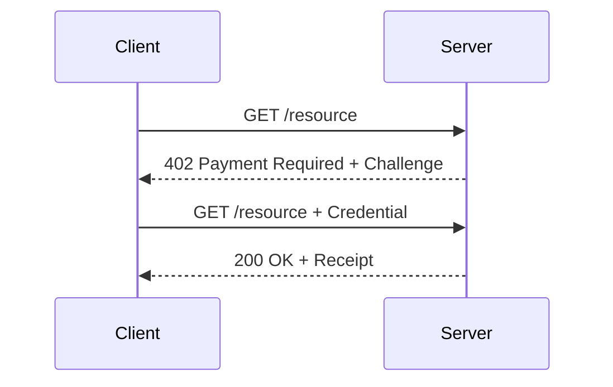
```mermaid
sequenceDiagram
  participant Client
  participant Server
  Client->>Server: GET /resource
  Server-->>Client: 402 Payment Required + Challenge
  Client->>Server: GET /resource + Credential
  Server-->>Client: 200 OK + Receipt
```

1. Request the resource.
2. Receive a 402 Challenge.
3. Fulfill the payment and retry with a Credential.
4. Receive the resource and Receipt.

## Official SDKs

MPP comes with a suite of official SDKs maintained by [Tempo Labs](https://tempo.xyz) and [Wevm](https://wevm.dev). The SDKs offer high-level abstractions and low-level primitives to implement and extend the Machine Payments Protocol.

[TypeScript](/sdk/typescript) — Get started with \`mppx\`, the reference implementation of the MPP SDKs

[Python](/sdk/python) — Get started with \`pympp\`, the official MPP SDK for Python

[Rust](/sdk/rust) — Get started with \`mpp-rs\`, the official MPP SDK for Rust

[Go](/sdk/go) — Get started with \`mpp-go\`, the official MPP SDK for Go

## Next steps

[MPP vs x402](/mpp-vs-x402) — Compare HTTP 402 payment protocols

[Quickstart](/quickstart) — Build a payment-enabled API

[Protocol concepts](/protocol) — Learn about MPP's core control flow

[IETF Specification](https://paymentauth.org) — Read the full specification

# Governance \[An overview of how the Machine Payments Protocol is developed, maintained, and extended]

The Machine Payments Protocol (MPP) is an open protocol for machine-to-machine payments, co-authored by [Tempo](https://tempo.xyz) and [Stripe](https://stripe.com). MPP is neutral by design and operates independently of any single company, payment method, or rail.

Governance of MPP is split into two parts: the **core specification** and **payment methods**. Each is maintained and evolved by different parties, which keeps the protocol neutral while letting payment rails move at their own pace.

## The core specification

The core specification defines the abstract shape of the funds flow—the `402` Payment Required exchange of a Challenge, a Credential, and a Receipt. It makes no claims or affordances to any specific payment method, and it is designed to work with any rail and currency.

The core specification is published as the [Payment HTTP Authentication Scheme](https://datatracker.ietf.org/doc/draft-ryan-httpauth-payment/) and submitted to the **IETF** standards track, where it continues to progress as an open, vendor-neutral standard.

As an IETF submission, the specification is governed by IETF Trust licensing under [BCP 78](https://www.rfc-editor.org/info/bcp78) and [BCP 79](https://www.rfc-editor.org/info/bcp79). Code components within the document are licensed under the Revised BSD License per the IETF Trust Legal Provisions. Anchoring the core at the IETF means no single company controls it—changes happen in the open, through the same process that standardizes the rest of the web.

## Payment methods

A payment method describes how a specific payment rail conforms to the MPP specification. Payment methods are the most important part of MPP; without them, buyers and sellers have no way to transact.

Each payment method specification is defined and maintained by the rail behind it—for example Visa, Mastercard, Solana, Bitcoin, Stripe, or Tempo—together with any corporate entities associated with that rail. Those entities maintain their own specifications, make their own decisions, and are expected to evolve independently of MPP, as long as they continue to fit the core specification.

This separation is deliberate. It gives each rail the independence to ship and improve its method on its own timeline, without coordinating every change through a central body. In many cases, individual payment methods implement constraints or extensions beyond the core MPP specification, such as disputes, refunds, or KYC requirements. This model encourages those extensions.

## Permissionless extension

Payment rails and third parties do not need explicit approval to add a payment method implementation to MPP. The [`mppx` SDK](/payment-methods/custom) supports [custom payment methods](/payment-methods/custom), so developers and payment method providers can implement any payment method on top of MPP, distribute their own SDK, and get buyers and sellers to adopt it.

## Contributing

MPP is developed in the open on [GitHub](https://github.com/tempoxyz/mpp-specs).

The core spec repository's [contributing guidelines](https://github.com/tempoxyz/mpp-specs/blob/main/CONTRIBUTING.md) cover how to propose changes, including the templates and process for each type of change:

* **New intents, methods, and extensions**
* **Core protocol changes**
* **Editorial fixes**

While the core MPP specification conforms to those guidelines, individual payment methods and SDKs may have their own repositories, contribution requirements, and licensing. Treat those as canonical for each individual payment method.

## Specification

[IETF Specification](https://paymentauth.org) — Read the full specification

# Frequently asked questions \[Common questions about the Machine Payments Protocol]

## Is MPP only for stablecoins?

No. MPP is payment-method agnostic—the protocol works with any payment rail.

Today, [Tempo](/payment-methods/tempo) stablecoin payments, card payments through [Card](/payment-methods/card) or [Stripe](/payment-methods/stripe), and [Lightning](/payment-methods/lightning) payments are in production. Anyone can build a [custom payment method](/payment-methods/custom) by implementing the core control flow for their payment rail. The specification directory lists every payment method and intent.

## Do I need a stablecoin wallet?

No. With Card or Stripe, you can pay with cards without stablecoins. With Lightning, you can pay with Bitcoin.

For stablecoin payments, you need a wallet to sign transactions. SDKs and wallet CLIs can handle key management for you.

## How is MPP different from x402?

Both MPP and x402 use HTTP `402` to signal that a request requires payment. The key differences:

See [MPP vs x402](/mpp-vs-x402) for a full side-by-side comparison, or [Use MPP with x402](/guides/use-mpp-with-x402) for an implementation guide.

* **Payment-method agnostic.** MPP supports stablecoins, cards, wallets, and custom rails through extensible payment method specifications. x402 only supports blockchains.
* **Designed for production.** MPP supports idempotency, expiration, request-body binding (digest), and request-tampering mitigations as first-class primitives.
* **Performant payments.** MPP's session intent enables pay-as-you-go metering for payments as small as 0.0001 USD. Sessions achieve sub-100ms latency and near-zero per-request fees by settling off-chain vouchers, enabling high-throughput applications like token streaming or content aggregation. x402 requires an on-chain transaction per request.
* **Permissionless extensibility.** Anyone can author and publish a new payment method or intent specification without approval from a foundation or intermediary. Payment methods compete on adoption and are independently maintained.
* **IETF standards track.** The core Payment HTTP Authentication Scheme is submitted to the IETF for standardization.

## Is MPP compatible with x402?

Yes. The core x402 "exact" flows map directly onto MPP's charge intent. `mppx` can run x402-compatible EVM charges inline with an MPP route, so the same endpoint can serve x402 and MPP clients. See [Use MPP with x402](/guides/use-mpp-with-x402#run-x402-inline-with-mppx).

## Why build MPP on Tempo?

MPP works with any payment rail—cards, Lightning, stablecoins, or any custom method. You don't have to use Tempo.

That said, high-throughput, low-value transactions benefit from specific properties that Tempo provides:

* **Fast, deterministic finality**—Certainty that a payment has settled, not probabilistic confirmation.
* **Low, predictable cost**—Transaction fees stay stable regardless of global network congestion.
* **Payment lanes**—Dedicated transaction routing for payment traffic, ensuring reliability even under heavy load.
* **Stablecoin-native**—TIP-20 stablecoins (USDC.e, USDT) are first-class citizens, so payments are denominated in familiar currency.

These properties make Tempo well-suited as a settlement layer for machine payments where speed, cost, and reliability matter.

## What are sessions?

Sessions are a payment intent that enables streaming, pay-as-you-go payments. Instead of paying per request, a client opens a session by depositing funds into a channel reserve, then makes many requests by issuing signed vouchers off-chain. The server periodically settles the accumulated vouchers on-chain. Sessions are the mechanism that makes [micropayments](/use-cases/micropayments) viable—sub-cent transactions cost nothing individually because only net settlement hits the chain. See the [session documentation](/payment-methods/tempo/session) for details.

Because sessions bypass consensus for individual interactions, they achieve client-to-server latency (low double-digit milliseconds), near-zero per-request fees, and horizontally scalable throughput. The bottleneck is CPU, not blockchain TPS.

## How much does it cost?

Pricing is set per service. For individual charge payments, typical prices range from $0.01 to $0.10 per request. For session-based payments, the per-request cost can go much lower because each interaction is a signed voucher rather than an on-chain transaction—only net settlement hits the chain.

The protocol itself is free and open. There are no licensing fees for implementing MPP.

## Is it safe?

MPP requires TLS 1.2+ for all connections. Cryptographically bound Challenge IDs prevent clients from modifying payment terms. Payment methods enforce replay protection separately through settlement-layer guarantees or shared replay state. The protocol never performs side effects on unpaid requests—your client only pays after verifying what it is paying for.

Payments use the same security model as the underlying payment method. Stablecoin methods typically use cryptographic signatures over every transaction. Card methods typically use the provider's existing fraud and dispute infrastructure.

For operational guidance on `MPP_SECRET_KEY`, logging, and rotation, see [Security](/advanced/security).

## How do I handle `MPP_SECRET_KEY`?

Treat `MPP_SECRET_KEY` as root-of-trust material for server-side Challenge binding. Store it in a secrets manager, keep it server-side, never log it, rotate it immediately if it is exposed, and use overlapping current-and-previous key verification during rollovers so in-flight Challenges keep working. See [Security](/advanced/security) for the full guidance.

## What happens if a payment fails?

The service returns an error with details following [RFC 9457](https://www.rfc-editor.org/rfc/rfc9457) (Problem Details for HTTP APIs). Your client can retry with a different payment method or surface the error. No money is deducted for failed requests.

## Can I accept MPP payments for my own service?

Yes. See the [server quickstart](/quickstart/server) to start accepting payments in a few lines of code, or read more about [API monetization with MPP](/use-cases/api-monetization). The TypeScript SDK includes middleware for popular frameworks including Hono, Express, Next.js, and Elysia.

## Is MPP an IETF standard?

The core [Payment HTTP Authentication Scheme](https://datatracker.ietf.org/doc/draft-ryan-httpauth-payment/) is submitted to the IETF standards track. Payment method and intent specifications (for example, charge, session) are separate documents that anyone can author and publish independently—they do not require IETF approval. This mirrors how the web works: HTTP is standardized, but content types and authentication schemes evolve independently.

[IETF Specification](https://paymentauth.org) — Read the full specification

## Can I use MPP outside of HTTP?

Yes. MPP includes an [MCP transport binding](/protocol/transports/mcp) that maps the Challenge-Credential-Receipt flow onto the Model Context Protocol. This means MCP servers can monetize tool calls directly, and agents pay autonomously without OAuth or account setup.

## Who is building MPP?

MPP is co-authored by Tempo and Stripe. The core specification is developed in the open and designed to be extended by any payment network or provider. The [Payment HTTP Authentication Scheme](https://datatracker.ietf.org/doc/draft-ryan-httpauth-payment/) is submitted to the IETF.

# Build with an LLM \[Give your agent MPP context]

Point your coding agent at <a href="/llms-full.txt" target="_self">`llms-full.txt`</a>, a single file containing the complete documentation.

## Get started

Copy this URL and paste it into your agent:

```text [URL]
https://mpp.dev/llms-full.txt
```

Your agent now has full context on MPP's client and server APIs, payment methods, and integration patterns.

## Advanced options

These alternatives provide different ways to consume the docs depending on your workflow.

### Agent skills

Install skills for your coding agent using the [`skills` CLI](https://github.com/vercel-labs/skills):

```bash [terminal]
$ npx skills add tempoxyz/mpp -g
```

After installing, your agent knows how to integrate `mppx` with your chosen framework.

### llms.txt

Each page has a [`llms.txt`](https://llmstxt.org) file for LLM consumption:

* <a href="/llms.txt" target="_self">`llms.txt`</a>: A concise index of all pages with titles and descriptions
* <a href="/llms-full.txt" target="_self">`llms-full.txt`</a>: Complete documentation content in a single file

### MCP server

Connect the docs as an [MCP server](https://modelcontextprotocol.io) so your agent can search and read pages directly:

:::code-group
```bash [Claude]
$ claude mcp add --transport http mpp https://mpp.dev/api/mcp
```

```bash [Codex]
$ codex mcp add --transport http mpp https://mpp.dev/api/mcp
```

```bash [Amp]
$ amp mcp add --transport http mpp https://mpp.dev/api/mcp
```

```json [Manual]
// Claude: .mcp.json | Cursor: ~/.cursor/mcp.json
// Windsurf: ~/.codeium/windsurf/mcp_config.json
{
  "mcpServers": {
    "mpp": {
      "url": "https://mpp.dev/api/mcp"
    }
  }
}
```
:::

**Available tools:**

| Tool | Description |
| --- | --- |
| `list_pages` | List all documentation pages with their paths |
| `read_page` | Read the content of a specific documentation page |
| `search_docs` | Search documentation for a query string |
| `list_sources` | List available source code repositories |
| `list_source_files` | List files in a directory |
| `read_source_file` | Read a source code file |
| `get_file_tree` | Get a recursive file tree |
| `search_source` | Search source code for a pattern |

# Quickstart \[Get started with MPP in minutes]

MPP lets APIs charge for access. Servers request payment when you hit a paid endpoint; clients pay; servers verify and return the resource. [Learn more](/protocol).

## Start prompting

Paste one of these into your coding agent to build your first MPP app or service:

### Client

```text
Reference https://mpp.dev/quickstart/client.md

Add mppx to my app as a client.
Polyfill the global fetch to automatically handle 402 Payment Required responses using the Tempo payment method.
Make a request to https://mpp.dev/api/ping/paid to test.
```

### Server

```text
Reference https://mpp.dev/quickstart/server.md

Add mppx to my server with a /api/test route that charges $0.01 per request using the Tempo payment method with pathUSD.
Run `npx mppx validate <your-server>` to validate the implementation as you develop.
```

## Start building

Pick a starting point based on your role:

[Client quickstart](/quickstart/client) — Learn how to pay for resources

[Server quickstart](/quickstart/server) — Learn how to charge for resources

[Tempo Wallet CLI](https://wallet.tempo.xyz) — Managed MPP client with built in spend controls and service discovery

# Add payments to your API \[Charge for access to protected resources]

## Overview

This quickstart demonstrates how to plug MPP into any server framework to accept payments for protected resources. Pick the path that suits you:

* [**Prompt mode**](#prompt-mode): paste a prompt into your coding agent and build in one prompt
* [**Framework mode**](#framework-mode): use `mppx` middleware for Next.js, Hono, Elysia, or Express
* [**Manual mode**](#advanced-manual-mode): call `mppx/server` directly with the Fetch API

## Prompt mode

Paste this into your coding agent to set up a server with `mppx` in one prompt:

```text
Reference https://mpp.dev/quickstart/server.md

Add mppx to my server with a /api/test route that charges $0.01 per request using the Tempo payment method with pathUSD.
Run `npx mppx validate <your-server>` to validate the implementation as you develop.
```

:::warning[Set `MPP_SECRET_KEY` before you start]
You generate `MPP_SECRET_KEY`; run `openssl rand -hex 32` to create one. `Mppx.create()` reads it by default. Store it in your platform secret manager, keep it server-side, and never log it. See [Security](/advanced/security).
:::

## Framework mode

Use the framework-specific middleware from `mppx` to integrate payment into your server. Each middleware handles the `402` Challenge/Credential flow and attaches Receipts automatically.

:::code-group
```ts [Next.js]
import { Mppx, tempo } from 'mppx/nextjs'

// [!code hl:start]
const mppx = Mppx.create({
  methods: [tempo.charge({
    currency: '0x20c0000000000000000000000000000000000000', // pathUSD on Tempo
    recipient: '0xf39Fd6e51aad88F6F4ce6aB8827279cffFb92266',
    testnet: false,
  })],
  secretKey: process.env.MPP_SECRET_KEY!,
})
// [!code hl:end]

export const GET = 
  mppx.charge({ amount: '0.1' }) // [!code hl]
  (() => Response.json({ data: '...' }))
```

```ts [Hono]
import { Hono } from 'hono'
import { Mppx, tempo } from 'mppx/hono'

const app = new Hono()

// [!code hl:start]
const mppx = Mppx.create({
  methods: [tempo.charge({
    currency: '0x20c0000000000000000000000000000000000000',
    recipient: '0xf39Fd6e51aad88F6F4ce6aB8827279cffFb92266',
    testnet: false,
  })],
  secretKey: process.env.MPP_SECRET_KEY!,
})
// [!code hl:end]

app.get(
  '/resource', 
  mppx.charge({ amount: '0.1' }), // [!code hl]
  (c) => c.json({ data: '...' }),
)
```

```ts [Elysia]
import { Elysia } from 'elysia'
import { Mppx, tempo } from 'mppx/elysia'

// [!code hl:start]
const mppx = Mppx.create({
  methods: [tempo.charge({
    currency: '0x20c0000000000000000000000000000000000000',
    recipient: '0xf39Fd6e51aad88F6F4ce6aB8827279cffFb92266',
    testnet: false,
  })],
  secretKey: process.env.MPP_SECRET_KEY!,
})
// [!code hl:end]

const app = new Elysia()
  .guard(
    { beforeHandle: mppx.charge({ amount: '0.1' }) }, // [!code hl]
    (app) => app.get('/resource', () => ({ data: '...' })),
  )
```

```ts [Express]
import express from 'express'
import { Mppx, tempo } from 'mppx/express'

const app = express()

// [!code hl:start]
const mppx = Mppx.create({
  methods: [tempo.charge({
    currency: '0x20c0000000000000000000000000000000000000',
    recipient: '0xf39Fd6e51aad88F6F4ce6aB8827279cffFb92266',
    testnet: false,
  })],
  secretKey: process.env.MPP_SECRET_KEY!,
})
// [!code hl:end]

app.get(
  '/resource', 
  mppx.charge({ amount: '0.1' }), // [!code hl]
  (req, res) => res.json({ data: '...' }))
```
:::

:::tip
You can also override `currency` and `recipient` per call if different routes need different payment configurations.

```ts
mppx.charge({ 
  amount: '0.1', 
  currency: '0x…', // [!code ++]
  recipient: '0x…', // [!code ++]
})
```
:::

:::note
Don't see your framework? `mppx` is designed to be framework-agnostic. See [Manual mode](#advanced-manual-mode) below.
:::

## Advanced: manual mode

If you prefer full control over the payment flow, use `mppx/server` directly with the Fetch API.

```ts
import { Mppx, tempo } from 'mppx/server'

const mppx = Mppx.create({
  methods: [tempo.charge({
    currency: '0x20c0000000000000000000000000000000000000',
    recipient: '0xf39Fd6e51aad88F6F4ce6aB8827279cffFb92266',
    testnet: false,
  })],
  secretKey: process.env.MPP_SECRET_KEY!,
})

// [!code focus:start]
export async function handler(request: Request) { 
  const response = await mppx.charge({ amount: '0.1' })(request) 
  // [!code focus:end]

  // Payment required: send 402 response with challenge 
  if (response.status === 402) return response.challenge 

  // Payment verified: attach receipt and return resource 
  return response.withReceipt(Response.json({ data: '...' })) 
} 
```

:::info[Currency and recipient values]
`currency` is the TIP-20 token contract address—[`0x20c0…`](https://explore.tempo.xyz/address/0x20c0000000000000000000000000000000000000?live=false) is pathUSD on Tempo. `recipient` is the address that receives payment. See [Tempo payment method](/payment-methods/tempo) for supported tokens.
:::

The intent handler accepts a [Fetch API](https://developer.mozilla.org/en-US/docs/Web/API/Fetch_API)-compatible request object, and returns a `Response` object.

The Fetch API is compatible with most server frameworks, including: [Hono](https://hono.dev), [Deno](https://deno.com), [Cloudflare Workers](https://workers.dev), [Next.js](https://nextjs.org),
[Bun](https://bun.sh), and other Fetch API-compatible frameworks.

:::tip
You can also override `currency` and `recipient` per call if different routes need different payment configurations.

```ts
const response = await mppx.charge({ 
  amount: '0.1', 
  currency: '0x…', // [!code ++]
  recipient: '0x…', // [!code ++]
})(request) 
```
:::

## Node.js & Express compatibility

If your framework doesn't support the **Fetch API** (for example, Express or Node.js), you're likely interfacing with the [Node.js Request Listener API](https://nodejs.org/api/http.html#httpcreateserveroptions-requestlistener).

Use the `Mppx.toNodeListener` helper to transform the handler into a Node.js-compatible listener.

```ts twoslash
import { Mppx, tempo } from 'mppx/server'

const mppx = Mppx.create({
  methods: [tempo.charge({
    currency: '0x20c0000000000000000000000000000000000000',
    recipient: '0xf39Fd6e51aad88F6F4ce6aB8827279cffFb92266',
    testnet: false,
  })],
  secretKey: process.env.MPP_SECRET_KEY!,
})

type IncomingMessage = import('node:http').IncomingMessage
type ServerResponse = import('node:http').ServerResponse
// ---cut---
export async function handler(req: IncomingMessage, res: ServerResponse) { 
  const response = await Mppx.toNodeListener( // [!code ++]
    mppx.charge({ amount: '0.1' })
  )(req, res) // [!code ++]

  // Payment required: send 402 response with challenge 
  if (response.status === 402) return response.challenge 

  // Payment verified: attach receipt and return resource 
  return response.withReceipt(Response.json({ data: '...' })) 
} 
```

## Push & pull modes

Non-zero Tempo charges support two transaction submission modes, determined by the client. Zero-amount charges skip transaction submission entirely and use a `proof` Credential payload instead.

* **`pull` mode (default)**: the client signs the transaction and sends the serialized transaction to the server. The server broadcasts it and verifies on-chain. This enables the server to sponsor gas fees via a `feePayer`.
* **`push` mode**: the client builds, signs, and broadcasts the transaction itself (for example, via a browser wallet). It sends the transaction hash to the server, which verifies the payment by fetching the Receipt.

Your server handles all three payload types automatically—no configuration required. The server inspects the Credential payload type (`proof` for zero-amount Challenges, `transaction` for pull, `hash` for push) and verifies accordingly.

If you would like to force a specific mode, you can set the `mode` parameter to `'pull'` or `'push'`.

```ts
import { Mppx, tempo } from 'mppx/server'

const mppx = Mppx.create({
  methods: [tempo.charge({
    currency: '0x20c0000000000000000000000000000000000000',
    mode: 'push', // [!code focus]
    recipient: '0xf39Fd6e51aad88F6F4ce6aB8827279cffFb92266',
    testnet: false,
  })],
  secretKey: process.env.MPP_SECRET_KEY!,
})
```

The `mode` parameter only affects non-zero charges. When `amount` is `0`, the client always returns a `proof` payload and `feePayer` is irrelevant.

### Fee sponsorship

To sponsor gas fees for pull-mode clients, pass a `feePayer` account to `tempo.charge()`:

```ts
import { Mppx, tempo } from 'mppx/server'
import { privateKeyToAccount } from 'viem/accounts'

const mppx = Mppx.create({
  methods: [tempo.charge({
    currency: '0x20c0000000000000000000000000000000000000',
    feePayer: privateKeyToAccount('0x…'), // [!code focus]
    recipient: '0xf39Fd6e51aad88F6F4ce6aB8827279cffFb92266',
    testnet: false,
  })],
  secretKey: process.env.MPP_SECRET_KEY!,
})
```

Pass a [fee payer service](https://docs.tempo.xyz/sdk/typescript/server/handler.feePayer) URL instead. Use the object form when the service requires authentication headers:

```ts
import { Mppx, tempo } from 'mppx/server'

const mppx = Mppx.create({
  methods: [tempo.charge({
    currency: '0x20c0000000000000000000000000000000000000',
    // [!code focus:start]
    feePayer: {
      headers: {
        Authorization: `Bearer ${process.env.FEE_PAYER_TOKEN!}`,
      },
      url: 'https://sponsor.example.com',
    },
    // [!code focus:end]
    recipient: '0xf39Fd6e51aad88F6F4ce6aB8827279cffFb92266',
    testnet: false,
  })],
  secretKey: process.env.MPP_SECRET_KEY!,
})
```

When a pull-mode client submits a signed transaction, the server co-signs with the fee payer account or delegates the fill to the remote service. Remote fills use the configured fee-payer transport, and `mppx` broadcasts the completed transaction through the chain RPC transport. Push-mode clients pay their own gas, so `feePayer` is ignored for those requests. Zero-amount proof flows do not create a transaction at all.

### Optimistic verification

By default, the server waits for onchain confirmation before returning a Receipt. For lower latency, set `waitForConfirmation: false` to return immediately after simulation:

```ts
const mppx = Mppx.create({
  methods: [tempo.charge({
    currency: '0x20c0000000000000000000000000000000000000',
    recipient: '0xf39Fd6e51aad88F6F4ce6aB8827279cffFb92266',
    testnet: false,
    waitForConfirmation: false, // [!code focus]
  })],
  secretKey: process.env.MPP_SECRET_KEY!,
})
```

:::warning
Optimistic verification simulates the transaction but does not wait for inclusion. If the transaction reverts onchain after broadcast, the Receipt does not reflect the failure. Only use this when latency matters more than guaranteed confirmation.
:::

## Discovery

After your server is running, add [discovery](/advanced/discovery) so agents can find your API and its payment terms automatically. The `discovery()` helper generates a `GET /openapi.json` endpoint from your route configuration:

```ts [server.ts]
import { Hono } from 'hono'
import { Mppx, discovery } from 'mppx/hono'
import { tempo } from 'mppx/server'

const app = new Hono()

const mppx = Mppx.create({
  methods: [tempo.charge({
    currency: '0x20c0000000000000000000000000000000000000',
    recipient: '0xf39Fd6e51aad88F6F4ce6aB8827279cffFb92266',
    testnet: false,
  })],
  secretKey: process.env.MPP_SECRET_KEY!,
})

app.get('/resource', mppx.charge({ amount: '0.1' }), (c) => c.json({ data: '...' }))

// [!code hl:start]
discovery(app, mppx, {
  auto: true,
  info: { title: 'My API', version: '1.0.0' },
})
// [!code hl:end]
```

The generated document advertises each paid route with canonical `x-payment-info.offers[]` entries. See [Discovery](/advanced/discovery) for the full document shape, multi-offer examples, and flat-shorthand compatibility notes.

Register your service on [MPPScan](https://mppscan.com) or the [MPP Services directory](/services) so agents and registries can discover it.

## Testing your server

After your server is running, test it with the `mppx` CLI:

```bash [terminal]
$ npx mppx validate <your-server>
```

The command tests discovery, challenge formats, error handling, and the full payment flow. We recommend addressing all noted issues to make it easy for agents to pay your server.

Set `testnet: true` in `tempo.charge()` while testing so `npx mppx validate` and `npx mppx` use testnet out of the box.

You can also test each step individually:

```bash [terminal]
# Create and fund a testnet account
$ npx mppx account create --network testnet
$ npx mppx account fund --network testnet

# Make a paid request
$ npx mppx <your-server>/resource
```

:::tip
Use `curl -i <your-server>/resource` to inspect the server's `402` Challenge without paying. To validate the returned header, run `npx mppx sign --challenge '<WWW-Authenticate value>' --dry-run`.
:::

## Next steps

[Client quickstart](/quickstart/client) — Learn how to pay for resources

[Mppx.create reference](/sdk/typescript/server/Mppx.create) — Full API documentation

# Use with agents \[Connect your agent to MPP-enabled services]

After setup, agents can automatically interact with MPP-enabled services and pay for API calls. Learn more about [agentic payments](/use-cases/agentic-payments) or get started below.

Paste this into Codex, Claude Code, Amp, or another coding agent:

```text
Read https://tempo.xyz/SKILL.md and set up tempo
```

Your agent installs Tempo, pauses when browser and passkey login is required, and verifies your wallet.

## Manual setup

Set up [Tempo Wallet](https://wallet.tempo.xyz) yourself if you don't want your coding agent to handle installation.

:::steps
### Install the CLI

```bash [terminal]
$ curl -fsSL https://tempo.xyz/install | bash
```

### Connect your wallet

```bash [terminal]
$ tempo wallet login
```

### Verify setup

```bash [terminal]
$ tempo wallet whoami
```

### List available services

```bash [terminal]
$ tempo wallet services
```

### Make a paid request

```bash [terminal]
$ tempo request -X POST \
  --json '{"prompt": "a sunset over the ocean"}' \
  https://fal.mpp.tempo.xyz/fal-ai/flux/dev
```
:::

## Other MPP clients and integrations

Tempo Wallet is the recommended way to use MPP services with a coding agent. These alternatives support other wallets and development workflows.

| Tool | Best for |
|------|----------|
| [Privy Agent CLI](#privy-agent-cli) | Multi-chain agent wallets with browser-based funding |
| [AgentCash](#agentcash) | Discover and use 300+ premium APIs via MPP |
| [`mppx` CLI](#mppx) | Development and debugging |

### Privy Agent CLI

[Privy Agent CLI](https://docs.privy.io/recipes/agent-integrations/agent-cli) gives agents a CLI-first way to create, fund, and manage wallets with no integration code. It pairs with the [Agent Sandbox](https://agents.privy.io/) where users track agent spending, manage funds, and revoke access.

The agent never holds the wallet private key—each CLI session generates a P-256 keypair used to sign authorization payloads.

#### Agent

Paste this into your agent to set up Privy Agent CLI:

```
Set up https://agents.privy.io/skill.md
```

#### Human

:::steps
### Install

```bash [terminal]
$ npm install -g @privy-io/agent-wallet-cli
```

### Log in

```bash [terminal]
$ privy-agent-wallets login
```

This opens a browser flow—complete Privy auth, approve signer access, then paste the credential back into the terminal.

### Fund wallets

```bash [terminal]
$ privy-agent-wallets fund
```

### List wallets

```bash [terminal]
$ privy-agent-wallets list-wallets
```

### Send a transaction

```bash [terminal]
$ privy-agent-wallets rpc --json '{"method": "eth_sendTransaction", "params": {"to": "0xRecipient", "value": "0.01"}}'
```
:::

### AgentCash

[AgentCash](https://agentcash.dev) gives agents instant access to 300+ premium APIs for data enrichment, social data, image generation, web scraping, email, and much more, all through one USDC.e balance.

#### Agent

Paste this into your agent to set up AgentCash:

```
Set up agentcash.dev/skill.md
```

#### Human

:::steps
### Onboard and get free credits

Visit [agentcash.dev/onboard](https://agentcash.dev/onboard) to claim a sign-up bonus, then redeem in your terminal:

```bash [terminal]
$ npx agentcash onboard <CODE>
```

### Search for services

```bash [terminal]
$ npx agentcash search "image generation"
```

### Use a service

```bash [terminal]
$ npx agentcash fetch https://stableenrich.dev/api/exa/search \
    --method POST \
    --body '{"query":"agentcash.dev"}'
```

### Install as MCP server (optional)

```bash [terminal]
$ claude mcp add agentcash --scope user -- npx -y agentcash@latest
```
:::

### mppx

The [`mppx`](/sdk/typescript/cli) CLI is a lightweight MPP client bundled with the `mppx` package. It is designed for simple use cases and debugging during development.

::::steps
### Install

:::code-group
```bash [npm]
$ npm install -g mppx
```

```bash [pnpm]
$ pnpm add -g mppx
```

```bash [bun]
$ bun add -g mppx
```
:::

### Create an account

```bash [terminal]
$ mppx account create
```

### Make a paid request

```bash [terminal]
$ mppx https://mpp.dev/api/ping/paid
```
::::

## Next steps

[Services](/services) — Browse available MPP services and their endpoints

[Wallets](/tools/wallet) — Agent wallets, funding, and spend controls

# Use with your app \[Handle payment-gated resources automatically]

## Choose a signing account

### Direct

Create a server-only wallet.ts module, then import account wherever an example creates a local signing account.

```ts
import { privateKeyToAccount } from 'viem/accounts'

export const account = privateKeyToAccount(process.env.PRIVATE_KEY as `0x${string}`)
```

### Privy

Create an EVM wallet in Privy, fund it with the required currency on this page's network, and keep PRIVY\_APP\_SECRET server-side.

```bash
pnpm add @privy-io/node
```

Create a server-only privy.ts module, then import its account wherever an example configures account or feePayer.

```ts
import { PrivyClient } from '@privy-io/node'
import { createViemAccount } from '@privy-io/node/viem'

const privy = new PrivyClient({
  appId: process.env.PRIVY_APP_ID!,
  appSecret: process.env.PRIVY_APP_SECRET!,
})

export const account = createViemAccount(privy, {
  address: process.env.PRIVY_WALLET_ADDRESS as `0x${string}`,
  walletId: process.env.PRIVY_WALLET_ID!,
})
```

createViemAccount delegates signatures to the Privy wallet, so it replaces any local viem account in the examples on this page.

## Overview

Create a Tempo account and polyfill the global `fetch` to handle `402` responses. Your existing code works unchanged—payments happen in the background. Pick the path that suits you:

* [**Prompt mode**](#prompt-mode): paste a prompt into your coding agent for fast setup
* [**Manual mode**](#manual-mode): step-by-step setup with `mppx/client`

## Prompt mode

Paste this into your coding agent to set up your client with `mppx` in one prompt:

```text
Reference https://mpp.dev/quickstart/client.md

Add mppx to my app as a client.
Polyfill the global fetch to automatically handle 402 Payment Required responses using the Tempo payment method.
Make a request to https://mpp.dev/api/ping/paid to test.
```

## Manual mode

::::steps
### Install dependencies

:::code-group
```bash [npm]
$ npm install accounts mppx viem
```

```bash [pnpm]
$ pnpm add accounts mppx viem
```

```bash [bun]
$ bun add accounts mppx viem
```
:::

### Connect an account

#### Accounts SDK

```ts twoslash
import { Provider } from 'accounts'

const provider = Provider.create()
await provider.request({ method: 'wallet_connect' })
```

#### viem

```ts twoslash
import { privateKeyToAccount } from 'viem/accounts'

const account = privateKeyToAccount('0xabc…123')
```

### Enable payments

`Provider.create()` enables MPP by default. It installs a payment-aware `fetch` that handles Tempo `402` payment Challenges with the connected account.

#### Accounts SDK

```ts twoslash
import { Provider } from 'accounts'

// [!code hl:start]
const provider = Provider.create()
await provider.request({ method: 'wallet_connect' })
// [!code hl:end]
```

#### viem

```ts twoslash
import { privateKeyToAccount } from 'viem/accounts'
import { Mppx, tempo } from 'mppx/client' // [!code hl]

const account = privateKeyToAccount('0xabc…123')

// [!code hl:start]
Mppx.create({
  methods: [tempo({ account })],
})
// [!code hl:end]
```

:::tip
If you want to avoid polyfilling, disable the Accounts SDK MPP integration and use a bound `mppx` fetch instead.

##### Accounts SDK

```ts twoslash
import { Provider } from 'accounts'
import { Mppx, tempo } from 'mppx/client'

const provider = Provider.create({ mpp: false }) // Avoid double 402 handling; mppx is configured below.
await provider.request({ method: 'wallet_connect' })

const mppx = Mppx.create({
  methods: [tempo({
    account: provider.getAccount({ signable: true }),
    getClient: provider.getClient,
  })],
  polyfill: false, // [!code hl]
})

const response = await mppx.fetch('https://mpp.dev/api/ping/paid') // [!code hl]
```

##### viem

```ts twoslash
import { privateKeyToAccount } from 'viem/accounts'
import { Mppx, tempo } from 'mppx/client'

const account = privateKeyToAccount('0xabc…123')

const mppx = Mppx.create({
  methods: [tempo({ account })],
  polyfill: false, // [!code hl]
})

const response = await mppx.fetch('https://mpp.dev/api/ping/paid') // [!code hl]
```
:::

### Request protected resources

Use `fetch`. Payment happens when a server returns `402`.

```ts
const response = await fetch('https://mpp.dev/api/ping/paid')
```
::::

## Learn more

### Wagmi

You can inject a [Wagmi](https://wagmi.sh) connector into Mppx by passing the `getConnectorClient` function.

:::code-group
```ts twoslash [example.ts]
import { createConfig, http } from 'wagmi'
import { getConnectorClient } from 'wagmi/actions'
import { tempoModerato } from 'viem/chains'
import { Mppx, tempo } from 'mppx/client'

declare const connectors: Parameters<typeof createConfig>[0]['connectors']
// ---cut---
const config = createConfig({
  connectors,
  chains: [tempoModerato],
  transports: {
    [tempoModerato.id]: http(),
  },
})

Mppx.create({
  methods: [tempo({
    getClient: (parameters) =>
      getConnectorClient(config, parameters as any),
  })],
})
```

```ts twoslash [config.ts]
import { createConfig, http } from 'wagmi'
import { webAuthn } from 'wagmi/tempo'
import { tempoModerato } from 'viem/chains'

export const config = createConfig({
  chains: [tempoModerato],
  connectors: [
    webAuthn({
      authUrl: 'https://accounts.tempo.xyz',
    }),
  ],
  transports: {
    [tempoModerato.id]: http(),
  },
})
```
:::

### Per-request accounts

Pass accounts on individual requests instead of at setup:

#### Accounts SDK

```ts twoslash
import { Provider } from 'accounts'
import { Mppx, tempo } from 'mppx/client'

const provider = Provider.create({ mpp: false }) // Avoid double 402 handling; mppx is configured below.
await provider.request({ method: 'wallet_connect' })

const mppx = Mppx.create({
  methods: [tempo({
    getClient: provider.getClient,
  })],
  polyfill: false,
})

const response = await mppx.fetch('https://mpp.dev/api/ping/paid', {
  // [!code hl:start]
  context: {
    account: provider.getAccount({ signable: true }),
  }
  // [!code hl:end]
})
```

#### viem

```ts twoslash
import { privateKeyToAccount } from 'viem/accounts'
import { Mppx, tempo } from 'mppx/client'

const mppx = Mppx.create({
  methods: [tempo()],
  polyfill: false,
})

const response = await mppx.fetch('https://mpp.dev/api/ping/paid', {
  // [!code hl:start]
  context: {
    account: privateKeyToAccount('0xabc…123'),
  }
  // [!code hl:end]
})
```

### Manual payment handling

Use `Mppx.create` for full control over the payment flow:

* Present payment UI before paying
* Implement custom retry logic
* Handle Credentials manually

#### Accounts SDK

```ts twoslash
import { Provider } from 'accounts'
import { Mppx, tempo } from 'mppx/client'

const provider = Provider.create({ mpp: false }) // Avoid double 402 handling; mppx is configured below.
await provider.request({ method: 'wallet_connect' })

const mppx = Mppx.create({
  methods: [tempo({
    getClient: provider.getClient,
  })],
  // [!code hl:start]
  polyfill: false,
  // [!code hl:end]
})

// [!code hl:start]
const response = await fetch('https://mpp.dev/api/ping/paid')

if (response.status === 402) {
  const payment = await mppx.preparePayment(response)
  console.log(payment.challenge.request)

  const credential = await payment.createCredential({
    account: provider.getAccount({ signable: true }),
  })

  const paidRequest = payment.setCredential({}, credential)
  const paidResponse = await fetch('https://mpp.dev/api/ping/paid', paidRequest)
}
// [!code hl:end]
```

#### viem

```ts twoslash
import { Mppx, tempo } from 'mppx/client'
import { privateKeyToAccount } from 'viem/accounts'

const mppx = Mppx.create({
  methods: [tempo()],
  // [!code hl:start]
  polyfill: false,
  // [!code hl:end]
})

// [!code hl:start]
const response = await fetch('https://mpp.dev/api/ping/paid')

if (response.status === 402) {
  const payment = await mppx.preparePayment(response)
  console.log(payment.challenge.request)

  const credential = await payment.createCredential({
    account: privateKeyToAccount('0x...'),
  })

  const paidRequest = payment.setCredential({}, credential)
  const paidResponse = await fetch('https://mpp.dev/api/ping/paid', paidRequest)
}
// [!code hl:end]
```

### Payment Receipts

On success, the server returns a `Payment-Receipt` header:

```ts
import { Receipt } from 'mppx'

const response = await fetch('https://mpp.dev/api/ping/paid')

const receipt = Receipt.fromResponse(response) // [!code hl]

console.log(receipt.status)     
// @log: success
console.log(receipt.reference)
// @log: 0xtx789abc...
console.log(receipt.timestamp)
// @log: 2025-01-15T12:00:00Z
```

## Next steps

[Server quickstart](/quickstart/server) — Learn how to charge for resources

[Mppx.create reference](/sdk/typescript/client/Mppx.create) — Full API documentation

# Accept one-time payments \[Charge per request with a payment-gated API]

Build a payment-gated image generation API that charges $0.01 per request using `mppx`.
The server returns a random photo from [Picsum](https://picsum.photos) behind a paywall,
but you could swap in an AI model like [OpenAI Image Generation](https://developers.openai.com/api/reference/resources/images) instead.

## Demo

Try the payment-gated image generation API. Click **Run demo** to create a wallet, fund it, and make a paid request.

<div style={{ height: 480 }}>
  ```text
  GET /api/photo

  402 Payment Required

  Pay $0.01 with Tempo to receive a photo.
  ```
</div>

## Prompt mode

Paste this into your coding agent to build the entire guide in one prompt:

```text
Use https://mpp.dev/guides/one-time-payments.md as reference.
Add mppx to my app with a payment-gated photo endpoint 
that charges $0.01 per request using the Tempo payment method with 
PathUSD. When payment is verified, fetch a random photo from 
https://picsum.photos/1024/1024 and return the URL as JSON.
```

## Manual mode

Select your framework to follow a step-by-step guide. If your framework isn't listed, choose **Other** for a generic [Fetch API](https://developer.mozilla.org/en-US/docs/Web/API/Fetch_API) approach compatible with most TypeScript server frameworks.

### Next.js

::::steps
### Install `mppx`

:::code-group
```bash [npm]
$ npm install mppx viem
```

```bash [pnpm]
$ pnpm add mppx viem
```

```bash [bun]
$ bun add mppx viem
```
:::

### Set up `Mppx` instance

Set up an `Mppx` instance with the `tempo` method.

* `recipient` is the address where you receive payments.
* `currency` is the token address for payments (in this case, `pathUSD`).

```ts [app/api/photo/route.ts]
import { Mppx, tempo } from 'mppx/nextjs'

export const mppx = Mppx.create({
  secretKey: process.env.MPP_SECRET_KEY || crypto.randomBytes(32).toString('base64'),
  methods: [tempo.charge({
    testnet: true,
    currency: '0x20c0000000000000000000000000000000000000',
    recipient: '0xf39Fd6e51aad88F6F4ce6aB8827279cffFb92266',
  })],
})
```

### Create the `/api/photo` route

Create the photo route. This route is **currently unpaid**.

```ts [app/api/photo/route.ts]
import crypto from 'crypto'
import { Mppx, tempo } from 'mppx/nextjs'

export const mppx = Mppx.create({
  secretKey: process.env.MPP_SECRET_KEY || crypto.randomBytes(32).toString('base64'),
  methods: [tempo.charge({
    testnet: true,
    currency: '0x20c0000000000000000000000000000000000000',
    recipient: '0xf39Fd6e51aad88F6F4ce6aB8827279cffFb92266',
  })],
})

// [!code focus:start]
export const GET = async () => {
  const res = await fetch('https://picsum.photos/1024/1024')
  return Response.json({ url: res.url })
}
// [!code focus:end]
```

### Add `.charge` to the route handler

Add payment verification using `mppx.charge` as route middleware.
The handler runs only after payment is verified.

```ts [app/api/photo/route.ts]
import crypto from 'crypto'
import { Mppx, tempo } from 'mppx/nextjs'

export const mppx = Mppx.create({
  secretKey: process.env.MPP_SECRET_KEY || crypto.randomBytes(32).toString('base64'),
  methods: [tempo.charge({
    testnet: true,
    currency: '0x20c0000000000000000000000000000000000000',
    recipient: '0xf39Fd6e51aad88F6F4ce6aB8827279cffFb92266',
  })],
})

// [!code focus:start]
export const GET =
  mppx.charge({ amount: '0.01', description: 'Random stock photo' }) // [!code ++]
  (async () => {
    const res = await fetch('https://picsum.photos/1024/1024')
    return Response.json({ url: res.url })
  })
// [!code focus:end]
```

### Test via the `mppx` CLI

```bash [terminal]
# Create and fund a testnet account
$ npx mppx account create --network testnet
$ npx mppx account fund --network testnet

# Make a paid request
$ npx mppx http://localhost:3000/api/photo 
```
::::

### Hono

::::steps
## Install `mppx` and `hono`

:::code-group
```bash [npm]
$ npm install mppx hono viem
```

```bash [pnpm]
$ pnpm add mppx hono viem
```

```bash [bun]
$ bun add mppx hono viem
```
:::

### Set up `Mppx` instance

Set up an `Mppx` instance with the `tempo` method.

* `recipient` is the address where you receive payments.
* `currency` is the token address for payments (in this case, `pathUSD`).

```ts [server.ts]
import { Hono } from 'hono'
import { Mppx, tempo } from 'mppx/hono'

const app = new Hono()

const mppx = Mppx.create({
  secretKey: process.env.MPP_SECRET_KEY || crypto.randomBytes(32).toString('base64'),
  methods: [tempo.charge({
    testnet: true,
    currency: '0x20c0000000000000000000000000000000000000',
    recipient: '0xf39Fd6e51aad88F6F4ce6aB8827279cffFb92266',
  })],
})
```

### Create the `/api/photo` route

Create the photo route. This route is **currently unpaid**.

```ts [server.ts]
import crypto from 'crypto'
import { Hono } from 'hono'
import { Mppx, tempo } from 'mppx/hono'

const app = new Hono()

const mppx = Mppx.create({
  secretKey: process.env.MPP_SECRET_KEY || crypto.randomBytes(32).toString('base64'),
  methods: [tempo.charge({
    testnet: true,
    currency: '0x20c0000000000000000000000000000000000000',
    recipient: '0xf39Fd6e51aad88F6F4ce6aB8827279cffFb92266',
  })],
})

// [!code focus:start]
app.get('/api/photo', async (c) => {
  const res = await fetch('https://picsum.photos/1024/1024')
  return c.json({ url: res.url })
})
// [!code focus:end]
```

### Add `.charge` to the route handler

Add payment verification using `mppx.charge` as route middleware.
The handler runs only after payment is verified.

```ts [server.ts]
import crypto from 'crypto'
import { Hono } from 'hono'
import { Mppx, tempo } from 'mppx/hono'

const app = new Hono()

const mppx = Mppx.create({
  secretKey: process.env.MPP_SECRET_KEY || crypto.randomBytes(32).toString('base64'),
  methods: [tempo.charge({
    testnet: true,
    currency: '0x20c0000000000000000000000000000000000000',
    recipient: '0xf39Fd6e51aad88F6F4ce6aB8827279cffFb92266',
  })],
})

// [!code focus:start]
app.get(
  '/api/photo',
  mppx.charge({ amount: '0.01', description: 'Random stock photo' }), // [!code ++]
  async (c) => {
    const res = await fetch('https://picsum.photos/1024/1024')
    return c.json({ url: res.url })
  },
)
// [!code focus:end]
```

### Test via the `mppx` CLI

```bash [terminal]
# Create and fund a testnet account
$ npx mppx account create --network testnet
$ npx mppx account fund --network testnet

# Make a paid request
$ npx mppx http://localhost:3000/api/photo 
```
::::

### Workers

::::steps
## Install `mppx`

:::code-group
```bash [npm]
$ npm install mppx viem
```

```bash [pnpm]
$ pnpm add mppx viem
```

```bash [bun]
$ bun add mppx viem
```
:::

### Set up `Mppx` instance

Set up an `Mppx` instance with the `tempo` method.

* `recipient` is the address where you receive payments.
* `currency` is the token address for payments (in this case, `pathUSD`).

```ts [src/index.ts]
import { Mppx, tempo } from 'mppx/server'

const mppx = Mppx.create({
  secretKey: process.env.MPP_SECRET_KEY || crypto.randomBytes(32).toString('base64'),
  methods: [tempo.charge({
    testnet: true,
    currency: '0x20c0000000000000000000000000000000000000',
    recipient: '0xf39Fd6e51aad88F6F4ce6aB8827279cffFb92266',
  })],
})
```

### Create the `/api/photo` route

Create the photo route. This route is **currently unpaid**.

```ts [src/index.ts]
import crypto from 'crypto'
import { Mppx, tempo } from 'mppx/server'

const mppx = Mppx.create({
  secretKey: process.env.MPP_SECRET_KEY || crypto.randomBytes(32).toString('base64'),
  methods: [tempo.charge({
    testnet: true,
    currency: '0x20c0000000000000000000000000000000000000',
    recipient: '0xf39Fd6e51aad88F6F4ce6aB8827279cffFb92266',
  })],
})

// [!code focus:start]
export default {
  async fetch(request: Request) {
    const res = await fetch('https://picsum.photos/1024/1024')
    return Response.json({ url: res.url })
  },
}
// [!code focus:end]
```

### Add `.charge` to the route handler

Add payment verification using `mppx.charge`. If the status is `402`, return the Challenge. Otherwise, fetch the photo and attach a Receipt to the response.

```ts [src/index.ts]
import crypto from 'crypto'
import { Mppx, tempo } from 'mppx/server'

const mppx = Mppx.create({
  secretKey: process.env.MPP_SECRET_KEY || crypto.randomBytes(32).toString('base64'),
  methods: [tempo.charge({
    testnet: true,
    currency: '0x20c0000000000000000000000000000000000000',
    recipient: '0xf39Fd6e51aad88F6F4ce6aB8827279cffFb92266',
  })],
})

// [!code focus:start]
export default {
  async fetch(request: Request) {
    const result = await mppx.charge({ // [!code ++]
      amount: '0.01', // [!code ++]
      description: 'Random stock photo', // [!code ++]
    })(request) // [!code ++]

    if (result.status === 402) return result.challenge // [!code ++]

    const res = await fetch('https://picsum.photos/1024/1024')
    return result.withReceipt(Response.json({ url: res.url })) // [!code ++]
  },
}
// [!code focus:end]
```

### Test via the `mppx` CLI

```bash [terminal]
# Create and fund a testnet account
$ npx mppx account create --network testnet
$ npx mppx account fund --network testnet

# Make a paid request
$ npx mppx http://localhost:8787 
```
::::

### Express

::::steps
## Install `mppx` and `express`

:::code-group
```bash [npm]
$ npm install mppx express viem
```

```bash [pnpm]
$ pnpm add mppx express viem
```

```bash [bun]
$ bun add mppx express viem
```
:::

### Set up `Mppx` instance

Set up an `Mppx` instance with the `tempo` method.

* `recipient` is the address where you receive payments.
* `currency` is the token address for payments (in this case, `pathUSD`).

```ts [server.ts]
import express from 'express'
import { Mppx, tempo } from 'mppx/express'

const app = express()

const mppx = Mppx.create({
  secretKey: process.env.MPP_SECRET_KEY || crypto.randomBytes(32).toString('base64'),
  methods: [tempo.charge({
    testnet: true,
    currency: '0x20c0000000000000000000000000000000000000',
    recipient: '0xf39Fd6e51aad88F6F4ce6aB8827279cffFb92266',
  })],
})
```

### Create the `/api/photo` route

Create the photo route. This route is **currently unpaid**.

```ts [server.ts]
import crypto from 'crypto'
import express from 'express'
import { Mppx, tempo } from 'mppx/express'

const app = express()

const mppx = Mppx.create({
  secretKey: process.env.MPP_SECRET_KEY || crypto.randomBytes(32).toString('base64'),
  methods: [tempo.charge({
    testnet: true,
    currency: '0x20c0000000000000000000000000000000000000',
    recipient: '0xf39Fd6e51aad88F6F4ce6aB8827279cffFb92266',
  })],
})

// [!code focus:start]
app.get('/api/photo', async (req, res) => {
  const response = await fetch('https://picsum.photos/1024/1024')
  res.json({ url: response.url })
})
// [!code focus:end]
```

### Add `.charge` to the route handler

Add payment verification using `mppx.charge` as route middleware.
The handler runs only after payment is verified.

```ts [server.ts]
import crypto from 'crypto'
import express from 'express'
import { Mppx, tempo } from 'mppx/express'

const app = express()

const mppx = Mppx.create({
  secretKey: process.env.MPP_SECRET_KEY || crypto.randomBytes(32).toString('base64'),
  methods: [tempo.charge({
    testnet: true,
    currency: '0x20c0000000000000000000000000000000000000',
    recipient: '0xf39Fd6e51aad88F6F4ce6aB8827279cffFb92266',
  })],
})

// [!code focus:start]
app.get(
  '/api/photo',
  mppx.charge({ amount: '0.01', description: 'Random stock photo' }), // [!code ++]
  async (req, res) => {
    const response = await fetch('https://picsum.photos/1024/1024')
    res.json({ url: response.url })
  },
)
// [!code focus:end]
```

### Test via the `mppx` CLI

```bash [terminal]
# Create and fund a testnet account
$ npx mppx account create --network testnet
$ npx mppx account fund --network testnet

# Make a paid request
$ npx mppx http://localhost:3000/api/photo 
```
::::

### Other

This guide walks through using `mppx/server` directly with any [Fetch API](https://developer.mozilla.org/en-US/docs/Web/API/Fetch_API)-compatible framework: [Bun](https://bun.sh), [Deno](https://deno.com), [Cloudflare Workers](https://workers.dev), and others.

<div className="h-6" />

::::steps
## Install `mppx`

:::code-group
```bash [npm]
$ npm install mppx viem
```

```bash [pnpm]
$ pnpm add mppx viem
```

```bash [bun]
$ bun add mppx viem
```
:::

### Set up `Mppx` instance

Set up an `Mppx` instance with the `tempo` method.

* `recipient` is the address where you receive payments.
* `currency` is the token address for payments (in this case, `pathUSD`).

```ts [server.ts]
import { Mppx, tempo } from 'mppx/server'

const mppx = Mppx.create({
  secretKey: process.env.MPP_SECRET_KEY || crypto.randomBytes(32).toString('base64'),
  methods: [tempo.charge({
    testnet: true,
    currency: '0x20c0000000000000000000000000000000000000',
    recipient: '0xf39Fd6e51aad88F6F4ce6aB8827279cffFb92266',
  })],
})
```

### Create the `/api/photo` route

Create the photo route. This route is **currently unpaid**.

```ts [server.ts]
import crypto from 'crypto'
import { Mppx, tempo } from 'mppx/server'

const mppx = Mppx.create({
  secretKey: process.env.MPP_SECRET_KEY || crypto.randomBytes(32).toString('base64'),
  methods: [tempo.charge({
    testnet: true,
    currency: '0x20c0000000000000000000000000000000000000',
    recipient: '0xf39Fd6e51aad88F6F4ce6aB8827279cffFb92266',
  })],
})

// [!code focus:start]
Bun.serve({
  async fetch(request) {
    const res = await fetch('https://picsum.photos/1024/1024')
    return Response.json({ url: res.url })
  },
})
// [!code focus:end]
```

### Add `.charge` to the route handler

Add payment verification using `mppx.charge`. If the status is `402`, return the Challenge. Otherwise, fetch the photo and attach a Receipt to the response.

```ts [server.ts]
import crypto from 'crypto'
import { Mppx, tempo } from 'mppx/server'

const mppx = Mppx.create({
  secretKey: process.env.MPP_SECRET_KEY || crypto.randomBytes(32).toString('base64'),
  methods: [tempo.charge({
    testnet: true,
    currency: '0x20c0000000000000000000000000000000000000',
    recipient: '0xf39Fd6e51aad88F6F4ce6aB8827279cffFb92266',
  })],
})

// [!code focus:start]
Bun.serve({
  async fetch(request) {
    const result = await mppx.charge({ // [!code ++]
      amount: '0.01', // [!code ++]
      description: 'Random stock photo', // [!code ++]
    })(request) // [!code ++]

    if (result.status === 402) return result.challenge // [!code ++]

    const res = await fetch('https://picsum.photos/1024/1024')
    return result.withReceipt(Response.json({ url: res.url })) // [!code ++]
  },
})
// [!code focus:end]
```

### Test via the `mppx` CLI

```bash [terminal]
# Create and fund a testnet account
$ npx mppx account create --network testnet
$ npx mppx account fund --network testnet

# Make a paid request
$ npx mppx http://localhost:3000
```
::::

## With Stripe

Accept MPP payments through Stripe for refunds, reporting, and multi-currency payouts. Read the [Stripe documentation](https://docs.stripe.com/payments/machine/mpp) for the full integration walkthrough.

## Next steps

# Accept pay-as-you-go payments \[Session-based billing with payment channels]

## Choose a signing account

### Direct

Create a server-only wallet.ts module, then import account wherever an example creates a local signing account.

```ts
import { privateKeyToAccount } from 'viem/accounts'

export const account = privateKeyToAccount(process.env.PRIVATE_KEY as `0x${string}`)
```

### Privy

Create an EVM wallet in Privy, fund it with the required currency on this page's network, and keep PRIVY\_APP\_SECRET server-side.

```bash
pnpm add @privy-io/node
```

Create a server-only privy.ts module, then import its account wherever an example configures account or feePayer.

```ts
import { PrivyClient } from '@privy-io/node'
import { createViemAccount } from '@privy-io/node/viem'

const privy = new PrivyClient({
  appId: process.env.PRIVY_APP_ID!,
  appSecret: process.env.PRIVY_APP_SECRET!,
})

export const account = createViemAccount(privy, {
  address: process.env.PRIVY_WALLET_ADDRESS as `0x${string}`,
  walletId: process.env.PRIVY_WALLET_ID!,
})
```

createViemAccount delegates signatures to the Privy wallet, so it replaces any local viem account in the examples on this page.

Build a payment-gated photo gallery API that charges $0.01 per photo using `mppx` sessions.
The server returns random photos from [Picsum](https://picsum.photos) behind a paywall,
but you could imagine generating images with an AI model instead like [OpenAI Image Generation](https://developers.openai.com/api/reference/resources/images).

:::info
Unlike [one-time payments](/guides/one-time-payments), sessions open a payment channel once and
use off-chain vouchers for each subsequent request—vouchers are **not bottlenecked by blockchain throughput**, they are processed in pure CPU-bound signature checks.
:::

## Demo

Try the payment-gated photo gallery API. Click **Run demo** to create a wallet, fund it, and generate a gallery of paid photos.

<div style={{ height: 480 }}>
  ```text
  GET /api/sessions/photo

  402 Payment Required

  Open a Tempo payment session and pay $0.01 for each photo.
  ```
</div>

## Prompt mode

Paste this into your coding agent to build the entire guide in one prompt:

```text
Use https://mpp.dev/guides/pay-as-you-go.md as reference.
Add mppx to my app with a payment-gated gallery endpoint
that charges $0.01 per photo using the Tempo session payment method with
PathUSD. When payment is verified, fetch a random photo from
https://picsum.photos/200/200 and return the URL as JSON.
```

## Manual mode

Select your framework to follow a step-by-step guide. If your framework isn't listed, choose **Other** for a generic [Fetch API](https://developer.mozilla.org/en-US/docs/Web/API/Fetch_API) approach compatible with most TypeScript server frameworks.

### Next.js

::::steps
### Install `mppx`

:::code-group
```bash [npm]
$ npm install mppx viem
```

```bash [pnpm]
$ pnpm add mppx viem
```

```bash [bun]
$ bun add mppx viem
```
:::

### Set up `Mppx` instance

Set up an `Mppx` instance with the current `tempo.session` method.

* `account` signs server-side session settlement and close transactions.
* `currency` is the token address for payments, in this case `pathUSD`.
* `store` keeps v2 Session channel state; use a durable atomic store in production.

```ts [app/api/sessions/photo/route.ts]
import { Store } from 'mppx'
import { Mppx, tempo } from 'mppx/nextjs'
import { privateKeyToAccount } from 'viem/accounts'

const account = privateKeyToAccount('0x0123456789abcdef0123456789abcdef0123456789abcdef0123456789abcdef')

const mppx = Mppx.create({
  methods: [
    tempo.session({
      account,
      chainId: 4217,
      currency: '0x20c0000000000000000000000000000000000000', // pathUSD on Tempo
      store: Store.memory(),
    }),
  ],
})
```

### Create the `/api/sessions/photo` route

Create the gallery route. This route is **currently unpaid**.

```ts [app/api/sessions/photo/route.ts]
import { Store } from 'mppx'
import { Mppx, tempo } from 'mppx/nextjs'
import { privateKeyToAccount } from 'viem/accounts'

const account = privateKeyToAccount('0x0123456789abcdef0123456789abcdef0123456789abcdef0123456789abcdef')

const mppx = Mppx.create({
  methods: [
    tempo.session({
      account,
      chainId: 4217,
      currency: '0x20c0000000000000000000000000000000000000', // pathUSD on Tempo
      store: Store.memory(),
    }),
  ],
})

// [!code focus:start]
export const GET = async () => {
  const res = await fetch('https://picsum.photos/200/200')
  return Response.json({ url: res.url })
}
// [!code focus:end]
```

### Add `.session` to the route handler

Add payment verification using `mppx.session` as route middleware.
The handler runs only after payment is verified.

```ts [app/api/sessions/photo/route.ts]
import { Store } from 'mppx'
import { Mppx, tempo } from 'mppx/nextjs'
import { privateKeyToAccount } from 'viem/accounts'

const account = privateKeyToAccount('0x0123456789abcdef0123456789abcdef0123456789abcdef0123456789abcdef')

const mppx = Mppx.create({
  methods: [
    tempo.session({
      account,
      chainId: 4217,
      currency: '0x20c0000000000000000000000000000000000000', // pathUSD on Tempo
      store: Store.memory(),
    }),
  ],
})

// [!code focus:start]
export const GET =
  mppx.session({ amount: '0.01', unitType: 'photo' }) // [!code ++]
  (async () => {
    const res = await fetch('https://picsum.photos/200/200')
    return Response.json({ url: res.url })
  })
// [!code focus:end]
```

### Test via the `mppx` CLI

```bash [terminal]
# Create a mainnet account, then fund it with pathUSD
$ npx mppx account create --network mainnet

# Make a paid request
$ npx mppx http://localhost:3000/api/sessions/photo 
```
::::

### Hono

::::steps
## Install `mppx` and `hono`

:::code-group
```bash [npm]
$ npm install mppx hono viem
```

```bash [pnpm]
$ pnpm add mppx hono viem
```

```bash [bun]
$ bun add mppx hono viem
```
:::

### Set up `Mppx` instance

Set up an `Mppx` instance with the current `tempo.session` method.

* `account` signs server-side session settlement and close transactions.
* `currency` is the token address for payments, in this case `pathUSD`.
* `store` keeps v2 Session channel state; use a durable atomic store in production.

```ts [server.ts]
import { Store } from 'mppx'
import { Hono } from 'hono'
import { Mppx, tempo } from 'mppx/hono'
import { privateKeyToAccount } from 'viem/accounts'

const app = new Hono()

const account = privateKeyToAccount('0x0123456789abcdef0123456789abcdef0123456789abcdef0123456789abcdef')

const mppx = Mppx.create({
  methods: [
    tempo.session({
      account,
      chainId: 4217,
      currency: '0x20c0000000000000000000000000000000000000', // pathUSD on Tempo
      store: Store.memory(),
    }),
  ],
})
```

### Create the `/api/sessions/photo` route

Create the gallery route. This route is **currently unpaid**.

```ts [server.ts]
import { Store } from 'mppx'
import { Hono } from 'hono'
import { Mppx, tempo } from 'mppx/hono'
import { privateKeyToAccount } from 'viem/accounts'

const app = new Hono()

const account = privateKeyToAccount('0x0123456789abcdef0123456789abcdef0123456789abcdef0123456789abcdef')

const mppx = Mppx.create({
  methods: [
    tempo.session({
      account,
      chainId: 4217,
      currency: '0x20c0000000000000000000000000000000000000', // pathUSD on Tempo
      store: Store.memory(),
    }),
  ],
})

// [!code focus:start]
app.get('/api/sessions/photo', async (c) => {
  const res = await fetch('https://picsum.photos/200/200')
  return c.json({ url: res.url })
})
// [!code focus:end]
```

### Add `.session` to the route handler

Add payment verification using `mppx.session` as route middleware.
The handler runs only after payment is verified.

```ts [server.ts]
import { Store } from 'mppx'
import { Hono } from 'hono'
import { Mppx, tempo } from 'mppx/hono'
import { privateKeyToAccount } from 'viem/accounts'

const app = new Hono()

const account = privateKeyToAccount('0x0123456789abcdef0123456789abcdef0123456789abcdef0123456789abcdef')

const mppx = Mppx.create({
  methods: [
    tempo.session({
      account,
      chainId: 4217,
      currency: '0x20c0000000000000000000000000000000000000', // pathUSD on Tempo
      store: Store.memory(),
    }),
  ],
})

// [!code focus:start]
app.get(
  '/api/sessions/photo',
  mppx.session({ amount: '0.01', unitType: 'photo' }), // [!code ++]
  async (c) => {
    const res = await fetch('https://picsum.photos/200/200')
    return c.json({ url: res.url })
  },
)
// [!code focus:end]
```

### Test via the `mppx` CLI

```bash [terminal]
# Create a mainnet account, then fund it with pathUSD
$ npx mppx account create --network mainnet

# Make a paid request
$ npx mppx http://localhost:3000/api/sessions/photo 
```
::::

### Workers

::::steps
## Install `mppx`

:::code-group
```bash [npm]
$ npm install mppx viem
```

```bash [pnpm]
$ pnpm add mppx viem
```

```bash [bun]
$ bun add mppx viem
```
:::

### Set up `Mppx` instance

Set up an `Mppx` instance with the current `tempo.session` method.

* `account` signs server-side session settlement and close transactions.
* `currency` is the token address for payments, in this case `pathUSD`.
* `store` keeps v2 Session channel state; use a durable atomic store in production.

```ts [src/index.ts]
import { Mppx, Store, tempo } from 'mppx/server'
import { privateKeyToAccount } from 'viem/accounts'

const account = privateKeyToAccount('0x0123456789abcdef0123456789abcdef0123456789abcdef0123456789abcdef')

const mppx = Mppx.create({
  methods: [
    tempo.session({
      account,
      chainId: 4217,
      currency: '0x20c0000000000000000000000000000000000000', // pathUSD on Tempo
      store: Store.memory(),
    }),
  ],
})
```

### Create the gallery route

Create the gallery route. This route is **currently unpaid**.

```ts [src/index.ts]
import { Mppx, Store, tempo } from 'mppx/server'
import { privateKeyToAccount } from 'viem/accounts'

const account = privateKeyToAccount('0x0123456789abcdef0123456789abcdef0123456789abcdef0123456789abcdef')

const mppx = Mppx.create({
  methods: [
    tempo.session({
      account,
      chainId: 4217,
      currency: '0x20c0000000000000000000000000000000000000', // pathUSD on Tempo
      store: Store.memory(),
    }),
  ],
})

// [!code focus:start]
export default {
  async fetch(request: Request) {
    const res = await fetch('https://picsum.photos/200/200')
    return Response.json({ url: res.url })
  },
}
// [!code focus:end]
```

### Add `.session` to the route handler

Add payment verification using `mppx.session`. If the status is `402`, return the Challenge. Otherwise, fetch the photo and attach a Receipt to the response.

```ts [src/index.ts]
import { Mppx, Store, tempo } from 'mppx/server'
import { privateKeyToAccount } from 'viem/accounts'

const account = privateKeyToAccount('0x0123456789abcdef0123456789abcdef0123456789abcdef0123456789abcdef')

const mppx = Mppx.create({
  methods: [
    tempo.session({
      account,
      chainId: 4217,
      currency: '0x20c0000000000000000000000000000000000000', // pathUSD on Tempo
      store: Store.memory(),
    }),
  ],
})

// [!code focus:start]
export default {
  async fetch(request: Request) {
    const result = await mppx.session({ // [!code ++]
      amount: '0.01', // [!code ++]
      unitType: 'photo', // [!code ++]
    })(request) // [!code ++]

    if (result.status === 402) return result.challenge // [!code ++]

    const res = await fetch('https://picsum.photos/200/200')
    return result.withReceipt(Response.json({ url: res.url })) // [!code ++]
  },
}
// [!code focus:end]
```

### Test via the `mppx` CLI

```bash [terminal]
# Create a mainnet account, then fund it with pathUSD
$ npx mppx account create --network mainnet

# Make a paid request
$ npx mppx http://localhost:8787 
```
::::

### Express

::::steps
## Install `mppx` and `express`

:::code-group
```bash [npm]
$ npm install mppx express viem
```

```bash [pnpm]
$ pnpm add mppx express viem
```

```bash [bun]
$ bun add mppx express viem
```
:::

### Set up `Mppx` instance

Set up an `Mppx` instance with the current `tempo.session` method.

* `account` signs server-side session settlement and close transactions.
* `currency` is the token address for payments, in this case `pathUSD`.
* `store` keeps v2 Session channel state; use a durable atomic store in production.

```ts [server.ts]
import { Store } from 'mppx'
import express from 'express'
import { Mppx, tempo } from 'mppx/express'
import { privateKeyToAccount } from 'viem/accounts'

const app = express()

const account = privateKeyToAccount('0x0123456789abcdef0123456789abcdef0123456789abcdef0123456789abcdef')

const mppx = Mppx.create({
  methods: [
    tempo.session({
      account,
      chainId: 4217,
      currency: '0x20c0000000000000000000000000000000000000', // pathUSD on Tempo
      store: Store.memory(),
    }),
  ],
})
```

### Create the `/api/sessions/photo` route

Create the gallery route. This route is **currently unpaid**.

```ts [server.ts]
import { Store } from 'mppx'
import express from 'express'
import { Mppx, tempo } from 'mppx/express'
import { privateKeyToAccount } from 'viem/accounts'

const app = express()

const account = privateKeyToAccount('0x0123456789abcdef0123456789abcdef0123456789abcdef0123456789abcdef')

const mppx = Mppx.create({
  methods: [
    tempo.session({
      account,
      chainId: 4217,
      currency: '0x20c0000000000000000000000000000000000000', // pathUSD on Tempo
      store: Store.memory(),
    }),
  ],
})

// [!code focus:start]
app.get('/api/sessions/photo', async (req, res) => {
  const response = await fetch('https://picsum.photos/200/200')
  res.json({ url: response.url })
})
// [!code focus:end]
```

### Add `.session` to the route handler

Add payment verification using `mppx.session` as route middleware.
The handler runs only after payment is verified.

```ts [server.ts]
import { Store } from 'mppx'
import express from 'express'
import { Mppx, tempo } from 'mppx/express'
import { privateKeyToAccount } from 'viem/accounts'

const app = express()

const account = privateKeyToAccount('0x0123456789abcdef0123456789abcdef0123456789abcdef0123456789abcdef')

const mppx = Mppx.create({
  methods: [
    tempo.session({
      account,
      chainId: 4217,
      currency: '0x20c0000000000000000000000000000000000000', // pathUSD on Tempo
      store: Store.memory(),
    }),
  ],
})

// [!code focus:start]
app.get(
  '/api/sessions/photo',
  mppx.session({ amount: '0.01', unitType: 'photo' }), // [!code ++]
  async (req, res) => {
    const response = await fetch('https://picsum.photos/200/200')
    res.json({ url: response.url })
  },
)
// [!code focus:end]
```

### Test via the `mppx` CLI

```bash [terminal]
# Create a mainnet account, then fund it with pathUSD
$ npx mppx account create --network mainnet

# Make a paid request
$ npx mppx http://localhost:3000/api/sessions/photo 
```
::::

### Other

This guide walks through using `mppx/server` directly with any [Fetch API](https://developer.mozilla.org/en-US/docs/Web/API/Fetch_API)-compatible framework: [Bun](https://bun.sh), [Deno](https://deno.com), [Cloudflare Workers](https://workers.dev), and others.

<div className="h-6" />

::::steps
## Install `mppx`

:::code-group
```bash [npm]
$ npm install mppx viem
```

```bash [pnpm]
$ pnpm add mppx viem
```

```bash [bun]
$ bun add mppx viem
```
:::

### Set up `Mppx` instance

Set up an `Mppx` instance with the current `tempo.session` method.

* `account` signs server-side session settlement and close transactions.
* `currency` is the token address for payments, in this case `pathUSD`.
* `store` keeps v2 Session channel state; use a durable atomic store in production.

```ts [server.ts]
import { Mppx, Store, tempo } from 'mppx/server'
import { privateKeyToAccount } from 'viem/accounts'

const account = privateKeyToAccount('0x0123456789abcdef0123456789abcdef0123456789abcdef0123456789abcdef')

const mppx = Mppx.create({
  methods: [
    tempo.session({
      account,
      chainId: 4217,
      currency: '0x20c0000000000000000000000000000000000000', // pathUSD on Tempo
      store: Store.memory(),
    }),
  ],
})
```

### Create the `/api/sessions/photo` route

Create the gallery route. This route is **currently unpaid**.

```ts [server.ts]
import { Mppx, Store, tempo } from 'mppx/server'
import { privateKeyToAccount } from 'viem/accounts'

const account = privateKeyToAccount('0x0123456789abcdef0123456789abcdef0123456789abcdef0123456789abcdef')

const mppx = Mppx.create({
  methods: [
    tempo.session({
      account,
      chainId: 4217,
      currency: '0x20c0000000000000000000000000000000000000', // pathUSD on Tempo
      store: Store.memory(),
    }),
  ],
})

// [!code focus:start]
Bun.serve({
  async fetch(request) {
    const res = await fetch('https://picsum.photos/200/200')
    return Response.json({ url: res.url })
  },
})
// [!code focus:end]
```

### Add `.session` to the route handler

Add payment verification using `mppx.session`. If the status is `402`, return the Challenge. Otherwise, fetch the photo and attach a Receipt to the response.

```ts [server.ts]
import { Mppx, Store, tempo } from 'mppx/server'
import { privateKeyToAccount } from 'viem/accounts'

const account = privateKeyToAccount('0x0123456789abcdef0123456789abcdef0123456789abcdef0123456789abcdef')

const mppx = Mppx.create({
  methods: [
    tempo.session({
      account,
      chainId: 4217,
      currency: '0x20c0000000000000000000000000000000000000', // pathUSD on Tempo
      store: Store.memory(),
    }),
  ],
})

// [!code focus:start]
Bun.serve({
  async fetch(request) {
    const result = await mppx.session({ // [!code ++]
      amount: '0.01', // [!code ++]
      unitType: 'photo', // [!code ++]
    })(request) // [!code ++]

    if (result.status === 402) return result.challenge // [!code ++]

    const res = await fetch('https://picsum.photos/200/200')
    return result.withReceipt(Response.json({ url: res.url })) // [!code ++]
  },
})
// [!code focus:end]
```

### Test via the `mppx` CLI

```bash [terminal]
# Create a mainnet account, then fund it with pathUSD
$ npx mppx account create --network mainnet

# Make a paid request
$ npx mppx http://localhost:3000
```
::::

## Client setup

When using sessions from a client, set `maxDeposit` to enable automatic channel management. This is the maximum amount of tokens the client reserves in the payment channel. Any unspent deposit is refunded when the channel closes.

### Accounts SDK

```ts [client.ts]
import { Mppx, tempo } from 'mppx/client'
import { Provider } from 'accounts'

const provider = Provider.create({ mpp: false }) // Avoid double 402 handling; mppx is configured below.
await provider.request({ method: 'wallet_connect' })

const mppx = Mppx.create({
  methods: [tempo({
    account: provider.getAccount({ signable: true }),
    getClient: provider.getClient,
    maxDeposit: '1', // Reserve up to 1 pathUSD per channel
  })],
})

// Each fetch automatically manages the session lifecycle:
// 1st request: opens channel on-chain, sends initial voucher
// 2nd+ requests: sends off-chain vouchers (no on-chain tx)
const res = await fetch('http://localhost:3000/api/sessions/photo')
```

### viem

```ts [client.ts]
import { Mppx, tempo } from 'mppx/client'
import { privateKeyToAccount } from 'viem/accounts'

const mppx = Mppx.create({
  methods: [tempo({
    account: privateKeyToAccount('0x...'),
    maxDeposit: '1', // Reserve up to 1 pathUSD per channel
  })],
})

// Each fetch automatically manages the session lifecycle:
// 1st request: opens channel on-chain, sends initial voucher
// 2nd+ requests: sends off-chain vouchers (no on-chain tx)
const res = await fetch('http://localhost:3000/api/sessions/photo')
```

* **`maxDeposit: '1'`**: Reserves up to 1 pathUSD in the payment channel. At $0.01/photo, this covers up to 100 requests before the channel runs out.
* The client handles the full session lifecycle automatically: channel open, voucher signing, and retry after `402` responses.
* If the server sets `suggestedDeposit`, the client uses `min(suggestedDeposit, maxDeposit)`.

### Closing the channel

After you're done making requests, close the channel to settle on-chain and reclaim unspent deposit:

#### Accounts SDK

```ts twoslash [client.ts]
import { tempo } from 'mppx/client'
import { Provider } from 'accounts'

const provider = Provider.create({ mpp: false }) // Avoid double 402 handling; mppx is configured below.
await provider.request({ method: 'wallet_connect' })

const session = tempo.session.manager({
  account: provider.getAccount({ signable: true }),
  getClient: provider.getClient,
  maxDeposit: '1',
})

const res = await session.fetch('http://localhost:3000/api/sessions/photo')

// Settle on-chain and reclaim unspent deposit
const receipt = await session.close()
```

#### viem

```ts twoslash [client.ts]
import { tempo } from 'mppx/client'
import { privateKeyToAccount } from 'viem/accounts'

const session = tempo.session.manager({
  account: privateKeyToAccount('0x...'),
  maxDeposit: '1',
})

const res = await session.fetch('http://localhost:3000/api/sessions/photo')

// Settle on-chain and reclaim unspent deposit
const receipt = await session.close()
```

:::info
Channels remain open for reuse. Closing is not required between individual requests—only when you're done with the session entirely.
:::

## Next steps

# Accept streamed payments \[Per-token billing over Server-Sent Events]

## Choose a signing account

### Direct

Create a server-only wallet.ts module, then import account wherever an example creates a local signing account.

```ts
import { privateKeyToAccount } from 'viem/accounts'

export const account = privateKeyToAccount(process.env.PRIVATE_KEY as `0x${string}`)
```

### Privy

Create an EVM wallet in Privy, fund it with the required currency on this page's network, and keep PRIVY\_APP\_SECRET server-side.

```bash
pnpm add @privy-io/node
```

Create a server-only privy.ts module, then import its account wherever an example configures account or feePayer.

```ts
import { PrivyClient } from '@privy-io/node'
import { createViemAccount } from '@privy-io/node/viem'

const privy = new PrivyClient({
  appId: process.env.PRIVY_APP_ID!,
  appSecret: process.env.PRIVY_APP_SECRET!,
})

export const account = createViemAccount(privy, {
  address: process.env.PRIVY_WALLET_ADDRESS as `0x${string}`,
  walletId: process.env.PRIVY_WALLET_ID!,
})
```

createViemAccount delegates signatures to the Privy wallet, so it replaces any local viem account in the examples on this page.

Build a payment-gated poetry API that streams poems word-by-word and charges $0.001 per word using `mppx` sessions with Server-Sent Events (SSE).

:::info
Streamed payments extend [pay-as-you-go sessions](/guides/pay-as-you-go) with SSE. The server charges per token as content streams—if the channel balance runs out mid-stream, the client automatically sends a new voucher and the stream resumes.
:::

## Demo

Try the payment-gated poetry API. Click **Run demo** to create a wallet, fund it, and stream a paid poem.

<div style={{ height: 480 }}>
  ```text
  GET /api/sessions/poem

  402 Payment Required

  Open a Tempo payment session and pay for streamed output.
  ```
</div>

## Prompt mode

Paste this into your coding agent to build the entire guide in one prompt:

```text
Use https://mpp.dev/guides/streamed-payments.md as reference.
Add mppx to my app with a payment-gated SSE endpoint
that streams text word-by-word and charges $0.001 per word using the
Tempo session payment method with PathUSD and sse: true.
```

## Manual mode

Select your framework to follow a step-by-step guide. If your framework isn't listed, choose **Other** for a generic [Fetch API](https://developer.mozilla.org/en-US/docs/Web/API/Fetch_API) approach compatible with most TypeScript server frameworks.

### Next.js

::::steps
### Install `mppx`

:::code-group
```bash [npm]
$ npm install mppx viem
```

```bash [pnpm]
$ pnpm add mppx viem
```

```bash [bun]
$ bun add mppx viem
```
:::

### Set up `Mppx` instance with streaming

Set up an `Mppx` instance with the current `tempo.session` method and `sse: true`.

```ts [app/api/sessions/poem/route.ts]
import { Store } from 'mppx'
import { Mppx, tempo } from "mppx/nextjs";
import { privateKeyToAccount } from 'viem/accounts'

const account = privateKeyToAccount('0x0123456789abcdef0123456789abcdef0123456789abcdef0123456789abcdef')

const mppx = Mppx.create({
  methods: [
    tempo.session({
      account,
      chainId: 4217,
      currency: "0x20c0000000000000000000000000000000000000", // pathUSD on Tempo
      sse: true,
      store: Store.memory(),
    }),
  ],
});
```

### Create the `/api/sessions/poem` route

Create the poem route. The `withReceipt` method accepts an async generator—each yielded value is one SSE event and one charged word.

```ts [app/api/sessions/poem/route.ts]
import { Store } from 'mppx'
import { Mppx, tempo } from "mppx/nextjs";
import { privateKeyToAccount } from 'viem/accounts'

const account = privateKeyToAccount('0x0123456789abcdef0123456789abcdef0123456789abcdef0123456789abcdef')

const mppx = Mppx.create({
  methods: [
    tempo.session({
      account,
      chainId: 4217,
      currency: "0x20c0000000000000000000000000000000000000", // pathUSD on Tempo
      sse: true,
      store: Store.memory(),
    }),
  ],
});

// [!code focus:start]
const poem = {
  title: "The Road Not Taken",
  author: "Robert Frost",
  lines: [
    "Two roads diverged in a yellow wood,",
    "And sorry I could not travel both",
    "And be one traveler, long I stood",
    "And looked down one as far as I could",
    "To where it bent in the undergrowth;",
  ],
};

export const GET = mppx.session({ amount: "0.001", unitType: "word" })(
  async () => {
    const words = poem.lines.flatMap((line) => [...line.split(" "), "\\n"]);
    return async function* (stream) {
      yield JSON.stringify({ title: poem.title, author: poem.author });
      for (const word of words) {
        await stream.charge();
        yield word;
      }
    };
  },
);
// [!code focus:end]
```

### Test via the `mppx` CLI

```bash [terminal]
# Create a mainnet account, then fund it with pathUSD
$ npx mppx account create --network mainnet

# Stream a paid poem
$ npx mppx http://localhost:3000/api/sessions/poem
```
::::

### Hono

::::steps
## Install `mppx` and `hono`

:::code-group
```bash [npm]
$ npm install mppx hono viem
```

```bash [pnpm]
$ pnpm add mppx hono viem
```

```bash [bun]
$ bun add mppx hono viem
```
:::

### Set up `Mppx` instance with streaming

Set up an `Mppx` instance with the current `tempo.session` method and `sse: true`.

```ts [server.ts]
import { Store } from 'mppx'
import { Hono } from "hono";
import { Mppx, tempo } from "mppx/hono";
import { privateKeyToAccount } from 'viem/accounts'

const app = new Hono();

const account = privateKeyToAccount('0x0123456789abcdef0123456789abcdef0123456789abcdef0123456789abcdef')

const mppx = Mppx.create({
  methods: [
    tempo.session({
      account,
      chainId: 4217,
      currency: "0x20c0000000000000000000000000000000000000", // pathUSD on Tempo
      sse: true,
      store: Store.memory(),
    }),
  ],
});
```

### Create the `/api/sessions/poem` route

Create the poem route with the session middleware. The handler returns an async generator—each yielded value is one SSE event and one charged word.

```ts [server.ts]
import { Store } from 'mppx'
import { Hono } from "hono";
import { Mppx, tempo } from "mppx/hono";
import { privateKeyToAccount } from 'viem/accounts'

const app = new Hono();

const account = privateKeyToAccount('0x0123456789abcdef0123456789abcdef0123456789abcdef0123456789abcdef')

const mppx = Mppx.create({
  methods: [
    tempo.session({
      account,
      chainId: 4217,
      currency: "0x20c0000000000000000000000000000000000000", // pathUSD on Tempo
      sse: true,
      store: Store.memory(),
    }),
  ],
});

// [!code focus:start]
const poem = {
  title: "The Road Not Taken",
  author: "Robert Frost",
  lines: [
    "Two roads diverged in a yellow wood,",
    "And sorry I could not travel both",
    "And be one traveler, long I stood",
    "And looked down one as far as I could",
    "To where it bent in the undergrowth;",
  ],
};

app.get(
  "/api/sessions/poem",
  mppx.session({ amount: "0.001", unitType: "word" }),
  async (c) => {
    const words = poem.lines.flatMap((line) => [...line.split(" "), "\\n"]);
    return async function* (stream) {
      yield JSON.stringify({ title: poem.title, author: poem.author });
      for (const word of words) {
        await stream.charge();
        yield word;
      }
    };
  },
);
// [!code focus:end]
```

### Test via the `mppx` CLI

```bash [terminal]
# Create a mainnet account, then fund it with pathUSD
$ npx mppx account create --network mainnet

# Stream a paid poem
$ npx mppx http://localhost:3000/api/sessions/poem
```
::::

### Workers

::::steps
## Install `mppx`

:::code-group
```bash [npm]
$ npm install mppx viem
```

```bash [pnpm]
$ pnpm add mppx viem
```

```bash [bun]
$ bun add mppx viem
```
:::

### Set up `Mppx` instance with streaming

Set up an `Mppx` instance with the current `tempo.session` method and `sse: true`.

```ts [src/index.ts]
import { Mppx, Store, tempo } from "mppx/server";
import { privateKeyToAccount } from 'viem/accounts'

const account = privateKeyToAccount('0x0123456789abcdef0123456789abcdef0123456789abcdef0123456789abcdef')

const mppx = Mppx.create({
  methods: [
    tempo.session({
      account,
      chainId: 4217,
      currency: "0x20c0000000000000000000000000000000000000", // pathUSD on Tempo
      sse: true,
      store: Store.memory(),
    }),
  ],
});
```

### Create the `/api/sessions/poem` route

Create the poem route. The `withReceipt` method accepts an async generator—each yielded value is one SSE event and one charged word.

```ts [src/index.ts]
import { Mppx, Store, tempo } from "mppx/server";
import { privateKeyToAccount } from 'viem/accounts'

const account = privateKeyToAccount('0x0123456789abcdef0123456789abcdef0123456789abcdef0123456789abcdef')

const mppx = Mppx.create({
  methods: [
    tempo.session({
      account,
      chainId: 4217,
      currency: "0x20c0000000000000000000000000000000000000", // pathUSD on Tempo
      sse: true,
      store: Store.memory(),
    }),
  ],
});

// [!code focus:start]
const poem = {
  title: "The Road Not Taken",
  author: "Robert Frost",
  lines: [
    "Two roads diverged in a yellow wood,",
    "And sorry I could not travel both",
    "And be one traveler, long I stood",
    "And looked down one as far as I could",
    "To where it bent in the undergrowth;",
  ],
};

export default {
  async fetch(request: Request) {
    const result = await mppx.session({
      amount: "0.001",
      unitType: "word",
    })(request);

    if (result.status === 402) return result.challenge;

    const words = poem.lines.flatMap((line) => [...line.split(" "), "\\n"]);
    return result.withReceipt(async function* (stream) {
      yield JSON.stringify({ title: poem.title, author: poem.author });
      for (const word of words) {
        await stream.charge();
        yield word;
      }
    });
  },
};
// [!code focus:end]
```

### Test via the `mppx` CLI

```bash [terminal]
# Create a mainnet account, then fund it with pathUSD
$ npx mppx account create --network mainnet

# Stream a paid poem
$ npx mppx http://localhost:8787
```
::::

### Express

::::steps
## Install `mppx` and `express`

:::code-group
```bash [npm]
$ npm install mppx express viem
```

```bash [pnpm]
$ pnpm add mppx express viem
```

```bash [bun]
$ bun add mppx express viem
```
:::

### Set up `Mppx` instance with streaming

Set up an `Mppx` instance with the current `tempo.session` method and `sse: true`.

```ts [server.ts]
import { Store } from 'mppx'
import express from "express";
import { Mppx, tempo } from "mppx/express";
import { privateKeyToAccount } from 'viem/accounts'

const app = express();

const account = privateKeyToAccount('0x0123456789abcdef0123456789abcdef0123456789abcdef0123456789abcdef')

const mppx = Mppx.create({
  methods: [
    tempo.session({
      account,
      chainId: 4217,
      currency: "0x20c0000000000000000000000000000000000000", // pathUSD on Tempo
      sse: true,
      store: Store.memory(),
    }),
  ],
});
```

### Create the `/api/sessions/poem` route

Create the poem route with the session middleware. The handler returns an async generator—each yielded value is one SSE event and one charged word.

```ts [server.ts]
import { Store } from 'mppx'
import express from "express";
import { Mppx, tempo } from "mppx/express";
import { privateKeyToAccount } from 'viem/accounts'

const app = express();

const account = privateKeyToAccount('0x0123456789abcdef0123456789abcdef0123456789abcdef0123456789abcdef')

const mppx = Mppx.create({
  methods: [
    tempo.session({
      account,
      chainId: 4217,
      currency: "0x20c0000000000000000000000000000000000000", // pathUSD on Tempo
      sse: true,
      store: Store.memory(),
    }),
  ],
});

// [!code focus:start]
const poem = {
  title: "The Road Not Taken",
  author: "Robert Frost",
  lines: [
    "Two roads diverged in a yellow wood,",
    "And sorry I could not travel both",
    "And be one traveler, long I stood",
    "And looked down one as far as I could",
    "To where it bent in the undergrowth;",
  ],
};

app.get(
  "/api/sessions/poem",
  mppx.session({ amount: "0.001", unitType: "word" }),
  async (req, res) => {
    const words = poem.lines.flatMap((line) => [...line.split(" "), "\\n"]);
    return async function* (stream) {
      yield JSON.stringify({ title: poem.title, author: poem.author });
      for (const word of words) {
        await stream.charge();
        yield word;
      }
    };
  },
);
// [!code focus:end]
```

### Test via the `mppx` CLI

```bash [terminal]
# Create a mainnet account, then fund it with pathUSD
$ npx mppx account create --network mainnet

# Stream a paid poem
$ npx mppx http://localhost:3000/api/sessions/poem
```
::::

### Other

This guide walks through using `mppx/server` directly with any [Fetch API](https://developer.mozilla.org/en-US/docs/Web/API/Fetch_API)-compatible framework: [Bun](https://bun.sh), [Deno](https://deno.com), [Cloudflare Workers](https://workers.dev), and others.

<div className="h-6" />

::::steps
## Install `mppx`

:::code-group
```bash [npm]
$ npm install mppx viem
```

```bash [pnpm]
$ pnpm add mppx viem
```

```bash [bun]
$ bun add mppx viem
```
:::

### Set up `Mppx` instance with streaming

Set up an `Mppx` instance with the current `tempo.session` method and `sse: true`.

```ts [server.ts]
import { Mppx, Store, tempo } from "mppx/server";
import { privateKeyToAccount } from 'viem/accounts'

const account = privateKeyToAccount('0x0123456789abcdef0123456789abcdef0123456789abcdef0123456789abcdef')

const mppx = Mppx.create({
  methods: [
    tempo.session({
      account,
      chainId: 4217,
      currency: "0x20c0000000000000000000000000000000000000", // pathUSD on Tempo
      sse: true,
      store: Store.memory(),
    }),
  ],
});
```

### Create the streaming poem route

Create the route handler. `withReceipt` accepts an async generator—each yielded value becomes one SSE `event: message` and is charged one tick (`$0.001`). If the channel balance runs out mid-stream, the server emits `event: payment-need-voucher` and pauses until the client sends a new voucher.

```ts [server.ts]
import { Mppx, Store, tempo } from "mppx/server";
import { privateKeyToAccount } from 'viem/accounts'

const account = privateKeyToAccount('0x0123456789abcdef0123456789abcdef0123456789abcdef0123456789abcdef')

const mppx = Mppx.create({
  methods: [
    tempo.session({
      account,
      chainId: 4217,
      currency: "0x20c0000000000000000000000000000000000000", // pathUSD on Tempo
      sse: true,
      store: Store.memory(),
    }),
  ],
});

// [!code focus:start]
const poem = {
  title: "The Road Not Taken",
  author: "Robert Frost",
  lines: [
    "Two roads diverged in a yellow wood,",
    "And sorry I could not travel both",
    "And be one traveler, long I stood",
    "And looked down one as far as I could",
    "To where it bent in the undergrowth;",
  ],
};

Bun.serve({
  async fetch(request) {
    const result = await mppx.session({
      amount: "0.001",
      unitType: "word",
    })(request);

    if (result.status === 402) return result.challenge;

    const words = poem.lines.flatMap((line) => [...line.split(" "), "\\n"]);
    return result.withReceipt(async function* (stream) {
      yield JSON.stringify({ title: poem.title, author: poem.author });
      for (const word of words) {
        await stream.charge();
        yield word;
      }
    });
  },
});
// [!code focus:end]
```

### Test via the `mppx` CLI

```bash [terminal]
# Create a mainnet account, then fund it with pathUSD
$ npx mppx account create --network mainnet

# Stream a paid poem
$ npx mppx http://localhost:3000
```
::::

## Client setup

Use `tempo.session.manager()` from `mppx/client` to create a session manager. The `.sse()` method connects to the SSE endpoint and handles voucher renewal automatically—if the server requests a new voucher mid-stream, the client signs and sends one without interrupting the stream.

### Accounts SDK

```ts [client.ts]
import { tempo } from "mppx/client";
import { Provider } from "accounts";

const provider = Provider.create({ mpp: false }) // Avoid double 402 handling; mppx is configured below.
await provider.request({ method: "wallet_connect" })

const session = tempo.session.manager({
  account: provider.getAccount({ signable: true }),
  getClient: provider.getClient,
  maxDeposit: "1", // Reserve up to 1 pathUSD per channel
});

// .sse() returns an async iterable of SSE data payloads
const stream = await session.sse("http://localhost:3000/api/sessions/poem");

for await (const word of stream) {
  process.stdout.write(word + " ");
}
```

### viem

```ts [client.ts]
import { tempo } from "mppx/client";
import { privateKeyToAccount } from "viem/accounts";

const session = tempo.session.manager({
  account: privateKeyToAccount("0x..."),
  maxDeposit: "1", // Reserve up to 1 pathUSD per channel
});

// .sse() returns an async iterable of SSE data payloads
const stream = await session.sse("http://localhost:3000/api/sessions/poem");

for await (const word of stream) {
  process.stdout.write(word + " ");
}
```

* **`tempo.session.manager()`** — Creates a session manager that handles the full Sessions lifecycle.
* **`.sse()`** — Connects to an SSE endpoint. Automatically sends new vouchers when the server emits `payment-need-voucher` events.
* **`maxDeposit: '1'`** — Reserves up to 1 pathUSD. At $0.001/word, this covers ~1,000 words before the channel needs a top-up.

### Closing the channel

After streaming completes, close the channel to settle and reclaim unspent deposit:

#### Accounts SDK

```ts twoslash [client.ts]
import { tempo } from 'mppx/client'
import { Provider } from 'accounts'

const provider = Provider.create({ mpp: false }) // Avoid double 402 handling; mppx is configured below.
await provider.request({ method: 'wallet_connect' })

const session = tempo.session.manager({
  account: provider.getAccount({ signable: true }),
  getClient: provider.getClient,
  maxDeposit: '1',
})

const stream = await session.sse('http://localhost:3000/api/sessions/poem')

for await (const word of stream) {
  process.stdout.write(word + ' ')
}

// Settle on-chain and reclaim unspent deposit
const receipt = await session.close()
```

#### viem

```ts twoslash [client.ts]
import { tempo } from 'mppx/client'
import { privateKeyToAccount } from 'viem/accounts'

const session = tempo.session.manager({
  account: privateKeyToAccount('0x...'),
  maxDeposit: '1',
})

const stream = await session.sse('http://localhost:3000/api/sessions/poem')

for await (const word of stream) {
  process.stdout.write(word + ' ')
}

// Settle on-chain and reclaim unspent deposit
const receipt = await session.close()
```

## Charge dynamic amounts

Pass a `bigint` in base units to charge a different amount for a specific event. An explicit amount reserves that amount for the next emitted event; calling `charge()` without an argument uses the route's configured tick cost.

```ts
return result.withReceipt(async function* (stream) {
  await stream.charge(2_000n)
  yield 'premium-result'
})
```

## WebSocket alternative

The examples above use Server-Sent Events (SSE) for streaming. If your use case benefits from a persistent bidirectional connection — for example, interactive chat or real-time sessions — you can stream over WebSocket instead. The session payment flow is the same (channel open, voucher signing, close), but vouchers and content travel over a single socket rather than separate HTTP requests.

On the server, use [`mppx.session.serveWebSocket()`](/sdk/typescript/server/Ws.serve) to reuse the Session method's store and automatic settlement schedule. On the client, use [`session.ws()`](/sdk/typescript/client/Method.tempo.session-manager#sessionwsinput-init) instead of `session.sse()`.

Configure `settlementSchedule` on `tempo.session()` for SSE or WebSocket streams. `mppx` evaluates the schedule after each committed nonzero stream charge.

## Next steps

import { MermaidDiagram } from '../../components/MermaidDiagram'

# Create and manage subscriptions \[Recurring access for paid APIs]

## Choose a signing account

### Direct

Create a server-only wallet.ts module, then import account wherever an example creates a local signing account.

```ts
import { privateKeyToAccount } from 'viem/accounts'

export const account = privateKeyToAccount(process.env.PRIVATE_KEY as `0x${string}`)
```

### Privy

Create an EVM wallet in Privy, fund it with the required currency on this page's network, and keep PRIVY\_APP\_SECRET server-side.

```bash
pnpm add @privy-io/node
```

Create a server-only privy.ts module, then import its account wherever an example configures account or feePayer.

```ts
import { PrivyClient } from '@privy-io/node'
import { createViemAccount } from '@privy-io/node/viem'

const privy = new PrivyClient({
  appId: process.env.PRIVY_APP_ID!,
  appSecret: process.env.PRIVY_APP_SECRET!,
})

export const account = createViemAccount(privy, {
  address: process.env.PRIVY_WALLET_ADDRESS as `0x${string}`,
  walletId: process.env.PRIVY_WALLET_ID!,
})
```

createViemAccount delegates signatures to the Privy wallet, so it replaces any local viem account in the examples on this page.

Build a subscription-gated API that charges $1 for access using `mppx` and Tempo subscriptions.

## Overview

Subscriptions separate access from billing. The client authorizes recurring access once, then keeps using the paid API without paying again on every request.

Your server stores the subscription after the first payment succeeds. Later requests prove the same payer signed the request, check the stored subscription, and return the protected response when access is active. Billing happens on its own schedule: the next request after a billing period ends can renew the subscription, or a background job can renew subscriptions before clients return. This keeps normal API requests simple while recurring payments happen asynchronously.

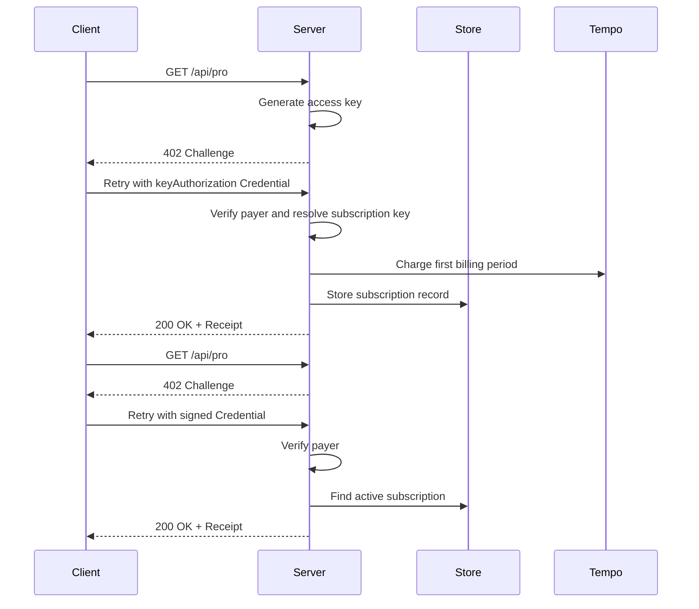
```mermaid
sequenceDiagram
  participant Client
  participant Server
  participant Store
  participant Tempo
  Client->>Server: GET /api/pro
  Server->>Server: Generate access key
  Server-->>Client: 402 Challenge
  Client->>Server: Retry with keyAuthorization Credential
  Server->>Server: Verify payer and resolve subscription key
  Server->>Tempo: Charge first billing period
  Server->>Store: Store subscription record
  Server-->>Client: 200 OK + Receipt
  Client->>Server: GET /api/pro
  Server-->>Client: 402 Challenge
  Client->>Server: Retry with signed Credential
  Server->>Server: Verify payer
  Server->>Store: Find active subscription
  Server-->>Client: 200 OK + Receipt

```

## Install `mppx`

:::code-group
```bash [npm]
$ npm install mppx viem
```

```bash [pnpm]
$ pnpm add mppx viem
```

```bash [bun]
$ bun add mppx viem
```
:::

## Create the subscription method

Create one `Mppx` instance and register `tempo.subscription()`.

```ts twoslash [mppx.server.ts]
import { Mppx, Store, tempo } from 'mppx/server'

const store = Store.memory()

export const mppx = Mppx.create({
  methods: [
    tempo.subscription({
      amount: '1.00',
      currency: '0x20c0000000000000000000000000000000000000',
      periodCount: '1',
      periodUnit: 'week',
      recipient: '0xf39Fd6e51aad88F6F4ce6aB8827279cffFb92266',
      requireCredential: true,
      resolve: async ({ source }) => {
        if (!source) return null
        return { key: `payer:${source.chainId}:${source.address}:plan:pro` }
      },
      store,
      subscriptionExpires: new Date('2027-01-01T00:00:00.000Z'),
      testnet: true,
    }),
  ],
})
```

This setup bootstraps automatically. Before the payer is known, `resolve` returns `null` and the SDK generates an access key for the Challenge. After the client signs, the SDK verifies the payer and calls `resolve` again with `source` to bind the subscription to that payer. Keep `requireCredential: true` so later requests also prove the payer identity. No separate bootstrap endpoint or client-supplied user ID is needed.

:::warning
Use a durable atomic store in production. `Store.memory()` loses subscription state when the process restarts.
:::

## Gate the API route

Call `mppx.tempo.subscription({})` before returning paid data.

```ts twoslash [route.ts]
import { Mppx, Store, tempo } from 'mppx/server'

const store = Store.memory()

const mppx = Mppx.create({
  methods: [
    tempo.subscription({
      amount: '1.00',
      currency: '0x20c0000000000000000000000000000000000000',
      periodCount: '1',
      periodUnit: 'week',
      recipient: '0xf39Fd6e51aad88F6F4ce6aB8827279cffFb92266',
      requireCredential: true,
      resolve: async ({ source }) => {
        if (!source) return null
        return { key: `payer:${source.chainId}:${source.address}:plan:pro` }
      },
      store,
      subscriptionExpires: new Date('2027-01-01T00:00:00.000Z'),
      testnet: true,
    }),
  ],
})
// ---cut---

export async function GET(request: Request) {
  const result = await mppx.tempo.subscription({})(request)

  if (result.status === 402) return result.challenge

  return result.withReceipt(
    Response.json({
      limits: { requests: 100_000 },
      plan: 'pro',
    }),
  )
}
```

The first unpaid request returns `402`. After the client activates the subscription, the same route returns `200` with a `Payment-Receipt` header.

## Configure the client

Register `tempo.subscription()` on the client. The SDK handles the `402` response, signs the key authorization, and retries the request.

### Accounts SDK

```ts twoslash [client.ts]
import { Mppx, tempo } from 'mppx/client'
import { Provider } from 'accounts'

const provider = Provider.create({ mpp: false }) // Avoid double 402 handling; mppx is configured below.
await provider.request({ method: 'wallet_connect' })

Mppx.create({
  methods: [tempo.subscription({
      account: provider.getAccount({ signable: true }),
      getClient: provider.getClient,
    })],
})

const response = await fetch('https://api.example.com/api/pro')

console.log(response.status)
// @log: 200
```

### viem

```ts twoslash [client.ts]
import { Mppx, tempo } from 'mppx/client'
import { privateKeyToAccount } from 'viem/accounts'

const account = privateKeyToAccount('0xabc…123')

Mppx.create({
  methods: [tempo.subscription({ account })],
})

const response = await fetch('https://api.example.com/api/pro')

console.log(response.status)
// @log: 200
```

## Advanced options

### Cancel a subscription

Cancellation is a server-side state change. Have the client call your cancellation endpoint, then mark the active subscription record with `canceledAt`; the next paid request returns `402` and requires a new subscription activation.

```ts [client.ts]
await fetch('/api/subscription/cancel', {
  method: 'POST',
})
```

```ts twoslash [cancel.ts]
import { Store } from 'mppx/server'
import { Subscription } from 'mppx/tempo'

const store = Store.memory()
const subscriptions = Subscription.fromStore(store)

export async function cancelSubscription(userId: string) {
  const subscription = await subscriptions.getByKey(`user:${userId}:plan:pro`)
  if (!subscription) return false

  await subscriptions.put({
    ...subscription,
    canceledAt: new Date().toISOString(),
  })

  return true
}
```

Keep the canceled record instead of deleting it. That preserves Receipts and prevents in-flight renewals from clearing the cancellation marker.

### Revoke the access key

On Tempo, clients can also revoke the authorized access key. Do this after server cancellation when you want a wallet-level backstop against future renewals.

```ts twoslash [revoke.ts]
import { createClient, http } from 'viem'
import { tempo } from 'viem/chains'
import { privateKeyToAccount } from 'viem/accounts'
import { Actions } from 'viem/tempo'

const client = createClient({
  account: privateKeyToAccount(
    '0x0000000000000000000000000000000000000000000000000000000000000001', // your account
  ),
  chain: tempo,
  transport: http(),
})

await Actions.accessKey.revokeSync(client, {
  accessKey: '0x70997970C51812dc3A010C7d01b50e0d17dc79C8',
})
```

Revoking the access key doesn't cancel the merchant-side subscription record. If the client only revokes the key, the server can still reuse an already-paid period until it tries to renew.

### Renew in the background

Subscriptions renew when a request arrives after the next billing period starts. For proactive billing, run `tempo.renewSubscription()` from a background job.

```ts twoslash [renew.ts]
import type { Store } from 'mppx/server'
import { tempo } from 'mppx/server'

declare const store: Store.AtomicStore<Record<string, unknown>>

const result = await tempo.renewSubscription({
  store,
  subscriptionId: 'sub_abc123',
})

if (result) console.log(result.receipt.status)
```

## Production checklist

* Store subscription records in a durable atomic store.
* Mark canceled subscriptions with `canceledAt` and keep their records for audit.
* Use authenticated user or organization IDs in `resolve`.
* Set `subscriptionExpires` to the maximum authorization lifetime you accept.
* Add webhook or cron coverage for background renewals if access must stay warm.
* Persist `subscriptionId` and `externalId` in your app database for support and reconciliation.

## Next steps

* Read the [Tempo subscription overview](/payment-methods/tempo/subscription).
* Review [`tempo.subscription` server API](/sdk/typescript/server/Method.tempo.subscription).
* Review [`tempo.subscription` client API](/sdk/typescript/client/Method.tempo.subscription).

# Use MPP with x402 \[Connect existing x402 services and clients]

MPP and x402 are complementary protocols. You can add MPP to an x402 client or server with a few lines of code while preserving x402 support.

## Protocol comparison

See [MPP vs x402](/mpp-vs-x402) for a full comparison.

| | x402 | MPP |
|---|---|---|
| **Challenge** | `PAYMENT-REQUIRED` header | `WWW-Authenticate: Payment` header |
| **Credential** | `PAYMENT-SIGNATURE` header | `Authorization: Payment` or an advertised alternate field |
| **Receipt** | `PAYMENT-RESPONSE` header | `Payment-Receipt` header |
| **Flow used here** | x402 v2 EIP-3009 `exact` | EVM `charge` |
| **Payment rails** | Registered blockchain network mechanisms | Stablecoins, cards, Lightning, and custom methods |
| **Error format** | Custom | [RFC 9457](https://www.rfc-editor.org/rfc/rfc9457) Problem Details |
| **Idempotency** | Optional Payment Identifier extension | Challenge identity plus standard `Idempotency-Key` guidance |

## Server

Choose the server setup that matches your current integration shape:

1. **Add MPP to an x402 server**—keep your existing x402 route table and resource server, then wrap them with `mppx`.
2. **Start with `mppx`**—create a new route that serves native MPP and x402 clients.

### Add MPP to an x402 server

Install `mppx`. Keep your existing x402 SDK packages and configuration.

:::code-group
```bash [npm]
$ npm install mppx viem
```

```bash [pnpm]
$ pnpm add mppx viem
```

```bash [bun]
$ bun add mppx viem
```
:::

Start with your existing x402 SDK route:

```ts [server.ts]
import { HTTPFacilitatorClient, type RoutesConfig, x402ResourceServer } from '@x402/core/server'
import { ExactEvmScheme } from '@x402/evm/exact/server'
import { paymentMiddleware } from '@x402/express'
import express from 'express'

const app = express()
const facilitator = new HTTPFacilitatorClient({
  url: 'https://x402.org/facilitator',
})
const resourceServer = new x402ResourceServer(facilitator).register(
  'eip155:84532',
  new ExactEvmScheme(),
)
const routes = {
  'GET /api/data': {
    accepts: [
      {
        network: 'eip155:84532',
        payTo: '0xf39Fd6e51aad88F6F4ce6aB8827279cffFb92266',
        price: '$0.01',
        scheme: 'exact',
      },
    ],
    description: 'Premium data access',
    mimeType: 'application/json',
  },
} satisfies RoutesConfig

app.use(paymentMiddleware(routes, resourceServer))

app.get('/api/data', (req, res) => {
  res.json({ data: 'premium content' })
})
```

Replace the x402 middleware import with the MPP compatibility wrapper. Keep the route table, resource server, facilitator, and handler unchanged:

```ts [server.ts]
import { HTTPFacilitatorClient, type RoutesConfig, x402ResourceServer } from '@x402/core/server'
import { ExactEvmScheme } from '@x402/evm/exact/server'
import express from 'express'
import { mpp } from 'mppx/x402/express' // [!code focus]

const app = express()
const facilitator = new HTTPFacilitatorClient({
  url: 'https://x402.org/facilitator',
})
const resourceServer = new x402ResourceServer(facilitator).register(
  'eip155:84532',
  new ExactEvmScheme(),
)
const routes = {
  'GET /api/data': {
    accepts: [
      {
        network: 'eip155:84532',
        payTo: '0xf39Fd6e51aad88F6F4ce6aB8827279cffFb92266',
        price: '$0.01',
        scheme: 'exact',
      },
    ],
    description: 'Premium data access',
    mimeType: 'application/json',
  },
} satisfies RoutesConfig

const secretKey = process.env.MPP_SECRET_KEY
if (!secretKey) throw new Error('Set MPP_SECRET_KEY to at least 32 random bytes.')

app.use(mpp(routes, resourceServer, { secretKey })) // [!code focus]

app.get('/api/data', (req, res) => {
  res.json({ data: 'premium content' })
})
```

The wrapper delegates x402 Credentials, lifecycle hooks, verification, and settlement to the official x402 adapter. For the first compatible extension-free EIP-3009 `exact` requirement, it also advertises native Tempo and source-chain EVM MPP Challenges. The source-chain MPP option verifies and settles through the same x402 resource server. Requirements with x402 extensions remain x402-only so their semantics aren't lost.

:::note
The x402 compatibility wrapper converts atomic payment requirements to display units automatically, so keep your existing x402 route configuration unchanged. When configuring `mppx.evm.charge` directly, convert atomic amounts first—for six-decimal USDC, `10000` becomes `0.01`.
:::

#### Use another x402 adapter

The same compatibility layer wraps official Hono, Next.js, and MCP integrations:

| Runtime | Import | Wrapper |
|---|---|---|
| Express | `mppx/x402/express` | [`mpp(routes, server, config)`](/sdk/typescript/x402/express) |
| Hono | `mppx/x402/hono` | [`mpp(routes, server, config)`](/sdk/typescript/x402/hono) |
| MCP | `mppx/x402/mcp` | [`mpp(server, config)(handler)`](/sdk/typescript/x402/mcp) |
| Next.js proxy | `mppx/x402/next` | [`mppProxy(routes, server, config)`](/sdk/typescript/x402/next) |
| Next.js route | `mppx/x402/next` | [`mpp(handler, route, server, config)`](/sdk/typescript/x402/next) |

### Run x402 inline with `mppx`

For a new service, configure `mppx` directly when one route must serve native MPP and x402 clients.

```ts [server.ts]
import { Mppx, evm } from 'mppx/express'
import express from 'express'

const app = express()

const mppx = Mppx.create({
  methods: [
    evm.charge({
      currency: evm.assets.baseSepolia.USDC,
      recipient: '0xf39Fd6e51aad88F6F4ce6aB8827279cffFb92266',
      // [!code focus:start]
      x402: {
        facilitator: 'https://x402.org/facilitator',
      },
      // [!code focus:end]
    }),
  ],
  secretKey: process.env.MPP_SECRET_KEY ?? 'local-dev-secret',
})

app.get(
  '/api/data',
  mppx.evm.charge({
    amount: '0.01',
    description: 'Premium data access',
  }),
  (req, res) => {
    res.json({ data: 'premium content' })
  },
)
```

The handler stays unchanged. `mppx`:

* Returns MPP and x402 Challenges on `402` responses
* Accepts MPP and x402 Credentials
* Calls the configured facilitator to verify and settle x402 payments
* Returns the Receipt header that matches the client's protocol

This flow also supports body-bearing and route-scoped endpoints. Standard x402 clients don't need the optional `mppx` route-binding extension.

### Advanced server options

#### Require route-bound x402 Credentials

Keep the default `routeBinding: 'resource'` for compatibility with standard x402 clients. Set `routeBinding: 'required'` when every x402 Credential for a scoped route must include the `mppx` extension and a route-bound nonce.

```ts twoslash [server.ts]
import { evm } from 'mppx/server'

const method = evm.charge({
  currency: evm.assets.baseSepolia.USDC,
  recipient: '0xf39Fd6e51aad88F6F4ce6aB8827279cffFb92266',
  // [!code hl:start]
  x402: {
    facilitator: 'https://x402.org/facilitator',
    routeBinding: 'required',
  },
  // [!code hl:end]
})
```

The default compares the echoed resource URL and payment requirements, and verifies any body digest against the request. Required binding also cryptographically binds MPP scope, opaque values, and metadata, but excludes standard clients that don't implement the extension.

## Client

Use one `mppx` client for native MPP endpoints and standard or route-bound x402 exact endpoints.

### Pay from the CLI

Use the default protocol selection to prefer MPP and fall back to a compatible x402 `exact` offer:

```bash [terminal]
$ mppx https://api.example.com/paid
```

Pass `--protocol x402` when you need to require the x402 rail. The CLI uses the EVM account selected by `--account`, `MPPX_ACCOUNT`, or `MPPX_PRIVATE_KEY`.

```bash [terminal]
$ mppx https://api.example.com/paid --protocol x402
```

See the [CLI reference](/sdk/typescript/cli) for account and request options.

### Build a client for MPP and x402

### Direct

Create a server-only wallet.ts module, then import account wherever an example creates a local signing account.

```ts
import { privateKeyToAccount } from 'viem/accounts'

export const account = privateKeyToAccount(process.env.PRIVATE_KEY as `0x${string}`)
```

### Privy

Create an EVM wallet in Privy, fund it with the required currency on this page's network, and keep PRIVY\_APP\_SECRET server-side.

```bash
pnpm add @privy-io/node
```

Create a server-only privy.ts module, then import its account wherever an example configures account or feePayer.

```ts
import { PrivyClient } from '@privy-io/node'
import { createViemAccount } from '@privy-io/node/viem'

const privy = new PrivyClient({
  appId: process.env.PRIVY_APP_ID!,
  appSecret: process.env.PRIVY_APP_SECRET!,
})

export const account = createViemAccount(privy, {
  address: process.env.PRIVY_WALLET_ADDRESS as `0x${string}`,
  walletId: process.env.PRIVY_WALLET_ID!,
})
```

createViemAccount delegates signatures to the Privy wallet, so it replaces any local viem account in the examples on this page.

Start with an existing x402 fetch client:

```ts [client.ts]
import { x402Client } from '@x402/core/client'
import { ExactEvmScheme } from '@x402/evm/exact/client'
import { wrapFetchWithPayment } from '@x402/fetch'
import { privateKeyToAccount } from 'viem/accounts'

const account = privateKeyToAccount(
  '0x0123456789012345678901234567890123456789012345678901234567890123',
)

const client = new x402Client()
client.register('eip155:*', new ExactEvmScheme(account))

const fetchWithPayment = wrapFetchWithPayment(fetch, client)
const response = await fetchWithPayment('https://api.example.com/paid')

console.log(response.status)
// @log: 200
```

Replace the x402 wrapper with `Fetch.from`, register the same EVM account and asset policy, then add the MPP methods you want to support:

```ts twoslash [client.ts]
import { Fetch, evm, tempo } from 'mppx/client'
import { privateKeyToAccount } from 'viem/accounts'

const account = privateKeyToAccount(
  '0x0123456789012345678901234567890123456789012345678901234567890123',
)

const fetch = Fetch.from({ // [!code hl]
  acceptPaymentPolicy: {
    origins: ['https://api.example.com'],
  },
  methods: [
    evm.charge({
      account,
      currencies: [evm.assets.baseSepolia.USDC],
      maxAmount: '1.00',
    }),
    tempo.charge({ account }),
  ],
})

const response = await fetch('https://api.example.com/paid')
console.log(response.status)
// @log: 200
```

The same client now reads native MPP and x402 Challenges, then retries with the matching Credential header. It validates the resource, EIP-3009 token metadata, network, currency, and amount before signing an x402 offer.

### Control the x402 retry

Use `Mppx.create` when you need to inspect a selected x402 Challenge before signing. `preparePayment` selects the offer, and `setCredential` attaches the Credential as `PAYMENT-SIGNATURE`.

```ts twoslash [client.ts]
import { Mppx, evm } from 'mppx/client'
import { privateKeyToAccount } from 'viem/accounts'

const account = privateKeyToAccount(
  '0x0123456789012345678901234567890123456789012345678901234567890123',
)

const mppx = Mppx.create({
  methods: [
    evm.charge({
      account,
      currencies: [evm.assets.baseSepolia.USDC],
      maxAmount: '1.00',
    }),
  ],
  polyfill: false,
})

const request: RequestInit = {}
const challengeResponse = await mppx.rawFetch(
  'https://api.example.com/paid',
  request,
)
if (challengeResponse.status !== 402) throw new Error('Expected payment Challenge')

const payment = await mppx.preparePayment(challengeResponse, { request })
console.log(payment.challenge.request.amount)

const credential = await payment.createCredential()
const paidRequest = payment.setCredential(request, credential)
const response = await mppx.rawFetch(
  'https://api.example.com/paid',
  paidRequest,
)

console.log(response.status)
// @log: 200
```

## Next steps

[Accept one-time payments](/guides/one-time-payments) — Charge per request with a payment-gated API

[Payment Methods](/payment-methods) — Method-specific request schemas

[Server quickstart](/quickstart/server) — Learn how to charge for resources

# Managing agent spend \[Control automated payments with scoped budgets]

## Choose a signing account

### Direct

Create a server-only wallet.ts module, then import account wherever an example creates a local signing account.

```ts
import { privateKeyToAccount } from 'viem/accounts'

export const account = privateKeyToAccount(process.env.PRIVATE_KEY as `0x${string}`)
```

### Privy

Create an EVM wallet in Privy, fund it with the required currency on this page's network, and keep PRIVY\_APP\_SECRET server-side.

```bash
pnpm add @privy-io/node
```

Create a server-only privy.ts module, then import its account wherever an example configures account or feePayer.

```ts
import { PrivyClient } from '@privy-io/node'
import { createViemAccount } from '@privy-io/node/viem'

const privy = new PrivyClient({
  appId: process.env.PRIVY_APP_ID!,
  appSecret: process.env.PRIVY_APP_SECRET!,
})

export const account = createViemAccount(privy, {
  address: process.env.PRIVY_WALLET_ADDRESS as `0x${string}`,
  walletId: process.env.PRIVY_WALLET_ID!,
})
```

createViemAccount delegates signatures to the Privy wallet, so it replaces any local viem account in the examples on this page.

By building spending controls on top of MPP, agents can pay in the background while staying within the budget, time window, and tools you intended.

Spend management is independent of any one payment rail. Use the mechanism for the rail you are paying with, and bind each agent runtime to payment authority that matches the work it is allowed to do.

## Tempo

[Tempo access keys](https://docs.tempo.xyz/guide/use-accounts/authorize-access-keys) are delegated signing keys authorized by a wallet on Tempo. They let an agent transact with built in spend controls and policy, without needing to manage multiple wallets or addresses.

Use access keys to set:

* token spending limits
* limitations for specific contracts or functions
* recipient restrictions
* future-dated expiration dates

### Use an access key

Use your existing Tempo Wallet provider. This example asks the wallet to authorize a seven-day access key.

```ts [wallet.ts]
import { Expiry, Provider } from 'accounts'

export const provider = Provider.create()

const accessKey = {
  expiry: Expiry.days(7),
}

const { accounts } = await provider.request({
  method: 'wallet_connect',
  params: [{ capabilities: { authorizeAccessKey: accessKey } }],
})

const [account] = accounts

export const accessKeyAddress = account?.capabilities.keyAuthorization?.address
if (!accessKeyAddress) throw new Error('Access key was not authorized')
```

If the wallet is already connected, call `wallet_authorizeAccessKey` with the same `accessKey`.

### Add spending limits and scopes

Replace the basic `accessKey` object with limits and scopes when a runtime should only spend a fixed budget or call specific contracts, functions, or recipients. In this example, the key can spend up to 10 USDC per day and only transfer USDC to one recipient.

```ts [wallet.ts]
import { Expiry } from 'accounts'
import { numberToHex, parseUnits } from 'viem'
import { Scopes } from 'viem/tempo'

const usdc = '0x20C000000000000000000000b9537d11c60E8b50'
const recipientAddress = '0x0000000000000000000000000000000000000001'

const accessKey = {
  expiry: Expiry.days(7),
  limits: [
    {
      token: usdc,
      limit: numberToHex(parseUnits('10', 6)),
      period: 86_400,
    },
  ],
  scopes: [
    Scopes.tip20(usdc).transfer({
      recipients: [recipientAddress],
    }),
  ],
}
```

You can create separate keys for separate apps, tools, or deployments. Each key can have its own expiry, budget, scopes, recipients, and revocation path.

### Use the key with `mppx`

Pass the Tempo account to `mppx`. The access key address is optional, but useful when this runtime should use one specific delegated key.

```ts [payments.ts]
import { Mppx, tempo } from 'mppx/client'
import { accessKeyAddress, provider } from './wallet.js'

Mppx.create({
  methods: [
    tempo({
      account: provider.getAccount(),
      // Optionally pass the access key address that should sign this runtime's payments.
      ...provider.getMppxParameters({ accessKey: accessKeyAddress }),
    }),
  ],
})
```

Use `fetch` normally for unpaid requests, paid HTTP requests, and MCP transports that accept `fetch`. `mppx` only pays when the server returns a payment challenge, and the wallet signs with the requested access key when it can satisfy the challenge.

Pinning an access key keeps delegated runtimes isolated. If two deployments have different budgets or scopes, each can use its own key instead of relying on implicit key selection.

# Accept card payments \[Accept card payments with Stripe]

Accept card payments on your MPP-enabled API using [Stripe](/payment-methods/stripe). Clients pay with Visa, Mastercard, and other card networks—no stablecoin wallet required. The server uses Stripe's [Shared Payment Tokens (SPTs)](https://docs.stripe.com/agentic-commerce/concepts/shared-payment-tokens) to process payments through Stripe's existing rails.

:::info[Stripe account setup]
Machine payments must be enabled on your Stripe account before you can accept MPP payments. [Request access](https://docs.stripe.com/payments/machine#sign-up) through the Stripe Dashboard.
:::

## How it works

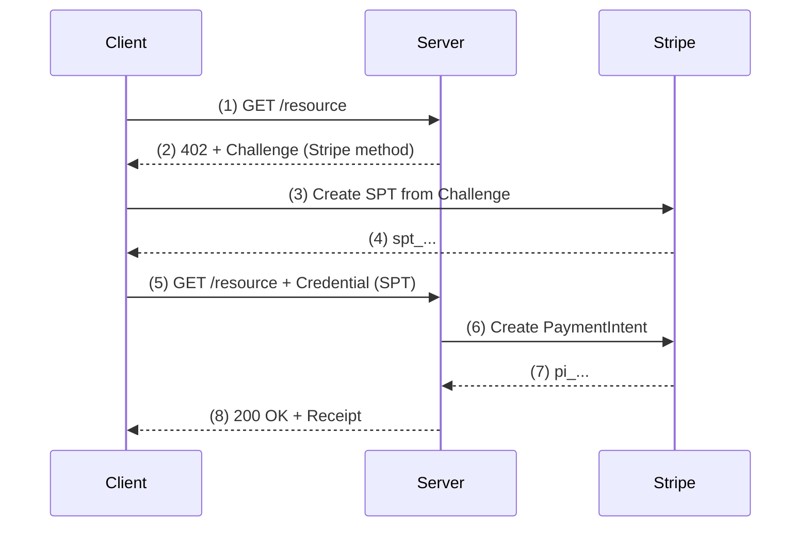
```mermaid
sequenceDiagram
  participant Client
  participant Server
  participant Stripe
  Client->>Server: (1) GET /resource
  Server-->>Client: (2) 402 + Challenge (Stripe method)
  Client->>Stripe: (3) Create SPT from Challenge
  Stripe-->>Client: (4) spt_...
  Client->>Server: (5) GET /resource + Credential (SPT)
  Server->>Stripe: (6) Create PaymentIntent
  Stripe-->>Server: (7) pi_...
  Server-->>Client: (8) 200 OK + Receipt

```

1. **Client** requests a paid resource.
2. **Server** responds with `402` and a Challenge containing the price, currency, and Stripe method details.
3. **Client** creates a Shared Payment Token (SPT) through the Stripe API.
4. **Client** retries the request with a Credential containing the SPT.
5. **Server** creates a Stripe `PaymentIntent` using the SPT, verifies payment, and returns the resource with a Receipt.

Settlement, refunds, and reporting all happen through your Stripe Dashboard—the same tools you use for any other Stripe payment.

## Prompt mode

Paste this into your coding agent to build the entire guide in one prompt:

```text
Use https://mpp.dev/guides/accept-card-payments.md as reference.
Add mppx to my app with a payment-gated endpoint that accepts
card payments via Stripe. Charge $1.00 per request using the
Stripe payment method. When payment is verified, return a JSON response.
```

## Server setup

::::steps
### Install dependencies

:::code-group
```bash [npm]
$ npm install mppx stripe
```

```bash [pnpm]
$ pnpm add mppx stripe
```

```bash [bun]
$ bun add mppx stripe
```
:::

### Set environment variables

Set your Stripe secret key and [Business Network](https://docs.stripe.com/get-started/account/profile) profile ID.

```dotenv [.env]
STRIPE_SECRET_KEY=sk_test_...
STRIPE_NETWORK_ID=your_network_id
```

### Create the server with Stripe payments

Set up an `Mppx` instance with the `stripe.spt` constructor. The `networkId` is your Stripe Business Network profile ID, and `paymentMethodTypes` controls which card types you accept.

```ts twoslash
import Stripe from 'stripe'
import { Mppx, stripe } from 'mppx/server'

const stripeClient = new Stripe(process.env.STRIPE_SECRET_KEY!)

const mppx = Mppx.create({
  methods: [
    stripe.spt({
      client: stripeClient,
      networkId: process.env.STRIPE_NETWORK_ID!,
      paymentMethodTypes: ['card'],
    }),
  ],
})
```

### Add a paid endpoint

Use `mppx.charge` to gate your endpoint. Set the `amount` in the smallest currency unit (cents for USD), and specify `currency` and `decimals`.

```ts twoslash
import Stripe from 'stripe'
import { Mppx, stripe } from 'mppx/server'

const stripeClient = new Stripe(process.env.STRIPE_SECRET_KEY!)

const mppx = Mppx.create({
  methods: [
    stripe.spt({
      client: stripeClient,
      networkId: process.env.STRIPE_NETWORK_ID!,
      paymentMethodTypes: ['card'],
    }),
  ],
})

// ---cut---
export async function handler(request: Request) {
  const result = await mppx.charge({
    amount: '100',
    currency: 'usd',
    decimals: 2,
    description: 'Premium API access',
  })(request)

  if (result.status === 402) return result.challenge

  return result.withReceipt(Response.json({ data: 'your response here' }))
}
```
::::

## Client setup

Use `stripe` with `Mppx.create` to handle `402` responses automatically. The client parses the Challenge, creates an SPT through the `createToken` callback, and retries with the Credential.

```ts twoslash
import { Mppx, stripe } from 'mppx/client'

Mppx.create({
  methods: [
    stripe({
      createToken: async (params) => {
        const res = await fetch('/api/create-spt', {
          body: JSON.stringify(params),
          headers: { 'Content-Type': 'application/json' },
          method: 'POST',
        })
        if (!res.ok) throw new Error('Failed to create SPT')
        return (await res.json()).spt
      },
      paymentMethod: 'pm_card_visa',
    }),
  ],
})

const response = await fetch('https://api.example.com/resource')
// @log: Response { status: 200, ... }
```

:::warning[Security: server-side authorization]
The `createToken` callback proxies through your own server because SPT creation requires a Stripe secret key. The server **must** derive SPT parameters (amount, currency, expiry) itself—never accept them from the client. See the [SPT creation proxy endpoint](/payment-methods/stripe/charge#spt-creation-proxy-endpoint) for a secure implementation.
:::

## Accept cards and stablecoins together

Stripe works alongside other payment methods. Add `tempo` to accept both cards and stablecoins on the same endpoint—clients pay with whichever rail they support.

```ts twoslash
import Stripe from 'stripe'
import { Mppx, stripe, tempo } from 'mppx/server'

const stripeClient = new Stripe(process.env.STRIPE_SECRET_KEY!)

const mppx = Mppx.create({
  methods: [
    stripe.spt({
      client: stripeClient,
      networkId: process.env.STRIPE_NETWORK_ID!,
      paymentMethodTypes: ['card'],
    }),
    tempo.charge({
      currency: '0x20c0000000000000000000000000000000000000',
      recipient: '0xf39Fd6e51aad88F6F4ce6aB8827279cffFb92266',
      testnet: true,
    }),
  ],
})
```

The server returns both methods in the `402` Challenge. See [Accept multiple payment methods](/guides/multiple-payment-methods) for a full walkthrough.

## Add a browser payment page

Set `html` on the Stripe method to render a Stripe Elements card form when a browser visits the endpoint. Programmatic clients with `Authorization` headers are unaffected.

```ts twoslash
import Stripe from 'stripe'
import { Mppx, stripe } from 'mppx/server'

const stripeClient = new Stripe(process.env.STRIPE_SECRET_KEY!)

const mppx = Mppx.create({
  methods: [
    stripe.spt({
      client: stripeClient,
      // [!code hl:start]
      html: {
        createTokenUrl: '/api/create-spt',
        publishableKey: process.env.STRIPE_PUBLISHABLE_KEY!,
      },
      // [!code hl:end]
      networkId: process.env.STRIPE_NETWORK_ID!,
      paymentMethodTypes: ['card'],
    }),
  ],
})
```

See [Create a payment link](/guides/payment-links) for a full walkthrough and live demo.

## Next steps

# Accept split payments \[Distribute a charge across multiple recipients]

## Choose a signing account

### Direct

Create a server-only wallet.ts module, then import account wherever an example creates a local signing account.

```ts
import { privateKeyToAccount } from 'viem/accounts'

export const account = privateKeyToAccount(process.env.PRIVATE_KEY as `0x${string}`)
```

### Privy

Create an EVM wallet in Privy, fund it with the required currency on this page's network, and keep PRIVY\_APP\_SECRET server-side.

```bash
pnpm add @privy-io/node
```

Create a server-only privy.ts module, then import its account wherever an example configures account or feePayer.

```ts
import { PrivyClient } from '@privy-io/node'
import { createViemAccount } from '@privy-io/node/viem'

const privy = new PrivyClient({
  appId: process.env.PRIVY_APP_ID!,
  appSecret: process.env.PRIVY_APP_SECRET!,
})

export const account = createViemAccount(privy, {
  address: process.env.PRIVY_WALLET_ADDRESS as `0x${string}`,
  walletId: process.env.PRIVY_WALLET_ID!,
})
```

createViemAccount delegates signatures to the Privy wallet, so it replaces any local viem account in the examples on this page.

Split a single charge across multiple recipients in one atomic transaction. The primary recipient receives the remainder after all splits are deducted.

Split payments are useful for:

* **Marketplaces** — route a platform fee to yourself and the rest to the seller
* **Referral programs** — pay a bounty to the referrer on every purchase
* **Revenue sharing** — distribute earnings across partners or contributors

## How it works

When you add `splits` to a charge, the SDK constructs multiple on-chain transfers in a single transaction:

1. Each split recipient receives their declared amount
2. The primary `recipient` receives `amount - sum(splits)`
3. The server verifies all transfers atomically

:::info
Split amounts are in human-readable units, the same as the top-level `amount`. The primary recipient's share is always implicit — you only declare the splits.
:::

## Server

Add a `splits` array to any `mppx.charge` call. Each entry specifies a `recipient` and `amount`.

```ts twoslash
import { Mppx, tempo } from 'mppx/server'

const mppx = Mppx.create({ methods: [tempo.charge()] })
// ---cut---
export async function handler(request: Request) {
  const result = await mppx.charge({
    amount: '1.00',
    currency: '0x20c0000000000000000000000000000000000000', // pathUSD
    recipient: '0xf39Fd6e51aad88F6F4ce6aB8827279cffFb92266', // seller
    // [!code hl:start]
    splits: [
      {
        amount: '0.10',
        recipient: '0x70997970C51812dc3A010C7d01b50e0d17dc79C8', // platform fee
      },
    ],
    // [!code hl:end]
  })(request)

  // seller receives $0.90, platform receives $0.10
  if (result.status === 402) return result.challenge
  return result.withReceipt(Response.json({ data: '...' }))
}
```

### With per-split memos

Each split can carry its own on-chain memo for reconciliation:

```ts twoslash
import { Mppx, tempo } from 'mppx/server'

const mppx = Mppx.create({ methods: [tempo.charge()] })

declare const request: Request
// ---cut---
const result = await mppx.charge({
  amount: '1.00',
  currency: '0x20c0000000000000000000000000000000000000', // pathUSD
  memo: '0x6f726465722d313233', // order-123
  recipient: '0xf39Fd6e51aad88F6F4ce6aB8827279cffFb92266', // seller
  splits: [
    {
      amount: '0.10',
      memo: '0x706c6174666f726d2d666565', // platform-fee // [!code hl]
      recipient: '0x70997970C51812dc3A010C7d01b50e0d17dc79C8', // platform
    },
  ],
})(request)
```

### With fee sponsorship

Split payments work with [fee sponsorship](/payment-methods/tempo#fee-sponsorship). The server co-signs the multi-transfer transaction so the client doesn't need gas tokens.

```ts twoslash
import { Mppx, tempo } from 'mppx/server'

const mppx = Mppx.create({ methods: [tempo.charge()] })

declare const request: Request
// ---cut---
const result = await mppx.charge({
  amount: '1.00',
  currency: '0x20c0000000000000000000000000000000000000', // pathUSD
  feePayer: true, // [!code hl]
  recipient: '0xf39Fd6e51aad88F6F4ce6aB8827279cffFb92266', // seller
  splits: [
    { amount: '0.05', recipient: '0x3C44CdDdB6a900fa2b585dd299e03d12FA4293BC' }, // referrer
    { amount: '0.10', recipient: '0x70997970C51812dc3A010C7d01b50e0d17dc79C8' }, // platform
  ],
})(request)
```

## Client

The client SDK handles split payments automatically — no client-side configuration is needed. When the server includes `splits` in the Challenge, the client constructs the matching multi-transfer transaction.

### Validate payment recipients

Use `expectedRecipients` to restrict every payment recipient the client signs for. Include the primary recipient and each split recipient. This prevents a compromised server from redirecting funds to unexpected addresses.

#### Accounts SDK

```ts twoslash
import { Provider } from 'accounts'
import { Mppx, tempo } from 'mppx/client'

const provider = Provider.create({ mpp: false }) // Avoid double 402 handling; mppx is configured below.
await provider.request({ method: 'wallet_connect' })
// ---cut---
Mppx.create({
  methods: [
    tempo.charge({
      account: provider.getAccount({ signable: true }),
      // [!code hl:start]
      expectedRecipients: [
        '0xf39Fd6e51aad88F6F4ce6aB8827279cffFb92266', // seller (primary)
        '0x70997970C51812dc3A010C7d01b50e0d17dc79C8', // platform
        '0x3C44CdDdB6a900fa2b585dd299e03d12FA4293BC', // referrer
      ],
      // [!code hl:end]
      getClient: provider.getClient,
    }),
  ],
})
```

#### viem

```ts twoslash
import { Mppx, tempo } from 'mppx/client'
import { privateKeyToAccount } from 'viem/accounts'

const account = privateKeyToAccount('0xabc…123')
// ---cut---
Mppx.create({
  methods: [
    tempo.charge({
      account,
      // [!code hl:start]
      expectedRecipients: [
        '0xf39Fd6e51aad88F6F4ce6aB8827279cffFb92266', // seller (primary)
        '0x70997970C51812dc3A010C7d01b50e0d17dc79C8', // platform
        '0x3C44CdDdB6a900fa2b585dd299e03d12FA4293BC', // referrer
      ],
      // [!code hl:end]
    }),
  ],
})
```

If the server sends a Challenge with a primary or split recipient not in the allowlist, the client throws an error before signing.

## Constraints

| Rule | Limit |
|------|-------|
| Splits per charge | 1–10 |
| Each split amount | Must be > 0 |
| Sum of all splits | Must be strictly less than `amount` |
| Split memo | Optional, 32-byte hex hash |

## Next steps

[Accept one-time payments](/guides/one-time-payments) — Charge per request with a payment-gated API

[Accept pay-as-you-go payments](/guides/pay-as-you-go) — Session-based billing with payment channels

[Server quickstart](/quickstart/server) — Learn how to charge for resources

# Accept multiple payment methods \[Stablecoins, cards, and Bitcoin on a single endpoint]

## Choose a signing account

### Direct

Create a server-only wallet.ts module, then import account wherever an example creates a local signing account.

```ts
import { privateKeyToAccount } from 'viem/accounts'

export const account = privateKeyToAccount(process.env.PRIVATE_KEY as `0x${string}`)
```

### Privy

Create an EVM wallet in Privy, fund it with the required currency on this page's network, and keep PRIVY\_APP\_SECRET server-side.

```bash
pnpm add @privy-io/node
```

Create a server-only privy.ts module, then import its account wherever an example configures account or feePayer.

```ts
import { PrivyClient } from '@privy-io/node'
import { createViemAccount } from '@privy-io/node/viem'

const privy = new PrivyClient({
  appId: process.env.PRIVY_APP_ID!,
  appSecret: process.env.PRIVY_APP_SECRET!,
})

export const account = createViemAccount(privy, {
  address: process.env.PRIVY_WALLET_ADDRESS as `0x${string}`,
  walletId: process.env.PRIVY_WALLET_ID!,
})
```

createViemAccount delegates signatures to the Privy wallet, so it replaces any local viem account in the examples on this page.

Build a payment-gated API that accepts [Tempo](/payment-methods/tempo) stablecoins, [Stripe](/payment-methods/stripe) cards, and [Lightning](/payment-methods/lightning) Bitcoin—all on the same endpoint. The server returns a `402` Challenge advertising every available method, and the client pays with whichever rail it supports.

:::info
MPP's multi-method support is additive. Each payment method is independent—you can start with one and add more at any time without changing your route handlers.
:::

## Prompt mode

Paste this into your coding agent to build the entire guide in one prompt:

```text
Use https://mpp.dev/guides/multiple-payment-methods.md as reference.
Add mppx to my app with a payment-gated endpoint that accepts
three payment methods: Tempo, Stripe, and Lightning. Charge $0.01 per request.
When payment is verified via any method, return a JSON response.
```

## How it works

When multiple methods are registered, the `402` response includes a `WWW-Authenticate` header for each one. The client picks the method it supports and sends the appropriate Credential.

```http
HTTP/1.1 402 Payment Required
WWW-Authenticate: Payment method="tempo", intent="charge", ...
WWW-Authenticate: Payment method="stripe", intent="charge", ...
WWW-Authenticate: Payment method="lightning", intent="charge", ...
```

The server verifies whichever Credential it receives. Intent shorthand such as `mppx.charge(options)` implicitly composes every registered method with that intent when they share compatible request units. Compose methods explicitly when one method needs different options—Lightning uses satoshis, while this guide prices Tempo and Stripe in US dollars.

## Server setup

::::steps
### Install dependencies

:::code-group
```bash [npm]
$ npm install mppx stripe @buildonspark/lightning-mpp-sdk viem
```

```bash [pnpm]
$ pnpm add mppx stripe @buildonspark/lightning-mpp-sdk viem
```

```bash [bun]
$ bun add mppx stripe @buildonspark/lightning-mpp-sdk viem
```
:::

### Configure payment methods

Register all three methods in a single `Mppx.create` call. Each method has its own configuration—Tempo needs a recipient address and currency, Stripe needs API credentials, and Lightning needs a wallet mnemonic.

```ts [server.ts]
import Stripe from 'stripe'
import { Mppx, stripe, tempo } from 'mppx/server'
import { spark } from '@buildonspark/lightning-mpp-sdk/server'

const stripeClient = new Stripe(process.env.STRIPE_SECRET_KEY!)

const mppx = Mppx.create({
  methods: [
    tempo.charge({
      currency: '0x20c0000000000000000000000000000000000000', // pathUSD on Tempo
      recipient: '0xf39Fd6e51aad88F6F4ce6aB8827279cffFb92266',
      testnet: true,
    }),
    stripe.spt({
      client: stripeClient,
      currency: 'usd',
      decimals: 2,
      networkId: 'internal',
      paymentMethodTypes: ['card'],
    }),
    spark.charge({
      mnemonic: process.env.MNEMONIC!,
    }),
  ],
  secretKey: process.env.MPP_SECRET_KEY || crypto.randomBytes(32).toString('base64'),
})
```

### Create a payment-gated route

Compose the methods explicitly so each offer receives an equivalent price in its native unit. Resolve the Lightning amount from a trusted BTC/USD price feed, then pass the dollar amount to Tempo and Stripe and the converted satoshi amount to Lightning.

```ts [server.ts]
import crypto from 'crypto'
import Stripe from 'stripe'
import { Mppx, stripe, tempo } from 'mppx/server'
import { spark } from '@buildonspark/lightning-mpp-sdk/server'

declare function quoteUsdInSats(usdAmount: string): Promise<string>

const stripeClient = new Stripe(process.env.STRIPE_SECRET_KEY!)

const mppx = Mppx.create({
  methods: [
    tempo.charge({
      currency: '0x20c0000000000000000000000000000000000000', // pathUSD on Tempo
      recipient: '0xf39Fd6e51aad88F6F4ce6aB8827279cffFb92266',
      testnet: true,
    }),
    stripe.spt({
      client: stripeClient,
      currency: 'usd',
      decimals: 2,
      networkId: 'internal',
      paymentMethodTypes: ['card'],
    }),
    spark.charge({
      mnemonic: process.env.MNEMONIC!,
    }),
  ],
  secretKey: process.env.MPP_SECRET_KEY || crypto.randomBytes(32).toString('base64'),
})

// [!code focus:start]
const description = 'Premium API access'
const usdAmount = '0.01'
const lightningSats = await quoteUsdInSats(usdAmount)
const charge = mppx.compose(
  [mppx.lightning.charge, { amount: lightningSats, description }],
  [mppx.stripe.charge, { amount: usdAmount, description }],
  [mppx.tempo.charge, { amount: usdAmount, description }],
)

Bun.serve({
  async fetch(request) {
    const result = await charge(request)

    if (result.status === 402) return result.challenge

    return result.withReceipt(Response.json({ message: 'Paid content' }))
  },
})
// [!code focus:end]
```

### Test via the `mppx` CLI

The `mppx` CLI uses Tempo by default. Each payment method has its own client SDK—see the individual method docs for client setup.

```bash [terminal]
# Validate the paid route
$ npx mppx validate http://localhost:3000

# Create and fund a testnet account
$ npx mppx account create --network testnet
$ npx mppx account fund --network testnet

# Make a paid request (pays with Tempo)
$ npx mppx http://localhost:3000
```
::::

## Framework examples

The `Mppx.create` configuration is the same across frameworks—only the route handler syntax changes. These examples resolve the Lightning quote at startup for brevity; refresh it before it becomes stale according to your pricing policy.

### Hono

```ts [server.ts]
import crypto from 'crypto'
import { Hono } from 'hono'
import Stripe from 'stripe'
import { Mppx, stripe, tempo } from 'mppx/hono'
import { spark } from '@buildonspark/lightning-mpp-sdk/server'

declare function quoteUsdInSats(usdAmount: string): Promise<string>

const app = new Hono()
const stripeClient = new Stripe(process.env.STRIPE_SECRET_KEY!)

const mppx = Mppx.create({
  methods: [
    tempo.charge({
      currency: '0x20c0000000000000000000000000000000000000', // pathUSD on Tempo
      recipient: '0xf39Fd6e51aad88F6F4ce6aB8827279cffFb92266',
      testnet: true,
    }),
    stripe.spt({
      client: stripeClient,
      currency: 'usd',
      decimals: 2,
      networkId: 'internal',
      paymentMethodTypes: ['card'],
    }),
    spark.charge({
      mnemonic: process.env.MNEMONIC!,
    }),
  ],
  secretKey: process.env.MPP_SECRET_KEY || crypto.randomBytes(32).toString('base64'),
})

const description = 'Premium API access'
const usdAmount = '0.01'
const lightningSats = await quoteUsdInSats(usdAmount)
const charge = mppx.compose(
  [mppx.lightning.charge, { amount: lightningSats, description }],
  [mppx.stripe.charge, { amount: usdAmount, description }],
  [mppx.tempo.charge, { amount: usdAmount, description }],
)

app.get(
  '/api/resource',
  charge,
  async (c) => c.json({ message: 'Paid content' }),
)
```

### Express

```ts [server.ts]
import crypto from 'crypto'
import express from 'express'
import Stripe from 'stripe'
import { Mppx, stripe, tempo } from 'mppx/express'
import { spark } from '@buildonspark/lightning-mpp-sdk/server'

declare function quoteUsdInSats(usdAmount: string): Promise<string>

const app = express()
const stripeClient = new Stripe(process.env.STRIPE_SECRET_KEY!)

const mppx = Mppx.create({
  methods: [
    tempo.charge({
      currency: '0x20c0000000000000000000000000000000000000', // pathUSD on Tempo
      recipient: '0xf39Fd6e51aad88F6F4ce6aB8827279cffFb92266',
      testnet: true,
    }),
    stripe.spt({
      client: stripeClient,
      currency: 'usd',
      decimals: 2,
      networkId: 'internal',
      paymentMethodTypes: ['card'],
    }),
    spark.charge({
      mnemonic: process.env.MNEMONIC!,
    }),
  ],
  secretKey: process.env.MPP_SECRET_KEY || crypto.randomBytes(32).toString('base64'),
})

const description = 'Premium API access'
const usdAmount = '0.01'
const lightningSats = await quoteUsdInSats(usdAmount)
const charge = mppx.compose(
  [mppx.lightning.charge, { amount: lightningSats, description }],
  [mppx.stripe.charge, { amount: usdAmount, description }],
  [mppx.tempo.charge, { amount: usdAmount, description }],
)

app.get(
  '/api/resource',
  charge,
  async (req, res) => res.json({ message: 'Paid content' }),
)
```

### Next.js

```ts [app/api/resource/route.ts]
import crypto from 'crypto'
import Stripe from 'stripe'
import { Mppx, stripe, tempo } from 'mppx/nextjs'
import { spark } from '@buildonspark/lightning-mpp-sdk/server'

declare function quoteUsdInSats(usdAmount: string): Promise<string>

const stripeClient = new Stripe(process.env.STRIPE_SECRET_KEY!)

const mppx = Mppx.create({
  methods: [
    tempo.charge({
      currency: '0x20c0000000000000000000000000000000000000', // pathUSD on Tempo
      recipient: '0xf39Fd6e51aad88F6F4ce6aB8827279cffFb92266',
      testnet: true,
    }),
    stripe.spt({
      client: stripeClient,
      currency: 'usd',
      decimals: 2,
      networkId: 'internal',
      paymentMethodTypes: ['card'],
    }),
    spark.charge({
      mnemonic: process.env.MNEMONIC!,
    }),
  ],
  secretKey: process.env.MPP_SECRET_KEY || crypto.randomBytes(32).toString('base64'),
})

const description = 'Premium API access'
const usdAmount = '0.01'
const lightningSats = await quoteUsdInSats(usdAmount)
const charge = mppx.compose(
  [mppx.lightning.charge, { amount: lightningSats, description }],
  [mppx.stripe.charge, { amount: usdAmount, description }],
  [mppx.tempo.charge, { amount: usdAmount, description }],
)

export const GET = charge(
  async () => Response.json({ message: 'Paid content' }),
)
```

## Method-specific configuration

Each payment method has its own parameters. Refer to the individual method docs for the full configuration reference:

## Client preferences

Clients can declare which payment methods they prefer by passing `paymentPreferences` to `Mppx.create`. This sends an `Accept-Payment` header on every request, and the server uses it to filter Challenges down to the methods the client supports.

### Accounts SDK

```ts twoslash
import { Provider } from 'accounts'
import { Mppx, stripe, tempo } from 'mppx/client'

const provider = Provider.create({ mpp: false }) // Avoid double 402 handling; mppx is configured below.
await provider.request({ method: 'wallet_connect' })

Mppx.create({
  methods: [
    tempo({
      account: provider.getAccount({ signable: true }),
      getClient: provider.getClient,
    }),
    stripe.charge({
      createToken: async (opts) => {
        const res = await fetch('/api/create-spt', {
          body: JSON.stringify(opts),
          headers: { 'Content-Type': 'application/json' },
          method: 'POST',
        })
        const { spt } = await res.json() as { spt: string }
        return spt
      },
    }),
  ],
  // [!code hl:start]
  paymentPreferences: ({ tempo, stripe }) => ({
    [tempo.charge]: 1,
    [stripe.charge]: 0.5,
    [tempo.session]: 0.2,
  }),
  // [!code hl:end]
})
```

### viem

```ts twoslash
import { Mppx, stripe, tempo } from 'mppx/client'
import { privateKeyToAccount } from 'viem/accounts'

const account = privateKeyToAccount('0x...')

Mppx.create({
  methods: [
    tempo({ account }),
    stripe.charge({
      createToken: async (opts) => {
        const res = await fetch('/api/create-spt', {
          method: 'POST',
          headers: { 'Content-Type': 'application/json' },
          body: JSON.stringify(opts),
        })
        const { spt } = await res.json() as { spt: string }
        return spt
      },
    }),
  ],
  // [!code hl:start]
  paymentPreferences: ({ tempo, stripe }) => ({
    [tempo.charge]: 1,
    [stripe.charge]: 0.5,
    [tempo.session]: 0.2,
  }),
  // [!code hl:end]
})
```

See the [`paymentPreferences` parameter reference](/sdk/typescript/client/Mppx.create#paymentpreferences-optional) for the full configuration options.

## Next steps

# Create a payment link \[Share a link. Get paid.]

Create a full payment page for any API endpoint—no frontend required. Share the link anywhere and users pay directly from the page.

## Supported methods

| Method | `html` type | What renders |
| --- | --- | --- |
| [`tempo`](/sdk/typescript/server/Method.tempo) | `boolean` or config object | "Continue with Tempo" wallet UI |
| [`stripe`](/sdk/typescript/server/Method.stripe) | Config object | Full Stripe Elements card form |
| [`solana.charge`](/payment-methods/solana/charge#payment-links) | `boolean` | "Continue with Solana" wallet UI |

For Tempo and Stripe, `html` also accepts an object so you can customize page text and theme without building a frontend.

## Demo

This is a live payment link. Click "Continue with Tempo" to pay $0.01 and receive a random photo from [Picsum](https://picsum.photos).

[Open the live payment link](https://mpp.dev/api/payment-link/photo) to pay $0.01 with Tempo and receive a photo.

## Prompt mode

Paste this into your coding agent to create a payment link in one prompt:

```text
Use https://mpp.dev/guides/payment-links.md as reference.
Add mppx to my app with a payment-gated photo endpoint
that charges $0.01 per request using the Tempo payment method with
PathUSD. Enable payment links so browsers can pay directly
from the page by setting html: true on the tempo.charge() method config.
When payment is verified, fetch a random photo from
https://picsum.photos/1024/1024 and return the URL as JSON.
```

## Manual mode

Select your framework to follow a step-by-step guide. If your framework isn't listed, choose **Other** for a generic [Fetch API](https://developer.mozilla.org/en-US/docs/Web/API/Fetch_API) approach compatible with most TypeScript server frameworks.

### Next.js

::::steps
### Install `mppx`

:::code-group
```bash [npm]
$ npm install mppx viem
```

```bash [pnpm]
$ pnpm add mppx viem
```

```bash [bun]
$ bun add mppx viem
```
:::

### Set up `Mppx` instance with `html: true`

```ts [app/api/photo/route.ts]
import crypto from 'crypto'
import { Mppx, tempo } from 'mppx/nextjs'

export const mppx = Mppx.create({
  methods: [tempo.charge({
    currency: '0x20c0000000000000000000000000000000000000',
    html: true, // [!code hl]
    recipient: '0xf39Fd6e51aad88F6F4ce6aB8827279cffFb92266',
    testnet: true,
  })],
  secretKey: process.env.MPP_SECRET_KEY || crypto.randomBytes(32).toString('base64'),
})
```

### Create the `/api/photo` route

Create the photo route with `mppx.charge`. Browsers see a payment page; programmatic clients get the standard `402` flow.

```ts [app/api/photo/route.ts]
import crypto from 'crypto'
import { Mppx, tempo } from 'mppx/nextjs'

export const mppx = Mppx.create({
  methods: [tempo.charge({
    currency: '0x20c0000000000000000000000000000000000000',
    html: true,
    recipient: '0xf39Fd6e51aad88F6F4ce6aB8827279cffFb92266',
    testnet: true,
  })],
  secretKey: process.env.MPP_SECRET_KEY || crypto.randomBytes(32).toString('base64'),
})

// [!code focus:start]
export const GET =
  mppx.charge({ amount: '0.01', description: 'Random stock photo' })
  (async () => {
    const res = await fetch('https://picsum.photos/1024/1024')
    return Response.json({ url: res.url })
  })
// [!code focus:end]
```

### Test in the browser

Open `http://localhost:3000/api/photo` in your browser. The server returns a payment page with a "Continue with Tempo" button. After payment, the page reloads with the photo URL.

Programmatic clients work the same way:

```bash [terminal]
$ npx mppx http://localhost:3000/api/photo
```
::::

### Hono

::::steps
### Install `mppx` and `hono`

:::code-group
```bash [npm]
$ npm install mppx hono viem
```

```bash [pnpm]
$ pnpm add mppx hono viem
```

```bash [bun]
$ bun add mppx hono viem
```
:::

### Set up `Mppx` instance with `html: true`

```ts [server.ts]
import crypto from 'crypto'
import { Hono } from 'hono'
import { Mppx, tempo } from 'mppx/hono'

const app = new Hono()

const mppx = Mppx.create({
  methods: [tempo.charge({
    currency: '0x20c0000000000000000000000000000000000000',
    html: true, // [!code hl]
    recipient: '0xf39Fd6e51aad88F6F4ce6aB8827279cffFb92266',
    testnet: true,
  })],
  secretKey: process.env.MPP_SECRET_KEY || crypto.randomBytes(32).toString('base64'),
})
```

### Create the `/api/photo` route

```ts [server.ts]
import crypto from 'crypto'
import { Hono } from 'hono'
import { Mppx, tempo } from 'mppx/hono'

const app = new Hono()

const mppx = Mppx.create({
  methods: [tempo.charge({
    currency: '0x20c0000000000000000000000000000000000000',
    html: true,
    recipient: '0xf39Fd6e51aad88F6F4ce6aB8827279cffFb92266',
    testnet: true,
  })],
  secretKey: process.env.MPP_SECRET_KEY || crypto.randomBytes(32).toString('base64'),
})

// [!code focus:start]
app.get(
  '/api/photo',
  mppx.charge({ amount: '0.01', description: 'Random stock photo' }),
  async (c) => {
    const res = await fetch('https://picsum.photos/1024/1024')
    return c.json({ url: res.url })
  },
)
// [!code focus:end]
```

### Test in the browser

Open `http://localhost:3000/api/photo` in your browser.

```bash [terminal]
$ npx mppx http://localhost:3000/api/photo
```
::::

### Express

::::steps
### Install `mppx` and `express`

:::code-group
```bash [npm]
$ npm install mppx express viem
```

```bash [pnpm]
$ pnpm add mppx express viem
```

```bash [bun]
$ bun add mppx express viem
```
:::

### Set up `Mppx` instance with `html: true`

```ts [server.ts]
import crypto from 'crypto'
import express from 'express'
import { Mppx, tempo } from 'mppx/express'

const app = express()

const mppx = Mppx.create({
  methods: [tempo.charge({
    currency: '0x20c0000000000000000000000000000000000000',
    html: true, // [!code hl]
    recipient: '0xf39Fd6e51aad88F6F4ce6aB8827279cffFb92266',
    testnet: true,
  })],
  secretKey: process.env.MPP_SECRET_KEY || crypto.randomBytes(32).toString('base64'),
})
```

### Create the `/api/photo` route

```ts [server.ts]
import crypto from 'crypto'
import express from 'express'
import { Mppx, tempo } from 'mppx/express'

const app = express()

const mppx = Mppx.create({
  methods: [tempo.charge({
    currency: '0x20c0000000000000000000000000000000000000',
    html: true,
    recipient: '0xf39Fd6e51aad88F6F4ce6aB8827279cffFb92266',
    testnet: true,
  })],
  secretKey: process.env.MPP_SECRET_KEY || crypto.randomBytes(32).toString('base64'),
})

// [!code focus:start]
app.get(
  '/api/photo',
  mppx.charge({ amount: '0.01', description: 'Random stock photo' }),
  async (req, res) => {
    const response = await fetch('https://picsum.photos/1024/1024')
    res.json({ url: response.url })
  },
)
// [!code focus:end]
```

### Test in the browser

Open `http://localhost:3000/api/photo` in your browser.

```bash [terminal]
$ npx mppx http://localhost:3000/api/photo
```
::::

### Other

This guide walks through using `mppx/server` directly with any [Fetch API](https://developer.mozilla.org/en-US/docs/Web/API/Fetch_API)-compatible framework: [Bun](https://bun.sh), [Deno](https://deno.com), [Cloudflare Workers](https://workers.dev), and others.

<div className="h-6" />

::::steps
### Install `mppx`

:::code-group
```bash [npm]
$ npm install mppx viem
```

```bash [pnpm]
$ pnpm add mppx viem
```

```bash [bun]
$ bun add mppx viem
```
:::

### Set up `Mppx` instance with `html: true`

```ts [server.ts]
import crypto from 'crypto'
import { Mppx, tempo } from 'mppx/server'

const mppx = Mppx.create({
  methods: [tempo.charge({
    currency: '0x20c0000000000000000000000000000000000000',
    html: true, // [!code hl]
    recipient: '0xf39Fd6e51aad88F6F4ce6aB8827279cffFb92266',
    testnet: true,
  })],
  secretKey: process.env.MPP_SECRET_KEY || crypto.randomBytes(32).toString('base64'),
})
```

### Create the handler

The server detects the `Accept` header and returns a payment page for browsers. Programmatic clients get the standard `402` flow.

```ts [server.ts]
import crypto from 'crypto'
import { Mppx, tempo } from 'mppx/server'

const mppx = Mppx.create({
  methods: [tempo.charge({
    currency: '0x20c0000000000000000000000000000000000000',
    html: true,
    recipient: '0xf39Fd6e51aad88F6F4ce6aB8827279cffFb92266',
    testnet: true,
  })],
  secretKey: process.env.MPP_SECRET_KEY || crypto.randomBytes(32).toString('base64'),
})

// [!code focus:start]
Bun.serve({
  async fetch(request) {
    const result = await mppx.charge({
      amount: '0.01',
      description: 'Random stock photo',
    })(request)

    if (result.status === 402) return result.challenge

    const res = await fetch('https://picsum.photos/1024/1024')
    return result.withReceipt(Response.json({ url: res.url }))
  },
})
// [!code focus:end]
```

### Test in the browser

Open `http://localhost:3000` in your browser.

```bash [terminal]
$ npx mppx http://localhost:3000
```
::::

## Next steps

# Monetize your MCP server \[Charge for tool calls with MPP]

Add per-call payments to any [MCP](https://modelcontextprotocol.io) server. When an agent calls a paid tool, the server issues a Challenge, the agent pays, and the tool executes—all within the MCP protocol. No API keys or billing portals required.

## How it works

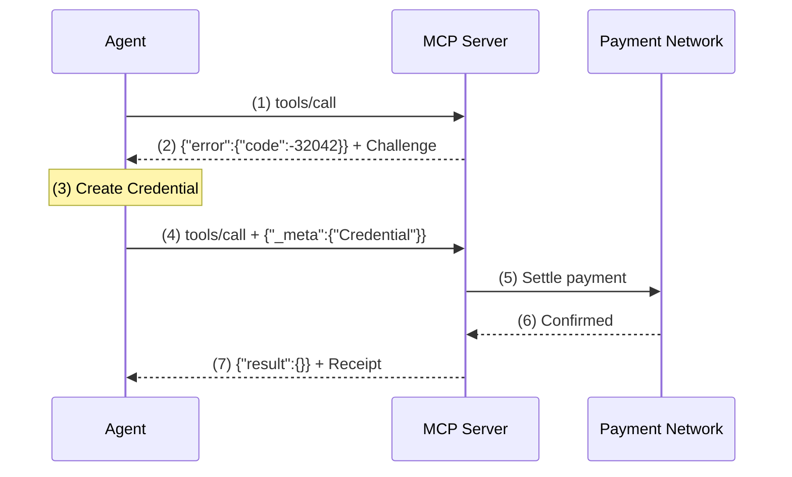
```mermaid
sequenceDiagram
  participant A as Agent
  participant S as MCP Server
  participant N as Payment Network
  A->>S: (1) tools/call
  S-->>A: (2) {"error":{"code":-32042}} + Challenge
  Note over A: (3) Create Credential
  A->>S: (4) tools/call + {"_meta":{"Credential"}}
  S->>N: (5) Settle payment
  N-->>S: (6) Confirmed
  S-->>A: (7) {"result":{}} + Receipt

```

1. **Agent** calls a tool on the MCP server
2. **Server** responds with JSON-RPC error code `-32042` and a Challenge specifying the price
3. **Agent** creates a Credential (payment proof) from the Challenge
4. **Agent** retries the tool call with the Credential in `_meta`
5. **Server** verifies the Credential and settles the payment on-chain
6. **Network** confirms the payment
7. **Server** returns the tool result with a Receipt in `_meta`

This maps directly to the standard MPP Challenge → Credential → Receipt flow, encoded as JSON-RPC instead of HTTP headers. See the [MCP transport spec](/protocol/transports/mcp) for the full encoding.

:::info
This guide uses the MCP transport, so Challenge, Credential, and Receipt data travel as native JSON in `error.data` and `_meta`. The base64url-encoded `request` and `opaque` auth-params apply to the HTTP transport.
:::

## Prompt mode

Paste this into your coding agent to build a paid MCP server in one prompt:

```text
Use https://mpp.dev/guides/monetize-mcp-server.md as reference.
Build an MCP server with mppx that charges $0.01 per tool call 
using the Tempo payment method. Use @modelcontextprotocol/sdk 
for the MCP server and Transport.mcpSdk() for the payment transport.
```

## Manual mode

::::steps
### Install dependencies

:::code-group
```bash [npm]
$ npm install mppx @modelcontextprotocol/sdk viem
```

```bash [pnpm]
$ pnpm add mppx @modelcontextprotocol/sdk viem
```

```bash [bun]
$ bun add mppx @modelcontextprotocol/sdk viem
```
:::

### Create the MCP server

Set up a standard MCP server with a tool. This tool is **currently free**.

```ts [server.ts]
import { McpServer } from '@modelcontextprotocol/sdk/server/mcp'
import { StdioServerTransport } from '@modelcontextprotocol/sdk/server/stdio'

const server = new McpServer({ name: 'my-service', version: '1.0.0' })

// [!code focus:start]
server.registerTool(
  'search',
  { description: 'Search the web' },
  async ({ query }) => ({
    content: [{ type: 'text', text: `Results for: ${query}` }],
  }),
)
// [!code focus:end]

const transport = new StdioServerTransport()
await server.connect(transport)
```

### Add `mppx` with the MCP transport

Create an `Mppx` instance with `Transport.mcpSdk()`. This tells `mppx` to encode Challenges and Receipts as JSON-RPC messages instead of HTTP headers.

```ts [server.ts]
import { McpServer } from '@modelcontextprotocol/sdk/server/mcp'
import { StdioServerTransport } from '@modelcontextprotocol/sdk/server/stdio'
import { Mppx, tempo, Transport } from 'mppx/server' // [!code ++]

// [!code focus:start]
const mppx = Mppx.create({
  methods: [tempo.charge({
    testnet: true,
    currency: '0x20c0000000000000000000000000000000000000',
    recipient: '0xf39Fd6e51aad88F6F4ce6aB8827279cffFb92266',
  })],
  transport: Transport.mcpSdk(), // [!code hl]
})
// [!code focus:end]

const server = new McpServer({ name: 'my-service', version: '1.0.0' })

server.registerTool(
  'search',
  { description: 'Search the web' },
  async ({ query }) => ({
    content: [{ type: 'text', text: `Results for: ${query}` }],
  }),
)

const transport = new StdioServerTransport()
await server.connect(transport)
```

### Add `.charge` to the tool handler

Call `mppx.charge` inside the tool handler. If the agent hasn't paid, throw the Challenge. Otherwise, attach a Receipt to the result.

```ts [server.ts]
import { McpServer } from '@modelcontextprotocol/sdk/server/mcp'
import { StdioServerTransport } from '@modelcontextprotocol/sdk/server/stdio'
import { Mppx, tempo, Transport } from 'mppx/server'

const mppx = Mppx.create({
  methods: [tempo.charge({
    testnet: true,
    currency: '0x20c0000000000000000000000000000000000000',
    recipient: '0xf39Fd6e51aad88F6F4ce6aB8827279cffFb92266',
  })],
  transport: Transport.mcpSdk(),
})

const server = new McpServer({ name: 'my-service', version: '1.0.0' })

// [!code focus:start]
server.registerTool(
  'search',
  { description: 'Search the web' },
  async ({ query }, extra) => {
    const result = await mppx.charge({ // [!code ++]
      amount: '0.01', // [!code ++]
      description: 'Web search query', // [!code ++]
    })(extra) // [!code ++]

    if (result.status === 402) throw result.challenge // [!code ++]

    return result.withReceipt({ // [!code ++]
      content: [{ type: 'text', text: `Results for: ${query}` }],
    })
  },
)
// [!code focus:end]

const mcpTransport = new StdioServerTransport()
await server.connect(mcpTransport)
```

Three lines turn a free tool into a paid one:

* **`mppx.charge()`** checks for a valid Credential in the tool call's `_meta`
* **`throw result.challenge`** sends a `-32042` error with the payment requirements
* **`result.withReceipt()`** attaches a Receipt to the tool result

### Test with the `mppx` CLI

```bash [terminal]
# Create and fund a testnet account
$ npx mppx account create --network testnet
$ npx mppx account fund --network testnet

# Start the server and call the tool
$ echo '{"method":"tools/call","params":{"name":"search","arguments":{"query":"hello"}}}' | node server.ts
```
::::

## Multiple payment offers

Use instance `compose()` when one MCP tool accepts multiple methods, currencies, or prices. The server returns every offer in one payment-required Challenge list. The client's Credential selects one offer, and `mppx` dispatches it to exactly one matching handler.

```ts
// [!code hl:start]
const result = await mppx.compose(
  [mppx.tempo.charge, { amount: '0.01', currency: pathUSD }],
  [mppx.tempo.charge, { amount: '0.01', currency: USDCe }],
)(extra)
// [!code hl:end]

if (result.status === 402) throw result.challenge
return result.withReceipt({
  content: [{ text: 'Paid result', type: 'text' }],
})
```

Pass configured handler references such as `mppx.tempo.charge` instead of string keys when they're available. Every composed method must use the configured MCP transport. HTTP-only `canOffer` and `selectOffers` policies don't run for MCP composition.

## Multiple tools with different prices

Set different prices per tool. Free tools don't need `mppx.charge` at all.

```ts [server.ts]
import { McpServer } from '@modelcontextprotocol/sdk/server/mcp'
import { StdioServerTransport } from '@modelcontextprotocol/sdk/server/stdio'
import { Mppx, tempo, Transport } from 'mppx/server'

const mppx = Mppx.create({
  methods: [tempo.charge({
    testnet: true,
    currency: '0x20c0000000000000000000000000000000000000',
    recipient: '0xf39Fd6e51aad88F6F4ce6aB8827279cffFb92266',
  })],
  transport: Transport.mcpSdk(),
})

const server = new McpServer({ name: 'my-service', version: '1.0.0' })

// [!code focus:start]
// Free tool — no payment required
server.registerTool(
  'status',
  { description: 'Check service status' },
  async () => ({
    content: [{ type: 'text', text: 'OK' }],
  }),
)

// $0.01 per call
server.registerTool(
  'search',
  { description: 'Search the web' },
  async ({ query }, extra) => {
    const result = await mppx.charge({ amount: '0.01' })(extra)
    if (result.status === 402) throw result.challenge
    return result.withReceipt({
      content: [{ type: 'text', text: `Results for: ${query}` }],
    })
  },
)

// $0.10 per call
server.registerTool(
  'generate-image',
  { description: 'Generate an image from a prompt' },
  async ({ prompt }, extra) => {
    const result = await mppx.charge({ amount: '0.10' })(extra)
    if (result.status === 402) throw result.challenge
    return result.withReceipt({
      content: [{ type: 'text', text: `Image generated for: ${prompt}` }],
    })
  },
)
// [!code focus:end]

const transport = new StdioServerTransport()
await server.connect(transport)
```

## What the agent sees

Under the hood, the MCP transport encodes MPP Challenges, Credentials, and Receipts as JSON-RPC fields:

| MPP concept | MCP encoding |
|---|---|
| Challenge | Error code `-32042` with Challenges in `error.data` |
| Credential | `_meta["org.paymentauth/credential"]` on the tool call |
| Receipt | `_meta["org.paymentauth/receipt"]` on the tool result |

A payment-aware MCP client like [`McpClient.wrap`](/sdk/typescript/client/McpClient.wrap) handles this automatically—the agent doesn't need to know the encoding details.

## Specification

[MCP Transport](https://paymentauth.org/draft-payment-transport-mcp-00) — JSON-RPC encoding for Challenges, Credentials, and Receipts

[Charge Intent](https://paymentauth.org/draft-payment-intent-charge-00) — One-time payment request schema

## Next steps

# Add payments to WebMCP tools \[Charge for actions on your website]

[WebMCP](https://webmachinelearning.github.io/webmcp/) lets a website expose actions to an agent through JavaScript. `mppx` lets those actions call paid HTTP endpoints. The agent discovers the tool from the open page, and the page uses the visitor's connected wallet to complete the MPP payment.

This guide builds a paid `analyze_topic` tool. The tool costs `0.01` pathUSD on Tempo testnet and returns a payment Receipt with its result.

:::info
WebMCP and MCP use different transports. A WebMCP tool runs in the page and calls a paid HTTP endpoint, so the Challenge, Credential, and Receipt use HTTP headers. A remote MCP server uses the [MPP MCP transport](/protocol/transports/mcp) instead.
:::

## How it works

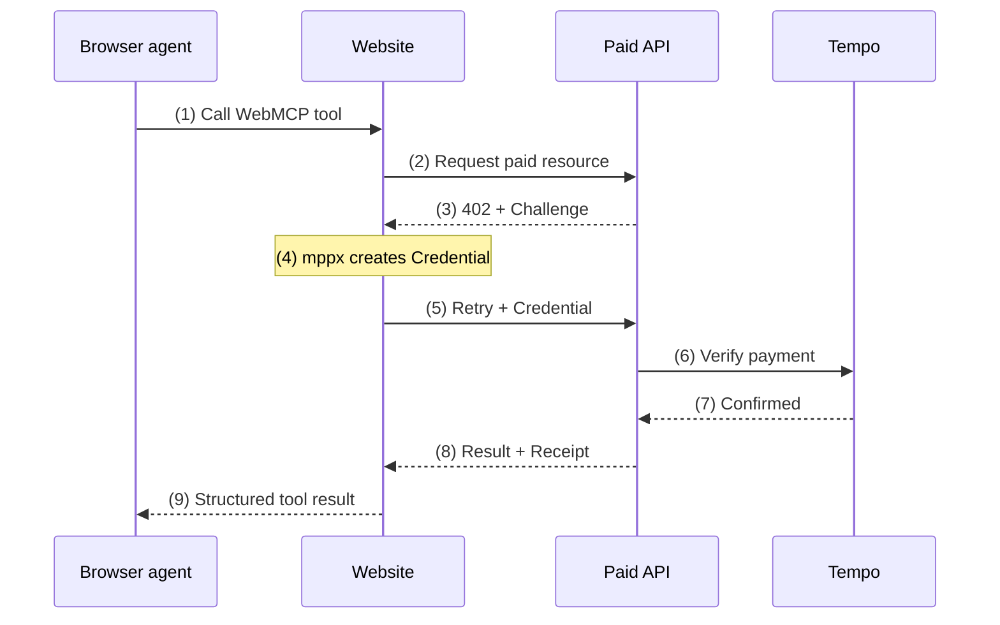
```mermaid
sequenceDiagram
  participant A as Browser agent
  participant P as Website
  participant S as Paid API
  participant N as Tempo
  A->>P: (1) Call WebMCP tool
  P->>S: (2) Request paid resource
  S-->>P: (3) 402 + Challenge
  Note over P: (4) mppx creates Credential
  P->>S: (5) Retry + Credential
  S->>N: (6) Verify payment
  N-->>S: (7) Confirmed
  S-->>P: (8) Result + Receipt
  P-->>A: (9) Structured tool result

```

1. The website registers a tool with `document.modelContext.registerTool()`.
2. The browser agent calls the tool with structured arguments.
3. The tool uses `mppx.fetch()` to request a paid endpoint.
4. `mppx` handles the `402` Challenge, creates a Credential with the connected wallet, and retries the request.
5. The server verifies payment before performing the paid work.
6. The tool returns the result and Receipt to the agent.

## Prompt mode

Paste this into your coding agent to add paid WebMCP tools to an existing site:

```text
Use https://mpp.dev/guides/webmcp-payments.md as reference.
Add a WebMCP tool named analyze_topic to my website. Register it with
document.modelContext.registerTool and call a same-origin HTTP endpoint
through mppx.fetch. Charge 0.01 pathUSD on Tempo testnet. Use the site's
existing wallet connection and return the Payment Receipt with the result.
Do not embed a private key in browser code.
```

## Manual mode

::::steps
### Install dependencies

This example uses [Hono](https://hono.dev) for the paid endpoint and the Tempo Accounts SDK for the browser wallet connection.

:::code-group
```bash [npm]
$ npm install accounts hono mppx viem
```

```bash [pnpm]
$ pnpm add accounts hono mppx viem
```

```bash [bun]
$ bun add accounts hono mppx viem
```
:::

### Protect the HTTP endpoint

Create a server-side `Mppx` instance and add a one-time charge to the endpoint. Replace `recipient` with the address that receives payments.

```ts [server.ts]
import { Hono } from 'hono'
import { Mppx, tempo } from 'mppx/hono'

const app = new Hono()

// [!code focus:start]
// [!code hl:start]
const mppx = Mppx.create({
  methods: [
    tempo.charge({
      currency: '0x20c0000000000000000000000000000000000000', // pathUSD on Tempo
      recipient: '0xf39Fd6e51aad88F6F4ce6aB8827279cffFb92266',
      testnet: true,
    }),
  ],
  secretKey: process.env.MPP_SECRET_KEY!,
})
// [!code hl:end]
// [!code focus:end]

app.use('/api/analyze', async (context, next) => {
  const topic = context.req.query('topic')?.trim()
  if (!topic) return context.json({ error: 'topic is required' }, 400)
  await next()
})

app.get(
  '/api/analyze',
  mppx.charge({
    amount: '0.01',
    description: 'Topic analysis',
  }),
  async (context) => {
    const topic = context.req.query('topic')
    return context.json({
      summary: `Analysis for ${topic}`,
      topic,
    })
  },
)

export default app
```

The validation middleware rejects missing input before payment. The paid handler runs only after `mppx` verifies a valid Credential.

### Connect the browser wallet

Use the site's existing wallet when it already has one. Otherwise, connect with the Tempo Accounts SDK and pass the signable account to `mppx`.

```ts [client/payments.ts]
import { Provider } from 'accounts'
import { Mppx, tempo } from 'mppx/client'

export const provider = Provider.create({ mpp: false })

await provider.request({ method: 'wallet_connect' })

export const mppx = Mppx.create({
  methods: [
    tempo({
      account: provider.getAccount({ signable: true }),
      getClient: provider.getClient,
    }),
  ],
  polyfill: false,
})
```

`polyfill: false` keeps payment handling scoped to this tool. Other requests made by the page continue to use the site's normal `fetch` behavior.

### Add the WebMCP types

WebMCP is still a draft browser API, so add the small type declaration your tool uses.

```ts [client/webmcp.d.ts]
type WebMcpTool = {
  annotations?: {
    readOnlyHint?: boolean
    untrustedContentHint?: boolean
  }
  description: string
  execute(input: Record<string, unknown>): Promise<unknown>
  inputSchema: Record<string, unknown>
  name: string
  title?: string
}

interface Document {
  modelContext?: {
    registerTool(
      tool: WebMcpTool,
      options?: { signal?: AbortSignal },
    ): Promise<void>
  }
}
```

### Register the WebMCP tool

Feature-detect WebMCP so the website continues to work in browsers that do not support it. Describe the price in the tool metadata and leave `readOnlyHint` unset because calling the tool creates a payment.

```ts [client/webmcp.ts]
import { mppx } from './payments.js'

if (typeof document.modelContext?.registerTool === 'function') {
  await document.modelContext.registerTool({ // [!code hl]
    description:
      'Return a structured topic analysis. Costs 0.01 pathUSD on Tempo testnet.',
    async execute(input) {
      const topic = String(input.topic ?? '').trim()
      if (!topic) throw new Error('topic is required')

      const response = await mppx.fetch(
        `/api/analyze?topic=${encodeURIComponent(topic)}`,
      )

      if (!response.ok) {
        throw new Error(`Analysis failed with status ${response.status}`)
      }

      return {
        paymentReceipt: response.headers.get('Payment-Receipt'),
        result: await response.json(),
      }
    },
    inputSchema: {
      additionalProperties: false,
      properties: {
        topic: {
          description: 'Topic to analyze',
          maxLength: 200,
          type: 'string',
        },
      },
      required: ['topic'],
      type: 'object',
    },
    name: 'analyze_topic',
    title: 'Analyze a topic',
  })
}
```

`mppx.fetch()` performs the complete MPP HTTP flow. The WebMCP handler only needs to call the endpoint and return its result.

### Test the paid tool

1. Open the site in a browser with WebMCP support.
2. Connect and fund the browser wallet on Tempo testnet.
3. Inspect the site's available tools and select `analyze_topic`.
4. Ask the agent to analyze a topic.
5. Confirm the tool reports its price before execution.
6. Verify that the result includes a `Payment-Receipt` value and that the recipient received `0.01` pathUSD.

Test the HTTP payment independently when debugging the server:

```bash [test.sh]
$ npx mppx account create --network testnet
$ npx mppx account fund --network testnet
$ npx mppx 'http://localhost:3000/api/analyze?topic=machine%20payments'
```
::::

## Use a cross-origin API

Same-origin endpoints require less configuration. If the paid API uses another origin, configure CORS for both payment attempts:

* Allow the page's exact origin.
* Allow `Accept-Payment`, `Authorization`, and `Payment-Authorization` request headers.
* Expose `Payment-Receipt` and `WWW-Authenticate` response headers.
* Handle the browser's `OPTIONS` preflight without requiring payment.

Avoid `Access-Control-Allow-Origin: *` for authenticated or user-specific tools.

## Protect the user's funds

A paid WebMCP tool creates a financial side effect even when the underlying action only reads data.

* State the price or pricing rule in the tool description.
* Do not mark a paid tool with `readOnlyHint: true`.
* Treat the runtime Challenge as the authoritative price.
* Use a wallet confirmation or a [Tempo access key](https://docs.tempo.xyz/guide/use-accounts/authorize-access-keys) with a token limit, recipient scope, and expiration.
* Validate and bound tool inputs before calling the paid endpoint.
* Never embed private keys, Credentials, or wallet secrets in browser code.
* Return the Receipt so the agent and user can verify the payment outcome.

WebMCP support does not replace the site's normal interface. Keep the same action available to people, and reuse the same authentication, authorization, validation, and payment code from the existing application.

## Next steps

# Proxy an existing service \[Add payments to any API without changing its code]

Put a payment gate in front of an existing API without modifying it. The proxy sits between clients and the origin, handles the `402` flow, injects upstream credentials, and forwards paid requests.

## How it works

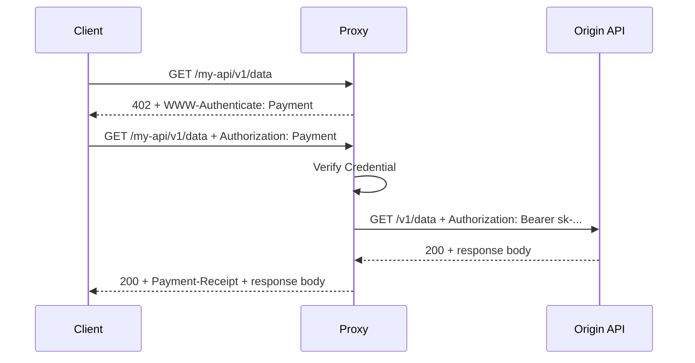
```mermaid
sequenceDiagram
  participant C as Client
  participant P as Proxy
  participant O as Origin API
  C->>P: GET /my-api/v1/data
  P-->>C: 402 + WWW-Authenticate: Payment
  C->>P: GET /my-api/v1/data + Authorization: Payment
  P->>P: Verify Credential
  P->>O: GET /v1/data + Authorization: Bearer sk-...
  O-->>P: 200 + response body
  P-->>C: 200 + Payment-Receipt + response body

```

The proxy verifies the client's payment Credential, then forwards the request to the origin with the real API key injected. The client never sees the upstream credentials.

## Prompt mode

Paste this into your coding agent to build the entire guide in one prompt:

```text
Use https://mpp.dev/guides/proxy-existing-service.md as reference.
Create an mppx proxy server that gates an upstream REST API
behind MPP payments. Use Service.from with a bearer token for
upstream auth. Charge $0.01 for the forecast endpoint and allow
the status endpoint for free. Use the Tempo payment method.
```

## Manual mode

::::steps
### Install `mppx`

:::code-group
```bash [npm]
$ npm install mppx viem
```

```bash [pnpm]
$ pnpm add mppx viem
```

```bash [bun]
$ bun add mppx viem
```
:::

### Define the upstream service

Use `Service.from` to describe the API you want to proxy. The proxy injects upstream credentials so clients never see them.

```ts [server.ts]
import { Proxy, Service } from 'mppx/proxy'
import { Mppx, tempo } from 'mppx/server'

const mppx = Mppx.create({ methods: [tempo.charge()] })

const proxy = Proxy.create({
  services: [
// [!code focus:start]
    Service.from('weather', {
      baseUrl: 'https://api.weather.example.com',
      bearer: process.env.WEATHER_API_KEY!, // [!code hl]
      description: 'Weather forecast API',
      routes: {
        'GET /v1/forecast': mppx.charge({ amount: '0.01' }),
        'GET /v1/status': true, // [!code hl]
      },
      title: 'Weather API',
    }),
// [!code focus:end]
  ],
})
```

* **`bearer`** injects `Authorization: Bearer` on upstream requests. Use `headers` for APIs that expect a custom header like `X-API-Key`.
* **`true`** marks a route as free passthrough—no payment required, but upstream credentials are still injected.

### Set pricing per route

Each route maps a `"METHOD /pattern"` to a payment intent or `true` for free passthrough. Set different prices per endpoint.

```ts [server.ts]
import { Proxy, Service } from 'mppx/proxy'
import { Mppx, tempo } from 'mppx/server'

const mppx = Mppx.create({ methods: [tempo.charge()] })

const proxy = Proxy.create({
  services: [
    Service.from('weather', {
      baseUrl: 'https://api.weather.example.com',
      bearer: process.env.WEATHER_API_KEY!,
      description: 'Weather forecast API',
      routes: {
        'GET /v1/forecast': mppx.charge({ amount: '0.01' }), // [!code focus]
        'GET /v1/historical/:date': mppx.charge({ amount: '0.05' }), // [!code focus]
        'GET /v1/status': true, // [!code focus]
      },
      title: 'Weather API',
    }),
  ],
})
```

Requests to routes not listed in the map receive `404`.

### Start the proxy

The proxy returns two handlers for different runtimes.

```ts [server.ts]
import { Proxy, Service } from 'mppx/proxy'
import { Mppx, tempo } from 'mppx/server'

const mppx = Mppx.create({ methods: [tempo.charge()] })

const proxy = Proxy.create({
  description: 'Payment-gated weather data', // [!code hl]
  services: [
    Service.from('weather', {
      baseUrl: 'https://api.weather.example.com',
      bearer: process.env.WEATHER_API_KEY!,
      description: 'Weather forecast API',
      routes: {
        'GET /v1/forecast': mppx.charge({ amount: '0.01' }),
        'GET /v1/historical/:date': mppx.charge({ amount: '0.05' }),
        'GET /v1/status': true,
      },
      title: 'Weather API',
    }),
  ],
  title: 'Weather Proxy', // [!code hl]
})

// [!code focus:start]
// Bun / Deno
export default { fetch: proxy.fetch }

// Node.js
// import { createServer } from 'node:http'
// createServer(proxy.listener).listen(3000)
// [!code focus:end]
```

### Test via the `mppx` CLI

```bash [terminal]
# Validate the paid route
$ npx mppx validate http://localhost:3000

# Create a mainnet account, then fund it with pathUSD
$ npx mppx account create --network mainnet

# Free route — no payment required
$ npx mppx http://localhost:3000/weather/v1/status

# Paid route — handles 402 automatically
$ npx mppx http://localhost:3000/weather/v1/forecast
```

Requests route to `/{serviceId}/`—for example, `/weather/v1/forecast` proxies to `https://api.weather.example.com/v1/forecast`.
::::

## Multiple upstream services

Gate several APIs behind a single proxy by passing multiple services. Each mounts at its own path prefix.

```ts [server.ts]
import { Proxy, Service, openai } from 'mppx/proxy'
import { Mppx, tempo } from 'mppx/server'

const mppx = Mppx.create({ methods: [tempo.charge()] })

const proxy = Proxy.create({
  description: 'Multi-service paid API proxy',
  services: [
// [!code focus:start]
    openai({ // [!code hl]
      apiKey: process.env.OPENAI_API_KEY!,
      routes: {
        'GET /v1/models': true,
        'POST /v1/chat/completions': mppx.charge({ amount: '0.05' }),
      },
    }),
    Service.from('internal', { // [!code hl]
      baseUrl: 'https://api.internal.example.com',
      headers: { 'X-API-Key': process.env.INTERNAL_API_KEY! }, // [!code hl]
      routes: {
        'POST /v1/analyze': mppx.charge({ amount: '0.10' }),
      },
    }),
// [!code focus:end]
  ],
  title: 'My Proxy',
})
```

* `/openai/v1/chat/completions` → `https://api.openai.com/v1/chat/completions`
* `/internal/v1/analyze` → `https://api.internal.example.com/v1/analyze`

Built-in service presets (`openai`, `anthropic`, `stripe`) handle upstream auth conventions automatically. Use `Service.from` for everything else.

## Discovery

The proxy auto-generates discovery endpoints so coding agents and CLI tools can find available services and pricing.

```bash [terminal]
# Human-readable overview
$ curl http://localhost:3000/llms.txt

# JSON service list
$ curl http://localhost:3000/discover

# Single service details
$ curl http://localhost:3000/discover/weather
```

See the [Proxy reference](/sdk/typescript/proxy#discovery-endpoints) for the full list of discovery endpoints.

## Next steps

# Protocol overview \[Standardizing HTTP 402 for machine-to-machine payments]

The Machine Payments Protocol (MPP) is a protocol for machine-to-machine payments. It standardizes HTTP `402` "Payment Required" with an extensible framework that works with any payment network.

These docs provide a developer-friendly overview. Use the IETF Specification card below for the normative protocol.

If you're evaluating HTTP payment protocols, compare [MPP vs x402](/mpp-vs-x402).

## Flow


```mermaid
sequenceDiagram
  participant Client
  participant Server
  Client->>Server: GET /resource
  Server-->>Client: 402 Payment Required + Challenge
  Client->>Server: GET /resource + Credential
  Server-->>Client: 200 OK + Receipt
```

1. Request the resource.
2. Receive a 402 Challenge.
3. Fulfill the payment and retry with a Credential.
4. Receive the resource and Receipt.

## Core concepts

[HTTP 402](/protocol/http-402) — The 402 status code that signals payment is required

[Challenges](/protocol/challenges) — Server-issued payment requirements in WWW-Authenticate

[Credentials](/protocol/credentials) — Client-submitted payment proofs in Authorization

[Receipts](/protocol/receipts) — Server acknowledgment of successful payment

[Transports](/protocol/transports) — HTTP and MCP transport bindings

## Status codes

MPP uses HTTP status codes consistently to signal payment-related conditions:

:::info[Consistent 402 usage]
MPP uses `402` for all payment-related Challenges, including failed Credential validation. This differs from other HTTP authentication schemes that use `401` for failed Credentials. The distinction:

* **`402`** = Payment barrier (initial Challenge or retry needed)
* **`401`** = Authentication failure unrelated to payment
* **`403`** = Payment succeeded but access denied by policy
:::

| Condition                                          | Status                               | Response                                         |
| -------------------------------------------------- | ------------------------------------ | ------------------------------------------------ |
| Resource requires payment, no Credential provided  | 402  | Fresh Challenge in `WWW-Authenticate`            |
| Malformed Credential (invalid base64url, bad JSON) | 402  | Fresh Challenge + `malformed-credential` problem |
| Unknown, expired, or already-used Challenge id     | 402  | Fresh Challenge + `invalid-challenge` problem    |
| Payment proof invalid or verification failed       | 402  | Fresh Challenge + `verification-failed` problem  |
| Payment verified, access granted                   | 200 | Resource + optional `Payment-Receipt`            |
| Payment verified, but policy denies access         | 403 | No Challenge (payment was valid)                 |

See [HTTP 402](/protocol/http-402) for details on when to return each status code.

## Payment method agnostic

MPP works with any payment network or currency. The core protocol defines the framework, while **payment methods** define how specific networks integrate:

:::info[Extensible by design]
Anyone can define new payment methods. The protocol requires that methods define their `request` schema (what the server asks for) and `payload` schema (what the client provides as proof).
:::

| Method                            | Description                                     | Status                                      |
| --------------------------------- | ----------------------------------------------- | ------------------------------------------- |
| [Tempo](/payment-methods/tempo)   | Native stablecoin payments on Tempo Network     | Production |
| [Stripe](/payment-methods/stripe) | Traditional card payment methods through Stripe | Production |

Each payment method specifies its own `request` and `payload` schemas while sharing the common Challenge/Credential flow.

### Payment method requirements

Payment method specifications must define:

1. **Method identifier**—Unique lowercase ASCII string (for example, `tempo` or `stripe`)
2. **Request schema**—JSON structure for the `request` parameter in Challenges
3. **Payload schema**—JSON structure for Credential `payload` fields
4. **Verification procedure**—How servers validate payment proofs
5. **Settlement procedure**—How payment is finalized

## Payment intents

Payment intents describe the type of payment being requested. Common intents include:

* **`charge`**—One-time payment that settles immediately
* **`session`**—Streaming payment over a payment channel
* **`subscription`**—Recurring fixed payment for paid access across billing periods

Intent definitions in the IETF Specification define:

* Required and optional `request` fields
* `payload` requirements
* Verification and settlement semantics

Servers can offer multiple intents in separate Challenges, allowing clients to choose:

```http
WWW-Authenticate: Payment id="abc", method="tempo", intent="charge", ...
WWW-Authenticate: Payment id="def", method="tempo", intent="session", ...
WWW-Authenticate: Payment id="ghi", method="tempo", intent="subscription", ...
```

## Request body binding

For requests with bodies (`POST`, `PUT`, `PATCH`), servers can bind the Challenge to the request body using a `digest` parameter:

```http
WWW-Authenticate: Payment id="...",
    method="tempo",
    intent="charge",
    digest="sha-256=:X48E9qOokqqrvdts8nOJRJN3OWDUoyWxBf7kbu9DBPE=:",
    request="..."
```

When a `digest` is present, clients must submit the Credential with a request body whose digest matches. This prevents clients from modifying the request body after receiving the Challenge.

The digest is computed per [RFC 9530](https://www.rfc-editor.org/rfc/rfc9530) Content-Digest header format.

## Error handling

Failed payment attempts return `402` with a fresh Challenge and a Problem Details [RFC 9457](https://www.rfc-editor.org/rfc/rfc9457) body:

```json
{
  "type": "https://paymentauth.org/problems/verification-failed",
  "title": "Payment Verification Failed",
  "status": 402,
  "detail": "Invalid payment proof."
}
```

Common error codes (full type URI: `https://paymentauth.org/problems/{code}`):

| Code                   | Description                                    |
| ---------------------- | ---------------------------------------------- |
| `payment-required`     | Resource requires payment                      |
| `payment-insufficient` | Amount too low                                 |
| `payment-expired`      | Challenge or authorization expired             |
| `verification-failed`  | Proof invalid                                  |
| `method-unsupported`   | Method not accepted                            |
| `malformed-credential` | Invalid Credential format                      |
| `invalid-challenge`    | Challenge ID unknown, expired, or already used |

Use the `Retry-After` header to indicate when clients can retry failed payments.

## Security considerations

### Transport security

**TLS 1.2 or later is REQUIRED** for all Payment authentication flows. Use TLS 1.3 where possible. Payment Credentials contain sensitive authorization data that could result in financial loss if intercepted.

### Replay protection

Payment methods must provide single-use proof semantics. A payment proof can be used exactly once; subsequent attempts to use the same proof must be rejected.

Cryptographic Challenge binding prevents modification, not reuse. Payment methods need separate replay state or settlement-layer guarantees. For Tempo zero-dollar proofs, configure a shared atomic store.

### Idempotency

Servers must not perform side effects (database writes, external API calls) for requests that have not been paid. The unpaid request that triggers a `402` Challenge must not modify server state beyond recording the Challenge itself.

For non-idempotent methods (`POST`, `PUT`, `DELETE`), accept an `Idempotency-Key` header to enable safe client retries.

### Amount verification

Clients must verify before authorizing payment:

1. Requested amount is reasonable for the resource
2. Recipient/address is expected
3. Currency/asset is as expected
4. Validity window is appropriate

:::warning[Don't trust descriptions]
Clients must not rely on the `description` parameter for payment verification. Malicious servers could provide a misleading description while the actual `request` payload requests a different amount.
:::

### Credential handling

Payment Credentials are bearer tokens that authorize financial transactions. Servers and intermediaries must not log Payment Credentials or include them in error messages, debugging output, or analytics.

### Caching

Payment Challenges contain unique identifiers and time-sensitive payment data that must not be cached. Servers must send `Cache-Control: no-store` with `402` responses. Responses containing `Payment-Receipt` headers must include `Cache-Control: private`.

## Extensibility

The protocol is designed for extensibility, with simple constraints where required for security or a consistent developer experience:

### Custom parameters

Implementations may define additional parameters in Challenges:

* Parameters must use lowercase names
* Unknown parameters must be ignored by clients
* This allows payment methods to add method-specific fields

### Size considerations

* Keep Challenges under 8 KB
* Clients must handle Challenges of at least 4 KB
* Servers must handle Credentials of at least 4 KB

### Internationalization

* All string values use UTF-8 encoding
* Payment method identifiers are restricted to ASCII lowercase
* Use ASCII-only values for the `realm` parameter
* The `description` parameter can contain localized text; use `Accept-Language` to determine appropriate language

## Full specification

These docs provide a practical overview. For the full specification:

[Payment HTTP Authentication Scheme](https://paymentauth.org/draft-httpauth-payment-00) — Core protocol spec (draft-httpauth-payment-00)

[MCP Transport](https://paymentauth.org/draft-payment-transport-mcp-00) — Model Context Protocol binding

[Payment Methods and Intents](https://paymentauth.org) — Method and intent definitions (charge, session, subscription)

[IETF Specification](https://paymentauth.org) — Browse the full specification directory

The full specification includes detailed ABNF grammar, security analysis, IANA considerations, and complete examples for various payment scenarios.

# HTTP 402 \[Require payment before granting access]

MPP services return HTTP `402` Payment Required to indicate that a resource requires payment for access. This is the foundation that enables [API monetization](/use-cases/api-monetization) and [micropayments](/use-cases/micropayments) at the protocol level.

## Overview

Respond with `402` when:

* A resource requires payment as a precondition for access
* The server can provide a `Payment` Challenge the client can fulfill
* Payment is the primary barrier (not authentication or authorization, which would result in a `401` and then potentially an incremental `402`)

```http
HTTP/1.1 402 Payment Required
WWW-Authenticate: Payment id="abc123",
    realm="mpp.dev",
    method="tempo",
    intent="charge",
    request="eyJ..."
```

## Status code comparison

| Condition | Status Code |
|-----------|-------------|
| Resource requires payment | **`402`** |
| Client lacks authentication | `401` |
| Client authenticated but unauthorized | `403` |
| Resource doesn't exist | `404` |

MPP uses `402` consistently for all payment-related Challenges, including when a Credential fails validation. This differs from other HTTP authentication schemes that use `401` for failed Credentials.

## Token authentication

When a resource requires both **token** and **payment** authentication:

1. Verify authentication credentials
2. Return `401` if token authentication fails
3. Return `402` with a `Payment` Challenge only after successful token authentication

This ordering prevents leaking payment requirements to unauthenticated clients.

:::info
With `mppx`, set `requiresAuth: true` to advertise `Payment-Authorization` for the Payment Credential while keeping application authentication in `Authorization`. Compatible clients preserve the existing application Credential when they retry the request.
:::

## Error responses

Failed payment attempts return `402` with a fresh Challenge and a Problem Details body:

```http
HTTP/1.1 402 Payment Required
Cache-Control: no-store
Content-Type: application/problem+json
WWW-Authenticate: Payment id="new456", ...

{
  "type": "https://paymentauth.org/problems/verification-failed",
  "title": "Payment Verification Failed",
  "status": 402,
  "detail": "Invalid payment proof."
}
```

Error types include:

* `invalid-challenge`—Unknown, expired, or already-used Challenge
* `malformed-credential`—Invalid base64url or bad JSON
* `method-unsupported`—Method not accepted (400)
* `payment-expired`—Challenge or authorization expired
* `payment-insufficient`—Amount too low
* `payment-required`—Resource requires payment
* `verification-failed`—Payment proof invalid

## Learn more

[IETF Specification](https://paymentauth.org) — Read the full specification

# Challenges \[Server-issued payment requirements]

Your server issues a **Challenge** to describe the payment required for a resource. Send Challenges in the `WWW-Authenticate` header using the `Payment` authentication scheme.

## Structure

```http
WWW-Authenticate: Payment id="qB3wErTyU7iOpAsD9fGhJk", realm="mpp.dev", method="tempo", intent="charge", request="eyJhbW91bnQiOiIxMDAwIiwiY3VycmVuY3kiOiIweDIwYzAwMDAwMDAwMDAwMDAwMDAwMDAwMDAwMDAwMDAwMDAwMDAwMDAiLCJtZXRob2REZXRhaWxzIjp7ImNoYWluSWQiOjQyMTd9LCJyZWNpcGllbnQiOiIweGYzOUZkNmU1MWFhZDg4RjZGNGNlNmFCODgyNzI3OWNmZkZiOTIyNjYifQ", expires="2027-01-15T12:05:00Z", header="Payment-Authorization", opaque="eyJyb3V0ZSI6Ii92MS9zZWFyY2gifQ"
```

The token address below is pathUSD on Tempo mainnet. The identifiers and transaction hash in these examples are illustrative.

### Required parameters

| Parameter | Description |
|-----------|-------------|
| `id` | Unique Challenge identifier, cryptographically bound to Challenge parameters |
| `realm` | Protection space identifier (typically the API domain) |
| `method` | Payment method identifier (such as `tempo` or `stripe`) |
| `intent` | Payment intent type (such as `charge` or `session`) |
| `request` | Base64url-encoded JCS JSON with payment details |

### Optional parameters

| Parameter | Description |
|-----------|-------------|
| `description` | Human-readable description of what's being paid for |
| `digest` | Request body digest used to bind a body-bearing request |
| `expires` | ISO 8601 timestamp when the Challenge expires |
| `header` | HTTP field for the Credential; defaults to `Authorization` when absent |
| `opaque` | Base64url-encoded JCS JSON for server-defined correlation data |

## `request` and `opaque` encoding

In HTTP headers, both `request` and `opaque` use base64url-encoded [JCS](https://www.rfc-editor.org/rfc/rfc8785) JSON strings. Parse them after header processing to recover the structured values.

## `request` object

The `request` parameter contains method-specific payment details encoded as base64url JCS JSON:

```json [Decoded request object]
{
  "amount": "1000",
  "currency": "0x20c0000000000000000000000000000000000000",
  "methodDetails": {
    "chainId": 4217
  },
  "recipient": "0xf39Fd6e51aad88F6F4ce6aB8827279cffFb92266"
}
```

Servers can also attach correlation data in `opaque`:

```json [Decoded opaque object]
{
  "route": "/v1/search"
}
```

Clients must echo `opaque` back unchanged when they submit a Credential.

Common fields across payment methods:

| Field | Description |
|-------|-------------|
| `amount` | Payment amount in base units (for example, cents for USD) |
| `currency` | Currency code (`usd`) or token address (`0x20c0...`) |
| `recipient` | Payment destination in method-native format |

## Multiple Challenges

Servers can offer multiple payment options in a single response:

```http
HTTP/1.1 402 Payment Required
WWW-Authenticate: Payment id="abc", method="tempo", ...
WWW-Authenticate: Payment id="def", method="stripe", ...
```

Clients select one based on their capabilities and submit a single Credential.

## Challenge binding

:::warning[Security requirement]
Servers must bind the `id` to the expected Challenge parameters. Use stateful storage or stateless cryptographic verification to prevent clients from reusing an ID with modified payment terms.
:::

Typical binding includes:

* `realm`, `method`, `intent`
* `request`
* `expires`
* `digest`
* `header` when advertised
* `opaque`

For HMAC-bound IDs without `header`, the canonical input sequence remains `realm | method | intent | request | expires | digest | opaque`. When a Challenge advertises `header`, insert its value before the final `opaque` slot. Use an empty string for an absent optional slot.

For stateless verification, use an [HMAC-bound](https://en.wikipedia.org/wiki/HMAC) Challenge ID. Stateful servers can store the expected Challenge parameters by ID and compare them when verifying the Credential.

## Learn more

[IETF Specification](https://paymentauth.org) — Read the full specification

[Payment Methods](/payment-methods) — Method-specific request schemas

# Credentials \[Client-submitted payment proofs]

A **Credential** is your response to a [Challenge](/protocol/challenges), proving that you paid or authorized the payment. Send Credentials in `Authorization` unless the Challenge advertises another field in its `header` parameter.

## Structure

```http
Authorization: Payment eyJjaGFsbGVuZ2UiOnsiZXhwaXJlcyI6IjIwMjctMDEtMTVUMTI6MDU6MDBaIiwiaWQiOiJxQjN3RXJUeVU3aU9wQXNEOWZHaEprIiwiaW50ZW50IjoiY2hhcmdlIiwibWV0aG9kIjoidGVtcG8iLCJyZWFsbSI6Im1wcC5kZXYiLCJvcGFxdWUiOiJleUp5YjNWMFpTSTZJaTkyTVM5elpXRnlZMmdpZlEiLCJyZXF1ZXN0IjoiZXlKaGJXOTFiblFpT2lJeE1EQXdJaXdpWTNWeWNtVnVZM2tpT2lJd2VESXdZekF3TURBd01EQXdNREF3TURBd01EQXdNREF3TURBd01EQXdNREF3TURBd01EQXdNREFpTENKdFpYUm9iMlJFWlhSaGFXeHpJanA3SW1Ob1lXbHVTV1FpT2pReU1UZDlMQ0p5WldOcGNHbGxiblFpT2lJd2VHWXpPVVprTm1VMU1XRmhaRGc0UmpaR05HTmxObUZDT0RneU56STNPV05tWmtaaU9USXlOallpZlEifSwicGF5bG9hZCI6eyJoYXNoIjoiMHhhYmFiYWJhYmFiYWJhYmFiYWJhYmFiYWJhYmFiYWJhYmFiYWJhYmFiYWJhYmFiYWJhYmFiYWJhYmFiYWJhYmFiIiwidHlwZSI6Imhhc2gifSwic291cmNlIjoiZGlkOnBraDplaXAxNTU6NDIxNzoweDEyMzQ1Njc4OTBhYmNkZWYxMjM0NTY3ODkwYWJjZGVmMTIzNDU2NzgifQ
```

When an endpoint also uses `Authorization` for application authentication, the server can advertise `header="Payment-Authorization"`. Keep the ordinary Credential and Payment Credential separate:

```http
Authorization: Bearer application-token
Payment-Authorization: Payment eyJjaGFsbGVuZ2UiOnsiZXhwaXJlcyI6IjIwMjctMDEtMTVUMTI6MDU6MDBaIiwiaGVhZGVyIjoiUGF5bWVudC1BdXRob3JpemF0aW9uIiwiaWQiOiJxQjN3RXJUeVU3aU9wQXNEOWZHaEprIiwiaW50ZW50IjoiY2hhcmdlIiwibWV0aG9kIjoidGVtcG8iLCJyZWFsbSI6Im1wcC5kZXYiLCJvcGFxdWUiOiJleUp5YjNWMFpTSTZJaTkyTVM5elpXRnlZMmdpZlEiLCJyZXF1ZXN0IjoiZXlKaGJXOTFiblFpT2lJeE1EQXdJaXdpWTNWeWNtVnVZM2tpT2lJd2VESXdZekF3TURBd01EQXdNREF3TURBd01EQXdNREF3TURBd01EQXdNREF3TURBd01EQXdNREFpTENKdFpYUm9iMlJFWlhSaGFXeHpJanA3SW1Ob1lXbHVTV1FpT2pReU1UZDlMQ0p5WldOcGNHbGxiblFpT2lJd2VHWXpPVVprTm1VMU1XRmhaRGc0UmpaR05HTmxObUZDT0RneU56STNPV05tWmtaaU9USXlOallpZlEifSwicGF5bG9hZCI6eyJoYXNoIjoiMHhhYmFiYWJhYmFiYWJhYmFiYWJhYmFiYWJhYmFiYWJhYmFiYWJhYmFiYWJhYmFiYWJhYmFiYWJhYmFiYWJhYmFiIiwidHlwZSI6Imhhc2gifSwic291cmNlIjoiZGlkOnBraDplaXAxNTU6NDIxNzoweDEyMzQ1Njc4OTBhYmNkZWYxMjM0NTY3ODkwYWJjZGVmMTIzNDU2NzgifQ
```

The custom-header Credential above decodes to this JSON object. It echoes the [Challenge example](/protocol/challenges#structure) unchanged and uses an illustrative transaction hash:

```json
{
  "challenge": {
    "expires": "2027-01-15T12:05:00Z",
    "header": "Payment-Authorization",
    "id": "qB3wErTyU7iOpAsD9fGhJk",
    "intent": "charge",
    "method": "tempo",
    "opaque": "eyJyb3V0ZSI6Ii92MS9zZWFyY2gifQ",
    "realm": "mpp.dev",
    "request": "eyJhbW91bnQiOiIxMDAwIiwiY3VycmVuY3kiOiIweDIwYzAwMDAwMDAwMDAwMDAwMDAwMDAwMDAwMDAwMDAwMDAwMDAwMDAiLCJtZXRob2REZXRhaWxzIjp7ImNoYWluSWQiOjQyMTd9LCJyZWNpcGllbnQiOiIweGYzOUZkNmU1MWFhZDg4RjZGNGNlNmFCODgyNzI3OWNmZkZiOTIyNjYifQ"
  },
  "payload": {
    "hash": "0xabababababababababababababababababababababababababababababababab",
    "type": "hash"
  },
  "source": "did:pkh:eip155:4217:0x1234567890abcdef1234567890abcdef12345678"
}
```

The echoed Challenge keeps the original HTTP wire values. In a Credential, `challenge.request` and `challenge.opaque` remain the same base64url-encoded JCS JSON strings from the `WWW-Authenticate` header.

### Fields

| Field | Description |
|-------|-------------|
| `challenge` | The [Challenge](/protocol/challenges) being responded to |
| `source` | Identity of the payer (address, DID, account ID) |
| `payload` | Method-specific payment proof |

## Enforce single-use Credentials

Payment proofs must be accepted at most once. Challenge binding prevents clients from modifying payment terms, but it doesn't detect reuse—each payment method must enforce replay protection separately. When processing a Credential:

1. Verify the `challenge.id` matches an outstanding Challenge
2. Verify the Challenge has not expired
3. Verify the payment or proof using method-specific procedures
4. Reject any replayed Credentials

For Tempo zero-dollar proof Credentials, pass a shared atomic `store` to [`tempo.charge`](/sdk/typescript/server/Method.tempo.charge#store-optional). Without a store, a valid proof remains reusable until its Challenge expires.

## Tempo charge payload types

Tempo charge currently uses three Credential payload shapes:

| `payload.type` | When the client uses it | What the server verifies |
|----------------|-------------------------|--------------------------|
| `transaction` | Non-zero charge in pull mode | Signed Tempo transaction before broadcast |
| `hash` | Non-zero charge in push mode | On-chain Receipt for the submitted transaction |
| `proof` | Zero-amount identity flow | Signed proof message over the Challenge ID with no on-chain transfer |

## Example

### Tempo charge payment

```json
{
  "challenge": {
    "expires": "2027-01-15T12:05:00Z",
    "header": "Payment-Authorization",
    "id": "qB3wErTyU7iOpAsD9fGhJk",
    "intent": "charge",
    "method": "tempo",
    "opaque": "eyJyb3V0ZSI6Ii92MS9zZWFyY2gifQ",
    "realm": "mpp.dev",
    "request": "eyJhbW91bnQiOiIxMDAwIiwiY3VycmVuY3kiOiIweDIwYzAwMDAwMDAwMDAwMDAwMDAwMDAwMDAwMDAwMDAwMDAwMDAwMDAiLCJtZXRob2REZXRhaWxzIjp7ImNoYWluSWQiOjQyMTd9LCJyZWNpcGllbnQiOiIweGYzOUZkNmU1MWFhZDg4RjZGNGNlNmFCODgyNzI3OWNmZkZiOTIyNjYifQ"
  },
  "payload": {
    "hash": "0xabababababababababababababababababababababababababababababababab",
    "type": "hash"
  },
  "source": "did:pkh:eip155:4217:0x1234567890abcdef1234567890abcdef12345678"
}
```

The server looks up the transaction hash and verifies that the confirmed transfer matches the Challenge parameters.

For zero-amount Tempo Challenges, the payload becomes `{"type":"proof","signature":"0x..."}`. The server verifies the proof against the `source` identity instead of broadcasting a transfer.

## Learn more

[IETF Specification](https://paymentauth.org) — Read the full specification

[Payment Methods](/payment-methods) — Method-specific request schemas

# Receipts \[Server acknowledgment of successful payment]

A **Receipt** is the server's acknowledgment of successful payment. Return Receipts in the `Payment-Receipt` header on successful responses.

:::info
The `Payment-Receipt` header is optional. Servers typically include it for auditability, but clients don't need it for correct operation.
:::

## Header

```http
HTTP/1.1 200 OK
Payment-Receipt: eyJtZXRob2QiOiJ0ZW1wbyIsInJlZmVyZW5jZSI6IjB4Nzg5YWJjLi4uIiwic3RhdHVzIjoic3VjY2VzcyIsInRpbWVzdGFtcCI6IjIwMjUtMDEtMTVUMTI6MDA6MDBaIn0
Content-Type: application/json

{ "data": "Payment received." }
```

The Receipt is a base64url-encoded JSON object.

## Structure

```json
{
  "method": "tempo",
  "reference": "0x789abc...",
  "status": "success",
  "timestamp": "2025-01-15T12:00:00Z"
}
```

### Fields

| Field | Description |
|-------|-------------|
| `externalId` | Optional external reference echoed from the Credential payload |
| `method` | Payment method used |
| `reference` | Method-specific payment reference (for example, transaction hash or invoice ID) |
| `status` | Payment outcome (`success`) |
| `subscriptionId` | Optional server-issued subscription identifier |
| `timestamp` | When the payment was processed |

Payment method specifications can define additional fields.

## Use cases

Receipts enable:

* **Auditing**—Clients can log payment confirmations
* **Dispute resolution**—Reference IDs link to payment network records
* **Reconciliation**—Match payments to requests

## Payment method references

| Settlement type | Reference format |
|-----------------|------------------|
| On-chain transfer | Transaction hash (`0xtx789...`) |
| Card authorization | Authorization reference (`auth_1234...`) |
| Invoice payment | Invoice ID (`inv_1234...`) |

## Learn more

[IETF Specification](https://paymentauth.org) — Read the full specification

# Transports \[HTTP, MCP, and WebSocket bindings for payment flows]

MPP defines how the Payment authentication scheme operates over different transport protocols. The core protocol targets HTTP, with extensions for other transports like MCP and JSON-RPC.

## Available transports

| Transport | Use Case | Spec |
|-----------|----------|------|
| [HTTP](/protocol/transports/http) | REST APIs, web resources | [RFC 9110](https://www.rfc-editor.org/rfc/rfc9110#section-11) |
| [MCP](/protocol/transports/mcp) | AI tool calls using Model Context Protocol | MCP transport binding |
| [WebSocket](/protocol/transports/websocket) | Bidirectional payment streams | [RFC 6455](https://www.rfc-editor.org/rfc/rfc6455) |
| JSON-RPC | Non-MCP JSON-RPC services | [JSON-RPC 2.0](https://www.jsonrpc.org/specification) |

## Transport-agnostic design

MPP's core concepts—Challenges, Credentials, and Receipts—remain the same across transports. The encoding and delivery mechanism changes:

* **HTTP** uses standard headers (`WWW-Authenticate`, `Authorization` or an advertised alternate Credential field, and `Payment-Receipt`)
* **MCP** uses JSON-RPC error codes and `_meta` fields
* **WebSocket** uses JSON message framing with an `mpp` discriminator

Choose the transport that matches your protocol. HTTP for REST APIs, MCP for AI agent tool calls, WebSocket for bidirectional payment streams, or JSON-RPC for non-MCP JSON-RPC services.

## Specification

[MCP Transport](https://paymentauth.org/draft-payment-transport-mcp-00) — Read the MCP transport binding

# HTTP transport \[Payment flows using standard HTTP headers]

The HTTP transport is the primary binding for MPP, using standard HTTP headers from [RFC 9110](https://www.rfc-editor.org/rfc/rfc9110#section-11).

## Headers

| Direction | Header | Purpose |
|-----------|--------|---------|
| Server → Client | `WWW-Authenticate: Payment ...` | Challenge |
| Client → Server | `Authorization: Payment ...` | Credential when the Challenge omits `header` |
| Client → Server | `Payment-Authorization: Payment ...` | Credential when the Challenge sets `header="Payment-Authorization"` |
| Server → Client | `Payment-Receipt: ...` | Receipt |

## Example flow

:::steps
### <div className="mr-2">Client</div> Request a resource

```http
GET /api/data HTTP/1.1
Host: api.example.com
```

### <div className="mr-2">Server</div> Send a payment Challenge

Return the `WWW-Authenticate` header with a `Payment` Challenge.

```http
HTTP/1.1 402 Payment Required
WWW-Authenticate: Payment id="abc123", method="tempo", intent="charge", request="..."
```

### <div className="mr-2">Client</div> Retry with a Credential

Send the `Authorization` header.

```http
GET /api/data HTTP/1.1
Host: api.example.com
Authorization: Payment eyJjaGFsbGVuZ2UiOnsiaWQiOiJhYmMxMjMi...
```

### <div className="mr-2">Server</div> Return a Receipt

Return the `Payment-Receipt` header with a success Receipt.

```http
HTTP/1.1 200 OK
Payment-Receipt: eyJzdGF0dXMiOiJzdWNjZXNzIi4uLn0
Content-Type: application/json

{"data": "..."}
```
:::

## Header encoding

Challenges are encoded as [auth-params](https://www.rfc-editor.org/rfc/rfc9110#section-11.2) in `WWW-Authenticate`. The `request` and `opaque` auth-params use base64url-encoded JCS JSON strings. Credentials echo those same Challenge values inside the base64url-encoded Payment Credential, and Receipts use base64url-encoded JSON in `Payment-Receipt`.

## Combine application authentication and payment

Use a separate payment field when your endpoint needs a Bearer, Basic, or other application Credential in `Authorization`. With `mppx`, set `requiresAuth: true` on the server. The Challenge advertises `header="Payment-Authorization"`, and compatible clients attach the Payment Credential there without replacing the existing `Authorization` value.

```http
GET /api/data HTTP/1.1
Authorization: Bearer application-token
Host: api.example.com
Payment-Authorization: Payment eyJjaGFsbGVuZ2UiOnsiaWQiOiJhYmMxMjMi...
```

## Full specification

[IETF Specification](https://paymentauth.org) — Read the full specification

# MCP and JSON-RPC transport \[Payment flows for AI tool calls]

The [Model Context Protocol](https://modelcontextprotocol.io) (MCP) transport enables payments for AI tool calls using JSON-RPC.

## Overview

AI agents use MCP to call tools on remote servers. The MCP transport allows these tool calls to require payment, enabling autonomous agent-to-service payments.

| MPP concept | MCP encoding |
|-------------|--------------|
| Credential | `_meta.org.paymentauth/credential` |
| Payment error | JSON-RPC error with a specification-defined code and Challenge data |
| Receipt | `_meta.org.paymentauth/receipt` |

## Challenge

Payment requirements are signaled using JSON-RPC error code `-32042`:

```json
{
  "jsonrpc": "2.0",
  "id": 1,
  "error": {
    "code": -32042, // [!code highlight]
    "message": "Payment Required",
    "data": {
      "httpStatus": 402,
      "challenges": [{ // [!code highlight]
        "id": "ch_abc123",
        "realm": "search.example.com",
        "method": "tempo",
        "intent": "charge",
        "request": {
          "amount": "10",
          "currency": "usd",
          "recipient": "0xa726a1..."
        }
      }]
    }
  }
}
```

## Error codes

MCP transports preserve the payment error category in the JSON-RPC code:

| Code | Meaning |
| --- | --- |
| `-32603` | Internal payment error |
| `-32602` | Malformed Credential or invalid payment payload |
| `-32043` | Payment verification failed |
| `-32042` | Payment required |

Payment errors include one or more Challenges in `error.data.challenges`. A payment-aware client can retry a `-32043` response when the server provides a replacement Challenge.

### TypeScript constants

Use the exported constants and `Mcp.errorCode` when you integrate a custom MCP transport.

```ts twoslash
import { Errors, Mcp } from 'mppx'

console.log(Mcp.paymentRequiredCode)
// @log: -32042

console.log(Mcp.errorCode(new Errors.InternalPaymentError()))
// @log: -32603
```

## Credential

Credentials are passed in the `_meta` field of the tool call:

```json
{
  "jsonrpc": "2.0",
  "id": 2,
  "method": "tools/call",
  "params": {
    "name": "web-search",
    "arguments": {"query": "MCP protocol"},
    "_meta": { // [!code highlight]
      "org.paymentauth/credential": { // [!code highlight]
        "challenge": { ... },
        "source": "0x1234...",
        "payload": { "signature": "0xabc..." }
      }
    }
  }
}
```

## Receipt

Receipts are returned in the result `_meta`:

```json
{
  "jsonrpc": "2.0",
  "id": 2,
  "result": {
    "content": [{ "type": "text", "text": "Search results..." }],
    "_meta": { // [!code highlight]
      "org.paymentauth/receipt": { // [!code highlight]
        "status": "success",
        "challengeId": "ch_abc123",
        "method": "tempo"
      }
    }
  }
}
```

## Comparison with HTTP

| Aspect | HTTP | MCP |
|--------|------|-----|
| Challenge delivery | `WWW-Authenticate` header | JSON-RPC payment error with `error.data.challenges` |
| Credential delivery | `Authorization` or the Challenge's advertised field | `_meta.org.paymentauth/credential` |
| Receipt delivery | `Payment-Receipt` header | `_meta.org.paymentauth/receipt` |
| Encoding | Base64url in headers | Native JSON in body |

## Example flow

:::steps
### <div className="mr-2">Agent</div> Call a tool

```json
{
  "jsonrpc": "2.0",
  "id": 1,
  "method": "tools/call",
  "params": {
    "name": "web-search",
    "arguments": {"query": "MCP payments"}
  }
}
```

### <div className="mr-2">Server</div> Return payment Challenge

Respond with error code `-32042`:

```json
{
  "jsonrpc": "2.0",
  "id": 1,
  "error": {
    "code": -32042,
    "message": "Payment Required",
    "data": {
      "challenges": [{ "id": "ch_abc", "method": "tempo", ... }]
    }
  }
}
```

### <div className="mr-2">Agent</div> Retry with Credential

Include the Credential in `_meta`:

```json
{
  "jsonrpc": "2.0",
  "id": 2,
  "method": "tools/call",
  "params": {
    "name": "web-search",
    "arguments": {"query": "MCP payments"},
    "_meta": {
      "org.paymentauth/credential": { ... }
    }
  }
}
```

### <div className="mr-2">Server</div> Return result with Receipt

```json
{
  "jsonrpc": "2.0",
  "id": 2,
  "result": {
    "content": [{ "type": "text", "text": "Results..." }],
    "_meta": {
      "org.paymentauth/receipt": { "status": "success", ... }
    }
  }
}
```
:::

## Full specification

[IETF Specification](https://paymentauth.org) — Read the full specification

# WebSocket transport \[Bidirectional payment streams over WebSocket]

The WebSocket transport binds MPP payment flows to a persistent WebSocket connection using JSON message framing. Unlike the HTTP transport, the client and server exchange payment messages in-band—no separate requests needed for voucher top-ups.

## Message protocol

All messages are JSON objects with an `mpp` field as a discriminator:

| Direction | `mpp` value | Payload | Purpose |
|-----------|-------------|---------|---------|
| Client → Server | `authorization` | `authorization: string` | Send Credential or top-up voucher |
| Server → Client | `message` | `data: string` | Application data |
| Client → Server | `payment-close-request` | — | Request session close |
| Server → Client | `payment-close-ready` | `data: SessionReceipt` | Acknowledge close with final Receipt |
| Server → Client | `payment-error` | `status: number, message: string` | Report error |
| Server → Client | `payment-need-voucher` | `data: NeedVoucherEvent` | Request more funds |
| Server → Client | `payment-receipt` | `data: SessionReceipt` | Confirm Credential |

### Example messages

```json
// Client sends Credential
{ "mpp": "authorization", "authorization": "eyJjaGFsbGVuZ2UiOi..." }

// Server confirms payment
{ "mpp": "payment-receipt", "data": { "status": "success", ... } }

// Server streams data
{ "mpp": "message", "data": "chunk of application data" }

// Server requests top-up
{ "mpp": "payment-need-voucher", "data": { "remaining": "0", ... } }

// Client requests close
{ "mpp": "payment-close-request" }

// Server acknowledges close
{ "mpp": "payment-close-ready", "data": { "status": "success", ... } }
```

## Connection flow

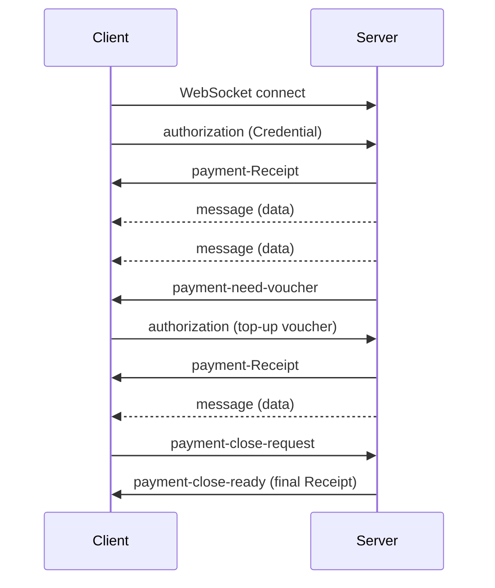
```mermaid
sequenceDiagram
  participant C as Client
  participant S as Server
  C->>S: WebSocket connect
  C->>S: authorization (Credential)
  S->>C: payment-Receipt
  S-->>C: message (data)
  S-->>C: message (data)
  S->>C: payment-need-voucher
  C->>S: authorization (top-up voucher)
  S->>C: payment-Receipt
  S-->>C: message (data)
  C->>S: payment-close-request
  S->>C: payment-close-ready (final Receipt)

```

> **Green** arrows represent payment flow (`authorization`, `payment-receipt`). **Red** arrows indicate a payment is required (`payment-need-voucher`). Black arrows are data messages.

1. The client opens a WebSocket connection (`ws://` or `wss://`)
2. The client sends an `authorization` message containing the session Credential
3. The server verifies the Credential and responds with a `payment-receipt`
4. The server streams `message` events with application data
5. When the channel balance depletes, the server sends `payment-need-voucher`
6. The client tops up by sending a new `authorization` with a voucher
7. When the stream ends, the server sends `payment-close-ready` with the final Receipt
8. The client can also initiate close at any time via `payment-close-request`

## When to use WebSocket vs SSE

| Aspect | WebSocket | Server-Sent Events |
|--------|-----------|---------------------|
| Direction | Bidirectional | Server → Client only |
| Voucher top-ups | In-band `authorization` message | Separate HTTP request |
| Overhead | Single persistent connection | HTTP connection + side-channel |
| High-frequency metering | Lower overhead per message | Higher overhead per top-up |
| Environment support | Broad (browsers, agents, servers) | Limited in some runtimes |

Use the WebSocket transport when you need bidirectional communication—for example, streaming sessions where the client tops up vouchers frequently. Use SSE when the server only needs to push data and top-ups are infrequent.

# Cloudflare Agents \[Connect agents to paid MCP tools and APIs]

Use [`McpClient.wrap`](/sdk/typescript/client/McpClient.wrap) and [`Mppx.create`](/sdk/typescript/client/Mppx.create) to let a [Cloudflare Agent](https://developers.cloudflare.com/agents/) pay for MCP tools and HTTP requests through MPP. Free calls pass through untouched; when a paid tool or a 402-protected request returns an MPP Challenge, the wrapped client creates a Credential, retries the call, and returns the result.

## Configure a payment wallet

Choose a local viem account for development or use a Privy wallet when the agent runs in production.

### Direct

```bash [terminal]
$ pnpm add agents mppx viem
```

```ts [payments.ts]
import { privateKeyToAccount } from 'viem/accounts'

export const account = privateKeyToAccount(process.env.PRIVATE_KEY as `0x${string}`)
```

:::info
The example uses an environment private key for brevity. For production agents, manage spend with scoped access keys instead of giving the runtime a private key. See [Managing agent spend](/guides/managing-agent-spend).
:::

### Privy

Create an EVM wallet in [Privy](https://dashboard.privy.io), fund its address with pathUSD on Tempo, then store its ID and address with your Privy app credentials. Keep `PRIVY_APP_SECRET` server-side.

:::code-group
```bash [npm]
$ npm install @privy-io/node agents mppx viem
```

```bash [pnpm]
$ pnpm add @privy-io/node agents mppx viem
```

```bash [bun]
$ bun add @privy-io/node agents mppx viem
```
:::

Use `@privy-io/node` version `0.20.0` or later. `createViemAccount` gives `mppx` an account that delegates signing to the Privy wallet.

```ts [payments.ts]
import { PrivyClient } from '@privy-io/node'
import { createViemAccount } from '@privy-io/node/viem'

const privy = new PrivyClient({
  appId: process.env.PRIVY_APP_ID!,
  appSecret: process.env.PRIVY_APP_SECRET!,
})

export const account = createViemAccount(privy, {
  address: process.env.PRIVY_WALLET_ADDRESS as `0x${string}`,
  walletId: process.env.PRIVY_WALLET_ID!,
})
```

## Pay for MCP tools

Add the MCP server, then wrap the client stored on the Cloudflare MCP connection. Calls through the wrapped client are payment-aware.

```ts [agent.ts]
import { Agent } from 'agents'
import { tempo } from 'mppx/client'
import { McpClient } from 'mppx/mcp/client'
import { account } from './payments'

export class MyAgent extends Agent {
  async onStart() {
    const { id } = await this.addMcpServer('premium-search', '<mcp-url>')
    const client = McpClient.wrap(this.mcp.mcpConnections[id].client, {
      methods: [tempo({ account })],
    })

    const result = await client.callTool({
      name: 'premium_search',
      arguments: { query: 'tempo' },
    })

    console.log(result)
  }
}
```

`McpClient.wrap` keeps the Cloudflare MCP connection shape intact. The agent can keep using the same client APIs.

## Pay for HTTP requests

Call `Mppx.create` before the agent makes HTTP requests. It installs the payment-aware fetch, so later `fetch` calls in the same runtime can handle free responses, paid MPP responses, and [x402 payment challenges](/guides/use-mpp-with-x402).

```ts [agent.ts]
import { Mppx, tempo } from 'mppx/client'
import { account } from './payments'

Mppx.create({
  methods: [tempo({ account })],
})

export async function paidPing() {
  const response = await fetch('https://mpp.dev/api/ping/paid')
  return response.json()
}
```

## Support MPP and x402 clients

Register an EVM method beside your Tempo method when the agent needs to call APIs that support either native MPP or x402 exact. The same payment-aware fetch reads MPP `WWW-Authenticate` Challenges and x402 `PAYMENT-REQUIRED` Challenges, including standard x402 v2 EIP-3009 offers without the optional `mppx` extension, then retries with the advertised MPP Credential field or `PAYMENT-SIGNATURE`.

### Direct

```ts [payments.ts]
import { Mppx, evm, tempo } from 'mppx/client'
import { privateKeyToAccount } from 'viem/accounts'

const account = privateKeyToAccount(process.env.PRIVATE_KEY as `0x${string}`)

Mppx.create({
  acceptPaymentPolicy: {
    origins: ['https://api.example.com'],
  },
  methods: [
    // [!code hl:start]
    evm.charge({
      account,
      currencies: [evm.assets.baseSepolia.USDC],
      maxAmount: '1.00',
    }),
    tempo.charge({ account }),
    // [!code hl:end]
  ],
})
```

### Privy

```ts [payments.ts]
import { PrivyClient } from '@privy-io/node'
import { createViemAccount } from '@privy-io/node/viem'
import { Mppx, evm, tempo } from 'mppx/client'

const privy = new PrivyClient({
  appId: process.env.PRIVY_APP_ID!,
  appSecret: process.env.PRIVY_APP_SECRET!,
})

const account = createViemAccount(privy, {
  address: process.env.PRIVY_WALLET_ADDRESS as `0x${string}`,
  walletId: process.env.PRIVY_WALLET_ID!,
})

Mppx.create({
  acceptPaymentPolicy: {
    origins: ['https://api.example.com'],
  },
  methods: [
    // [!code hl:start]
    evm.charge({
      account,
      currencies: [evm.assets.baseSepolia.USDC],
      maxAmount: '1.00',
    }),
    tempo.charge({ account }),
    // [!code hl:end]
  ],
})
```

Use this setup before creating MCP transports or calling `fetch`. MCP tool calls can keep using MPP through the wrapped client, while HTTP calls can pay either native MPP or x402 exact endpoints.

See [build a client for MPP and x402](/guides/use-mpp-with-x402#build-a-client-for-mpp-and-x402) for the shared client flow.

## Manage agent spend

The examples above use a standard viem account. For long-running apps or agents, use scoped access keys when the runtime should pay in the background with spending limits, call scopes, recipient restrictions, and independent revocation.

Create the access key first, then pass the Tempo account into the same setup.

### Accounts SDK

```ts [agent.ts]
const method = tempo({
  account: provider.getAccount(),
  ...provider.getMppxParameters({ accessKey }),
})

// Use the method for paid MCP tool calls.
McpClient.wrap(this.mcp.mcpConnections[id].client, {
  methods: [method],
})

// Use the same method for payment-aware fetch calls.
Mppx.create({
  methods: [method],
})
```

### Privy

Configure spending limits with Privy wallet policies, then use the Privy-backed account from `payments.ts` in the same MCP and HTTP setup.

```ts [agent.ts]
import { Mppx, tempo } from 'mppx/client'
import { McpClient } from 'mppx/mcp/client'
import { account } from './payments'

const method = tempo({ account })

// Use the method for paid MCP tool calls.
McpClient.wrap(this.mcp.mcpConnections[id].client, {
  methods: [method],
})

// Use the same method for payment-aware fetch calls.
Mppx.create({
  methods: [method],
})
```

See [Managing agent spend](/guides/managing-agent-spend) for limits, scopes, recipients, and revocation.

# Official MCP SDK \[Add payments to MCP clients]

Use [`Mppx.create`](/sdk/typescript/client/Mppx.create) to let the [official TypeScript MCP SDK](https://github.com/modelcontextprotocol/typescript-sdk) pay for MCP tools and HTTP requests through MPP. Free calls pass through untouched; when a paid tool or a 402-protected request returns an MPP Challenge, the payment-aware fetch wrapper creates a Credential, retries the call, and returns the result.

## Configure a payment wallet

Choose a local viem account for development or use a Privy wallet when the MCP client runs in production.

### Direct

```bash [terminal]
$ pnpm add mppx viem @modelcontextprotocol/sdk
```

```ts [payments.ts]
import { Mppx, tempo } from 'mppx/client'
import { privateKeyToAccount } from 'viem/accounts'

const account = privateKeyToAccount(process.env.PRIVATE_KEY as `0x${string}`)

Mppx.create({
  methods: [tempo({ account })],
})
```

### Privy

Create an EVM wallet in [Privy](https://dashboard.privy.io), fund its address with pathUSD on Tempo, then store its ID and address with your Privy app credentials. Keep `PRIVY_APP_SECRET` server-side.

:::code-group
```bash [npm]
$ npm install @modelcontextprotocol/sdk @privy-io/node mppx viem
```

```bash [pnpm]
$ pnpm add @modelcontextprotocol/sdk @privy-io/node mppx viem
```

```bash [bun]
$ bun add @modelcontextprotocol/sdk @privy-io/node mppx viem
```
:::

Use `@privy-io/node` version `0.20.0` or later. `createViemAccount` gives `mppx` an account that delegates signing to the Privy wallet.

```ts [payments.ts]
import { PrivyClient } from '@privy-io/node'
import { createViemAccount } from '@privy-io/node/viem'
import { Mppx, tempo } from 'mppx/client'

const privy = new PrivyClient({
  appId: process.env.PRIVY_APP_ID!,
  appSecret: process.env.PRIVY_APP_SECRET!,
})

export const account = createViemAccount(privy, {
  address: process.env.PRIVY_WALLET_ADDRESS as `0x${string}`,
  walletId: process.env.PRIVY_WALLET_ID!,
})

Mppx.create({
  methods: [tempo({ account })],
})
```

## Pay for MCP tools

Create the MCP client after `Mppx.create`. The Streamable HTTP transport uses the payment-aware fetch for both free and paid tool calls.

```ts [client.ts]
import { Client } from '@modelcontextprotocol/sdk/client/index.js'
import { StreamableHTTPClientTransport } from '@modelcontextprotocol/sdk/client/streamableHttp.js'
import './payments'

const client = new Client({
  name: 'mpp-app',
  version: '1.0.0',
})

await client.connect(new StreamableHTTPClientTransport(new URL('<mcp-url>')))

const result = await client.callTool({
  name: 'premium_search',
  arguments: { query: 'tempo' },
})

console.log(result)
```

## Pay for HTTP requests

Call `Mppx.create` before making HTTP requests. It installs the payment-aware fetch, so later `fetch` calls in the same runtime can handle free responses, paid MPP responses, and [x402 payment challenges](/guides/use-mpp-with-x402).

```ts [client.ts]
import './payments'

export async function paidPing() {
  const response = await fetch('https://mpp.dev/api/ping/paid')
  return response.json()
}
```

## Support MPP and x402 clients

Register an EVM method beside your Tempo method when the agent needs to call APIs that support either native MPP or x402 exact. The same payment-aware fetch reads MPP `WWW-Authenticate` Challenges and x402 `PAYMENT-REQUIRED` Challenges, including standard x402 v2 EIP-3009 offers without the optional `mppx` extension, then retries with the advertised MPP Credential field or `PAYMENT-SIGNATURE`.

### Direct

```ts [payments.ts]
import { Mppx, evm, tempo } from 'mppx/client'
import { privateKeyToAccount } from 'viem/accounts'

const account = privateKeyToAccount(process.env.PRIVATE_KEY as `0x${string}`)

Mppx.create({
  acceptPaymentPolicy: {
    origins: ['https://api.example.com'],
  },
  methods: [
    // [!code hl:start]
    evm.charge({
      account,
      currencies: [evm.assets.baseSepolia.USDC],
      maxAmount: '1.00',
    }),
    tempo.charge({ account }),
    // [!code hl:end]
  ],
})
```

### Privy

```ts [payments.ts]
import { PrivyClient } from '@privy-io/node'
import { createViemAccount } from '@privy-io/node/viem'
import { Mppx, evm, tempo } from 'mppx/client'

const privy = new PrivyClient({
  appId: process.env.PRIVY_APP_ID!,
  appSecret: process.env.PRIVY_APP_SECRET!,
})

const account = createViemAccount(privy, {
  address: process.env.PRIVY_WALLET_ADDRESS as `0x${string}`,
  walletId: process.env.PRIVY_WALLET_ID!,
})

Mppx.create({
  acceptPaymentPolicy: {
    origins: ['https://api.example.com'],
  },
  methods: [
    // [!code hl:start]
    evm.charge({
      account,
      currencies: [evm.assets.baseSepolia.USDC],
      maxAmount: '1.00',
    }),
    tempo.charge({ account }),
    // [!code hl:end]
  ],
})
```

Use this setup before creating MCP transports or calling `fetch`. MCP tool calls can keep using MPP through the wrapped client, while HTTP calls can pay either native MPP or x402 exact endpoints.

See [build a client for MPP and x402](/guides/use-mpp-with-x402#build-a-client-for-mpp-and-x402) for the shared client flow.

## Manage agent spend

The example above uses a standard viem account. For long-running apps or agents, use scoped access keys when the runtime should pay in the background with spending limits, call scopes, recipient restrictions, and independent revocation.

Create the access key first, then pass the Tempo account into the same setup.

### Accounts SDK

```ts [payments.ts]
Mppx.create({
  methods: [
    tempo({
      account: provider.getAccount(),
      ...provider.getMppxParameters({ accessKey }),
    }),
  ],
})
```

### Privy

Configure spending limits with Privy wallet policies, then use the Privy-backed account from `payments.ts`.

```ts [payments.ts]
import { Mppx, tempo } from 'mppx/client'

Mppx.create({
  methods: [tempo({ account })],
})
```

See [Managing agent spend](/guides/managing-agent-spend) for limits, scopes, recipients, and revocation.

# OpenClaw \[Connect OpenClaw to paid APIs]

Install the official [`openclaw-mpp`](https://clawhub.ai/tempoxyz/plugins/openclaw-mpp) plugin from [ClawHub](https://clawhub.ai/) to let an OpenClaw instance call free and paid HTTP APIs through MPP. When a configured wallet receives an MPP Challenge, the plugin creates a Credential, retries the request, and returns the paid response.

## Choose a wallet integration

### Tempo Wallet

The `openclaw-mpp` plugin uses a scoped Tempo Wallet access key for automatic MPP payments. Continue with the plugin setup below.

### Privy

Install Privy's OpenClaw skill when the agent needs a Privy wallet for onchain actions. Create a Privy app first, then keep its app secret in the OpenClaw configuration—not in a skill or source file.

```bash [terminal]
$ clawhub install privy
```

```json [~/.openclaw/openclaw.json]
{
  "env": {
    "vars": {
      "PRIVY_APP_ID": "your-app-id",
      "PRIVY_APP_SECRET": "your-app-secret"
    }
  }
}
```

Restart the gateway, then ask the agent to create a wallet and attach the spending policies it needs.

```bash [terminal]
$ openclaw gateway restart
```

:::info
The current `openclaw-mpp` plugin accepts a Tempo Wallet access key; it does not yet accept a Privy-backed account for automatic `mpp_fetch` payments. Use Privy's [MPP recipe](https://docs.privy.io/recipes/agent-integrations/mpp) to add a custom `mppx` payment tool backed by `createViemAccount`.
:::

## Install from ClawHub

```bash [terminal]
$ openclaw plugins install clawhub:openclaw-mpp
```

```text [output]
Installed plugin: mpp
Restart the gateway to load plugins.
```

Use npm only as an explicit fallback:

```bash [terminal]
$ openclaw plugins install npm:openclaw-mpp
```

The plugin adds `mpp_fetch` for agent-initiated HTTP requests, plus `mpp_wallet_setup` and `mpp_wallet_status` for connecting and inspecting a Tempo account.

## Connect Tempo Wallet

Run setup once to authorize a scoped access key for OpenClaw. The command prints a Tempo Wallet link and waits for approval.

```bash [terminal]
$ openclaw mpp setup
```

Your wallet's private key is never shared with OpenClaw. Mainnet is the default: the access key expires after seven days and can spend up to 10 USDC.e.

:::info
If the gateway was already running, restart it after setup so the plugin can load the new access key.
:::

## Start or restart the gateway

Start OpenClaw and confirm that the MPP plugin initializes before making paid requests.

```bash [terminal]
$ openclaw gateway run
```

If the gateway is already installed and running as a service, use `openclaw gateway restart` instead.

The gateway log confirms that payment-aware fetch is ready:

```text [output]
[plugins] MPP payment-aware fetch initialized.
[gateway] ready
```

## Pay for HTTP requests

Ask the agent to fetch a paid mainnet endpoint:

```text [prompt]
Use mpp_fetch to GET https://kicksdb.mpp.tempo.xyz/v3/stockx/products?query=nike&limit=1
```

The plugin handles the `402`, signs the Challenge with the matching access key, and retries the request. It selects an access key from the Challenge's chain ID, so one gateway can handle mainnet and testnet requests.

:::info
If the active OpenClaw tool profile filters plugin tools, add `mpp` to the existing `tools.alsoAllow` list.
:::

## Manage agent spend

Set a shorter lifetime or a different USDC.e limit when authorizing the access key. `--no-deposit` skips the Tempo Wallet funding prompt. It does not bypass payment for protected APIs.

```bash [terminal]
$ openclaw mpp setup --expires 24h --limit USDC=25 --no-deposit
```

Inspect the account and access key currently available to OpenClaw:

```bash [terminal]
$ openclaw mpp status
```

```text [output]
Tempo Wallet access key ready.
Network: mainnet (4217)
Account: 0x1234...abcd
Access key: 0xabcd...1234
Publication: published
```

Create and inspect a separate access key for Tempo testnet when needed. Commands without `--network` continue to target mainnet:

```bash [terminal]
$ openclaw mpp setup --network testnet
$ openclaw mpp status --network testnet
```

Authorize an access key for each network the agent uses. The plugin automatically routes each payment Challenge to the key for that chain.

See [Managing agent spend](/guides/managing-agent-spend) for access key limits, scopes, recipient restrictions, and revocation.

# Vercel AI SDK \[Add payments to agents and tools]

Use [`Mppx.create`](/sdk/typescript/client/Mppx.create) to let a [Vercel AI SDK agent](https://ai-sdk.dev/docs/agents/overview) pay for MCP tools and HTTP requests through MPP. Free calls pass through untouched; when a paid tool or a 402-protected request returns an MPP Challenge, the wrapped client creates a Credential, retries the call, and returns the result.

## Configure a payment wallet

Choose a local viem account for development or use a Privy wallet when the agent runs in production.

### Direct

```bash [terminal]
$ pnpm add mppx viem ai @ai-sdk/mcp zod
```

```ts [payments.ts]
import { Mppx, tempo } from 'mppx/client'
import { privateKeyToAccount } from 'viem/accounts'

const account = privateKeyToAccount(process.env.PRIVATE_KEY as `0x${string}`)

Mppx.create({
  methods: [tempo({ account })],
})
```

### Privy

Create an EVM wallet in [Privy](https://dashboard.privy.io), fund its address with pathUSD on Tempo, then store its ID and address with your Privy app credentials. Keep `PRIVY_APP_SECRET` server-side.

:::code-group
```bash [npm]
$ npm install @ai-sdk/mcp @privy-io/node ai mppx viem zod
```

```bash [pnpm]
$ pnpm add @ai-sdk/mcp @privy-io/node ai mppx viem zod
```

```bash [bun]
$ bun add @ai-sdk/mcp @privy-io/node ai mppx viem zod
```
:::

Use `@privy-io/node` version `0.20.0` or later. `createViemAccount` gives `mppx` an account that delegates signing to the Privy wallet.

```ts [payments.ts]
import { PrivyClient } from '@privy-io/node'
import { createViemAccount } from '@privy-io/node/viem'
import { Mppx, tempo } from 'mppx/client'

const privy = new PrivyClient({
  appId: process.env.PRIVY_APP_ID!,
  appSecret: process.env.PRIVY_APP_SECRET!,
})

export const account = createViemAccount(privy, {
  address: process.env.PRIVY_WALLET_ADDRESS as `0x${string}`,
  walletId: process.env.PRIVY_WALLET_ID!,
})

Mppx.create({
  methods: [tempo({ account })],
})
```

## Pay for MCP tools

Create the MCP client after `Mppx.create`. The AI SDK MCP transport uses the payment-aware fetch for both free and paid tool calls.

```ts [agent.ts]
import { createMCPClient } from '@ai-sdk/mcp'
import { generateText } from 'ai'
import { yourProvider } from 'your-custom-provider'

const mcp = await createMCPClient({
  transport: {
    type: 'http',
    url: '<mcp-url>',
  },
})

const { toolResults } = await generateText({
  model: yourProvider('your-model-id'),
  prompt: 'Call the MCP tool.',
  tools: await mcp.tools(),
  toolChoice: 'required',
})

console.log(toolResults)
await mcp.close()
```

## Pay for HTTP requests

Define a normal AI SDK tool and call `fetch` inside `execute`. Because `Mppx.create` ran first, the HTTP request is payment-aware.

```ts [agent.ts]
import { generateText, tool } from 'ai'
import { yourProvider } from 'your-custom-provider'
import { z } from 'zod'

const { toolResults } = await generateText({
  model: yourProvider('your-model-id'),
  prompt: 'Call paidPing.',
  tools: {
    paidPing: tool({
      description: 'Call a paid MPP HTTP endpoint.',
      inputSchema: z.object({}),
      execute: async () => {
        const response = await fetch('https://mpp.dev/api/ping/paid')
        return response.json()
      },
    }),
  },
  toolChoice: { type: 'tool', toolName: 'paidPing' },
})

console.log(toolResults)
```

The `tempo({ account })` helper used above supports Tempo [charge](/payment-methods/tempo/charge) and [session](/payment-methods/tempo/session) challenges.

## Support MPP and x402 clients

Register an EVM method beside your Tempo method when the agent needs to call APIs that support either native MPP or x402 exact. The same payment-aware fetch reads MPP `WWW-Authenticate` Challenges and x402 `PAYMENT-REQUIRED` Challenges, including standard x402 v2 EIP-3009 offers without the optional `mppx` extension, then retries with the advertised MPP Credential field or `PAYMENT-SIGNATURE`.

### Direct

```ts [payments.ts]
import { Mppx, evm, tempo } from 'mppx/client'
import { privateKeyToAccount } from 'viem/accounts'

const account = privateKeyToAccount(process.env.PRIVATE_KEY as `0x${string}`)

Mppx.create({
  acceptPaymentPolicy: {
    origins: ['https://api.example.com'],
  },
  methods: [
    // [!code hl:start]
    evm.charge({
      account,
      currencies: [evm.assets.baseSepolia.USDC],
      maxAmount: '1.00',
    }),
    tempo.charge({ account }),
    // [!code hl:end]
  ],
})
```

### Privy

```ts [payments.ts]
import { PrivyClient } from '@privy-io/node'
import { createViemAccount } from '@privy-io/node/viem'
import { Mppx, evm, tempo } from 'mppx/client'

const privy = new PrivyClient({
  appId: process.env.PRIVY_APP_ID!,
  appSecret: process.env.PRIVY_APP_SECRET!,
})

const account = createViemAccount(privy, {
  address: process.env.PRIVY_WALLET_ADDRESS as `0x${string}`,
  walletId: process.env.PRIVY_WALLET_ID!,
})

Mppx.create({
  acceptPaymentPolicy: {
    origins: ['https://api.example.com'],
  },
  methods: [
    // [!code hl:start]
    evm.charge({
      account,
      currencies: [evm.assets.baseSepolia.USDC],
      maxAmount: '1.00',
    }),
    tempo.charge({ account }),
    // [!code hl:end]
  ],
})
```

Use this setup before creating MCP transports or calling `fetch`. MCP tool calls can keep using MPP through the wrapped client, while HTTP calls can pay either native MPP or x402 exact endpoints.

See [build a client for MPP and x402](/guides/use-mpp-with-x402#build-a-client-for-mpp-and-x402) for the shared client flow.

## Manage agent spend

The example above uses a standard viem account. For long-running apps or agents, use scoped access keys when the runtime should pay in the background with spending limits, call scopes, recipient restrictions, and independent revocation.

Create the access key first, then pass the Tempo account into the same setup.

### Accounts SDK

```ts [payments.ts]
Mppx.create({
  methods: [
    tempo({
      account: provider.getAccount(),
      ...provider.getMppxParameters({ accessKey }),
    }),
  ],
})
```

### Privy

Configure spending limits with Privy wallet policies, then use the Privy-backed account from `payments.ts`.

```ts [payments.ts]
import { Mppx, tempo } from 'mppx/client'

Mppx.create({
  methods: [tempo({ account })],
})
```

See [Managing agent spend](/guides/managing-agent-spend) for limits, scopes, recipients, and revocation.

# Relays \[Delegate payment verification and broadcast]

Relays are optional infrastructure that lets MPP-enabled services verify and settle payments behind a simple API.

Relays let you support new payment methods and centralize capabilities such as risk management and reporting without taking on all of the complexity yourself.

## How relays work

Relays sit between your application and the payment-method settlement layer, giving your application a consistent payment-method-agnostic interface.

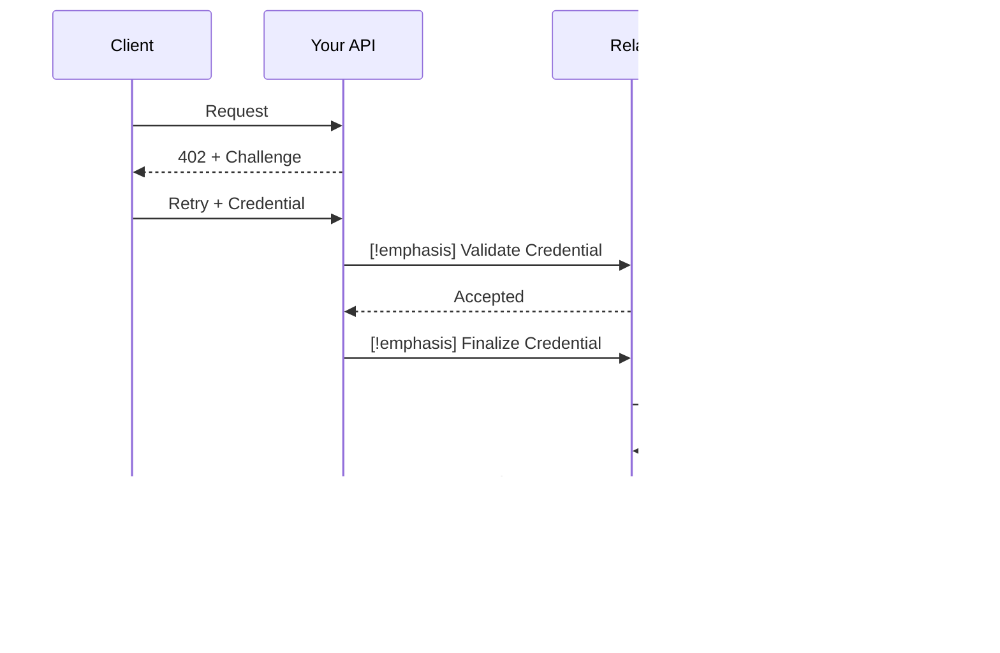
```mermaid
sequenceDiagram
  participant Client
  participant API as Your API
  participant Relay
  participant Tempo as Settlement layer
  Client->>API: Request
  API-->>Client: 402 + Challenge
  Client->>API: Retry + Credential
  API->>Relay: [!emphasis] Validate Credential
  Relay-->>API: Accepted
  API->>Relay: [!emphasis] Finalize Credential
  Relay->>Tempo: Broadcast transaction
  Tempo-->>Relay: Confirmed transaction
  Relay-->>API: Receipt
  API-->>Client: 200 + Receipt

```

The relay flow has two lifecycle hooks:

* `validate` (optional) checks whether a Credential is valid for the underlying payment rail. It does not reserve funds or make state changes.
* `broadcast` submits a transaction to the underlying payment rail after performing the same validity checks as `validate`.

MPP does not define a relay API shape or require functionality beyond these hooks. Relay authors can design and evolve their APIs as their offerings grow.

## Use a relay in your application

Relays preserve the core MPP control flow, so your service works the same with or without one.

### Server integration

Use `mppx`'s built-in `validate` and `broadcast` hooks to call a relay service.

This example calls a networked relay from `validate` and `broadcast` instead of handling payment state locally, and assumes `relay` is an authenticated server-side client.

```ts [methods.server.ts]
import { Method, Receipt } from 'mppx'
import * as Methods from './methods'

export const charge = Method.toServer(Methods.charge, {
  async validate({ credential, request }) { // [!code hl]
    const result = await relay.validate({ credential, request }) // [!code hl]
    if (!result.accepted) throw new Error('Payment was rejected')

    return {
      challenge: credential.challenge,
      credential,
      details: result.details,
      intent: credential.challenge.intent,
      method: credential.challenge.method,
      request,
    }
  },
  async broadcast({ credential, request }) { // [!code hl]
    const result = await relay.finalize({ credential, request }) // [!code hl]

    return Receipt.from({
      method: credential.challenge.method,
      reference: result.reference,
      status: 'success',
      timestamp: result.timestamp,
    })
  },
})
```

### Use Tempo API

If your application settles MPP charges on Tempo, use the [Tempo API](https://tempo.xyz/developers/docs/api/mpp) relay to validate and broadcast transactions.

```ts twoslash [server.ts]
import { Mppx, tempo } from 'mppx/server'

const mppx = Mppx.create({
  methods: [
    // [!code hl:start]
    tempo.charge({
      relay: {
        apiKey: process.env.TEMPO_API_KEY!,
      },
    }),
    // [!code hl:end]
  ],
})
```

For a Tempo API-compatible relay, set `apiBaseUrl` on `relay`.

```ts twoslash [server.ts]
import { Mppx, tempo } from 'mppx/server'

const mppx = Mppx.create({
  methods: [
    // [!code hl:start]
    tempo.charge({
      relay: {
        apiBaseUrl: 'https://mpp.relay.com/tempo',
        apiKey: process.env.TEMPO_API_KEY!,
      },
    }),
    // [!code hl:end]
  ],
})
```

The default API base URL is `https://api.tempo.xyz`. You can also provide `fetch` in `relay` when your runtime needs a custom fetch implementation.

For broadcast retries, the built-in client sends an `Idempotency-Key` beginning with `mpp_` and derived from the signed transaction or canonical request.

## Author a relay

The MPP spec does not formally define relays. It leaves payment methods, API shapes, and transports such as HTTP, JSON-RPC, and gRPC to you.

For a consistent integration experience, implement at least these hooks:

* `validate` (optional) checks whether a Credential is valid for the underlying payment rail. It does not reserve funds or make state changes.
* `broadcast` submits a transaction to the underlying payment rail after performing the same validity checks as `validate`.

# Discovery \[Let clients automatically discover your API's pricing]

## Overview

MPP's discovery system lets clients and agents learn what your endpoints cost before making a request. You serve a standard [OpenAPI 3.1](https://spec.openapis.org/oas/v3.1.0) document at `/openapi.json` with `x-payment-info` extensions that advertise one or more payment offers for each paid operation. Registries aggregate these documents so agents can find paid APIs automatically, and provide value-added services like reputation, search, and analytics.

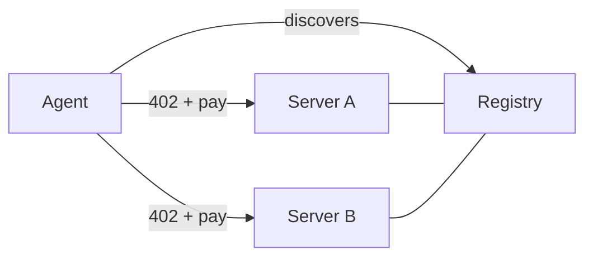
```mermaid
flowchart LR
  Agent -->|discovers| Registry
  Agent -->|402 + pay| ServerA[Server A]
  Agent -->|402 + pay| ServerB[Server B]
  ServerA --- Registry
  ServerB --- Registry
```

:::info[Discovery is advisory]
Discovery documents are informational hints. The runtime `402` Challenge remains the authoritative source of payment terms. Clients use discovery for display and planning, but defer to the Challenge for actual payment.
:::

## Registries

Registries aggregate discovery documents from multiple services, making it easy for clients and agents to find paid APIs.

| Registry | Description | How to add |
|----------|-------------|------------|
| [MPPScan](https://mppscan.com) | Public registry of MPP-enabled services with search and analytics | [Manually register](https://www.mppscan.com/register) in one click |
| [MPP Services directory](https://mpp.dev/services) | Curated list of live services on mpp.dev | [Follow the submission guide](/services#list-your-service) |

Agents can query the curated services directory over MCP at
`https://mpp.dev/mcp/services`. The server is read-only and exposes tools to
list services, rank services for an agent task, inspect endpoint offers, get
usage recipes, look up services by payment recipient, inspect available filters,
and fetch advisory OpenAPI summaries.

### Services MCP

The services MCP server is the agent-facing discovery surface for the curated
MPP directory:

```text
https://mpp.dev/mcp/services
```

Use it when an agent needs to:

* rank paid APIs by task, category, integration, or payment method
* turn a selected service into a usage recipe with endpoint candidates
* compare endpoint-level payment offers before constructing a request
* identify which services publish offers for a payment recipient from a `402`
  Challenge
* inspect catalog facets before narrowing a search
* fetch a live OpenAPI summary or registry-derived endpoint view

```json
{
  "mcpServers": {
    "mpp-services": {
      "url": "https://mpp.dev/mcp/services"
    }
  }
}
```

The MCP server is advisory and read-only. After discovery, clients call the
target service directly and treat the runtime `402` Challenge as authoritative.

For agent setup, MCP Inspector smoke tests, example prompts, and recipes, see
[Discover MPP services on Tempo docs](https://docs.tempo.xyz/guide/machine-payments/discover-services).

## Quick start

The `mppx` SDK generates discovery documents from your route configuration. Add `discovery()` to your server and it serves `/openapi.json` automatically.

```ts [server.ts]
import { Hono } from 'hono'
import { Mppx, discovery } from 'mppx/hono'
import { tempo } from 'mppx/server'

const app = new Hono()

const mppx = Mppx.create({
  methods: [
    tempo.charge({
      currency: '0x20c0000000000000000000000000000000000000',
      recipient: '0x...',
      testnet: true,
    }),
  ],
  secretKey: process.env.MPP_SECRET_KEY,
})

app.get('/v1/fortune', mppx.charge({ amount: '0.01' }), (c) => c.json({ fortune: 'You will be rich' }))

// [!code hl:start]
discovery(app, mppx, {
  auto: true,
  info: { title: 'Fortune API', version: '1.0.0' },
})
// [!code hl:end]
```

This generates a `GET /openapi.json` endpoint with canonical `x-payment-info.offers[]` entries on each paid route.

### Composed offers

Pass a composed handler to `discovery()` when one route accepts multiple payment options. The generated operation preserves every nested offer in the same order as the runtime Challenges.

```ts twoslash [server.ts]
import { Hono } from 'hono'
import { discovery } from 'mppx/hono'
import { Mppx, stripe, tempo } from 'mppx/server'

const app = new Hono()
const charge = tempo.charge({
  currency: '0x20c0000000000000000000000000000000000000', // pathUSD on Tempo
  recipient: '0xf39Fd6e51aad88F6F4ce6aB8827279cffFb92266',
})
const card = stripe.spt({
  decimals: 2,
  networkId: 'acct_1234',
  paymentMethodTypes: ['card'],
  secretKey: 'sk_live_...',
})
const mppx = Mppx.create({ methods: [charge, card] })

const pay = mppx.compose(
  [charge, { amount: '0.01', description: 'Premium report' }],
  [card, { amount: '1', currency: 'usd', description: 'Premium report' }],
)

app.get('/v1/report', async (c) => {
  const result = await pay(c.req.raw)
  if (result.status === 402) return result.challenge
  return result.withReceipt(c.json({ report: '...' }))
})

discovery(app, mppx, {
  info: { title: 'Reports API', version: '1.0.0' },
  routes: [{ handler: pay, method: 'get', path: '/v1/report' }],
})
```

`mppx` derives discovery prices from each method's canonical Payment Request. Defaults and method transforms therefore match the Challenges returned by the paid route.

### Express

```ts [server.ts]
import express from 'express'
import { Mppx, discovery } from 'mppx/express'
import { tempo } from 'mppx/server'

const app = express()

const mppx = Mppx.create({
  methods: [
    tempo.charge({
      currency: '0x20c0000000000000000000000000000000000000',
      recipient: '0x...',
      testnet: true,
    }),
  ],
  secretKey: process.env.MPP_SECRET_KEY,
})

const pay = mppx.charge({ amount: '0.01' })
app.get('/v1/fortune', pay, (req, res) => res.json({ fortune: 'You will be rich' }))

// [!code hl:start]
discovery(app, mppx, {
  info: { title: 'Fortune API', version: '1.0.0' },
  routes: [{ handler: pay, method: 'get', path: '/v1/fortune' }],
})
// [!code hl:end]
```

### Next.js

In Next.js, `discovery()` returns a route handler you export from an API route.

```ts [app/openapi.json/route.ts]
import { discovery } from 'mppx/nextjs'
import { mppx, pay } from '../fortune/route'

// [!code hl:start]
export const GET = discovery(mppx, {
  info: { title: 'Fortune API', version: '1.0.0' },
  routes: [{ handler: pay, method: 'get', path: '/api/fortune' }],
})
// [!code hl:end]
```

## How it works

Your server exposes a `GET /openapi.json` endpoint that returns an OpenAPI document. Paid operations include an `x-payment-info` extension with one or more payment offers, and the document root can include `x-service-info` for service-level metadata.

```json [/openapi.json]
{
  "openapi": "3.1.0",
  "info": { "title": "My API", "version": "1.0.0" },
  "x-service-info": {
    "categories": ["ai"],
    "docs": {
      "homepage": "https://example.com",
      "apiReference": "https://example.com/docs",
      "llms": "/llms.txt"
    }
  },
  "paths": {
    "/v1/generate": {
      "post": {
        // [!code hl:start]
        "x-payment-info": {
          "offers": [
            {
              "amount": "1000000",
              "currency": "0x20c0000000000000000000000000000000000001",
              "description": "Generate text with Tempo",
              "intent": "charge",
              "method": "tempo"
            },
            {
              "amount": "100",
              "currency": "usd",
              "description": "Generate text with Stripe",
              "intent": "charge",
              "method": "stripe"
            }
          ]
        },
        // [!code hl:end]
        "responses": {
          "200": { "description": "Successful response" },
          "402": { "description": "Payment Required" }
        }
      }
    },
    "/v1/models": {
      "get": {
        "responses": {
          "200": { "description": "Successful response" }
        }
      }
    }
  }
}
```

### `x-payment-info`

Add this extension to any operation that requires payment. Prefer the canonical multi-offer shape:

| Field | Type | Description |
|-------|------|-------------|
| `offers` | `Offer[]` | Ordered list of payment offers the client can choose from |

Validators ignore unknown extension fields next to `offers`. You can't combine `offers` with the spec-defined flat fields `amount`, `currency`, `description`, `intent`, or `method`.

### `offers[]`

| Field | Type | Description |
|-------|------|-------------|
| `amount` | `string \| null` | Payment amount in base units |
| `currency` | `string` | Currency code or token address |
| `description` | `string` | Human-readable description of the charge |
| `intent` | `string` | Payment intent (`charge` or `session`) |
| `method` | `string` | Payment method identifier (`tempo`, `stripe`) |

:::note[Compatibility shorthand]
The flat single-offer form is still valid as shorthand for older emitters, but use it only for backward compatibility. New documents write the same data under `offers[]`.

```json [openapi.json]
{
  // [!code hl:start]
  "x-payment-info": {
    "amount": "1000000",
    "currency": "0x20c0000000000000000000000000000000000001",
    "description": "Generate text with Tempo",
    "intent": "charge",
    "method": "tempo"
  }
  // [!code hl:end]
}
```
:::

### `x-service-info`

Optional root-level metadata about the service:

| Field | Type | Description |
|-------|------|-------------|
| `categories` | `string[]` | Free-form service categories (for example, `ai`, `payments`) |
| `docs.homepage` | `string` | Link to the service homepage |
| `docs.apiReference` | `string` | Link to API documentation |
| `docs.llms` | `string` | Link to an `llms.txt` file for AI consumption |

## Build manually

You can author a discovery document by hand following the discovery specification. The document is a standard OpenAPI 3.1 file with two extensions:

::::steps
### Create the OpenAPI skeleton

Start with a standard OpenAPI 3.1 document:

```json [openapi.json]
{
  "openapi": "3.1.0",
  "info": {
    "title": "My API",
    "version": "1.0.0"
  },
  "paths": {}
}
```

### Add `x-payment-info` to paid operations

For each endpoint that requires payment, add the `x-payment-info` extension with an `offers` array. Add more objects to `offers[]` when the client can choose between alternative payment methods or currencies. Amounts are in base units (for example, `1000000` for $1.00 with 6 decimals).

```json [openapi.json]
{
  "paths": {
    "/v1/generate": {
      "post": {
        "summary": "Generate text",
        // [!code hl:start]
        "x-payment-info": {
          "offers": [
            {
              "amount": "1000000",
              "currency": "0x20c0000000000000000000000000000000000001",
              "intent": "charge",
              "method": "tempo"
            }
          ]
        },
        // [!code hl:end]
        "responses": {
          "200": { "description": "Successful response" },
          "402": { "description": "Payment Required" }
        }
      }
    }
  }
}
```

:::warning[Include a 402 response]
Operations with `x-payment-info` must include a `402` response in the `responses` object. Validators flag this as an error if missing.
:::

### Add `x-service-info` (optional)

Add service-level metadata to the document root:

```json [openapi.json]
{
  // [!code hl:start]
  "x-service-info": {
    "categories": ["ai", "text-generation"],
    "docs": {
      "homepage": "https://example.com",
      "apiReference": "https://example.com/docs/api",
      "llms": "https://example.com/llms.txt"
    }
  }
  // [!code hl:end]
}
```

### Serve at `/openapi.json`

Serve the document at `GET /openapi.json` with appropriate caching:

```http
HTTP/1.1 200 OK
Content-Type: application/json
Cache-Control: public, max-age=300
```
::::

## CLI

Generate a static discovery document from a config module:

```bash [terminal]
$ npx mppx discover generate ./discovery.config.ts
```

Validate an existing discovery document from a file or URL:

```bash [terminal]
$ npx mppx discover validate https://example.com/openapi.json
```

## Validation

Common validation issues:

| Issue | Severity | Description |
|-------|----------|-------------|
| Missing `402` response | Error | Operations with `x-payment-info` must include a `402` response |
| Invalid amount format | Error | Each `offers[].amount` value must be a non-negative integer string |
| Missing `requestBody` | Warning | `POST`/`PUT`/`PATCH` operations without a `requestBody` definition |
| Invalid URI in docs | Error | `docs` links must be valid URIs or absolute paths |

## Specification

[IETF Specification](https://paymentauth.org/draft-payment-discovery-00) — Read the full specification

# Identity \[Verify agents and clients]

Use request attestations to verify which automated client sent a request, then use MPP Credentials to verify the identity that authorized a payment.

## Overview

`mppx` supports two complementary identity layers:

| Layer | Verifies | Use it for |
|---|---|---|
| [**Request attestation**](#request-attestation) | The automated client or agent provider that signed an HTTP request | Bot recognition, allowlists, rate limits, and agent-specific policy |
| [**MPP Credential**](#mpp-credential-identity) | The key in the Credential's `source` field | Payment authorization, ownership, and identity-only MPP flows |

An attestation doesn't authorize a payment or prove the end user's identity. Apply your own policy after verifying the agent, and verify the MPP Credential separately when the request requires payment.

## Request attestation

Request attestation uses [RFC 9421 HTTP Message Signatures](https://www.rfc-editor.org/rfc/rfc9421) to bind an agent identity to an HTTP request. `mppx` supports Ed25519 and RSA-PSS SHA-512 signatures through two profiles:

| Profile | Trust source | Signed request data | Recommended use |
|---|---|---|---|
| [**Web Bot Auth**](#use-web-bot-auth) | Public key associated with a trusted HTTPS directory | Authority and `Signature-Agent` | General bot and agent identification |
| [**Trusted Agent Protocol**](#use-trusted-agent-protocol) | Public key provisioned by a trusted agent provider | Authority and path | Commerce agents with explicit browse or payment intent |

The client attests the initial request and every automatic MPP retry. Each attempt gets a fresh nonce and timestamp. The server verifies the attestation before it issues a Challenge or accepts a Credential.

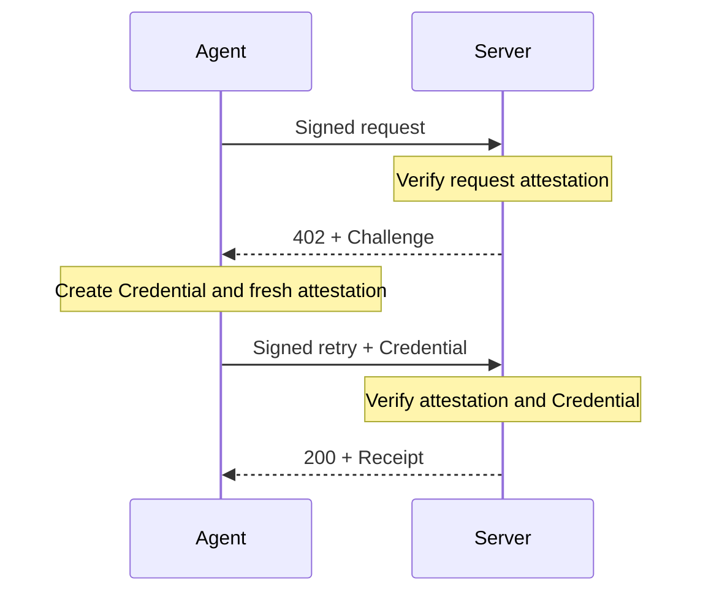
```mermaid
sequenceDiagram
  participant Agent
  participant Server
  Agent->>Server: Signed request
  Note over Server: Verify request attestation
  Server-->>Agent: 402 + Challenge
  Note over Agent: Create Credential and fresh attestation
  Agent->>Server: Signed retry + Credential
  Note over Server: Verify attestation and Credential
  Server-->>Agent: 200 + Receipt

```

### Use Web Bot Auth

[Web Bot Auth](https://datatracker.ietf.org/doc/html/draft-meunier-web-bot-auth-architecture) identifies automated HTTP clients through a signed `Signature-Agent` header. Use the HTTPS-directory profile when the agent publishes its keys through a directory origin that your server trusts.

Configure the signer on the MPP client. `keyId` must be the RFC 7638 SHA-256 thumbprint of the public key registered for the bot.

```ts twoslash [client.ts]
import * as WebBotAuth from 'mppx/attestation/web-bot-auth'
import { Mppx, tempo } from 'mppx/client'
import type { Account } from 'viem'

declare const account: Account
declare const botPrivateKey: CryptoKey

const botIdentity = {
  keyId: 'poqkLGiymh_W0uP6PZFw-dvez3QJT5SolqXBCW38r0U',
  signatureAgent: 'https://bot.example',
} as const

const client = Mppx.create({
  // [!code hl:start]
  attestation: {
    webBotAuth: WebBotAuth.Client.signer({
      key: botPrivateKey,
      keyId: botIdentity.keyId,
      signatureAgent: botIdentity.signatureAgent,
    }),
  },
  // [!code hl:end]
  methods: [tempo({ account })],
  polyfill: false,
})

const response = await client.fetch('https://api.example.com/resource')
console.log(response.status)
// @log: 200
```

Configure the verifier on the MPP server. The resolver receives the signed directory origin and key ID. Apply your trust policy before you return a key.

```ts twoslash [server.ts]
import * as WebBotAuth from 'mppx/attestation/web-bot-auth'
import { Mppx, Store, tempo } from 'mppx/server'

declare const botPublicKey: CryptoKey

const botIdentity = {
  keyId: 'poqkLGiymh_W0uP6PZFw-dvez3QJT5SolqXBCW38r0U',
  signatureAgent: 'https://bot.example',
} as const

const payment = Mppx.create({
  // [!code hl:start]
  attestation: {
    webBotAuth: WebBotAuth.Server.verifier({
      keyResolver({ keyId, signatureAgent }) {
        if (
          keyId !== botIdentity.keyId ||
          signatureAgent !== botIdentity.signatureAgent
        ) return undefined
        return botPublicKey
      },
      maxAge: 60,
      nonceStore: Store.memory(),
    }),
  },
  // [!code hl:end]
  methods: [tempo.charge()],
})

export const handler = payment.charge({ amount: '0.05' })
```

:::warning[Trust the directory before fetching]
The verifier doesn't fetch the caller-provided `Signature-Agent` URL. Allowlist the origin before a directory lookup, prevent redirects to untrusted origins, and return an extractable public key so `mppx` can verify its JWK thumbprint.
:::

### Use Trusted Agent Protocol

[Trusted Agent Protocol](https://developer.visa.com/capabilities/trusted-agent-protocol/trusted-agent-protocol-specifications/) (TAP) identifies an agent that a merchant or payment network trusts. TAP signatures include an intent: `browse` for discovery and `payment` for payment-related requests.

Use `payment` for an MPP client that accesses paid routes. The signer uses an eight-minute lifetime by default, which is TAP's maximum.

```ts twoslash [client.ts]
import * as Tap from 'mppx/attestation/tap'
import { Mppx, tempo } from 'mppx/client'
import type { Account } from 'viem'

declare const account: Account
declare const agentPrivateKey: CryptoKey

const client = Mppx.create({
  // [!code hl:start]
  attestation: {
    tap: Tap.Client.signer({
      intent: 'payment',
      key: agentPrivateKey,
      keyId: 'agent-provider-key-1',
    }),
  },
  // [!code hl:end]
  methods: [tempo({ account })],
  polyfill: false,
})

const response = await client.fetch('https://merchant.example/checkout')
console.log(response.status)
// @log: 200
```

On the server, resolve `keyId` only from agent providers you trust. The verifier checks the signature, request authority and path, lifetime, intent tag, and nonce.

```ts twoslash [server.ts]
import * as Tap from 'mppx/attestation/tap'
import { Mppx, Store, tempo } from 'mppx/server'

declare const trustedAgentKeys: ReadonlyMap<string, CryptoKey>

const payment = Mppx.create({
  // [!code hl:start]
  attestation: {
    tap: Tap.Server.verifier({
      keyResolver({ keyId }) {
        return trustedAgentKeys.get(keyId)
      },
      nonceStore: Store.memory(),
    }),
  },
  // [!code hl:end]
  methods: [tempo.charge()],
})

export const handler = payment.charge({ amount: '12.50' })
```

`Mppx.create` treats an invalid attestation as `401`, and treats an absent attestation or unresolved key as `403`. Every verifier in the server's `attestation` map must return `verified`. Configure both Web Bot Auth and TAP only when each request must carry both signatures.

### Use the framework directly

Outside `Mppx.create`, combine signers with one shared signing context and wrap any Fetch implementation. Each call to the wrapped Fetch creates a new context.

```ts twoslash [client.ts]
import * as Attestation from 'mppx/attestation'

declare const tapSigner: Attestation.Signer<'tap'>
declare const webBotAuthSigner: Attestation.Signer<'web-bot-auth'>

const signer = Attestation.Client.composeSigners(
  tapSigner,
  webBotAuthSigner,
)
const fetch = Attestation.Client.wrapFetch(globalThis.fetch, signer)

await fetch('https://api.example.com/resource')
```

Use the lower-level framework when application policy needs the verified key ID, TAP intent, or Web Bot Auth directory. Each verifier returns `absent`, `invalid`, `unverified`, or `verified`.

```ts twoslash [server.ts]
import * as Attestation from 'mppx/attestation'
import * as Tap from 'mppx/attestation/tap'
import { Mppx, tempo } from 'mppx/server'

declare const trustedAgentKeys: ReadonlyMap<string, CryptoKey>

const nonceStore = Attestation.Store.memory()
const tap = Tap.Server.verifier({
  keyResolver({ keyId }) {
    return trustedAgentKeys.get(keyId)
  },
  nonceStore,
})
const payment = Mppx.create({ methods: [tempo.charge()] })
const charge = payment.charge({ amount: '12.50' })

export async function handler(request: Request) {
  const result = await Attestation.Server.verify(request, { tap })
  const verification = result.tap

  if (verification.status !== 'verified') {
    return new Response('Trusted agent required', { status: 403 })
  }

  console.log(verification.value.intent)
  // @log: payment
  const paymentResult = await charge(request)
  if (paymentResult.status === 402) return paymentResult.challenge
  return paymentResult.withReceipt(new Response('Accepted'))
}
```

Don't pass the same verifier to `Mppx.create` in this pattern. Verification consumes the nonce, so verifying the same request twice correctly reports a replay.

### Store nonces

Attestation verifiers accept the core `Store.AtomicStore`. `Store.memory()` is limited to one long-lived server process. In a multi-instance deployment, provide a shared atomic store so every instance claims nonces through their expiration time.

```ts [nonce-store.ts]
import type { Store } from 'mppx'

declare const nonceDatabase: {
  insertIfAbsent(value: { expires: number; key: string }): Promise<boolean>
}
declare const sharedStore: Store.AtomicStore

export const nonceStore = {
  ...sharedStore,
  async tryClaim(key: string, expires: number) {
    return nonceDatabase.insertIfAbsent({ expires, key })
  },
} satisfies Store.AtomicStore
```

Adapt `tryClaim` to your storage client's atomic insert-if-absent operation. It returns `true` when it records a new claim and `false` when an unexpired claim already exists. If your `AtomicStore` omits this optimized method, `mppx` falls back to its atomic `update` operation. See [`Store.tryClaim`](/sdk/typescript/core/Store.tryClaim).

## MPP Credential identity

The Credential proves the client controls a specific public key. Its `source` field remains the same regardless of the payment amount, so you can associate paid and identity-only requests with one key.

Extract the client's identity from any verified request using `Credential.fromRequest`:

```ts twoslash [server.ts]
// @noEmit
declare const request: Request
// ---cut---
import { Credential } from 'mppx'

const credential = Credential.fromRequest(request)
const clientIdentity = credential.source
// @log: "did:pkh:eip155:4217:0x1234..."
```

Backends key workloads, sessions, and access control on this public key. Payment and request attestation remain separate from Credential identity.

## Zero-dollar auth

Zero-dollar auth uses the standard Challenge → Credential flow with the amount set to `0`. The client signs the Challenge to prove key ownership. No funds move on-chain, and no additional protocol extensions are required.

For Tempo charge, zero-dollar auth now uses a `proof` Credential payload instead of a real transaction. The client signs a proof message over the Challenge ID, and the server verifies that signature against the `source` DID.

:::warning[Replay protection]
By default, a valid zero-dollar proof remains reusable until the Challenge expires. Pass a `store` to `tempo.charge()` when you want single-use proof auth. In a multi-instance deployment, use a shared store so every instance sees consumed proofs.
:::

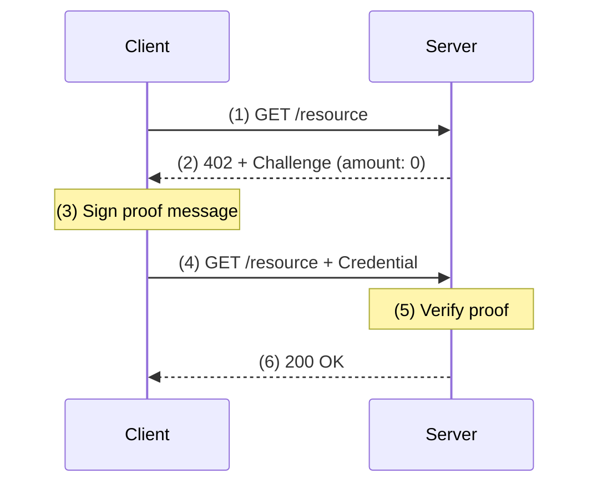
```mermaid
sequenceDiagram
  participant Client
  participant Server
  Client->>Server: (1) GET /resource
  Server-->>Client: (2) 402 + Challenge (amount: 0)
  Note over Client: (3) Sign proof message
  Client->>Server: (4) GET /resource + Credential
  Note over Server: (5) Verify proof
  Server-->>Client: (6) 200 OK

```

The Credential contains the client's public key and a valid signature, giving the server a verified identity to associate with the request.

For Tempo, the server rejects `transaction` and `hash` payloads for zero-amount Challenges and requires `proof`.

### Case study: long-running jobs

A service accepts a paid request to start work, then lets the client poll for results using zero-dollar auth. The server keys workloads on the client's public key.

:::steps
### Client submits a job (paid)

The client sends a request with payment to create a new job. The Credential includes both payment proof and the client's public key.

```ts twoslash [client.ts]
// @noEmit
declare const fetch: (url: string) => Promise<{ json(): Promise<any> }>
// ---cut---
const response = await fetch('https://api.example.com/v1/jobs')
const { jobId } = await response.json()
// @log: { jobId: "abc123" }
```

The server records the job and associates it with the client's public key from the Credential.

### Server stores the public key

After the payment middleware verifies the Credential, extract the client's identity from the request:

```ts [server.ts]
import { Credential } from 'mppx'

export async function handler(request: Request) {
  const result = await mppx.charge({ amount: '1.00' })(request)
  if (result.status === 402) return result.challenge

  const credential = Credential.fromRequest(request)
  // [!code hl:start]
  const pubkey = credential.source
  const jobId = createJob({ owner: pubkey })
  // [!code hl:end]

  return result.withReceipt(Response.json({ jobId }))
}
```

### Client polls for status (zero-dollar auth)

The client polls the job endpoint. The server issues a zero-dollar Challenge—the client signs it to prove they own the same key.

```ts [server.ts]
export async function statusHandler(request: Request) {
  const result = await mppx.charge({ amount: '0' })(request) // [!code hl]
  if (result.status === 402) return result.challenge

  const credential = Credential.fromRequest(request)
  const job = getJob(jobIdFromUrl(request))

  if (job.owner !== credential.source) {
    return Response.json({ error: 'Not your job' }, { status: 403 })
  }

  return result.withReceipt(Response.json({ result: job.result, status: job.status }))
}
```
:::

### Case study: paid unlock with free access

A service charges once to unlock a resource, then grants repeated free access tied to the client's identity. This replaces API keys with cryptographic ownership.

:::steps
### Client pays to unlock

The client pays once to gain access. The server records the public key as an authorized user.

```ts [server.ts]
export async function unlockHandler(request: Request) {
  const result = await mppx.charge({ amount: '50.00' })(request)
  if (result.status === 402) return result.challenge

  const credential = Credential.fromRequest(request)
  grantAccess({ dataset: 'premium', owner: credential.source }) // [!code hl]

  return result.withReceipt(Response.json({ status: 'unlocked' }))
}
```

### Client accesses the resource (zero-dollar auth)

Subsequent requests use zero-dollar auth. The server checks the client's identity against the access list.

```ts [server.ts]
export async function accessHandler(request: Request) {
  const result = await mppx.charge({ amount: '0' })(request) // [!code hl]
  if (result.status === 402) return result.challenge

  const credential = Credential.fromRequest(request)
  if (!hasAccess({ dataset: 'premium', owner: credential.source })) {
    return Response.json({ error: 'Not unlocked' }, { status: 403 })
  }

  return result.withReceipt(Response.json({ data: getDataset('premium') }))
}
```
:::

### Case study: multi-step agent workflow

An agent orchestrates a pipeline where one paid step kicks off several follow-up steps that only need identity. Each step verifies the same public key to maintain continuity across the workflow.

:::steps
### Agent starts the pipeline (paid)

The agent pays to kick off generation. The server returns a pipeline ID tied to the agent's public key.

```ts [server.ts]
export async function createPipelineHandler(request: Request) {
  const result = await mppx.charge({ amount: '5.00' })(request)
  if (result.status === 402) return result.challenge

  const credential = Credential.fromRequest(request)
  const pipelineId = createPipeline({ owner: credential.source }) // [!code hl]

  return result.withReceipt(Response.json({ pipelineId }))
}
```

### Agent retrieves intermediate results (zero-dollar auth)

The agent polls each stage of the pipeline. Every request proves the same identity without additional payment.

```ts [server.ts]
export async function stageHandler(request: Request) {
  const result = await mppx.charge({ amount: '0' })(request) // [!code hl]
  if (result.status === 402) return result.challenge

  const credential = Credential.fromRequest(request)
  const pipeline = getPipeline(pipelineIdFromUrl(request))

  if (pipeline.owner !== credential.source) {
    return Response.json({ error: 'Not your pipeline' }, { status: 403 })
  }

  const stage = pipeline.stages[stageFromUrl(request)]
  return result.withReceipt(Response.json({ output: stage.output, status: stage.status }))
}
```

### Agent downloads the final artifact (zero-dollar auth)

The final download also uses zero-dollar auth—the server already collected payment at the start.

```ts [server.ts]
export async function resultHandler(request: Request) {
  const result = await mppx.charge({ amount: '0' })(request) // [!code hl]
  if (result.status === 402) return result.challenge

  const credential = Credential.fromRequest(request)
  const pipeline = getPipeline(pipelineIdFromUrl(request))

  if (pipeline.owner !== credential.source) {
    return Response.json({ error: 'Not your pipeline' }, { status: 403 })
  }

  return result.withReceipt(Response.json({ result: pipeline.finalResult }))
}
```
:::

# Payment hooks \[Observe payment lifecycles]

## Choose a signing account

### Direct

Create a server-only wallet.ts module, then import account wherever an example creates a local signing account.

```ts
import { privateKeyToAccount } from 'viem/accounts'

export const account = privateKeyToAccount(process.env.PRIVATE_KEY as `0x${string}`)
```

### Privy

Create an EVM wallet in Privy, fund it with the required currency on this page's network, and keep PRIVY\_APP\_SECRET server-side.

```bash
pnpm add @privy-io/node
```

Create a server-only privy.ts module, then import its account wherever an example configures account or feePayer.

```ts
import { PrivyClient } from '@privy-io/node'
import { createViemAccount } from '@privy-io/node/viem'

const privy = new PrivyClient({
  appId: process.env.PRIVY_APP_ID!,
  appSecret: process.env.PRIVY_APP_SECRET!,
})

export const account = createViemAccount(privy, {
  address: process.env.PRIVY_WALLET_ADDRESS as `0x${string}`,
  walletId: process.env.PRIVY_WALLET_ID!,
})
```

createViemAccount delegates signatures to the Privy wallet, so it replaces any local viem account in the examples on this page.

Payment hooks let you attach logging, metrics, tracing, and request-local context to MPP payment flows without rewriting the payment handler.

## Lifecycle overview

Payment hooks follow the `402` payment flow. The server issues a Challenge for an unpaid request. The client selects that Challenge, creates a Credential, and retries the request. The server verifies the Credential, returns the protected response, and attaches a Receipt.

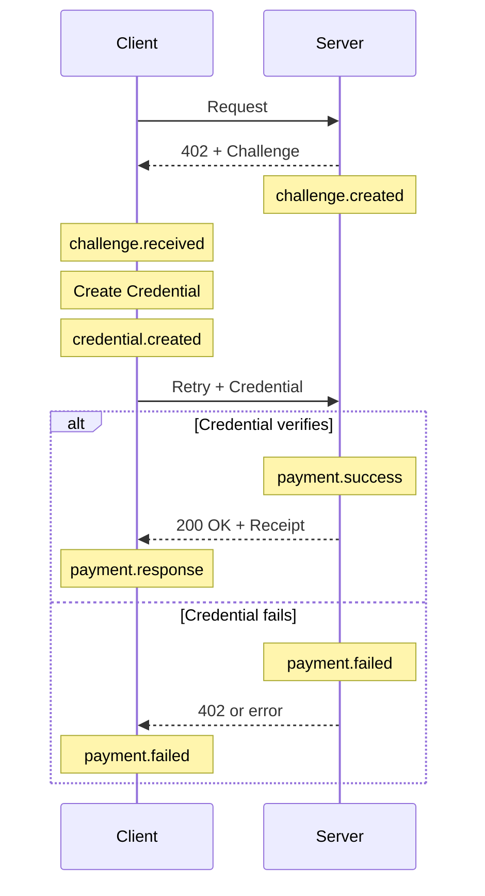
```mermaid
sequenceDiagram
  participant Client
  participant Server
  Client->>Server: Request
  Server-->>Client: 402 + Challenge
  Note over Server: challenge.created
  Note over Client: challenge.received
  Note over Client: Create Credential
  Note over Client: credential.created
  Client->>Server: Retry + Credential
  alt Credential verifies
      Note over Server: payment.success
      Server-->>Client: 200 OK + Receipt
      Note over Client: payment.response
  else Credential fails
      Note over Server: payment.failed
      Server-->>Client: 402 or error
      Note over Client: payment.failed
  end

```

## Server hooks

Register server hooks on the object returned by `Mppx.create` from `mppx/server`.

| Hook | Canonical event | Runs when |
|---|---|---|
| `onChallengeCreated` | `challenge.created` | The server issues a payment Challenge |
| `onPaymentSuccess` | `payment.success` | The server verifies payment and creates a Receipt |
| `onPaymentFailed` | `payment.failed` | A submitted Credential or standalone verification fails |
| `on('*', handler)` | `*` | Any server payment event fires |

Server handlers are awaited inline and sequentially on the payment request path. Handler errors are ignored and do not change payment handling, but slow handlers still delay the response.

```ts twoslash [server.ts]
import { Mppx, tempo } from 'mppx/server'

const payment = Mppx.create({
  methods: [tempo.charge(), tempo.session()],
})

payment.onChallengeCreated(({ challenge, method, request }) => { // [!code hl]
  console.log('challenge.created', {
    amount: request.amount,
    challengeId: challenge.id,
    intent: method.intent,
    method: method.name,
  })
})

payment.onPaymentSuccess(({ method, receipt, request }) => { // [!code hl]
  console.log('payment.success', {
    amount: request.amount,
    intent: method.intent,
    method: method.name,
    reference: receipt.reference,
  })
})

payment.onPaymentFailed(({ error, method, submittedChallenge }) => { // [!code hl]
  console.log('payment.failed', {
    challengeId: submittedChallenge?.id,
    error: error.name,
    intent: method.intent,
    method: method.name,
  })
})
```

### Scope success hooks to a method

Pass `onPaymentSuccess` to a method constructor when the side effect belongs only to that payment method and intent. The hook receives the associated Challenge, method-specific request, its Receipt, and the HTTP input when available.

```ts
import { Mppx, tempo } from 'mppx/server'

const payment = Mppx.create({
  methods: [
    tempo.charge({
      async onPaymentSuccess({ challenge, input, receipt, request }) {
        await recordCharge({
          amount: request.amount,
          challengeId: challenge?.id,
          path: input ? new URL(input.url).pathname : undefined,
          reference: receipt.reference,
        })
      },
    }),
    tempo.session(),
  ],
})
```

`mppx` registers this as a filtered `payment.success` listener. It runs only when both the method name and intent match. The server awaits it inline and ignores thrown errors, matching instance-level server hook behavior. `challenge` is optional for compatibility, and `input` is absent for standalone `broadcastCredential` and `verifyCredential` calls.

## Client hooks

Register client hooks on the object returned by `Mppx.create` from `mppx/client`.

| Hook | Canonical event | Runs when |
|---|---|---|
| `onChallengeReceived` | `challenge.received` | A `402` Challenge is selected |
| `onCredentialCreated` | `credential.created` | A Credential is created for the selected Challenge |
| `onPaymentResponse` | `payment.response` | The retry after payment returns a successful response |
| `onPaymentFailed` | `payment.failed` | Challenge parsing, Credential creation, or retry handling fails |
| `on('*', handler)` | `*` | Any client payment event fires |

`onChallengeReceived` runs before `onChallenge`. It can return a non-empty Credential string to override the default credential flow. Other client hooks are observers: thrown errors are ignored and do not change payment handling.

```ts twoslash [client.ts]
import { Mppx, tempo } from 'mppx/client'
import { privateKeyToAccount } from 'viem/accounts'

const account = privateKeyToAccount('0x...')

const mppx = Mppx.create({
  methods: [
    tempo.charge({ account }),
    tempo.session({ account, maxDeposit: '10' }),
  ],
  polyfill: false,
})

mppx.onChallengeReceived(({ challenge }) => { // [!code hl]
  console.log('challenge.received', {
    challengeId: challenge.id,
    intent: challenge.intent,
    method: challenge.method,
  })
})

mppx.onCredentialCreated(({ challenge }) => { // [!code hl]
  console.log('credential.created', {
    challengeId: challenge.id,
    intent: challenge.intent,
  })
})

mppx.onPaymentResponse(({ challenge, response }) => { // [!code hl]
  console.log('payment.response', {
    intent: challenge.intent,
    status: response.status,
  })
})

mppx.onPaymentFailed(({ challenge, error }) => { // [!code hl]
  console.log('payment.failed', {
    challengeId: challenge?.id,
    error: error instanceof Error ? error.name : 'Error',
  })
})
```

## Charge intent

For `charge`, one request maps to one payment. The hook events describe the Challenge, the client Credential, and the server Receipt for that charge.

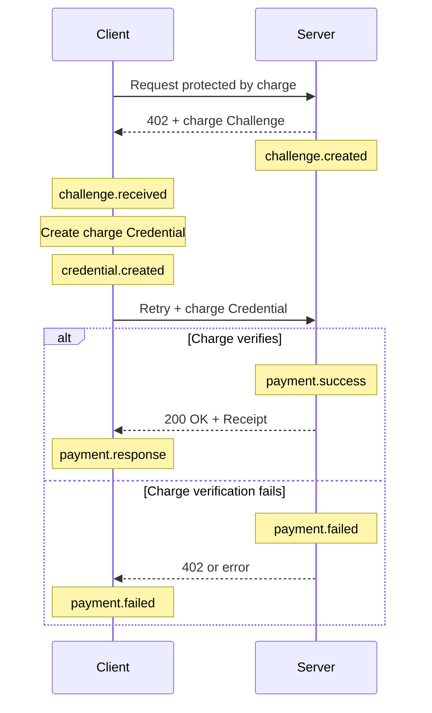
```mermaid
sequenceDiagram
  participant Client
  participant Server
  Client->>Server: Request protected by charge
  Server-->>Client: 402 + charge Challenge
  Note over Server: challenge.created
  Note over Client: challenge.received
  Note over Client: Create charge Credential
  Note over Client: credential.created
  Client->>Server: Retry + charge Credential
  alt Charge verifies
      Note over Server: payment.success
      Server-->>Client: 200 OK + Receipt
      Note over Client: payment.response
  else Charge verification fails
      Note over Server: payment.failed
      Server-->>Client: 402 or error
      Note over Client: payment.failed
  end

```

Use `method.intent === 'charge'` on server hooks or `challenge.intent === 'charge'` on client hooks to isolate charge telemetry.

## Session intent

For `session`, hooks observe the MPP request flow around session Challenges and Credentials. Session-specific channel open, voucher, top-up, close, and settlement behavior is handled by the session method APIs; the payment hook names remain the same.

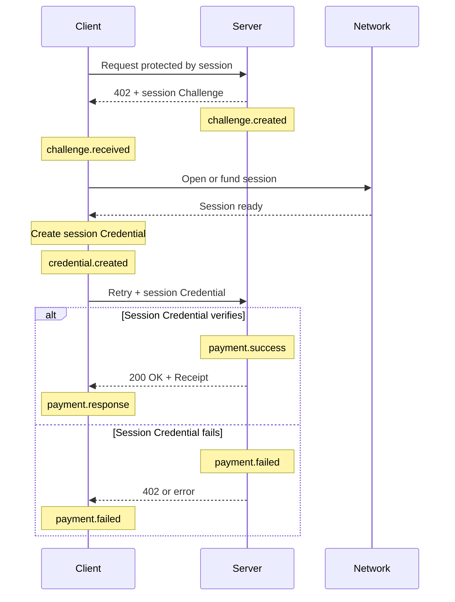
```mermaid
sequenceDiagram
  participant Client
  participant Server
  participant Network
  Client->>Server: Request protected by session
  Server-->>Client: 402 + session Challenge
  Note over Server: challenge.created
  Note over Client: challenge.received
  Client->>Network: Open or fund session
  Network-->>Client: Session ready
  Note over Client: Create session Credential
  Note over Client: credential.created
  Client->>Server: Retry + session Credential
  alt Session Credential verifies
      Note over Server: payment.success
      Server-->>Client: 200 OK + Receipt
      Note over Client: payment.response
  else Session Credential fails
      Note over Server: payment.failed
      Server-->>Client: 402 or error
      Note over Client: payment.failed
  end

```

Use `method.intent === 'session'` on server hooks or `challenge.intent === 'session'` on client hooks to isolate session telemetry.

```ts twoslash [server.ts]
import { Mppx, tempo } from 'mppx/server'

const payment = Mppx.create({
  methods: [tempo.session()],
})

payment.onPaymentSuccess(({ method, receipt, request }) => { // [!code hl]
  if (method.intent !== 'session') return

  console.log('session.payment.success', {
    amount: request.amount,
    method: method.name,
    reference: receipt.reference,
  })
})
```

## Subscription intent

For `subscription`, hooks observe the payment flow when the server issues a subscription Challenge and the client returns a subscription Credential. Later requests can be authorized by method-specific subscription state.

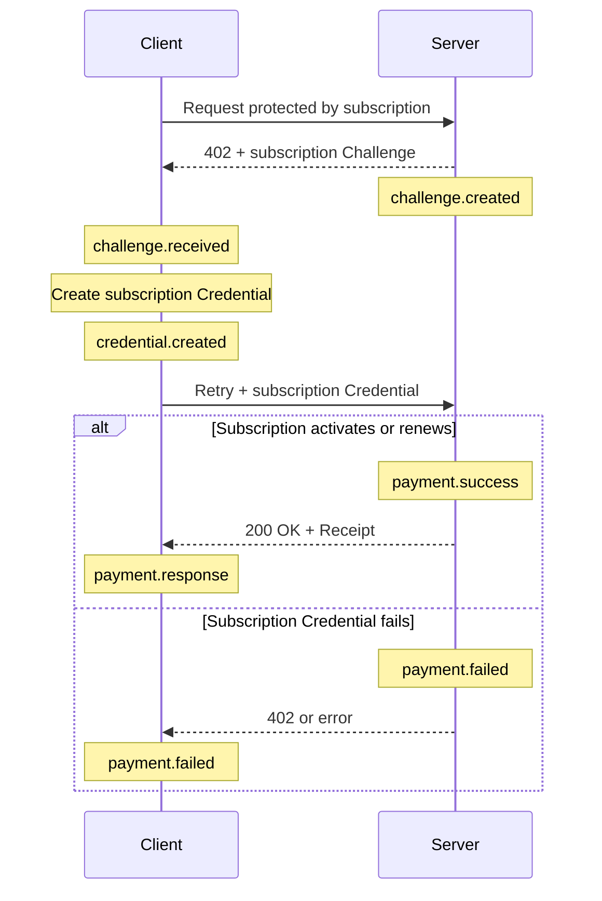
```mermaid
sequenceDiagram
  participant Client
  participant Server
  Client->>Server: Request protected by subscription
  Server-->>Client: 402 + subscription Challenge
  Note over Server: challenge.created
  Note over Client: challenge.received
  Note over Client: Create subscription Credential
  Note over Client: credential.created
  Client->>Server: Retry + subscription Credential
  alt Subscription activates or renews
      Note over Server: payment.success
      Server-->>Client: 200 OK + Receipt
      Note over Client: payment.response
  else Subscription Credential fails
      Note over Server: payment.failed
      Server-->>Client: 402 or error
      Note over Client: payment.failed
  end

```

Use `method.intent === 'subscription'` on server hooks or `challenge.intent === 'subscription'` on client hooks to isolate subscription telemetry.

## Event payloads

Payloads carry the selected method, Challenge, request context, and event result. `on('*')` receives `{ name, payload }`; typed helpers receive the inner payload directly.

```ts [server-event.ts]
{
  name: 'payment.success',
  payload: {
    challenge: { id: 'ch_123', intent: 'session', method: 'tempo' },
    method: { intent: 'session', name: 'tempo' },
    receipt: {
      method: 'tempo',
      reference: '0x...',
      status: 'success',
      timestamp: '2026-06-24T00:00:00.000Z',
    },
    request: { amount: '0.01' },
  },
}
```

```ts [client-event.ts]
{
  name: 'payment.response',
  payload: {
    challenge: { id: 'ch_123', intent: 'session', method: 'tempo' },
    credential: 'Payment ...',
    method: { intent: 'session', name: 'tempo' },
    response: new Response(null, { status: 200 }),
  },
}
```

## Subscription management

Each hook registration returns an unsubscribe function. Keep the function when a handler is temporary, such as request-scoped instrumentation, tests, or a process that recreates payment instances. Call it to detach the handler and stop receiving events.

```ts twoslash [server.ts]
import { Mppx, tempo } from 'mppx/server'

const payment = Mppx.create({
  methods: [tempo.charge()],
})

const unsubscribe = payment.onPaymentSuccess(({ receipt }) => {
  console.log(receipt.reference)
})

unsubscribe() // [!code hl]
```

import { MermaidDiagram } from '../../components/MermaidDiagram'

# Refunds \[Return funds to clients]

## Overview

MPP does not define a dedicated refund protocol. How refunds work depends on the payment flow your service uses.

## Charge flow

In the charge flow, funds transfer to the server immediately when the client pays. Refunds are **out-of-protocol**—the server sends funds back to the client's address directly.

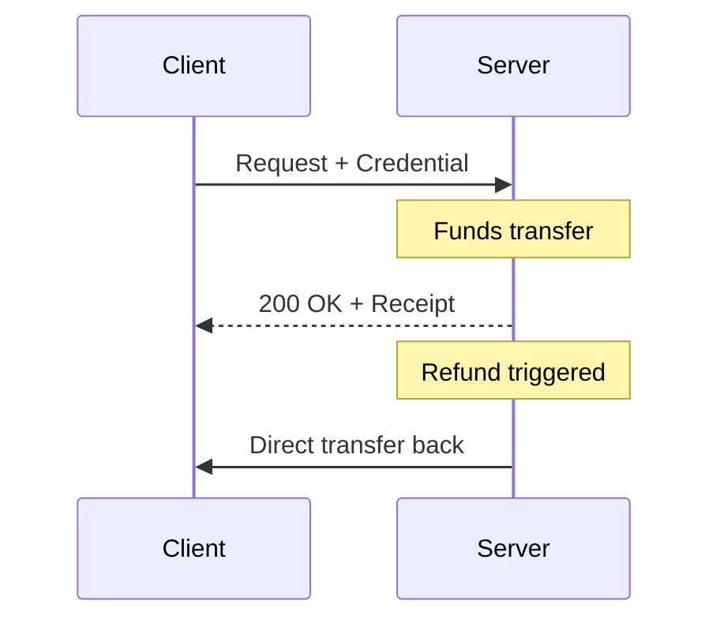
```mermaid
sequenceDiagram
  participant Client
  participant Server
  Client->>Server: Request + Credential
  Note over Server: Funds transfer
  Server-->>Client: 200 OK + Receipt
  Note over Server: Refund triggered
  Server->>Client: Direct transfer back

```

The server knows the client's address from the Credential's `source` field and can return funds at any time using a standard on-chain transfer.

### Implementation

To refund a charge, send the refund amount back to the client's public key:

```ts twoslash [server.ts]
// @noEmit
declare const credential: { source: string }
declare function sendTransfer(params: { amount: string; to: string }): Promise<void>
// ---cut---
async function refundCharge(credential: { source: string }, amount: string) {
  const clientAddress = credential.source
  await sendTransfer({ amount, to: clientAddress })
}
```

Refund decisions are up to your service. Common triggers include failed processing, service errors, or customer support requests.

## Session flow

In the v2 session flow, funds are reserved in a Tempo channel but not immediately claimed. If the server never claims the reserved funds, they return to the client after the session expires or closes.

This gives sessions a **built-in refund mechanism**—unclaimed funds are refunded by default.

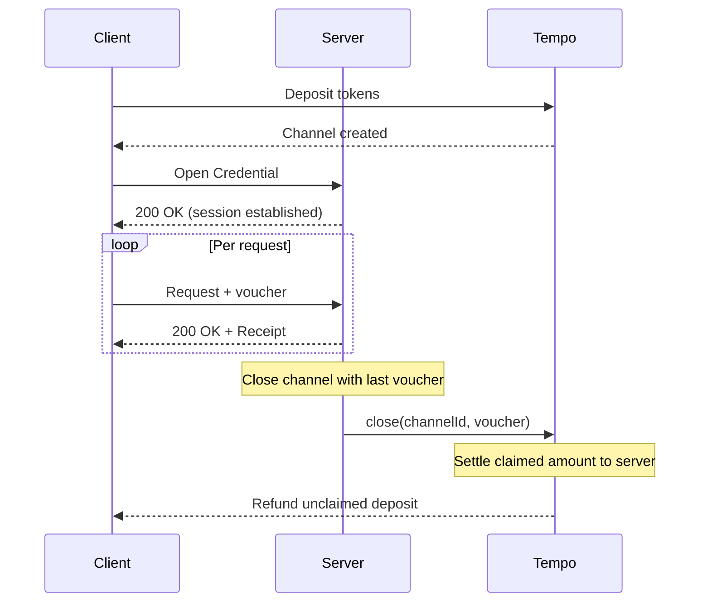
```mermaid
sequenceDiagram
  participant Client
  participant Server
  participant Tempo
  Client->>Tempo: Deposit tokens
  Tempo-->>Client: Channel created
  Client->>Server: Open Credential
  Server-->>Client: 200 OK (session established)
  loop Per request
      Client->>Server: Request + voucher
      Server-->>Client: 200 OK + Receipt
  end
  Note over Server: Close channel with last voucher
  Server->>Tempo: close(channelId, voucher)
  Note over Tempo: Settle claimed amount to server
  Tempo-->>Client: Refund unclaimed deposit

```

| Scenario | Outcome |
|----------|---------|
| Server claims funds | Payment completes, no refund |
| Server never claims | Funds return to client after session expiry |
| Server claims partial amount | Remaining funds return to client |

### Refunding via channel close

To refund a session, close the channel with the last accepted voucher. Any unclaimed deposit returns to the client automatically.

#### Accounts SDK

```ts [client.ts]
import { tempo } from 'mppx/client'
import { Provider } from 'accounts'

const provider = Provider.create({ mpp: false }) // Avoid double 402 handling; mppx is configured below.
await provider.request({ method: 'wallet_connect' })

const session = tempo.session.manager({
  account: provider.getAccount({ signable: true }),
  getClient: provider.getClient,
  maxDeposit: '10',
})

await session.fetch('https://api.example.com/resource')

const receipt = await session.close()
console.log(receipt?.txHash)
// @log: 0x...
```

#### viem

```ts [client.ts]
import { tempo } from 'mppx/client'
import { privateKeyToAccount } from 'viem/accounts'

const session = tempo.session.manager({
  account: privateKeyToAccount('0x0123456789abcdef0123456789abcdef0123456789abcdef0123456789abcdef'),
  maxDeposit: '10',
})

await session.fetch('https://api.example.com/resource')

const receipt = await session.close()
console.log(receipt?.txHash)
// @log: 0x...
```

## Best practices

* **Track refunds by Credential** — Use the Challenge `id` and Credential `source` to associate refunds with the original payment.
* **Refund to the same address** — Always return funds to the `source` address from the Credential. Don't ask the client for a separate refund address.
* **Treat refunds as a feedback mechanism** — Like traditional payment systems, refunds avoid costly disputes. Handle them promptly through your service's support process.
* **Log refund transactions** — Keep a record of the original payment and the refund transaction for reconciliation.

# Security \[Protect server secrets and payment Credentials]

The core Payment HTTP Authentication Scheme already requires TLS and treats payment Credentials and Receipts as sensitive data. This page covers the operational practices around `MPP_SECRET_KEY` and server deployments.

## Treat `MPP_SECRET_KEY` as root-of-trust material

`MPP_SECRET_KEY` binds HMAC-backed Challenge IDs to your server configuration. If an attacker gets the key, they can mint Challenges that appear server-issued for your `realm`.

* Keep it on trusted servers only.
* Never ship it to browsers, mobile apps, MCP clients, or frontend bundles.
* Use a different key for each environment.
* Never commit it to git or bake it into container images.

## Store it in a secrets manager

Use your platform's secret store as the system of record—AWS Secrets Manager, GCP Secret Manager, Azure Key Vault, HashiCorp Vault, or an equivalent service.

Environment variables are a good delivery mechanism at runtime, but they are not a secrets management strategy by themselves. Inject `MPP_SECRET_KEY` into your process from a managed secret store instead of treating `.env` files or deployment manifests as the source of truth.

## Never log secrets or payment Credentials

Do not log:

* `MPP_SECRET_KEY`
* `Authorization: Payment` headers
* `Payment-Authorization: Payment` headers
* `Payment-Receipt` headers

Keep them out of error messages, debugging output, analytics, traces, and support logs. If you need observability, log stable metadata such as request IDs, Challenge IDs, status codes, or payment method names instead.

## Handle proxies and caches safely

Treat reverse proxies, CDNs, API gateways, and observability pipelines as part of your threat surface.

* Send `Cache-Control: no-store` with `402` responses so intermediaries do not cache Challenges.
* Send `Cache-Control: private` on successful responses that include `Payment-Receipt`.
* Redact `Authorization: Payment`, `Payment-Authorization: Payment`, and `Payment-Receipt` headers in proxy logs, trace exporters, and edge analytics.
* Do not rely on intermediary-specific `402` handling—verify that your deployment forwards `WWW-Authenticate` headers correctly.

## Bind paid requests to the actual request

Use Challenge binding to make sure the paid request matches what your server intended to charge for.

* Include a `digest` parameter for `POST`, `PUT`, and `PATCH` requests so clients cannot change the request body after receiving a Challenge.
* Verify the expected amount, currency, recipient, and route-level business context when checking a Credential.
* Do not use `description` as an authorization input. It is display text, not a security control.

## Rotate with overlap

When you rotate `MPP_SECRET_KEY`, use a staged rollout so in-flight Challenges keep working:

1. Start issuing new Challenges with the new key.
2. Continue verifying the previous key during a short overlap window.
3. Remove the old key after outstanding Challenges have expired.

If your deployment does not support current-and-previous-key verification yet, do a coordinated rollout and wait for the old Challenge TTL window to pass before invalidating the previous key.

## Respond to exposure immediately

If `MPP_SECRET_KEY` is exposed:

1. Rotate it immediately.
2. Remove the old key after your overlap window ends.
3. Scrub logs, traces, and crash reports if the secret landed there.
4. Review issuance and verification telemetry for suspicious activity.
5. Replace the key in every environment where it was reused.

## Prevent replay in production

Replay protection must survive concurrency and multi-instance deployments.

* Use a shared atomic store when your server runs on more than one instance.
* Do not rely on process-local memory for replay protection in distributed deployments.
* Check that zero-amount proof flows have explicit replay protection before you use them for production identity or access control.

## Keep local development separate

A local `.env` file is fine for development if it stays local and out of git. Commit only `.env.example` with placeholders, use a separate development key, and never reuse production secrets in staging or local environments.

## Related security topics

* [Protocol overview](/protocol)
* [HTTP 402](/protocol/http-402)
* [Tempo charge replay protection](/sdk/typescript/server/Method.tempo.charge)

## Read the underlying guidance

* [Payment HTTP Authentication Scheme](/protocol/http-402)
* [Frequently asked questions](/faq)
* [OWASP Secrets Management Cheat Sheet](https://cheatsheetseries.owasp.org/cheatsheets/Secrets_Management_Cheat_Sheet.html)

# Intents \[Payment patterns for MPP]

Intents define what kind of payment a server requests. Each intent specifies the shared request fields, Credential requirements, and settlement semantics that payment methods implement.

## Overview

When a server responds with `402` Payment Required, the `WWW-Authenticate` header includes an `intent` parameter. The intent tells the client whether the request is a one-time payment, recurring authorization, or another payment pattern.

```http
HTTP/1.1 402 Payment Required
WWW-Authenticate: Payment method="tempo", intent="charge", ...
```

Payment methods implement intents on top of a payment rail. For example, Tempo supports `charge`, `session`, and `subscription`, while Stripe currently supports `charge`.

## Available intents

[Charge](/intents/charge) — Collect a fixed one-time payment before returning the resource

[Session](/intents/session) — Meter high-frequency usage with reusable payment state

[Subscription](/intents/subscription) — Collect recurring fixed payments across billing periods

## Choose an intent

| Intent | Best for | Example methods |
|---|---|---|
| [`charge`](/intents/charge) | One request, one payment, known price | [Tempo charge](/payment-methods/tempo/charge), [Stripe charge](/payment-methods/stripe/charge), [Lightning charge](/payment-methods/lightning/charge) |
| [`session`](/intents/session) | High-frequency metered usage with costs calculated over time | [Tempo session](/payment-methods/tempo/session), [Lightning session](/payment-methods/lightning/session) |
| [`subscription`](/intents/subscription) | Fixed recurring access by billing period | [Tempo subscription](/payment-methods/tempo/subscription) |

# Charge \[Immediate one-time payments]

The `charge` intent requests an immediate one-time payment. The client pays a fixed amount and the server settles the transaction before returning the response. This is the simplest MPP payment pattern—one request, one payment, one Receipt.

## How it works

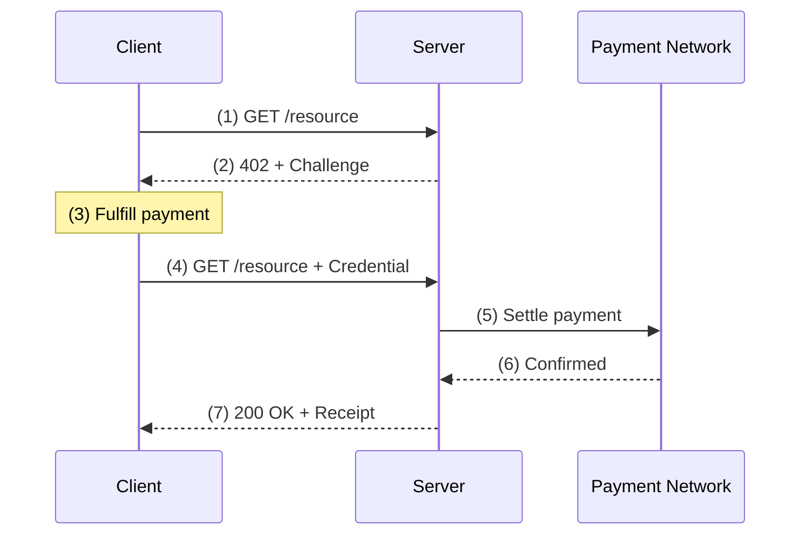
```mermaid
sequenceDiagram
  participant Client
  participant Server
  participant Network as Payment Network
  Client->>Server: (1) GET /resource
  Server-->>Client: (2) 402 + Challenge
  Note over Client: (3) Fulfill payment
  Client->>Server: (4) GET /resource + Credential
  Server->>Network: (5) Settle payment
  Network-->>Server: (6) Confirmed
  Server-->>Client: (7) 200 OK + Receipt

```

1. **Client:** requests a paid resource
2. **Server:** responds with `402` and a Challenge specifying the payment requirements—`amount`, `currency`, and `recipient`
3. **Client:** fulfills the payment using the method specified in the Challenge
4. **Client:** retries the request with the payment proof as a Credential
5. **Server:** verifies the Credential and settles the payment on the underlying network
6. **Network:** confirms the payment
7. **Server:** returns the resource with a Receipt

## When to use charge

Charge is the best intent when each request maps to a single payment with a known cost:

* **Paid API endpoints**—Charge per request for data, compute, or content
* **Content access**—Pay-per-article, pay-per-query, or pay-per-download
* **Tool calls**—MCP tool invocations where each call has a fixed price
* **Simple integrations**—No channel setup, no state management, no storage backend

For metered billing, high volume flows such as scraping, or usage-based billing where the total cost isn't known upfront, use the session intent instead.

## Request schema

The charge intent defines the following request fields:

| Field | Type | Required | Description |
|---|---|---|---|
| `amount` | string | Required | Payment amount in base units |
| `currency` | string | Required | Currency identifier (token address, currency code) |
| `description` | string | Optional | Human-readable description of the payment |
| `externalId` | string | Optional | Server-defined idempotency key |
| `recipient` | string | Optional | Recipient identifier (address, account ID) |

Payment methods extend this schema with method-specific fields through `methodDetails`. For example, Tempo adds `chainId` and `feePayer`.

Set Challenge expiry with the `expires` auth-param in `WWW-Authenticate`. Don't include it in the request object.

## Method integrations

Each payment method defines how charge is fulfilled, verified, and settled on its underlying network.

[Tempo charge](/payment-methods/tempo/charge) — Immediate one-time payments settled on-chain

[Stripe](/payment-methods/stripe) — Traditional payment methods through Stripe

[Lightning](/payment-methods/lightning) — Bitcoin payments over the Lightning Network

[Solana charge](/payment-methods/solana/charge) — One-time payments with signed transactions or confirmed signatures

[Monad charge](/payment-methods/monad/charge) — Immediate one-time payments settled on Monad

[RedotPay charge](/payment-methods/redotpay/charge) — One-time payments with RedotPay payment proofs

[Card](/payment-methods/card) — Card payments via encrypted network tokens

## Specification

[IETF Specification](https://paymentauth.org/draft-payment-intent-charge-00) — Read the full specification

# Session \[Metered pay-as-you-go payments]

The `session` intent establishes reusable payment state so clients can pay for many requests, streamed chunks, or metered units without settling a separate payment for each one.

## How it works

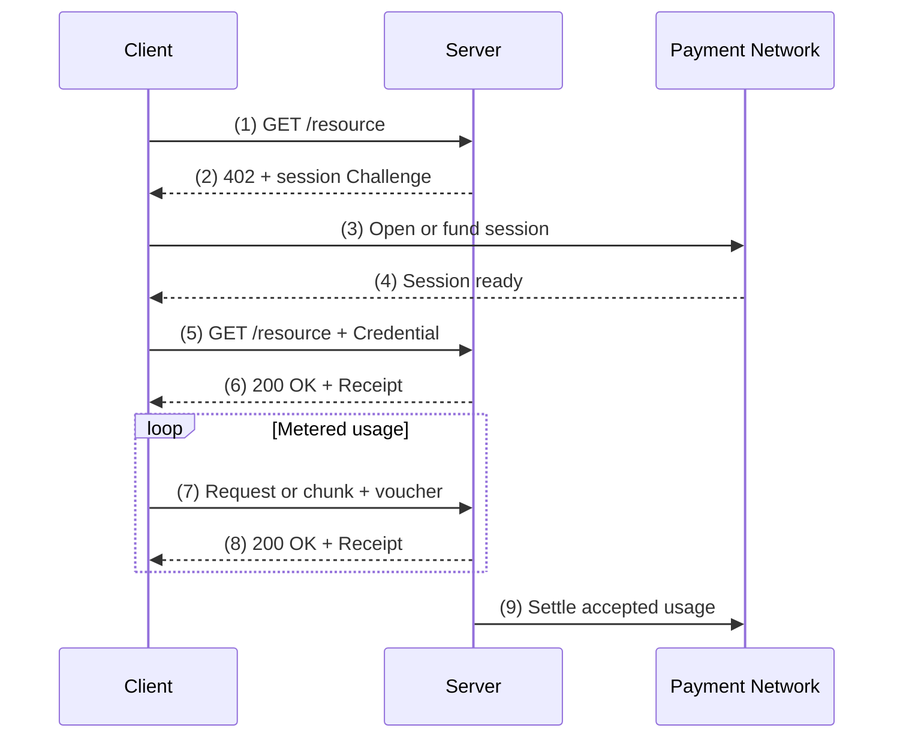
```mermaid
sequenceDiagram
  participant Client
  participant Server
  participant Network as Payment Network
  Client->>Server: (1) GET /resource
  Server-->>Client: (2) 402 + session Challenge
  Client->>Network: (3) Open or fund session
  Network-->>Client: (4) Session ready
  Client->>Server: (5) GET /resource + Credential
  Server-->>Client: (6) 200 OK + Receipt
  loop Metered usage
      Client->>Server: (7) Request or chunk + voucher
      Server-->>Client: (8) 200 OK + Receipt
  end
  Server->>Network: (9) Settle accepted usage

```

1. **Client:** requests a paid resource
2. **Server:** responds with `402` and a Challenge for a session payment
3. **Client:** opens or funds reusable payment state for the method
4. **Client:** retries the request with a Credential proving the session is ready
5. **Server:** verifies the Credential and returns the resource with a Receipt
6. **Client:** sends additional signed updates as usage accrues
7. **Server:** verifies each update and settles accepted usage according to the method

## When to use session

Session is the best intent when the client makes many paid interactions or the final cost isn't known when the request starts:

* **LLM APIs**—Bill by token while streaming a response
* **Metered APIs**—Charge by query, byte, request, or compute unit
* **Long-running tools**—Keep payment state active across many MCP tool calls
* **Sub-cent pricing**—Avoid one settlement transaction per tiny payment

Use `charge` when each request maps to one known payment. Use `subscription` when access renews at a fixed amount per billing period.

## Request schema

The session intent defines the shared semantics for reusable payment state. Method-specific session implementations define the exact `request` and `payload` fields needed to open, update, and settle that state.

Common session requests include:

| Field | Type | Required | Description |
|---|---|---|---|
| `amount` | string | Optional | Amount requested for the current interaction or funding target |
| `currency` | string | Required | Currency identifier (token address, currency code) |
| `description` | string | Optional | Human-readable description of the metered resource |
| `expires` | string | Optional | ISO 8601 expiry timestamp |
| `methodDetails` | object | Optional | Method-specific session requirements |
| `recipient` | string | Optional | Recipient identifier (address, account ID) |

Payment methods extend this schema with session-specific fields such as channel identifiers, funding requirements, voucher rules, and settlement parameters.

## Method integrations

Each payment method defines how session setup, incremental authorization, verification, and settlement map to its underlying network.

[Session](/payment-methods/tempo/session) — Pay-as-you-go payment sessions over payment channels

[Solana session](/payment-methods/solana/session) — Pay-as-you-go metered payments with off-chain vouchers and on-chain settlement

[Lightning session](/payment-methods/lightning/session) — Prepaid metered access with per-request billing

[Stellar channel](/payment-methods/stellar/session) — Pay-as-you-go payments over one-way payment channels

# Subscription \[Recurring paid access]

The `subscription` intent mediates recurring paid access. The client authorizes a fixed payment amount once, and the server reuses that authorization to collect at most one charge per billing period.

## How it works

```mermaid
sequenceDiagram
  participant Client
  participant Server
  participant Store
  participant Network as Payment Network
  Client->>Server: (1) GET /resource
  Server->>Store: (2) Resolve subscription
  Server-->>Client: (3) 402 + subscription Challenge
  Note over Client: (4) Authorize recurring access
  Client->>Server: (5) GET /resource + Credential
  Server->>Network: (6) Activate subscription and charge first period
  Network-->>Server: (7) Confirmed
  Server->>Store: (8) Store subscription state
  Server-->>Client: (9) 200 OK + Receipt
  Client->>Server: (10) Later request
  Server->>Store: (11) Find active subscription
  Server-->>Client: (12) 200 OK + Receipt

```

1. **Client:** requests a protected resource
2. **Server:** resolves whether the request already has an active subscription
3. **Server:** responds with `402` and a subscription Challenge when no usable subscription exists
4. **Client:** authorizes the recurring payment terms
5. **Client:** retries the request with a Credential
6. **Server:** verifies the Credential, activates the subscription, and charges the first billing period
7. **Server:** stores durable subscription state and returns a Receipt
8. **Server:** reuses the active subscription for later requests while the current period is paid

## When to use subscription

Subscription is the best intent when access renews on a fixed schedule:

* **API plans**—Charge a fixed amount per day, week, or month
* **Memberships**—Keep access active across many requests
* **Recurring MCP access**—Bill for tool access that renews by period
* **Usage bundles**—Renew a fixed bundle on a schedule

Use `charge` when each request maps to one payment. Use `session` when usage is metered and the final cost isn't known upfront.

## Request schema

The subscription intent defines the following request fields:

| Field | Type | Required | Description |
|---|---|---|---|
| `amount` | string | Required | Fixed payment amount per billing period in base units |
| `currency` | string | Required | Currency identifier (token address, currency code) |
| `description` | string | Optional | Human-readable subscription description |
| `externalId` | string | Optional | Server-defined subscription reference |
| `methodDetails` | object | Optional | Method-specific extension data |
| `periodCount` | string | Required | Positive integer count of `periodUnit` values per billing period |
| `periodUnit` | string | Required | Billing period unit: `day`, `week`, or `month` |
| `recipient` | string | Optional | Recipient identifier (address, account ID) |
| `subscriptionExpires` | string | Optional | RFC 3339 timestamp that bounds the recurring authorization |

Payment methods extend this schema through `methodDetails`. They must reject subscription requests they can't represent exactly.

## Lifecycle

Activation starts the first billing period and collects the first charge. The server returns a Receipt with a `subscriptionId` only after activation succeeds.

Renewal collects at most one charge for each later billing period. Before granting access in an unpaid period, the server must collect the renewal charge or fail the request with `402`.

Reuse is application-defined. Servers use authenticated session state, account identity, resource scope, or another local selector to associate later requests with an active subscription. A `subscriptionId` alone doesn't grant access.

## Method integrations

Each payment method defines how subscription authorization, activation, renewal, and cancellation map to its underlying network.

[Tempo subscription](/payment-methods/tempo/subscription) — Recurring stablecoin payments for paid API plans

## Specification

[IETF Specification](https://paymentauth.org/draft-payment-intent-subscription-00) — Read the full specification

# Payment methods \[Available methods and how to choose one]

Payment methods define how clients pay for resources protected by the Machine Payments Protocol. Each method specifies its payment rails, Credential format, and verification logic.

## Overview

When a server responds with `402` Payment Required, the `WWW-Authenticate` header includes a `method` parameter indicating which payment method to use. If supported, the client can then use the corresponding payment method to generate a Credential and retry the request.

### Tempo

```http
HTTP/1.1 402 Payment Required
WWW-Authenticate: Payment method="tempo", intent="charge", ...
```

### Stripe

```http
HTTP/1.1 402 Payment Required
WWW-Authenticate: Payment method="stripe", intent="charge", ...
```

### EVM

```http
HTTP/1.1 402 Payment Required
WWW-Authenticate: Payment method="evm", intent="charge", ...
```

### Card

```http
HTTP/1.1 402 Payment Required
WWW-Authenticate: Payment method="card", intent="charge", ...
```

### Lightning

```http
HTTP/1.1 402 Payment Required
WWW-Authenticate: Payment method="lightning", intent="charge", ...
```

### Solana

```http
HTTP/1.1 402 Payment Required
WWW-Authenticate: Payment method="solana", intent="charge", ...
```

### XRPL

```http
HTTP/1.1 402 Payment Required
WWW-Authenticate: Payment method="xrpl", intent="charge", ...
```

### Stellar

```http
HTTP/1.1 402 Payment Required
WWW-Authenticate: Payment method="stellar", intent="charge", ...
```

### Monad

```http
HTTP/1.1 402 Payment Required
WWW-Authenticate: Payment method="monad", intent="charge", ...
```

### NEAR Intents

```http
HTTP/1.1 402 Payment Required
WWW-Authenticate: Payment method="nearintents", intent="charge", ...
```

### RedotPay

```http
HTTP/1.1 402 Payment Required
WWW-Authenticate: Payment method="redotpay", intent="charge", ...
```

## Available methods

[Tempo](/payment-methods/tempo) — Web scale payments with TIP-20 stablecoins on Tempo with sub second settlement

[EVM](/payment-methods/evm) — Stablecoin payments on EVM chains with inline x402 exact compatibility

[Stripe](/payment-methods/stripe) — Traditional payment methods through Stripe

[Card](/payment-methods/card) — Card payments via encrypted network tokens

[Lightning](/payment-methods/lightning) — Bitcoin payments over the Lightning Network

[Solana](/payment-methods/solana) — Native SOL and SPL token payments on Solana

[Stellar](/payment-methods/stellar) — Smart contract payments on Stellar

[XRPL](/payment-methods/xrpl) — Payments in XRP and tokens, Payment Channels in XRP

[Monad](/payment-methods/monad) — ERC-20 token payments on Monad

[NEAR Intents](/payment-methods/nearintents) — Cross-chain payments settled by NEAR Intents

[RedotPay](/payment-methods/redotpay) — Payments with RedotPay balance and stablecoin rails

[Custom](/payment-methods/custom) — Build your own method or extend existing methods with the SDK.

# Tempo \[Stablecoin payments on the Tempo blockchain]

## Choose a signing account

### Direct

Create a server-only wallet.ts module, then import account wherever an example creates a local signing account.

```ts
import { privateKeyToAccount } from 'viem/accounts'

export const account = privateKeyToAccount(process.env.PRIVATE_KEY as `0x${string}`)
```

### Privy

Create an EVM wallet in Privy, fund it with the required currency on this page's network, and keep PRIVY\_APP\_SECRET server-side.

```bash
pnpm add @privy-io/node
```

Create a server-only privy.ts module, then import its account wherever an example configures account or feePayer.

```ts
import { PrivyClient } from '@privy-io/node'
import { createViemAccount } from '@privy-io/node/viem'

const privy = new PrivyClient({
  appId: process.env.PRIVY_APP_ID!,
  appSecret: process.env.PRIVY_APP_SECRET!,
})

export const account = createViemAccount(privy, {
  address: process.env.PRIVY_WALLET_ADDRESS as `0x${string}`,
  walletId: process.env.PRIVY_WALLET_ID!,
})
```

createViemAccount delegates signatures to the Privy wallet, so it replaces any local viem account in the examples on this page.

The [Tempo](https://docs.tempo.xyz) payment method enables payments using TIP-20 stablecoins on the Tempo blockchain. Tempo supports **charge** for one-time payments, **session** for pay-as-you-go payment channels, and **subscription** for recurring access.

## Payments on Tempo

Tempo is purpose-built for the payment patterns MPP enables:

* **Instant finality**—Transactions settle in ~500ms with deterministic confirmation, no probabilistic waiting
* **Sub-cent fees**—Transaction costs low enough for micropayments and per-request billing
* **Fee sponsorship**—Servers can pay gas fees on behalf of clients, removing wallet UX friction entirely
* **2D nonces**—Parallel nonce lanes let clients submit payment transactions without blocking other account activity
* **Payment lane**—Dedicated transaction ordering for payment channel operations, providing reliable channel management UX
* **High throughput**—Tempo's throughput handles the on-chain settlement and channel management volume that payment sessions generate at scale

## Choosing a payment method

| | **Charge** | **Session** Recommended | **Subscription** New |
|---|---|---|---|
| **Pattern** | One-time payment per request | Continuous pay-as-you-go | Recurring access |
| **Latency overhead** | ~500ms (on-chain confirmation) | Near-zero | Near-zero after activation |
| **Throughput** | One transaction per request | Hundreds of vouchers per second per channel | One renewal per period |
| **Best for** | Single API calls, content access, one-off purchases | LLM APIs, metered services, usage-based billing | Plans, memberships, recurring API access |
| **On-chain cost** | Per request (0.001 USD per request) | Amortized across many requests (0.001 USD total) | Per billing period |
| **Settlement** | Immediate on-chain transaction | Off-chain vouchers, periodic on-chain settlement | Key-authorized recurring transfers |

## Intents

<div className="vocs:grid vocs:grid-cols-1 vocs:md:grid-cols-3 vocs:gap-4">
  <a href="/payment-methods/tempo/charge" className="vocs:relative vocs:flex vocs:flex-col vocs:space-y-2 vocs:rounded-md vocs:bg-surfaceTint/70 vocs:border vocs:border-primary vocs:p-4 vocs:no-underline vocs:transition-colors vocs:hover:bg-surfaceTint">
    <div className="vocs:size-8 vocs:flex vocs:items-center vocs:justify-center vocs:rounded-lg vocs:border vocs:border-primary vocs:bg-surface vocs:text-accent">
      <svg viewBox="0 0 24 24" width="20" height="20">
        <path fill="currentColor" d="M10.55 17h-2.73l2.53-7.73h-3.24l.71-2.27h9.03l-.71 2.27h-3.07L10.55 17Z" />
      </svg>
    </div>

    <div className="vocs:text-[15px] vocs:font-medium vocs:text-heading">Tempo charge</div>
    <div className="vocs:text-sm vocs:leading-relaxed vocs:text-secondary">Immediate one-time payments settled on-chain</div>
  </a>

  <a href="/payment-methods/tempo/session" className="vocs:relative vocs:flex vocs:flex-col vocs:space-y-2 vocs:rounded-md vocs:bg-surfaceTint/70 vocs:border vocs:border-primary vocs:p-4 vocs:no-underline vocs:transition-colors vocs:hover:bg-surfaceTint">
    <div className="vocs:absolute vocs:top-4 vocs:right-4">Recommended</div>

    <div className="vocs:size-8 vocs:flex vocs:items-center vocs:justify-center vocs:rounded-lg vocs:border vocs:border-primary vocs:bg-surface vocs:text-accent">
      <svg xmlns="http://www.w3.org/2000/svg" width="20" height="20" viewBox="0 0 24 24" fill="none" stroke="currentColor" strokeWidth="2" strokeLinecap="round" strokeLinejoin="round">
        <path d="M2 6c.6.5 1.2 1 2.5 1C7 7 7 5 9.5 5c2.6 0 2.4 2 5 2 2.5 0 2.5-2 5-2 1.3 0 1.9.5 2.5 1" />

        <path d="M2 12c.6.5 1.2 1 2.5 1 2.5 0 2.5-2 5-2 2.6 0 2.4 2 5 2 2.5 0 2.5-2 5-2 1.3 0 1.9.5 2.5 1" />

        <path d="M2 18c.6.5 1.2 1 2.5 1 2.5 0 2.5-2 5-2 2.6 0 2.4 2 5 2 2.5 0 2.5-2 5-2 1.3 0 1.9.5 2.5 1" />
      </svg>
    </div>

    <div className="vocs:text-[15px] vocs:font-medium vocs:text-heading">Session</div>
    <div className="vocs:text-sm vocs:leading-relaxed vocs:text-secondary">Pay-as-you-go payment sessions over payment channels</div>
  </a>

  <a href="/payment-methods/tempo/subscription" className="vocs:relative vocs:flex vocs:flex-col vocs:space-y-2 vocs:rounded-md vocs:bg-surfaceTint/70 vocs:border vocs:border-primary vocs:p-4 vocs:no-underline vocs:transition-colors vocs:hover:bg-surfaceTint">
    <div className="vocs:absolute vocs:top-4 vocs:right-4">New</div>

    <div className="vocs:size-8 vocs:flex vocs:items-center vocs:justify-center vocs:rounded-lg vocs:border vocs:border-primary vocs:bg-surface vocs:text-accent">
      <svg xmlns="http://www.w3.org/2000/svg" width="20" height="20" viewBox="0 0 24 24" fill="none" stroke="currentColor" strokeWidth="2" strokeLinecap="round" strokeLinejoin="round">
        <path d="M8 2v4" />

        <path d="M16 2v4" />

        <rect width="18" height="18" x="3" y="4" rx="2" />

        <path d="M3 10h18" />

        <path d="m9 16 2 2 4-4" />
      </svg>
    </div>

    <div className="vocs:text-[15px] vocs:font-medium vocs:text-heading">Subscription</div>
    <div className="vocs:text-sm vocs:leading-relaxed vocs:text-secondary">Recurring stablecoin payments for paid API plans</div>
  </a>
</div>

## Fee sponsorship

Tempo supports server-paid transaction fees for charge, session, and subscription intents. When enabled, the client signs only the payment authorization and the server covers gas costs. The client doesn't need to hold gas tokens or understand fee mechanics.

Pass a `feePayer` account to a Tempo server method to enable this. For one-time charges, configure `tempo.charge`:

```ts twoslash
import { Mppx, tempo } from 'mppx/server'
import { privateKeyToAccount } from 'viem/accounts'

const mppx = Mppx.create({
  methods: [tempo.charge({
    feePayer: privateKeyToAccount('0x…'), // [!code hl]
  })],
})
```

Point `feePayer` to a fee service that supports the [`Handler.feePayer`](https://docs.tempo.xyz/sdk/typescript/server/handler.feePayer) endpoint. Use the object form to authenticate requests:

```ts
import { Mppx, tempo } from 'mppx/server'

const mppx = Mppx.create({
  methods: [tempo.charge({
    // [!code hl:start]
    feePayer: {
      headers: {
        Authorization: `Bearer ${process.env.FEE_PAYER_TOKEN!}`,
      },
      url: 'https://sponsor.example.com',
    },
    // [!code hl:end]
  })],
})
```

Local sponsors allow transactions to install access keys by default. Set `feePayerPolicy.allowKeyAuthorization` to `false` when a sponsor doesn't serve subscriptions or other access-key flows and must reject those transactions.

For Sessions, pass the same `feePayer` parameter to [`tempo.session`](/sdk/typescript/server/Method.tempo.session) alongside `account` and `store`. A fee payer service sponsors open, top-up, scheduled settlement, and cooperative close transactions. For pull-mode charges, `mppx` sends fill requests through the configured fee-payer transport, then broadcasts the completed transaction through the chain RPC transport.

# Tempo charge \[One-time TIP-20 token transfers]

## Choose a signing account

### Direct

Create a server-only wallet.ts module, then import account wherever an example creates a local signing account.

```ts
import { privateKeyToAccount } from 'viem/accounts'

export const account = privateKeyToAccount(process.env.PRIVATE_KEY as `0x${string}`)
```

### Privy

Create an EVM wallet in Privy, fund it with the required currency on this page's network, and keep PRIVY\_APP\_SECRET server-side.

```bash
pnpm add @privy-io/node
```

Create a server-only privy.ts module, then import its account wherever an example configures account or feePayer.

```ts
import { PrivyClient } from '@privy-io/node'
import { createViemAccount } from '@privy-io/node/viem'

const privy = new PrivyClient({
  appId: process.env.PRIVY_APP_ID!,
  appSecret: process.env.PRIVY_APP_SECRET!,
})

export const account = createViemAccount(privy, {
  address: process.env.PRIVY_WALLET_ADDRESS as `0x${string}`,
  walletId: process.env.PRIVY_WALLET_ID!,
})
```

createViemAccount delegates signatures to the Privy wallet, so it replaces any local viem account in the examples on this page.

The Tempo implementation of the [charge](/intents/charge) intent.

For non-zero charges, the client signs a TIP-20 `transfer` transaction, the server broadcasts it to Tempo, and settlement completes in ~500ms with deterministic finality.

For zero-amount identity flows, the client sends a `proof` Credential payload instead of a real transaction. The server verifies the signed proof message against the client's `source` identity and returns a Receipt without broadcasting anything on-chain.

This method is best for single API calls, content access, or one-off purchases.

## Server

Use [`mppx.charge`](/sdk/typescript/server/Method.tempo.charge) to gate any endpoint behind a one-time payment. The method handles Challenge generation, Credential verification, transaction broadcast for paid requests, and Receipt creation.

```ts twoslash
import { Mppx, tempo } from "mppx/server";

const mppx = Mppx.create({
  methods: [tempo.charge()],
});

export async function handler(request: Request) {
  const result = await mppx.charge({
    amount: "0.1",
    currency: "0x20c0000000000000000000000000000000000000",
    recipient: "0xf39Fd6e51aad88F6F4ce6aB8827279cffFb92266",
  })(request);

  if (result.status === 402) return result.challenge;

  return result.withReceipt(Response.json({ data: "..." }));
}
```

### With expiry

```ts twoslash
import { Mppx, tempo } from "mppx/server";

const mppx = Mppx.create({ methods: [tempo.charge()] });
// ---cut---
import { Expires } from "mppx";

export async function handler(request: Request) {
  const result = await mppx.charge({
    amount: "0.1",
    currency: "0x20c0000000000000000000000000000000000000",
    expires: Expires.minutes(10), // [!code hl]
    recipient: "0xf39Fd6e51aad88F6F4ce6aB8827279cffFb92266",
  })(request);

  if (result.status === 402) return result.challenge;
  return result.withReceipt(Response.json({ data: "..." }));
}
```

### With fee sponsorship

```ts twoslash
import { Mppx, tempo } from "mppx/server";

const mppx = Mppx.create({ methods: [tempo.charge()] });

declare const request: Request;
// ---cut---
const result = await mppx.charge({
  amount: "0.1",
  currency: "0x20c0000000000000000000000000000000000000",
  feePayer: true, // [!code hl]
  recipient: "0xf39Fd6e51aad88F6F4ce6aB8827279cffFb92266",
})(request);
```

When `feePayer` is `true`, the server adds a fee payer signature (domain `0x78`) before broadcasting. The client doesn't need gas tokens. See [fee sponsorship](/payment-methods/tempo#fee-sponsorship) for details.

### Zero-dollar auth

Set `amount: "0"` to issue an identity-only Challenge. The client returns a `proof` payload instead of `transaction` or `hash`, and the server verifies the signature against the `source` DID.

```ts twoslash
import { Mppx, tempo } from "mppx/server";

const mppx = Mppx.create({ methods: [tempo.charge()] });

declare const request: Request;
// ---cut---
const result = await mppx.charge({
  amount: "0", // [!code hl]
  currency: "0x20c0000000000000000000000000000000000000",
  recipient: "0xf39Fd6e51aad88F6F4ce6aB8827279cffFb92266",
})(request);
```

Use this for polling, free follow-up requests, and unlock flows after an initial payment.

Pass `store` to `tempo.charge()` when you want single-use proofs.

### With split payments

Split a charge across multiple recipients in a single transaction. The primary `recipient` receives `amount` minus the sum of all splits.

```ts twoslash
import { Mppx, tempo } from "mppx/server";

const mppx = Mppx.create({ methods: [tempo.charge()] });

declare const request: Request;
// ---cut---
const result = await mppx.charge({
  amount: "1.00",
  currency: "0x20c0000000000000000000000000000000000000", // pathUSD
  recipient: "0xf39Fd6e51aad88F6F4ce6aB8827279cffFb92266", // seller
  // [!code hl:start]
  splits: [
    {
      amount: "0.10",
      recipient: "0x70997970C51812dc3A010C7d01b50e0d17dc79C8", // platform fee
    },
  ],
  // [!code hl:end]
})(request);
```

Up to 10 splits per charge. Each split must have a positive amount, and the sum of all splits must be less than the total `amount`. See the [split payments guide](/guides/split-payments) for more details.

### Payment links

Set `html: true` on the method to render a payment page when a browser navigates to the endpoint. The page shows a "Continue with Tempo" button—after the user pays, the page reloads with the paid resource. Programmatic clients with `Authorization` headers are unaffected.

```ts twoslash
import { Mppx, tempo } from "mppx/server";

const mppx = Mppx.create({
  methods: [
    tempo.charge({
      html: true, // [!code hl]
    }),
  ],
});

declare const request: Request;
// ---cut---
const result = await mppx.charge({
  amount: "0.1",
  currency: "0x20c0000000000000000000000000000000000000",
  recipient: "0xf39Fd6e51aad88F6F4ce6aB8827279cffFb92266",
})(request);
```

See the [payment links guide](/guides/payment-links) for a full walkthrough with framework examples and a live demo.

### With Stripe

```ts twoslash
import { Mppx, tempo } from "mppx/server";

async function createPayToAddress(request: Request): Promise<`0x${string}`> {
  void request;
  return "0xf39Fd6e51aad88F6F4ce6aB8827279cffFb92266";
}

export async function handler(request: Request) {
  const recipientAddress = await createPayToAddress(request);
  const mppx = Mppx.create({
    methods: [
      tempo.charge({
        currency: "0x20c0000000000000000000000000000000000000",
        recipient: recipientAddress,
      }),
    ],
  });

  const result = await mppx.charge({ amount: "0.01" })(request);
 
  if (result.status === 402) return result.challenge;
 
  return result.withReceipt(Response.json({ data: "..." }));
}
```

Use Stripe to create a dynamic recipient address per payment, each backed by a PaymentIntent. To learn more, read the [Stripe documentation](https://docs.stripe.com/payments/machine/mpp) on accepting MPP.

:::info
See [`tempo.charge` server reference](/sdk/typescript/server/Method.tempo.charge) for the full parameter list.
:::

## Client

Use [`tempo.charge`](/sdk/typescript/client/Method.tempo.charge) with `Mppx.create` to automatically handle `402` responses. For non-zero amounts, the client signs a TIP-20 transfer and retries with the Credential. For zero-amount Challenges, it signs a proof message and retries with a `proof` payload instead.

The client also supports MACH charges. It automatically pays transaction fees with a funded supported stablecoin, so a payer doesn't need additional MACH for fees. Use [`mach`](/sdk/typescript/tempo.mach) from `mppx/tempo` to resolve the deployed address on Tempo mainnet or Moderato testnet.

### Accounts SDK

```ts twoslash
import { Provider } from "accounts";
import { Mppx, tempo } from "mppx/client";

const provider = Provider.create({ mpp: false }); // Avoid double 402 handling; mppx is configured below.
await provider.request({ method: "wallet_connect" });

Mppx.create({
  methods: [tempo.charge({
    account: provider.getAccount({ signable: true }),
    getClient: provider.getClient,
  })],
});

const response = await fetch("https://api.example.com/resource");
```

### viem

```ts twoslash
import { Mppx, tempo } from "mppx/client";
import { privateKeyToAccount } from "viem/accounts";

const account = privateKeyToAccount("0xabc…123");

Mppx.create({
  methods: [tempo.charge({ account })],
});

const response = await fetch("https://api.example.com/resource");
```

### Without polyfill

If you don't want to patch `globalThis.fetch`, use `mppx.fetch` directly:

#### Accounts SDK

```ts twoslash
import { Provider } from "accounts";
import { Mppx, tempo } from "mppx/client";

const provider = Provider.create({ mpp: false }); // Avoid double 402 handling; mppx is configured below.
await provider.request({ method: "wallet_connect" });

const mppx = Mppx.create({
  methods: [tempo.charge({
    account: provider.getAccount({ signable: true }),
    getClient: provider.getClient,
  })],
  polyfill: false,
});

const response = await mppx.fetch("https://api.example.com/resource");
```

#### viem

```ts twoslash
import { Mppx, tempo } from "mppx/client";
import { privateKeyToAccount } from "viem/accounts";

const account = privateKeyToAccount("0xabc…123");

const mppx = Mppx.create({
  methods: [tempo.charge({ account })],
  polyfill: false,
});

const response = await mppx.fetch("https://api.example.com/resource");
```

:::info
See [`tempo.charge` client reference](/sdk/typescript/client/Method.tempo.charge) for the full parameter list.
:::

### Chain pinning

Set `expectedChainId` when the client should only pay on a specific Tempo network. The client rejects Challenges for other chains and uses this chain when the Challenge doesn't include `chainId`.

#### Accounts SDK

```ts twoslash
import { Mppx, tempo } from "mppx/client";
import { Provider } from "accounts";

const provider = Provider.create({ mpp: false }) // Avoid double 402 handling; mppx is configured below.
await provider.request({ method: "wallet_connect" })

Mppx.create({
  methods: [
    tempo.charge({
      account: provider.getAccount({ signable: true }),
      getClient: provider.getClient,
      expectedChainId: 4217, // Tempo mainnet // [!code hl]
    }),
  ],
});
```

#### viem

```ts twoslash
import { Mppx, tempo } from "mppx/client";
import { privateKeyToAccount } from "viem/accounts";

const account = privateKeyToAccount("0xabc…123");

Mppx.create({
  methods: [
    tempo.charge({
      account,
      expectedChainId: 4217, // Tempo mainnet // [!code hl]
    }),
  ],
});
```

### Auto-swap

When the client doesn't hold the requested currency, `autoSwap` automatically swaps from a fallback stablecoin (pathUSD, USDC.e) via the Tempo DEX before transferring.

#### Accounts SDK

```ts twoslash
import { Provider } from "accounts";
import { Mppx, tempo } from "mppx/client";

const provider = Provider.create({ mpp: false }); // Avoid double 402 handling; mppx is configured below.
await provider.request({ method: "wallet_connect" });

Mppx.create({
  methods: [
    tempo.charge({
      account: provider.getAccount({ signable: true }),
      autoSwap: true, // [!code hl]
      getClient: provider.getClient,
    }),
  ],
});
```

#### viem

```ts twoslash
import { Mppx, tempo } from "mppx/client";
import { privateKeyToAccount } from "viem/accounts";

const account = privateKeyToAccount("0xabc…123");

Mppx.create({
  methods: [
    tempo.charge({
      account,
      autoSwap: true, // [!code hl]
    }),
  ],
});
```

Pass an object for custom fallback tokens or slippage:

##### Accounts SDK

```ts twoslash
import { Provider } from "accounts";
import { Mppx, tempo } from "mppx/client";

const provider = Provider.create({ mpp: false }); // Avoid double 402 handling; mppx is configured below.
await provider.request({ method: "wallet_connect" });

Mppx.create({
  methods: [
    tempo.charge({
      account: provider.getAccount({ signable: true }),
      // [!code hl:start]
      autoSwap: {
        slippage: 2, // max slippage % (default: 1)
        tokenIn: ["0x0000000000000000000000000000000000000001"],
      },
      // [!code hl:end]
      getClient: provider.getClient,
    }),
  ],
});
```

##### viem

```ts twoslash
import { Mppx, tempo } from "mppx/client";
import { privateKeyToAccount } from "viem/accounts";

const account = privateKeyToAccount("0xabc…123");

Mppx.create({
  methods: [
    tempo.charge({
      account,
      // [!code hl:start]
      autoSwap: {
        slippage: 2, // max slippage % (default: 1)
        tokenIn: ["0x0000000000000000000000000000000000000001"],
      },
      // [!code hl:end]
    }),
  ],
});
```

See [auto-swap](/payment-methods/tempo#auto-swap) for more details.

## Specification

[IETF Specification](https://paymentauth.org/draft-tempo-charge-00) — Read the full specification

# Sessions \[Low-cost high-throughput payments]

## Choose a signing account

### Direct

Create a server-only wallet.ts module, then import account wherever an example creates a local signing account.

```ts
import { privateKeyToAccount } from 'viem/accounts'

export const account = privateKeyToAccount(process.env.PRIVATE_KEY as `0x${string}`)
```

### Privy

Create an EVM wallet in Privy, fund it with the required currency on this page's network, and keep PRIVY\_APP\_SECRET server-side.

```bash
pnpm add @privy-io/node
```

Create a server-only privy.ts module, then import its account wherever an example configures account or feePayer.

```ts
import { PrivyClient } from '@privy-io/node'
import { createViemAccount } from '@privy-io/node/viem'

const privy = new PrivyClient({
  appId: process.env.PRIVY_APP_ID!,
  appSecret: process.env.PRIVY_APP_SECRET!,
})

export const account = createViemAccount(privy, {
  address: process.env.PRIVY_WALLET_ADDRESS as `0x${string}`,
  walletId: process.env.PRIVY_WALLET_ID!,
})
```

createViemAccount delegates signatures to the Privy wallet, so it replaces any local viem account in the examples on this page.

The `session` intent enables high-frequency, pay-as-you-go payments over unidirectional payment channels. Sessions use the [TIP-1034](https://tips.sh/1034) precompile for low cost and high reliability. Clients deposit funds into a channel reserve and sign off-chain vouchers as they consume resources. The server verifies vouchers with fast signature checks—no RPC or blockchain calls—and settles periodically in batches.

Payment sessions reduce payment verification to near constant time, making it possible to meter and bill at the granularity of individual LLM tokens, API calls, or bytes transferred.

:::warning[Legacy integrations]
`tempo.session` is the current Sessions implementation in `mppx`. The previous contract-backed implementation is Legacy Sessions, also called Sessions v1, and is available as `tempo.sessionLegacy`. Legacy server support requires `mppx` 0.8.15 or earlier.
:::

## Which client API should I use?

There are two current Sessions client APIs:

| API | Use it when |
|---|---|
| `tempo({ account, maxDeposit })` | You want a fetch wrapper that handles both one-time charges and Sessions. This expands to `tempo.charge()` plus the current `tempo.session()` client method. |
| `tempo.session({ account, maxDeposit })` | You want to register only the current Sessions client method in `Mppx.create`. |
| `tempo.session.manager({ account, maxDeposit })` | You want direct lifecycle control with `.fetch()`, `.topUp()`, `.close()`, `.sse()`, or `.ws()`. Use this when your code must explicitly close or top up a channel. |
| `tempo.sessionLegacy` / `tempo.sessionLegacy.method()` | You still need compatibility with contract-backed Sessions v1. Do not use this for new integrations. |

For browser reloads or app restarts, pass a [`channelStore`](/sdk/typescript/client/Method.tempo.session-manager#channelstore) to `tempo.session.manager()`. Servers can pair this with [`bootstrap: true`](/sdk/typescript/server/Method.tempo.session#with-same-route-bootstrap) so clients lazily recover a previous channel from the same protected route before opening a new one.

## Why Sessions matter in MPP

Traditional payment rails target human purchase flows: a buyer decides, pays, and receives goods. Usage-based billing—the model that powers cloud infrastructure, LLM APIs, and metered services—requires something fundamentally different. It needs payment verification that can keep pace with the service itself.

Consider an LLM API: a single inference request can generate hundreds of tokens over several seconds. Each token has a known cost, but the total cost isn't known when the request begins. Standard billing models handle this by accumulating usage and charging after the fact, introducing credit risk, reconciliation complexity, and billing disputes. Prepaid credit systems require the client to guess consumption upfront and lose unused funds.

Sessions solve this by making payment a continuous, inline part of the HTTP request. The client signs a cumulative voucher for each increment of service consumed, and the server verifies it in microseconds. The server delays on-chain settlement to whenever it chooses, batching hundreds or thousands of vouchers into a single on-chain transaction. This reduces both the latency and the cost of payment verification to near zero.

## How it works

### Overview

```mermaid
sequenceDiagram
  participant Client
  participant Server
  participant Tempo
  Client->>Tempo: (1) Deposit tokens
  Tempo-->>Client: Session created
  Client->>Server: (2) Open Credential
  Note over Server: verify deposit
  Server-->>Client: 200 OK (session established)
  loop Per request
      Client->>Server: (3) Request + voucher
      Note over Server: recover signature
      Server-->>Client: 200 OK + Receipt
  end
  Note over Server: (4) Periodic settlement
  Server->>Tempo: settle(channelId, voucher)
  Client->>Server: (5) Close
  Server->>Tempo: close(channelId, voucher)
  Tempo-->>Client: Refund remaining deposit

```

A payment session has four phases:

:::steps
### Open

The client deposits funds into a channel reserve through the [TIP-1034 precompile](https://tips.sh/1034), creating a payment channel between the client (payer) and server (payee). A unique `channelId` identifies the channel and tracks the deposited stablecoins.

### Session

The client signs vouchers with increasing cumulative amounts as service is consumed. Each voucher authorizes "I have now consumed up to X total." The server verifies the signature, checks that the cumulative amount is higher than the previous voucher, and grants access based on the delta.

### Top up

If the channel runs low on funds, the client tops up the channel without closing it. The session continues uninterrupted.

### Close

Either party can close the channel. The server closes the precompile-backed channel with the highest voucher, settling the final balance on-chain and refunding any unused deposit to the client.
:::

## Session Receipts

Session Receipts differ from charge Receipts. The `reference` field contains the payment channel ID (a `bytes32` hash), not a transaction hash. The on-chain settlement transaction hash is only available after closing the channel.

```ts
type SessionReceipt = {
  acceptedCumulative: string
  challengeId: string
  channelId: `0x${string}`
  intent: 'session'
  method: 'tempo'
  reference: string
  spent: string
  status: 'success'
  timestamp: string
  txHash?: `0x${string}`
  units?: number
}
```

| Field | Charge Receipt | Session Receipt |
|-------|---------------|-----------------|
| `reference` | Transaction hash | Channel ID |
| `status` | `"success"` | `"success"` |
| `method` | `"tempo"` | `"tempo"` |

To get the settlement transaction hash, close the channel via `session.close()` and read the `txHash` field from the returned Receipt.

## Settlement

Sessions separate payment verification from on-chain settlement. During a request or stream, the client sends cumulative vouchers and the server records the highest valid voucher it has accepted. Settlement submits that highest voucher to the TIP-1034 precompile, updates the on-chain paid amount, and keeps the channel open for more usage unless the channel is closed.

### Automatic settlement

Use automatic settlement when the server should periodically settle accepted usage while a session remains active. The `settlementSchedule` is server-owned and can trigger by spend amount, metered units, or elapsed time. Clients don't receive the schedule and can't change it.

Automatic settlement is the default operational model for high-volume APIs: the hot path stays off-chain, while the server settles in the background as usage accumulates.

```ts twoslash
import { Mppx, Store, tempo } from 'mppx/server'
import { privateKeyToAccount } from 'viem/accounts'

const account = privateKeyToAccount('0x0123456789abcdef0123456789abcdef0123456789abcdef0123456789abcdef')

const mppx = Mppx.create({
  methods: [
    tempo.session({
      account,
      chainId: 4217, // optional; pins Challenges to Tempo mainnet
      currency: '0x20c0000000000000000000000000000000000000', // pathUSD on Tempo
      settlementSchedule: { // [!code hl]
        amount: '10',
        intervalMs: 60_000,
        units: 10_000,
      },
      store: Store.memory(),
    }),
  ],
})
```

Any threshold can trigger settlement. Use `amount` to settle after a token-denominated spend threshold, `units` to settle after metered usage, and `intervalMs` to settle after elapsed time since the previous scheduled settlement.

The same schedule applies to ordinary HTTP responses, SSE streams, and session-bound WebSocket streams. `mppx` evaluates it after each committed charge.

### Manual settlement

Use manual settlement from an admin workflow, job queue, or close-out process when you want explicit control over timing. `tempo.session.settle` settles one channel by submitting its highest accepted voucher. `tempo.session.settleBatch` repeats that operation for a list of channel IDs.

Manual settlement is useful for end-of-period reconciliation, draining channels before maintenance, or forcing settlement after detecting unusual channel activity.

```ts twoslash
import { Store, tempo } from 'mppx/server'
import { createWalletClient, http } from 'viem'
import { privateKeyToAccount } from 'viem/accounts'
import { tempo as tempoMainnet } from 'viem/chains'

const account = privateKeyToAccount('0x0123456789abcdef0123456789abcdef0123456789abcdef0123456789abcdef')
const store = Store.memory()

const client = createWalletClient({
  account,
  chain: tempoMainnet,
  transport: http('https://rpc.tempo.xyz'),
})

const channelId = '0x0000000000000000000000000000000000000000000000000000000000000000'
const txHash = await tempo.session.settle(store, client, channelId, { account }) // [!code hl]
console.log(txHash)
// @log: 0x...
```

Settle multiple channels from the same job with `tempo.session.settleBatch`.

```ts twoslash
import { Store, tempo } from 'mppx/server'
import { createWalletClient, http } from 'viem'
import { privateKeyToAccount } from 'viem/accounts'
import { tempo as tempoMainnet } from 'viem/chains'

const account = privateKeyToAccount('0x0123456789abcdef0123456789abcdef0123456789abcdef0123456789abcdef')
const store = Store.memory()

const client = createWalletClient({
  account,
  chain: tempoMainnet,
  transport: http('https://rpc.tempo.xyz'),
})

const channelIds = [
  '0x0000000000000000000000000000000000000000000000000000000000000000',
  '0x1111111111111111111111111111111111111111111111111111111111111111',
] as const

const txHashes = await tempo.session.settleBatch(store, client, channelIds, { account }) // [!code hl]
console.log(txHashes)
// @log: ['0x...', '0x...']
```

## High volume API billing

Sessions match the billing model that high-volume APIs need: pay stablecoin tokens, receive API responses. The granularity of payment matches the granularity of consumption.

A typical flow for a high-volume large language model API:

1. **Client:** opens a channel with a 10 USDC deposit
2. **Client:** sends a prompt to the API
3. **Server:** issues Challenges requesting payment for each chunk (for example, 0.000025 USDC per token)
4. **Client:** signs a voucher for each chunk—the cumulative amount increases by the cost of tokens received
5. **Server:** verifies the voucher signature (~microseconds) and sends the next chunk
6. **Server:** settles on-chain and the client gets the unused deposit back

The server never touches the chain during inference. Payment verification adds microseconds of CPU overhead per chunk, not hundreds of milliseconds of network latency.

:::info[Why Tempo]
Tempo handles payments at scale and has properties that make it a uniquely good fit for payment sessions:

* **Channel management UX**—Opening, topping up, and closing channels are on-chain operations. Tempo's ~500ms finality and sub-cent fees keep channel lifecycle from becoming a UX bottleneck.
* **Payment lane**—Tempo's 2D nonce system provides dedicated nonce lanes for payment transactions, so channel operations don't block other account activity. Server-driven transactions use expiring nonce lanes, so independent processes can share a signer without relying on process-local nonce coordination.
* **High throughput**—When a server settles thousands of channels, Tempo's throughput handles the settlement volume without congestion or fee spikes.
* **Fee sponsorship**—Servers can pay channel management fees on behalf of clients, making the client-side integration purely off-chain after the initial deposit.
* **Enshrined tokens**—TIP-20 tokens are precompile-based, not smart contracts. Token operations are cheaper and more predictable than ERC-20 interactions on other chains.
* **Enshrined Tempo**—[TIP-1034](https://tips.sh/1034) makes Sessions a native Tempo precompile at the canonical `0x4D5050…` address, whose prefix spells "MPP". The precompile reduces execution overhead, removes the separate approval flow, and keeps session lifecycle operations in the payment lane under congestion.
:::

## Integration

### Server

<div className="space-y-4">
  Use [`tempo.session`](/sdk/typescript/server/Method.tempo.session) to accept Sessions. The server needs an RPC URL for channel open, top-up, settlement, and close operations, plus an atomic store backend for channel state. The backend must implement atomic `update(key, fn)` across all server instances. The Redis, Upstash, and Cloudflare adapters only preserve an existing `update` implementation; they do not make standard clients atomic.

  ```ts twoslash
  import { Mppx, Store, tempo } from 'mppx/server'
  import { privateKeyToAccount } from 'viem/accounts'

  const account = privateKeyToAccount('0x0123456789abcdef0123456789abcdef0123456789abcdef0123456789abcdef')

  const mppx = Mppx.create({
    methods: [
      tempo.session({
        account, // signs server-side reserve settlement and close transactions
        chainId: 4217, // optional; pins Challenges to Tempo mainnet
        currency: '0x20c0000000000000000000000000000000000000', // pathUSD on Tempo
        store: Store.memory(), // use a durable AtomicStore in production
      }),
    ],
  })
  ```

  `Store.memory()` works for local development. For multi-instance deployments, use `Store.redis()`, `Store.upstash()`, or `Store.cloudflare()` so channel state is shared across processes. Server-driven Session transactions use Tempo expiring nonce lanes to prevent a shared signing account from depending on one process's local nonce state.

  Use `mppx.session` in your request handler to meter access:

  ```ts twoslash
  import { Mppx, Store, tempo } from 'mppx/server'
  import { privateKeyToAccount } from 'viem/accounts'

  const account = privateKeyToAccount('0x0123456789abcdef0123456789abcdef0123456789abcdef0123456789abcdef')

  const mppx = Mppx.create({
    methods: [
      tempo.session({
        account, // signs server-side reserve settlement and close transactions
        chainId: 4217, // optional; pins Challenges to Tempo mainnet
        currency: '0x20c0000000000000000000000000000000000000', // pathUSD on Tempo
        store: Store.memory(), // use a durable AtomicStore in production
      }),
    ],
  })
  // ---cut---
  export async function handler(request: Request) {
    const result = await mppx.session({
      amount: '25',
      unitType: 'llm_token',
    })(request)

    if (result.status === 402) return result.challenge

    return result.withReceipt(Response.json({ data: '...' }))
  }
  ```
</div>

### Client

<div className="space-y-4">
  Use [`tempo`](/sdk/typescript/client/Method.tempo) with `Mppx.create` when the same fetch wrapper should handle one-time charges and Sessions. The `tempo()` helper expands to both `tempo.charge()` and `tempo.session()`, so you don't need to declare Sessions separately.

  #### Accounts SDK

  ```ts twoslash
  import { Mppx, tempo } from 'mppx/client'
  import { Provider } from 'accounts'

  const provider = Provider.create({ mpp: false }) // Avoid double 402 handling; mppx is configured below.
  await provider.request({ method: 'wallet_connect' })

  const { fetch: mppxFetch } = Mppx.create({
    methods: [tempo({
      account: provider.getAccount({ signable: true }),
      getClient: provider.getClient,
      maxDeposit: '1',
    })],
    polyfill: false,
  })

  const response = await mppxFetch('https://api.example.com/v1/chat/completions')
  // Automatically opens the channel reserve and signs vouchers per chunk
  ```

  #### viem

  ```ts twoslash
  import { Mppx, tempo } from 'mppx/client'
  import { privateKeyToAccount } from 'viem/accounts'

  const account = privateKeyToAccount('0x0123456789abcdef0123456789abcdef0123456789abcdef0123456789abcdef')

  const { fetch: mppxFetch } = Mppx.create({
    methods: [tempo({ account, maxDeposit: '1' })],
    polyfill: false,
  })

  const response = await mppxFetch('https://api.example.com/v1/chat/completions')
  // Automatically opens the channel reserve and signs vouchers per chunk
  ```

  ### With explicit Sessions

  Register `tempo.session()` when this client should only handle Sessions. Use `tempo.session.manager()` for the standalone lifecycle manager shown in [closing the channel](#closing-the-channel).

  #### Accounts SDK

  ```ts twoslash
  import { Mppx, tempo } from 'mppx/client'
  import { Provider } from 'accounts'

  const provider = Provider.create({ mpp: false }) // Avoid double 402 handling; mppx is configured below.
  await provider.request({ method: 'wallet_connect' })

  const mppx = Mppx.create({
    methods: [
      // [!code hl:start]
      tempo.session({
        account: provider.getAccount({ signable: true }),
        getClient: provider.getClient,
        maxDeposit: '1',
      }),
      // [!code hl:end]
    ],
    polyfill: false,
  })

  const response = await mppx.fetch('https://api.example.com/v1/chat/completions')
  ```

  #### viem

  ```ts twoslash
  import { Mppx, tempo } from 'mppx/client'
  import { privateKeyToAccount } from 'viem/accounts'

  const account = privateKeyToAccount('0x0123456789abcdef0123456789abcdef0123456789abcdef0123456789abcdef')

  const mppx = Mppx.create({
    methods: [
      // [!code hl:start]
      tempo.session({
        account,
        maxDeposit: '1',
      }),
      // [!code hl:end]
    ],
    polyfill: false,
  })

  const response = await mppx.fetch('https://api.example.com/v1/chat/completions')
  ```

  ### With multiple methods

  Register multiple methods so the client can handle servers that offer multiple payment methods.

  For example, to accept both charge and payment sessions:

  #### Accounts SDK

  ```ts twoslash
  import { Mppx, tempo } from 'mppx/client'
  import { Provider } from 'accounts'

  const provider = Provider.create({ mpp: false }) // Avoid double 402 handling; mppx is configured below.
  await provider.request({ method: 'wallet_connect' })

  Mppx.create({
    methods: [
      tempo.charge({
        account: provider.getAccount({ signable: true }),
        getClient: provider.getClient,
      }),
      // [!code hl:start]
      tempo.session({
        account: provider.getAccount({ signable: true }),
        getClient: provider.getClient,
        maxDeposit: '1',
      }),
      // [!code hl:end]
    ],
  })
  ```

  #### viem

  ```ts twoslash
  import { Mppx, tempo } from 'mppx/client'
  import { privateKeyToAccount } from 'viem/accounts'

  const account = privateKeyToAccount('0x0123456789abcdef0123456789abcdef0123456789abcdef0123456789abcdef')

  Mppx.create({
    methods: [
      tempo.charge({ account }),
      tempo.session({ account, maxDeposit: '1' }), // [!code hl]
    ],
  })
  ```

  ### Closing the channel

  Use `tempo.session.manager()` when you want direct lifecycle control. Channels remain open for reuse across requests. Call `session.close()` to settle on-chain and reclaim unspent deposit.

  #### Accounts SDK

  ```ts twoslash
  import { tempo } from 'mppx/client'
  import { Provider } from 'accounts'

  const provider = Provider.create({ mpp: false }) // Avoid double 402 handling; mppx is configured below.
  await provider.request({ method: 'wallet_connect' })

  const session = tempo.session.manager({
    account: provider.getAccount({ signable: true }),
    getClient: provider.getClient,
    maxDeposit: '1',
  })

  const response = await session.fetch('https://api.example.com/v1/chat/completions')
  const receipt = await session.close()
  ```

  #### viem

  ```ts twoslash
  import { tempo } from 'mppx/client'
  import { privateKeyToAccount } from 'viem/accounts'

  const account = privateKeyToAccount('0x0123456789abcdef0123456789abcdef0123456789abcdef0123456789abcdef')

  const session = tempo.session.manager({
    account,
    maxDeposit: '1',
  })

  const response = await session.fetch('https://api.example.com/v1/chat/completions')
  const receipt = await session.close()
  ```

  :::warning
  Channels do not close automatically. If you don't call `close()`, the deposit stays reserved until the channel expires, the server closes it, or it is manually closed.
  :::

  See [`tempo.session.manager`](/sdk/typescript/client/Method.tempo.session-manager) for the full session lifecycle API.
</div>

## Migrate from Legacy Sessions

Legacy Sessions, also called Sessions v1, is the contract-backed session flow. Use `tempo.sessionLegacy` only when you need compatibility with clients or servers that haven't moved to the latest implementation. Legacy server support requires `mppx` 0.8.15 or earlier.

* Register `tempo.session` on the server for the latest implementation.
* Keep `tempo.sessionLegacy` registered beside `tempo.session` during migration so existing clients keep working.
* Use `tempo()` on the client when the same fetch wrapper should handle charges and Sessions.
* Register `tempo.session()` and `tempo.sessionLegacy.method()` explicitly when the client must support both Sessions implementations.

### Compatibility matrix

| Server methods | Client methods | Result |
|---|---|---|
| `tempo.session()` only | `tempo.session()` or `tempo()` | Current Sessions flow. New integrations should target this. |
| `tempo.sessionLegacy()` only | `tempo.sessionLegacy()` or `tempo.sessionLegacy.method()` | Legacy Sessions v1 flow. Use only until the server migrates. |
| `tempo.session()` only | `tempo.sessionLegacy()` or `tempo.sessionLegacy.method()` | Not compatible. The client cannot answer current Sessions Challenges. |
| `tempo.sessionLegacy()` only | `tempo.session()` or `tempo()` | Not compatible for Sessions. The client cannot answer Legacy Sessions Challenges unless `tempo.sessionLegacy.method()` is also registered. |
| `tempo.session()` and `tempo.sessionLegacy()` | `tempo.session()` and `tempo.sessionLegacy.method()` | Migration mode. Both current and Legacy Sessions Challenges can be handled while clients roll forward. |

Current Sessions Challenges advertise `sessionProtocol: "v2"` in method details and use TIP-1034 reserve channels. Legacy Sessions Challenges use the contract-backed Sessions v1 flow. Channel state is not reusable across implementations; let old channels close or settle under `tempo.sessionLegacy`, and open new channels with `tempo.session`.

### Server

Pin `mppx` to 0.8.15 or earlier for this migration configuration.

```ts
import { Mppx, Store, tempo } from 'mppx/server'
import { privateKeyToAccount } from 'viem/accounts'

const account = privateKeyToAccount('0x0123456789abcdef0123456789abcdef0123456789abcdef0123456789abcdef')

const mppx = Mppx.create({
  methods: [
    // Keep both registered during migration so current and Legacy Sessions clients work.
    // [!code hl:start]
    tempo.session({
      account,
      chainId: 4217, // optional; pins Challenges to Tempo mainnet
      currency: '0x20c0000000000000000000000000000000000000', // pathUSD on Tempo
      store: Store.memory(),
    }),
    tempo.sessionLegacy({
      account,
      currency: '0x20c0000000000000000000000000000000000000', // pathUSD on Tempo
      store: Store.memory(),
    }),
    // [!code hl:end]
  ],
})
```

### Client

#### Accounts SDK

```ts twoslash
import { Mppx, tempo } from 'mppx/client'
import { createClient, http } from 'viem'
import { Provider } from 'accounts'
import { tempo as tempoMainnet } from 'viem/chains'

const provider = Provider.create({ mpp: false }) // Avoid double 402 handling; mppx is configured below.
await provider.request({ method: 'wallet_connect' })

const { fetch: mppxFetch } = Mppx.create({
  methods: [
    tempo.session({
      account: provider.getAccount({ signable: true }),
      getClient: () =>
        createClient({
          chain: tempoMainnet,
          transport: http('https://rpc.tempo.xyz'),
        }),
      maxDeposit: '1',
    }),
    tempo.sessionLegacy.method({
      account: provider.getAccount({ signable: true }),
      getClient: () =>
        createClient({
          chain: tempoMainnet,
          transport: http('https://rpc.tempo.xyz'),
        }),
      maxDeposit: '1',
    }),
  ],
  polyfill: false,
})

const response = await mppxFetch('https://api.example.com/resource')
```

#### viem

```ts twoslash
import { Mppx, tempo } from 'mppx/client'
import { createClient, http } from 'viem'
import { privateKeyToAccount } from 'viem/accounts'
import { tempo as tempoMainnet } from 'viem/chains'

const account = privateKeyToAccount('0x0123456789abcdef0123456789abcdef0123456789abcdef0123456789abcdef')

const { fetch: mppxFetch } = Mppx.create({
  methods: [
    tempo.session({
      account,
      getClient: () =>
        createClient({
          chain: tempoMainnet,
          transport: http('https://rpc.tempo.xyz'),
        }),
      maxDeposit: '1',
    }),
    tempo.sessionLegacy.method({
      account,
      getClient: () =>
        createClient({
          chain: tempoMainnet,
          transport: http('https://rpc.tempo.xyz'),
        }),
      maxDeposit: '1',
    }),
  ],
  polyfill: false,
})

const response = await mppxFetch('https://api.example.com/resource')
```

## Custom reserve contracts

Servers use the canonical TIP-1034 reserve precompile by default. If your server uses a custom deployment, set `escrowContract`; `mppx` advertises that address in every Session Challenge.

```ts
const method = tempo.session({
  account,
  currency: pathUSD,
  escrowContract: customReserve,
  store,
})
```

Clients reject noncanonical addresses by default. Set `allowCustomEscrow: true` only when you trust the server to select the reserve contract.

```ts
const method = tempo.session({
  account,
  allowCustomEscrow: true,
})

const manager = tempo.session.manager({
  account,
  allowCustomEscrow: true,
})
```

For a stricter policy, set the client `escrow` option to the exact address you trust. This pin takes precedence over `allowCustomEscrow`. Persisted channels remain bound to their resolved reserve address, so a later Challenge can't switch an existing channel.

Legacy Sessions clients use the same `allowCustomEscrow` opt-in. Their `escrowContract` option is the exact-address pin.

## Reserve precompile

Sessions use the [TIP-1034 precompile](https://tips.sh/1034) for on-chain deposits, settlement, top-ups, and channel close. The IETF Specification documents the voucher format and HTTP authentication flow.

| Network | Chain ID | Precompile address |
|---|---|---|
| Mainnet | 4217 | [`0x4d50500000000000000000000000000000000000`](https://explore.mainnet.tempo.xyz/address/0x4d50500000000000000000000000000000000000) |
| Testnet (Moderato) | 42431 | [`0x4d50500000000000000000000000000000000000`](https://explore.testnet.tempo.xyz/address/0x4d50500000000000000000000000000000000000) |

## Specification

[IETF Specification](https://paymentauth.org/draft-tempo-session-00) — Read the full specification

# Tempo subscription \[Recurring billing]

## Choose a signing account

### Direct

Create a server-only wallet.ts module, then import account wherever an example creates a local signing account.

```ts
import { privateKeyToAccount } from 'viem/accounts'

export const account = privateKeyToAccount(process.env.PRIVATE_KEY as `0x${string}`)
```

### Privy

Create an EVM wallet in Privy, fund it with the required currency on this page's network, and keep PRIVY\_APP\_SECRET server-side.

```bash
pnpm add @privy-io/node
```

Create a server-only privy.ts module, then import its account wherever an example configures account or feePayer.

```ts
import { PrivyClient } from '@privy-io/node'
import { createViemAccount } from '@privy-io/node/viem'

const privy = new PrivyClient({
  appId: process.env.PRIVY_APP_ID!,
  appSecret: process.env.PRIVY_APP_SECRET!,
})

export const account = createViemAccount(privy, {
  address: process.env.PRIVY_WALLET_ADDRESS as `0x${string}`,
  walletId: process.env.PRIVY_WALLET_ID!,
})
```

createViemAccount delegates signatures to the Privy wallet, so it replaces any local viem account in the examples on this page.

The `subscription` intent enables recurring stablecoin payments on Tempo with reusable access authorization.

Use subscriptions when access has a fixed price per billing period: paid plans, premium API tiers, recurring MCP tool access, and usage bundles that renew on a schedule.

## Why subscriptions matter

Charges work well for one-time purchases. Sessions work well when usage changes inside a request. Subscriptions cover the third common pattern: the client authorizes recurring access once, and the server bills each period without asking the client to sign every request.

A Tempo subscription uses a key authorization. The client authorizes a scoped access key to transfer a fixed amount of a specific TIP-20 token to a specific recipient once per period until `subscriptionExpires`. The server stores the active subscription record and returns Receipts on later requests without another Credential while the current period is paid.

## Choosing a payment method

| | **Charge** | **Session** | **Subscription** New |
|---|---|---|---|
| **Pattern** | One-time payment | Pay-as-you-go usage | Recurring access |
| **Client action** | Sign each paid transfer | Open channel and sign vouchers | Authorize an access key once |
| **Server hot path** | Verify and broadcast transfer | Verify voucher signatures | Resolve active subscription |
| **Best for** | Single API calls and purchases | LLM tokens, bytes, streamed usage | Plans, recurring API access, memberships |
| **Renewal** | None | Top up channel as needed | Bill each day or week |

## Flow

```mermaid
sequenceDiagram
  participant Client
  participant Server
  participant Tempo
  Client->>Server: Protected request
  Server-->>Client: 402 subscription Challenge
  Note over Client: Authorize access key
  Client->>Server: Retry with Credential
  Server->>Tempo: Transfer first period
  Tempo-->>Server: Transaction hash
  Server-->>Client: 200 OK + Receipt
  Client->>Server: Later request
  Server-->>Client: 402 Challenge
  Client->>Server: Retry with signed Credential
  Server->>Server: Verify payer and check subscription
  Server-->>Client: 200 OK + Receipt

```

## Activation

With `requireCredential: true`, activation bootstraps without an application login. Return `null` from `resolve` until `source` is available. The SDK generates an access key for the initial Challenge, then verifies the signed Credential and calls `resolve` with the verified payer to obtain a stable lookup key. The client signs a `keyAuthorization` Credential that binds:

* `accessKey`
* `amount`
* `challenge.id`
* `currency`
* `periodCount`
* `periodUnit`
* `recipient`
* `subscriptionExpires`

The client signs the server-issued Challenge ID as the Tempo key authorization witness. The server rejects an authorization copied from another Challenge, even when the subscription terms match.

The server verifies the Credential, charges the first period, stores a `SubscriptionRecord`, and returns a Receipt with a `subscriptionId`.

## Access reuse

After activation, future requests can reuse the stored subscription while it is active and current. With `requireCredential`, each request proves the same payer signed the request before the server looks up the subscription. The server calls `resolve`, finds the subscription record for the route or payer, validates that it still matches the request terms, and returns a Receipt.

```mermaid
sequenceDiagram
  participant Client
  participant Server
  participant Store
  Client->>Server: Request protected resource
  Server-->>Client: 402 Challenge
  Client->>Server: Retry with signed Credential
  Server->>Server: Verify payer
  Server->>Store: Lookup active subscription by resolved key
  Store-->>Server: SubscriptionRecord
  Server->>Server: Check expiry, request binding, paid period
  Server-->>Client: 200 OK + Receipt

```

## Renewals

When the next billing period starts, the server renews the subscription before granting access. The SDK uses an atomic store lock so concurrent requests do not charge the same period twice. If one request is already renewing, another request receives `409` with `Retry-After: 1`.

```mermaid
sequenceDiagram
  participant RequestA
  participant RequestB
  participant Store
  participant Tempo
  RequestA->>Store: Lock renewal period
  RequestB->>Store: Try same renewal
  Store-->>RequestB: In flight
  RequestA->>Tempo: Transfer period payment
  Tempo-->>RequestA: Transaction hash
  RequestA->>Store: Commit renewed record
  RequestA-->>RequestA: 200 OK + Receipt
  RequestB-->>RequestB: 409 Retry-After

```

You can renew in the request path with `renew`, or run renewals from a background worker with [`tempo.renewSubscription`](/sdk/typescript/server/Method.tempo.renewSubscription).

## Cancellation

Cancel a Tempo subscription by marking its stored `SubscriptionRecord` with `canceledAt`. `mppx` treats records with `canceledAt` or `revokedAt` as inactive, so later protected requests return a new `402` Challenge instead of reusing or renewing the old subscription.

The recommended client flow is to call your cancellation endpoint first, then optionally revoke the Tempo access key as a backstop. Server cancellation controls product access. Access-key revocation blocks future on-chain renewal attempts, but it doesn't update the merchant's stored subscription record by itself.

```ts twoslash
import { Store } from 'mppx/server'
import { Subscription } from 'mppx/tempo'

const store = Store.memory()
const subscriptions = Subscription.fromStore(store)

export async function cancelSubscription(userId: string) {
  const subscription = await subscriptions.getByKey(`user:${userId}:plan:pro`)
  if (!subscription) return false

  await subscriptions.put({
    ...subscription,
    canceledAt: new Date().toISOString(),
  })

  return true
}
```

Keep the canceled record for audit and reconciliation. If the client subscribes again, activation creates a new `subscriptionId` for the same resolved lookup key.

On Tempo, clients that know the authorized access key can revoke it from the payer account:

```ts twoslash
import { createClient, http } from 'viem'
import { tempo } from 'viem/chains'
import { privateKeyToAccount } from 'viem/accounts'
import { Actions } from 'viem/tempo'

const client = createClient({
  account: privateKeyToAccount(
    '0x0000000000000000000000000000000000000000000000000000000000000001', // your account
  ),
  chain: tempo,
  transport: http(),
})

await Actions.accessKey.revokeSync(client, {
  accessKey: '0x70997970C51812dc3A010C7d01b50e0d17dc79C8',
})
```

## Receipts

Subscription Receipts confirm activation or renewal. The `reference` field is the Tempo transaction hash for the period payment.

| Field | Description |
|---|---|
| `externalId` | Optional app-defined reference |
| `method` | Always `"tempo"` |
| `reference` | Tempo transaction hash |
| `status` | Always `"success"` |
| `subscriptionId` | Server-issued subscription identifier |
| `timestamp` | Receipt timestamp |

## Integration

### Server

Register `tempo.subscription()` explicitly. The `tempo.common()` helper registers charge and session intents, but it doesn't register subscriptions.

```ts twoslash
import { Mppx, Store, tempo } from 'mppx/server'

const store = Store.memory()

const mppx = Mppx.create({
  methods: [
    tempo.subscription({
      amount: '1.00',
      currency: '0x20c0000000000000000000000000000000000000',
      periodCount: '1',
      periodUnit: 'week',
      recipient: '0xf39Fd6e51aad88F6F4ce6aB8827279cffFb92266',
      requireCredential: true,
      resolve: async ({ source }) => {
        if (!source) return null
        return { key: `payer:${source.chainId}:${source.address}:plan:pro` }
      },
      store,
      subscriptionExpires: new Date('2027-01-01T00:00:00.000Z'),
    }),
  ],
})

export async function handler(request: Request) {
  const result = await mppx.tempo.subscription({})(request)

  if (result.status === 402) return result.challenge

  const response = result.withReceipt(Response.json({ plan: 'pro' }))
  console.log(response.status)
  // @log: 200
  return response
}
```

:::warning
Use a durable `Store.AtomicStore` shared by all server instances in production. `Store.memory()` is for local development.

The backend must implement `update(key, fn)` as an atomic read-modify-write across all instances. The callback reads the current value (or `null`) and returns `{ op: 'set', value, result }`, `{ op: 'delete', result }`, or `{ op: 'noop', result }`. Return `result` after committing the operation. Callbacks must be synchronous and free of side effects because the backend can retry them.

`Store.redis`, `Store.upstash`, and `Store.cloudflare` only expose `update` when the supplied client implements it. Wrapping a standard client does not add atomicity. Use a backend transaction or compare-and-swap implementation; separate `get` and `put` calls are not atomic. `tempo.subscription()` rejects stores without `update`.
:::

### Client

Register `tempo.subscription()` on the client. The SDK signs the access-key authorization and retries the request after the server returns a subscription Challenge.

#### Accounts SDK

```ts twoslash
import { Mppx, tempo } from 'mppx/client'
import { Provider } from 'accounts'

const provider = Provider.create({ mpp: false }) // Avoid double 402 handling; mppx is configured below.
await provider.request({ method: 'wallet_connect' })

Mppx.create({
  methods: [tempo.subscription({
      account: provider.getAccount({ signable: true }),
      getClient: provider.getClient,
    })],
})

const response = await fetch('https://api.example.com/pro')
console.log(response.status)
// @log: 200
```

#### viem

```ts twoslash
import { Mppx, tempo } from 'mppx/client'
import { privateKeyToAccount } from 'viem/accounts'

const account = privateKeyToAccount('0xabc…123')

Mppx.create({
  methods: [tempo.subscription({ account })],
})

const response = await fetch('https://api.example.com/pro')
console.log(response.status)
// @log: 200
```

## Advanced options

### Custom activation

Pass `activate` when your application owns settlement and record creation. The SDK still verifies the `keyAuthorization` Credential and validates the returned Receipt and subscription record.

### Custom access keys

Pass `accessKey` or return `accessKey` from `resolve` when you want to use an existing access key. Omit it for the recommended path: the server generates and stores one access key per resolved subscription key.

### Background renewal

Use [`tempo.renewSubscription`](/sdk/typescript/server/Method.tempo.renewSubscription) from a cron job when you want billing to happen before the next user request.

## Related

[Build a subscription-gated API](/guides/subscription-payments) — Add recurring access to an API route

[Subscription intent](/intents/subscription) — Understand the method-agnostic recurring payment intent

[Server API reference](/sdk/typescript/server/Method.tempo.subscription) — Configure activation, reuse, and renewal

[Client API reference](/sdk/typescript/client/Method.tempo.subscription) — Sign subscription key authorizations

# EVM \[Stablecoin payments on EVM chains]

The EVM payment method enables MPP payments using EIP-3009 token authorizations. It supports the **charge** intent for one-time stablecoin payments and can run x402 exact flows inline when x402 options are enabled.

Use `evm.charge` when you want one payment method that handles native MPP EVM charge Challenges and x402 exact Challenges on the same route.

## Installation

:::code-group
```bash [npm]
$ npm install mppx viem
```

```bash [pnpm]
$ pnpm add mppx viem
```

```bash [bun]
$ bun add mppx viem
```
:::

## Intents

[EVM charge](/payment-methods/evm/charge) — One-time EVM stablecoin payments with inline x402 exact support

## x402 compatibility

Configure `x402.facilitator` on the server to return x402-compatible Challenges and accept x402 exact Credentials inline with the MPP flow. See [running x402 inline with mppx](/guides/use-mpp-with-x402#run-x402-inline-with-mppx) for more details.

## Specification

[IETF Specification](https://paymentauth.org/draft-evm-charge-00) — Read the full specification

# EVM charge \[One-time EVM payments]

## Choose a signing account

### Direct

Create a server-only wallet.ts module, then import account wherever an example creates a local signing account.

```ts
import { privateKeyToAccount } from 'viem/accounts'

export const account = privateKeyToAccount(process.env.PRIVATE_KEY as `0x${string}`)
```

### Privy

Create an EVM wallet in Privy, fund it with the required currency on this page's network, and keep PRIVY\_APP\_SECRET server-side.

```bash
pnpm add @privy-io/node
```

Create a server-only privy.ts module, then import its account wherever an example configures account or feePayer.

```ts
import { PrivyClient } from '@privy-io/node'
import { createViemAccount } from '@privy-io/node/viem'

const privy = new PrivyClient({
  appId: process.env.PRIVY_APP_ID!,
  appSecret: process.env.PRIVY_APP_SECRET!,
})

export const account = createViemAccount(privy, {
  address: process.env.PRIVY_WALLET_ADDRESS as `0x${string}`,
  walletId: process.env.PRIVY_WALLET_ID!,
})
```

createViemAccount delegates signatures to the Privy wallet, so it replaces any local viem account in the examples on this page.

The EVM implementation of the [charge](/intents/charge) intent.

The server issues a Challenge describing the amount, currency, and recipient. The client signs an EIP-3009 authorization and returns it as a Credential. When x402 options are enabled, the same route also handles x402 exact flows.

This method is best for fixed-price API calls, paid content, and inline x402-compatible stablecoin payments.

## Server

Use `evm.charge` to gate an endpoint behind a one-time EVM stablecoin payment. Configure `x402.facilitator` when the same endpoint also accepts x402 exact Credentials.

```ts twoslash [server.ts]
import { Mppx, evm } from 'mppx/server'

const mppx = Mppx.create({
  methods: [
    // [!code hl:start]
    evm.charge({
      currency: evm.assets.baseSepolia.USDC,
      recipient: '0xf39Fd6e51aad88F6F4ce6aB8827279cffFb92266',
      x402: {
        facilitator: 'https://x402.org/facilitator',
      },
    }),
    // [!code hl:end]
  ],
  secretKey: process.env.MPP_SECRET_KEY ?? 'local-dev-secret',
})

export async function handler(request: Request) {
  const result = await mppx.evm.charge({
    amount: '0.01',
    description: 'Premium API access',
  })(request)

  if (result.status === 402) return result.challenge

  return result.withReceipt(Response.json({ data: '...' }))
}
```

EVM charge supports the split validation lifecycle. [`validateCredential()`](/sdk/typescript/server/Mppx.validateCredential) checks the signature, Challenge binding, payment terms, validity window, and source without settlement. Facilitator-backed methods also verify with the facilitator, then [`broadcastCredential()`](/sdk/typescript/server/Mppx.broadcastCredential) rechecks before settling. Custom `settle` callbacks remain responsible for chain-state checks and replay protection.

## Client

Use `evm.charge` with `Fetch.from` to automatically handle `402` responses. The client signs native MPP EVM charge Challenges, route-bound x402 exact Challenges, and standard x402 v2 EIP-3009 Challenges without the optional `mppx` extension, including Challenges from official Coinbase x402 resource servers.

```ts twoslash [client.ts]
import { Fetch, evm } from 'mppx/client'
import { privateKeyToAccount } from 'viem/accounts'

const fetch = Fetch.from({
  methods: [
    evm.charge({
      account: privateKeyToAccount(
        '0x0123456789012345678901234567890123456789012345678901234567890123',
      ),
      currencies: [evm.assets.baseSepolia.USDC],
      maxAmount: '1.00',
    }),
  ],
})

const response = await fetch('https://api.example.com/paid')
console.log(response.status)
// @log: 200
```

To inspect payment terms before selecting a signer, omit `account`, call [`preparePayment()`](/sdk/typescript/client/Mppx.preparePayment), then pass `{ account }` to the prepared payment's `createCredential()` method.

## Known assets

`mppx` ships known assets for the following networks:

| Network      | Chain ID   | Known assets                                   |
| ------------ | ---------- | ---------------------------------------------- |
| Base         | `8453`     | `evm.assets.base.USDC`                         |
| Base Sepolia | `84532`    | `evm.assets.baseSepolia.USDC`                  |
| Celo         | `42220`    | `evm.assets.celo.USDC`, `evm.assets.celo.USDT` |
| Celo Sepolia | `11142220` | `evm.assets.celoSepolia.USDC`                  |

Use known assets when possible so `mppx` can infer the chain ID, token decimals, and authorization metadata:

```ts twoslash
import { evm } from 'mppx/server'

const method = evm.charge({
  currency: evm.assets.baseSepolia.USDC, // [!code hl]
  recipient: '0xf39Fd6e51aad88F6F4ce6aB8827279cffFb92266',
  x402: {
    facilitator: 'https://x402.org/facilitator',
  },
})
```

Use a custom asset when you provide the EIP-3009 authorization metadata:

```ts twoslash
import { evm } from 'mppx/server'

const method = evm.charge({
  authorization: {
    name: 'USD Coin',
    version: '2',
  },
  chainId: 84532,
  currency: '0x1234567890abcdef1234567890abcdef12345678',
  decimals: 6,
  recipient: '0xf39Fd6e51aad88F6F4ce6aB8827279cffFb92266',
  x402: {
    facilitator: 'https://x402.org/facilitator',
  },
})
```

## x402 compatibility

When `x402.facilitator` is configured, the server returns MPP and x402 Challenges and accepts both MPP and x402 Credentials inline for `GET`, body-bearing, and route-scoped endpoints. The default `routeBinding: 'resource'` accepts standard x402 Credentials by comparing the echoed resource URL and payment requirements. It also verifies any body digest against the request.

Set `routeBinding: 'required'` when every x402 Credential for a scoped route must include the `mppx` extension and route-bound nonce. This cryptographically binds MPP scope, opaque values, and metadata, but excludes standard clients that don't implement the extension from scoped routes.

On the client, `evm.charge` validates x402 offers before signing. Each offer must include resource information and EIP-3009 token name and version metadata, then pass the configured network, currency, and amount policies. The client skips unsupported or rejected offers and selects a later compatible offer when available.

See [running x402 inline with mppx](/guides/use-mpp-with-x402#run-x402-inline-with-mppx) for the full guide.

## Related resources

[EVM](/payment-methods/evm) — Stablecoin payments on EVM chains with inline x402 exact compatibility

# Stripe \[Cards and stablecoins from one integration]

Use Stripe's machine-payments integration to offer stablecoins (Tempo and others) and [Shared Payment Tokens (SPTs)](https://docs.stripe.com/agentic-commerce/concepts/shared-payment-tokens) from one MPP server. Successful stablecoin payments are recorded in Stripe as `PaymentIntent` objects for unified reporting.

Every `PaymentIntent` that `mppx` creates or records includes `machine_payment`, `mpp_challenge_id`, `mpp_intent`, and `mpp_sdk` metadata by default so you can identify and analyze MPP payments in Stripe. The SDK identifier includes the `mppx` version. Built-in values are limited to 500 Unicode characters, and matching integration-, method-, or request-scoped metadata overrides them.

SPTs let a client share a customer's payment method with your Stripe account under configurable expiration and usage limits. The client creates an SPT through Stripe, and the server consumes it to create a `PaymentIntent`.

:::info[Stripe prerequisites]
Complete the eligibility and account prerequisites in the [Stripe MPP guide](https://docs.stripe.com/payments/machine/mpp) before you accept MPP payments.
:::

:::tip[For agents]
Use the [Link CLI](/tools/wallet#link-cli) to pay for `stripe` SPT services from a Link wallet without writing integration code. `link-cli mpp pay` handles the full 402 → SPT → retry flow automatically.
:::

## Server integration

Use [`stripe.create`](/sdk/typescript/server/Method.stripe.create) as the default server setup. Configure a deposit-address resolver to register Tempo and SPT charge methods and record completed stablecoin payments in Stripe.

```ts twoslash [server.ts]
import Stripe from 'stripe'
import { Mppx, stripe } from 'mppx/server'

const client = new Stripe(process.env.STRIPE_SECRET_KEY!)

const payments = stripe.create({
  client,
  depositAddresses: (network) => stripe.findOrCreateDepositAddress(client, network),
  livemode: false,
  networkId: process.env.STRIPE_NETWORK_ID!,
})

const mppx = Mppx.create({
  methods: await payments.defaultMethods(),
  secretKey: process.env.MPP_SECRET_KEY!,
})
```

The resolver runs only for the stablecoin networks you enable. If one network fails, `mppx` warns and keeps the other resolved methods. Omit `depositAddresses` for a synchronous SPT-only setup.

Set `hostedFeePayer: true` in a live-mode integration to sponsor Tempo transaction fees through Stripe. This option applies to Tempo charge and Sessions methods, requires a compatible Stripe Node SDK client, and doesn't support Stripe Connect account routing.

Use [`stripe.spt`](/sdk/typescript/server/Method.stripe.spt) directly when you only accept SPT payments. Import `Mppx` from `mppx/server/core` and `stripe` from `mppx/stripe/server/spt` to omit unrelated payment rails.

## Shared Payment Token flow

```mermaid
sequenceDiagram
  participant Client
  participant Server
  participant Stripe
  Client->>Server: (1) GET /resource
  Server-->>Client: (2) 402 + Challenge
  Client->>Stripe: (3) Create SPT from Challenge
  Stripe-->>Client: (4) spt_...
  Client->>Server: (5) GET /resource + Credential
  Server->>Stripe: (6) Create PaymentIntent (using SPT)
  Stripe-->>Server: (7) pi_...
  Server-->>Client: (8) 200 OK + Receipt

```

1. **Server** responds with `402` and a Challenge containing the amount, currency, and Stripe method details (Business Network profile, allowed payment method types).
2. **Client** collects a payment method (via Stripe Elements or a stored method), then creates an SPT through the Stripe API with usage limits matching the Challenge.
3. **Client** sends a Credential containing the SPT.
4. **Server** creates a Stripe `PaymentIntent` using the SPT and confirms it.
5. **Server** returns the resource with a Receipt referencing the `PaymentIntent`.

## Intents

[Charge](/payment-methods/stripe/charge) — One-time payments through Stripe

# Stripe charge \[Accept one-time payments through Stripe]

The Stripe implementation of the [charge](/intents/charge) intent.

Use Stripe with MPP to accept stablecoin payments on Tempo and other networks alongside card and Link payments through [Shared Payment Tokens (SPTs)](https://docs.stripe.com/agentic-commerce/concepts/shared-payment-tokens). The high-level TypeScript interface configures both methods and records successful payments as Stripe `PaymentIntents`.

:::info[Stripe prerequisites]
Complete the eligibility and account prerequisites in the [Stripe MPP guide](https://docs.stripe.com/payments/machine/mpp) before you accept MPP payments.
:::

## Server

Use [`stripe.create()`](/sdk/typescript/server/Method.stripe.create) to configure Stripe machine payments. Pass a deposit-address resolver so [`defaultMethods()`](/sdk/typescript/server/Method.stripe.create#defaultmethods) returns a Tempo charge method for stablecoins and a Stripe charge method for SPTs.

```ts twoslash [server.ts]
import Stripe from 'stripe'
import { Mppx, stripe } from 'mppx/server'

const client = new Stripe(process.env.STRIPE_SECRET_KEY!)

const payments = stripe.create({
  client,
  depositAddresses: (network) => stripe.findOrCreateDepositAddress(client, network),
  livemode: !process.env.STRIPE_SECRET_KEY!.includes('_test_'),
  networkId: process.env.STRIPE_PROFILE_ID!,
})

const mppx = Mppx.create({
  methods: await payments.defaultMethods(),
  secretKey: process.env.MPP_SECRET_KEY!,
})

export async function handler(request: Request) {
  const result = await mppx.charge({
    amount: '0.50',
    description: 'Premium API access',
  })(request)

  if (result.status === 402) return result.challenge

  return result.withReceipt(Response.json({ data: '...' }))
}
```

The default handler accepts stablecoins on Tempo or cards and Link through an SPT. If a request doesn't include payment, the server returns a Challenge for each method in its `402` response. The client retries with a Credential for one method. `mppx` creates and confirms a Stripe `PaymentIntent` for an SPT, or records the stablecoin payment as a `PaymentIntent` after on-chain settlement.

If one asynchronous deposit-address lookup fails, `mppx` logs a warning and keeps the methods for networks that resolved. Omit `depositAddresses` when you want a synchronous SPT-only handler.

:::note
Stripe requires a minimum charge of `0.50` USD (or equivalent) for card payments through SPTs. Stripe-managed stablecoin charge methods require at least `0.01` USD because Stripe can't record sub-cent `PaymentIntent` amounts. `mppx` excludes methods below these limits before returning a Challenge.
:::

### Configure PaymentIntents

Pass `paymentIntentOptions` with route options to associate a Stripe Customer, apply an existing Tax Calculation, attach metadata, or send a receipt email. `mppx` keeps these options server-side and excludes them from the Challenge.

Pass `metadata` to `stripe.create()` to attach key-value pairs to every `PaymentIntent` created or recorded by its SPT and stablecoin charge methods. Pass `metadata` to an individual `payments.base.charge()` or `payments.tempo.charge()` call to add or override keys for that method. For a standalone SPT method, pass `metadata` to `stripe.spt()`.

```ts [server.ts]
const payments = stripe.create({
  client,
  livemode: !process.env.STRIPE_SECRET_KEY!.includes('_test_'),
  metadata: { plan: 'pro' },
  networkId: process.env.STRIPE_PROFILE_ID!,
})

const result = await mppx.charge({
  amount: '1.00',
  paymentIntentOptions: {
    customer: 'cus_123',
    hooks: { inputs: { tax: { calculation: 'taxcalc_123' } } },
    metadata: { requestId: 'req_123' },
    receipt_email: 'customer@example.com',
  },
})(request)
```

Request-scoped metadata overrides matching integration-level and per-method keys. `mppx` adds `machine_payment`, `mpp_challenge_id`, `mpp_intent`, and `mpp_sdk` analytics keys by default; matching metadata overrides them.

For completed stablecoin payments, `paymentIntentOptions` are best-effort. If Stripe rejects the optional fields, `mppx` retries once without them so it can still record the completed on-chain payment. SPT payments don't use this fallback.

Pass a resolver when the options depend on the verified Credential or canonical request. The resolver runs after non-mutating method validation, when available, and before `mppx` creates an SPT `PaymentIntent` or broadcasts a pull-mode stablecoin payment. It doesn't run for the initial Challenge or Credential failures detected before method execution. Stripe can still reject an SPT after the resolver runs.

```ts [server.ts]
declare function findOrCreateTaxCalculation(parameters: {
  amount: unknown
  idempotencyKey: string
}): Promise<string>

const result = await mppx.charge({
  amount: '1.00',
  paymentIntentOptions: async ({ challenge, request }) => ({
    hooks: {
      inputs: {
        tax: {
          calculation: await findOrCreateTaxCalculation({
            amount: request.amount,
            idempotencyKey: challenge.id,
          }),
        },
      },
    },
    metadata: { challengeId: challenge.id },
  }),
})(request)
```

The resolver receives `challenge`, `credential`, optional verified `envelope`, and canonical `request` fields. It can return options or a Promise of options. The same Credential can invoke it again on retry, so make external work idempotent and return equivalent options for the same Challenge.

Resolver errors prevent SPT `PaymentIntent` creation and server-broadcast stablecoin payments. For push-mode stablecoin payments, the client broadcasts before the resolver runs, so an error prevents resource delivery and Stripe recording—not the transfer. Keep resolvers failure-tolerant when you accept push payments.

### Sponsor Tempo transaction fees

Set `hostedFeePayer: true` to sponsor transaction fees through Stripe for Tempo charge and Sessions methods created by the integration.

```ts [server.ts]
const payments = stripe.create({
  client,
  depositAddresses: (network) => stripe.findOrCreateDepositAddress(client, network),
  hostedFeePayer: true,
  livemode: true,
  networkId: process.env.STRIPE_PROFILE_ID!,
})
```

The hosted fee payer requires a compatible Stripe Node SDK client and a live-mode integration. It doesn't support Stripe Connect account routing.

### Choose a charge method

Use an individual instance method when you don't want the complete set from [`defaultMethods()`](/sdk/typescript/server/Method.stripe.create#defaultmethods).

| Instance method | MPP method | Use |
| --- | --- | --- |
| `stripe.spt.charge` | `stripe/charge` | Card and Link charges through SPTs |
| `stripe.tempo.charge` | [`tempo/charge`](/payment-methods/tempo/charge) | Stablecoin charges on Tempo |
| `stripe.base.charge` | [`evm/charge`](/payment-methods/evm/charge) | Stablecoin charges on Base through MPP and x402 |

## `stripe.spt.charge`

```ts [server.ts]
const method = stripe.spt.charge({
  paymentMethodTypes: ['card', 'link'],
})
```

### Advanced options

Use the standalone [`stripe.spt()`](/sdk/typescript/server/Method.stripe.spt) constructor for lower-level configuration.

#### With payment links

Set `html` on the method to render a Stripe Elements payment form when a browser visits the endpoint. Programmatic clients with `Authorization` headers are unaffected.

```ts [server.ts]
const method = stripe.spt({
  client,
  html: {
    createTokenUrl: '/api/create-spt',
    publishableKey: process.env.STRIPE_PUBLISHABLE_KEY!,
  },
  networkId: process.env.STRIPE_PROFILE_ID!,
  paymentMethodTypes: ['card'],
})
```

See the [payment links guide](/guides/payment-links) for a complete browser flow.

## Client

:::tip[For agents]
The [Link CLI](/tools/wallet#link-cli) handles `stripe.charge` end-to-end—`link-cli mpp pay` parses the 402 Challenge, creates an SPT from the user's Link wallet, and retries the request with the Credential. No code required.
:::

Use `stripe` with `Mppx.create` to automatically handle `402` responses. The client parses the Challenge, creates an SPT through the `createToken` callback, and retries with the Credential.

SPT creation requires a Stripe secret key, so the client accepts a `createToken` callback that proxies through a server endpoint. You can optionally pass a `client` (a Stripe.js instance from `@stripe/stripe-js`) which is forwarded to the `createToken` callback for use with Elements.

### Simple (known payment method)

If you already have a payment method ID (for example a test card or a stored method), pass it as `paymentMethod` and mppx handles the full 402 → SPT → retry flow automatically.

```ts twoslash

import { loadStripe } from '@stripe/stripe-js'
import { Mppx, stripe } from 'mppx/client'

const stripeJs = (await loadStripe('pk_test_...'))!

Mppx.create({
  methods: [
    stripe({
      client: stripeJs,
      createToken: async (params) => {
        const res = await fetch('/api/create-spt', {
          method: 'POST',
          headers: { 'Content-Type': 'application/json' },
          body: JSON.stringify(params),
        })
        if (!res.ok) throw new Error('Failed to create SPT')
        return (await res.json()).spt
      },
      paymentMethod: 'pm_card_visa', // [!code hl]
    }),
  ],
})

// fetch() now handles 402 → credential → retry automatically
const response = await fetch('https://api.example.com/resource')
// @log: Response { status: 200, ... }
```

### With Stripe Elements

For interactive payment collection, use `onChallenge` to render Stripe Elements when a 402 is received. The user enters card details, you create a payment method, then pass it to `createCredential`.

```ts twoslash

import { loadStripe } from '@stripe/stripe-js'
import { Receipt } from 'mppx'
import { Mppx, stripe } from 'mppx/client'

const stripeJs = (await loadStripe('pk_test_...'))!

const mppx = Mppx.create({
  methods: [
    stripe.charge({
      client: stripeJs,
      createToken: async ({ amount, currency, expiresAt, metadata, networkId, paymentMethod }) => {
        const response = await fetch('/api/create-spt', {
          method: 'POST',
          headers: { 'Content-Type': 'application/json' },
          body: JSON.stringify({ paymentMethod, amount, currency, networkId, expiresAt, metadata }),
        })
        if (!response.ok) throw new Error('Failed to create SPT')
        return (await response.json()).spt
      },
    }),
  ],
  onChallenge: async (challenge, { createCredential }) => {
    // Extract payment method types from the challenge
    const methodDetails = challenge.request.methodDetails as
      | { paymentMethodTypes?: string[] }
      | undefined
    const paymentMethodTypes = methodDetails?.paymentMethodTypes ?? ['card']

    // Create Stripe Elements for payment collection
    const elements = stripeJs.elements({
      mode: 'payment',
      amount: Number(challenge.request.amount),
      currency: challenge.request.currency as string,
      paymentMethodTypes,
      paymentMethodCreation: 'manual',
    })

    // Mount the payment element (you'd mount this to a DOM container)
    const paymentElement = elements.create('payment')
    paymentElement.mount('#payment-element')

    // After user submits the form:
    await elements.submit()
    const { paymentMethod } = await stripeJs.createPaymentMethod({ elements })

    // Create credential with the collected payment method
    return createCredential({ paymentMethod: paymentMethod!.id })
  },
  polyfill: false,
})

const response = await mppx.fetch('/api/resource')
const receipt = Receipt.fromResponse(response)
```

## SPT creation proxy endpoint

The `createToken` callback proxies through your own server because SPT creation requires a Stripe secret key.

:::warning[Security: server-side authorization]
The server **must** derive SPT parameters (amount, currency, expiry, limits) itself rather than accepting them from the client. A thin proxy that forwards client-supplied parameters effectively delegates payment authorization to an untrusted client.

Send only:

* An authenticated session (cookie or bearer token)
* A server-known resource identifier (for example, `orderId`, `quoteId`, `toolCallId`)

The server then looks up the approved amount, currency, recipient, expiry, and rate/spend limits from its own records.
:::

```ts
// Example: server derives all SPT parameters from a known order
export async function POST(request: Request) {
  // 1. Authenticate the caller (session cookie, bearer token, etc.)
  const session = await getSession(request)
  if (!session) return Response.json({ error: 'Unauthorized' }, { status: 401 })

  // 2. Accept only a server-known resource identifier from the client
  const { orderId, paymentMethod } = await request.json()

  // 3. Look up the authorized payment parameters server-side
  const order = await db.orders.get(orderId)
  if (!order) return Response.json({ error: 'Order not found' }, { status: 404 })
  if (order.userId !== session.userId)
    return Response.json({ error: 'Forbidden' }, { status: 403 })

  // 4. Server derives SPT parameters — the client never specifies amount/currency/expiry
  const body = new URLSearchParams({
    payment_method: paymentMethod,
    'usage_limits[currency]': order.currency,
    'usage_limits[max_amount]': order.amount.toString(),
    'usage_limits[expires_at]': Math.floor(
      (Date.now() + 5 * 60 * 1000) / 1000,
    ).toString(),
  })

  const response = await fetch(
    'https://api.stripe.com/v1/test_helpers/shared_payment/granted_tokens',
    {
      method: 'POST',
      headers: {
        Authorization: `Basic ${btoa(`${process.env.STRIPE_SECRET_KEY}:`)}`,
        'Content-Type': 'application/x-www-form-urlencoded',
      },
      body,
    },
  )

  if (!response.ok) {
    const error = await response.json()
    return Response.json({ error: error.error.message }, { status: 400 })
  }

  const { id: spt } = await response.json()
  return Response.json({ spt })
}
```

:::info
The `test_helpers/shared_payment/granted_tokens` endpoint is for testing. In production, SPTs are created through the agent-side `issued_tokens` API.
:::

### Client parameters

| Parameter | Type | Required | Description |
| --- | --- | --- | --- |
| `client` | `StripeJs` | Optional | Stripe.js instance from `@stripe/stripe-js` — forwarded to `createToken` for use with Elements |
| `createToken` | `(params) => Promise<string>` | Required | Callback to create an SPT (proxied through a server endpoint) |
| `externalId` | `string` | Optional | Client reference ID included in the Credential payload |
| `paymentMethod` | `string` | Optional | Default Stripe payment method ID (overridden by `context.paymentMethod`) |

### `createToken` callback parameters

The `createToken` callback receives a single object with the following fields:

| Field | Type | Description |
| --- | --- | --- |
| `amount` | `string` | Payment amount in smallest currency unit |
| `challenge` | `Challenge` | The parsed Challenge from the server |
| `client` | `StripeJs \| undefined` | Stripe.js instance, if provided to `stripe.charge()` |
| `currency` | `string` | Three-letter ISO currency code |
| `expiresAt` | `number` | SPT expiration as a Unix timestamp (seconds) |
| `metadata` | `Record<string, string>` | Optional metadata from the Challenge |
| `networkId` | `string \| undefined` | Stripe Business Network profile ID |
| `paymentMethod` | `string \| undefined` | Stripe payment method ID |

## Request fields

The Challenge request includes the base charge fields plus Stripe method details.

| Field | Type | Required | Description |
| --- | --- | --- | --- |
| `amount` | `string` | Required | Amount in the smallest currency unit |
| `currency` | `string` | Required | ISO currency code |
| `decimals` | `number` | Required | Number of decimal places in the amount (for example, `2` for cents) |
| `description` | `string` | Optional | Human-readable payment description |
| `expires` | `string` | Optional | ISO 8601 expiration timestamp (defaults to 5 minutes) |
| `externalId` | `string` | Optional | Merchant reference ID |
| `methodDetails.metadata` | `Record<string, string>` | Optional | Metadata forwarded to Stripe |
| `methodDetails.networkId` | `string` | Required | Stripe Business Network profile ID |
| `methodDetails.paymentMethodTypes` | `string[]` | Required | Allowed Stripe payment method types |

## Credential payload

The Credential payload contains the SPT and an optional client reference ID.

| Field | Type | Required | Description |
| --- | --- | --- | --- |
| `externalId` | `string` | Optional | Client reference ID |
| `spt` | `string` | Required | Shared Payment Token ID (starts with `spt_`) |

## Specification

[IETF Specification](https://paymentauth.org/draft-stripe-charge-00) — Read the full specification

# Card \[Card payments via encrypted network tokens]

The Card method enables payments using encrypted, single use network payment tokens and dynamic data provided by a card network for machine-initiated transactions. Payment tokens, such as those provided by [Visa Intelligent Commerce](https://developer.visa.com/capabilities/visa-intelligent-commerce), settle through existing card infrastructure, and the client and server can each use independent payment providers rather than sharing a single platform.

The [`mpp-card`](https://www.npmjs.com/package/mpp-card) SDK implements the `card` method with the `charge` intent.

## Installation

:::code-group
```bash [npm]
$ npm install mpp-card
```

```bash [pnpm]
$ pnpm add mpp-card
```

```bash [bun]
$ bun add mpp-card
```
:::

## How it works

```mermaid
sequenceDiagram
  participant Client
  participant CE as Client Enabler
  participant Server
  participant SE as Server Enabler
  Client->>Server: (1) GET /resource
  Server-->>Client: (2) 402 + Challenge (amount, networks, encryption key)
  Client->>CE: (3) cardId + Challenge context
  CE-->>Client: (4) Encrypted network token (JWE)
  Client->>Server: (5) GET /resource + Credential (encrypted token)
  Server->>SE: (6) Decrypt token + charge card
  SE-->>Server: (7) Authorization reference
  Server-->>Client: (8) 200 OK + Receipt + resource

```

1. **Client** requests a resource from the server.
2. **Server** responds with `402` and a Challenge containing the amount, currency, accepted card networks, and an RSA public key (`encryptionJwk`).
3. **Client** sends the card identifier and Challenge context to a Credential issuer.
4. **Credential Issuer** provisions a network token, generates a cryptogram, and encrypts both as a JWE using the server's public key. The encrypted token is returned to the client.
5. **Client** retries the original request with an `Authorization: Payment` header containing the encrypted Credential.
6. **Server** decrypts the token using its private key and forwards it to the payment gateway for authorization through the card network.
7. **Server** returns the resource with a `Payment-Receipt` header confirming the charge.

## Intents

[Card charge](/payment-methods/card/charge) — One-time payments using encrypted network tokens

## Specification

[IETF Specification](https://paymentauth.org/draft-card-charge-00) — Read the full specification

# Card charge \[One-time payments using encrypted network tokens]

The card implementation of the [charge](/intents/charge) intent.

The client obtains an encrypted network token from a Credential issuer and sends it as a Credential. The server decrypts the token and charges the card through existing card network rails.

This method is best for single API calls, content access, or one-off purchases.

## Server

Use `MppCard.create` and `mpp.charge` to gate any endpoint behind a one-time card payment. The method handles Challenge generation, Credential decryption, gateway authorization, and Receipt generation.

```ts
import { MppCard } from 'mpp-card/server'

const mpp = MppCard.create({
  acceptedNetworks: ['visa'],
  merchantName: 'Demo',
  privateKey: process.env.PRIVATE_KEY,
  secretKey: process.env.MPP_SECRET_KEY,
  gateway: {
    async charge({ token, amount, currency, idempotencyKey }) {
      // Call your payment processor here
      return { reference: 'txn_123', status: 'success' }
    },
  },
})

const charge = mpp.charge({ amount: '500', currency: 'usd' })

export async function handler(request: Request) {
  const result = await charge(request)
  if (result.status === 402) return result.challenge
  return result.withReceipt(Response.json({ data: '...' }))
}
```

### Server parameters

| Parameter | Type | Required | Description |
| --- | --- | --- | --- |
| `acceptedNetworks` | `string[]` | Required | Accepted card networks |
| `merchantName` | `string` | Required | Display name shown to cardholder |
| `secretKey` | `string` | Required | HMAC signing key for Challenge integrity |
| `gateway` | `ServerEnabler` | Required | Payment gateway for charging decrypted tokens |
| `privateKey` | `string` | Required | RSA-2048 PEM for token decryption |
| `billingRequired` | `boolean` | Optional | Request billing address from client |

## Client

Use `MppCard.create` to automatically handle `402` responses. The client parses the Challenge, requests an encrypted network token from the Credential issuer, and retries with the Credential.

For production payments, enroll a card through a tokenization provider (a secure card collection form or vault API) to obtain a `cardId`.

```ts
import { MppCard } from 'mpp-card/client'

MppCard.create({
  cardId: 'card_abc123',
  enabler: {
    async getPaymentData({ cardId, challenge }) {
      // Call your credential issuer here
      return { encryptedPayload: '...', network: 'visa' }
    },
  },
})

// Global fetch now handles 402 automatically
const res = await fetch('https://api.merchant.com/data')
```

### Dev mode

Omit `enabler` to use the SDK's built-in dev mode. The client generates test network tokens encrypted with the server's published public key—no card enrollment or Credential issuer required.

### Without polyfill

If you don't want to patch `globalThis.fetch`, use `mppCard.fetch` directly:

```ts
import { MppCard } from 'mpp-card/client'

const mppCard = MppCard.create({
  cardId: 'card_abc123',
  polyfill: false,
})

const res = await mppCard.fetch('https://api.example.com/resource')
```

### Client parameters

| Parameter | Type | Required | Description |
| --- | --- | --- | --- |
| `cardId` | `string` | Required | Card identifier from your tokenization provider |
| `enabler` | `ClientEnabler` | Optional | Credential issuer for token provisioning. Omit for dev mode. |

## Request fields

The Challenge request includes the base charge fields plus card method details.

| Field | Type | Required | Description |
| --- | --- | --- | --- |
| `amount` | `string` | Required | Amount in the smallest currency unit |
| `currency` | `string` | Required | ISO currency code |
| `description` | `string` | Optional | Human-readable payment description |
| `recipient` | `string` | Optional | Merchant identifier |
| `externalId` | `string` | Optional | Merchant reference ID |
| `methodDetails.acceptedNetworks` | `string[]` | Required | Accepted card networks |
| `methodDetails.merchantName` | `string` | Required | Display name shown to cardholder |
| `methodDetails.encryptionJwk` | `JWK` | Conditional | RSA-OAEP-256 public key for token encryption |
| `methodDetails.jwksUri` | `string` | Conditional | HTTPS URI to JWK Set |
| `methodDetails.kid` | `string` | Conditional | Key ID when `jwksUri` is used |
| `methodDetails.billingRequired` | `boolean` | Optional | Request billing address from client |

## Credential payload

The Credential payload contains the encrypted network token and card metadata.

| Field | Type | Required | Description |
| --- | --- | --- | --- |
| `encryptedPayload` | `string` | Required | JWE-encrypted network token (RSA-OAEP-256 + AES-256-GCM) |
| `network` | `string` | Required | Card network identifier |
| `panLastFour` | `string` | Required | Last four digits of card number |
| `panExpirationMonth` | `string` | Required | Card expiration month |
| `panExpirationYear` | `string` | Required | Card expiration year |
| `billingAddress` | `object` | Conditional | Billing address (present when `billingRequired` is set) |
| `cardholderFullName` | `string` | Optional | Cardholder name |
| `paymentAccountReference` | `string` | Conditional | Payment Account Reference from the token service provider |

## Specification

[IETF Specification](https://paymentauth.org/draft-card-charge-00) — Read the full specification

# Lightning \[Bitcoin payments over the Lightning Network]

The Lightning payment method enables payments using Bitcoin over the [Lightning Network](https://lightning.network) within the MPP framework. Lightning supports two intents—**charge** for one-time payments and **session** for prepaid metered access—covering everything from single API calls to high-frequency streaming billing.

The implementation is provided by [`@buildonspark/lightning-mpp-sdk`](https://github.com/buildonspark/lightning-mpp-sdk), which extends the [`mppx`](https://github.com/wevm/mppx) SDK with Lightning Network support alongside built-in methods like [Stripe](/payment-methods/stripe) and [Tempo](/payment-methods/tempo). The reference implementation uses [Spark](https://spark.money) for wallet and node operations, but the protocol works with any Lightning node or wallet that can create BOLT11 invoices and verify preimages.

## Installation

:::code-group
```bash [npm]
$ npm install @buildonspark/lightning-mpp-sdk
```

```bash [pnpm]
$ pnpm add @buildonspark/lightning-mpp-sdk
```

```bash [bun]
$ bun add @buildonspark/lightning-mpp-sdk
```
:::

## Payments on Lightning

Lightning brings a distinct set of properties to MPP:

* **Cryptographic verification**—The server checks `sha256(preimage) == paymentHash` with a single hash operation. Verification is entirely local and self-contained.
* **Synchronous settlement**—Lightning HTLC settlement reveals the preimage atomically. The preimage *is* the proof of payment, available the instant the payment settles.
* **Global and permissionless**—Bitcoin works identically in every jurisdiction. Anyone can participate without accounts, approvals, or special routing.
* **Self-custodial**—Both client and server hold their own keys via Spark wallets. Funds stay under each party's control throughout the entire flow.

## Choosing an intent

| | **Charge** | **Session** |
|---|---|---|
| **Pattern** | One-time payment per request | Prepaid deposit, per-request billing |
| **Latency overhead** | One Lightning payment per request | Near-zero (bearer token after deposit) |
| **Throughput** | One invoice + payment per request | Hundreds of requests per session |
| **Best for** | Single API calls, content access, one-off purchases | LLM APIs, metered services, streaming |
| **Settlement** | Immediate per-request via HTLC | Deposit upfront, per-request deduction, refund on close |

## Intents

<div className="vocs:grid vocs:grid-cols-1 vocs:md:grid-cols-2 vocs:gap-4">
  <a href="/payment-methods/lightning/charge" className="vocs:relative vocs:flex vocs:flex-col vocs:space-y-2 vocs:rounded-md vocs:bg-surfaceTint/70 vocs:border vocs:border-primary vocs:p-4 vocs:no-underline vocs:transition-colors vocs:hover:bg-surfaceTint">
    <div className="vocs:size-8 vocs:flex vocs:items-center vocs:justify-center vocs:rounded-lg vocs:border vocs:border-primary vocs:bg-surface vocs:text-accent">
      <svg xmlns="http://www.w3.org/2000/svg" width="20" height="20" viewBox="0 0 24 24" fill="none" stroke="currentColor" strokeWidth="2" strokeLinecap="round" strokeLinejoin="round">
        <path d="M13 2 3 14h9l-1 8 10-12h-9l1-8z" />
      </svg>
    </div>

    <div className="vocs:text-[15px] vocs:font-medium vocs:text-heading">Lightning charge</div>
    <div className="vocs:text-sm vocs:leading-relaxed vocs:text-secondary">One-time payments using BOLT11 invoices</div>
  </a>

  <a href="/payment-methods/lightning/session" className="vocs:relative vocs:flex vocs:flex-col vocs:space-y-2 vocs:rounded-md vocs:bg-surfaceTint/70 vocs:border vocs:border-primary vocs:p-4 vocs:no-underline vocs:transition-colors vocs:hover:bg-surfaceTint">
    <div className="vocs:size-8 vocs:flex vocs:items-center vocs:justify-center vocs:rounded-lg vocs:border vocs:border-primary vocs:bg-surface vocs:text-accent">
      <svg xmlns="http://www.w3.org/2000/svg" width="20" height="20" viewBox="0 0 24 24" fill="none" stroke="currentColor" strokeWidth="2" strokeLinecap="round" strokeLinejoin="round">
        <path d="M2 6c.6.5 1.2 1 2.5 1C7 7 7 5 9.5 5c2.6 0 2.4 2 5 2 2.5 0 2.5-2 5-2 1.3 0 1.9.5 2.5 1" />

        <path d="M2 12c.6.5 1.2 1 2.5 1 2.5 0 2.5-2 5-2 2.6 0 2.4 2 5 2 2.5 0 2.5-2 5-2 1.3 0 1.9.5 2.5 1" />

        <path d="M2 18c.6.5 1.2 1 2.5 1 2.5 0 2.5-2 5-2 2.6 0 2.4 2 5 2 2.5 0 2.5-2 5-2 1.3 0 1.9.5 2.5 1" />
      </svg>
    </div>

    <div className="vocs:text-[15px] vocs:font-medium vocs:text-heading">Lightning session</div>
    <div className="vocs:text-sm vocs:leading-relaxed vocs:text-secondary">Prepaid metered access with per-request billing</div>
  </a>
</div>

# Lightning charge \[One-time payments using BOLT11 invoices]

The Lightning implementation of the [charge](/intents/charge) intent.

The server generates a fresh [BOLT11](https://github.com/lightning/bolts/blob/master/11-payment-encoding.md) invoice for each request. The client pays it over the [Lightning Network](https://lightning.network) and presents the payment preimage as a Credential. The server verifies `sha256(preimage) == paymentHash` locally and returns the resource with a Receipt.

This method is best for single API calls, content access, or one-off purchases.

## Server

The `spark` namespace is the reference implementation using [Spark](https://spark.money) wallets. The protocol works with any Lightning node—you can build your own method handler using [LND](https://github.com/lightningnetwork/lnd), [LDK](https://lightningdevkit.org), or any stack that can create BOLT11 invoices and verify preimages.

Use `spark.charge` to gate any endpoint behind a one-time Lightning payment. The method handles invoice generation, Challenge creation, preimage verification, and Receipt generation.

```ts
import { Mppx, spark } from '@buildonspark/lightning-mpp-sdk/server'

const mppx = Mppx.create({
  methods: [spark.charge({ mnemonic: process.env.MNEMONIC! })],
  secretKey: process.env.MPP_SECRET_KEY!,
})

export async function handler(request: Request) {
  const result = await mppx.charge({
    amount: '100',
    currency: 'BTC',
    description: 'Premium API access',
  })(request)

  if (result.status === 402) return result.challenge

  return result.withReceipt(Response.json({ data: '...' }))
}
```

### With expiry

```ts
import { Mppx, Expires, spark } from '@buildonspark/lightning-mpp-sdk/server'

const mppx = Mppx.create({
  methods: [spark.charge({ mnemonic: process.env.MNEMONIC! })],
  secretKey: process.env.MPP_SECRET_KEY!,
})

export async function handler(request: Request) {
  const result = await mppx.charge({
    amount: '100',
    currency: 'BTC',
    expires: Expires.minutes(10), // [!code hl]
  })(request)

  if (result.status === 402) return result.challenge
  return result.withReceipt(Response.json({ data: '...' }))
}
```

### With regtest

For local development and testing, set `network` to `'regtest'` and use the [Spark faucet](https://docs.spark.money/tools/faucet) to fund wallets.

```ts
import { Mppx, spark } from '@buildonspark/lightning-mpp-sdk/server'

const mppx = Mppx.create({
  methods: [spark.charge({
    mnemonic: process.env.MNEMONIC!,
    network: 'regtest', // [!code hl]
  })],
  secretKey: process.env.MPP_SECRET_KEY!,
})
```

### Server parameters

| Parameter | Type | Required | Default |
| --- | --- | --- | --- |
| `mnemonic` | `string` | Required | |
| `network` | `'mainnet'` | `'regtest'` | `'signet'` | Optional | `'mainnet'` |

## Client

Use `spark.charge` with `Mppx.create` to automatically handle `402` responses. The client parses the Challenge, pays the BOLT11 invoice, and retries with the preimage as a Credential.

```ts
import { Mppx, spark } from '@buildonspark/lightning-mpp-sdk/client'

Mppx.create({
  methods: [spark.charge({ mnemonic: process.env.MNEMONIC! })],
})

const response = await fetch('https://api.example.com/resource')
```

### Without polyfill

If you don't want to patch `globalThis.fetch`, use `mppx.fetch` directly:

```ts
import { Mppx, spark } from '@buildonspark/lightning-mpp-sdk/client'

const method = spark.charge({ mnemonic: process.env.MNEMONIC! })

const mppx = Mppx.create({
  methods: [method],
  polyfill: false,
})

try {
  const response = await mppx.fetch('https://api.example.com/resource')
  console.log(await response.json())
} finally {
  await method.cleanup()
}
```

:::info
The Spark SDK maintains WebSocket connections for Lightning payments. Call `method.cleanup()` when done to close connections and allow the process to exit.
:::

### Client parameters

| Parameter | Type | Required | Default |
| --- | --- | --- | --- |
| `mnemonic` | `string` | Required | |
| `network` | `'mainnet'` | `'regtest'` | `'signet'` | Optional | `'mainnet'` |
| `maxFeeSats` | `number` | Optional | `100` |

## Request fields

The Challenge request includes the base charge fields plus Lightning method details.

| Field | Type | Required | Description |
| --- | --- | --- | --- |
| `amount` | `string` | Required | Invoice amount in satoshis |
| `currency` | `string` | Optional | Must be `'BTC'` if present. Defaults to `'BTC'` |
| `description` | `string` | Optional | Human-readable memo. Maps to the BOLT11 description field |
| `methodDetails.invoice` | `string` | Required | Full BOLT11-encoded payment request (`lnbc...`). Authoritative source for all payment parameters |
| `methodDetails.paymentHash` | `string` | Optional | SHA-256 hash of the preimage, lowercase hex. Convenience field—must match the hash decoded from `invoice` |
| `methodDetails.network` | `string` | Optional | `'mainnet'`, `'regtest'`, or `'signet'`. Convenience field—must match `invoice`'s human-readable prefix. Defaults to `'mainnet'` |

## Credential payload

The Credential payload contains the payment preimage revealed by Lightning HTLC settlement.

| Field | Type | Required | Description |
| --- | --- | --- | --- |
| `preimage` | `string` | Required | 32-byte payment preimage, lowercase hex (64 characters) |

## Verification

The server verifies payment with a single hash operation:

1. Decode the Credential and extract `preimage`.
2. Compute `sha256(hex_to_bytes(preimage))`.
3. Compare against the `paymentHash` from the original Challenge.
4. If equal, payment is verified. Return the resource with a Receipt.

The entire verification path is local and self-contained.

## Specification

[IETF Specification](https://paymentauth.org/draft-lightning-charge-00) — Read the full specification

# Lightning session \[Pay-as-you-go payments over Lightning]

The `session` intent enables high-frequency, pay-as-you-go payments over the Lightning Network. Clients pay a deposit invoice upfront, then authenticate subsequent requests by presenting the payment preimage as a bearer token. The server tracks a running balance and deducts the configured cost per unit of service. When the session closes, the server refunds any unspent balance via the client's return invoice.

Payment sessions reduce payment verification to a single SHA-256 check, making it possible to meter and bill at the granularity of individual LLM tokens, API calls, or bytes transferred.

## Why sessions

A charge intent requires a full Lightning round-trip per request—invoice generation, HTLC routing, preimage reveal. That's fine for a single API call, but an LLM inference can generate hundreds of tokens over several seconds. Paying per token over Lightning would add seconds of latency per chunk.

Sessions fix this: one deposit, then the preimage becomes a bearer token. Every subsequent request is verified with a single `sha256` call, keeping the entire flow local and inline. The server deducts from the balance as it streams. When the client is done, the server refunds the unspent sats via the return invoice.

## How it works

### Overview

```mermaid
sequenceDiagram
  participant Client
  participant Server
  participant LN as Lightning Network
  Client->>Server: (1) GET /generate
  Server->>LN: Create deposit invoice
  LN-->>Server: invoice + paymentHash
  Server-->>Client: 402 + deposit invoice
  Client->>LN: (2) Pay deposit invoice
  LN-->>Client: preimage
  Client->>Server: (3) GET /generate + open Credential
  Note over Server: Verify preimage, store session
  Server-->>Client: 200 OK + SSE stream
  Client->>Server: (4) GET /generate + bearer Credential
  Note over Server: Verify preimage, deduct per chunk
  Server-->>Client: 200 OK + SSE stream
  Client->>Server: (5) GET /generate + close Credential
  Note over Server: Refund unspent via return invoice
  Server-->>Client: 200 {"status":"closed"}

```

A Lightning session has four phases:

:::steps
### Open

The client pays a deposit invoice over the Lightning Network. HTLC settlement reveals the payment preimage—a 32-byte random secret that becomes the bearer token for the session. The client submits the preimage along with a return invoice (a zero-amount BOLT11 invoice for refunds) to open the session.

### Session (bearer)

The client authenticates subsequent requests by presenting the preimage and session ID. The server verifies `sha256(preimage) == paymentHash` with a single hash operation, entirely locally. The streaming layer deducts the per-unit cost from the session balance for each chunk delivered.

### Top up

If the balance runs out mid-stream, the server emits a `payment-need-topup` SSE event and holds the connection open. The client pays a fresh deposit invoice and submits a `topUp` Credential. The server credits the balance and resumes the stream on the original connection. The client doesn't need to replay the request.

### Close

The client submits a `close` Credential. The server computes `refundSats = depositSats - spent` and pays the return invoice with the unspent balance. The session is marked closed and no further actions are accepted.
:::

## Streaming LLM billing

A typical flow for a streaming LLM API priced at 2 sats per token:

1. **Client:** sends an unauthenticated request to the API
2. **Server:** returns `402` with a deposit invoice for 300 sats (~150 tokens)
3. **Client:** pays the invoice, opens a session with the preimage + return invoice
4. **Server:** begins streaming tokens, deducting 2 sats per chunk from the session balance
5. **Server:** balance exhausted mid-stream—emits `payment-need-topup`, holds connection open
6. **Client:** pays a new deposit invoice, submits a `topUp` Credential—stream resumes
7. **Client:** closes the session—server refunds unspent sats to the return invoice

Everything happens locally during streaming. Verification is a single SHA-256 hash per request, and billing is an integer decrement per chunk.

:::info[Why Lightning]
Lightning has properties that make it a natural fit for session-based billing:

* **Open network**—Bitcoin is permissionless. A payment layer for the open internet is just as open as the network it runs on.
* **Private by default**—Lightning payments are onion-routed. Only the payer and the payee know about a payment.
* **Micropayment-friendly**—Lightning can route sub-cent payments economically, making per-token and per-request billing practical at any price point.
* **Self-custodial**—Both client and server hold their own keys. Funds stay under each party's control throughout the entire flow.
:::

## Integration

### Server

<div className="space-y-4">
  Use `spark.session` to accept prepaid Lightning sessions. The method handles deposit invoice generation, preimage verification, balance tracking, and refund on close.

  :::info
  Session support in `@buildonspark/lightning-mpp-sdk` is coming soon. The API below shows the anticipated interface defined by the specification.
  :::

  ```ts
  import { Mppx, spark } from '@buildonspark/lightning-mpp-sdk/server'

  const mppx = Mppx.create({
    methods: [spark.session({ mnemonic: process.env.MNEMONIC! })],
    secretKey: process.env.MPP_SECRET_KEY!,
  })

  export async function handler(request: Request) {
    const result = await mppx.session({
      amount: '2',
      currency: 'BTC',
      unitType: 'token',
    })(request)

    if (result.status === 402) return result.challenge

    return result.withReceipt(Response.json({ data: '...' }))
  }
  ```
</div>

### Client

<div className="space-y-4">
  Use `spark.session` with `Mppx.create` to automatically handle deposits, bearer authentication, top-ups, and session close.

  ```ts
  import { Mppx, spark } from '@buildonspark/lightning-mpp-sdk/client'

  const method = spark.session({ mnemonic: process.env.MNEMONIC! })

  Mppx.create({
    methods: [method],
  })

  const response = await fetch('https://api.example.com/v1/chat/completions')
  // Automatically pays deposit, authenticates per request
  ```

  ### Without polyfill

  If you don't want to patch `globalThis.fetch`, use `mppx.fetch` directly:

  ```ts
  import { Mppx, spark } from '@buildonspark/lightning-mpp-sdk/client'

  const method = spark.session({ mnemonic: process.env.MNEMONIC! })

  const mppx = Mppx.create({
    methods: [method],
    polyfill: false,
  })

  try {
    const response = await mppx.fetch('https://api.example.com/v1/chat/completions')
    console.log(await response.json())
  } finally {
    await method.cleanup()
  }
  ```

  ### With multiple methods

  Register both charge and session so the client can handle either intent:

  ```ts
  import { Mppx, spark } from '@buildonspark/lightning-mpp-sdk/client'

  const charge = spark.charge({ mnemonic: process.env.MNEMONIC! })
  const session = spark.session({ mnemonic: process.env.MNEMONIC! })

  Mppx.create({
    methods: [charge, session],
  })
  ```

  :::info
  The Spark SDK maintains WebSocket connections for Lightning payments. Call `method.cleanup()` when done to close connections and allow the process to exit.
  :::
</div>

## Specification

[IETF Specification](https://paymentauth.org/draft-lightning-session-00) — Read the full specification

# Solana \[Native SOL and SPL token payments]

The Solana payment method enables MPP payments on Solana using native SOL, SPL tokens, and Token-2022 assets. Solana supports two intents: **charge** for one-time payments and **session** for reserved, pay-as-you-go billing.

The reference implementation is provided by [`@solana/mpp`](https://github.com/solana-foundation/mpp-sdk), which extends [`mppx`](https://github.com/wevm/mppx) with Solana-native client and server handlers.

## Installation

:::code-group
```bash [npm]
$ npm install @solana/mpp mppx @solana/kit
```

```bash [pnpm]
$ pnpm add @solana/mpp mppx @solana/kit
```

```bash [bun]
$ bun add @solana/mpp mppx @solana/kit
```
:::

## Why Solana

Solana enables several useful capabilities for MPP:

* **Split payouts and richer settlement flows** through multiple instructions per transaction
* **Fast finality** for low-latency charge flows
* **Cheap transactions** for micropayments and fee-sponsored UX
* **Native fee payer support** so servers can sponsor network fees
* **Token flexibility** across SOL, SPL, and Token-2022 assets
* **Delegated signer options** including Ed25519 and passkey-friendly secp256r1 flows

## Choosing an intent

| | **Charge** | **Session** |
|---|---|---|
| **Pattern** | One-time payment per request | Reserve funds once, pay incrementally with vouchers |
| **Latency overhead** | One transaction or confirmed signature per request | Low after open; vouchers are off-chain |
| **Throughput** | Best for discrete purchases | Best for high-frequency metered usage |
| **Best for** | Paid API calls, downloads, fixed-price purchases | LLM APIs, streaming, repeated calls |
| **Settlement** | Immediate on-chain transfer | Reserve on-chain, settle accepted usage later |

## Intents

<div className="vocs:grid vocs:grid-cols-1 vocs:md:grid-cols-2 vocs:gap-4">
  <a href="/payment-methods/solana/charge" className="vocs:relative vocs:flex vocs:flex-col vocs:space-y-2 vocs:rounded-md vocs:bg-surfaceTint/70 vocs:border vocs:border-primary vocs:p-4 vocs:no-underline vocs:transition-colors vocs:hover:bg-surfaceTint">
    <div className="vocs:size-8 vocs:flex vocs:items-center vocs:justify-center vocs:rounded-lg vocs:border vocs:border-primary vocs:bg-surface vocs:text-accent">
      <svg xmlns="http://www.w3.org/2000/svg" width="20" height="20" viewBox="0 0 397.7 311.7" fill="currentColor">
        <path d="M64.3 237.9c2.4-2.4 5.7-3.8 9.1-3.8h317.6c5.7 0 8.5 6.9 4.5 10.9l-62.7 62.7c-2.4 2.4-5.7 3.8-9.1 3.8H6.1c-5.7 0-8.5-6.9-4.5-10.9l62.7-62.7ZM64.3 3.8C66.7 1.4 70 0 73.4 0H391c5.7 0 8.5 6.9 4.5 10.9l-62.7 62.7c-2.4 2.4-5.7 3.8-9.1 3.8H6.1c-5.7 0-8.5-6.9-4.5-10.9L64.3 3.8Zm268.5 116.2c-2.4-2.4-5.7-3.8-9.1-3.8H6.1c-5.7 0-8.5 6.9-4.5 10.9l62.7 62.7c2.4 2.4 5.7 3.8 9.1 3.8h317.6c5.7 0 8.5-6.9 4.5-10.9L332.8 120Z" />
      </svg>
    </div>

    <div className="vocs:text-[15px] vocs:font-medium vocs:text-heading">Solana charge</div>
    <div className="vocs:text-sm vocs:leading-relaxed vocs:text-secondary">One-time payments with signed transactions or confirmed signatures</div>
  </a>

  <a href="/payment-methods/solana/session" className="vocs:relative vocs:flex vocs:flex-col vocs:space-y-2 vocs:rounded-md vocs:bg-surfaceTint/70 vocs:border vocs:border-primary vocs:p-4 vocs:no-underline vocs:transition-colors vocs:hover:bg-surfaceTint">
    <div className="vocs:size-8 vocs:flex vocs:items-center vocs:justify-center vocs:rounded-lg vocs:border vocs:border-primary vocs:bg-surface vocs:text-accent">
      <svg xmlns="http://www.w3.org/2000/svg" width="20" height="20" viewBox="0 0 397.7 311.7" fill="currentColor">
        <path d="M64.3 237.9c2.4-2.4 5.7-3.8 9.1-3.8h317.6c5.7 0 8.5 6.9 4.5 10.9l-62.7 62.7c-2.4 2.4-5.7 3.8-9.1 3.8H6.1c-5.7 0-8.5-6.9-4.5-10.9l62.7-62.7ZM64.3 3.8C66.7 1.4 70 0 73.4 0H391c5.7 0 8.5 6.9 4.5 10.9l-62.7 62.7c-2.4 2.4-5.7 3.8-9.1 3.8H6.1c-5.7 0-8.5-6.9-4.5-10.9L64.3 3.8Zm268.5 116.2c-2.4-2.4-5.7-3.8-9.1-3.8H6.1c-5.7 0-8.5 6.9-4.5 10.9l62.7 62.7c2.4 2.4 5.7 3.8 9.1 3.8h317.6c5.7 0 8.5-6.9 4.5-10.9L332.8 120Z" />
      </svg>
    </div>

    <div className="vocs:text-[15px] vocs:font-medium vocs:text-heading">Solana session</div>
    <div className="vocs:text-sm vocs:leading-relaxed vocs:text-secondary">Pay-as-you-go metered payments with off-chain vouchers and on-chain settlement</div>
  </a>
</div>

# Solana charge \[One-time payments on Solana]

The Solana implementation of the [charge](/intents/charge) intent.

The server issues a charge Challenge describing the expected amount, currency, recipient, and Solana-specific `methodDetails`. The client either presents a signed transaction for server broadcast or presents a confirmed transaction signature. The server verifies the transfer on-chain and returns the resource with a Receipt.

This method is best for fixed-price API calls, digital goods, and payments that settle directly on Solana.

## Server

Use `solana.charge` to gate endpoints behind native SOL or SPL token payments.

```ts
import { Mppx } from 'mppx/server'
import { solana } from '@solana/mpp/server'

const mppx = Mppx.create({
  methods: [solana.charge({
    recipient: '9xAXssX9j7vuK99c7cFwqbixzL3bFrzPy9PUhCtDPAYJ',
    network: 'localnet',
  })],
  secretKey: process.env.MPP_SECRET_KEY!,
})
```

## Client

Use `solana.charge` with `Mppx.create` to automatically handle Solana charge Challenges.

```ts
import { Mppx } from 'mppx/client'
import { solana } from '@solana/mpp/client'

const mppx = Mppx.create({
  methods: [solana.charge()],
})
```

## Payment links

Enable `html: true` on `solana.charge()` to turn any endpoint into a shareable payment link. Browsers see a payment page with a "Continue with Solana" button; programmatic clients get the standard `402` flow.

```ts
import { Mppx } from 'mppx/server'
import { solana } from '@solana/mpp/server'

const mppx = Mppx.create({
  methods: [solana.charge({
    recipient: '9xAXssX9j7vuK99c7cFwqbixzL3bFrzPy9PUhCtDPAYJ',
    currency: 'EPjFWdd5AufqSSqeM2qN1xzybapC8G4wEGGkZwyTDt1v', // USDC
    decimals: 6,
    network: 'localnet',
    html: true, // [!code hl]
  })],
  secretKey: process.env.MPP_SECRET_KEY!,
})
```

The `html` option accepts:

| Type | Behavior |
| --- | --- |
| `true` | Default Solana-branded payment page with "Continue with Solana" button |
| `false` / omitted | No payment page — standard JSON `402` only |

On devnet and localnet, the payment page shows a network badge on the button and uses [Surfpool](https://surfpool.run) cheatcodes to fund test accounts automatically.

See the [Payment links guide](/guides/payment-links) for framework-specific setup.

## Solana-specific request fields

The Solana charge request extends the base charge schema with `methodDetails` fields such as:

* `network`
* `decimals`
* `tokenProgram`
* `feePayer`
* `feePayerKey`
* `splits`

These fields let the server describe whether payment is in SOL or an SPL asset, whether fee sponsorship is available, and whether the payment is split across multiple recipients.

## Specification

[IETF Specification](https://paymentauth.org/draft-solana-charge-00) — Read the full specification

# Solana session \[Metered pay-as-you-go payments on Solana]

The Solana implementation of the [session](/intents/session) intent.

A session opens a unidirectional **payment channel** once, then meters usage through **off-chain signed vouchers** backed by an on-chain escrow. The client deposits funds into a channel program, signs a cumulative voucher for each unit of service consumed, and the server verifies each voucher with a fast signature check—no RPC round-trip per request. The server settles the highest accepted voucher on-chain whenever it chooses, batching many off-chain updates into a single transaction.

This makes sessions the right intent when per-request on-chain settlement would be too slow or too expensive: streaming LLM tokens, metered APIs, or any high-frequency, sub-cent billing.

## How it works

### Overview

```mermaid
sequenceDiagram
  participant Client
  participant Server
  participant Solana
  Client->>Server: (1) GET /resource
  Server-->>Client: (2) 402 + session Challenge
  Client->>Solana: (3) Open channel (deposit)
  Client->>Server: (4) Open Credential (signed open tx)
  Note over Server: verify deposit on-chain
  Server-->>Client: 200 OK (session established)
  loop Metered usage
      Client->>Server: (5) Request + voucher (cumulative)
      Note over Server: verify signature (~µs)
      Server-->>Client: 200 OK + Receipt
  end
  Note over Server: (6) Periodic settlement
  Server->>Solana: settle(channelId, highest voucher)
  Client->>Server: (7) Close
  Server->>Solana: settleAndFinalize + distribute
  Solana-->>Client: Refund unused deposit

```

A payment session has four phases:

:::steps
### Open

The client deposits funds into a channel account (a PDA derived from the payer, payee, mint, authorized signer, and a salt) managed by the channel program. The deposit is the hard cap the channel can ever spend. The server verifies the open transaction on-chain before metering against it.

### Session

The client signs vouchers with monotonically increasing cumulative amounts as service is consumed. Each voucher means "I have now authorized up to X total." The server verifies the Ed25519 signature, checks that the new cumulative amount exceeds the previously accepted one, and serves the resource based on the delta. This step is entirely off-chain.

### Top up

If the channel runs low, the client tops up the escrow without closing the channel. The session continues uninterrupted.

### Close

The server cooperatively closes by submitting `settleAndFinalize` with the highest voucher—typically bundled with `distribute` so the merchant payout, payer refund, treasury sweep, and channel tombstone all land atomically. Unused deposit is refunded to the client.
:::

## Server

Register `solana.session` with `Mppx.create` to meter access behind a Solana payment channel. The server needs an `operator` and `recipient`, a spend `cap`, the `currency`, and a `pricing` hint. Supply a `signer` and `rpc` so the server can settle and close channels on-chain.

```ts
import { Mppx } from 'mppx/server'
import { solana } from '@solana/mpp/server'
import { createSolanaRpc } from '@solana/kit'

const mppx = Mppx.create({
  methods: [solana.session({
    operator: '9xAXssX9j7vuK99c7cFwqbixzL3bFrzPy9PUhCtDPAYJ',
    recipient: '9xAXssX9j7vuK99c7cFwqbixzL3bFrzPy9PUhCtDPAYJ',
    cap: 10_000_000n,            // 10 USDC max channel deposit
    currency: 'USDC',
    decimals: 6,
    network: 'devnet',
    pricing: { perDelivery: 100n }, // base units charged per metered unit
    signer,                       // settles + closes the channel on-chain
    rpc: createSolanaRpc('https://api.devnet.solana.com'),
  })],
  secretKey: process.env.MPP_SECRET_KEY!,
})
```

The in-memory session store works for local development. For multi-instance deployments, pass a shared `store` so channel accounting (accepted vouchers, spent amount, settlement watermark) survives restarts and is consistent across processes.

### Metered delivery routes

For streaming or reserve-then-commit billing, mount the session control plane with `solana.session.routes()`. This exposes a `deliveries` endpoint that reserves a metered unit and a `commit` endpoint that records the voucher once service is delivered, so the server never charges beyond authorized value.

```ts
// Share one parameters object so the method handler and the routes
// meter against the same channel store.
const sessionParams = {
  operator: '9xAXssX9j7vuK99c7cFwqbixzL3bFrzPy9PUhCtDPAYJ',
  recipient: '9xAXssX9j7vuK99c7cFwqbixzL3bFrzPy9PUhCtDPAYJ',
  cap: 10_000_000n,
  currency: 'USDC',
  decimals: 6,
  network: 'devnet',
  pricing: { perDelivery: 100n },
}

const mppx = Mppx.create({ methods: [solana.session(sessionParams)] })

const routes = solana.session.routes(sessionParams)
// routes.deliveries — POST: reserve a metered delivery
// routes.commit     — POST: commit a reserved delivery's voucher
```

## Client

Use `createSessionFetch` for the high-level client flow. It answers the `402` session Challenge, opens the channel through your `opener`, then signs and submits a cumulative voucher on each request.

```ts
import { createSessionFetch } from '@solana/mpp/client'

const session = createSessionFetch({
  opener: myWalletOpener, // performs the real deposit / channel-open transaction
})

const response = await session.fetchWithSession('https://api.example.com/v1/chat/completions')
// Opens the channel on the first 402, then meters subsequent requests off-chain
```

As usage accrues—for example, while streaming—advance the authorized amount and let the client batch commits:

```ts
// Authorize up to a new cumulative total as tokens stream in
session.recordCumulative('250')

// Force a commit immediately instead of waiting for the live-commit interval
await session.commitCumulative('250')
```

The `opener` is where wallet approval and the on-chain deposit happen. For local gateways and demos, `createEphemeralSessionOpener()` fabricates push/pull open proofs with a generated key—never use it in production.

```ts
import { createSessionFetch, createEphemeralSessionOpener } from '@solana/mpp/client'

const session = createSessionFetch({
  opener: createEphemeralSessionOpener(), // dev only
})
```

## Funding modes

A challenge advertises one or more funding `modes`. The client picks the one it can satisfy.

| Mode | How the channel is funded | When to use |
|---|---|---|
| `push` (default) | Client deposits into a channel program PDA; the deposit is the hard spend cap | Most sessions; trustless escrow with client-side forced close |
| `pull` | Client approves a token delegation; the server draws vouchers against the delegated allowance | Wallets that prefer an approval to an escrow deposit |

Pull mode requires the server to declare a `pullVoucherStrategy`. Push mode is the recommended default because funds sit in program-controlled escrow and the client can always recover them via forced close.

## Fee sponsorship

When the challenge sets `feePayer`, the server sponsors the cooperative on-chain operations it submits—open, top-up, settle, and close—so the client never needs SOL for transaction fees during the normal session lifecycle. The client partially signs the open transaction (deposit authority only) and the server co-signs as fee payer before broadcasting. Client-submitted escape routes (forced close, finalize, payer withdrawal) remain self-funded.

## Session Receipts

Session Receipts differ from charge Receipts. The `reference` field contains the payment channel ID, not a transaction hash. The on-chain settlement signature is only available after the channel is settled or closed.

```ts
type SolanaSessionReceipt = {
  method: 'solana'
  intent: 'session'
  reference: string            // channel ID
  status: 'success'
  timestamp: string            // RFC 3339
  acceptedCumulative: string   // highest voucher amount accepted
  spent: string                // total charged so far
  challengeId?: string
  txHash?: string              // settlement signature (close)
  refunded?: string            // unused deposit refunded to the client (close)
}
```

| Field | Charge Receipt | Session Receipt |
|-------|---------------|-----------------|
| `reference` | Transaction signature | Channel ID |
| `status` | `"success"` | `"success"` |
| `method` | `"solana"` | `"solana"` |

To get the settlement transaction signature, close the channel and read the `txHash` field from the returned Receipt.

## Escrow safety and forced close

Funds are held by the channel program, not the server. The server can only claim value by presenting valid voucher signatures on-chain, and the channel enforces that settlements never exceed the deposit. If the server becomes unresponsive, the client recovers unspent funds through forced close:

1. The client submits `requestClose` directly to RPC, starting a **grace period** (recommended: 15 minutes).
2. During the grace period the server may still settle outstanding vouchers via `settleAndFinalize`.
3. After the grace period, anyone can permissionlessly `finalize` and `distribute`—the merchant side is paid, the payer is refunded, and the channel is tombstoned.

The grace period is what prevents a client from using the service and then withdrawing before the server can settle accepted vouchers.

:::warning
Channels do not close automatically. Until a channel is closed (or force-closed after the grace period), the client's deposit stays reserved in escrow.
:::

## Solana-specific request fields

The Solana session request extends the base session schema with `methodDetails` such as:

* `network`
* `channelProgram`
* `channelId` (to resume an existing channel)
* `decimals`
* `tokenProgram`
* `feePayer` / `feePayerKey`
* `gracePeriodSeconds`
* `minVoucherDelta`
* `distributionSplits`

Native SOL is not supported as a channel currency. Clients paying in SOL must wrap to wSOL (`So11111111111111111111111111111111111111112`) before opening a channel.

## Specification

[IETF Specification](https://paymentauth.org/draft-solana-session-00) — Read the full specification

# XRPL \[Payments in XRP and tokens, Payment Channels in XRP]

The [XRP Ledger](https://xrpl.org) payment method enables payments in XRP, in issued currencies, and in Multi-Purpose Tokens. XRPL supports two intents – **charge** for one-time on-chain payments and **session** for off-chain Payment Channel vouchers – covering single API calls through to per-token metered billing.

The implementation is provided by [`xrpl-mpp-sdk`](https://github.com/ripple/xrpl-mpp-sdk), which extends [`mppx`](https://github.com/wevm/mppx) with XRPL-native client and server handlers built on [`xrpl.js`](https://github.com/XRPLF/xrpl.js).

## Installation

:::code-group
```bash [npm]
$ npm install xrpl-mpp-sdk mppx xrpl
```

```bash [pnpm]
$ pnpm add xrpl-mpp-sdk mppx xrpl
```

```bash [bun]
$ bun add xrpl-mpp-sdk mppx xrpl
```
:::

The package is published as [`xrpl-mpp-sdk`](https://www.npmjs.com/package/xrpl-mpp-sdk) on npm. `mppx` and `xrpl` are peer dependencies, so a host application controls both versions.

## Why XRPL

* **3 to 5 second finality**: a transaction in a validated ledger cannot be reordered or reversed. There is no probabilistic confirmation window to wait out.
* **Fees in fractions of a cent**: low enough that a per-request charge is not dominated by its own cost.
* **Payment Channels as a protocol primitive**: one-way cumulative channels are part of the ledger, not a contract to deploy, audit or fund. Two on-chain transactions settle an unbounded number of off-chain payments.
* **Three asset kinds through one method**: XRP, issued currencies and Multi-Purpose Tokens are all carried by the `xrpl` method and distinguished by the `currency` field.
* **Either signing curve**: ed25519 and secp256k1 wallets both work, including for channel vouchers, with curve detection handled by `xrpl.js`.

## Choosing an intent

| | **Charge** | **Session** |
|---|---|---|
| **Pattern** | One payment per request | Deposit once, authorise incrementally |
| **Latency overhead** | 3 to 5s on-chain confirmation | Near zero after the channel is open |
| **Throughput** | One transaction per request | Many vouchers per second per channel |
| **Best for** | Single API calls, content access, one-off purchases | LLM APIs, metered services, per-token billing |
| **On-chain cost** | Per request | Two transactions, amortised across the session |
| **Assets** | XRP, issued currencies, MPT | XRP only |
| **Settlement** | Immediate on-chain payment | Off-chain vouchers, one closing transaction |

## Intents

[XRPL charge](/payment-methods/xrpl/charge) — One-time payments in XRP, issued currencies or MPT

[XRPL session](/payment-methods/xrpl/session) — Off-chain vouchers over a native Payment Channel

## Prerequisites

**Reserves.** An address becomes an account once it holds the base reserve, and each ledger object it owns locks an incremental reserve on top. Validators set both. They are currently 1 XRP and 0.2 XRP per object.

Reserved XRP cannot be spent, so a payment that would leave the sender below its reserve fails with `tecUNFUNDED_PAYMENT`. A payment channel's reserve is charged to the funder; being the destination of one costs nothing.

**Issued currencies (IOU).** The recipient needs a [trustline](https://xrpl.org/docs/concepts/tokens/fungible-tokens) to the issuer for that currency code before it can receive the token. The issuer is the exception: a payment back to it redeems the token rather than transferring it, and needs no trustline.

**Multi-Purpose Tokens (MPT).** The recipient must have opted in, which creates its `MPToken` object. Where the issuance was created with `lsfMPTRequireAuth`, the issuer must additionally authorize that holder.

Both are the recipient's to establish, and a payer cannot supply either. [`prepareRecipient`](/payment-methods/xrpl/charge) does it once at startup.

## Networks

`network` takes `'mainnet'`, `'testnet'` or `'devnet'`, and the SDK resolves the endpoint for each. Pass `rpcUrl` to point at your own node, or at any of the [public servers](https://xrpl.org/docs/tutorials/public-servers) the XRP Ledger documentation lists.

| | Endpoint | Faucet |
|---|---|---|
| `mainnet` | `wss://xrplcluster.com` | none |
| `testnet` | `wss://s.altnet.rippletest.net:51233` | yes |
| `devnet` | `wss://s.devnet.rippletest.net:51233` | yes |

One property is worth knowing before the first mainnet deployment: **a seed controls the same address on every XRPL network.** A `Payment` carries no network identifier, so a wallet that works on testnet has a real mainnet address derived from the same secret. The practical consequences:

* A client that passes `network` explicitly is pinned, and a challenge naming another network is refused rather than followed.
* A transaction hash or channel ID can repeat across networks, so a replay store shared between them is namespaced per network by the SDK.
* `Wallet.fromFaucet()` refuses on mainnet rather than failing quietly.

## Supported assets

**XRP** is the native asset, denominated in [drops](https://xrpl.org/docs/references/protocol/data-types/basic-data-types). One XRP is 1,000,000 drops, and every XRP amount on the wire is an integer drop count as a decimal string.

**Issued currencies (IOU)** are [tokens](https://xrpl.org/docs/concepts/tokens/fungible-tokens) denominated by a currency code and the classic address of their issuer.

**Multi-Purpose Tokens (MPT)** ([XLS-33](https://github.com/XRPLF/XRPL-Standards/tree/master/XLS-0033-multi-purpose-tokens)) are identified by an `mpt_issuance_id`.

What a recipient has to establish for each is under [Prerequisites](#prerequisites) above.

Payment Channels carry XRP exclusively, so the **session** intent is XRP-only. Issued currencies and MPTs are available through **charge**.

## Agentic Transactions

AI agents can discover, set up, and execute financial transactions autonomously. The XRP Ledger provides the infrastructure they need: deterministic finality, predictable costs, native multi-currency support, and compliance-ready controls — all without smart contract risk.

Read more on [agentic transactions](https://xrpl.org/docs/agents/agentic-transactions), and discover the [XRPL AI tools](https://xrpl.org/resources/dev-tools/ai-tools).

## Going further

This page covers only the ledger concepts the `xrpl` payment method depends on. The full XRP Ledger documentation is at [xrpl.org/docs](https://xrpl.org/docs).

# XRPL charge \[One-time payments on the XRP Ledger]

The XRPL implementation of the [charge](/intents/charge) intent.

The client signs a [`Payment`](https://xrpl.org/docs/references/protocol/transactions/types/payment) transaction and the server verifies it against the ledger. Settlement completes in three to five seconds, and a transaction in a validated ledger cannot be reordered or reversed.

XRPL charge supports two credential modes:

* **Pull mode** (default): the client signs the `Payment` and hands the serialized blob to the server, which submits it and observes the result.
* **Push mode**: the client submits the transaction itself and presents the transaction hash as proof. The server polls the ledger for it.

Pull mode is the default, which is the inverse of several other methods, and the reason is worth stating: a payer who broadcasts first has already parted with funds before learning whether the server will honour them. In pull mode the server submits, so a payer who is refused has spent nothing.

## How it works

```mermaid
sequenceDiagram
  participant Client
  participant Server
  participant XRPL
  Client->>Server: (1) GET /resource
  Server-->>Client: 402 + Challenge (amount, currency)
  Client->>Server: (2) Credential (signed Payment blob)
  Note over Server: Verify fields and binding
  Server->>XRPL: (3) Submit and await validation
  XRPL-->>Server: Validated, tesSUCCESS
  Server-->>Client: 200 OK + Receipt

```

## Try it on testnet

Both sides can be funded from the faucet in one line each, so a full paid request runs without any prior setup.

```ts
import { Wallet } from 'xrpl-mpp-sdk/server'

const recipient = await Wallet.fromFaucet({ network: 'testnet' })
const payer = await Wallet.fromFaucet({ network: 'testnet' })
```

`fromFaucet` refuses on mainnet rather than silently doing nothing. Every settled payment returns a transaction hash in its receipt, which resolves on the [testnet explorer](https://testnet.xrpl.org):

```ts
import type { XrplReceiptFields } from 'xrpl-mpp-sdk/server'

const { txHash } = receipt as typeof receipt & XrplReceiptFields
console.log(`https://testnet.xrpl.org/transactions/${txHash}`)
```

`XRPL_EXPLORER_URLS` and `XRPL_FAUCET_URLS` are exported from the root entry point if you would rather not hard-code either.

## Server

Use `xrpl.charge` to gate an endpoint behind a one-time payment. The method issues the challenge, verifies the credential, submits the transaction and returns the receipt.

```ts
import { Mppx, Store, xrpl } from 'xrpl-mpp-sdk/server'

const mppx = Mppx.create({
  methods: [xrpl.charge({
    // Server configuration, never read from a request: a caller who could
    // choose the recipient would redirect payment to themselves.
    recipient: process.env.XRPL_RECIPIENT!,
    network: 'testnet',
    store: Store.memory(),
    storeDurability: 'process-local',
  })],
  secretKey: process.env.MPP_SECRET_KEY!,
})
```

The handler is Web-standard: it takes a `Request` and returns either a challenge or a helper that wraps your response with the receipt.

```ts
const handler = mppx.xrpl.charge({
  recipient: process.env.XRPL_RECIPIENT!,
  amount: '1000000', // 1 XRP, in drops
  currency: 'XRP',
})

const result = await handler(request)
if (result.status === 402) return result.challenge
return result.withReceipt(Response.json({ data: 'paid content' }))
```

`amount` for XRP is an integer count of drops as a decimal string. `'1000000'` is one XRP.

`recipient` appears twice on purpose. On the method it is what this server will ever accept; on the handler it is what this particular route charges. The SDK compares the two before verifying anything, so a challenge minted for one route cannot be spent against another. The same holds for `amount`, `currency`, and the `invoiceId` and `destinationTag` under `methodDetails`.

### Issued currencies and MPT

The same method carries all three asset kinds; the `currency` field distinguishes them.

```ts
// Issued currency: a code plus the issuer's classic address.
xrpl.charge({
  recipient: process.env.XRPL_RECIPIENT!,
  currency: { currency: 'USD', issuer: 'rIssuerAddress...' },
  network: 'testnet',
  store: Store.memory(),
})

// Multi-Purpose Token, identified by its issuance.
xrpl.charge({
  recipient: process.env.XRPL_RECIPIENT!,
  currency: { mpt_issuance_id: '00000012A5E1C3F0B4D2...' },
  network: 'testnet',
  store: Store.memory(),
})
```

On the **route** request the currency is a string, not an object. The method config takes the structured form above; the route takes it serialized, which is how it travels in the challenge:

```ts
const currency = { currency: 'USD', issuer: 'rIssuerAddress...' }

const handler = mppx.xrpl.charge({
  recipient: process.env.XRPL_RECIPIENT!,
  amount: '10',                      // token units, not drops
  currency: JSON.stringify(currency),
})
```

Passing the object here is refused by the schema rather than accepted and misread. Note the units too: `amount` for an issued currency or an MPT is in the token's own units, where XRP is in drops.

For an issued currency, a recipient that is not the issuer needs a [trustline](https://xrpl.org/docs/concepts/tokens/fungible-tokens) to that issuer. For an MPT it must have opted in, which creates its `MPToken` object; a balance is not required. Where the issuance was created with `lsfMPTRequireAuth`, the issuer must additionally authorize that holder.

Neither is something a payer can supply, and a server advertising a charge it cannot receive produces a payment that fails on submission – after the client has signed. So establish it once at startup rather than per request:

```ts
import { prepareRecipient, xrpl } from 'xrpl-mpp-sdk/server'

const parameters = {
  recipient: recipientWallet.address,
  wallet: recipientWallet,        // needed: this signs on the recipient's behalf
  currency: { currency: 'USD', issuer: 'rIssuerAddress...' },
  autoTrustline: true,            // opt in to the recipient-side TrustSet
  network: 'testnet',
  store,
} satisfies xrpl.Parameters

await prepareRecipient(parameters)   // idempotent, and a no-op for XRP
const method = xrpl.charge(parameters)
```

Doing it eagerly matters most for issued currencies: the client's path resolver needs the recipient's trustline to already exist, so a trustline that only appears during verification comes too late – the client has already failed to find a path.

### Store durability

The replay store is authoritative: it is what stops a settled payment being presented twice. `Store.memory()` with `storeDurability: 'process-local'` is for development. Above one instance, or across restarts, use a durable adapter:

```ts
import { Store, sqlSchema, sqlStore } from 'xrpl-mpp-sdk/server'

// `sqlSchema` is the DDL for the backing table; run it once.
const store = Store.from(sqlStore((sql, params) => pool.query(sql, [...params])))
```

The update is a compare-and-set, so two replicas cannot credit the same payment concurrently.

Which backend to reach for depends on where the server runs. `mppx` itself provides `Store.redis()`, `Store.upstash()` and `Store.cloudflare()`, and any of them works here – on Workers, `Store.cloudflare()` needs no adapter at all. This SDK adds `sqlStore` and `dynamodbStore` for deployments that would rather keep the replay records in a database they already operate.

## Client

```ts
import { Mppx, Wallet, challengeSafeFetch, xrpl } from 'xrpl-mpp-sdk/client'

const wallet = Wallet.fromSeed(process.env.XRPL_SEED!)

const mppx = Mppx.create({
  fetch: challengeSafeFetch(),
  methods: [xrpl.charge({ wallet, network: 'testnet' })],
})

const response = await mppx.fetch('https://api.example.com/my-service')
const data = await response.json()
```

`challengeSafeFetch()` is a decorator rather than a global. It exists because the client snapshots the 402 response more than once around signing, and a plain `fetch` response cannot always survive that; the wrapper buffers the challenge body so each snapshot is independent. Pass it to `Mppx.create` and nothing else in the process is affected.

### Progress events

A charge does more work on the client than a single signature, and `onProgress` reports each stage. Useful for a CLI or an agent that should say what it is waiting on.

| Event | When |
|---|---|
| `challenge` | The 402 arrived. Carries `recipient`, `amount`, `currency`. |
| `preflight` | Checking the destination, reserves, rippling and any holding. |
| `pathfinding` | Resolving a path for an issued currency. |
| `paths_resolved` | A path was found. Carries the `strategy` and the source amount. |
| `signing` | Building and signing the `Payment`. |
| `signed` | Signed. Carries the `mode`. |
| `submitting` | Push mode only: the client is broadcasting. |
| `confirmed` | Push mode only: validated on-chain. Carries the transaction `hash`. |

```ts
xrpl.charge({
  wallet,
  network: 'testnet',
  onProgress: (event) => console.log(event.type),
})
```

Which events arrive depends on the mode and the asset. A pull-mode XRP charge, the default, reports four:

```
challenge -> preflight -> signing -> signed
```

The server submits in pull mode, so the client never observes confirmation – `submitting` and `confirmed` belong to push mode alone. `pathfinding` and `paths_resolved` appear only for an issued currency, where a path has to be found.

The `paths_resolved` strategy is worth surfacing in a log: `self-issued`, `direct-trustline` or `cross-issuer` tells you which route the payment took, and a cross-issuer route is the one that can cost slippage.

### Without the polyfill

`Mppx.create` patches `globalThis.fetch` by default. Pass `polyfill: false` and use `mppx.fetch` directly to leave the global alone:

```ts
const mppx = Mppx.create({
  fetch: challengeSafeFetch(),
  polyfill: false,
  methods: [xrpl.charge({ wallet, network: 'testnet' })],
})

const response = await mppx.fetch('https://api.example.com/my-service')
```

### Push mode

```ts
xrpl.charge({ wallet, network: 'testnet', mode: 'push' })
```

The client submits the transaction and sends its hash. Note the exposure this carries: the payer has broadcast before the server has accepted anything, and a transaction hash is public the moment it is validated, so the server must bind the payment to its challenge. It does this through [`InvoiceID`](https://xrpl.org/docs/references/protocol/transactions/common-fields), a 256-bit field covered by the transaction signature and indexed by the ledger, and push mode makes that binding mandatory.

### Pinning the network

A client follows the network named in the challenge, which is the right default – the server knows where it settles. One seed controls the same address on every XRPL network, so a client told `mainnet` would sign against whatever that address holds there. Passing `network` explicitly pins it, and a challenge naming another network is refused.

## Configuration

| Option | Side | Meaning |
|---|---|---|
| `recipient` | server | Address that receives payment. Server configuration only. |
| `currency` | both | `'XRP'`, an issued currency, or an MPT. Defaults to XRP. |
| `network` | both | `'mainnet'`, `'testnet'` or `'devnet'`. On the client it also pins. |
| `store` | server | Replay store. Required. |
| `storeDurability` | server | `'process-local'` acknowledges a non-durable store in development. |
| `wallet` | client | Signing wallet. `seed` is accepted for compatibility. |
| `mode` | client | `'pull'` (default) or `'push'`. |
| `preflight` | client | Checks trustline, rippling and MPT holding before signing. On by default. |
| `autoTrustline` | server | Establishes the recipient's `TrustSet`. Off by default, and needs `wallet`. |
| `autoMPTAuthorize` | server | Establishes the recipient's MPT holding. Off by default, and needs `wallet`. |
| `slippageBps` | client | Buffer applied to `SendMax` on issued-currency payments. |

The two auto flags sit on the server, not the client, because what they establish is the *recipient's* ability to receive – and the server is the only party that can sign for the recipient. They are off by default deliberately: both change an account's financial exposure, so they are opt-in rather than something that happens because a payment needed it. Use them through `prepareRecipient` at startup.

## Receipt

The base MPP receipt carries a single `reference`, which the specification leaves method-specific. This method also names its parts, so nothing has to be inferred from an opaque string:

| Field | Meaning |
|---|---|
| `txHash` | Hash of the settled transaction, 64 uppercase hex |
| `ledgerIndex` | Index of the validated ledger it settled in |
| `reference` | The same hash, for consumers reading the base field |

The named fields are additive and survive the `Payment-Receipt` header, since the base schema is a loose object and the specification allows a method to extend it.

## Errors

Failures are [Problem Details](https://www.rfc-editor.org/rfc/rfc9457) on a `402`. Every payment failure is a `402`; `401` is reserved for non-payment authentication failures.

Ledger result codes are mapped to typed SDK codes rather than surfaced raw. Two are worth knowing:

* `PAYMENT_PATH_FAILED` is what an issued-currency misconfiguration usually produces. The ledger reports `tecPATH_DRY` for a recipient with no trustline, for a freeze on either side of a trustline, and for global freeze on the issuer, so the code alone does not say which. The preflight is what turns these into precise errors before signing.
* `DESTINATION_PERMISSION_DENIED` means the destination refused the payment, most often because it has [deposit authorization](https://xrpl.org/docs/concepts/accounts/depositauth) set and accepts funds only from preauthorized senders. That is a configuration condition on the recipient, not a fault in the payment.

# XRPL session \[Off-chain vouchers over a Payment Channel]

The XRPL implementation of the [session](/intents/session) intent.

:::info
This method advertises the MPP session intent on the wire. The SDK keeps the name `channel` for its own exports and options, because the mechanism is an XRP Ledger [Payment Channel](https://xrpl.org/docs/concepts/payment-types/payment-channels) and calling it anything else would obscure what is created on-ledger. Challenges and credentials always say `session`.
:::

A session is carried by an XRP Ledger [Payment Channel](https://xrpl.org/docs/references/protocol/ledger-data/ledger-entry-types/paychannel): the client locks XRP on-chain once, then authorises a series of off-chain claims, each a signature over a **cumulative** total. The server redeems the highest claim it holds in a single [`PaymentChannelClaim`](https://xrpl.org/docs/references/protocol/transactions/types/paymentchannelclaim).

Two on-chain transactions therefore settle an unbounded number of payments, which is what makes per-request and per-token billing viable at amounts where a transaction fee would otherwise dominate.

Cumulative rather than incremental is the property that makes this safe with no coordination: a lost or reordered voucher costs nothing, because the next one supersedes it. The server need only retain the largest.

Payment Channels carry XRP exclusively. For issued currencies or MPTs, use [charge](/payment-methods/xrpl/charge).

## How it works

```mermaid
sequenceDiagram
  participant Client
  participant Server
  participant XRPL
  Client->>XRPL: (1) PaymentChannelCreate
  XRPL-->>Client: channelId
  loop Per request, off-chain
      Client->>Server: (2) GET /resource
      Server-->>Client: 402 + Challenge (increment)
      Client->>Server: (3) Credential (cumulative + signature)
      Note over Server: Verify, then advance the mark
      Server-->>Client: 200 OK + Receipt
  end
  Server->>XRPL: (4) PaymentChannelClaim with tfClose
  XRPL-->>Server: Settled, deleted, deposit refunded

```

A channel has four phases:

:::steps
### Open

The client submits a [`PaymentChannelCreate`](https://xrpl.org/docs/references/protocol/transactions/types/paymentchannelcreate) that locks XRP and names the key its claims will be signed with. The ledger returns the channel ID, derived from the funder, the destination and a sequence number. Either the client opens it itself with `openChannel()`, or through the 402 exchange with the [`open` action](#opening-the-channel).

### Session

The client signs one claim per request, each stating a cumulative total rather than an increment. The server verifies the signature against the key the channel names, checks the total rises, and advances its high-water mark. No transaction, so no fee and no wait.

### Top up

If the deposit runs low, the funder adds to it with `fundChannel()`, which submits a [`PaymentChannelFund`](https://xrpl.org/docs/references/protocol/transactions/types/paymentchannelfund). The channel stays open and claims already signed stay valid. `remainingDrops` on [`onVoucherAccepted`](#monitoring) is what shows it coming.

### Close

One [`PaymentChannelClaim`](https://xrpl.org/docs/references/protocol/transactions/types/paymentchannelclaim) with `tfClose` settles the highest claim held, deletes the channel and refunds the unspent deposit to the funder. Immediate from the destination, scheduled from the funder – see [Closing](#closing).
:::

## Server

```ts
import { Mppx, Store, xrpl } from 'xrpl-mpp-sdk/channel/server'

const mppx = Mppx.create({
  secretKey: process.env.MPP_SECRET_KEY!,
  methods: [
    xrpl.channel({
      recipient: process.env.XRPL_CHANNEL_RECIPIENT!,
      network: 'testnet',
      store,
      // Signing wallet for the closing transaction. Providing it also turns
      // on the auto-close sweeper.
      wallet,
    }),
  ],
})

const handler = mppx.xrpl.channel({
  amount: '100000', // 0.1 XRP per request, in drops
  channelId: '',    // no channel pinned: each credential names its own
  recipient: process.env.XRPL_CHANNEL_RECIPIENT!,
})
```

Note what is *not* configured. A client chooses its channel key and receives
its channel id from its own `PaymentChannelCreate`, so a server accepting
callers it has not met can know neither in advance – and does not have to.
Claims verify against the key each channel names on the ledger, and every
credential names the channel it pays through. One server serves any number of
unrelated funders.

Set a `channelId` only when a route bills one specific channel that you
already know.

`session` is the intent identifier on the wire. The SDK keeps the name `channel` for its own exports, since the mechanism is an XRPL Payment Channel, but advertises and accepts `session` in challenges and credentials.

## Client

```ts
import { Mppx, Wallet, openChannel, xrpl } from 'xrpl-mpp-sdk/channel/client'
import { challengeSafeFetch } from 'xrpl-mpp-sdk/client'

const wallet = Wallet.fromSeed(process.env.XRPL_SEED!)

// One on-chain transaction opens the channel.
const { channelId } = await openChannel({
  wallet,
  destination: process.env.XRPL_DEST!,
  amount: '5000000',     // 5 XRP deposited
  settleDelay: 3600,     // one hour
  network: 'testnet',
})

const mppx = Mppx.create({
  fetch: challengeSafeFetch(),
  // `channelId` is the one we just opened. The server advertises none, so we
  // name it -- and the client tracks the cumulative it has signed per channel,
  // so it resumes correctly without being told where it left off.
  methods: [xrpl.channel({ wallet, channelId, network: 'testnet' })],
})

// Every request after this is off-chain.
for (let i = 0; i < 100; i++) {
  const response = await mppx.fetch('https://api.example.com/resource')
  console.log(response.status)
}
```

## Opening the channel

A credential carries an `action`, and the wire protocol defines three: `open`, `voucher` (the default) and `close`.

The client example above opens the channel with its own transaction, which leaves the server to learn the `channelId` some other way – a setup endpoint of your own, or configuration. The `open` action removes that: the client signs the [`PaymentChannelCreate`](https://xrpl.org/docs/references/protocol/transactions/types/paymentchannelcreate) and sends the blob as a credential, the server broadcasts it, reads the `channelId` out of the transaction metadata, initialises tracking, and returns it as `channelId` on the receipt. No endpoint outside the 402 flow, and no channel ID handed around out of band.

```ts
import { prepareOpenChannelTransaction } from 'xrpl-mpp-sdk/channel/client'

// One call. No xrpl.js Client or Wallet to manage, and it runs the
// owner-reserve preflight so a typed error surfaces here rather than as a
// ledger result at submit time.
const { txBlob } = await prepareOpenChannelTransaction({
  wallet,
  destination: process.env.XRPL_DEST!,
  amount: '10000000',   // 10 XRP
  settleDelay: 3600,
  network: 'testnet',
})
```

The server side needs no extra configuration: the same `xrpl.channel` method handles an `open` credential and a `voucher` credential, and it holds the recipient wallet already if auto-close is on.

## Verification

A voucher is checked in this order, cheapest first:

1. **Size and shape** before parsing, so an oversized credential is rejected without work.
2. **The claim signature**, over the channel ID and the cumulative amount, against the channel's authorised public key. Local, no round trip, and it works for [either key type](https://xrpl.org/docs/concepts/accounts/cryptographic-keys) alike.
3. **The sender**, derived from the credential's DID and matched against the channel's funder.
4. **Channel state on-chain**: that it exists, pays this recipient, matches the expected key, carries an acceptable [`SettleDelay`](https://xrpl.org/docs/concepts/payment-types/payment-channels), has deposit left, and is not inside its closing window.
5. **Monotonicity**: the new cumulative must be strictly greater than the high-water mark held for that channel, and greater by at least the amount the challenge asked for.

That last check is the one most easily missed. A first voucher on a fresh channel has no previous mark to exceed, so a check written only against the mark would accept any positive amount – one drop satisfying a one-XRP request.

The state read is cached per channel, so in practice a session costs roughly one ledger lookup on the first voucher and signature-only checks after it.

It cannot be turned off. The channel is also where the key each claim verifies against comes from, so skipping the read would leave nothing to verify. Supply `channelLookup` to read channel state from your own infrastructure instead of a public node.

## Closing

:::warning[Collecting is the server's responsibility]
Signed vouchers are not money. They become money only when the server posts a claim on-chain. If a channel reaches its `Expiration` with vouchers unredeemed, anyone can close it and **every undelivered drop returns to the funder** – the server keeps nothing, however many vouchers it holds.

[`autoClose`](#auto-close) makes the common case automatic, but it is a convenience and not a guarantee: it runs inside your server process, so a crash, a restart, a lost ledger connection or an unreachable store will stop it sweeping. Redemption stays the operator's responsibility – monitor it, and reconcile what a channel owes you against what it actually delivered.
:::

```ts
import { close } from 'xrpl-mpp-sdk/channel/server'

const { txHash } = await close({
  wallet,                    // recipient wallet
  channelId,
  amount: cumulative,        // the highest cumulative held
  signature,                 // its matching signature
  channelPublicKey,
  network: 'testnet',
})
```

One transaction does the whole job. `PaymentChannelClaim` with `tfClose` settles the cumulative amount, deletes the channel entry, and returns the unspent deposit to the funder.

The ledger accepts `tfClose` from **either** party, and the effect differs by sender:

* From the **destination**, the channel closes immediately.
* From the **source**, closure is scheduled rather than immediate: the ledger sets the channel's `Expiration` to `SettleDelay` seconds ahead. The source cannot close a channel that still holds XRP any faster than that.

That delay is the destination's protection, and it is a deadline rather than a courtesy. Nothing is credited automatically: the server has to post its own `PaymentChannelClaim` before `Expiration` passes. Once it passes, anyone can close the channel, and whatever was never claimed goes back to the funder. Signed vouchers left unredeemed at that point are worth nothing.

So reject a channel whose `SettleDelay` is below your configured minimum – the SDK's default floor is one hour – and watch `closesAt` on each accepted voucher, which is what the auto-close sweeper below exists to handle.

The submitted `Balance` must be the exact drop count the signature covers. If the two disagree the ledger rejects the signature and the earned value becomes unredeemable.

`Balance` is the running total the channel has delivered, not an increment, and the ledger requires each claim to raise it. That is what makes claiming repeatable: a `PaymentChannelClaim` without `tfClose` credits the difference and leaves the channel open, so the server can redeem as often as it likes while vouchers keep arriving. Claim at 500 drops, then at 900, and the second delivers the 400 in between.

Whether to claim once at the end or several times along the way is a risk decision. One closing claim costs one fee. Claiming periodically costs a fee each time, but caps what is at stake if the funder closes and the settle window is missed.

A claim is a transaction from the destination account, so **the server needs the recipient's key**. That is the practical cost of this intent, and it is specific to it: a [charge](/payment-methods/xrpl/charge) server needs no key of its own, because the payer signs and the server verifies and submits what it was handed. A deployment that cannot hold a key can still take charges, but it cannot collect a session.

### Auto-close

Passing that `wallet` also turns on a sweeper, which closes any channel idle longer than `idleMs`. Without it, a client that simply walks away leaves the server holding signed vouchers and no money:

```ts
// Server side.
import { xrpl } from 'xrpl-mpp-sdk/channel/server'

xrpl.channel({
  recipient,
  network: 'testnet',
  store,
  wallet,
  autoClose: { idleMs: 30_000 },
})
```

It reads the highest cumulative persisted for the channel, submits the claim with `tfClose`, and marks the channel finalized in the store so later vouchers are rejected without a ledger read. Idempotent: it no-ops if the channel is already finalized or redeemed.

Setting `cancelAfter` at channel creation remains worth doing, as a backstop for a server that never runs the sweep at all.

## Monitoring

There is no contract to emit events, so the server reports through callbacks as it works.

```ts
xrpl.channel({
  recipient,
  network: 'testnet',
  store,
  wallet,

  // Every accepted voucher, with what a close would still yield.
  onVoucherAccepted: ({ channelId, cumulative, remainingDrops, closesAt }) => {
    metrics.gauge('channel.remaining', Number(remainingDrops), { channelId })
    if (closesAt) log.info(`channel ${channelId} closes at ${closesAt}`)
  },

  // The funder has started closing while value is still unredeemed.
  onDisputeDetected: ({ channelId, cancelAfter, balance }) => {
    log.warn(`channel ${channelId} closing at ${cancelAfter}, balance ${balance}`)
  },

  autoClose: {
    idleMs: 30_000,
    onClose: ({ channelId, cumulative, txHash }) => {
      log.info(`settled ${cumulative} drops: https://testnet.xrpl.org/transactions/${txHash}`)
    },
    onError: ({ channelId, error }) => log.error(`close failed for ${channelId}`, error),
  },
})
```

`remainingDrops` is the number to watch: it is what a close would still yield, and it falling toward zero is the signal to close or ask the funder to top up with [`PaymentChannelFund`](https://xrpl.org/docs/references/protocol/transactions/types/paymentchannelfund).

`onDisputeDetected` fires on a channel that carries a `CancelAfter` – a hard deadline the funder set when opening it – while that deadline is still further out than the settlement margin. It is a standing clock rather than an event: once `CancelAfter` passes, anyone may delete the channel and anything unredeemed returns to the funder. A funder who instead starts closing an open-ended channel sets `Expiration`, and a voucher inside that window is refused with `CHANNEL_CLOSING` rather than reported here.

When you open a channel yourself, `cancelAfter` takes a `Date`, Unix milliseconds or an ISO string.

## Configuration

### `recipient` and `wallet`

Both name the same XRPL account, and passing two different addresses is rejected at construction. They are not the same thing, though, which is why there are two:

`recipient` is a fact about the payment – the address the channel must pay, checked against the channel's on-ledger `Destination`. `wallet` is a capability: holding the key that signs the closing claim.

That distinction is what makes each one alone useful.

**`recipient` alone** verifies vouchers without holding a key. Auto-close switches itself off, because there is nothing to sign with. This is the shape for a server whose replicas serve traffic while a separate process holds the key and does the collecting – no signing key in every instance.

**`wallet` alone** derives `recipient` from it and turns auto-close on. That is the single-process shortcut.

Give neither and the `Destination` check is skipped, with a warning: a funder could then open a channel to an address of its own and receive service against claims you can never redeem.

### Pinning the network

As on [charge](/payment-methods/xrpl/charge): a client follows the network named in the challenge unless `network` was passed explicitly, which pins it and refuses a challenge naming another.

It is worth doing here for one more reason. Answering an `open` challenge means submitting a `PaymentChannelCreate`, so following the challenge deposits real XRP on that ledger – and since one seed controls the same address everywhere, it comes out of a funded account whatever the client was configured for.

| Option | Side | Meaning |
|---|---|---|
| `recipient` | server | Address the channel must pay. Defaults to the `wallet` address. |
| `channelId` | client | Channel to pay through, when the challenge names none. |
| `openChannel` | client | Deposit and settle delay for an `open` action, so the SDK can build the transaction from the challenge. |
| `store` | server | High-water mark store. Required. |
| `wallet` | both | Client: signs vouchers. Server: signs the closing claim and enables auto-close. Must be the `recipient` account. |
| `network` | both | `'mainnet'`, `'testnet'` or `'devnet'`. |
| `channelLookup` | server | Read channel state from your own infrastructure rather than a public node. |
| `minSettleDelay` | server | Floor on an acceptable `SettleDelay`, in seconds. One hour by default. |
| `settlementMarginMs` | server | Refuses a voucher this close to `Expiration` or `CancelAfter`. |
| `channelMetadataTtlMs` | server | Lifetime of the cached channel state. Capped at half the settlement margin. |
| `autoClose` | server | `false`, or `{ idleMs, onClose, onError }`. |

## Store durability

The high-water mark is what stops a voucher being spent twice, so the store is authoritative rather than a cache. It has to be shared across every process serving a channel and to survive restarts: a read followed by a write lets two replicas credit the same voucher, and a mark lost to a restart lets every voucher be replayed. The update is a compare-and-set for that reason.

`Store.memory()` is for development. Above one instance, use anything that supports an atomic compare-and-set: `Store.redis()`, `Store.upstash()` and `Store.cloudflare()` come from `mppx`, and `sqlStore` and `dynamodbStore` come from this SDK for deployments that would rather keep the records in a database they already operate.

## Receipt

A session receipt identifies the claim rather than a transaction, so it names the channel and the running total:

| Field | Voucher | Open |
|---|---|---|
| `channelId` | yes | yes |
| `cumulative` | total after this voucher | initial commitment, when non-zero |
| `txHash` | absent | hash of the `PaymentChannelCreate` the server submitted |

A voucher carries no `txHash`, and that is not an omission: the claim settles nothing on its own, and no transaction exists until the channel is closed.

## Errors

Distinct conditions are reported distinctly, because they mean different things to a client:

| Code | Meaning |
|---|---|
| `INVALID_SIGNATURE` | The claim does not verify against the channel's public key |
| `REPLAY_DETECTED` | The cumulative equals the stored mark |
| `CHANNEL_EXHAUSTED` | The claim exceeds the remaining deposit |
| `CHANNEL_CLOSING` | The channel is inside its settlement margin |
| `CHANNEL_EXPIRED` | `Expiration` elapsed, or the channel was finalized |
| `CHANNEL_NOT_FOUND` | No such channel on the ledger, or it has been deleted |
| `CHANNEL_SETTLE_DELAY_TOO_SHORT` | Below the configured floor |

# Stellar \[SEP-41 token payments on the Stellar network]

The [Stellar](https://stellar.org) payment method enables payments using SEP-41-compliant tokens on the Stellar network. Stellar supports two intents – **charge** for one-time on-chain transfers and **channel** for high-frequency off-chain payment channels – covering everything from single API calls to metered billing at token-level granularity.

The reference implementation is provided by [`@stellar/mpp`](https://github.com/stellar/stellar-mpp-sdk), which extends [`mppx`](https://github.com/wevm/mppx) with Stellar-native client and server handlers.

## Installation

:::code-group
```bash [npm]
$ npm install @stellar/mpp mppx @stellar/stellar-sdk
```

```bash [pnpm]
$ pnpm add @stellar/mpp mppx @stellar/stellar-sdk
```

```bash [bun]
$ bun add @stellar/mpp mppx @stellar/stellar-sdk
```
:::

## Why Stellar

Stellar enables several useful capabilities for MPP:

* **5-second finality**: Transactions settle with deterministic confirmation, no probabilistic waiting
* **Sub-cent fees**: Transaction costs low enough for micropayments and per-request billing
* **Fee sponsorship**: Servers can pay transaction fees on behalf of clients, removing wallet friction entirely
* **Stellar smart contracts**: Payment channels run as auditable on-chain contracts for secure reserve and settlement
* **Flexible token support**: Any SEP-41 compliant token is supported, which includes smart contract transfers and classic assets (via SAC).
* **Payment channels**: Off-chain cumulative commitments enable high-frequency metered billing without per-request on-chain cost

## Choosing an intent

| | **Charge** | **Channel** |
|---|---|---|
| **Pattern** | One-time payment per request | Deposit once, pay incrementally with commitments |
| **Latency overhead** | ~5s (on-chain confirmation) | Near-zero after channel open |
| **Throughput** | One transaction per request | Many commitments per second per channel |
| **Best for** | Single API calls, content access, one-off purchases | LLM APIs, metered services, usage-based billing |
| **On-chain cost** | Per request | Amortized across many requests |
| **Settlement** | Immediate on-chain token transfer | Off-chain commitments, on-chain close |

## Intents

<div className="vocs:grid vocs:grid-cols-1 vocs:md:grid-cols-2 vocs:gap-4">
  <a href="/payment-methods/stellar/charge" className="vocs:relative vocs:flex vocs:flex-col vocs:space-y-2 vocs:rounded-md vocs:bg-surfaceTint/70 vocs:border vocs:border-primary vocs:p-4 vocs:no-underline vocs:transition-colors vocs:hover:bg-surfaceTint">
    <div className="vocs:size-8 vocs:flex vocs:items-center vocs:justify-center vocs:rounded-lg vocs:border vocs:border-primary vocs:bg-surface vocs:text-accent">
      <svg xmlns="http://www.w3.org/2000/svg" width="20" height="20" viewBox="0 0 24 24" fill="currentColor">
        <path d="M12.003 1.716c-1.37 0-2.7.27-3.948.78A10.18 10.18 0 0 0 2.66 7.901a10.136 10.136 0 0 0-.797 3.954c0 .258.01.516.027.775a1.942 1.942 0 0 1-1.055 1.88L0 14.934v1.902l2.463-1.26.072-.032v.005l.77-.39.758-.385.066-.039 14.807-7.56 1.666-.847 3.392-1.732V2.694L17.792 5.86 3.744 13.025l-.104.055-.017-.115a8.286 8.286 0 0 1-.071-1.105c0-2.255.88-4.377 2.474-5.977a8.462 8.462 0 0 1 2.71-1.82 8.513 8.513 0 0 1 3.2-.654h.067a8.41 8.41 0 0 1 4.09 1.055l1.628-.83.126-.066a10.11 10.11 0 0 0-5.845-1.853zM24 7.143 5.047 16.808l-1.666.847L0 19.382v1.902l3.282-1.671 2.91-1.485 14.058-7.153.105-.055.016.115c.05.369.072.743.072 1.11 0 2.255-.88 4.383-2.475 5.978a8.461 8.461 0 0 1-2.71 1.82 8.305 8.305 0 0 1-3.2.654h-.06c-1.441 0-2.86-.369-4.102-1.061l-.066.033-1.683.857c.594.418 1.232.776 1.903 1.062a10.11 10.11 0 0 0 3.947.797 10.09 10.09 0 0 0 7.17-2.975 10.136 10.136 0 0 0 2.969-7.18c0-.259-.005-.523-.027-.781a1.942 1.942 0 0 1 1.055-1.88L24 9.044z" />
      </svg>
    </div>

    <div className="vocs:text-[15px] vocs:font-medium vocs:text-heading">Stellar charge</div>
    <div className="vocs:text-sm vocs:leading-relaxed vocs:text-secondary">One-time smart contract token transfers settled on-chain</div>
  </a>

  <a href="/payment-methods/stellar/session" className="vocs:relative vocs:flex vocs:flex-col vocs:space-y-2 vocs:rounded-md vocs:bg-surfaceTint/70 vocs:border vocs:border-primary vocs:p-4 vocs:no-underline vocs:transition-colors vocs:hover:bg-surfaceTint">
    <div className="vocs:size-8 vocs:flex vocs:items-center vocs:justify-center vocs:rounded-lg vocs:border vocs:border-primary vocs:bg-surface vocs:text-accent">
      <svg xmlns="http://www.w3.org/2000/svg" width="20" height="20" viewBox="0 0 24 24" fill="currentColor">
        <path d="M12.003 1.716c-1.37 0-2.7.27-3.948.78A10.18 10.18 0 0 0 2.66 7.901a10.136 10.136 0 0 0-.797 3.954c0 .258.01.516.027.775a1.942 1.942 0 0 1-1.055 1.88L0 14.934v1.902l2.463-1.26.072-.032v.005l.77-.39.758-.385.066-.039 14.807-7.56 1.666-.847 3.392-1.732V2.694L17.792 5.86 3.744 13.025l-.104.055-.017-.115a8.286 8.286 0 0 1-.071-1.105c0-2.255.88-4.377 2.474-5.977a8.462 8.462 0 0 1 2.71-1.82 8.513 8.513 0 0 1 3.2-.654h.067a8.41 8.41 0 0 1 4.09 1.055l1.628-.83.126-.066a10.11 10.11 0 0 0-5.845-1.853zM24 7.143 5.047 16.808l-1.666.847L0 19.382v1.902l3.282-1.671 2.91-1.485 14.058-7.153.105-.055.016.115c.05.369.072.743.072 1.11 0 2.255-.88 4.383-2.475 5.978a8.461 8.461 0 0 1-2.71 1.82 8.305 8.305 0 0 1-3.2.654h-.06c-1.441 0-2.86-.369-4.102-1.061l-.066.033-1.683.857c.594.418 1.232.776 1.903 1.062a10.11 10.11 0 0 0 3.947.797 10.09 10.09 0 0 0 7.17-2.975 10.136 10.136 0 0 0 2.969-7.18c0-.259-.005-.523-.027-.781a1.942 1.942 0 0 1 1.055-1.88L24 9.044z" />
      </svg>
    </div>

    <div className="vocs:text-[15px] vocs:font-medium vocs:text-heading">Stellar channel</div>
    <div className="vocs:text-sm vocs:leading-relaxed vocs:text-secondary">Pay-as-you-go payments over one-way payment channels</div>
  </a>
</div>

## Fee sponsorship

Stellar supports server-paid transaction fees for charge intents. When enabled, the server rebuilds the transaction with its own source account and optionally wraps it in a fee bump. The client signs only the Stellar auth entries – no need to hold XLM for gas.

Pass a `feePayer` configuration to `stellar.charge()` to enable this:

```ts
import { Mppx } from 'mppx/server'
import { stellar } from '@stellar/mpp/charge/server'
import { USDC_SAC_TESTNET } from '@stellar/mpp'
import { Keypair } from '@stellar/stellar-sdk'

const mppx = Mppx.create({
  secretKey: process.env.MPP_SECRET_KEY,
  methods: [
    stellar.charge({
      recipient: process.env.STELLAR_RECIPIENT,
      currency: USDC_SAC_TESTNET,
      network: 'stellar:testnet',
      // [!code hl:start]
      feePayer: {
        envelopeSigner: Keypair.fromSecret('S...'),
      },
      // [!code hl:end]
    }),
  ],
})
```

## Supported assets

Any [SEP-41](https://stellar.org/protocol/sep-41) compliant token is supported. This includes classic Stellar assets wrapped via SAC, as well as custom smart contract tokens that implement the SEP-41 interface. A few common examples:

* **USDC** – Circle's USD stablecoin on Stellar
* **XLM** – Stellar's native asset, wrapped as a SEP-41 token via SAC
* **Any custom SEP-41 token** – smart contracts implementing the SEP-41 token interface

The `@stellar/mpp` package exports constants for commonly used token addresses (`USDC_SAC_MAINNET`, `USDC_SAC_TESTNET`, `XLM_SAC_MAINNET`, `XLM_SAC_TESTNET`).

# Stellar charge \[One-time SEP-41 token transfers]

The Stellar implementation of the [charge](/intents/charge) intent.

The client signs a SEP-41 `transfer` invocation, and the server verifies and broadcasts the transaction on-chain. Settlement completes in ~5 seconds with deterministic finality.

Stellar charge supports two Credential modes:

* **Pull mode** (default): The client signs Stellar auth entries and sends the transaction XDR. The server broadcasts it. Two variants: sponsored (server holds an envelope signer and optionally wraps with a fee bump) or unsponsored (server broadcasts the transaction as-is, without modification).
* **Push mode**: The client builds, signs, and broadcasts the transaction itself, then sends the transaction hash. The server polls for confirmation.

This method is best for single API calls, content access, or one-off purchases.

## How it works

```mermaid
sequenceDiagram
  participant Client
  participant Server
  participant Stellar
  Client->>Server: (1) GET /resource
  Server-->>Client: 402 + Challenge (amount, currency, recipient)
  Client->>Client: (2) Build SEP-41 transfer, sign auth entries
  Client->>Server: (3) Retry with Credential (signed XDR)
  Server->>Stellar: (4) Simulate + broadcast transaction
  Stellar-->>Server: Transaction confirmed
  Server-->>Client: 200 OK + Receipt

```

## Server

Use `stellar.charge` to gate any endpoint behind a one-time SEP-41 token payment. The method handles Challenge generation, Credential verification, transaction broadcast, and Receipt creation.

```ts
import express from 'express'
import { Mppx } from 'mppx/server'
import { stellar } from '@stellar/mpp/charge/server'
import { USDC_SAC_TESTNET } from '@stellar/mpp'

const mppx = Mppx.create({
  secretKey: process.env.MPP_SECRET_KEY,
  methods: [
    stellar.charge({
      recipient: process.env.STELLAR_RECIPIENT,
      currency: USDC_SAC_TESTNET,
      network: 'stellar:testnet',
    }),
  ],
})

const app = express()

app.get('/my-service', async (req, res) => {
  const webReq = new Request(`http://localhost:3000${req.url}`, {
    method: req.method,
    headers: new Headers(req.headers as Record<string, string>),
  })

  const result = await mppx.charge({
    amount: '0.01',
    description: 'Premium API access',
  })(webReq)

  if (result.status === 402) {
    const challenge = result.challenge
    challenge.headers.forEach((value, key) => res.setHeader(key, value))
    return res.status(402).send(await challenge.text())
  }

  const response = result.withReceipt(
    Response.json({ message: 'Payment verified' }),
  )
  response.headers.forEach((value, key) => res.setHeader(key, value))
  return res.status(response.status).send(await response.text())
})

app.listen(3000)
```

### With fee sponsorship

When `feePayer` is configured, the server adds its own source account and optionally wraps the transaction in a fee bump before broadcasting. The client doesn't need XLM for gas – it signs only the Stellar auth entries.

```ts
import { Mppx } from 'mppx/server'
import { stellar } from '@stellar/mpp/charge/server'
import { USDC_SAC_TESTNET } from '@stellar/mpp'
import { Keypair } from '@stellar/stellar-sdk'

const mppx = Mppx.create({
  secretKey: process.env.MPP_SECRET_KEY,
  methods: [
    stellar.charge({
      recipient: process.env.STELLAR_RECIPIENT,
      currency: USDC_SAC_TESTNET,
      network: 'stellar:testnet',
      // [!code hl:start]
      feePayer: {
        envelopeSigner: Keypair.fromSecret(process.env.FEE_PAYER_SECRET),
        feeBumpSigner: Keypair.fromSecret(process.env.FEE_BUMP_SECRET), // optional
      },
      // [!code hl:end]
    }),
  ],
})
```

### Server configuration

| Parameter | Type | Default | Description |
|---|---|---|---|
| `currency` | `string` | – | SEP-41 token contract address |
| `decimals` | `number` | `7` | Token decimal precision |
| `feePayer` | `object` | – | Fee sponsorship configuration |
| `maxFeeBumpStroops` | `number` | `10,000,000` | Maximum fee bump amount in stroops |
| `network` | `string` | – | `'stellar:testnet'` or `'stellar:pubnet'` |
| `pollDelayMs` | `number` | `1,000` | Delay between transaction poll attempts |
| `pollMaxAttempts` | `number` | `30` | Maximum transaction poll attempts |
| `pollTimeoutMs` | `number` | `30,000` | Total poll timeout |
| `recipient` | `string` | – | Stellar public key (`G...`) or contract (`C...`) |
| `rpcUrl` | `string` | – | Stellar RPC endpoint |
| `simulationTimeoutMs` | `number` | `10,000` | Simulation timeout |
| `store` | `Store` | – | State store for replay protection |

## Client

Use `stellar.charge` with `Mppx.create` to automatically handle `402` responses. The client signs SEP-41 transfer auth entries and retries with the Credential.

```ts
import { Keypair } from '@stellar/stellar-sdk'
import { Mppx } from 'mppx/client'
import { stellar } from '@stellar/mpp/charge/client'

Mppx.create({
  methods: [
    stellar.charge({
      keypair: Keypair.fromSecret('S...'),
      mode: 'pull',
      onProgress(event) {
        console.log(event.type) // challenge → signing → signed → paying → confirming → paid
      },
    }),
  ],
})

const response = await fetch('http://localhost:3000/my-service')
const data = await response.json()
```

### Push mode

In push mode, the client broadcasts the transaction and sends the hash for server verification:

```ts
import { Keypair } from '@stellar/stellar-sdk'
import { Mppx } from 'mppx/client'
import { stellar } from '@stellar/mpp/charge/client'

Mppx.create({
  methods: [
    stellar.charge({
      keypair: Keypair.fromSecret('S...'),
      mode: 'push', // [!code hl]
    }),
  ],
})
```

### Without polyfill

If you don't want to patch `globalThis.fetch`, use `mppx.fetch` directly:

```ts
import { Keypair } from '@stellar/stellar-sdk'
import { Mppx } from 'mppx/client'
import { stellar } from '@stellar/mpp/charge/client'

const mppx = Mppx.create({
  methods: [
    stellar.charge({
      keypair: Keypair.fromSecret('S...'),
    }),
  ],
  polyfill: false,
})

const response = await mppx.fetch('http://localhost:3000/my-service')
```

### Client configuration

| Parameter | Type | Default | Description |
|---|---|---|---|
| `decimals` | `number` | `7` | Token decimal precision |
| `keypair` | `Keypair` | – | Stellar keypair for signing |
| `mode` | `'pull' \| 'push'` | `'pull'` | Credential mode |
| `onProgress` | `function` | – | Lifecycle event callback |
| `pollDelayMs` | `number` | `1,000` | Delay between poll attempts (push mode) |
| `pollMaxAttempts` | `number` | `30` | Maximum poll attempts (push mode) |
| `pollTimeoutMs` | `number` | `30,000` | Total poll timeout (push mode) |
| `rpcUrl` | `string` | – | Stellar RPC endpoint |
| `secretKey` | `string` | – | Stellar secret key (alternative to `keypair`) |
| `simulationTimeoutMs` | `number` | `10,000` | Simulation timeout |
| `timeout` | `number` | `180` | Transaction timeout in seconds |

### Progress events

The `onProgress` callback fires at each stage of the charge flow:

| Event | Description |
|---|---|
| `challenge` | Challenge received from server |
| `signing` | Building and signing SEP-41 transfer |
| `signed` | Transaction signed |
| `paying` | Sending Credential to server |
| `confirming` | Waiting for on-chain confirmation (push mode) |
| `paid` | Payment confirmed, Receipt received |

# Channel \[High-frequency off-chain payments]

:::info
Stellar uses the term "channel" for its streaming payment intent. This corresponds to the MPP [session](/payment-methods/tempo/session) concept used by other payment methods.
:::

:::warning[Spec in progress]
The formal specification for the Stellar channel intent is still being drafted. An initial implementation is available in [`@stellar/mpp`](https://github.com/stellar/stellar-mpp-sdk) and this documentation reflects that implementation. Details may change as the spec is finalized.
:::

The `channel` intent enables high-frequency, pay-as-you-go payments over unidirectional payment channels on Stellar. Clients deposit tokens into an on-chain contract reserve and sign off-chain cumulative commitments as they consume resources. The server verifies commitments via contract simulation–no per-request on-chain transactions–and closes the channel to settle the final balance.

Payment channels reduce payment verification to a single contract simulation per request, making it possible to meter and bill at the granularity of individual LLM tokens, API calls, or bytes transferred.

## How it works

```mermaid
sequenceDiagram
  participant Client
  participant Server
  participant Stellar
  Client->>Stellar: (1) Deploy channel + deposit tokens
  Stellar-->>Client: Channel contract created
  Client->>Server: (2) Open Credential (channel address)
  Note over Server: Verify on-chain deposit
  Server-->>Client: 200 OK (session established)
  loop Per request
      Client->>Server: (3) Request + commitment signature
      Note over Server: Verify via prepare_commitment simulation
      Server-->>Client: 200 OK + Receipt
  end
  Server->>Stellar: (4) Close channel with highest commitment
  Stellar-->>Client: Refund remaining deposit

```

A payment channel has four phases:

:::steps
### Open

The client deploys a one-way-channel smart contract with a commitment key and an `asset` deposit. This creates a payment channel between the client (funder) and server (recipient). The channel contract holds the deposited tokens on-chain.

### Session

The client signs ed25519 cumulative commitment amounts as service is consumed. Each commitment authorizes "I have now consumed up to X total." The server verifies the commitment signature by simulating `prepare_commitment` on the channel contract and checks that the cumulative amount is higher than the previous commitment.

Commitment verification requires a single contract simulation per request. This is what enables per-token LLM billing without significant latency overhead.

### Top up

If the channel runs low on funds, the client deposits additional tokens via the `top_up` function without closing the channel. The session continues uninterrupted.

### Close

Either party can close the channel. The server calls `close()` on the channel contract with the highest commitment amount and signature, settling the final balance on-chain and refunding any unused deposit to the funder.
:::

## Integration

### Server

<div className="space-y-4">
  Use `stellar.channel` to accept payment channels. The server needs the channel contract address, commitment public key, and a storage backend for channel state.

  ```ts
  import { Mppx, Store } from 'mppx/server'
  import { stellar } from '@stellar/mpp/channel/server'

  const mppx = Mppx.create({
    secretKey: process.env.MPP_SECRET_KEY,
    methods: [
      stellar.channel({
        channel: process.env.CHANNEL_CONTRACT, // C... address
        commitmentKey: process.env.COMMITMENT_PUBLIC_KEY,
        network: 'stellar:testnet',
        store: Store.memory(),
      }),
    ],
  })
  ```

  During a session, the server verifies each commitment by simulating `prepare_commitment` on the channel contract. On-chain interaction only happens during open and close.

  Use `mppx.session` in your request handler to meter access:

  ```ts
  import { Mppx, Store } from 'mppx/server'
  import { stellar } from '@stellar/mpp/channel/server'

  const mppx = Mppx.create({
    secretKey: process.env.MPP_SECRET_KEY,
    methods: [
      stellar.channel({
        channel: process.env.CHANNEL_CONTRACT,
        commitmentKey: process.env.COMMITMENT_PUBLIC_KEY,
        network: 'stellar:testnet',
        store: Store.memory(),
      }),
    ],
  })

  export async function handler(request: Request) {
    const result = await mppx.session({
      amount: '0.01',
      description: 'API access',
    })(request)

    if (result.status === 402) return result.challenge

    return result.withReceipt(Response.json({ data: '...' }))
  }
  ```

  ### Server configuration

  | Parameter | Type | Default | Description |
  |---|---|---|---|
  | `channel` | `string` | – | On-chain channel contract address (`C...`) |
  | `checkOnChainState` | `boolean` | `false` | Verify on-chain state during voucher verification |
  | `commitmentKey` | `string \| Keypair` | – | Commitment verification public key |
  | `decimals` | `number` | `7` | Token decimal precision |
  | `feePayer` | `object` | – | Fee sponsorship configuration for close transactions |
  | `feePayer.envelopeSigner` | `Keypair \| string` | – | Signer for close transaction envelopes |
  | `feePayer.feeBumpSigner` | `Keypair \| string` | – | Optional fee bump signer for close transactions |
  | `maxFeeBumpStroops` | `number` | `10,000,000` | Maximum fee bump amount |
  | `network` | `string` | – | `'stellar:testnet'` or `'stellar:pubnet'` |
  | `onDisputeDetected` | `function` | – | Callback when on-chain dispute is detected |
  | `pollDelayMs` | `number` | `1,000` | Delay between poll attempts |
  | `pollMaxAttempts` | `number` | `30` | Maximum poll attempts |
  | `pollTimeoutMs` | `number` | `30,000` | Total poll timeout |
  | `rpcUrl` | `string` | – | Stellar RPC endpoint |
  | `simulationTimeoutMs` | `number` | `10,000` | Simulation timeout |
  | `sourceAccount` | `string` | – | Source account for transactions |
  | `store` | `Store` | – | State store for channel data |
</div>

### Client

<div className="space-y-4">
  Use `stellar.channel` with `Mppx.create` to sign commitment amounts automatically when the server requests payment channels.

  ```ts
  import { Keypair } from '@stellar/stellar-sdk'
  import { Mppx } from 'mppx/client'
  import { stellar } from '@stellar/mpp/channel/client'

  Mppx.create({
    methods: [
      stellar.channel({
        commitmentKey: Keypair.fromSecret('S...'),
        onProgress(event) {
          console.log(event.type) // challenge → signing → signed
        },
      }),
    ],
  })

  const response = await fetch('http://localhost:3000/my-service')
  // Automatically signs cumulative commitments per request
  ```

  ### Without polyfill

  If you don't want to patch `globalThis.fetch`, use `mppx.fetch` directly:

  ```ts
  import { Keypair } from '@stellar/stellar-sdk'
  import { Mppx } from 'mppx/client'
  import { stellar } from '@stellar/mpp/channel/client'

  const mppx = Mppx.create({
    methods: [
      stellar.channel({
        commitmentKey: Keypair.fromSecret('S...'),
      }),
    ],
    polyfill: false,
  })

  const response = await mppx.fetch('http://localhost:3000/my-service')
  ```

  ### With multiple methods

  Register both charge and channel methods so the client can handle servers that offer either:

  ```ts
  import { Keypair } from '@stellar/stellar-sdk'
  import { Mppx } from 'mppx/client'
  import { stellar } from '@stellar/mpp/charge/client'
  import { stellar as stellarChannel } from '@stellar/mpp/channel/client'

  Mppx.create({
    methods: [
      stellar.charge({ keypair: Keypair.fromSecret('S...') }),
      stellarChannel.channel({ commitmentKey: Keypair.fromSecret('S...') }),
    ],
  })
  ```

  ### Client configuration

  | Parameter | Type | Default | Description |
  |---|---|---|---|
  | `commitmentKey` | `Keypair` | – | Ed25519 keypair for signing commitments |
  | `commitmentSecret` | `string` | – | Secret key (alternative to `commitmentKey`) |
  | `onProgress` | `function` | – | Lifecycle event callback |
  | `rpcUrl` | `string` | – | Stellar RPC endpoint |
  | `simulationTimeoutMs` | `number` | `10,000` | Simulation timeout |
  | `sourceAccount` | `string` | – | Source account for transactions |
</div>

## Closing the channel

The server closes the channel by submitting the highest cumulative commitment amount and signature on-chain. The `close` function is exported from the server package:

```ts
import { close } from '@stellar/mpp/channel/server'
import { Keypair } from '@stellar/stellar-sdk'

const txHash = await close({
  channel: 'CABC...', // channel contract address
  amount: 2000000n, // cumulative amount in base units (bigint)
  signature: lastCommitmentSignature, // Uint8Array
  feePayer: { envelopeSigner: Keypair.fromSecret('S...') },
  network: 'stellar:testnet',
})
```

:::warning
Channels do not close automatically. If you don't call `close()`, the deposit stays locked in the channel contract until the funder initiates a refund after the waiting period expires.
:::

## Monitoring channels

Use `getChannelState` to query the on-chain state of a channel, and `watchChannel` to poll for contract events:

```ts
import { getChannelState, watchChannel } from '@stellar/mpp/channel/server'

// Query current state
const state = await getChannelState({
  channel: 'CABC...',
  rpcUrl: 'https://soroban-testnet.stellar.org',
})

// Watch for events (close, refund, top_up)
const stop = watchChannel({
  channel: 'CABC...',
  rpcUrl: 'https://soroban-testnet.stellar.org',
  onEvent(event) {
    console.log(event.type, event.data)
  },
})

// Stop watching
stop()
```

## Channel contract

Payment channels use the [one-way-channel](https://github.com/stellar-experimental/one-way-channel) smart contract for on-chain deposits, commitment verification, and settlement.

The contract lifecycle: **Open** (deploy + deposit) -> **Off-chain payments** (signed commitments) -> **Settle** (partial withdrawal) -> **Close** (final settlement) or **Close Start** -> **Refund** (funder reclaims after waiting period).

Commitment signatures use ed25519 over XDR-encoded `ScVal::Map` containing the amount, channel address, domain separator (`chancmmt`), and network ID–preventing replay across channels and networks.

:::info
The one-way-channel contract is experimental and has not been audited. See the [repository](https://github.com/stellar-experimental/one-way-channel) for the latest status.
:::

# Monad \[ERC-20 token payments on Monad]

The Monad payment method enables MPP payments on Monad using ERC-20 tokens. Monad supports the **charge** intent for one-time payments with two settlement modes: **push** where the client broadcasts the transfer, and **pull** where the client signs an ERC-3009 authorization for the server to broadcast.

The reference implementation is provided by [`@monad-crypto/mpp`](https://github.com/monad-crypto/monad-ts), which extends [`mppx`](https://github.com/wevm/mppx) with Monad-native client and server handlers.

## Installation

:::code-group
```bash [npm]
$ npm install @monad-crypto/mpp mppx viem
```

```bash [pnpm]
$ pnpm add @monad-crypto/mpp mppx viem
```

```bash [bun]
$ bun add @monad-crypto/mpp mppx viem
```
:::

## Intents

<div className="vocs:grid vocs:grid-cols-1 vocs:md:grid-cols-2 vocs:gap-4">
  <a href="/payment-methods/monad/charge" className="vocs:relative vocs:flex vocs:flex-col vocs:space-y-2 vocs:rounded-md vocs:bg-surfaceTint/70 vocs:border vocs:border-primary vocs:p-4 vocs:no-underline vocs:transition-colors vocs:hover:bg-surfaceTint">
    <div className="vocs:size-8 vocs:flex vocs:items-center vocs:justify-center vocs:rounded-lg vocs:border vocs:border-primary vocs:bg-surface vocs:text-accent">
      <svg xmlns="http://www.w3.org/2000/svg" width="20" height="20" viewBox="0 0 105 105" fill="currentColor">
        <path d="M52.02 0C37 0 0 37.34 0 52.5S37 105 52.02 105c15.02 0 52.02-37.34 52.02-52.5S67.04 0 52.02 0Zm-8.1 82.52c-6.34-1.74-23.37-31.81-21.64-38.2 1.73-6.39 31.52-23.58 37.85-21.84 6.34 1.74 23.37 31.81 21.64 38.2-1.73 6.39-31.52 23.58-37.85 21.84Z" />
      </svg>
    </div>

    <div className="vocs:text-[15px] vocs:font-medium vocs:text-heading">Monad charge</div>
    <div className="vocs:text-sm vocs:leading-relaxed vocs:text-secondary">One-time payments with ERC-20 transfers or ERC-3009 authorizations</div>
  </a>
</div>

# Monad charge \[One-time payments on Monad]

## Choose a signing account

### Direct

Create a server-only wallet.ts module, then import account wherever an example creates a local signing account.

```ts
import { privateKeyToAccount } from 'viem/accounts'

export const account = privateKeyToAccount(process.env.PRIVATE_KEY as `0x${string}`)
```

### Privy

Create an EVM wallet in Privy, fund it with the required currency on this page's network, and keep PRIVY\_APP\_SECRET server-side.

```bash
pnpm add @privy-io/node
```

Create a server-only privy.ts module, then import its account wherever an example configures account or feePayer.

```ts
import { PrivyClient } from '@privy-io/node'
import { createViemAccount } from '@privy-io/node/viem'

const privy = new PrivyClient({
  appId: process.env.PRIVY_APP_ID!,
  appSecret: process.env.PRIVY_APP_SECRET!,
})

export const account = createViemAccount(privy, {
  address: process.env.PRIVY_WALLET_ADDRESS as `0x${string}`,
  walletId: process.env.PRIVY_WALLET_ID!,
})
```

createViemAccount delegates signatures to the Privy wallet, so it replaces any local viem account in the examples on this page.

The Monad implementation of the [charge](/intents/charge) intent.

The server issues a charge Challenge describing the expected amount, currency, and recipient. The client either broadcasts an ERC-20 `transfer` and returns the transaction hash (**push** mode), or signs an ERC-3009 `transferWithAuthorization` for the server to broadcast (**pull** mode). The server verifies the transfer on-chain and returns the resource with a Receipt.

This method is best for fixed-price API calls, digital goods, and payments that settle directly on Monad.

## Server

Use `monad.charge` to gate any endpoint behind a one-time ERC-20 payment. The method handles Challenge generation, Credential verification, on-chain settlement, and Receipt creation.

```ts
import { Mppx } from "mppx/server";
import { monad } from "@monad-crypto/mpp/server";

const mppx = Mppx.create({
  methods: [monad()],
});

export async function handler(request: Request) {
  const result = await mppx.charge({
    amount: "0.1",
    currency: "0x754704Bc059F8C67012fEd69BC8A327a5aafb603", // USDC
    recipient: "0xf39Fd6e51aad88F6F4ce6aB8827279cffFb92266",
  })(request);

  if (result.status === 402) return result.challenge;

  return result.withReceipt(Response.json({ data: "..." }));
}
```

### With pull mode (ERC-3009)

To accept pull mode Credentials, provide an `account` so the server can broadcast `transferWithAuthorization` and pay gas:

```ts
import { Mppx } from "mppx/server";
import { monad } from "@monad-crypto/mpp/server";
import { privateKeyToAccount } from "viem/accounts";

const account = privateKeyToAccount(process.env.SERVER_PRIVATE_KEY as `0x${string}`);

const mppx = Mppx.create({
  methods: [monad.charge({
    account, // [!code hl]
  })],
});
```

## Client

Use `monad.charge` with `Mppx.create` to automatically handle `402` responses. The client parses the Challenge, creates a Credential (either a signed transfer or an ERC-3009 authorization), and retries with the Credential.

```ts
import { Mppx } from "mppx/client";
import { monad } from "@monad-crypto/mpp/client";
import { privateKeyToAccount } from "viem/accounts";

const account = privateKeyToAccount("0xabc…123");

const mppx = Mppx.create({
  methods: [monad.charge({ account })],
});

const response = await mppx.fetch("https://api.example.com/resource");
```

## Settlement modes

Monad charge supports two settlement modes:

* **Push** — the client broadcasts an ERC-20 `transfer(recipient, amount)` transaction on-chain and includes the transaction hash in the Credential. The server verifies the transfer by reading `Transfer` event logs.
* **Pull** — the client signs an ERC-3009 `transferWithAuthorization` off-chain. The server broadcasts the authorization on-chain via `transferWithAuthorization`, paying the gas. The server account does not need to match the recipient address.

# NEAR Intents \[Cross-chain payments on 30+ chains]

The NEAR Intents payment method enables **cross-chain** MPP payments settled by the [NEAR Intents](https://near-intents.org) solver network through its [1Click API](https://docs.near-intents.org/integration/distribution-channels/1click-api/about-1click-api): the client pays a source asset on whatever chain it holds funds on (Bitcoin, Solana, any major EVM chain, NEAR, and [more](https://docs.near-intents.org/resources/chain-support)), and the merchant receives an **exact amount** of its chosen asset on its chosen chain. It supports the **charge** intent for one-time payments.

The implementation is provided by [`@defuse-protocol/nearintents-mpp-sdk`](https://github.com/defuse-protocol/nearintents-mpp-sdk), which extends the [`mppx`](https://github.com/tempoxyz/mpp) SDK with NEAR Intents settlement alongside built-in methods like [EVM](/payment-methods/evm) and [Tempo](/payment-methods/tempo).

## Installation

:::code-group
```bash [npm]
$ npm install @defuse-protocol/nearintents-mpp-sdk mppx
```

```bash [pnpm]
$ pnpm add @defuse-protocol/nearintents-mpp-sdk mppx
```

```bash [bun]
$ bun add @defuse-protocol/nearintents-mpp-sdk mppx
```
:::

## Payments with NEAR Intents

NEAR Intents brings a distinct set of properties to MPP:

* **Cross-chain by construction**—The payer's chain and the merchant's chain are independent. A client can pay native BTC while the merchant receives USDC on NEAR; the solver network executes the swap in between.
* **Exact merchant amounts**—Quotes use `EXACT_OUTPUT`: the merchant receives a deterministic amount of its destination asset, with slippage applied to the input side and any excess refunded to the payer's refund address.
* **Challenge-bound deposit addresses**—Every Challenge carries a **unique, single-use deposit address** minted for that quote. A deposit observed at that address is implicitly bound to the one Challenge that advertised it, giving hash credentials stronger practical binding than a static recipient address.
* **Recoverable by design**—Every non-success settlement outcome refunds the deposit to a merchant-configured origin-chain address, and transient backend failures never consume the credential: the client simply re-presents it.
* **Chain-agnostic identifiers**—Assets and chains are expressed as [CAIP-19](https://chainagnostic.org/CAIPs/caip-19) / [CAIP-2](https://chainagnostic.org/CAIPs/caip-2) identifiers on the wire, compared by parsed components.

:::info
Settlement is **not trustless**: for the duration of the swap, deposits are custodied by the NEAR Intents settlement system, which either delivers the destination asset to the merchant or refunds the deposit — comparable to entrusting a payment processor with a transfer. Clients and autonomous agents applying per-method risk policies can identify this trust model from the `method` (`nearintents`) and `methodDetails.settlementBackend` (`"near-intents"`) fields.
:::

## Intents

[NEAR Intents charge](/payment-methods/nearintents/charge) — One-time cross-chain payments via 1Click deposit addresses

## Specification

[IETF Specification](https://paymentauth.org/draft-nearintents-charge-00) — Read the full specification

# NEAR Intents charge \[One-time cross-chain payments via 1Click deposit addresses]

The NEAR Intents implementation of the [charge](/intents/charge) intent.

The server requests a wet `EXACT_OUTPUT` quote from the [1Click API](https://docs.near-intents.org/integration/distribution-channels/1click-api/about-1click-api) for each Challenge and advertises the quote's **unique, single-use deposit address** as `recipient`. The client pays the source asset to that address on its origin chain and presents the confirmed transaction hash as a Credential (push mode). The server verifies the deposit by observing the 1Click status endpoint, drives the cross-chain swap to `SUCCESS`, and returns the resource with a Receipt carrying the origin and destination transaction hashes.

This method is best for one-time purchases where the payer and the merchant sit on different chains — the merchant always receives an exact amount of its chosen asset.

## Server

Use `nearintents.charge` to gate any endpoint behind a one-time cross-chain payment. The method handles quote minting and caching, Challenge creation, deposit verification, settlement polling, replay protection, and Receipt generation.

```ts
import { Mppx } from 'mppx/server'
import { nearintents } from '@defuse-protocol/nearintents-mpp-sdk/server'

const mppx = Mppx.create({
  secretKey: process.env.MPP_SECRET_KEY!,
  methods: [
    nearintents.charge({
      // what the client pays with (CAIP-19) — its chain is the origin network
      originAsset: 'eip155:42161/erc20:0xaf88d065e77c8cC2239327C5EDb3A432268e5831',
      // what the merchant receives, where, and exactly how much (EXACT_OUTPUT)
      destinationAsset: 'near:mainnet/nep141:17208628f84f5d6ad33f0da3bbbeb27ffcb398eac501a31bd6ad2011e36133a1',
      destinationRecipient: 'merchant.near',
      amountOut: '1000000',
      // merchant-controlled refund address on the origin chain
      refundTo: '0xf39Fd6e51aad88F6F4ce6aB8827279cffFb92266',
      oneClick: { jwt: process.env.ONE_CLICK_JWT },
    }),
  ],
})

export async function handler(request: Request) {
  const result = await mppx.charge({})(request)

  if (result.status === 402) return result.challenge

  return result.withReceipt(Response.json({ data: '...' }))
}
```

### With expiry

The Challenge expiry MUST cover the origin chain's confirmation time — minutes for fast chains, 45–60 minutes for Bitcoin. Two values control it and **must be kept equal**: the mppx route `expires` (which stamps the Challenge) and the method's `expiresWindow` (which sizes the quote cache so the advertised `expires` never outlives the quote's deposit deadline).

```ts
import { Expires, Mppx } from 'mppx/server'
import { nearintents } from '@defuse-protocol/nearintents-mpp-sdk/server'

const mppx = Mppx.create({
  secretKey: process.env.MPP_SECRET_KEY!,
  methods: [
    nearintents.charge({
      /* ... */
      expiresWindow: 45 * 60, // [!code hl]
    }),
  ],
})

export async function handler(request: Request) {
  // create the route handler per request so the absolute mppx `expires`
  // becomes a rolling window
  const result = await mppx.charge({ expires: Expires.minutes(45) })(request) // [!code hl]

  if (result.status === 402) return result.challenge
  return result.withReceipt(Response.json({ data: '...' }))
}
```

### With observability

The library never logs. Settlement progress is reported as structured events; outcome-level events come from mppx itself.

```ts
const method = nearintents.charge({
  /* ... */
  onEvent: (event) => logger.info(event), // [!code hl]
})

const mppx = Mppx.create({ secretKey, methods: [method] })
mppx.on('payment.success', ({ receipt }) => logger.info(receipt))
mppx.on('payment.failed', ({ error }) => logger.warn(error.type, error.message))
```

### Server parameters

| Parameter | Type | Required | Default |
| --- | --- | --- | --- |
| `originAsset` | `string` (CAIP-19) | Required | |
| `destinationAsset` | `string` (CAIP-19) | Required | |
| `destinationRecipient` | `string` | Required | |
| `refundTo` | `string` | Required | |
| `amountOut` | `string` (base units) | Required unless set per route | |
| `slippageTolerance` | `number` (bps) | Optional | `100` |
| `referral` | `string` | Optional | `'mpp'` |
| `description` | `string` | Optional | |
| `externalId` | `string` | Optional | |
| `oneClick` | `{ jwt?, baseUrl?, fetch?, networks?, nativeCoinTypes?, requestTimeoutMs? }` | Optional | public API, unauthenticated |
| `store` | `Store.AtomicStore` | Optional | `Store.memory()` |
| `expiresWindow` | `number` (seconds) | Optional | `300` — MUST equal the route `expires` |
| `quoteDeadlineBuffer` | `number` (seconds) | Optional | `900` |
| `settlementTimeout` | `number` (seconds) | Optional | quote `timeEstimate` + 120 |
| `pollInterval` | `number` (ms) | Optional | `2000` |
| `onEvent` | `(event) => void` | Optional | |

:::info
The 1Click JWT (from the [NEAR Intents partner portal](https://partners.near-intents.org)) is server-side only and must never appear in any Challenge field. Unauthenticated requests work but incur a 0.2% fee. Replay protection requires an **atomic** store: the in-memory default is for a single instance; use a shared store (for example, `Store.redis`) in multi-instance deployments.
:::

## Client

Use `nearintents.charge` with `Mppx.create` to automatically handle `402` responses. The client validates the Challenge, refuses to pay past `expires`, enforces its payment policy, pays the origin-chain deposit, and retries with the transaction hash as a Credential.

```ts
import { Mppx } from 'mppx/client'
import { nearintents } from '@defuse-protocol/nearintents-mpp-sdk/client'

const mppx = Mppx.create({
  methods: [
    nearintents.charge({
      walletClient, // viem WalletClient (+ public actions) for eip155 origins
      policy: {
        allowedOriginNetworks: ['eip155:42161'],
        maxAmountIn: { 'eip155:42161/erc20:0xaf88…5831': '5000000' },
      },
    }),
  ],
  polyfill: false,
})

const response = await mppx.fetch('https://api.example.com/resource')
```

### Paying from non-EVM origins

The built-in broadcaster covers `eip155:*` origins (native transfers and ERC-20 `transfer`). Any other chain pays one of two ways:

```ts
// 1. bring-your-own-chain: pay inside a callback and return the confirmed hash
nearintents.charge({
  sendDeposit: async ({ request }) => {
    const txid = await myBtcWallet.send(request.recipient, request.amount)
    await myBtcWallet.waitForConfirmation(txid)
    return txid
  },
})

// 2. the deposit was already broadcast: present its hash per request
await mppx.fetch('https://api.example.com/resource', {
  context: { hash: 'deadbeef…' }, // [!code hl]
})
```

### Client parameters

| Parameter | Type | Required | Default |
| --- | --- | --- | --- |
| `policy` | `{ allowedOriginNetworks?, allowedCurrencies?, maxAmountIn?, expectedDestination? }` | Optional | |
| `walletClient` | viem-style `WalletClient` | Optional | |
| `sendDeposit` | `({ challenge, request }) => Promise<hash>` | Optional | |
| `source` | `string` (`did:pkh`) | Optional | derived from `walletClient` |

:::warning
A `policy` is **strongly recommended for autonomous payers**. The client always schema-validates the Challenge and refuses expired ones, but the value checks — allowed origin networks/assets, per-asset `maxAmountIn` caps, expected destination leg — only run when a policy is configured. The client pays before delivery; the policy is its safety surface.
:::

## Request fields

The Challenge request describes the payment the client makes on the origin chain; the merchant's destination leg is carried in `methodDetails`. Assets are [CAIP-19](https://chainagnostic.org/CAIPs/caip-19), chains are [CAIP-2](https://chainagnostic.org/CAIPs/caip-2).

| Field | Type | Required | Description |
| --- | --- | --- | --- |
| `amount` | `string` | Required | Deposit amount the client is asked to send, in base units of `currency` (the quote's maximum input that guarantees `amountOut`) |
| `currency` | `string` | Required | Source asset (CAIP-19); chain component MUST equal `methodDetails.originNetwork` |
| `recipient` | `string` | Required | **Single-use 1Click deposit address** on the origin chain — the payee of the client's transfer |
| `description` | `string` | Optional | Human-readable memo. MUST NOT be relied upon for verification |
| `externalId` | `string` | Optional | Merchant reference (order ID, invoice number) |
| `methodDetails.originNetwork` | `string` | Required | CAIP-2 chain where `recipient` lives and the deposit tx is anchored |
| `methodDetails.destinationNetwork` | `string` | Required | CAIP-2 chain where the merchant receives |
| `methodDetails.destinationAsset` | `string` | Required | Destination asset (CAIP-19); chain component MUST equal `destinationNetwork` |
| `methodDetails.destinationRecipient` | `string` | Required | Merchant address on the destination chain |
| `methodDetails.amountOut` | `string` | Required | Exact amount the merchant receives (`EXACT_OUTPUT`) |
| `methodDetails.minAmountIn` | `string` | Required | Minimum deposit the backend accepts — the verification threshold |
| `methodDetails.depositMemo` | `string \| null` | Optional | Deposit memo required by some origin chains (for example, Stellar) |
| `methodDetails.slippageTolerance` | `number` | Optional | Basis points, applied to the input side |
| `methodDetails.timeEstimate` | `number` | Optional | Estimated swap completion time in seconds |
| `methodDetails.refundTo` | `string` | Required | Origin-chain address refunded on any non-success outcome |
| `methodDetails.settlementBackend` | `string` | Optional | `"near-intents"` — trust-model disclosure |
| `methodDetails.credentialTypes` | `array` | Optional | Only `"hash"` is valid for this method |

## Credential payload

The Credential payload contains the client's origin-chain deposit transaction hash (push mode — the client broadcasts its own deposit).

| Field | Type | Required | Description |
| --- | --- | --- | --- |
| `type` | `string` | Required | `"hash"` |
| `hash` | `string` | Required | Transaction hash of the deposit on `methodDetails.originNetwork`, chain-native format |

## Verification and settlement

The server verifies and settles in one pass (status-observation mode — no per-chain RPC):

1. mppx recomputes the Challenge binding (HMAC) and rejects unknown, modified, or expired Challenges before the method runs.
2. The deposit address must correspond to an active, non-settled quote in server state; `payload.hash` must not be consumed. The hash is claimed **in-flight atomically**, so concurrent presentations of the same Credential settle at most once.
3. The server notifies 1Click of the deposit (accelerator) and polls the status endpoint until a terminal state — the backend detecting a qualifying deposit ≥ `minAmountIn` at `recipient` *is* the deposit confirmation.
4. On `SUCCESS`, the presented `hash` must be among the origin-chain transactions the backend observed; the Receipt then carries `challengeId`, `originTxHash`, and the destination-chain delivery hash as `reference`. The merchant has received exactly `amountOut`.
5. On any terminal state the hash is permanently consumed and the deposit address is spent; the backend refunds non-success deposits to `refundTo`.

| Outcome | Response |
| --- | --- |
| `SUCCESS` | `200` + `Payment-Receipt` |
| `INCOMPLETE_DEPOSIT` (below `minAmountIn`) | `402` `payment-insufficient` + fresh Challenge |
| `FAILED` / `REFUNDED` | `402` `settlement-failed` + fresh Challenge |
| 1Click unreachable | `503` — Credential **not** consumed; re-present it |
| Settlement exceeds `settlementTimeout` | `504` — Credential **not** consumed; re-present it |

## Specification

[IETF Specification](https://paymentauth.org/draft-nearintents-charge-00) — Read the full specification

# RedotPay \[Balance and stablecoin rails]

The RedotPay payment method enables MPP payments using either a RedotPay balance proof (`rdt`) or a stablecoin payment proof (transaction hash), carried inside the MPP Credential payload.

This method is implemented as `method="redotpay"`, with a single intent: `intent="charge"`.

## How it works

```mermaid
sequenceDiagram
  participant Client
  participant Server
  participant RedotPay
  Client->>Server: (1) GET /resource
  Server-->>Client: (2) 402 + Challenge (method=redotpay, intent=charge)
  Client->>RedotPay: (3) Obtain payment proof (rdt or transaction hash)
  RedotPay-->>Client: (4) proof
  Client->>Server: (5) GET /resource + Credential (Authorization: Payment ...)
  Server->>RedotPay: (6) Verify proof (merchant callbacks)
  RedotPay-->>Server: (7) verified
  Server-->>Client: (8) 200 OK + Receipt

```

1. **Server** responds with `402` and a Challenge containing amount/currency and RedotPay method details.
2. **Client** obtains a payment proof from RedotPay rails (balance `rdt` or stablecoin transaction hash).
3. **Client** retries the request with `Authorization: Payment ...` containing a Credential with the proof in `payload`.
4. **Server** verifies the proof, enforces replay protection, and returns the resource with a Receipt.

## SDK

The first-party SDK re-exports `Mppx` so users only need one import:

```ts
import { Mppx, charge } from '@redotpay/mpp/server'
import { charge as clientCharge } from '@redotpay/mpp/client'
```

## Intents

[RedotPay charge](/payment-methods/redotpay/charge) — One-time payments with RedotPay payment proofs

# Charge \[One-time payments]

The RedotPay `charge` intent is a one-time payment flow using MPP's `402 -> Credential -> 200` pattern.

## Method / intent

* `method="redotpay"`
* `intent="charge"`

## Install

```bash [terminal]
$ npm i @redotpay/mpp mppx
```

## Server integration

Use a single import to get both `Mppx` and the RedotPay method factory:

```ts
import * as mppx from 'mppx'
import { Mppx, charge } from '@redotpay/mpp/server'

const consumed = new Set<string>()

const payment = Mppx.create({
  methods: [
    charge({
      consumeReference: async ({ reference }) => {
        if (consumed.has(reference)) return false
        consumed.add(reference)
        return true
      },
      verifyBalance: async ({ rdt }) => Boolean(rdt),
      verifyCrypto: async ({ hash }) => Boolean(hash),
    }),
  ],
  realm: process.env.MPP_REALM,
  secretKey: process.env.MPP_SECRET_KEY!,
})

export async function handler(req: Request) {
  const authorization = req.headers.get('Authorization')
  if (!authorization) {
    const challenge = await payment.challenge.redotpay.charge({
      amount: '1.00',
      decimal: 0,
      currency: 'usd',
      methodDetails: { balance: {} },
    } as any)

    return new Response(null, {
      status: 402,
      headers: { 'WWW-Authenticate': mppx.Challenge.serialize(challenge) },
    })
  }

  const receipt = await payment.verifyCredential(authorization)
  return new Response(JSON.stringify({ ok: true, receipt }), {
    status: 200,
    headers: { 'Content-Type': 'application/json' },
  })
}
```

## Client integration

The client handles `402 -> Credential -> retry`:

```ts
import * as mppx from 'mppx'
import { charge } from '@redotpay/mpp/client'

export async function fetchWithAutoPay(url: string) {
  const first = await fetch(url)
  if (first.status !== 402) return first

  const wwwAuthenticate = first.headers.get('www-authenticate')
  if (!wwwAuthenticate) throw new Error('missing WWW-Authenticate')

  const method = charge({ payload: { type: 'balance', rdt: 'rdt_xxx' } })
  const challenge = mppx.Challenge.deserialize(wwwAuthenticate, { methods: [method] })
  const authorization = await method.createCredential({ challenge })

  return fetch(url, { headers: { Authorization: authorization } })
}
```

## Request shape (decoded Challenge request)

* `amount`: string
* `decimal`: number (default 0)
* `currency`: string (lowercased)
* `methodDetails.balance` and/or `methodDetails.crypto[]`

## Credential payload (decoded Credential payload)

* Balance rail: `{ type: "balance", rdt: string, externalId?: string }`
* Stablecoin rail: `{ type: "crypto", chainId: number, currency: string, hash: string, externalId?: string }`

# Custom \[Build your own payment method]

The `mppx` SDK supports dynamic extensibility for new payment methods. You can implement custom payment methods to integrate any payment rail—other blockchains, card processors, or proprietary systems.

| Approach | Description | Best for |
|---|---|---|
| **[Dynamic extension](#dynamic-extension)** | Define a method inline in your app | Integrating a new payment rail |
| **[First-party SDK](#first-party-sdk)** | Package your method as a standalone npm module | Publishing a reusable method for the ecosystem |

## Dynamic extension

A custom payment method requires three pieces:

1. **Method definition** — Define the method name, intent, and schemas for request parameters and Credential payloads
2. **Client logic** — Create Credentials when the client gets a `402` response
3. **Server logic** — Verify Credentials and return Receipts

### Define a method

Start by defining your payment method with `Method.from`. The definition includes the method name, intent type, and schemas for request parameters and Credential payloads.

```ts twoslash [methods.ts]
import { Method, z } from 'mppx'

const lightning = Method.from({
  intent: 'charge',
  name: 'lightning',
  schema: {
    credential: {
      payload: z.object({
        preimage: z.string(),
      }),
    },
    request: z.object({
      amount: z.string(),
      currency: z.string(),
      invoice: z.string(),
      paymentHash: z.string(),
      recipient: z.string(),
    }),
  },
})
```

### Client implementation

Extend the method with Credential creation logic using `Method.toClient`. The `createCredential` function runs when the client gets a `402` response:

```ts twoslash [methods.client.ts]
import { Credential, Method, z } from 'mppx'

const lightning = Method.from({
  intent: 'charge',
  name: 'lightning',
  schema: {
    credential: {
      payload: z.object({
        preimage: z.string(),
      }),
    },
    request: z.object({
      amount: z.string(),
      currency: z.string(),
      invoice: z.string(),
      paymentHash: z.string(),
      recipient: z.string(),
    }),
  },
})

declare function payInvoice(invoice: string): Promise<{ preimage: string }>
// ---cut---
const clientMethod = Method.toClient(lightning, {
  async createCredential({ challenge }) {
    const result = await payInvoice(challenge.request.invoice)

    return Credential.serialize({
      challenge,
      payload: {
        preimage: result.preimage,
      },
    })
  },
})
```

### Server implementation

Extend the method with verification logic using `Method.toServer`. For Lightning Network, verify that the preimage hashes to the payment hash:

```ts twoslash [methods.server.ts]
import { Method, Receipt, z } from 'mppx'

const lightning = Method.from({
  intent: 'charge',
  name: 'lightning',
  schema: {
    credential: {
      payload: z.object({
        preimage: z.string(),
      }),
    },
    request: z.object({
      amount: z.string(),
      currency: z.string(),
      invoice: z.string(),
      paymentHash: z.string(),
      recipient: z.string(),
    }),
  },
})

declare function bytesToHex(bytes: Uint8Array): string
declare function hexToBytes(hex: string): Uint8Array
declare function sha256(data: Uint8Array): Uint8Array
// ---cut---
const serverMethod = Method.toServer(lightning, {
  async verify({ credential }) {
    const preimage = credential.payload.preimage
    const expectedHash = credential.challenge.request.paymentHash

    const actualHash = bytesToHex(sha256(hexToBytes(preimage)))
    if (actualHash !== expectedHash) {
      throw new Error('Preimage does not match payment hash')
    }

    return Receipt.from({
      method: 'lightning',
      reference: preimage,
      status: 'success',
      timestamp: new Date().toISOString(),
    })
  },
})
```

### Use in your app

### Client

Pass the client method to `Mppx.create`:

```ts twoslash [client.ts]
import { Credential, Method, z } from 'mppx'
import { Mppx } from 'mppx/client'

const lightning = Method.from({
  intent: 'charge',
  name: 'lightning',
  schema: {
    credential: {
      payload: z.object({
        preimage: z.string(),
      }),
    },
    request: z.object({
      amount: z.string(),
      currency: z.string(),
      invoice: z.string(),
      paymentHash: z.string(),
      recipient: z.string(),
    }),
  },
})

declare function payInvoice(invoice: string): Promise<{ preimage: string }>

const clientMethod = Method.toClient(lightning, {
  async createCredential({ challenge }) {
    const result = await payInvoice(challenge.request.invoice)

    return Credential.serialize({
      challenge,
      payload: {
        preimage: result.preimage,
      },
    })
  },
})
// ---cut---
const { fetch } = Mppx.create({
  methods: [clientMethod],
  polyfill: false,
})

const response = await fetch('https://api.example.com/premium')
```

### Server

Pass the server method to `Mppx.create`:

```ts twoslash [server.ts]
import { Method, Receipt, z } from 'mppx'
import { Mppx } from 'mppx/server'

const lightning = Method.from({
  intent: 'charge',
  name: 'lightning',
  schema: {
    credential: {
      payload: z.object({
        preimage: z.string(),
      }),
    },
    request: z.object({
      amount: z.string(),
      currency: z.string(),
      invoice: z.string(),
      paymentHash: z.string(),
      recipient: z.string(),
    }),
  },
})

declare function bytesToHex(bytes: Uint8Array): string
declare function hexToBytes(hex: string): Uint8Array
declare function sha256(data: Uint8Array): Uint8Array

const serverMethod = Method.toServer(lightning, {
  async verify({ credential }) {
    const preimage = credential.payload.preimage
    const expectedHash = credential.challenge.request.paymentHash

    const actualHash = bytesToHex(sha256(hexToBytes(preimage)))
    if (actualHash !== expectedHash) {
      throw new Error('Preimage does not match payment hash')
    }

    return Receipt.from({
      method: 'lightning',
      reference: preimage,
      status: 'success',
      timestamp: new Date().toISOString(),
    })
  },
})
// ---cut---
const mppx = Mppx.create({
  methods: [serverMethod],
})
```

### Advanced options

### Pre-fill defaults

Use `defaults` to pre-fill request parameters so callers don't repeat them. Fields in `defaults` become optional at the call site.

```ts twoslash [methods.server.ts]
import { Method, Receipt, z } from 'mppx'

const lightning = Method.from({
  intent: 'charge',
  name: 'lightning',
  schema: {
    credential: { payload: z.object({ preimage: z.string() }) },
    request: z.object({ amount: z.string(), currency: z.string(), invoice: z.string(), paymentHash: z.string(), recipient: z.string() }),
  },
})
// ---cut---
const serverMethod = Method.toServer(lightning, {
  defaults: {
    currency: 'BTC',
    recipient: 'lnbc1...',
  },
  async verify({ credential }) {
    return Receipt.from({
      method: 'lightning',
      reference: credential.payload.preimage,
      status: 'success',
      timestamp: new Date().toISOString(),
    })
  },
})
```

### Transform with `z.pipe`

Use `z.pipe` to accept human-readable input and emit a normalized wire format. The built-in `tempo` method uses this to convert dollar amounts to atomic units.

```ts twoslash [methods.ts]
import { Method, z } from 'mppx'
import { parseUnits } from 'viem'

export const charge = Method.from({
  intent: 'charge',
  name: 'acme-pay',
  schema: {
    credential: {
      payload: z.object({ receiptId: z.string() }),
    },
    request: z.pipe(
      z.object({
        amount: z.string(),
        currency: z.string(),
        decimals: z.number(),
        recipient: z.string(),
      }),
      z.transform(({ amount, decimals, ...rest }) => ({
        ...rest,
        amount: parseUnits(amount, decimals).toString(),
      })),
    ),
  },
})
```

Callers pass `{ amount: '1.50', decimals: 6 }`, the Challenge contains `{ amount: '1500000' }`. Use `parseUnits` from viem for decimal-safe conversion—never use `Number()` for monetary amounts.

### Client context

Declare a `context` schema to accept per-call parameters. The context is validated at runtime before `createCredential` runs.

```ts twoslash [methods.client.ts]
import { Credential, Method, z } from 'mppx'

const lightning = Method.from({
  intent: 'charge',
  name: 'lightning',
  schema: {
    credential: { payload: z.object({ preimage: z.string() }) },
    request: z.object({ amount: z.string(), currency: z.string(), invoice: z.string(), paymentHash: z.string(), recipient: z.string() }),
  },
})

declare function payInvoice(invoice: string, maxFeeSats: number): Promise<{ preimage: string }>
// ---cut---
const clientMethod = Method.toClient(lightning, {
  context: z.object({ maxFeeSats: z.number() }),
  async createCredential({ challenge, context }) {
    const result = await payInvoice(challenge.request.invoice, context.maxFeeSats)
    return Credential.serialize({ challenge, payload: { preimage: result.preimage } })
  },
})
```

### Request hook

Use the `request` hook to enrich parameters before the Challenge is issued:

```ts twoslash [methods.server.ts]
import { Method, Receipt, z } from 'mppx'

const lightning = Method.from({
  intent: 'charge',
  name: 'lightning',
  schema: {
    credential: { payload: z.object({ preimage: z.string() }) },
    request: z.object({ amount: z.string(), currency: z.string(), invoice: z.string(), paymentHash: z.string(), recipient: z.string() }),
  },
})

declare function createInvoice(amount: string): Promise<{ invoice: string; hash: string }>
// ---cut---
const serverMethod = Method.toServer(lightning, {
  async request({ request }) {
    const result = await createInvoice(request.amount)
    return { ...request, invoice: result.invoice, paymentHash: result.hash }
  },
  async verify({ credential }) {
    return Receipt.from({
      method: 'lightning',
      reference: credential.payload.preimage,
      status: 'success',
      timestamp: new Date().toISOString(),
    })
  },
})
```

### Respond hook

Use `respond` to return a Response directly after verification, skipping the route handler. Return `undefined` to let the handler run normally.

```ts twoslash [methods.server.ts]
import { Method, Receipt, z } from 'mppx'

const lightning = Method.from({
  intent: 'charge',
  name: 'lightning',
  schema: {
    credential: { payload: z.object({ preimage: z.string() }) },
    request: z.object({ amount: z.string(), currency: z.string(), invoice: z.string(), paymentHash: z.string(), recipient: z.string() }),
  },
})
// ---cut---
const serverMethod = Method.toServer(lightning, {
  async verify({ credential }) {
    return Receipt.from({
      method: 'lightning',
      reference: credential.payload.preimage,
      status: 'success',
      timestamp: new Date().toISOString(),
    })
  },
  respond({ input }) {
    if (input.method === 'POST' && input.headers.get('content-length') === '0') {
      return new Response(null, { status: 204 })
    }
    return undefined
  },
})
```

## First-party SDK

When you want others to use your payment method, package it as a standalone npm module. Users install it and import your method the same way they use `tempo` or `stripe`—a single import gives them both `Mppx` and your method factory.

### Package structure

Organize your SDK with three export paths: root (shared schemas), `./client`, and `./server`. Start with a single intent (`charge`) and add more later.

```
my-method-sdk/
├── src/
│   ├── index.ts              # Re-export shared schemas
│   ├── Methods.ts            # Shared Method.from() definitions
│   ├── client/
│   │   ├── index.ts          # ./client entry point
│   │   └── Charge.ts         # Client charge implementation
│   └── server/
│       ├── index.ts          # ./server entry point
│       └── Charge.ts         # Server charge implementation
├── package.json
└── tsconfig.json
```

### Exports map

Define three entry points in `package.json`. Declare `mppx` as a peer dependency so the user's app shares a single instance.

```json [package.json]
{
  "name": "@my-org/my-method-sdk",
  "type": "module",
  "sideEffects": false,
  "files": ["dist", "src"],
  "exports": {
    ".": {
      "types": "./dist/index.d.ts",
      "default": "./dist/index.js"
    },
    "./client": {
      "types": "./dist/client/index.d.ts",
      "default": "./dist/client/index.js"
    },
    "./server": {
      "types": "./dist/server/index.d.ts",
      "default": "./dist/server/index.js"
    }
  },
  "peerDependencies": {
    "mppx": ">=0.3.15"
  }
}
```

### Shared method definition

Define your schemas once in a shared file. Both client and server import from here.

```ts [src/Methods.ts]
import { Method, z } from 'mppx'

export const charge = Method.from({
  intent: 'charge',
  name: 'my-method',
  schema: {
    credential: {
      payload: z.object({ proof: z.string() }),
    },
    request: z.object({
      amount: z.string(),
      currency: z.string(),
      recipient: z.string(),
    }),
  },
})
```

### Re-export `Mppx`

Re-export `Mppx` (and `Expires`, `Store` on the server) from your entry points so users need only one import:

```ts [src/server/index.ts]
export { charge } from './Charge.js'
export { Mppx, Expires, Store } from 'mppx/server'
```

```ts [src/client/index.ts]
export { charge } from './Charge.js'
export { Mppx } from 'mppx/client'
```

Users get a single-line import:

```ts [server.ts]
import { Mppx, charge } from '@my-org/my-method-sdk/server'

const mppx = Mppx.create({
  methods: [charge({ /* config */ })],
})
```

### Advanced SDK patterns

### Method namespace

When your SDK supports multiple intents, export a namespace that groups them under a single name. Calling the namespace directly defaults to `charge`.

```ts [src/server/Methods.ts]
import { charge as charge_ } from './Charge.js'
import { session as session_ } from './Session.js'

export function myMethod(parameters: myMethod.Parameters) {
  return myMethod.charge(parameters)
}

export namespace myMethod {
  export type Parameters = charge_.Parameters
  export const charge = charge_
  export const session = session_
}
```

```ts [server.ts]
import { myMethod } from '@my-org/my-method-sdk/server'

myMethod(opts)             // defaults to charge
myMethod.charge(opts)      // explicit charge
myMethod.session(opts)     // explicit session
```

### Augment the returned method

Use `Object.assign` to attach lifecycle methods (like `cleanup` or `close`) to the method object returned by `Method.toClient` or `Method.toServer`:

```ts [src/client/Charge.ts]
import { Credential, Method } from 'mppx'
import * as Methods from '../Methods.js'

export function charge(parameters: charge.Parameters) {
  let connection: WebSocket | null = null

  const method = Method.toClient(Methods.charge, {
    async createCredential({ challenge }) {
      // ... pay and return credential
    },
  })

  async function cleanup() {
    connection?.close()
  }

  return Object.assign(method, { cleanup })
}
```

### Reference implementations

| SDK | Payment rail | Intents | Source |
|---|---|---|---|
| [`@buildonspark/lightning-mpp-sdk`](https://github.com/buildonspark/lightning-mpp-sdk) | Lightning Network | charge, session | [GitHub](https://github.com/buildonspark/lightning-mpp-sdk) |

## Gotchas

* **Always reject invalid proofs.** Throw an error from `verify` when verification fails. Never return a success Receipt without checking the proof.
* **Use decimal-safe math for amounts.** Use `parseUnits`/`formatUnits` from viem instead of `Number()` or floating-point arithmetic.
* **Verify against the original Challenge.** Always check the Credential's proof against the request fields from the Challenge (amount, currency, recipient). Don't trust the payload alone.
* **Keep secrets server-side.** The Challenge is sent to the client. Don't put API keys, private keys, or other secrets in request fields.
* **Use `methodDetails` for method-specific fields.** Nest non-standard request fields under a `methodDetails` object to avoid collisions with the base schema.
* **Make invoice/order creation idempotent.** The `request` hook runs on both the initial `402` and the Credential submission. Don't generate a new invoice if one already exists for the Challenge.
* **Clean up resources.** If your client method opens WebSocket connections, SDK instances, or listeners, expose a `cleanup()` method so callers can tear them down.

## SDK references

* [`Method.from`](/sdk/typescript/Method.from) — Define a payment method with schemas
* [`Method.toClient`](/sdk/typescript/core/Method.toClient) — Extend a method with client-side Credential creation logic
* [`Method.toServer`](/sdk/typescript/core/Method.toServer) — Extend a method with server-side verification logic
* [Custom HTML](/sdk/typescript/html/custom) — Add payment link support to your method

# SDKs \[Official implementations in multiple languages]

[TypeScript](/sdk/typescript) — Get started with \`mppx\`, the reference implementation of the MPP SDKs

[Python](/sdk/python) — Get started with \`pympp\`, the official MPP SDK for Python

[Rust](/sdk/rust) — Get started with \`mpp-rs\`, the official MPP SDK for Rust

[Go](/sdk/go) — Get started with \`mpp-go\`, the official MPP SDK for Go

[Ruby](/sdk/ruby) — Get started with \`mpp-rb\`, the official MPP SDK for Ruby

## Capabilities

| Capability | TypeScript | Python | Rust | Go | Ruby |
|---|---|---|---|---|---|
| **Client** | ✓ | ✓ | ✓ | ✓ | ✓ |
| **Server** | ✓ | ✓ | ✓ | ✓ | ✓ |
| **Core types** | ✓ | ✓ | ✓ | ✓ | ✓ |
| **Charge intent** | ✓ | ✓ | ✓ | ✓ | ✓ |
| **Event handling** | ✓ | ✓ | ✓ | — | ✓ |
| **Session intent** | ✓ | — | ✓ | — | — |
| **Stripe method** | ✓ | ✓ | ✓ | — | ✓ |
| **Fee sponsorship** | ✓ | ✓ | ✓ | ✓ | ✓ |
| **Proof Credentials** | ✓ | ✓ | ✓ | ✓ | ✓ |
| **MCP support** | ✓ | ✓ | ✓ | — | ✓ |
| **Framework middleware** | Elysia, Express, Hono, Next.js | FastAPI | Axum, Tower | Chi, Echo, Fiber, Gin, net/http | Rack |
| **HTTP transport** | fetch polyfill | httpx transport | reqwest-middleware | http.RoundTripper | async-http |

## Other languages

Community-maintained SDKs extend MPP to more language ecosystems.

| Language | SDK | Maintainer | Status | Links |
|---|---|---|---|---|
| Elixir | `mpp` | ZenHive | Community | [GitHub](https://github.com/ZenHive/mpp) · [hex.pm](https://hex.pm/packages/mpp) · [Docs](https://hexdocs.pm/mpp/) |
| Go | `mppx` | cp0x | Community | [GitHub](https://github.com/cp0x-org/mppx) · [Docs](https://pkg.go.dev/github.com/cp0x-org/mppx) |
| Swift | `mpp-swift` | Amit Acharya | Community | [GitHub](https://github.com/amitach/mpp-swift) · [DeepWiki](https://deepwiki.com/amitach/mpp-swift) |

Want to add another SDK? Open a PR and we can list it here.

# SDK features \[Parity across TypeScript, Python, Rust, and Ruby]

This page tracks which features are implemented in each official SDK.

## Core

| Component | [TypeScript](https://github.com/wevm/mppx) | [Rust](https://github.com/tempoxyz/mpp-rs) | [Python](https://github.com/tempoxyz/pympp) | [Ruby](https://github.com/stripe/mpp-rb) |
|---|---|---|---|---|
| Client | ✓ | ✓ | ✓ | ✓ |
| Event handling | ✓ | ✓ | ✓ | ✓ |
| Proxy | ✓ | ✓ | — | — |
| Server | ✓ | ✓ | ✓ | ✓ |

## Payment methods

| Method | TypeScript | Rust | Python | Ruby |
|---|---|---|---|---|
| [Tempo](/payment-methods/tempo) | ✓ | ✓ | ✓ | ✓ |
| [Stripe](/payment-methods/stripe) | ✓ | ✓ | ✓ | ✓ |

Additional payment methods implement their own SDKs. Refer to the maintaining organizations for support and availability.

## Intents

| Intent | TypeScript | Rust | Python | Ruby |
|---|---|---|---|---|
| [Charge](/intents/charge) | ✓ | ✓ | ✓ | ✓ |
| [Session](/payment-methods/tempo/session) | ✓ | ✓ | — | — |
| [Subscription](/intents/subscription) | ✓ | — | — | — |

## Transports

| Transport | TypeScript | Rust | Python | Ruby |
|---|---|---|---|---|
| [HTTP](/protocol/transports/http) | ✓ | ✓ | ✓ | ✓ |
| [MCP](/protocol/transports/mcp) | ✓ | ✓ | ✓ | ✓ |

### HTTP framework integrations

| Role | TypeScript | Rust | Python | Ruby |
|---|---|---|---|---|
| **Client** | fetch | reqwest | httpx | async-http |
| **Server** | Elysia, Express, Hono, Next.js | Axum, Tower | Decorator (`@server.pay`) | Rack |

### MCP framework integrations

| Role | TypeScript | Rust | Python | Ruby |
|---|---|---|---|---|
| **Client** | MCP SDK transport | — | MCP SDK transport | — |
| **Server** | MCP SDK transport | — | FastMCP (`@pay` decorator) | — |

## Tempo features

| Feature | TypeScript | Rust | Python | Ruby |
|---|---|---|---|---|
| Charge verification (server) | ✓ | ✓ | ✓ | ✓ |
| Credential creation (client) | ✓ | ✓ | ✓ | ✓ |
| `transaction` payload type | ✓ | ✓ | ✓ | ✓ |
| `hash` payload type | ✓ | ✓ | ✓ | ✓ |
| `proof` payload type | ✓ | — | — | ✓ |
| Fee payer co-signing | ✓ | ✓ | ✓ | ✓ |
| Session channels (open/voucher/topUp/close) | ✓ | ✓ | — | — |
| SSE metered streaming | ✓ | ✓ | — | — |
| Attribution memo | ✓ | ✓ | ✓ | ✓ |

# Getting started \[The mppx TypeScript library]

## Choose a signing account

### Direct

Create a server-only wallet.ts module, then import account wherever an example creates a local signing account.

```ts
import { privateKeyToAccount } from 'viem/accounts'

export const account = privateKeyToAccount(process.env.PRIVATE_KEY as `0x${string}`)
```

### Privy

Create an EVM wallet in Privy, fund it with the required currency on this page's network, and keep PRIVY\_APP\_SECRET server-side.

```bash
pnpm add @privy-io/node
```

Create a server-only privy.ts module, then import its account wherever an example configures account or feePayer.

```ts
import { PrivyClient } from '@privy-io/node'
import { createViemAccount } from '@privy-io/node/viem'

const privy = new PrivyClient({
  appId: process.env.PRIVY_APP_ID!,
  appSecret: process.env.PRIVY_APP_SECRET!,
})

export const account = createViemAccount(privy, {
  address: process.env.PRIVY_WALLET_ADDRESS as `0x${string}`,
  walletId: process.env.PRIVY_WALLET_ID!,
})
```

createViemAccount delegates signatures to the Privy wallet, so it replaces any local viem account in the examples on this page.

## Overview

The `mppx` TypeScript library provides a typed interface over the Machine Payments Protocol, from high-level abstractions to low-level primitives and building blocks.

<div className="flex gap-2">
  [GitHub: wevm/mppx](https://github.com/wevm/mppx)

  Maintained by [Wevm](https://github.com/wevm)
</div>

## Install

:::code-group
```bash [npm]
$ npm install mppx
```

```bash [pnpm]
$ pnpm add mppx
```

```bash [bun]
$ bun add mppx
```
:::

## Server entrypoints

Use `mppx/server` for most servers. It exports the server runtime and every built-in payment method.

### x402 compatibility

Use a framework-specific x402 entrypoint when you already have an official x402 route table and resource server. These wrappers preserve x402 handling and add native MPP Challenges and Credentials to the same route.

| Runtime | Reference |
|---|---|
| Express | [`mppx/x402/express`](/sdk/typescript/x402/express) |
| Hono | [`mppx/x402/hono`](/sdk/typescript/x402/hono) |
| MCP | [`mppx/x402/mcp`](/sdk/typescript/x402/mcp) |
| Next.js | [`mppx/x402/next`](/sdk/typescript/x402/next) |

### Advanced options

Use lightweight entrypoints when a deployment only needs core server primitives or Stripe Shared Payment Tokens. These imports omit unrelated payment rails from the module graph.

```ts twoslash [server.ts]
import Stripe from 'stripe'
import { Mppx } from 'mppx/server/core'
import { stripe } from 'mppx/stripe/server/spt'

const client = new Stripe(process.env.STRIPE_SECRET_KEY!)

const mppx = Mppx.create({
  methods: [
    stripe.spt({
      client,
      networkId: process.env.STRIPE_NETWORK_ID!,
      paymentMethodTypes: ['card'],
    }),
  ],
  secretKey: process.env.MPP_SECRET_KEY!,
})
```

## Quick start

This quick start guide shows you how to use `mppx` with the [`tempo` payment method](/payment-methods/tempo).

You can apply the same patterns to [other payment methods](/payment-methods).

### Client

<div className="space-y-4">
  ::::steps
  ### Install peer dependencies

  In this example, you use the Tempo Accounts SDK to connect an account. You can also use a viem account directly.

  #### Accounts SDK

  :::code-group
  ```bash [npm]
  $ npm install accounts
  ```

  ```bash [pnpm]
  $ pnpm add accounts
  ```

  ```bash [bun]
  $ bun add accounts
  ```
  :::

  #### viem

  :::code-group
  ```bash [npm]
  $ npm install viem
  ```

  ```bash [pnpm]
  $ pnpm add viem
  ```

  ```bash [bun]
  $ bun add viem
  ```
  :::

  ### Connect an account

  Next, connect a Tempo account to sign payments.

  #### Accounts SDK

  ```ts twoslash [define-account.ts]
  import { Provider } from 'accounts'

  const provider = Provider.create({ mpp: false }) // Avoid double 402 handling; mppx is configured below.
  await provider.request({ method: 'wallet_connect' })
  ```

  #### viem

  ```ts twoslash [define-account.ts]
  import { privateKeyToAccount } from 'viem/accounts'

  const account = privateKeyToAccount('0xabc…123')
  ```

  ### Create payment handler

  Call `Mppx.create` at startup. This polyfills the global `fetch` to automatically handle `402` payment Challenges.

  #### Accounts SDK

  ```ts twoslash [create-paid-fetch.ts]
  import { Provider } from 'accounts'
  import { Mppx, tempo } from 'mppx/client' // [!code hl]

  const provider = Provider.create({ mpp: false }) // Avoid double 402 handling; mppx is configured below.
  await provider.request({ method: 'wallet_connect' })

  // [!code hl:start]
  Mppx.create({
    methods: [tempo({
      account: provider.getAccount({ signable: true }),
      getClient: provider.getClient,
    })],
  })
  // [!code hl:end]
  ```

  #### viem

  ```ts twoslash [create-paid-fetch.ts]
  import { privateKeyToAccount } from 'viem/accounts'
  import { Mppx, tempo } from 'mppx/client' // [!code hl]

  const account = privateKeyToAccount('0xabc…123')

  // [!code hl:start]
  Mppx.create({
    methods: [tempo({ account })],
  })
  // [!code hl:end]
  ```

  :::tip
  If you want to avoid polyfilling, use the returned `fetch` instead.

  ##### Accounts SDK

  ```ts twoslash
  import { Provider } from 'accounts'
  import { Mppx, tempo } from 'mppx/client'

  const provider = Provider.create({ mpp: false }) // Avoid double 402 handling; mppx is configured below.
  await provider.request({ method: 'wallet_connect' })

  const mppx = Mppx.create({
    methods: [tempo({
      account: provider.getAccount({ signable: true }),
      getClient: provider.getClient,
    })],
    polyfill: false, // [!code hl]
  })

  const response = await mppx.fetch('https://mpp.dev/api/ping/paid') // [!code hl]
  ```

  ##### viem

  ```ts twoslash
  import { privateKeyToAccount } from 'viem/accounts'
  import { Mppx, tempo } from 'mppx/client'

  const account = privateKeyToAccount('0xabc…123')

  const mppx = Mppx.create({
    methods: [tempo({ account })],
    polyfill: false, // [!code hl]
  })

  const response = await mppx.fetch('https://mpp.dev/api/ping/paid') // [!code hl]
  ```
  :::

  ### Request protected resources

  Use `fetch`. Payment happens when a server returns `402`.

  ```ts twoslash [fetch-resource.ts]
  const response = await fetch('https://mpp.dev/api/ping/paid')
  ```
  ::::
</div>

### Server

<div className="space-y-4">
  ### Framework mode

  Use the framework-specific middleware from `mppx` to integrate payment into your server. Each middleware handles the `402` Challenge/Credential flow and attaches Receipts automatically.

  :::code-group
  ```ts [Next.js]
  import { Mppx, tempo } from 'mppx/nextjs'

  // [!code hl:start]
  const mppx = Mppx.create({
    methods: [tempo.charge({
      currency: '0x20c0000000000000000000000000000000000000',
      recipient: '0xf39Fd6e51aad88F6F4ce6aB8827279cffFb92266',
    })],
    secretKey: process.env.MPP_SECRET_KEY!,
  })
  // [!code hl:end]

  export const GET = 
    mppx.charge({ amount: '0.1' }) // [!code hl]
    (() => Response.json({ data: '...' }))
  ```

  ```ts [Hono]
  import { Hono } from 'hono'
  import { Mppx, tempo } from 'mppx/hono'

  const app = new Hono()

  // [!code hl:start]
  const mppx = Mppx.create({
    methods: [tempo.charge({
      currency: '0x20c0000000000000000000000000000000000000',
      recipient: '0xf39Fd6e51aad88F6F4ce6aB8827279cffFb92266',
    })],
    secretKey: process.env.MPP_SECRET_KEY!,
  })
  // [!code hl:end]

  app.get(
    '/resource', 
    mppx.charge({ amount: '0.1' }), // [!code hl]
    (c) => c.json({ data: '...' }),
  )
  ```

  ```ts [Elysia]
  import { Elysia } from 'elysia'
  import { Mppx, tempo } from 'mppx/elysia'

  // [!code hl:start]
  const mppx = Mppx.create({
    methods: [tempo.charge({
      currency: '0x20c0000000000000000000000000000000000000',
      recipient: '0xf39Fd6e51aad88F6F4ce6aB8827279cffFb92266',
    })],
    secretKey: process.env.MPP_SECRET_KEY!,
  })
  // [!code hl:end]

  const app = new Elysia()
    .guard(
      { beforeHandle: mppx.charge({ amount: '0.1' }) }, // [!code hl]
      (app) => app.get('/resource', () => ({ data: '...' })),
    )
  ```

  ```ts [Express]
  import express from 'express'
  import { Mppx, tempo } from 'mppx/express'

  const app = express()

  // [!code hl:start]
  const mppx = Mppx.create({
    methods: [tempo.charge({
      currency: '0x20c0000000000000000000000000000000000000',
      recipient: '0xf39Fd6e51aad88F6F4ce6aB8827279cffFb92266',
    })],
    secretKey: process.env.MPP_SECRET_KEY!,
  })
  // [!code hl:end]

  app.get(
    '/resource', 
    mppx.charge({ amount: '0.1' }), // [!code hl]
    (req, res) => res.json({ data: '...' }))
  ```
  :::

  :::tip
  You can also override `currency` and `recipient` per call if different routes need different payment configurations.

  ```ts
  mppx.charge({ 
    amount: '0.1', 
    currency: '0x…', // [!code ++]
    recipient: '0x…', // [!code ++]
  })
  ```
  :::

  :::note
  Don't see your framework? `mppx` is designed to be framework-agnostic. See [Manual mode](#manual-mode) below.
  :::

  <div className="h-2" />

  ***

  <div className="h-px" />

  ### Manual mode

  If you prefer full control over the payment flow, use `mppx/server` directly with the Fetch API.

  ```ts twoslash
  import { Mppx, tempo } from 'mppx/server'

  const mppx = Mppx.create({
    methods: [tempo.charge({
      currency: '0x20c0000000000000000000000000000000000000',
      recipient: '0xf39Fd6e51aad88F6F4ce6aB8827279cffFb92266',
    })],
    secretKey: process.env.MPP_SECRET_KEY!,
  })

  // [!code focus:start]
  export async function handler(request: Request) { 
    const response = await mppx.charge({ amount: '0.1' })(request) 
    // [!code focus:end]

    // Payment required: send 402 response with challenge 
    if (response.status === 402) return response.challenge 

    // Payment verified: attach receipt and return resource 
    return response.withReceipt(Response.json({ data: '...' })) 
  } 
  ```

  :::info[Currency and recipient values]
  `currency` is the TIP-20 token contract address—`0x20c0…` is PathUSD on Tempo. `recipient` is the address that receives payment. See [Tempo payment method](/payment-methods/tempo) for supported tokens.
  :::

  The intent handler accepts a [Fetch API](https://developer.mozilla.org/en-US/docs/Web/API/Fetch_API)-compatible request object, and returns a `Response` object.

  The Fetch API is compatible with most server frameworks, including: [Hono](https://hono.dev), [Deno](https://deno.com), [Cloudflare Workers](https://workers.dev), [Next.js](https://nextjs.org),
  [Bun](https://bun.sh), and other Fetch API-compatible frameworks.

  :::tip
  You can also override `currency` and `recipient` per call if different routes need different payment configurations.

  ```ts
  const response = await mppx.charge({ 
    amount: '0.1', 
    currency: '0x…', // [!code ++]
    recipient: '0x…', // [!code ++]
  })(request) 
  ```
  :::

  <div className="h-2" />

  ***

  <div className="h-px" />

  ## Node.js & Express compatibility

  If your framework doesn't support the **Fetch API** (for example, Express or Node.js), you're likely interfacing with the [Node.js Request Listener API](https://nodejs.org/api/http.html#httpcreateserveroptions-requestlistener).

  Use the `Mppx.toNodeListener` helper to transform the handler into a Node.js-compatible listener.

  ```ts twoslash
  import { Mppx, tempo } from 'mppx/server'

  const mppx = Mppx.create({
    methods: [tempo.charge({
      currency: '0x20c0000000000000000000000000000000000000',
      recipient: '0xf39Fd6e51aad88F6F4ce6aB8827279cffFb92266',
    })],
    secretKey: process.env.MPP_SECRET_KEY!,
  })

  type IncomingMessage = import('node:http').IncomingMessage
  type ServerResponse = import('node:http').ServerResponse
  // ---cut---
  export async function handler(req: IncomingMessage, res: ServerResponse) { 
    const response = await Mppx.toNodeListener( // [!code ++]
      mppx.charge({ amount: '0.1' })
    )(req, res) // [!code ++]

    // Payment required: send 402 response with challenge 
    if (response.status === 402) return response.challenge 

    // Payment verified: attach receipt and return resource 
    return response.withReceipt(Response.json({ data: '...' })) 
  } 
  ```
</div>

### CLI

<div className="space-y-4">
  The `mppx` package install automatically includes a [CLI tool](/sdk/typescript/cli) you can use to make the same request from the command line.

  ::::steps
  ### Create an account

  Create a Tempo mainnet account to sign payments. The key is stored in your system keychain. Fund the account with pathUSD before making a paid request.

  :::code-group
  ```bash [npm]
  $ npx mppx account create --network mainnet
  ```

  ```bash [pnpm]
  $ pnpm mppx account create --network mainnet
  ```

  ```bash [bun]
  $ bunx mppx account create --network mainnet
  ```
  :::

  ### Make a paid request

  Run the CLI with a URL to make a paid request. Payment is handled automatically when the server returns `402`.

  :::code-group
  ```bash [npm]
  $ npx mppx https://mpp.dev/api/ping/paid
  ```

  ```bash [pnpm]
  $ pnpm mppx https://mpp.dev/api/ping/paid
  ```

  ```bash [bun]
  $ bunx mppx https://mpp.dev/api/ping/paid
  ```
  :::
  ::::
</div>

# `evm` \[Sign EVM charge Credentials]

## Choose a signing account

### Direct

Create a server-only wallet.ts module, then import account wherever an example creates a local signing account.

```ts
import { privateKeyToAccount } from 'viem/accounts'

export const account = privateKeyToAccount(process.env.PRIVATE_KEY as `0x${string}`)
```

### Privy

Create an EVM wallet in Privy, fund it with the required currency on this page's network, and keep PRIVY\_APP\_SECRET server-side.

```bash
pnpm add @privy-io/node
```

Create a server-only privy.ts module, then import its account wherever an example configures account or feePayer.

```ts
import { PrivyClient } from '@privy-io/node'
import { createViemAccount } from '@privy-io/node/viem'

const privy = new PrivyClient({
  appId: process.env.PRIVY_APP_ID!,
  appSecret: process.env.PRIVY_APP_SECRET!,
})

export const account = createViemAccount(privy, {
  address: process.env.PRIVY_WALLET_ADDRESS as `0x${string}`,
  walletId: process.env.PRIVY_WALLET_ID!,
})
```

createViemAccount delegates signatures to the Privy wallet, so it replaces any local viem account in the examples on this page.

Namespace for EVM payment methods and known asset metadata.

## Usage

### Direct

```ts twoslash
import { Mppx, evm } from 'mppx/client'
import { privateKeyToAccount } from 'viem/accounts'

const account = privateKeyToAccount(
  '0x0123456789012345678901234567890123456789012345678901234567890123',
)

Mppx.create({
  methods: [
    // [!code focus:start]
    evm.charge({
      account,
      currencies: [evm.assets.baseSepolia.USDC],
      maxAmount: '1.00',
    }),
    // [!code focus:end]
  ],
})
```

### Privy

```ts [privy.ts]
import { PrivyClient } from '@privy-io/node'
import { createViemAccount } from '@privy-io/node/viem'
import { Mppx, evm } from 'mppx/client'

const privy = new PrivyClient({
  appId: process.env.PRIVY_APP_ID!,
  appSecret: process.env.PRIVY_APP_SECRET!,
})

const account = createViemAccount(privy, {
  address: process.env.PRIVY_WALLET_ADDRESS as `0x${string}`,
  walletId: process.env.PRIVY_WALLET_ID!,
})

Mppx.create({
  methods: [
    evm.charge({
      account,
      currencies: [evm.assets.baseSepolia.USDC],
      maxAmount: '1.00',
    }),
  ],
})
```

## Exports

### assets

* **Type:** `typeof import('mppx/client').evm.assets`

Known EVM asset metadata. Use `evm.assets.base.USDC` for Base mainnet, `evm.assets.baseSepolia.USDC` for Base Sepolia, `evm.assets.celo.USDC` or `evm.assets.celo.USDT` for Celo, and `evm.assets.celoSepolia.USDC` for Celo Sepolia.

Use `evm.assets.define` for custom EVM assets:

```ts twoslash
import { evm } from 'mppx/client'

const USDC = evm.assets.define({
  address: '0x1234567890abcdef1234567890abcdef12345678',
  decimals: 6,
  network: 'eip155:84532',
  transfer: {
    name: 'USD Coin',
    type: 'eip3009',
    version: '2',
  },
})
```

### chains

* **Type:** `typeof import('mppx/client').evm.chains`

Known EVM chain IDs. Use `evm.chains.base` for Base mainnet, `evm.chains.baseSepolia` for Base Sepolia, `evm.chains.celo` for Celo, and `evm.chains.celoSepolia` for Celo Sepolia.

### charge

* **Type:** `typeof evm.charge`

Creates an EVM charge payment method. See [`evm.charge`](/sdk/typescript/client/Method.evm.charge).

# `Method.evm.charge` \[Sign EVM charge Credentials]

## Choose a signing account

### Direct

Create a server-only wallet.ts module, then import account wherever an example creates a local signing account.

```ts
import { privateKeyToAccount } from 'viem/accounts'

export const account = privateKeyToAccount(process.env.PRIVATE_KEY as `0x${string}`)
```

### Privy

Create an EVM wallet in Privy, fund it with the required currency on this page's network, and keep PRIVY\_APP\_SECRET server-side.

```bash
pnpm add @privy-io/node
```

Create a server-only privy.ts module, then import its account wherever an example configures account or feePayer.

```ts
import { PrivyClient } from '@privy-io/node'
import { createViemAccount } from '@privy-io/node/viem'

const privy = new PrivyClient({
  appId: process.env.PRIVY_APP_ID!,
  appSecret: process.env.PRIVY_APP_SECRET!,
})

export const account = createViemAccount(privy, {
  address: process.env.PRIVY_WALLET_ADDRESS as `0x${string}`,
  walletId: process.env.PRIVY_WALLET_ID!,
})
```

createViemAccount delegates signatures to the Privy wallet, so it replaces any local viem account in the examples on this page.

Creates an EVM charge payment method for client-side EIP-3009 authorization signing.

## Usage

### Direct

```ts twoslash
import { Fetch, evm } from 'mppx/client'
import { privateKeyToAccount } from 'viem/accounts'

const account = privateKeyToAccount(
  '0x0123456789012345678901234567890123456789012345678901234567890123',
)

const fetch = Fetch.from({
  methods: [
    evm.charge({
      account,
      currencies: [evm.assets.baseSepolia.USDC],
      maxAmount: '1.00',
    }),
  ],
})

const response = await fetch('https://api.example.com/paid')
console.log(response.status)
// @log: 200
```

### Privy

```ts [privy.ts]
import { PrivyClient } from '@privy-io/node'
import { createViemAccount } from '@privy-io/node/viem'
import { Fetch, evm } from 'mppx/client'

const privy = new PrivyClient({
  appId: process.env.PRIVY_APP_ID!,
  appSecret: process.env.PRIVY_APP_SECRET!,
})

const account = createViemAccount(privy, {
  address: process.env.PRIVY_WALLET_ADDRESS as `0x${string}`,
  walletId: process.env.PRIVY_WALLET_ID!,
})

const fetch = Fetch.from({
  methods: [
    evm.charge({
      account,
      currencies: [evm.assets.baseSepolia.USDC],
      maxAmount: '1.00',
    }),
  ],
})

const response = await fetch('https://api.example.com/paid')
console.log(response.status)
// @log: 200
```

The client signs native MPP EVM charge Challenges, route-bound x402 exact Challenges from `mppx` servers, and standard x402 v2 EIP-3009 Challenges without the optional `mppx` extension, including Challenges from official Coinbase x402 resource servers.

For x402, the client requires resource information and EIP-3009 token name and version metadata. It enforces the configured network, currency, and amount policies before signing, skips unsupported or rejected offers, and selects a later compatible offer when available.

## Advanced options

### Defer signer selection

Omit `account` when you need to inspect or approve the selected Challenge before choosing a signer. Pass the account to `createCredential()` after `preparePayment()` returns.

```ts twoslash
import { Mppx, evm } from 'mppx/client'
import type { Account } from 'viem'

declare const account: Account
declare const response: Response

const mppx = Mppx.create({
  methods: [
    evm.charge({
      currencies: [evm.assets.base.USDC],
      maxAmount: '1.00',
    }),
  ],
  polyfill: false,
})

const payment = await mppx.preparePayment(response)
const credential = await payment.createCredential({ account })
```

The request-local account overrides a constructor-level account. If neither location supplies a typed-data signer, Credential creation fails without signing or settling anything.

## Return type

```ts
import type { Method } from 'mppx'

type ReturnType = Method.Client
```

## Parameters

### account (optional)

* **Type:** `Account`

Account that signs EVM charge Credentials. Omit it to choose an account through Credential context after payment preparation.

#### Direct

```ts twoslash
import { evm } from 'mppx/client'
import { privateKeyToAccount } from 'viem/accounts'

const method = evm.charge({
  account: privateKeyToAccount(
    '0x0123456789012345678901234567890123456789012345678901234567890123',
  ), // [!code focus]
})
```

#### Privy

```ts [privy.ts]
import { PrivyClient } from '@privy-io/node'
import { createViemAccount } from '@privy-io/node/viem'
import { evm } from 'mppx/client'

const privy = new PrivyClient({
  appId: process.env.PRIVY_APP_ID!,
  appSecret: process.env.PRIVY_APP_SECRET!,
})

const account = createViemAccount(privy, {
  address: process.env.PRIVY_WALLET_ADDRESS as `0x${string}`,
  walletId: process.env.PRIVY_WALLET_ID!,
})

const method = evm.charge({
  account, // [!code focus]
})
```

### assets (optional)

* **Type:** `readonly (Address | KnownAsset)[]`

Legacy alias for `currencies`.

### authorization (optional)

* **Type:** `{ name: string; version: string }`

EIP-3009 token domain metadata for custom currencies. Known assets infer this value.

### currencies (optional)

* **Type:** `readonly (Address | KnownAsset)[]`

Allowlist of EVM currencies the client accepts. Use known assets when possible so mppx can infer chain, decimals, and transfer metadata.

```ts twoslash
import { evm } from 'mppx/client'
import { privateKeyToAccount } from 'viem/accounts'

const method = evm.charge({
  account: privateKeyToAccount(
    '0x0123456789012345678901234567890123456789012345678901234567890123',
  ),
  currencies: [evm.assets.baseSepolia.USDC], // [!code focus]
})
```

### decimals (optional)

* **Type:** `number`

Token decimal places used to parse `maxAmount` when currency metadata doesn't provide decimals.

### maxAmount (optional)

* **Type:** `string`

Maximum display-unit amount the client pays.

### maxAtomicAmount (optional)

* **Type:** `string`

Maximum atomic-unit amount the client pays.

### networks (optional)

* **Type:** `readonly number[]`

Allowlist of EVM chain IDs the client accepts.

# `tempo` \[Register default Tempo intents]

## Choose a signing account

### Direct

Create a server-only wallet.ts module, then import account wherever an example creates a local signing account.

```ts
import { privateKeyToAccount } from 'viem/accounts'

export const account = privateKeyToAccount(process.env.PRIVATE_KEY as `0x${string}`)
```

### Privy

Create an EVM wallet in Privy, fund it with the required currency on this page's network, and keep PRIVY\_APP\_SECRET server-side.

```bash
pnpm add @privy-io/node
```

Create a server-only privy.ts module, then import its account wherever an example configures account or feePayer.

```ts
import { PrivyClient } from '@privy-io/node'
import { createViemAccount } from '@privy-io/node/viem'

const privy = new PrivyClient({
  appId: process.env.PRIVY_APP_ID!,
  appSecret: process.env.PRIVY_APP_SECRET!,
})

export const account = createViemAccount(privy, {
  address: process.env.PRIVY_WALLET_ADDRESS as `0x${string}`,
  walletId: process.env.PRIVY_WALLET_ID!,
})
```

createViemAccount delegates signatures to the Privy wallet, so it replaces any local viem account in the examples on this page.

Preferred convenience function that creates both `tempo.charge` and Sessions method intents with shared configuration.

Use `tempo(...)` by default. Use `tempo.common(...)` only when you want to make the shared charge and Sessions behavior explicit; it is an alias for `tempo(...)`.

Register [`tempo.subscription`](/sdk/typescript/client/Method.tempo.subscription) separately for recurring payments.

If you need to close, top up, or stream a single channel explicitly, use [`tempo.session.manager()`](/sdk/typescript/client/Method.tempo.session-manager) instead.

:::warning[Legacy Sessions]
`tempo.session` is the current Sessions implementation. The previous contract-backed flow is Legacy Sessions, also called Sessions v1, and is available as `tempo.sessionLegacy`.
:::

## Usage

### Accounts SDK

```ts twoslash
import { Mppx, tempo } from 'mppx/client'
import { Provider } from 'accounts'

const provider = Provider.create({ mpp: false }) // Avoid double 402 handling; mppx is configured below.
await provider.request({ method: 'wallet_connect' })

Mppx.create({
  methods: [
    // [!code focus:start]
    tempo({
      account: provider.getAccount({ signable: true }),
      allowedChainIds: [4217], // Tempo mainnet
      getClient: provider.getClient,
    }),
    // [!code focus:end]
  ],
})
```

### viem

```ts twoslash
import { Mppx, tempo } from 'mppx/client'
import { privateKeyToAccount } from 'viem/accounts'

const account = privateKeyToAccount('0x0123456789abcdef0123456789abcdef0123456789abcdef0123456789abcdef')

Mppx.create({
  methods: [
    // [!code focus:start]
    tempo({ account, allowedChainIds: [4217] }), // Tempo mainnet
    // [!code focus:end]
  ],
})
```

This is equivalent to:

#### Accounts SDK

```ts twoslash
import { Mppx, tempo } from 'mppx/client'
import { Provider } from 'accounts'

const provider = Provider.create({ mpp: false }) // Avoid double 402 handling; mppx is configured below.
await provider.request({ method: 'wallet_connect' })

Mppx.create({
  methods: [
    tempo.charge({
      account: provider.getAccount({ signable: true }),
      getClient: provider.getClient,
    }),
    tempo.session({
      account: provider.getAccount({ signable: true }),
      getClient: provider.getClient,
    }),
  ],
})
```

#### viem

```ts twoslash
import { Mppx, tempo } from 'mppx/client'
import { privateKeyToAccount } from 'viem/accounts'

const account = privateKeyToAccount('0x0123456789abcdef0123456789abcdef0123456789abcdef0123456789abcdef')

Mppx.create({
  methods: [
    tempo.charge({ account }),
    tempo.session({ account }),
  ],
})
```

### Standalone session manager

`tempo.session.manager()` creates a standalone Sessions manager with explicit `.fetch()`, `.topUp()`, `.close()`, `.sse()`, and `.ws()` methods. It does not register a method in `Mppx.create`; it owns one channel lifecycle directly.

#### Accounts SDK

```ts twoslash
import { tempo } from 'mppx/client'
import { Provider } from 'accounts'

const provider = Provider.create({ mpp: false }) // Avoid double 402 handling; mppx is configured below.
await provider.request({ method: 'wallet_connect' })

const session = tempo.session.manager({
  account: provider.getAccount({ signable: true }),
  getClient: provider.getClient,
  maxDeposit: '1',
})

const res = await session.fetch('https://api.example.com/resource')
await session.close()
```

#### viem

```ts twoslash
import { tempo } from 'mppx/client'
import { privateKeyToAccount } from 'viem/accounts'

const session = tempo.session.manager({
  account: privateKeyToAccount('0x0123456789abcdef0123456789abcdef0123456789abcdef0123456789abcdef'),
  maxDeposit: '1',
})

const res = await session.fetch('https://api.example.com/resource')
await session.close()
```

See [`tempo.session.manager`](/sdk/typescript/client/Method.tempo.session-manager) for the full API.

## Return type

```ts
type ReturnType = readonly [Method.Client, Method.Client]
```

A tuple of `[charge, session]` methods. `Mppx.create` accepts tuples in the `methods` array and flattens them automatically.

## Parameters

Accepts the union of [`tempo.charge`](/sdk/typescript/client/Method.tempo.charge) and [`tempo.session`](/sdk/typescript/client/Method.tempo.session) parameters. The most common are listed below.

### account (optional)

* **Type:** `Account`

Account to sign transactions and vouchers with.

### allowCustomEscrow (optional)

* **Type:** `boolean`
* **Default:** `false`

Accepts a noncanonical Session reserve contract advertised by the server. This option affects the generated `tempo.session` method only.

### allowedChainIds (optional)

* **Type:** `readonly number[]`

Allowlist of Tempo chain IDs for both charge and Session Credentials. Use `[4217]` for mainnet. A single entry supplies an omitted Challenge chain; multiple entries require the Challenge or resolved client to select one. An empty array rejects every chain.

### channelStore (optional)

* **Type:** `ChannelStore`

Store for reusable Sessions channels. Defaults to an in-memory store.

### expectedChainId (optional)

* **Type:** `number`

Tempo chain ID this client accepts for charges. When set, the client rejects Challenges for other chains and uses this chain when a charge Challenge omits `chainId`.

Use `allowedChainIds` to enforce the same policy for both generated methods. When both options are set, charge payments must satisfy both.

### getClient (optional)

* **Type:** `(parameters: { chainId?: number }) => MaybePromise<Client>`

Function that returns a viem client for the given chain ID.

### maxDeposit (optional)

* **Type:** `string`

Maximum deposit in human-readable units. Caps server-suggested channel opens and automatic top-ups.

### resolveAccount (optional)

* **Type:** `ResolveAccount`

Selects the account that signs a Tempo charge or Sessions Credential after the Challenge is known.

import { SigningAccountTabs } from '../../../../components/SigningAccountTabs'

# `Method.tempo.charge` \[One-time payments]

## Choose a signing account

### Direct

Create a server-only wallet.ts module, then import account wherever an example creates a local signing account.

```ts
import { privateKeyToAccount } from 'viem/accounts'

export const account = privateKeyToAccount(process.env.PRIVATE_KEY as `0x${string}`)
```

### Privy

Create an EVM wallet in Privy, fund it with the required currency on this page's network, and keep PRIVY\_APP\_SECRET server-side.

```bash
pnpm add @privy-io/node
```

Create a server-only privy.ts module, then import its account wherever an example configures account or feePayer.

```ts
import { PrivyClient } from '@privy-io/node'
import { createViemAccount } from '@privy-io/node/viem'

const privy = new PrivyClient({
  appId: process.env.PRIVY_APP_ID!,
  appSecret: process.env.PRIVY_APP_SECRET!,
})

export const account = createViemAccount(privy, {
  address: process.env.PRIVY_WALLET_ADDRESS as `0x${string}`,
  walletId: process.env.PRIVY_WALLET_ID!,
})
```

createViemAccount delegates signatures to the Privy wallet, so it replaces any local viem account in the examples on this page.

Creates a Tempo charge payment method for client-side transaction and proof signing.

## Usage

### Accounts SDK

```ts twoslash
import { Mppx, tempo } from 'mppx/client'
import { Provider } from 'accounts'

const provider = Provider.create({ mpp: false }) // Avoid double 402 handling; mppx is configured below.
await provider.request({ method: 'wallet_connect' })

Mppx.create({
  methods: [
    // [!code focus:start]
    tempo.charge({
      account: provider.getAccount({ signable: true }),
      allowedChainIds: [4217], // Tempo mainnet
      getClient: provider.getClient,
    }),
    // [!code focus:end]
  ],
})

const response = await fetch('https://mpp.dev/api/ping/paid')
```

### viem

```ts twoslash
import { Mppx, tempo } from 'mppx/client'
import { privateKeyToAccount } from 'viem/accounts'

const account = privateKeyToAccount('0xabc…123')

Mppx.create({
  methods: [
    // [!code focus:start]
    tempo.charge({ account, allowedChainIds: [4217] }), // Tempo mainnet
    // [!code focus:end]
  ],
})

const response = await fetch('https://mpp.dev/api/ping/paid')
```

For non-zero Challenges, the client returns either a `transaction` or `hash` payload depending on `mode`. For zero-amount Challenges, it always returns a `proof` payload and skips transaction construction.

For MACH charges, the client automatically selects a funded supported stablecoin for transaction fees. Import [`mach`](/sdk/typescript/tempo.mach) from `mppx/tempo` when you need the deployed token address and metadata.

## Return type

```ts
import type { Method } from 'mppx'

type ReturnType = Method.Client
```

## Parameters

### account (optional)

* **Type:** `Account`

Account to sign transactions and zero-dollar proofs with. You can override this per call using the context.

#### Accounts SDK

```ts twoslash
import { tempo } from 'mppx/client'
import { Provider } from 'accounts'

const provider = Provider.create({ mpp: false }) // Avoid double 402 handling; mppx is configured below.
await provider.request({ method: 'wallet_connect' })

const method = tempo.charge({
  account: provider.getAccount({ signable: true }), // [!code focus]
  getClient: provider.getClient,
})
```

#### viem

```ts twoslash
import { tempo } from 'mppx/client'
import { privateKeyToAccount } from 'viem/accounts'

const method = tempo.charge({
  account: privateKeyToAccount('0xabc…123'), // [!code focus]
})
```

### allowedChainIds (optional)

* **Type:** `readonly number[]`

Allowlist of Tempo chain IDs the client accepts. Use `[4217]` for mainnet. A single entry supplies the chain when a Challenge omits `chainId`; multiple entries require the Challenge or resolved client to select one. An empty array rejects every chain.

The client also rejects a resolved viem client whose chain conflicts with the selected payment chain.

### autoSwap (optional)

* **Type:** `boolean | { tokenIn?: Address[]; slippage?: number }`

Automatically swap from a supported stablecoin (USDC.e, pathUSD) via the Tempo DEX precompile when the client lacks sufficient balance of the requested currency.

Pass `true` to enable, or an object for custom tokens and slippage.

#### Accounts SDK

```ts twoslash
import { tempo } from 'mppx/client'
import { Provider } from 'accounts'

const provider = Provider.create({ mpp: false }) // Avoid double 402 handling; mppx is configured below.
await provider.request({ method: 'wallet_connect' })

const method = tempo.charge({
  account: provider.getAccount({ signable: true }),
  getClient: provider.getClient,
  autoSwap: true, // [!code focus]
})
```

#### viem

```ts twoslash
import { tempo } from 'mppx/client'
import { privateKeyToAccount } from 'viem/accounts'

const method = tempo.charge({
  account: privateKeyToAccount('0xabc…123'),
  autoSwap: true, // [!code focus]
})
```

### clientId (optional)

* **Type:** `string`

Client identifier used to derive the client fingerprint in attribution memos.

### expectedChainId (optional)

* **Type:** `number`

Chain ID this client accepts for Tempo charges. When set, the client rejects any Challenge with a different `chainId`, and uses this chain when the Challenge omits one.

Use `allowedChainIds` when you need an allowlist shared with `tempo.session`. When both options are set, the selected chain must satisfy both.

#### Accounts SDK

```ts twoslash
import { tempo } from 'mppx/client'
import { Provider } from 'accounts'

const provider = Provider.create({ mpp: false }) // Avoid double 402 handling; mppx is configured below.
await provider.request({ method: 'wallet_connect' })

const method = tempo.charge({
  account: provider.getAccount({ signable: true }),
  getClient: provider.getClient,
  expectedChainId: 4217, // Tempo mainnet // [!code focus]
})
```

#### viem

```ts twoslash
import { tempo } from 'mppx/client'
import { privateKeyToAccount } from 'viem/accounts'

const method = tempo.charge({
  account: privateKeyToAccount('0xabc…123'),
  expectedChainId: 4217, // Tempo mainnet // [!code focus]
})
```

### expectedRecipients (optional)

* **Type:** `readonly string[]`

Allowlist of addresses the client accepts as payment recipients. When set, the client rejects any Challenge unless its primary recipient and every split recipient are in this list. This validation also applies to zero-amount proofs. Existing allowlists that contain only split recipients are rejected.

#### Accounts SDK

```ts twoslash
import { tempo } from 'mppx/client'
import { Provider } from 'accounts'

const provider = Provider.create({ mpp: false }) // Avoid double 402 handling; mppx is configured below.
await provider.request({ method: 'wallet_connect' })

const method = tempo.charge({
  account: provider.getAccount({ signable: true }),
  // [!code focus:start]
  expectedRecipients: [
    '0xf39Fd6e51aad88F6F4ce6aB8827279cffFb92266', // primary recipient
    '0x70997970C51812dc3A010C7d01b50e0d17dc79C8',
  ],
  // [!code focus:end]
  getClient: provider.getClient,
})
```

#### viem

```ts twoslash
import { tempo } from 'mppx/client'
import { privateKeyToAccount } from 'viem/accounts'

const method = tempo.charge({
  account: privateKeyToAccount('0xabc…123'),
  // [!code focus:start]
  expectedRecipients: [
    '0xf39Fd6e51aad88F6F4ce6aB8827279cffFb92266', // primary recipient
    '0x70997970C51812dc3A010C7d01b50e0d17dc79C8',
  ],
  // [!code focus:end]
})
```

### getClient (optional)

* **Type:** `(parameters: { chainId: number }) => MaybePromise<Client>`

Function that returns a viem client for the given chain ID.

### mode (optional)

* **Type:** `'push' | 'pull'`
* **Default:** `'push'` for JSON-RPC accounts, `'pull'` for local accounts

Controls how non-zero charge transactions are submitted. Zero-amount Challenges ignore this option and always use a `proof` payload.

* `'push'`: the client broadcasts the transaction and sends the transaction hash to the server for verification.
* `'pull'`: the client signs the transaction and sends the serialized transaction to the server, which broadcasts it. This is required for server-side [fee sponsorship](/quickstart/server#fee-sponsorship).

#### Accounts SDK

```ts twoslash
import { tempo } from 'mppx/client'
import { Provider } from 'accounts'

const provider = Provider.create({ mpp: false }) // Avoid double 402 handling; mppx is configured below.
await provider.request({ method: 'wallet_connect' })

const method = tempo.charge({
  account: provider.getAccount({ signable: true }),
  getClient: provider.getClient,
  mode: 'pull', // [!code focus]
})
```

#### viem

```ts twoslash
import { tempo } from 'mppx/client'
import { privateKeyToAccount } from 'viem/accounts'

const method = tempo.charge({
  account: privateKeyToAccount('0xabc…123'),
  mode: 'pull', // [!code focus]
})
```

### resolveAccount (optional)

* **Type:** `ResolveAccount`

Selects the account that signs this charge after the Challenge and chain are known.

import { SigningAccountTabs } from '../../../../components/SigningAccountTabs'

# `tempo.session` \[Sessions client method]

## Choose a signing account

### Direct

Create a server-only wallet.ts module, then import account wherever an example creates a local signing account.

```ts
import { privateKeyToAccount } from 'viem/accounts'

export const account = privateKeyToAccount(process.env.PRIVATE_KEY as `0x${string}`)
```

### Privy

Create an EVM wallet in Privy, fund it with the required currency on this page's network, and keep PRIVY\_APP\_SECRET server-side.

```bash
pnpm add @privy-io/node
```

Create a server-only privy.ts module, then import its account wherever an example configures account or feePayer.

```ts
import { PrivyClient } from '@privy-io/node'
import { createViemAccount } from '@privy-io/node/viem'

const privy = new PrivyClient({
  appId: process.env.PRIVY_APP_ID!,
  appSecret: process.env.PRIVY_APP_SECRET!,
})

export const account = createViemAccount(privy, {
  address: process.env.PRIVY_WALLET_ADDRESS as `0x${string}`,
  walletId: process.env.PRIVY_WALLET_ID!,
})
```

createViemAccount delegates signatures to the Privy wallet, so it replaces any local viem account in the examples on this page.

Creates the low-level Tempo Sessions client method for `Mppx.create`.

:::info
Use `tempo.session()` when you need to register only the current Sessions intent in `Mppx.create`. Use [`tempo.session.manager()`](/sdk/typescript/client/Method.tempo.session-manager) when you need a standalone object with `.fetch()`, `.topUp()`, `.close()`, `.sse()`, or `.ws()`.
:::

:::warning[Legacy Sessions]
`tempo.session` is the current Sessions implementation, backed by the [TIP-1034](https://tips.sh/1034) reserve precompile. The previous contract-backed implementation is Legacy Sessions, also called Sessions v1, and is available as `tempo.sessionLegacy`.
:::

## Usage

### Accounts SDK

```ts twoslash
import { Mppx, tempo } from 'mppx/client'
import { Provider } from 'accounts'

const provider = Provider.create({ mpp: false }) // Avoid double 402 handling; mppx is configured below.
await provider.request({ method: 'wallet_connect' })

Mppx.create({
  methods: [
    // [!code focus:start]
    tempo.session({
      account: provider.getAccount({ signable: true }),
      allowedChainIds: [4217], // Tempo mainnet
      getClient: provider.getClient,
    }),
    // [!code focus:end]
  ],
})
```

### viem

```ts twoslash
import { Mppx, tempo } from 'mppx/client'
import { privateKeyToAccount } from 'viem/accounts'

const account = privateKeyToAccount('0x0123456789abcdef0123456789abcdef0123456789abcdef0123456789abcdef')

Mppx.create({
  methods: [
    // [!code focus:start]
    tempo.session({ account, allowedChainIds: [4217] }), // Tempo mainnet
    // [!code focus:end]
  ],
})
```

### With charge and session

Use the `tempo()` convenience function when you want the default Tempo charge and Sessions methods.

#### Accounts SDK

```ts twoslash
import { Mppx, tempo } from 'mppx/client'
import { Provider } from 'accounts'

const provider = Provider.create({ mpp: false }) // Avoid double 402 handling; mppx is configured below.
await provider.request({ method: 'wallet_connect' })

Mppx.create({
  methods: [tempo({
      account: provider.getAccount({ signable: true }),
      getClient: provider.getClient,
    })],
})
```

#### viem

```ts twoslash
import { Mppx, tempo } from 'mppx/client'
import { privateKeyToAccount } from 'viem/accounts'

const account = privateKeyToAccount('0x0123456789abcdef0123456789abcdef0123456789abcdef0123456789abcdef')

Mppx.create({
  methods: [tempo({ account })],
})
```

### With Legacy Sessions

Use `tempo.sessionLegacy.method()` only for servers that still issue Legacy Sessions Challenges.

If a client must support both current and Legacy Sessions during migration, register both methods:

#### Accounts SDK

```ts twoslash
import { Mppx, tempo } from 'mppx/client'
import { Provider } from 'accounts'

const provider = Provider.create({ mpp: false }) // Avoid double 402 handling; mppx is configured below.
await provider.request({ method: 'wallet_connect' })

Mppx.create({
  methods: [
    tempo.session({
      account: provider.getAccount({ signable: true }),
      getClient: provider.getClient,
      maxDeposit: '1',
    }),
    tempo.sessionLegacy.method({
      account: provider.getAccount({ signable: true }),
      getClient: provider.getClient,
      maxDeposit: '1',
    }),
  ],
})
```

#### viem

```ts twoslash
import { Mppx, tempo } from 'mppx/client'
import { privateKeyToAccount } from 'viem/accounts'

const account = privateKeyToAccount('0x0123456789abcdef0123456789abcdef0123456789abcdef0123456789abcdef')

Mppx.create({
  methods: [
    tempo.session({ account, maxDeposit: '1' }),
    tempo.sessionLegacy.method({ account, maxDeposit: '1' }),
  ],
})
```

##### Accounts SDK

```ts twoslash
import { Mppx, tempo } from 'mppx/client'
import { Provider } from 'accounts'

const provider = Provider.create({ mpp: false }) // Avoid double 402 handling; mppx is configured below.
await provider.request({ method: 'wallet_connect' })

Mppx.create({
  methods: [tempo.sessionLegacy.method({
      account: provider.getAccount({ signable: true }),
      getClient: provider.getClient,
    })],
})
```

##### viem

```ts twoslash
import { Mppx, tempo } from 'mppx/client'
import { privateKeyToAccount } from 'viem/accounts'

const account = privateKeyToAccount('0x0123456789abcdef0123456789abcdef0123456789abcdef0123456789abcdef')

Mppx.create({
  methods: [tempo.sessionLegacy.method({ account })],
})
```

## Automatic open retries

When `Fetch.from` or `Mppx.create` opens a channel automatically, it keeps the new channel provisional until the server accepts the response or acknowledges the open with a matching Receipt or Session snapshot. A rejected or unacknowledged open is discarded, so the next paid request retries it. Concurrent automatic opens for the same payment scope and channel store are serialized.

Direct Credential creation and `tempo.session.manager()` keep explicit lifecycle ownership.

## Return type

```ts
import type { Method } from 'mppx'

type ReturnType = Method.Client
```

## Parameters

### account (optional)

* **Type:** `Account`

Account to sign channel transactions and vouchers with. You can override this per call using the context.

#### Accounts SDK

```ts twoslash
import { tempo } from 'mppx/client'
import { Provider } from 'accounts'

const provider = Provider.create({ mpp: false }) // Avoid double 402 handling; mppx is configured below.
await provider.request({ method: 'wallet_connect' })

const method = tempo.session({
  account: provider.getAccount({ signable: true }), // [!code focus]
  getClient: provider.getClient,
})
```

#### viem

```ts twoslash
import { tempo } from 'mppx/client'
import { privateKeyToAccount } from 'viem/accounts'

const method = tempo.session({
  account: privateKeyToAccount('0x0123456789abcdef0123456789abcdef0123456789abcdef0123456789abcdef'), // [!code focus]
})
```

### allowCustomEscrow (optional)

* **Type:** `boolean`
* **Default:** `false`

Accepts a noncanonical reserve contract advertised by the server. Leave this disabled unless you trust the server's custom deployment. Persisted channel state remains bound to the resolved address.

### allowedChainIds (optional)

* **Type:** `readonly number[]`

Allowlist of Tempo chain IDs for Session Credentials. Use `[4217]` for mainnet. A single entry supplies the chain when a Challenge omits `chainId`; multiple entries require the Challenge or resolved client to select one. An empty array rejects every chain.

The client checks the allowlist before resolution and again before signing, and rejects a resolved viem client on a conflicting chain.

### autoSwap (optional)

* **Type:** `boolean | { slippage?: number; tokenIn?: Address[] }`

Automatically acquire the session currency from fallback stablecoins before opening or topping up a channel. Use the object form to set a maximum slippage percentage and the fallback token order.

### channelStore (optional)

* **Type:** `ChannelStore`

Pluggable persistence for reusable channels. Defaults to an in-memory store.

### decimals (optional)

* **Type:** `number`
* **Default:** `6`

Token decimals for parsing human-readable amounts.

### escrow (optional)

* **Type:** `Address`

Exact reserve contract address pin. The server-advertised address must match this value, even when `allowCustomEscrow` is `true`.

### getClient (optional)

* **Type:** `(parameters: { chainId?: number }) => MaybePromise<Client>`

Function that returns a viem client for the given chain ID.

### maxDeposit (optional)

* **Type:** `string`

Maximum deposit in human-readable units. Caps server-suggested channel opens and automatic top-ups.

### onChannelUpdate (optional)

* **Type:** `(entry: ChannelEntry) => void`

Called whenever channel state changes.

### resolveAccount (optional)

* **Type:** `ResolveAccount`

Selects the account that signs this session Credential after the Challenge is known.

### topUpAmount (optional)

* **Type:** `string`

Preferred automatic top-up size in human-readable units. When omitted, `mppx` uses a bounded server `suggestedDeposit`, then the exact shortfall.

## Credential context

Most clients should omit context and let `tempo.session()` open, recover, top up, and voucher automatically from server Challenges. Advanced callers can pass context to `method.createCredential()` for manual Credentials or per-call overrides.

```ts
type SessionContext = {
  account?: Account
  action?: 'open' | 'topUp' | 'voucher' | 'close'
  channelId?: Hex
  cumulativeAmount?: string
  cumulativeAmountRaw?: string
  transaction?: Hex
  descriptor?: ChannelDescriptor
  additionalDeposit?: string
  additionalDepositRaw?: string
  depositRaw?: string
}
```

| Field | Description |
|---|---|
| `account` | Account override for this Credential only. |
| `action` | Manual Credential action. Omit for automatic session management. |
| `channelId` | Channel ID to reuse or manually operate on. |
| `descriptor` | TIP-1034 descriptor required for recovery and manual Credentials. |
| `transaction` | Signed Tempo transaction for manual `open` or `topUp` Credentials. |
| `cumulativeAmount` | Human-readable cumulative voucher authorization, parsed with `decimals`. |
| `cumulativeAmountRaw` | Raw cumulative voucher authorization. Takes precedence over `cumulativeAmount`. |
| `additionalDeposit` | Human-readable top-up amount, parsed with `decimals`. |
| `additionalDepositRaw` | Raw top-up amount. Takes precedence over `additionalDeposit`. |
| `depositRaw` | Raw opening deposit override for automatic open Credentials. |

import { SigningAccountTabs } from '../../../../components/SigningAccountTabs'

# `tempo.session.manager` \[Sessions manager]

## Choose a signing account

### Direct

Create a server-only wallet.ts module, then import account wherever an example creates a local signing account.

```ts
import { privateKeyToAccount } from 'viem/accounts'

export const account = privateKeyToAccount(process.env.PRIVATE_KEY as `0x${string}`)
```

### Privy

Create an EVM wallet in Privy, fund it with the required currency on this page's network, and keep PRIVY\_APP\_SECRET server-side.

```bash
pnpm add @privy-io/node
```

Create a server-only privy.ts module, then import its account wherever an example configures account or feePayer.

```ts
import { PrivyClient } from '@privy-io/node'
import { createViemAccount } from '@privy-io/node/viem'

const privy = new PrivyClient({
  appId: process.env.PRIVY_APP_ID!,
  appSecret: process.env.PRIVY_APP_SECRET!,
})

export const account = createViemAccount(privy, {
  address: process.env.PRIVY_WALLET_ADDRESS as `0x${string}`,
  walletId: process.env.PRIVY_WALLET_ID!,
})
```

createViemAccount delegates signatures to the Privy wallet, so it replaces any local viem account in the examples on this page.

Creates a Sessions manager that handles channel open, paid fetches, streaming, top-ups, and close.

Use this when application code needs direct lifecycle control for one channel. The manager opens a TIP-1034 channel lazily after the first `402` Challenge, signs cumulative vouchers, tops up when needed, and closes the channel when you call `.close()`.

Use `tempo.session()` instead when you only need to register the current Sessions method inside `Mppx.create`. Use `tempo()` when the same fetch wrapper should handle both one-time charges and current Sessions.

:::warning[Legacy Sessions]
`tempo.session.manager` is the current Sessions manager. The previous contract-backed manager is Legacy Sessions, also called Sessions v1, and is available as `tempo.sessionLegacy`.
:::

## Usage

### Accounts SDK

```ts twoslash
import { tempo } from 'mppx/client'
import { Provider } from 'accounts'

const provider = Provider.create({ mpp: false }) // Avoid double 402 handling; mppx is configured below.
await provider.request({ method: 'wallet_connect' })

const session = tempo.session.manager({
  account: provider.getAccount({ signable: true }),
  allowedChainIds: [4217], // Tempo mainnet
  getClient: provider.getClient,
  maxDeposit: '1',
})

// Make a paid request — opens a channel on first call
const response = await session.fetch('https://api.example.com/resource')
console.log(response.status)
// @log: 200

// Access payment metadata
console.log(response.receipt)
console.log(response.cumulative)

// Close the channel and settle on-chain
const receipt = await session.close()
```

### viem

```ts twoslash
import { tempo } from 'mppx/client'
import { privateKeyToAccount } from 'viem/accounts'

const account = privateKeyToAccount('0x0123456789abcdef0123456789abcdef0123456789abcdef0123456789abcdef')

const session = tempo.session.manager({
  account,
  allowedChainIds: [4217], // Tempo mainnet
  maxDeposit: '1',
})

// Make a paid request — opens a channel on first call
const response = await session.fetch('https://api.example.com/resource')
console.log(response.status)
// @log: 200

// Access payment metadata
console.log(response.receipt)
console.log(response.cumulative)

// Close the channel and settle on-chain
const receipt = await session.close()
```

:::warning
Channels remain open until you call `session.close()`. Close sessions when done to settle on-chain and reclaim unspent deposit.
:::

If the server refreshes the Challenge during close, the manager signs the refreshed accepted cumulative amount. It rejects a close Receipt with an invalid amount, spend below the latest locally confirmed amount, or spend above the signed cumulative amount.

### With SSE streaming

Stream server-sent events with automatic voucher handling. The manager signs incremental vouchers as the server requests more payment during the stream.

#### Accounts SDK

```ts twoslash
import { tempo } from 'mppx/client'
import { Provider } from 'accounts'

const provider = Provider.create({ mpp: false }) // Avoid double 402 handling; mppx is configured below.
await provider.request({ method: 'wallet_connect' })

const session = tempo.session.manager({
  account: provider.getAccount({ signable: true }),
  getClient: provider.getClient,
  maxDeposit: '5',
})

const stream = await session.sse('https://api.example.com/stream', {
  onReceipt(receipt) {
    console.log('Receipt:', receipt)
  },
  signal: AbortSignal.timeout(30_000),
})

for await (const message of stream) {
  console.log(message)
}

await session.close()
```

#### viem

```ts twoslash
import { tempo } from 'mppx/client'
import { privateKeyToAccount } from 'viem/accounts'

const session = tempo.session.manager({
  account: privateKeyToAccount('0x0123456789abcdef0123456789abcdef0123456789abcdef0123456789abcdef'),
  maxDeposit: '5',
})

const stream = await session.sse('https://api.example.com/stream', {
  onReceipt(receipt) {
    console.log('Receipt:', receipt)
  },
  signal: AbortSignal.timeout(30_000),
})

for await (const message of stream) {
  console.log(message)
}

await session.close()
```

### With WebSocket streaming

Open a paid WebSocket session. The manager handles the HTTP `402` probe, channel open, in-band voucher signing, and payment control frames.

#### Accounts SDK

```ts
import { tempo } from 'mppx/client'
import { Provider } from 'accounts'

const provider = Provider.create({ mpp: false }) // Avoid double 402 handling; mppx is configured below.
await provider.request({ method: 'wallet_connect' })

const session = tempo.session.manager({
  account: provider.getAccount({ signable: true }),
  getClient: provider.getClient,
  maxDeposit: '1',
})

const url = new URL('wss://api.example.com/ws/chat')
url.searchParams.set('prompt', 'Tell me something interesting')

const socket = await session.ws(url, {
  onReceipt(receipt) {
    console.log('Receipt:', receipt)
  },
})

socket.addEventListener('message', (event) => {
  process.stdout.write(event.data)
})

await new Promise<void>((resolve) => {
  socket.addEventListener('close', () => resolve(), { once: true })
})

const receipt = await session.close()
```

#### viem

```ts
import { tempo } from 'mppx/client'
import { privateKeyToAccount } from 'viem/accounts'

const session = tempo.session.manager({
  account: privateKeyToAccount('0x0123456789abcdef0123456789abcdef0123456789abcdef0123456789abcdef'),
  maxDeposit: '1',
})

const url = new URL('wss://api.example.com/ws/chat')
url.searchParams.set('prompt', 'Tell me something interesting')

const socket = await session.ws(url, {
  onReceipt(receipt) {
    console.log('Receipt:', receipt)
  },
})

socket.addEventListener('message', (event) => {
  process.stdout.write(event.data)
})

await new Promise<void>((resolve) => {
  socket.addEventListener('close', () => resolve(), { once: true })
})

const receipt = await session.close()
```

:::tip
In Node.js or other server-side runtimes without a global `WebSocket`, pass the constructor to `tempo.session.manager()`:

##### Accounts SDK

```ts
import { WebSocket } from 'isows'
import { tempo } from 'mppx/client'
import { Provider } from 'accounts'

const provider = Provider.create({ mpp: false }) // Avoid double 402 handling; mppx is configured below.
await provider.request({ method: 'wallet_connect' })

const session = tempo.session.manager({
  account: provider.getAccount({ signable: true }),
  getClient: provider.getClient,
  maxDeposit: '1',
  webSocket: WebSocket,
})
```

##### viem

```ts
import { WebSocket } from 'isows'
import { tempo } from 'mppx/client'
import { privateKeyToAccount } from 'viem/accounts'

const session = tempo.session.manager({
  account: privateKeyToAccount('0x0123456789abcdef0123456789abcdef0123456789abcdef0123456789abcdef'),
  maxDeposit: '1',
  webSocket: WebSocket,
})
```
:::

### With top-up

Add deposit to the active channel without closing it.

#### Accounts SDK

```ts twoslash
import { tempo } from 'mppx/client'
import { Provider } from 'accounts'

const provider = Provider.create({ mpp: false }) // Avoid double 402 handling; mppx is configured below.
await provider.request({ method: 'wallet_connect' })

const session = tempo.session.manager({
  account: provider.getAccount({ signable: true }),
  getClient: provider.getClient,
  maxDeposit: '10',
})

await session.fetch('https://api.example.com/resource')

const receipt = await session.topUp('2')
console.log(receipt?.status)
// @log: success
```

#### viem

```ts twoslash
import { tempo } from 'mppx/client'
import { privateKeyToAccount } from 'viem/accounts'

const session = tempo.session.manager({
  account: privateKeyToAccount('0x0123456789abcdef0123456789abcdef0123456789abcdef0123456789abcdef'),
  maxDeposit: '10',
})

await session.fetch('https://api.example.com/resource')

const receipt = await session.topUp('2')
console.log(receipt?.status)
// @log: success
```

### With session resumption

Pass `channelStore` to persist channel hints between manager instances. The next manager sends the stored channel ID as a hint and hydrates from server snapshots when the server supports them.

#### Accounts SDK

```ts twoslash
import { createChannelStore, tempo } from 'mppx/client'
import { Provider } from 'accounts'

const provider = Provider.create({ mpp: false }) // Avoid double 402 handling; mppx is configured below.
await provider.request({ method: 'wallet_connect' })

const channelStore = createChannelStore()

const session = tempo.session.manager({
  account: provider.getAccount({ signable: true }),
  channelStore,
  getClient: provider.getClient,
  maxDeposit: '1',
})
```

#### viem

```ts twoslash
import { createChannelStore, tempo } from 'mppx/client'
import { privateKeyToAccount } from 'viem/accounts'

const channelStore = createChannelStore()

const session = tempo.session.manager({
  account: privateKeyToAccount('0x0123456789abcdef0123456789abcdef0123456789abcdef0123456789abcdef'),
  channelStore,
  maxDeposit: '1',
})
```

In browsers, scope the key to the authenticated user and API origin so one user's channel hint is not reused for another user.

```ts
import { createJsonChannelStore, tempo } from 'mppx/client'

const storageKey = 'mppx-session:api.example.com:user-123'

const channelStore = createJsonChannelStore({
  delete(key) {
    localStorage.removeItem(`${storageKey}:${key}`)
  },
  get(key) {
    return localStorage.getItem(`${storageKey}:${key}`) ?? undefined
  },
  set(key, value) {
    localStorage.setItem(`${storageKey}:${key}`, value)
  },
})

const session = tempo.session.manager({
  account,
  channelStore,
  client,
  bootstrap: true,
  maxDeposit: '1',
})
```

When `bootstrap: true` is enabled, the manager first sends a same-route `HEAD` request if it has no active channel and no stored channel. Servers that enable bootstrap can answer with a `$0` identity Challenge and then return a `Payment-Session-Snapshot` header. The manager hydrates from that snapshot and persists it through `channelStore`.

## Migrate from Legacy Sessions

Legacy Sessions clients used `tempo.sessionLegacy()` or `tempo.sessionLegacy.method()`. Use `tempo.session.manager()` for a standalone manager, or `tempo()` when you want the same fetch wrapper to handle one-time charges and Sessions.

Current Sessions and Legacy Sessions do not share channel state. Existing Legacy channels should be closed or settled through `tempo.sessionLegacy`; new channels should be opened through `tempo.session` or `tempo.session.manager()`. During a rolling migration, register both `tempo.session()` and `tempo.sessionLegacy.method()` if the client may talk to both server versions.

### Accounts SDK

```ts twoslash
import { Mppx, tempo } from 'mppx/client'
import { createClient, http } from 'viem'
import { Provider } from 'accounts'
import { tempo as tempoMainnet } from 'viem/chains'

const provider = Provider.create({ mpp: false }) // Avoid double 402 handling; mppx is configured below.
await provider.request({ method: 'wallet_connect' })

const { fetch: mppxFetch } = Mppx.create({
  methods: [
    tempo({
      account: provider.getAccount({ signable: true }),
      getClient: () =>
        createClient({
          chain: tempoMainnet,
          transport: http('https://rpc.tempo.xyz'),
        }),
      maxDeposit: '1',
    }),
  ],
  polyfill: false,
})

const response = await mppxFetch('https://api.example.com/resource')
```

### viem

```ts twoslash
import { Mppx, tempo } from 'mppx/client'
import { createClient, http } from 'viem'
import { privateKeyToAccount } from 'viem/accounts'
import { tempo as tempoMainnet } from 'viem/chains'

const account = privateKeyToAccount('0x0123456789abcdef0123456789abcdef0123456789abcdef0123456789abcdef')

const { fetch: mppxFetch } = Mppx.create({
  methods: [
    tempo({
      account,
      getClient: () =>
        createClient({
          chain: tempoMainnet,
          transport: http('https://rpc.tempo.xyz'),
        }),
      maxDeposit: '1',
    }),
  ],
  polyfill: false,
})

const response = await mppxFetch('https://api.example.com/resource')
```

Use `tempo.sessionLegacy()` only while the server still emits Legacy Sessions Challenges.

## Return type

`tempo.session.manager()` returns a `SessionManager` object:

```ts
type SessionManager = {
  readonly channelId: Hex | undefined
  readonly cumulative: bigint
  readonly opened: boolean
  readonly state: SessionState
  close(): Promise<SessionReceipt | undefined>
  fetch(input: RequestInfo | URL, init?: RequestInit): Promise<PaymentResponse>
  sse(input: RequestInfo | URL, init?: SessionManagerSseOptions): Promise<AsyncIterable<string>>
  topUp(amount: string | bigint): Promise<SessionReceipt | undefined>
  ws(input: string | URL, init?: SessionManagerWebSocketOptions): Promise<SessionManagedWebSocket>
}
```

### `ChannelStore`

`channelStore` is optional client persistence for channel hints. It does not authorize payment by itself; the server still verifies the channel snapshot and voucher signatures.

```ts
type ChannelStore = {
  get(key: string): Promise<ChannelEntry | undefined> | ChannelEntry | undefined
  set(entry: ChannelEntry): Promise<void> | void
  delete(key: string): Promise<void> | void
}
```

### `ChannelEntry`

```ts
type ChannelEntry = {
  channelId: Hex
  cumulativeAmount: bigint
  deposit: bigint
  descriptor: ChannelDescriptor
  escrow: Address
  chainId: number
  opened: boolean
}
```

| Field | Description |
|---|---|
| `channelId` | Latest known channel ID. Sent as a `Payment-Session` hint on the next request. |
| `cumulativeAmount` | Latest local cumulative voucher authorization in raw token units. |
| `deposit` | Latest known deposit in raw token units. |
| `descriptor` | TIP-1034 descriptor used if the server cannot provide a snapshot. |
| `escrow` | Reserve precompile address used to derive the channel ID. |
| `chainId` | Tempo chain ID used to derive the channel ID and voucher domain. |
| `opened` | Whether the channel was open when stored. Closed channels are ignored. |

### `SessionSnapshot`

`SessionSnapshot` is the server-provided channel state used by `bootstrap` and `channelStore` hydration.

```ts
type SessionSnapshot = {
  acceptedCumulative: string
  chainId: number
  channelId: Hex
  closeRequestedAt?: string
  deposit: string
  descriptor: ChannelDescriptor
  escrow: Address
  requiredCumulative: string
  settled: string
  spent: string
  units?: number
}
```

### Snapshot helpers

Use these helpers when you need to read or write the `Payment-Session-Snapshot` header yourself.

```ts
import { tempo } from 'mppx/client'

const header = tempo.session.manager.serializeSnapshot(snapshot)
const snapshot = tempo.session.manager.deserializeSnapshot(header)
```

### `PaymentResponse`

`session.fetch()` returns a standard `Response` extended with payment metadata:

```ts
type PaymentResponse = Response & {
  challenge: TempoSessionChallenge | null
  channelId: Hex | null
  cumulative: bigint
  receipt: SessionReceipt | null
}
```

### `SessionManagerSseOptions`

`session.sse()` accepts standard `RequestInit` fields plus Receipt and cancellation hooks.

```ts
type SessionManagerSseOptions = RequestInit & {
  onReceipt?: (receipt: SessionReceipt) => void
  signal?: AbortSignal
}
```

### `SessionManagerWebSocketOptions`

```ts
type SessionManagerWebSocketOptions = {
  onReceipt?: (receipt: SessionReceipt) => void
  protocols?: string | string[]
  signal?: AbortSignal
}
```

### `SessionManagedWebSocket`

`session.ws()` returns a managed WebSocket facade. Payment protocol frames are handled internally; application listeners only receive application messages and close/error/open events.

```ts
type SessionManagedWebSocket = {
  readonly bufferedAmount: number
  readonly extensions: string
  readonly protocol: string
  readonly readyState: number
  readonly url: string
  onclose: ((event: CloseEvent) => void) | null
  onerror: ((event: Event) => void) | null
  onmessage: ((event: MessageEvent<string>) => void) | null
  onopen: ((event: Event) => void) | null
  addEventListener(type: string, listener: EventListener, options?: boolean | AddEventListenerOptions): void
  close(code?: number, reason?: string): void
  removeEventListener(type: string, listener: EventListener): void
  send(data: string): void
}
```

### `SessionState`

`session.state` exposes the reducer state for UI, logs, or app-level orchestration.

| Status | Meaning |
|---|---|
| `idle` | No session Challenge has been handled yet. |
| `challenged` | A `tempo/session` Challenge was selected. |
| `hydrating` | A server snapshot is being used to restore a reusable channel. |
| `opening` | An opening channel Credential is being created or submitted. |
| `active` | Channel is open or hydrated and can sign vouchers. |
| `voucherNeeded` | Server requested a larger voucher and no top-up is required. |
| `toppingUp` | Server-requested cumulative spend exceeds current deposit. |
| `settling` | Accepted voucher spend is being settled on-chain. |
| `closeRequested` | Unilateral close has been requested and withdrawal is not yet available. |
| `withdrawable` | Close delay elapsed and funds can be withdrawn. |
| `closing` | Cooperative close Credential or close transaction is in flight. |
| `closed` | Channel close finalized. |

### `SessionReceipt`

The Receipt returned by `session.close()` and available on `PaymentResponse.receipt`:

```ts
type SessionReceipt = {
  acceptedCumulative: string
  challengeId: string
  channelId: Hex
  intent: 'session'
  method: 'tempo'
  reference: string
  spent: string
  status: 'success'
  timestamp: string
  txHash?: Hex
  units?: number
}
```

:::info
The `reference` field contains the channel ID, not a transaction hash. To get the settlement transaction hash, read `txHash` from the Receipt returned by `session.close()`.
:::

## Parameters

### account (optional)

* **Type:** `Account`

Account to sign channel transactions and vouchers with.

### allowCustomEscrow (optional)

* **Type:** `boolean`
* **Default:** `false`

Accepts a noncanonical reserve contract advertised by the server. Leave this disabled unless you trust the server's custom deployment. Persisted channel state remains bound to the resolved address.

### allowedChainIds (optional)

* **Type:** `readonly number[]`

Allowlist of Tempo chain IDs for Sessions, bootstrap proofs, and restored snapshots. Use `[4217]` for mainnet. A single entry supplies an omitted Challenge chain; multiple entries require the Challenge or resolved client to select one. An empty array rejects every chain.

The manager rejects a configured client, resolved client, or Session snapshot on a conflicting chain.

### autoSwap (optional)

* **Type:** `boolean | { slippage?: number; tokenIn?: Address[] }`

Automatically acquire the session currency from fallback stablecoins before opening or topping up a channel. Use the object form to set a maximum slippage percentage and the fallback token order.

### bootstrap (optional)

* **Type:** `boolean`

Enables a same-route `HEAD` bootstrap from a server session snapshot before opening a new channel.

### channelStore (optional)

* **Type:** `ChannelStore`

Store for reusable session channels. Defaults to an in-memory store.

### client (optional)

* **Type:** `Client`

Viem client instance. Shorthand for `getClient: () => client`.

### credentialContext (optional)

* **Type:** `unknown`

Base method context supplied to every Credential the manager creates. The value must match the Sessions context schema. Manager-generated operation fields override matching fields in this context.

### decimals (optional)

* **Type:** `number`
* **Default:** `6`

Token decimals used to convert `maxDeposit` to raw units.

### escrow (optional)

* **Type:** `Address`

Exact reserve contract address pin. The server-advertised address must match this value, even when `allowCustomEscrow` is `true`.

### fetch (optional)

* **Type:** `typeof globalThis.fetch`
* **Default:** `globalThis.fetch`

Custom fetch function for HTTP probes, management posts, and paid retries.

### getClient (optional)

* **Type:** `(parameters: { chainId?: number }) => MaybePromise<Client>`

Function that returns a viem client for the given chain ID.

### maxDeposit (optional)

* **Type:** `string`

Maximum deposit in human-readable units. Converted to raw units via `decimals`.

### topUpAmount (optional)

* **Type:** `string`

Preferred automatic top-up size in human-readable units. When omitted, `mppx` uses a bounded server `suggestedDeposit`, then the exact shortfall.

### webSocket (optional)

* **Type:** `WebSocketConstructor`

WebSocket constructor for runtimes without a global `WebSocket`.

import { SigningAccountTabs } from '../../../../components/SigningAccountTabs'

# `Method.tempo.subscription` \[Recurring stablecoin payments]

## Choose a signing account

### Direct

Create a server-only wallet.ts module, then import account wherever an example creates a local signing account.

```ts
import { privateKeyToAccount } from 'viem/accounts'

export const account = privateKeyToAccount(process.env.PRIVATE_KEY as `0x${string}`)
```

### Privy

Create an EVM wallet in Privy, fund it with the required currency on this page's network, and keep PRIVY\_APP\_SECRET server-side.

```bash
pnpm add @privy-io/node
```

Create a server-only privy.ts module, then import its account wherever an example configures account or feePayer.

```ts
import { PrivyClient } from '@privy-io/node'
import { createViemAccount } from '@privy-io/node/viem'

const privy = new PrivyClient({
  appId: process.env.PRIVY_APP_ID!,
  appSecret: process.env.PRIVY_APP_SECRET!,
})

export const account = createViemAccount(privy, {
  address: process.env.PRIVY_WALLET_ADDRESS as `0x${string}`,
  walletId: process.env.PRIVY_WALLET_ID!,
})
```

createViemAccount delegates signatures to the Privy wallet, so it replaces any local viem account in the examples on this page.

Creates a Tempo subscription client method for signing access-key authorizations.

The client binds each key authorization to the server-issued Challenge ID through its signed Tempo witness. An authorization created for one Challenge can't activate another.

## Usage

### Accounts SDK

```ts twoslash
import { Mppx, tempo } from 'mppx/client'
import { Provider } from 'accounts'

const provider = Provider.create({ mpp: false }) // Avoid double 402 handling; mppx is configured below.
await provider.request({ method: 'wallet_connect' })

Mppx.create({
  methods: [
    // [!code focus:start]
    tempo.subscription({
      account: provider.getAccount({ signable: true }),
      getClient: provider.getClient,
    }),
    // [!code focus:end]
  ],
})

const response = await fetch('https://api.example.com/pro')
console.log(response.status)
// @log: 200
```

### viem

```ts twoslash
import { Mppx, tempo } from 'mppx/client'
import { privateKeyToAccount } from 'viem/accounts'

const account = privateKeyToAccount('0xabc…123')

Mppx.create({
  methods: [
    // [!code focus:start]
    tempo.subscription({ account }),
    // [!code focus:end]
  ],
})

const response = await fetch('https://api.example.com/pro')
console.log(response.status)
// @log: 200
```

### With request validation

Use `validateRequest` to enforce local client policy before signing.

#### Accounts SDK

```ts twoslash
import { Mppx, tempo } from 'mppx/client'
import { Provider } from 'accounts'

const provider = Provider.create({ mpp: false }) // Avoid double 402 handling; mppx is configured below.
await provider.request({ method: 'wallet_connect' })

Mppx.create({
  methods: [
    tempo.subscription({
      account: provider.getAccount({ signable: true }),
      getClient: provider.getClient,
      validateRequest: (request) => {
        if (request.periodUnit !== 'week') {
          throw new Error('Expected weekly billing')
        }
      },
    }),
  ],
})
```

#### viem

```ts twoslash
import { Mppx, tempo } from 'mppx/client'
import { privateKeyToAccount } from 'viem/accounts'

const account = privateKeyToAccount('0xabc…123')

Mppx.create({
  methods: [
    tempo.subscription({
      account,
      validateRequest: (request) => {
        if (request.periodUnit !== 'week') {
          throw new Error('Expected weekly billing')
        }
      },
    }),
  ],
})
```

### With explicit access key

Most servers include an access key in the Challenge. Pass `accessKey` only when the server expects the client to supply a specific key.

#### Accounts SDK

```ts twoslash
import { Mppx, tempo } from 'mppx/client'
import { Provider } from 'accounts'

const provider = Provider.create({ mpp: false }) // Avoid double 402 handling; mppx is configured below.
await provider.request({ method: 'wallet_connect' })

Mppx.create({
  methods: [
    tempo.subscription({
      accessKey: {
        accessKeyAddress: '0x70997970C51812dc3A010C7d01b50e0d17dc79C8',
        keyType: 'secp256k1',
      },
      account: provider.getAccount({ signable: true }),
      getClient: provider.getClient,
    }),
  ],
})
```

#### viem

```ts twoslash
import { Mppx, tempo } from 'mppx/client'
import { privateKeyToAccount } from 'viem/accounts'

const account = privateKeyToAccount('0xabc…123')

Mppx.create({
  methods: [
    tempo.subscription({
      accessKey: {
        accessKeyAddress: '0x70997970C51812dc3A010C7d01b50e0d17dc79C8',
        keyType: 'secp256k1',
      },
      account,
    }),
  ],
})
```

## Return type

```ts twoslash
import type { Method } from 'mppx'

type ReturnType = Method.Client
```

## Parameters

### accessKey (optional)

* **Type:** `SubscriptionAccessKey`

Access key authorized by the root account. Omit this when the Challenge includes `methodDetails.accessKey`.

### account (optional)

* **Type:** `Account | Address`

Account that signs the key authorization. You can override this per request with fetch context.

### getClient (optional)

* **Type:** `(parameters: { chainId?: number }) => MaybePromise<Client>`

Function that returns a viem client for the given Tempo chain ID.

### validateRequest (optional)

* **Type:** `(request: SubscriptionRequest) => MaybePromise<void>`

Runs before the client signs the key authorization. Throw to reject subscription terms.

## Context

Pass request-specific values through fetch context when needed.

### Accounts SDK

```ts twoslash
import { Mppx, tempo } from 'mppx/client'
import { Provider } from 'accounts'

const provider = Provider.create({ mpp: false }) // Avoid double 402 handling; mppx is configured below.
await provider.request({ method: 'wallet_connect' })

const mppx = Mppx.create({
  methods: [tempo.subscription({
    getClient: provider.getClient,
  })],
})

await mppx.fetch('https://api.example.com/pro', {
  context: {
    account: provider.getAccount({ signable: true }),
  },
})
```

### viem

```ts twoslash
import { Mppx, tempo } from 'mppx/client'
import { privateKeyToAccount } from 'viem/accounts'

const account = privateKeyToAccount('0xabc…123')

const mppx = Mppx.create({
  methods: [tempo.subscription()],
})

await mppx.fetch('https://api.example.com/pro', {
  context: {
    account,
  },
})
```

### accessKey (optional)

* **Type:** `SubscriptionAccessKey`

Access key to use for this request.

### account (optional)

* **Type:** `Account | Address`

Account to use for this request.

## Cancellation

`tempo.subscription()` doesn't expose a client-side cancel method. Call the service's cancellation endpoint so the server can mark the subscription `canceledAt`. You can also revoke the Tempo access key from the payer account as a wallet-level backstop.

```ts [client.ts]
await fetch('https://api.example.com/subscription/cancel', {
  method: 'POST',
})
```

```ts twoslash [revoke.ts]
import { createClient, http } from 'viem'
import { tempo } from 'viem/chains'
import { privateKeyToAccount } from 'viem/accounts'
import { Actions } from 'viem/tempo'

const client = createClient({
  account: privateKeyToAccount(
    '0x0000000000000000000000000000000000000000000000000000000000000001', // your account
  ),
  chain: tempo,
  transport: http(),
})

await Actions.accessKey.revokeSync(client, {
  accessKey: '0x70997970C51812dc3A010C7d01b50e0d17dc79C8',
})
```

Revocation blocks future access-key charges, but it doesn't update the merchant's subscription record. Treat it as a backstop, not the primary cancellation flow.

# `stripe` \[Register all Stripe intents]

Convenience function that creates the Stripe `charge` method intent.

## Usage

```ts twoslash

import { loadStripe } from '@stripe/stripe-js'
import { Mppx, stripe } from 'mppx/client'

const stripeJs = (await loadStripe('pk_test_...'))!

Mppx.create({
  methods: [
    // [!code focus:start]
    stripe({
      client: stripeJs,
      createToken: async (params) => {
        const res = await fetch('/api/create-spt', {
          method: 'POST',
          headers: { 'Content-Type': 'application/json' },
          body: JSON.stringify(params),
        })
        return (await res.json()).spt
      },
      paymentMethod: 'pm_card_visa',
    }),
    // [!code focus:end]
  ],
})
```

## Return type

```ts
import type { Method } from 'mppx'

type ReturnType = Method.Client
```

## Parameters

See [`stripe.charge`](/sdk/typescript/client/Method.stripe.charge) for the full parameter list.

# `Method.stripe.charge` \[One-time payments via Shared Payment Tokens]

Creates a Stripe charge payment method for client-side SPT-based payments.

## Usage

```ts twoslash

import { loadStripe } from '@stripe/stripe-js'
import { Mppx, stripe } from 'mppx/client'

const stripeJs = (await loadStripe('pk_test_...'))!

Mppx.create({
  methods: [
    // [!code focus:start]
    stripe.charge({
      client: stripeJs,
      createToken: async ({ amount, currency, expiresAt, metadata, networkId, paymentMethod }) => {
        const res = await fetch('/api/create-spt', {
          method: 'POST',
          headers: { 'Content-Type': 'application/json' },
          body: JSON.stringify({ amount, currency, expiresAt, metadata, networkId, paymentMethod }),
        })
        return (await res.json()).spt
      },
    }),
    // [!code focus:end]
  ],
})
```

## Return type

```ts
import type { Method } from 'mppx'

type ReturnType = Method.Client
```

## Parameters

### client (optional)

* **Type:** `StripeJs`

Stripe.js instance from `@stripe/stripe-js`. Forwarded to the `createToken` callback for use with Stripe Elements.

```ts twoslash

import { loadStripe } from '@stripe/stripe-js'
import { stripe } from 'mppx/client'

const stripeJs = (await loadStripe('pk_test_...'))!

const method = stripe.charge({
  client: stripeJs, // [!code focus]
  createToken: async (params) => '...',
})
```

### createToken

* **Type:** `(params: OnChallengeParameters) => Promise<string>`

Callback invoked when a Stripe Challenge is received. Must return an SPT token string (`spt_...`). Typically proxied through a server endpoint since SPT creation requires a Stripe secret key.

The callback receives:

| Field | Type | Description |
| --- | --- | --- |
| `amount` | `string` | Payment amount in smallest currency unit |
| `challenge` | `Challenge` | The parsed Challenge from the server |
| `client` | `StripeJs \| undefined` | Stripe.js instance, if provided |
| `currency` | `string` | Three-letter ISO currency code |
| `expiresAt` | `number` | SPT expiration as a Unix timestamp (seconds) |
| `metadata` | `Record<string, string>` | Optional metadata from the Challenge |
| `networkId` | `string \| undefined` | Stripe Business Network profile ID |
| `paymentMethod` | `string \| undefined` | Stripe payment method ID |

### externalId (optional)

* **Type:** `string`

Client reference ID included in the Credential payload.

### paymentMethod (optional)

* **Type:** `string`

Default Stripe payment method ID (for example `pm_card_visa`). Overridden by `context.paymentMethod` at Credential-creation time.

```ts twoslash

import { stripe } from 'mppx/client'

const method = stripe.charge({
  createToken: async (params) => '...',
  paymentMethod: 'pm_card_visa', // [!code focus]
})
```

import { SigningAccountTabs } from '../../../../components/SigningAccountTabs'

# `Mppx.create` \[Create a payment-aware fetch client]

## Choose a signing account

### Direct

Create a server-only wallet.ts module, then import account wherever an example creates a local signing account.

```ts
import { privateKeyToAccount } from 'viem/accounts'

export const account = privateKeyToAccount(process.env.PRIVATE_KEY as `0x${string}`)
```

### Privy

Create an EVM wallet in Privy, fund it with the required currency on this page's network, and keep PRIVY\_APP\_SECRET server-side.

```bash
pnpm add @privy-io/node
```

Create a server-only privy.ts module, then import its account wherever an example configures account or feePayer.

```ts
import { PrivyClient } from '@privy-io/node'
import { createViemAccount } from '@privy-io/node/viem'

const privy = new PrivyClient({
  appId: process.env.PRIVY_APP_ID!,
  appSecret: process.env.PRIVY_APP_SECRET!,
})

export const account = createViemAccount(privy, {
  address: process.env.PRIVY_WALLET_ADDRESS as `0x${string}`,
  walletId: process.env.PRIVY_WALLET_ID!,
})
```

createViemAccount delegates signatures to the Privy wallet, so it replaces any local viem account in the examples on this page.

Creates a client-side payment handler. Returns a payment handler with a `fetch` function that automatically handles `402` Payment Required responses. By default, also polyfills `globalThis.fetch`.

## Usage

### Accounts SDK

```ts twoslash
import { Mppx, tempo } from 'mppx/client'
import { Provider } from 'accounts'

const provider = Provider.create({ mpp: false }) // Avoid double 402 handling; mppx is configured below.
await provider.request({ method: 'wallet_connect' })

Mppx.create({
  methods: [tempo({
      account: provider.getAccount({ signable: true }),
      getClient: provider.getClient,
    })],
})

// Global fetch now handles 402 automatically
const res = await fetch('https://mpp.dev/api/ping/paid')
```

### viem

```ts twoslash
import { Mppx, tempo } from 'mppx/client'
import { privateKeyToAccount } from 'viem/accounts'

const account = privateKeyToAccount('0x...')

Mppx.create({
  methods: [tempo({ account })],
})

// Global fetch now handles 402 automatically
const res = await fetch('https://mpp.dev/api/ping/paid')
```

### With payment hooks

Register hooks on the returned `mppx` instance to observe the payment flow.

#### Accounts SDK

```ts twoslash
import { Mppx, tempo } from 'mppx/client'
import { Provider } from 'accounts'

const provider = Provider.create({ mpp: false }) // Avoid double 402 handling; mppx is configured below.
await provider.request({ method: 'wallet_connect' })

const mppx = Mppx.create({
  methods: [tempo({
      account: provider.getAccount({ signable: true }),
      getClient: provider.getClient,
    })],
  polyfill: false,
})

const offFailure = mppx.onPaymentFailed(({ error, input }) => {
  console.error('payment failed:', input, error)
})

const offResponse = mppx.onPaymentResponse(({ challenge, response }) => {
  console.log('payment response:', challenge.id, response.status)
})

const res = await mppx.fetch('https://mpp.dev/api/ping/paid')
console.log(res.status)
// @log: 200

offFailure()
offResponse()
```

#### viem

```ts twoslash
import { Mppx, tempo } from 'mppx/client'
import { privateKeyToAccount } from 'viem/accounts'

const account = privateKeyToAccount('0x...')

const mppx = Mppx.create({
  methods: [tempo({ account })],
  polyfill: false,
})

const offFailure = mppx.onPaymentFailed(({ error, input }) => {
  console.error('payment failed:', input, error)
})

const offResponse = mppx.onPaymentResponse(({ challenge, response }) => {
  console.log('payment response:', challenge.id, response.status)
})

const res = await mppx.fetch('https://mpp.dev/api/ping/paid')
console.log(res.status)
// @log: 200

offFailure()
offResponse()
```

### Without polyfill

Set `polyfill: false` to get a scoped fetch without modifying the global:

#### Accounts SDK

```ts twoslash
import { Mppx, tempo } from 'mppx/client'
import { Provider } from 'accounts'

const provider = Provider.create({ mpp: false }) // Avoid double 402 handling; mppx is configured below.
await provider.request({ method: 'wallet_connect' })

const mppx = Mppx.create({
  methods: [tempo({
      account: provider.getAccount({ signable: true }),
      getClient: provider.getClient,
    })],
  polyfill: false, // [!code hl]
})

// [!code hl:start]
// Use the returned fetch
const res = await mppx.fetch('https://mpp.dev/api/ping/paid')
// [!code hl:end]
```

#### viem

```ts twoslash
import { Mppx, tempo } from 'mppx/client'
import { privateKeyToAccount } from 'viem/accounts'

const account = privateKeyToAccount('0x...')

const mppx = Mppx.create({
  methods: [tempo({ account })],
  polyfill: false, // [!code hl]
})

// [!code hl:start]
// Use the returned fetch
const res = await mppx.fetch('https://mpp.dev/api/ping/paid')
// [!code hl:end]
```

### Manual Credential handling

For full control over the payment flow:

#### Accounts SDK

```ts twoslash
import { Mppx, tempo } from 'mppx/client'
import { Provider } from 'accounts'

const provider = Provider.create({ mpp: false }) // Avoid double 402 handling; mppx is configured below.
await provider.request({ method: 'wallet_connect' })

const mppx = Mppx.create({
  methods: [tempo({
    getClient: provider.getClient,
  })],
  polyfill: false, // [!code hl]
})

// [!code hl:start]
const response = await fetch('https://mpp.dev/api/ping/paid')

if (response.status === 402) {
  const payment = await mppx.preparePayment(response)
  console.log(payment.challenge.request)

  const credential = await payment.createCredential({
    account: provider.getAccount({ signable: true }),
  })

  const paidRequest = payment.setCredential({}, credential)
  const paidResponse = await fetch('https://mpp.dev/api/ping/paid', paidRequest)
}
// [!code hl:end]
```

#### viem

```ts twoslash
import { Mppx, tempo } from 'mppx/client'
import { privateKeyToAccount } from 'viem/accounts'

const mppx = Mppx.create({
  methods: [tempo()],
  polyfill: false, // [!code hl]
})

// [!code hl:start]
const response = await fetch('https://mpp.dev/api/ping/paid')

if (response.status === 402) {
  const payment = await mppx.preparePayment(response)
  console.log(payment.challenge.request)

  const credential = await payment.createCredential({
    account: privateKeyToAccount('0x...'),
  })

  const paidRequest = payment.setCredential({}, credential)
  const paidResponse = await fetch('https://mpp.dev/api/ping/paid', paidRequest)
}
// [!code hl:end]
```

Pass `acceptPayment` to override method selection for this one response:

##### Accounts SDK

```ts twoslash
import { Mppx, tempo } from 'mppx/client'
import { Provider } from 'accounts'

const provider = Provider.create({ mpp: false }) // Avoid double 402 handling; mppx is configured below.
await provider.request({ method: 'wallet_connect' })

const mppx = Mppx.create({
  methods: [tempo()],
  polyfill: false,
})

const response = await fetch('https://mpp.dev/api/ping/paid')

const credential = await mppx.createCredential(
  response,
  { account: provider.getAccount({ signable: true }) },
  { acceptPayment: 'tempo/charge;q=1, tempo/session;q=0' }, // [!code focus]
)
```

##### viem

```ts twoslash
import { Mppx, tempo } from 'mppx/client'
import { privateKeyToAccount } from 'viem/accounts'

const mppx = Mppx.create({
  methods: [tempo()],
  polyfill: false,
})

const response = await fetch('https://mpp.dev/api/ping/paid')

const credential = await mppx.createCredential(
  response,
  { account: privateKeyToAccount('0x...') },
  { acceptPayment: 'tempo/charge;q=1, tempo/session;q=0' }, // [!code focus]
)
```

## Return type

```ts
type Mppx = {
  /** Creates a credential from a payment-required response. */
  createCredential: (
    response: Response,
    context?: Context,
    options?: {
      acceptPayment?: string | AcceptPayment.Entry[]
      orderChallenges?: OrderChallenges
      request?: RequestInit
    },
  ) => Promise<string>
  /** Payment-aware fetch function that automatically handles 402 responses. */
  fetch: Fetch
  /** The configured payment methods. */
  methods: readonly Method.Client[]
  /** Register a handler for any client payment event. */
  on(name: ClientEventName | '*', handler: ClientEventHandler): Unsubscribe
  /** Register a handler for received payment Challenges. */
  onChallengeReceived(handler: ChallengeReceivedHandler): Unsubscribe
  /** Register a handler for created Credentials. */
  onCredentialCreated(handler: CredentialCreatedHandler): Unsubscribe
  /** Register a handler for failed automatic payment handling. */
  onPaymentFailed(handler: PaymentFailedHandler): Unsubscribe
  /** Register a handler for payment retry responses. */
  onPaymentResponse(handler: PaymentResponseHandler): Unsubscribe
  /** Selects a payment without creating its Credential. */
  preparePayment: (
    response: Response,
    options?: {
      acceptPayment?: string | AcceptPayment.Entry[]
      orderChallenges?: OrderChallenges
      request?: RequestInit
    },
  ) => Promise<PreparedPayment>
  /** Prepares a Challenge with the exact HTTP request that produced it. */
  prepareRequest: (
    input: RequestInfo | URL,
    init?: RequestInit,
    options?: {
      acceptPayment?: string | AcceptPayment.Entry[]
      maxRedirects?: number
      orderChallenges?: OrderChallenges
    },
  ) => Promise<PreparedRequest>
  /** The original, unwrapped fetch — bypasses payment interception. */
  rawFetch: typeof globalThis.fetch
  /** The transport used. */
  transport: Transport
}
```

### `preparePayment`

Selects and snapshots a supported Challenge without signing it. The returned object lets you inspect the terms, create the Credential later, and attach it through the correct Payment auth, x402, or MCP protocol. See [`Mppx.preparePayment`](/sdk/typescript/client/Mppx.preparePayment).

### `prepareRequest`

Follows safe pre-payment redirects and prepares the exact HTTP request that returned the Challenge. Use it in Node.js when approval must happen before signing; the paid request doesn't follow redirects. See [`Mppx.prepareRequest`](/sdk/typescript/client/Mppx.prepareRequest).

### `rawFetch`

The original `fetch` function, before payment interception. Use `rawFetch` when you need to make requests that bypass the 402 handler—for example, probing a 402 endpoint for websocket auth tokens or calling APIs that return 402 for non-payment reasons.

#### Accounts SDK

```ts twoslash
import { Mppx, tempo } from 'mppx/client'
import { Provider } from 'accounts'

const provider = Provider.create({ mpp: false }) // Avoid double 402 handling; mppx is configured below.
await provider.request({ method: 'wallet_connect' })

const mppx = Mppx.create({
  polyfill: false,
  methods: [tempo({
      account: provider.getAccount({ signable: true }),
      getClient: provider.getClient,
    })],
})

// Bypass payment interception
const raw = await mppx.rawFetch('https://api.example.com/ws-auth') // [!code focus]
```

#### viem

```ts twoslash
import { Mppx, tempo } from 'mppx/client'
import { privateKeyToAccount } from 'viem/accounts'

const account = privateKeyToAccount('0x...')

const mppx = Mppx.create({
  polyfill: false,
  methods: [tempo({ account })],
})

// Bypass payment interception
const raw = await mppx.rawFetch('https://api.example.com/ws-auth') // [!code focus]
```

## Payment hooks

Payment hooks are for logging, monitoring, tracing, and request-local context. Each registration returns an unsubscribe function.

| Hook | Runs when |
|---|---|
| `onChallengeReceived` | A `402` Challenge is selected |
| `onCredentialCreated` | A Credential is created for the selected Challenge |
| `onPaymentResponse` | The retry after payment returns a successful response |
| `onPaymentFailed` | Challenge parsing, Credential creation, or retry handling fails |
| `on('*', handler)` | Any client payment event fires |

`onChallengeReceived` runs before `onChallenge`. It can return a non-empty Credential string to override the default Credential flow. Other hooks are observers: thrown errors are ignored and don't change payment handling.

### Accounts SDK

```ts twoslash
import { Mppx, tempo } from 'mppx/client'
import { Provider } from 'accounts'

const provider = Provider.create({ mpp: false }) // Avoid double 402 handling; mppx is configured below.
await provider.request({ method: 'wallet_connect' })

const mppx = Mppx.create({
  methods: [tempo({
      account: provider.getAccount({ signable: true }),
      getClient: provider.getClient,
    })],
  polyfill: false,
})

mppx.onChallengeReceived(async ({ challenge, createCredential }) => {
  console.log('challenge received:', challenge.id)
  return createCredential()
})

mppx.on('*', ({ name }) => {
  console.log('payment event:', name)
})
```

### viem

```ts twoslash
import { Mppx, tempo } from 'mppx/client'
import { privateKeyToAccount } from 'viem/accounts'

const account = privateKeyToAccount('0x...')

const mppx = Mppx.create({
  methods: [tempo({ account })],
  polyfill: false,
})

mppx.onChallengeReceived(async ({ challenge, createCredential }) => {
  console.log('challenge received:', challenge.id)
  return createCredential()
})

mppx.on('*', ({ name }) => {
  console.log('payment event:', name)
})
```

## Parameters

### acceptPaymentPolicy (optional)

* **Type:** `'always' | 'same-origin' | 'never' | { origins: readonly string[] }`
* **Default:** `'same-origin'` when `polyfill` is `true` in browsers, `'always'` otherwise

Controls when `mppx` injects `Accept-Payment` on outgoing requests. Browser polyfills default to same-origin injection to avoid CORS preflight failures on APIs that don't support payment discovery.

Use `{ origins }` for cross-origin paid APIs. Origin patterns support `*.` subdomain wildcards.

#### Accounts SDK

```ts twoslash
import { Mppx, tempo } from 'mppx/client'
import { Provider } from 'accounts'

const provider = Provider.create({ mpp: false }) // Avoid double 402 handling; mppx is configured below.
await provider.request({ method: 'wallet_connect' })

Mppx.create({
  acceptPaymentPolicy: {
    origins: ['https://api.example.com', '*.paid.example.com'],
  }, // [!code focus]
  methods: [tempo({
      account: provider.getAccount({ signable: true }),
      getClient: provider.getClient,
    })],
})
```

#### viem

```ts twoslash
import { Mppx, tempo } from 'mppx/client'
import { privateKeyToAccount } from 'viem/accounts'

const account = privateKeyToAccount('0x...')

Mppx.create({
  acceptPaymentPolicy: {
    origins: ['https://api.example.com', '*.paid.example.com'],
  }, // [!code focus]
  methods: [tempo({ account })],
})
```

### attestation (optional)

* **Type:** `Readonly<Record<string, Attestation.Signer>>`

Request-attestation signers applied to the initial HTTP request and every automatic payment retry. Each attempt uses a fresh shared nonce and timestamp. Configure [Web Bot Auth or Trusted Agent Protocol](/advanced/identity#request-attestation), or include both signers when a request needs both signatures.

:::code-group
```ts twoslash [Web Bot Auth]
import * as WebBotAuth from 'mppx/attestation/web-bot-auth'
import { Mppx, tempo } from 'mppx/client'
import type { Account } from 'viem'

declare const account: Account
declare const botPrivateKey: CryptoKey

const client = Mppx.create({
  // [!code hl:start]
  attestation: {
    webBotAuth: WebBotAuth.Client.signer({
      key: botPrivateKey,
      keyId: process.env.WEB_BOT_AUTH_KEY_ID!,
      signatureAgent: process.env.WEB_BOT_AUTH_DIRECTORY!,
    }),
  },
  // [!code hl:end]
  methods: [tempo({ account })],
  polyfill: false,
})
```

```ts twoslash [Trusted Agent Protocol]
import * as Tap from 'mppx/attestation/tap'
import { Mppx, tempo } from 'mppx/client'
import type { Account } from 'viem'

declare const account: Account
declare const agentPrivateKey: CryptoKey

const client = Mppx.create({
  // [!code hl:start]
  attestation: {
    tap: Tap.Client.signer({
      intent: 'payment',
      key: agentPrivateKey,
      keyId: 'agent-provider-key-1',
    }),
  },
  // [!code hl:end]
  methods: [tempo({ account })],
  polyfill: false,
})
```
:::

### fetch (optional)

* **Type:** `typeof globalThis.fetch`
* **Default:** `globalThis.fetch`

Custom fetch function to wrap.

#### Accounts SDK

```ts twoslash
import { Mppx, tempo } from 'mppx/client'
import { Provider } from 'accounts'

const customFetch = globalThis.fetch

const provider = Provider.create({ mpp: false }) // Avoid double 402 handling; mppx is configured below.
await provider.request({ method: 'wallet_connect' })

const mppx = Mppx.create({
  fetch: customFetch, // [!code focus]
  methods: [tempo({
      account: provider.getAccount({ signable: true }),
      getClient: provider.getClient,
    })],
})
```

#### viem

```ts twoslash
import { Mppx, tempo } from 'mppx/client'
import { privateKeyToAccount } from 'viem/accounts'

const customFetch = globalThis.fetch

const account = privateKeyToAccount('0x...')

const mppx = Mppx.create({
  fetch: customFetch, // [!code focus]
  methods: [tempo({ account })],
})
```

### methods

* **Type:** `readonly Method.Client[]`

Array of payment methods to use.

#### Accounts SDK

```ts twoslash
import { Mppx, tempo } from 'mppx/client'
import { Provider } from 'accounts'

const provider = Provider.create({ mpp: false }) // Avoid double 402 handling; mppx is configured below.
await provider.request({ method: 'wallet_connect' })

const mppx = Mppx.create({
  // [!code focus:start]
  methods: [tempo({
      account: provider.getAccount({ signable: true }),
      getClient: provider.getClient,
    })],
  // [!code focus:end]
})
```

#### viem

```ts twoslash
import { Mppx, tempo } from 'mppx/client'
import { privateKeyToAccount } from 'viem/accounts'

const account = privateKeyToAccount('0x...')

const mppx = Mppx.create({
  // [!code focus:start]
  methods: [tempo({ account })],
  // [!code focus:end]
})
```

### onChallenge (optional)

* **Type:** `(challenge: Challenge, helpers: { createCredential: (context?) => Promise<string> }) => Promise<string | undefined>`

Called when a `402` Challenge is received, before Credential creation. Return a Credential string to use it directly, or `undefined` to fall back to the default Credential flow.

#### Accounts SDK

```ts twoslash
import { Mppx, tempo } from 'mppx/client'
import { Provider } from 'accounts'

const provider = Provider.create({ mpp: false }) // Avoid double 402 handling; mppx is configured below.
await provider.request({ method: 'wallet_connect' })

const mppx = Mppx.create({
  methods: [tempo({
      account: provider.getAccount({ signable: true }),
      getClient: provider.getClient,
    })],
  onChallenge: async (challenge, { createCredential }) => { // [!code focus:start]
    console.log('Challenge received:', challenge.method)
    return createCredential()
  }, // [!code focus:end]
})
```

#### viem

```ts twoslash
import { Mppx, tempo } from 'mppx/client'
import { privateKeyToAccount } from 'viem/accounts'

const account = privateKeyToAccount('0x...')

const mppx = Mppx.create({
  methods: [tempo({ account })],
  onChallenge: async (challenge, { createCredential }) => { // [!code focus:start]
    console.log('Challenge received:', challenge.method)
    return createCredential()
  }, // [!code focus:end]
})
```

### orderChallenges (optional)

* **Type:** `(challenges: readonly Challenge[]) => readonly Challenge[]`

Filters or reorders supported Challenges before Credential creation. It applies to automatic fetch handling and manual `createCredential` calls unless you pass a request-local override.

### paymentPreferences (optional)

* **Type:** `AcceptPayment.Config<methods>`

Configures which payment methods the client prefers when a server offers multiple options via `Mppx.compose`. Emits an `Accept-Payment` header on requests so the server can filter Challenges to the client's preferred methods.

Accepts a definition map or a callback that receives a typed key tree. Each key is a `method/intent` string (like `'tempo/charge'`). Values are q-values from 0 to 1—higher means more preferred. Set to 0 to explicitly opt out.

#### Accounts SDK

```ts twoslash
import { Mppx, stripe, tempo } from 'mppx/client'
import { Provider } from 'accounts'

const provider = Provider.create({ mpp: false }) // Avoid double 402 handling; mppx is configured below.
await provider.request({ method: 'wallet_connect' })

Mppx.create({
  methods: [
    tempo({
      account: provider.getAccount({ signable: true }),
      getClient: provider.getClient,
    }),
    stripe.charge({
      createToken: async (opts) => {
        const res = await fetch('/api/create-spt', {
          method: 'POST',
          headers: { 'Content-Type': 'application/json' },
          body: JSON.stringify(opts),
        })
        const { spt } = await res.json() as { spt: string }
        return spt
      },
    }),
  ],
  paymentPreferences: ({ tempo, stripe }) => ({ // [!code focus:start]
    [tempo.charge]: 1,
    [stripe.charge]: 0.5,
    [tempo.session]: 0.2,
  }), // [!code focus:end]
})
```

#### viem

```ts twoslash
import { Mppx, stripe, tempo } from 'mppx/client'
import { privateKeyToAccount } from 'viem/accounts'

const account = privateKeyToAccount('0x...')

Mppx.create({
  methods: [
    tempo({ account }),
    stripe.charge({
      createToken: async (opts) => {
        const res = await fetch('/api/create-spt', {
          method: 'POST',
          headers: { 'Content-Type': 'application/json' },
          body: JSON.stringify(opts),
        })
        const { spt } = await res.json() as { spt: string }
        return spt
      },
    }),
  ],
  paymentPreferences: ({ tempo, stripe }) => ({ // [!code focus:start]
    [tempo.charge]: 1,
    [stripe.charge]: 0.5,
    [tempo.session]: 0.2,
  }), // [!code focus:end]
})
```

With a plain definition map:

##### Accounts SDK

```ts twoslash
import { Mppx, stripe, tempo } from 'mppx/client'
import { Provider } from 'accounts'

const provider = Provider.create({ mpp: false }) // Avoid double 402 handling; mppx is configured below.
await provider.request({ method: 'wallet_connect' })

Mppx.create({
  methods: [
    tempo({
      account: provider.getAccount({ signable: true }),
      getClient: provider.getClient,
    }),
    stripe.charge({
      createToken: async (opts) => {
        const res = await fetch('/api/create-spt', {
          method: 'POST',
          headers: { 'Content-Type': 'application/json' },
          body: JSON.stringify(opts),
        })
        const { spt } = await res.json() as { spt: string }
        return spt
      },
    }),
  ],
  paymentPreferences: { // [!code focus:start]
    'tempo/charge': 1,
    'stripe/charge': 0.5,
    'tempo/session': 0.2,
  }, // [!code focus:end]
})
```

##### viem

```ts twoslash
import { Mppx, stripe, tempo } from 'mppx/client'
import { privateKeyToAccount } from 'viem/accounts'

const account = privateKeyToAccount('0x...')

Mppx.create({
  methods: [
    tempo({ account }),
    stripe.charge({
      createToken: async (opts) => {
        const res = await fetch('/api/create-spt', {
          method: 'POST',
          headers: { 'Content-Type': 'application/json' },
          body: JSON.stringify(opts),
        })
        const { spt } = await res.json() as { spt: string }
        return spt
      },
    }),
  ],
  paymentPreferences: { // [!code focus:start]
    'tempo/charge': 1,
    'stripe/charge': 0.5,
    'tempo/session': 0.2,
  }, // [!code focus:end]
})
```

### polyfill (optional)

* **Type:** `boolean`
* **Default:** `true`

Whether to polyfill `globalThis.fetch` with the payment-aware wrapper.

#### Accounts SDK

```ts twoslash
import { Mppx, tempo } from 'mppx/client'
import { Provider } from 'accounts'

const provider = Provider.create({ mpp: false }) // Avoid double 402 handling; mppx is configured below.
await provider.request({ method: 'wallet_connect' })

const mppx = Mppx.create({
  methods: [tempo({
      account: provider.getAccount({ signable: true }),
      getClient: provider.getClient,
    })],
  polyfill: false, // [!code focus]
})
```

#### viem

```ts twoslash
import { Mppx, tempo } from 'mppx/client'
import { privateKeyToAccount } from 'viem/accounts'

const account = privateKeyToAccount('0x...')

const mppx = Mppx.create({
  methods: [tempo({ account })],
  polyfill: false, // [!code focus]
})
```

## Manual Credential options

### acceptPayment (optional)

* **Type:** `string | readonly AcceptPayment.Entry[]`

Request-local method preference override for `mppx.preparePayment(response, options)` or `mppx.createCredential(response, context, options)`. Use this when you manually fetch a `402` response and want to select from the returned Challenges without changing the client's default `paymentPreferences`.

### orderChallenges (optional)

* **Type:** `(candidates: readonly ChallengeCandidate[]) => MaybePromise<readonly ChallengeCandidate[]>`

Request-local Challenge filter or sort order for `preparePayment` and `createCredential`.

### request (optional)

* **Type:** `RequestInit`

Original request passed to Challenge extraction. Include this for transports that inspect both request and response, including MCP-over-HTTP.

### createCredential.orderChallenges (optional)

* **Type:** `(challenges: readonly Challenge[]) => readonly Challenge[]`

Request-local Challenge filter or ordering override for `mppx.createCredential(response, context, options)`.

### transport (optional)

* **Type:** `Transport`
* **Default:** `Transport.http()`

Transport to use for extracting Challenges and attaching Credentials.

#### Accounts SDK

```ts twoslash
import { Mppx, Transport, tempo } from 'mppx/client'
import { Provider } from 'accounts'

const provider = Provider.create({ mpp: false }) // Avoid double 402 handling; mppx is configured below.
await provider.request({ method: 'wallet_connect' })

const mppx = Mppx.create({
  methods: [tempo({
      account: provider.getAccount({ signable: true }),
      getClient: provider.getClient,
    })],
  transport: Transport.mcp(), // [!code focus]
})
```

#### viem

```ts twoslash
import { Mppx, Transport, tempo } from 'mppx/client'
import { privateKeyToAccount } from 'viem/accounts'

const account = privateKeyToAccount('0x...')

const mppx = Mppx.create({
  methods: [tempo({ account })],
  transport: Transport.mcp(), // [!code focus]
})
```

# `Mppx.preparePayment` \[Inspect a payment before signing]

Selects a supported Challenge without creating or attaching its Credential.

For manual HTTP requests that can redirect before payment, use [`Mppx.prepareRequest`](/sdk/typescript/client/Mppx.prepareRequest) to keep the Credential pinned to the exact request that produced the Challenge.

## Usage

```ts twoslash [client.ts]
import { Mppx, tempo } from 'mppx/client'
import { privateKeyToAccount } from 'viem/accounts'

const mppx = Mppx.create({
  methods: [
    tempo({
      account: privateKeyToAccount(
        '0x0123456789012345678901234567890123456789012345678901234567890123',
      ),
    }),
  ],
  polyfill: false,
})

const request: RequestInit = { method: 'GET' }
const response = await mppx.rawFetch('https://api.example.com/paid', request)
if (response.status !== 402) throw new Error('Expected a payment Challenge')

// [!code hl:start]
const payment = await mppx.preparePayment(response, { request })

console.log(`${payment.challenge.method}/${payment.challenge.intent}`)
// @log: tempo/charge

const credential = await payment.createCredential()
const paidRequest = payment.setCredential(request, credential)
// [!code hl:end]

const paidResponse = await mppx.rawFetch('https://api.example.com/paid', paidRequest)
```

`preparePayment` selects a Challenge but doesn't sign or emit Credential lifecycle events until you call `createCredential`. Use it to display payment terms, request approval, or apply a spending policy before paying.

For EVM charges, you can register [`evm.charge()`](/sdk/typescript/client/Method.evm.charge) without an account, inspect the prepared Challenge, then pass `{ account }` to `createCredential()`. The request-local account takes precedence over an account configured on the method.

`setCredential` uses the protocol that produced the selected Challenge. It attaches a Payment Credential to `Authorization` or the alternate field advertised by the Challenge, uses `PAYMENT-SIGNATURE` for x402, and uses request metadata for MCP.

Prepared payments retain transport-local state and aren't serializable. Their inspected Challenge, Challenge list, method, and wrapper object are immutable snapshots.

### With request-local selection

Override the configured preferences for one payment response.

```ts twoslash [client.ts]
import { Mppx, tempo } from 'mppx/client'
import type { Account } from 'viem'

declare const account: Account
declare const response: Response

const mppx = Mppx.create({
  methods: [tempo({ account })],
  polyfill: false,
})

const payment = await mppx.preparePayment(response, {
  acceptPayment: 'tempo/charge;q=1, tempo/session;q=0',
  orderChallenges: (candidates) => candidates.filter(({ challenge }) =>
    challenge.request.amount !== '0'
  ),
})
```

## Return type

```ts
type PreparedPayment = Readonly<{
  challenge: Challenge
  challenges: readonly Challenge[]
  createCredential: (context?: Context) => Promise<string>
  method: Method.Client
  setCredential: (request: RequestInit, credential: string) => RequestInit
}>
```

### challenge

The selected immutable Challenge. This is the exact snapshot used to create the Credential.

### challenges

All supported Challenges extracted from the response, before request-local filtering and ordering.

### createCredential

Creates the selected Challenge's Credential with optional method context. Repeated or concurrent calls return the same promise and create at most one Credential. The method checks expiration again when signing starts.

### method

An immutable snapshot of the configured client method selected for the Challenge.

### setCredential

Returns a request with the Credential attached through the protocol that produced the selected Challenge.

## Parameters

### options (optional)

* **Type:** `{ acceptPayment?: string | readonly AcceptPayment.Entry[]; orderChallenges?: OrderChallenges; request?: RequestInit }`

Request-local Challenge selection and transport context.

* `acceptPayment` overrides the configured payment preferences.
* `orderChallenges` filters or sorts supported Challenge candidates.
* `request` passes the original request to transports that need it to extract Challenges, including MCP-over-HTTP.

### response

* **Type:** `Response`

Payment-required response to inspect. Custom transports use their configured response type.

# `Mppx.prepareRequest` \[Prepare a request-bound payment]

Follows safe pre-payment redirects and prepares the exact HTTP request that returned a Challenge.

## Usage

```ts twoslash [client.ts]
import { Mppx, tempo } from 'mppx/client'
import { privateKeyToAccount } from 'viem/accounts'

const mppx = Mppx.create({
  methods: [
    tempo({
      account: privateKeyToAccount(
        '0x0123456789012345678901234567890123456789012345678901234567890123',
      ),
    }),
  ],
  polyfill: false,
})

// [!code hl:start]
const payment = await mppx.prepareRequest('https://api.example.com/checkout', {
  body: JSON.stringify({ plan: 'pro' }),
  headers: { 'Content-Type': 'application/json' },
  method: 'POST',
})

console.log(payment.challenge.request)
console.log(payment.redirects)

const response = await payment.pay()
// [!code hl:end]

console.log(response.status)
// @log: 200
```

`prepareRequest` sends the request without creating a Credential, follows pre-payment redirects, and stops at the payment-required response. Use it when you need to inspect or approve payment terms while keeping the Credential bound to the request that produced the Challenge.

The method rejects HTTPS downgrade redirects, removes credentials and sensitive headers on cross-origin redirects, and applies standard redirect method changes. `pay` creates the Credential at most once and sends it only to the prepared URL with redirects disabled.

:::warning[Runtime support]
Use `prepareRequest` in Node.js and runtimes that expose manual redirect responses. Browsers return opaque manual redirects, so this method rejects browser redirect chains.
:::

### With request-local selection

Override the configured payment preferences for one request.

```ts twoslash [client.ts]
import { Mppx, tempo } from 'mppx/client'
import type { Account } from 'viem'

declare const account: Account

const mppx = Mppx.create({
  methods: [tempo({ account })],
  polyfill: false,
})

const payment = await mppx.prepareRequest(
  'https://api.example.com/paid',
  undefined,
  {
    acceptPayment: 'tempo/charge;q=1, tempo/session;q=0',
    maxRedirects: 5,
    orderChallenges: (candidates) => candidates.filter(({ challenge }) =>
      challenge.request.amount !== '0'
    ),
  },
)
```

## Return type

```ts
type PreparedRequest = Readonly<{
  challenge: Challenge
  challenges: readonly Challenge[]
  createCredential: (context?: Context) => Promise<string>
  method: Method.Client
  pay: (context?: Context) => Promise<Response>
  redirects: readonly Readonly<{
    from: string
    status: number
    to: string
  }>[]
  request: Request
  response: Response
  setCredential: (request: RequestInit, credential: string) => RequestInit
}>
```

### challenge

The selected immutable Challenge.

### challenges

All supported Challenges extracted from the payment-required response.

### createCredential

Creates the selected Challenge's Credential. Repeated or concurrent calls return the same promise.

### method

An immutable snapshot of the configured client method selected for the Challenge.

### pay

Creates and sends the Credential to the prepared request. The paid request uses `redirect: 'manual'`, so the Credential doesn't follow a redirect to another URL.

### redirects

Immutable pre-payment redirect records with each source URL, status code, and destination URL.

### request

The exact request that returned the payment-required response.

### response

The payment-required response returned for `request`.

### setCredential

Returns a request initializer with the Credential attached through the protocol that produced the Challenge.

## Parameters

### init (optional)

* **Type:** `RequestInit`

Request options for the initial HTTP request.

### input

* **Type:** `RequestInfo | URL`

URL or request to prepare.

### options (optional)

* **Type:** `{ acceptPayment?: string | readonly AcceptPayment.Entry[]; maxRedirects?: number; orderChallenges?: OrderChallenges }`

Request-local Challenge selection and redirect limits.

* `acceptPayment` overrides the configured payment preferences.
* `maxRedirects` sets the maximum pre-payment redirects. Defaults to `20`.
* `orderChallenges` filters or sorts supported Challenge candidates.

import { SigningAccountTabs } from '../../../../components/SigningAccountTabs'

# `Mppx.restore` \[Restore the original global fetch]

## Choose a signing account

### Direct

Create a server-only wallet.ts module, then import account wherever an example creates a local signing account.

```ts
import { privateKeyToAccount } from 'viem/accounts'

export const account = privateKeyToAccount(process.env.PRIVATE_KEY as `0x${string}`)
```

### Privy

Create an EVM wallet in Privy, fund it with the required currency on this page's network, and keep PRIVY\_APP\_SECRET server-side.

```bash
pnpm add @privy-io/node
```

Create a server-only privy.ts module, then import its account wherever an example configures account or feePayer.

```ts
import { PrivyClient } from '@privy-io/node'
import { createViemAccount } from '@privy-io/node/viem'

const privy = new PrivyClient({
  appId: process.env.PRIVY_APP_ID!,
  appSecret: process.env.PRIVY_APP_SECRET!,
})

export const account = createViemAccount(privy, {
  address: process.env.PRIVY_WALLET_ADDRESS as `0x${string}`,
  walletId: process.env.PRIVY_WALLET_ID!,
})
```

createViemAccount delegates signatures to the Privy wallet, so it replaces any local viem account in the examples on this page.

Restores the original `fetch` after `Mppx.create()` polyfilled it.

## Usage

### Accounts SDK

```ts twoslash
import { Provider } from 'accounts'
import { Mppx, tempo } from 'mppx/client'

const provider = Provider.create({ mpp: false }) // Avoid double 402 handling; mppx is configured below.
await provider.request({ method: 'wallet_connect' })

Mppx.create({
  methods: [tempo({
    account: provider.getAccount({ signable: true }),
    getClient: provider.getClient,
  })],
})

// ... use payment-aware fetch ...

Mppx.restore()
```

### viem

```ts twoslash
import { Mppx, tempo } from 'mppx/client'
import { privateKeyToAccount } from 'viem/accounts'

const account = privateKeyToAccount('0x...')

Mppx.create({
  methods: [tempo({ account })],
})

// ... use payment-aware fetch ...

Mppx.restore()
```

## Return type

```ts
void
```

## Parameters

None.

# `Fetch.from` \[Create a payment-aware fetch wrapper]

## Choose a signing account

### Direct

Create a server-only wallet.ts module, then import account wherever an example creates a local signing account.

```ts
import { privateKeyToAccount } from 'viem/accounts'

export const account = privateKeyToAccount(process.env.PRIVATE_KEY as `0x${string}`)
```

### Privy

Create an EVM wallet in Privy, fund it with the required currency on this page's network, and keep PRIVY\_APP\_SECRET server-side.

```bash
pnpm add @privy-io/node
```

Create a server-only privy.ts module, then import its account wherever an example configures account or feePayer.

```ts
import { PrivyClient } from '@privy-io/node'
import { createViemAccount } from '@privy-io/node/viem'

const privy = new PrivyClient({
  appId: process.env.PRIVY_APP_ID!,
  appSecret: process.env.PRIVY_APP_SECRET!,
})

export const account = createViemAccount(privy, {
  address: process.env.PRIVY_WALLET_ADDRESS as `0x${string}`,
  walletId: process.env.PRIVY_WALLET_ID!,
})
```

createViemAccount delegates signatures to the Privy wallet, so it replaces any local viem account in the examples on this page.

Creates a scoped `fetch` wrapper that handles `402` Payment Required responses without modifying `globalThis.fetch`.

The wrapper also handles MCP-over-HTTP payment required errors returned as JSON-RPC `-32042` responses, including the first event in an SSE stream.

## Usage

### Accounts SDK

```ts twoslash
import { Provider } from 'accounts'
import { Fetch, tempo } from 'mppx/client'

const provider = Provider.create({ mpp: false }) // Avoid double 402 handling; mppx is configured below.
await provider.request({ method: 'wallet_connect' })

const fetch = Fetch.from({
  methods: [tempo({
    account: provider.getAccount({ signable: true }),
    getClient: provider.getClient,
  })],
})

const response = await fetch('https://mpp.dev/api/ping/paid')
console.log(response.status)
// @log: 200
```

### viem

```ts twoslash
import { Fetch, tempo } from 'mppx/client'
import { privateKeyToAccount } from 'viem/accounts'

const account = privateKeyToAccount('0x...')

const fetch = Fetch.from({
  methods: [tempo({ account })],
})

const response = await fetch('https://mpp.dev/api/ping/paid')
console.log(response.status)
// @log: 200
```

### With allowed origins

Use `acceptPaymentPolicy` to control where the wrapper injects `Accept-Payment`.

#### Accounts SDK

```ts twoslash
import { Provider } from 'accounts'
import { Fetch, tempo } from 'mppx/client'

const provider = Provider.create({ mpp: false }) // Avoid double 402 handling; mppx is configured below.
await provider.request({ method: 'wallet_connect' })

const fetch = Fetch.from({
  acceptPaymentPolicy: {
    origins: ['https://api.example.com', '*.paid.example.com'],
  },
  methods: [tempo({
    account: provider.getAccount({ signable: true }),
    getClient: provider.getClient,
  })],
})
```

#### viem

```ts twoslash
import { Fetch, tempo } from 'mppx/client'
import { privateKeyToAccount } from 'viem/accounts'

const account = privateKeyToAccount('0x...')

const fetch = Fetch.from({
  acceptPaymentPolicy: {
    origins: ['https://api.example.com', '*.paid.example.com'],
  },
  methods: [tempo({ account })],
})
```

## Return type

```ts
type ReturnType = (
  input: RequestInfo | URL,
  init?: RequestInit & { context?: AnyContextFor<methods> }
) => Promise<Response>
```

## Parameters

### acceptPayment (optional)

* **Type:** `AcceptPayment.Resolved<methods>`

Resolved `Accept-Payment` header and preference data. Most callers use `methods` and `paymentPreferences` on `Mppx.create` instead.

### acceptPaymentPolicy (optional)

* **Type:** `'always' | 'same-origin' | 'never' | { origins: readonly string[] }`
* **Default:** `'always'`

Controls when `Accept-Payment` is injected.

Use `'same-origin'` in browsers when you only want same-origin payment discovery. Use `{ origins }` when paid APIs live on specific origins. Origin patterns support `*.` subdomain wildcards.

### eventDispatcher (optional)

* **Type:** `ClientEventDispatcher<methods>`

Advanced shared event dispatcher. `challenge.received` handlers run before `onChallenge`; the first non-empty Credential string skips `onChallenge`.

### fetch (optional)

* **Type:** `typeof globalThis.fetch`
* **Default:** `globalThis.fetch`

Custom fetch function to wrap.

### methods

* **Type:** `readonly Method.AnyClient[]`

Array of payment methods to use for `402` responses.

### onChallenge (optional)

* **Type:** `(challenge, helpers) => Promise<string | undefined>`

Called after a `402` Challenge is selected and before the wrapper retries the request. Return a Credential string to override the default Credential flow.

### orderChallenges (optional)

* **Type:** `(challenges: readonly Challenge[]) => readonly Challenge[]`

Filters or reorders supported Challenges before Credential creation.

### transport (optional)

* **Type:** `Transport.AnyTransport`
* **Default:** `Transport.http()`

Transport used to extract Challenges and attach Credentials.

# `Fetch.polyfill` \[Install a global payment-aware fetch]

## Choose a signing account

### Direct

Create a server-only wallet.ts module, then import account wherever an example creates a local signing account.

```ts
import { privateKeyToAccount } from 'viem/accounts'

export const account = privateKeyToAccount(process.env.PRIVATE_KEY as `0x${string}`)
```

### Privy

Create an EVM wallet in Privy, fund it with the required currency on this page's network, and keep PRIVY\_APP\_SECRET server-side.

```bash
pnpm add @privy-io/node
```

Create a server-only privy.ts module, then import its account wherever an example configures account or feePayer.

```ts
import { PrivyClient } from '@privy-io/node'
import { createViemAccount } from '@privy-io/node/viem'

const privy = new PrivyClient({
  appId: process.env.PRIVY_APP_ID!,
  appSecret: process.env.PRIVY_APP_SECRET!,
})

export const account = createViemAccount(privy, {
  address: process.env.PRIVY_WALLET_ADDRESS as `0x${string}`,
  walletId: process.env.PRIVY_WALLET_ID!,
})
```

createViemAccount delegates signatures to the Privy wallet, so it replaces any local viem account in the examples on this page.

Replaces `globalThis.fetch` with a payment-aware wrapper that handles `402` Payment Required responses.

## Usage

### Accounts SDK

```ts twoslash
import { Provider } from 'accounts'
import { Fetch, tempo } from 'mppx/client'

const provider = Provider.create({ mpp: false }) // Avoid double 402 handling; mppx is configured below.
await provider.request({ method: 'wallet_connect' })

Fetch.polyfill({
  methods: [tempo({
    account: provider.getAccount({ signable: true }),
    getClient: provider.getClient,
  })],
})

const response = await fetch('https://mpp.dev/api/ping/paid')
console.log(response.status)
// @log: 200
```

### viem

```ts twoslash
import { Fetch, tempo } from 'mppx/client'
import { privateKeyToAccount } from 'viem/accounts'

const account = privateKeyToAccount('0x...')

Fetch.polyfill({
  methods: [tempo({ account })],
})

const response = await fetch('https://mpp.dev/api/ping/paid')
console.log(response.status)
// @log: 200
```

### With cross-origin payments

In browsers, `Fetch.polyfill` defaults to same-origin `Accept-Payment` injection. Pass `acceptPaymentPolicy` when your paid API lives on another origin.

#### Accounts SDK

```ts twoslash
import { Provider } from 'accounts'
import { Fetch, tempo } from 'mppx/client'

const provider = Provider.create({ mpp: false }) // Avoid double 402 handling; mppx is configured below.
await provider.request({ method: 'wallet_connect' })

Fetch.polyfill({
  acceptPaymentPolicy: {
    origins: ['https://api.example.com'],
  },
  methods: [tempo({
    account: provider.getAccount({ signable: true }),
    getClient: provider.getClient,
  })],
})
```

#### viem

```ts twoslash
import { Fetch, tempo } from 'mppx/client'
import { privateKeyToAccount } from 'viem/accounts'

const account = privateKeyToAccount('0x...')

Fetch.polyfill({
  acceptPaymentPolicy: {
    origins: ['https://api.example.com'],
  },
  methods: [tempo({ account })],
})
```

## Return type

```ts
type ReturnType = void
```

## Parameters

### acceptPayment (optional)

* **Type:** `AcceptPayment.Resolved<methods>`

Resolved `Accept-Payment` header and preference data.

### acceptPaymentPolicy (optional)

* **Type:** `'always' | 'same-origin' | 'never' | { origins: readonly string[] }`
* **Default:** `'same-origin'` in browsers, `'always'` otherwise

Controls when `Accept-Payment` is injected.

### eventDispatcher (optional)

* **Type:** `ClientEventDispatcher<methods>`

Advanced shared event dispatcher. `challenge.received` handlers run before `onChallenge`; the first non-empty Credential string skips `onChallenge`.

### fetch (optional)

* **Type:** `typeof globalThis.fetch`
* **Default:** `globalThis.fetch`

Custom fetch function to wrap.

### methods

* **Type:** `readonly Method.AnyClient[]`

Array of payment methods to use for `402` responses.

### onChallenge (optional)

* **Type:** `(challenge, helpers) => Promise<string | undefined>`

Called after a `402` Challenge is selected and before the wrapper retries the request.

### orderChallenges (optional)

* **Type:** `(challenges: readonly Challenge[]) => readonly Challenge[]`

Filters or reorders supported Challenges before Credential creation.

### transport (optional)

* **Type:** `Transport.AnyTransport`
* **Default:** `Transport.http()`

Transport used to extract Challenges and attach Credentials.

# `Fetch.restore` \[Restore global fetch]

## Choose a signing account

### Direct

Create a server-only wallet.ts module, then import account wherever an example creates a local signing account.

```ts
import { privateKeyToAccount } from 'viem/accounts'

export const account = privateKeyToAccount(process.env.PRIVATE_KEY as `0x${string}`)
```

### Privy

Create an EVM wallet in Privy, fund it with the required currency on this page's network, and keep PRIVY\_APP\_SECRET server-side.

```bash
pnpm add @privy-io/node
```

Create a server-only privy.ts module, then import its account wherever an example configures account or feePayer.

```ts
import { PrivyClient } from '@privy-io/node'
import { createViemAccount } from '@privy-io/node/viem'

const privy = new PrivyClient({
  appId: process.env.PRIVY_APP_ID!,
  appSecret: process.env.PRIVY_APP_SECRET!,
})

export const account = createViemAccount(privy, {
  address: process.env.PRIVY_WALLET_ADDRESS as `0x${string}`,
  walletId: process.env.PRIVY_WALLET_ID!,
})
```

createViemAccount delegates signatures to the Privy wallet, so it replaces any local viem account in the examples on this page.

Restores the original `globalThis.fetch` after `Fetch.polyfill` or `Mppx.create` installs a payment-aware wrapper.

## Usage

### Accounts SDK

```ts twoslash
import { Provider } from 'accounts'
import { Fetch, tempo } from 'mppx/client'

const provider = Provider.create({ mpp: false }) // Avoid double 402 handling; mppx is configured below.
await provider.request({ method: 'wallet_connect' })

Fetch.polyfill({
  methods: [tempo({
    account: provider.getAccount({ signable: true }),
    getClient: provider.getClient,
  })],
})

Fetch.restore()
```

### viem

```ts twoslash
import { Fetch, tempo } from 'mppx/client'
import { privateKeyToAccount } from 'viem/accounts'

const account = privateKeyToAccount('0x...')

Fetch.polyfill({
  methods: [tempo({ account })],
})

Fetch.restore()
```

## Return type

```ts
type ReturnType = void
```

## Parameters

None.

# `Transport.from` \[Create a custom transport]

Creates a custom client-side transport.

## Usage

```ts twoslash
import { Challenge } from 'mppx'
import { Transport } from 'mppx/client'

const http = Transport.from<RequestInit, Response>({
  getChallenges(response) {
    return Challenge.fromResponseList(response)
  },
  isPaymentRequired(response) {
    return response.status === 402
  },
  name: 'http',
  setCredential(request, credential) {
    const headers = new Headers(request.headers)
    headers.set('Authorization', credential)
    return { ...request, headers }
  },
})
```

## Return type

```ts
type Transport<request, response> = {
  /** Extracts every Challenge from a payment-required response. */
  getChallenges: (response: response, request?: request) => Challenge[] | Promise<Challenge[]>
  /** Checks if a response indicates payment is required. */
  isPaymentRequired: (response: response, request?: request) => boolean | Promise<boolean>
  /** Transport name for identification. */
  name: string
  /** Attaches a credential to a request. */
  setCredential: (request: request, credential: string, options?: SetCredentialOptions) => request
}
```

## Parameters

### getChallenges

* **Type:** `(response: Response, request?: RequestInit) => Challenge[] | Promise<Challenge[]>`

Function that extracts every Challenge from a payment-required response. Return the Challenges in preference order.

### isPaymentRequired

* **Type:** `(response: Response, request?: RequestInit) => boolean | Promise<boolean>`

Function that checks if a response indicates payment is required.

### name

* **Type:** `string`

Transport name for identification.

### setCredential

* **Type:** `(request: RequestInit, credential: string, options?: SetCredentialOptions) => RequestInit`

Function that attaches a Credential to a request.

import { SigningAccountTabs } from '../../../../components/SigningAccountTabs'

# `Transport.http` \[HTTP transport for payments]

## Choose a signing account

### Direct

Create a server-only wallet.ts module, then import account wherever an example creates a local signing account.

```ts
import { privateKeyToAccount } from 'viem/accounts'

export const account = privateKeyToAccount(process.env.PRIVATE_KEY as `0x${string}`)
```

### Privy

Create an EVM wallet in Privy, fund it with the required currency on this page's network, and keep PRIVY\_APP\_SECRET server-side.

```bash
pnpm add @privy-io/node
```

Create a server-only privy.ts module, then import its account wherever an example configures account or feePayer.

```ts
import { PrivyClient } from '@privy-io/node'
import { createViemAccount } from '@privy-io/node/viem'

const privy = new PrivyClient({
  appId: process.env.PRIVY_APP_ID!,
  appSecret: process.env.PRIVY_APP_SECRET!,
})

export const account = createViemAccount(privy, {
  address: process.env.PRIVY_WALLET_ADDRESS as `0x${string}`,
  walletId: process.env.PRIVY_WALLET_ID!,
})
```

createViemAccount delegates signatures to the Privy wallet, so it replaces any local viem account in the examples on this page.

HTTP transport for client-side payment handling.

## Usage

### Accounts SDK

```ts twoslash
import { Provider } from 'accounts'
import { Mppx, Transport, tempo } from 'mppx/client'

const provider = Provider.create({ mpp: false }) // Avoid double 402 handling; mppx is configured below.
await provider.request({ method: 'wallet_connect' })

const mppx = Mppx.create({
  methods: [tempo({
    account: provider.getAccount({ signable: true }),
    getClient: provider.getClient,
  })],
  transport: Transport.http(), // [!code focus]
})
```

### viem

```ts twoslash
import { Mppx, Transport, tempo } from 'mppx/client'
import { privateKeyToAccount } from 'viem/accounts'

const account = privateKeyToAccount('0x...')

const mppx = Mppx.create({
  methods: [tempo({ account })],
  transport: Transport.http(), // [!code focus]
})
```

## Behavior

* Detects payment required using the **`402` status code**
* Extracts Challenges from the **`WWW-Authenticate` header**
* Sends Credentials using **`Authorization`** or the alternate field advertised by the Challenge
* Preserves an existing non-Payment **`Authorization`** value when attaching another Credential field

## Return type

```ts
type HttpTransport = Transport<RequestInit, Response>
```

## Parameters

None.

import { SigningAccountTabs } from '../../../../components/SigningAccountTabs'

# `Transport.mcp` \[MCP transport for payments]

## Choose a signing account

### Direct

Create a server-only wallet.ts module, then import account wherever an example creates a local signing account.

```ts
import { privateKeyToAccount } from 'viem/accounts'

export const account = privateKeyToAccount(process.env.PRIVATE_KEY as `0x${string}`)
```

### Privy

Create an EVM wallet in Privy, fund it with the required currency on this page's network, and keep PRIVY\_APP\_SECRET server-side.

```bash
pnpm add @privy-io/node
```

Create a server-only privy.ts module, then import its account wherever an example configures account or feePayer.

```ts
import { PrivyClient } from '@privy-io/node'
import { createViemAccount } from '@privy-io/node/viem'

const privy = new PrivyClient({
  appId: process.env.PRIVY_APP_ID!,
  appSecret: process.env.PRIVY_APP_SECRET!,
})

export const account = createViemAccount(privy, {
  address: process.env.PRIVY_WALLET_ADDRESS as `0x${string}`,
  walletId: process.env.PRIVY_WALLET_ID!,
})
```

createViemAccount delegates signatures to the Privy wallet, so it replaces any local viem account in the examples on this page.

MCP transport for client-side payment handling.

## Usage

### Accounts SDK

```ts twoslash
import { Provider } from 'accounts'
import { Mppx, Transport, tempo } from 'mppx/client'

const provider = Provider.create({ mpp: false }) // Avoid double 402 handling; mppx is configured below.
await provider.request({ method: 'wallet_connect' })

const mppx = Mppx.create({
  methods: [tempo({
    account: provider.getAccount({ signable: true }),
    getClient: provider.getClient,
  })],
  transport: Transport.mcp(), // [!code focus]
})
```

### viem

```ts twoslash
import { Mppx, Transport, tempo } from 'mppx/client'
import { privateKeyToAccount } from 'viem/accounts'

const account = privateKeyToAccount('0x...')

const mppx = Mppx.create({
  methods: [tempo({ account })],
  transport: Transport.mcp(), // [!code focus]
})
```

## Behavior

* Detects payment Challenges using **error codes `-32042` and `-32043`**
* Extracts Challenges from **`error.data.challenges[0]`**
* Sends Credentials using **`_meta["org.paymentauth/credential"]`**

## Return type

```ts
type McpTransport = Transport<Mcp.Request, Mcp.Response>
```

## Parameters

None.

import { SigningAccountTabs } from '../../../../components/SigningAccountTabs'

# `McpClient.wrap` \[Payment-aware MCP client]

## Choose a signing account

### Direct

Create a server-only wallet.ts module, then import account wherever an example creates a local signing account.

```ts
import { privateKeyToAccount } from 'viem/accounts'

export const account = privateKeyToAccount(process.env.PRIVATE_KEY as `0x${string}`)
```

### Privy

Create an EVM wallet in Privy, fund it with the required currency on this page's network, and keep PRIVY\_APP\_SECRET server-side.

```bash
pnpm add @privy-io/node
```

Create a server-only privy.ts module, then import its account wherever an example configures account or feePayer.

```ts
import { PrivyClient } from '@privy-io/node'
import { createViemAccount } from '@privy-io/node/viem'

const privy = new PrivyClient({
  appId: process.env.PRIVY_APP_ID!,
  appSecret: process.env.PRIVY_APP_SECRET!,
})

export const account = createViemAccount(privy, {
  address: process.env.PRIVY_WALLET_ADDRESS as `0x${string}`,
  walletId: process.env.PRIVY_WALLET_ID!,
})
```

createViemAccount delegates signatures to the Privy wallet, so it replaces any local viem account in the examples on this page.

Wraps an MCP SDK client with automatic payment handling. When a tool call returns a `-32042` payment-required or `-32043` verification-failed error with Challenges, the wrapper creates a Credential and retries the call. It makes at most three payment attempts for one tool call.

## Usage

### Accounts SDK

```ts twoslash
import { Provider } from 'accounts'
import { Client } from '@modelcontextprotocol/sdk/client'
import { StreamableHTTPClientTransport } from '@modelcontextprotocol/sdk/client/streamableHttp.js'
import { McpClient, tempo } from 'mppx/mcp-sdk/client'

const client = new Client({ name: 'my-client', version: '1.0.0' })
await client.connect(
  new StreamableHTTPClientTransport(new URL('https://api.example.com/mcp')),
)

const provider = Provider.create({ mpp: false }) // Avoid double 402 handling; mppx is configured below.
await provider.request({ method: 'wallet_connect' })

const mcp = McpClient.wrap(client, {
  methods: [tempo.charge({
    account: provider.getAccount({ signable: true }),
    getClient: provider.getClient,
  })],
})

const result = await mcp.callTool({ name: 'premium_tool', arguments: {} })
// @log: { content: [...], receipt: { ... } }
```

### viem

```ts twoslash
import { Client } from '@modelcontextprotocol/sdk/client'
import { StreamableHTTPClientTransport } from '@modelcontextprotocol/sdk/client/streamableHttp.js'
import { McpClient, tempo } from 'mppx/mcp-sdk/client'
import { privateKeyToAccount } from 'viem/accounts'

const client = new Client({ name: 'my-client', version: '1.0.0' })
await client.connect(
  new StreamableHTTPClientTransport(new URL('https://api.example.com/mcp')),
)

const mcp = McpClient.wrap(client, {
  methods: [tempo.charge({ account: privateKeyToAccount('0x...') })],
})

const result = await mcp.callTool({ name: 'premium_tool', arguments: {} })
// @log: { content: [...], receipt: { ... } }
```

### With call options

Pass `context` and `timeout` through the second argument to `callTool`.

```ts
const result = await mcp.callTool(
  { name: 'premium_tool', arguments: { query: 'hello' } },
  { context: { foo: 'bar' }, timeout: 30_000 },
)
```

## Return type

`McpClient.wrap` returns an object that spreads the original client and overrides `callTool` with a payment-aware version.

```ts
type McpClient<client, methods> = Omit<client, 'callTool'> & {
  callTool: (
    params: {
      arguments?: Record<string, unknown>
      name: string
      _meta?: Record<string, unknown>
    },
    options?: CallToolOptions<methods>,
  ) => Promise<CallToolResult>
}
```

The `CallToolResult` type extends the SDK's return type with a `receipt` field:

```ts
type CallToolResult = Awaited<ReturnType<Client['callTool']>> & {
  receipt: Mcp.Receipt | undefined
}
```

## Parameters

### client

* **Type:** `Pick<Client, 'callTool'>`

The MCP SDK client instance to wrap. Must have a `callTool` method—typically an instance of `Client` from `@modelcontextprotocol/sdk/client`.

### config.methods

* **Type:** `readonly Method.AnyClient[]`

Array of payment methods to use when handling payment Challenges. The wrapper matches Challenges from the server against installed methods by name and intent.

# `evm` \[Create EVM charge Challenges]

Namespace for EVM payment methods and known asset metadata.

## Usage

```ts twoslash
import { Mppx, evm } from 'mppx/server'

Mppx.create({
  methods: [
    // [!code focus:start]
    evm.charge({
      currency: evm.assets.baseSepolia.USDC,
      recipient: '0xf39Fd6e51aad88F6F4ce6aB8827279cffFb92266',
      x402: {
        facilitator: 'https://x402.org/facilitator',
      },
    }),
    // [!code focus:end]
  ],
  secretKey: process.env.MPP_SECRET_KEY ?? 'local-dev-secret',
})
```

## Exports

### assets

* **Type:** `typeof import('mppx/server').evm.assets`

Known EVM asset metadata. Use `evm.assets.base.USDC` for Base mainnet, `evm.assets.baseSepolia.USDC` for Base Sepolia, `evm.assets.celo.USDC` or `evm.assets.celo.USDT` for Celo, and `evm.assets.celoSepolia.USDC` for Celo Sepolia.

Use `evm.assets.define` for custom EVM assets:

```ts twoslash
import { evm } from 'mppx/server'

const USDC = evm.assets.define({
  address: '0x1234567890abcdef1234567890abcdef12345678',
  decimals: 6,
  network: 'eip155:84532',
  transfer: {
    name: 'USD Coin',
    type: 'eip3009',
    version: '2',
  },
})
```

### chains

* **Type:** `typeof import('mppx/server').evm.chains`

Known EVM chain IDs. Use `evm.chains.base` for Base mainnet, `evm.chains.baseSepolia` for Base Sepolia, `evm.chains.celo` for Celo, and `evm.chains.celoSepolia` for Celo Sepolia.

### charge

* **Type:** `typeof evm.charge`

Creates an EVM charge payment method. See [`evm.charge`](/sdk/typescript/server/Method.evm.charge).

# `Method.evm.charge` \[One-time EVM payments]

Creates an EVM charge payment method for native MPP and inline x402 exact payment flows.

## Usage

```ts twoslash
import { Mppx, evm } from 'mppx/server'

const mppx = Mppx.create({
  methods: [
    evm.charge({
      currency: evm.assets.baseSepolia.USDC,
      recipient: '0xf39Fd6e51aad88F6F4ce6aB8827279cffFb92266',
      x402: {
        facilitator: 'https://x402.org/facilitator',
      },
    }),
  ],
  secretKey: process.env.MPP_SECRET_KEY ?? 'local-dev-secret',
})

export async function handler(request: Request) {
  // [!code focus:start]
  const response = await mppx.evm.charge({
    amount: '0.01',
    description: 'Premium API access',
  })(request)
  // [!code focus:end]

  if (response.status === 402) return response.challenge
  return response.withReceipt(Response.json({ data: '...' }))
}
```

Use `x402.facilitator` to run x402 exact settlement inline with the MPP route. The method verifies signatures and payment terms, calls the facilitator's non-mutating verification during validation, then revalidates before settlement.

Use `settle` when you want to settle Credentials yourself. Custom settlers remain responsible for chain-state checks and replay protection because standalone validation doesn't call the mutating settlement callback.

Use lowercase `evm.assets` and `evm.chains` for known asset and chain metadata. Uppercase aliases remain available for compatibility, but new code should use the lowercase namespaces.

## Return type

Returns a function that accepts a `Request` and returns a response object with payment status.

```ts
type ReturnType = (request: Request) => Promise<
  | { status: 402; challenge: Response }
  | { status: 200; withReceipt: <T>(response: T) => T }
>
```

## Configuration

These parameters configure the `evm.charge()` constructor.

### authorization (optional)

* **Type:** `{ name: string; version: string }`

EIP-3009 token domain metadata. Required for custom currency addresses and inferred for known assets.

### canOffer (optional)

* **Type:** `Method.CanOfferFn`

Returns whether this configured EVM offer is available when an HTTP handler composes multiple offers. The hook receives the normalized, immutable payment request and a clone of the incoming `Request`.

### chainId (optional)

* **Type:** `number`

EVM chain ID. Required for custom currency addresses and inferred for known assets.

### currency

* **Type:** `Address | KnownAsset`

Token contract address or known EVM asset metadata.

```ts twoslash
import { evm } from 'mppx/server'

const method = evm.charge({
  currency: evm.assets.baseSepolia.USDC, // [!code focus]
  recipient: '0xf39Fd6e51aad88F6F4ce6aB8827279cffFb92266',
  x402: {
    facilitator: 'https://x402.org/facilitator',
  },
})
```

### decimals (optional)

* **Type:** `number`

Token decimal places. Required for custom currency addresses and inferred for known assets.

### onPaymentSuccess (optional)

* **Type:** `Method.OnPaymentSuccessFn<typeof evm.Methods.charge>`

Runs after this EVM charge succeeds. The hook receives the optional associated Challenge, canonical request, its Receipt, the HTTP input when available, and the resolved pre-transform `requestInput` when route options are available. Errors don't change payment handling.

### recipient

* **Type:** `Address`

Wallet address that receives the payment.

### settle (optional)

* **Type:** `(parameters: SettleAuthorizationParameters) => Promise<{ reference: string; timestamp?: string }>`

Custom settlement callback. Use this instead of `x402.facilitator` when you settle EIP-3009 authorization Credentials yourself.

The callback runs only during broadcast. `validateCredential()` still verifies the signature, Challenge binding, payment terms, validity window, and declared source without calling `settle`.

### x402 (optional)

* **Type:** `{ facilitator?: string | Facilitator; fetch?: typeof globalThis.fetch; maxTimeoutSeconds?: number; routeBinding?: 'required' | 'resource' }`

x402 compatibility options. Pass `facilitator` to verify and settle x402 exact payments inline. `fetch` configures facilitator requests, and `maxTimeoutSeconds` defaults to `300`.

`routeBinding` controls scoped-route interoperability:

* **`'resource'`** (default)—Accept standard x402 Credentials by comparing the echoed resource URL and payment requirements. Credentials with the `mppx` extension retain full route-bound nonce verification.
* **`'required'`**—Require every x402 Credential for a scoped route to include the `mppx` extension and route-bound nonce. Use this when scope, opaque values, or metadata must be cryptographically bound.

Both modes verify any Challenge body digest against the request. Standard x402 Credentials can pay `Proxy` routes under the default mode because the proxy's derived scope no longer requires the optional extension.

## Request parameters

### amount

* **Type:** `string`

Payment amount in display units.

### description (optional)

* **Type:** `string`

Human-readable description of the payment request.

### externalId (optional)

* **Type:** `string`

External correlation ID for the payment request.

# `tempo` \[Register default Tempo intents]

## Choose a signing account

### Direct

Create a server-only wallet.ts module, then import account wherever an example creates a local signing account.

```ts
import { privateKeyToAccount } from 'viem/accounts'

export const account = privateKeyToAccount(process.env.PRIVATE_KEY as `0x${string}`)
```

### Privy

Create an EVM wallet in Privy, fund it with the required currency on this page's network, and keep PRIVY\_APP\_SECRET server-side.

```bash
pnpm add @privy-io/node
```

Create a server-only privy.ts module, then import its account wherever an example configures account or feePayer.

```ts
import { PrivyClient } from '@privy-io/node'
import { createViemAccount } from '@privy-io/node/viem'

const privy = new PrivyClient({
  appId: process.env.PRIVY_APP_ID!,
  appSecret: process.env.PRIVY_APP_SECRET!,
})

export const account = createViemAccount(privy, {
  address: process.env.PRIVY_WALLET_ADDRESS as `0x${string}`,
  walletId: process.env.PRIVY_WALLET_ID!,
})
```

createViemAccount delegates signatures to the Privy wallet, so it replaces any local viem account in the examples on this page.

Preferred convenience function that creates both `tempo.charge` and Sessions method intents with shared configuration.

Use `tempo(...)` by default. Use `tempo.common(...)` only when you want to make the shared charge and Sessions behavior explicit; it is an alias for `tempo(...)`.

Register [`tempo.subscription`](/sdk/typescript/server/Method.tempo.subscription) separately for recurring payments.

:::warning[Legacy Sessions]
`tempo.session` is the current Sessions implementation. The previous contract-backed flow is Legacy Sessions, also called Sessions v1, and is available as `tempo.sessionLegacy` in `mppx` 0.8.15 and earlier.
:::

## Usage

```ts twoslash
import { Mppx, Store, tempo } from 'mppx/server'
import { privateKeyToAccount } from 'viem/accounts'

const account = privateKeyToAccount('0x0123456789abcdef0123456789abcdef0123456789abcdef0123456789abcdef')

Mppx.create({
  methods: [
    // [!code focus:start]
    tempo({
      account,
      chainId: 4217,
      currency: '0x20c0000000000000000000000000000000000000', // pathUSD on Tempo
      recipient: '0xf39Fd6e51aad88F6F4ce6aB8827279cffFb92266',
      store: Store.memory(),
    }),
    // [!code focus:end]
  ],
})
```

This is equivalent to:

```ts twoslash
import { Mppx, Store, tempo } from 'mppx/server'
import { privateKeyToAccount } from 'viem/accounts'

const account = privateKeyToAccount('0x0123456789abcdef0123456789abcdef0123456789abcdef0123456789abcdef')

Mppx.create({
  methods: [
    tempo.charge({
      currency: '0x20c0000000000000000000000000000000000000', // pathUSD on Tempo
      recipient: '0xf39Fd6e51aad88F6F4ce6aB8827279cffFb92266',
    }),
    tempo.session({
      account,
      chainId: 4217,
      currency: '0x20c0000000000000000000000000000000000000', // pathUSD on Tempo
      store: Store.memory(),
    }),
  ],
})
```

## Return type

```ts
type ReturnType = readonly [Method.Server, Method.Server]
```

A tuple of `[charge, session]` methods. `Mppx.create` accepts tuples in the `methods` array and flattens them automatically.

## Parameters

Accepts the union of [`tempo.charge`](/sdk/typescript/server/Method.tempo.charge) and [`tempo.session`](/sdk/typescript/server/Method.tempo.session) parameters. The most common are listed below.

### account (optional)

* **Type:** `Account`

Account used to sign Tempo transactions and receive payments by default.

### canOffer (optional)

* **Type:** `Method.CanOfferFn`

Returns whether each configured Tempo offer is available when an HTTP handler composes multiple offers. The hook receives the normalized, immutable payment request and a clone of the incoming `Request`.

### chainId (optional)

* **Type:** `number`

Tempo chain ID used for Sessions Challenges. Use `4217` for mainnet and `42431` for Moderato testnet.

### currency (optional)

* **Type:** `Address`

Default TIP-20 token address for the payment currency.

### decimals (optional)

* **Type:** `number`
* **Default:** `6`

Decimal places for amount parsing.

### feePayer (optional)

* **Type:** `Account | { fetch?: typeof globalThis.fetch; headers?: Readonly<Record<string, string>>; url: string } | string | true`

Account or remote service for sponsoring transaction fees. Pass a viem `Account` to co-sign locally, a URL string to use a remote [fee payer service](https://docs.tempo.xyz/sdk/typescript/server/handler.feePayer), an object with `fetch`, `headers`, and `url` to customize remote requests, or `true` when the `account` parameter doubles as the fee payer. The custom `fetch` handles only fee-payer JSON-RPC traffic. `mppx` reserves the `Content-Type` header for JSON.

### getClient (optional)

* **Type:** `(parameters: { chainId?: number }) => MaybePromise<Client>`

Function that returns a viem client for the given chain ID. Overrides the default RPC configuration.

### onPaymentSuccess (optional)

* **Type:** `Method.OnPaymentSuccessFn<typeof tempo.Methods.charge> & Method.OnPaymentSuccessFn<typeof tempo.Methods.session>`

Runs after a configured Tempo charge or Sessions result succeeds. The hook receives the optional associated Challenge, canonical request, its Receipt, the HTTP input when available, and the resolved pre-transform `requestInput` when route options are available. Errors don't change payment handling.

### recipient (optional)

* **Type:** `Address`

Default recipient address for payments.

### testnet (optional)

* **Type:** `boolean`

Testnet mode. Defaults the chain ID to `42431` (Tempo testnet).

# `Method.tempo.charge` \[One-time stablecoin payments]

## Choose a signing account

### Direct

Create a server-only wallet.ts module, then import account wherever an example creates a local signing account.

```ts
import { privateKeyToAccount } from 'viem/accounts'

export const account = privateKeyToAccount(process.env.PRIVATE_KEY as `0x${string}`)
```

### Privy

Create an EVM wallet in Privy, fund it with the required currency on this page's network, and keep PRIVY\_APP\_SECRET server-side.

```bash
pnpm add @privy-io/node
```

Create a server-only privy.ts module, then import its account wherever an example configures account or feePayer.

```ts
import { PrivyClient } from '@privy-io/node'
import { createViemAccount } from '@privy-io/node/viem'

const privy = new PrivyClient({
  appId: process.env.PRIVY_APP_ID!,
  appSecret: process.env.PRIVY_APP_SECRET!,
})

export const account = createViemAccount(privy, {
  address: process.env.PRIVY_WALLET_ADDRESS as `0x${string}`,
  walletId: process.env.PRIVY_WALLET_ID!,
})
```

createViemAccount delegates signatures to the Privy wallet, so it replaces any local viem account in the examples on this page.

The `charge` intent for the Tempo payment method. Requests a one-time payment from the client.

Non-zero charges verify on-chain transfers. Zero-amount charges verify a `proof` payload signed by the client's identity key and return a Receipt without broadcasting a transaction.

## Usage

```ts twoslash
import { Mppx, tempo } from 'mppx/server'

const mppx = Mppx.create({ methods: [tempo.charge()] })

export async function handler(request: Request) {
  // [!code focus:start]
  const response = await mppx.charge({
    amount: '0.1',
    currency: '0x20c0000000000000000000000000000000000000',
    recipient: '0xf39Fd6e51aad88F6F4ce6aB8827279cffFb92266',
  })(request)
  // [!code focus:end]

  if (response.status === 402) return response.challenge
  return response.withReceipt(Response.json({ data: '...' }))
}
```

### With expiry

Set a custom expiration time for the charge using the `expires` option.

```ts twoslash
import { Mppx, tempo } from 'mppx/server'

const mppx = Mppx.create({ methods: [tempo.charge()] })
// ---cut---
import { Expires } from 'mppx'

export async function handler(request: Request) {
  const response = await mppx.charge({
    amount: '0.1',
    currency: '0x20c0000000000000000000000000000000000000',
    expires: Expires.minutes(10), // [!code focus]
    recipient: '0xf39Fd6e51aad88F6F4ce6aB8827279cffFb92266',
  })(request)

  if (response.status === 402) return response.challenge
  return response.withReceipt(Response.json({ data: '...' }))
}
```

### With description

Add a human-readable description for the payment request.

```ts twoslash
import { Mppx, tempo } from 'mppx/server'

const mppx = Mppx.create({ methods: [tempo.charge()] })
// ---cut---
export async function handler(request: Request) {
  const response = await mppx.charge({
    amount: '0.1',
    currency: '0x20c0000000000000000000000000000000000000',
    description: 'API access for /resource', // [!code focus]
    recipient: '0xf39Fd6e51aad88F6F4ce6aB8827279cffFb92266',
  })(request)

  if (response.status === 402) return response.challenge
  return response.withReceipt(Response.json({ data: '...' }))
}
```

### With a custom fee payer policy

Override the local fee-sponsor limits when you co-sign charge transactions.

```ts twoslash
import { Mppx, tempo } from 'mppx/server'
import { privateKeyToAccount } from 'viem/accounts'

const mppx = Mppx.create({
  methods: [
    tempo.charge({
      feePayer: privateKeyToAccount(
        '0xac0974bec39a17e36ba4a6b4d238ff944bacb478cbed5efcae784d7bf4f2ff80',
      ),
      feePayerPolicy: {
        maxPriorityFeePerGas: 50_000_000_000n,
        maxTotalFee: 100_000_000_000_000_000n,
      },
    }),
  ],
})
```

### With a custom sponsor budget

Limit aggregate fee exposure across sponsored transactions. Use a shared `AtomicStore` when more than one process uses the fee payer.

```ts twoslash
import { Mppx, Store, tempo } from 'mppx/server'
import { privateKeyToAccount } from 'viem/accounts'

const mppx = Mppx.create({
  methods: [
    tempo.charge({
      feePayer: privateKeyToAccount(
        '0xac0974bec39a17e36ba4a6b4d238ff944bacb478cbed5efcae784d7bf4f2ff80',
      ),
      sponsorBudget: {
        maxInFlightReservations: 50,
        maxInFlightTotalFee: 250_000_000_000_000_000n,
        store: Store.memory(),
      },
    }),
  ],
})
```

### With an authenticated remote fee payer

Pass request headers with the remote service URL. `mppx` sends fill requests through the configured fee-payer transport, then broadcasts the completed transaction through the chain RPC transport.

```ts [server.ts]
import { Mppx, tempo } from 'mppx/server'

const mppx = Mppx.create({
  methods: [
    tempo.charge({
      feePayer: {
        headers: {
          Authorization: `Bearer ${process.env.FEE_PAYER_TOKEN!}`,
        },
        url: 'https://sponsor.example.com',
      },
    }),
  ],
})
```

### With Tempo API relay

Delegate Tempo charge validation and finalization to Tempo API. The relay preserves this method's Challenge configuration and needs an API key with the `mpp:write` scope. It broadcasts `pull` Credentials and recognizes `push` Credentials as already broadcast.

```ts twoslash
import { Mppx, tempo } from 'mppx/server'

const mppx = Mppx.create({
  methods: [
    tempo.charge({
      relay: {
        apiKey: process.env.TEMPO_API_KEY!,
      },
    }),
  ],
})
```

See [Relays](/advanced/relays) for the lifecycle, custom API base URLs, and custom `validate` and `broadcast` hooks.

### With replay protection for zero-dollar auth

Pass `store` when you want zero-dollar proof Credentials to be single-use.

```ts twoslash
import { Mppx, Store, tempo } from 'mppx/server'

const replayStore = Store.memory()

const mppx = Mppx.create({
  methods: [
    tempo.charge({
      store: replayStore,
    }),
  ],
})

export async function handler(request: Request) {
  const response = await mppx.charge({
    amount: '0',
    currency: '0x20c0000000000000000000000000000000000000',
    recipient: '0xf39Fd6e51aad88F6F4ce6aB8827279cffFb92266',
  })(request)

  if (response.status === 402) return response.challenge
  return response.withReceipt(Response.json({ data: '...' }))
}
```

## Return type

Returns a function that accepts a `Request` and returns a response object with payment status.

```ts
type ReturnType = (request: Request) => Promise<
  | { status: 402; challenge: Response }
  | { status: 200; withReceipt: <T>(response: T) => T }
>
```

## Configuration

These parameters configure the `tempo.charge()` constructor.

### account (optional)

* **Type:** `Account | Address`

Account or address that receives payments. Use `recipient` when you only need to provide the address.

### canOffer (optional)

* **Type:** `Method.CanOfferFn`

Returns whether this configured charge offer is available when an HTTP handler composes multiple offers. The hook receives the normalized, immutable payment request and a clone of the incoming `Request`.

### decimals (optional)

* **Type:** `number`
* **Default:** `6`

Decimal places for amount parsing.

### externalId (optional)

* **Type:** `string`

External identifier for the payment.

### feePayer (optional)

* **Type:** `Account | { fetch?: typeof globalThis.fetch; headers?: Readonly<Record<string, string>>; url: string } | string | true`

Account or remote service for sponsoring transaction fees. Pass a viem `Account` to co-sign locally, a URL string to use a remote [fee payer service](https://docs.tempo.xyz/sdk/typescript/server/handler.feePayer), an object with `fetch`, `headers`, and `url` to customize remote requests, or `true` when the `account` parameter doubles as the fee payer. The custom `fetch` handles only fee-payer JSON-RPC traffic. `mppx` reserves the `Content-Type` header for JSON.

This setting only applies to non-zero charges. Zero-amount proof flows do not create a transaction.

### feePayerPolicy (optional)

* **Type:** `Partial<{ allowKeyAuthorization: boolean; maxFeePerGas: bigint; maxGas: bigint; maxInFlightReservations: number; maxInFlightTotalFee: bigint; maxPriorityFeePerGas: bigint; maxTotalFee: bigint; maxValidityWindowSeconds: number }>`

Override the local fee-sponsor policy used when the server co-signs Tempo charge transactions. Remote fee payer services enforce their own policy.

`allowKeyAuthorization` defaults to `true`. Set it to `false` when this sponsor must reject transactions that install a new access key.

`mppx` resolves the remaining defaults per chain automatically. On mainnet (`4217`), the defaults are `maxFeePerGas: 100_000_000_000n`, `maxGas: 2_000_000n`, `maxPriorityFeePerGas: 10_000_000_000n`, `maxTotalFee: 50_000_000_000_000_000n`, and `maxValidityWindowSeconds: 900`. On Moderato (`42431`), `maxPriorityFeePerGas` increases to `50_000_000_000n` and the other limits stay the same.

The deprecated `maxInFlightReservations` and `maxInFlightTotalFee` properties still work here. Configure them with `sponsorBudget` instead.

```ts twoslash
import { Mppx, tempo } from 'mppx/server'
import { privateKeyToAccount } from 'viem/accounts'

const mppx = Mppx.create({
  methods: [
    tempo.charge({
      feePayer: privateKeyToAccount(
        '0xac0974bec39a17e36ba4a6b4d238ff944bacb478cbed5efcae784d7bf4f2ff80',
      ),
      feePayerPolicy: {
        allowKeyAuthorization: false,
        maxPriorityFeePerGas: 50_000_000_000n,
        maxTotalFee: 100_000_000_000_000_000n,
      },
    }),
  ],
})
```

### getClient (optional)

* **Type:** `(parameters: { chainId?: number }) => MaybePromise<Client>`

Function that returns a viem client for the given chain ID. Overrides the default RPC configuration.

### html (optional)

* **Type:** `boolean | Html.Config`

Renders a payment page when the request accepts `text/html`. Pass an object to customize the page.

### memo (optional)

* **Type:** `string`

On-chain memo for the transaction.

### onPaymentSuccess (optional)

* **Type:** `Method.OnPaymentSuccessFn<typeof tempo.Methods.charge>`

Runs after this Tempo charge succeeds. The hook receives the optional associated Challenge, canonical request, its Receipt, the HTTP input when available, and the resolved pre-transform `requestInput` when route options are available. Errors don't change payment handling.

### relay (optional)

* **Type:** `{ apiBaseUrl?: string; apiKey: string; fetch?: typeof globalThis.fetch }`

Delegates Tempo charge Credential validation and finalization to a compatible MPP relay. `apiKey` needs the `mpp:write` scope. Defaults to `https://api.tempo.xyz`; set `apiBaseUrl` for a compatible relay, including one behind a path prefix. The relay broadcasts `pull` Credentials and verifies `push` Credential hashes without broadcasting them again.

### sponsorBudget (optional)

* **Type:** `{ maxInFlightReservations?: number; maxInFlightTotalFee?: bigint; store?: Store.AtomicStore } | false`
* **Default:** `{}`

Limits aggregate declared fee exposure for sponsored transactions. `maxInFlightReservations` defaults to `100`, and `maxInFlightTotalFee` defaults to ten times `feePayerPolicy.maxTotalFee`. Both values must be greater than zero.

The `store` defaults to the charge method's `store` and must be shared by every process using the sponsor. Budget keys don't use `storeKeyPrefix`, so every tenant and process sees the sponsor-wide capacity.

Set `false` only when another system enforces the aggregate sponsor budget.

### store (optional)

* **Type:** `Store.AtomicStore`

Pass a store when you want replay protection for charge Credentials. A `Store` provides async key-value operations (`get`, `put`, `delete`). An `AtomicStore` extends `Store` with an atomic `update(key, fn)` method and an optional optimized `tryClaim(key, expires)` operation.

For non-zero charges, `mppx` falls back to an in-memory store when you omit this parameter. For zero-dollar proof auth, replay prevention is disabled unless you pass a store.

`mppx` claims transaction hashes and proof Challenge IDs through the Challenge expiration time. It calls [`Store.tryClaim`](/sdk/typescript/core/Store.tryClaim), which uses the store's optimized operation when present and otherwise falls back to `update`.

Use `Store.memory()` for local development, tests, or a single long-lived server process. For multi-instance deployments, use `Store.redis()`, `Store.upstash()`, or `Store.cloudflare()`. All built-in factories return `AtomicStore`—for custom backends, provide an `update` function alongside `get`, `put`, and `delete`.

### storeKeyPrefix (optional)

* **Type:** `string`

Prefix prepended to replay-protection keys. Use distinct prefixes when multiple applications share one store.

### testnet (optional)

* **Type:** `boolean`

Testnet mode. Defaults the chain ID to `42431` (Tempo testnet).

### validateSender (optional)

* **Type:** `(parameters: { expectedSender: Address; sender: Address; source?: { address: Address; chainId: number } }) => boolean | Promise<boolean>`

Allows a verified TIP-20 transfer sender to differ from the Credential source. Core verification still checks the amount, currency, memo, recipient, replay state, and transaction success.

### waitForConfirmation (optional)

* **Type:** `boolean`
* **Default:** `true`

Whether to wait for the charge transaction to confirm on-chain before responding. When `false`, the transaction is simulated via `eth_estimateGas` and broadcast without waiting for inclusion. The Receipt optimistically reports `status: 'success'` based on simulation alone.

This option applies only to non-zero charges. Zero-amount proof flows return immediately after signature verification.

```ts twoslash
import { Mppx, tempo } from 'mppx/server'

const mppx = Mppx.create({
  methods: [tempo.charge({
    waitForConfirmation: false, // [!code focus]
  })],
})
```

## Request parameters

### amount

* **Type:** `string`

Payment amount in human-readable units. For example, `'0.1'` represents $0.10 USD.

Set `'0'` to require identity-only zero-dollar auth. In that case, the client submits a `proof` payload instead of a transaction or hash.

By default, zero-dollar proof Credentials remain reusable until the Challenge expires. Pass `store` to treat proofs as single-use across the scope of that store.

### currency

* **Type:** `string`

TIP-20 token address for the payment currency.

### description (optional)

* **Type:** `string`

Human-readable description of the payment request.

### expires (optional)

* **Type:** `string`
* **Default:** 5 minutes from now

ISO 8601 timestamp for when the payment Challenge expires.

### meta (optional)

* **Type:** `Record<string, string>`

Server-defined correlation data. `mppx` serializes it as the base64url-encoded `opaque` auth-param on the Challenge, and clients echo that same string back in the Credential.

### recipient

* **Type:** `string`

Address to receive the payment.

### scope (optional)

* **Type:** `string`

Route or resource scope bound into the Challenge metadata. Use this to prevent a Credential issued for one route from being replayed against another route with the same payment terms.

### splits (optional)

* **Type:** `Array<{ amount: string; memo?: string; recipient: string }>`

Split the charge across additional recipients. Each entry specifies an `amount` (in human-readable units) and a `recipient` address. The primary `recipient` receives `amount` minus the sum of all split amounts.

| Constraint | Value |
|---|---|
| Array length | 1–10 |
| Each split amount | Must be > 0 |
| Sum of splits | Must be strictly less than `amount` |
| Split memo | Optional, 32-byte hex hash |

```ts twoslash
import { Mppx, tempo } from 'mppx/server'

const mppx = Mppx.create({ methods: [tempo.charge()] })
// ---cut---
export async function handler(request: Request) {
  const response = await mppx.charge({
    amount: '1.00',
    currency: '0x20c0000000000000000000000000000000000000', // pathUSD
    recipient: '0xf39Fd6e51aad88F6F4ce6aB8827279cffFb92266', // seller
    splits: [ // [!code focus]
      { amount: '0.10', recipient: '0x70997970C51812dc3A010C7d01b50e0d17dc79C8' }, // platform fee // [!code focus]
    ], // [!code focus]
  })(request)

  if (response.status === 402) return response.challenge
  return response.withReceipt(Response.json({ data: '...' }))
}
```

# `Method.tempo.session` \[Sessions server method]

## Choose a signing account

### Direct

Create a server-only wallet.ts module, then import account wherever an example creates a local signing account.

```ts
import { privateKeyToAccount } from 'viem/accounts'

export const account = privateKeyToAccount(process.env.PRIVATE_KEY as `0x${string}`)
```

### Privy

Create an EVM wallet in Privy, fund it with the required currency on this page's network, and keep PRIVY\_APP\_SECRET server-side.

```bash
pnpm add @privy-io/node
```

Create a server-only privy.ts module, then import its account wherever an example configures account or feePayer.

```ts
import { PrivyClient } from '@privy-io/node'
import { createViemAccount } from '@privy-io/node/viem'

const privy = new PrivyClient({
  appId: process.env.PRIVY_APP_ID!,
  appSecret: process.env.PRIVY_APP_SECRET!,
})

export const account = createViemAccount(privy, {
  address: process.env.PRIVY_WALLET_ADDRESS as `0x${string}`,
  walletId: process.env.PRIVY_WALLET_ID!,
})
```

createViemAccount delegates signatures to the Privy wallet, so it replaces any local viem account in the examples on this page.

Creates a Tempo Sessions server method for voucher verification, channel accounting, top-ups, and settlement.

:::info
`tempo.session()` is the default Sessions implementation. It uses the [TIP-1034](https://tips.sh/1034) reserve precompile and advertises `sessionProtocol: "v2"` in Challenge method details.
:::

:::warning[Legacy Sessions]
The previous contract-backed implementation is Legacy Sessions, also called Sessions v1, and is available as `tempo.sessionLegacy` in `mppx` 0.8.15 and earlier. Use Sessions for new integrations.
:::

## Usage

```ts twoslash
import { Mppx, Store, tempo } from 'mppx/server'
import { privateKeyToAccount } from 'viem/accounts'

const account = privateKeyToAccount('0x0123456789abcdef0123456789abcdef0123456789abcdef0123456789abcdef')

const mppx = Mppx.create({
  methods: [
    // [!code focus:start]
    tempo.session({
      account,
      currency: '0x20c0000000000000000000000000000000000000', // pathUSD on Tempo
      store: Store.memory(),
    }),
    // [!code focus:end]
  ],
})
```

### With charge and session

Use the `tempo()` convenience function to register both one-time charges and Sessions.

```ts twoslash
import { Mppx, Store, tempo } from 'mppx/server'
import { privateKeyToAccount } from 'viem/accounts'

const account = privateKeyToAccount('0x0123456789abcdef0123456789abcdef0123456789abcdef0123456789abcdef')

const mppx = Mppx.create({
  methods: [
    tempo({
      account,
      currency: '0x20c0000000000000000000000000000000000000', // pathUSD on Tempo
      store: Store.memory(),
    }),
  ],
})
```

### With Legacy Sessions

Use `tempo.sessionLegacy()` only for clients that still send Legacy Sessions Credentials. Pin `mppx` to 0.8.15 or earlier when maintaining a Legacy Sessions server.

```ts
import { Mppx, Store, tempo } from 'mppx/server'
import { privateKeyToAccount } from 'viem/accounts'

const account = privateKeyToAccount('0x0123456789abcdef0123456789abcdef0123456789abcdef0123456789abcdef')

const mppx = Mppx.create({
  methods: [
    tempo.sessionLegacy({
      account,
      currency: '0x20c0000000000000000000000000000000000000', // pathUSD on Tempo
      store: Store.memory(),
    }),
  ],
})
```

## Migrate from Legacy Sessions

Register `tempo.session()` beside `tempo.sessionLegacy()` during migration so existing clients keep working while new clients use Sessions. This server-side migration configuration requires `mppx` 0.8.15 or earlier.

| Server methods | Compatible client methods |
|---|---|
| `tempo.session()` only | `tempo.session()` or `tempo()` |
| `tempo.sessionLegacy()` only | `tempo.sessionLegacy()` or `tempo.sessionLegacy.method()` |
| `tempo.session()` and `tempo.sessionLegacy()` | `tempo.session()` plus `tempo.sessionLegacy.method()` when clients may see both Challenge types |

Current Sessions Challenges include `sessionProtocol: "v2"` and use TIP-1034 reserve channels. Legacy Sessions use the contract-backed Sessions v1 flow. Channel state is not portable between them, so close or settle Legacy channels with `tempo.sessionLegacy` and open new channels with `tempo.session`.

```ts
import { Mppx, Store, tempo } from 'mppx/server'
import { privateKeyToAccount } from 'viem/accounts'

const account = privateKeyToAccount('0x0123456789abcdef0123456789abcdef0123456789abcdef0123456789abcdef')

const mppx = Mppx.create({
  methods: [
    tempo.session({
      account,
      chainId: 4217,
      currency: '0x20c0000000000000000000000000000000000000', // pathUSD on Tempo
      store: Store.memory(),
    }),
    tempo.sessionLegacy({
      account,
      currency: '0x20c0000000000000000000000000000000000000', // pathUSD on Tempo
      store: Store.memory(),
    }),
  ],
})
```

Use `tempo.sessionLegacy()` only while clients still send Legacy Sessions Credentials.

### With same-route bootstrap

Set `bootstrap: true` and provide `resolveChannelId` when clients should recover a previous channel before opening a new one. Bootstrap uses the protected route itself: the client sends `HEAD`, answers a `$0` Tempo charge Challenge, and the server uses the verified `source` plus request metadata to look up an existing channel.

```ts twoslash
import { Mppx, Store, tempo } from 'mppx/server'
import { privateKeyToAccount } from 'viem/accounts'

const account = privateKeyToAccount('0x0123456789abcdef0123456789abcdef0123456789abcdef0123456789abcdef')

const store = Store.memory()
const channelIdsBySource = new Map<string, string>()

const mppx = Mppx.create({
  methods: [
    tempo.session({
      account,
      bootstrap: true,
      currency: '0x20c0000000000000000000000000000000000000', // pathUSD on Tempo
      store,
      resolveChannelId({ request, source }) {
        return (source ? channelIdsBySource.get(source) : undefined) ?? request?.headers.get('Payment-Session') ?? undefined
      },
    }),
  ],
})
```

If the resolver returns a known channel ID, the server responds with `Payment-Session` and `Payment-Session-Snapshot`. If it returns `undefined`, the server returns `204` without a snapshot and the client falls back to opening a new channel.

### Validate before broadcast

Tempo Sessions support the split Credential lifecycle used by [`mppx.validateCredential`](/sdk/typescript/server/Mppx.validateCredential) and [`mppx.broadcastCredential`](/sdk/typescript/server/Mppx.broadcastCredential). Validation checks the Credential without changing channel state. Broadcasting validates again, accepts the voucher or management action, updates accounting, and returns a Receipt.

Use the split lifecycle for custom transports or background workflows. Normal route handlers invoke it automatically.

## Return type

```ts
import type { Method } from 'mppx'

type ReturnType = Method.Server
```

## Parameters

### account

* **Type:** `Account`

Account used for server-driven settlement and close transactions. The account address is also used as the default recipient.

Server-driven Session transactions use Tempo expiring nonce lanes, so independent processes can share this signing account without relying on process-local nonce coordination.

### amount (optional)

* **Type:** `string`

Default amount to charge per unit.

### bootstrap (optional)

* **Type:** `boolean`

Enables same-route `HEAD` bootstrap using a zero-amount identity proof. Clients can use this to recover a session snapshot before opening a new channel.

### canOffer (optional)

* **Type:** `Method.CanOfferFn`

Returns whether this configured Sessions offer is available when an HTTP handler composes multiple offers. The hook receives the normalized, immutable payment request and a clone of the incoming `Request`.

### chainId (optional)

* **Type:** `number`

Tempo chain ID used for Sessions Challenges. Use `4217` for mainnet and `42431` for Moderato testnet.

### channelStateTtl (optional)

* **Type:** `number`
* **Default:** `5000`

TTL in milliseconds for cached on-chain channel state. After this duration, the server re-queries on-chain state during voucher handling to detect forced close requests.

### currency (optional)

* **Type:** `Address`

Default TIP-20 token address for the payment currency.

### decimals (optional)

* **Type:** `number`
* **Default:** `6`

Decimal places for amount parsing.

### escrowContract (optional)

* **Type:** `Address`

Reserve contract advertised in each Challenge. Defaults to the canonical TIP-1034 precompile. Clients reject a noncanonical address unless they explicitly trust custom reserve contracts or pin this exact address.

### feePayer (optional)

* **Type:** `Account | { fetch?: typeof globalThis.fetch; headers?: Readonly<Record<string, string>>; url: string } | string | true`

Account or remote service for sponsoring open, top-up, settlement, and close transaction fees. Pass a viem `Account` to co-sign locally, a URL string to use a remote fee payer service, an object with `fetch`, `headers`, and `url` to customize remote requests, or `true` when the `account` parameter doubles as the fee payer. The custom `fetch` handles only fee-payer JSON-RPC traffic. `mppx` reserves the `Content-Type` header for JSON.

A remote fee payer service sponsors server-driven scheduled settlement and cooperative close transactions in addition to client-driven open and top-up transactions.

### feePayerPolicy (optional)

* **Type:** `Partial<{ allowKeyAuthorization: boolean; maxFeePerGas: bigint; maxGas: bigint; maxPriorityFeePerGas: bigint; maxTotalFee: bigint; maxValidityWindowSeconds: number }>`

Override the local fee-sponsor policy used for sponsored open and top-up transactions and server-driven close transactions.

`allowKeyAuthorization` defaults to `true`. Set it to `false` when the sponsor must reject transactions that install a new access key.

### feeToken (optional)

* **Type:** `Address`

Fee token used for Session management, scheduled settlement, and cooperative close transactions. Hosted fee payers preserve this configured token when they complete server-driven transactions.

### getClient (optional)

* **Type:** `(parameters: { chainId?: number }) => MaybePromise<Client>`

Function that returns a viem client for the given chain ID.

### minVoucherDelta (optional)

* **Type:** `string`
* **Default:** `"0"`

Minimum voucher delta to accept as a numeric string. Rejects vouchers where the increment over the previous highest voucher is below this threshold.

### onPaymentSuccess (optional)

* **Type:** `Method.OnPaymentSuccessFn<typeof tempo.Methods.session>`

Runs after this Sessions method returns a successful result. The hook receives the optional associated Challenge, canonical request, its Receipt, the HTTP input when available, and the resolved pre-transform `requestInput` when route options are available. Errors don't change payment handling.

### operator (optional)

* **Type:** `Address`

Payee-side operator authorized for channel operations.

### recipient (optional)

* **Type:** `Address`

Default recipient address for payments. Defaults to the `account` address.

### resolveChannelId (optional)

* **Type:** `ResolveSessionChannelId`

Function that resolves a reusable channel ID from request identity when no Credential or request channel ID is present.

```ts
type ResolveSessionChannelId = (
  parameters: ResolveSessionChannelIdParameters,
) => Promise<string | null | undefined> | string | null | undefined

type ResolveSessionChannelIdParameters = {
  request?: {
    readonly headers: Headers
    readonly hasBody?: boolean
    readonly method: string
    readonly url?: URL
  }
  credential: Credential | null | undefined
  source?: string
  paymentRequest: SessionPaymentRequestInput
  store: ChannelStore
}
```

Use `source` for identity bootstrap. It is only set after the server verifies the client's zero-amount proof. Use `request.headers` for app session cookies or explicit `Payment-Session` hints. The returned channel ID is treated as a hint; the server still verifies that the channel exists and matches the current payment request.

### settlementSchedule (optional)

* **Type:** `{ amount?: string | bigint; intervalMs?: number; units?: number }`

Server-owned automatic settlement cadence. Clients don't receive or control this schedule.

### sse (optional)

* **Type:** `boolean | { poll?: boolean; pollingInterval?: number }`

Enable SSE streaming. Pass `true` to enable with defaults, or pass an options object to configure SSE.

When `poll` is enabled, the stream checks the store at `pollingInterval` instead of waiting on store notifications. Use this for runtimes where promises cannot be resolved across request contexts.

### store (optional)

* **Type:** `Store.AtomicStore`
* **Default:** `Store.memory()`

Atomic store backend for channel state. Session mutations must be linearizable across instances so voucher, top-up, spend, and close updates cannot race.

```ts twoslash
import { Store, tempo } from 'mppx/server'
import { privateKeyToAccount } from 'viem/accounts'

const method = tempo.session({
  account: privateKeyToAccount('0x0123456789abcdef0123456789abcdef0123456789abcdef0123456789abcdef'),
  store: Store.memory(), // [!code focus]
})
```

Use `Store.memory()` for local development and tests. For multi-instance deployments, use `Store.redis()`, `Store.upstash()`, or `Store.cloudflare()`.

### suggestedDeposit (optional)

* **Type:** `string`

Suggested deposit amount communicated to clients in the Challenge.

### unitType (optional)

* **Type:** `string`

Unit type label, such as `"token"`, `"byte"`, or `"request"`.

## Related

### `mppx.session.serveWebSocket`

Serves a WebSocket route with the store and automatic settlement schedule configured by this Session method.

```ts
await mppx.session.serveWebSocket({
  generate,
  route,
  socket,
  url: 'wss://api.example.com/stream',
})
```

See [`mppx.session.serveWebSocket`](/sdk/typescript/server/Ws.serve) for the full API.

### `mppx.session.settleScheduled`

Applies this method's `settlementSchedule` to a committed channel charge. The session-bound WebSocket and SSE transports call it automatically. Pass it to a custom streaming adapter's post-charge hook when you manage the transport yourself.

### Snapshot helpers

Use these helpers when you need to read or write the `Payment-Session-Snapshot` header yourself.

```ts
import { tempo } from 'mppx/server'

const header = tempo.session.serializeSnapshot(snapshot)
const snapshot = tempo.session.deserializeSnapshot(header)
```

```ts
type SessionSnapshot = {
  acceptedCumulative: string
  chainId: number
  channelId: Hex
  closeRequestedAt?: string
  deposit: string
  descriptor: ChannelDescriptor
  escrow: Address
  requiredCumulative: string
  settled: string
  spent: string
  units?: number
}
```

### `tempo.session.charge`

Charges against a precompile-backed channel's stored balance outside an HTTP handler.

```ts
import { tempo } from 'mppx/server'

const state = await tempo.session.charge(store, channelId, 10_000n)
```

This returns the updated channel state and throws if the channel is missing, closed, or does not have enough unspent deposit.

### `tempo.session.settle`

Settles a single precompile-backed channel on-chain.

```ts
import { tempo } from 'mppx/server'

const txHash = await tempo.session.settle(store, client, channelId)
```

The sender must be the channel payee or a nonzero operator. Pass transaction options as the fourth argument. Set `feePayer` to an account for local co-signing, or `true` when the client transport uses a configured hosted fee payer service.

```ts
type SettlementTransactionOptions = {
  account?: Account
  candidateFeeTokens?: readonly Address[]
  escrowContract?: Address
  feePayer?: Account | true
  feePayerPolicy?: Partial<FeePayerPolicy>
  feeToken?: Address
  onSessionSettlement?: OnSessionSettlement
}
```

### `tempo.session.settleBatch`

Settles multiple precompile-backed channels on-chain.

```ts
import { tempo } from 'mppx/server'

const txHashes = await tempo.session.settleBatch(store, client, channelIds)
```

`settleBatch` applies the same validation as `settle` to each channel and returns the settlement transaction hashes in order.

# `Method.tempo.subscription` \[Recurring stablecoin payments]

Creates a Tempo subscription method for server-side activation, access reuse, and renewal.

Activation verifies that the signed Tempo key authorization witness matches the server-issued Challenge ID, preventing reuse across equivalent Challenges.

## Usage

```ts twoslash
import { Mppx, Store, tempo } from 'mppx/server'

const store = Store.memory()

const mppx = Mppx.create({
  methods: [
    // [!code focus:start]
    tempo.subscription({
      amount: '1.00',
      currency: '0x20c0000000000000000000000000000000000000',
      periodCount: '1',
      periodUnit: 'week',
      recipient: '0xf39Fd6e51aad88F6F4ce6aB8827279cffFb92266',
      requireCredential: true,
      resolve: async ({ source }) => {
        if (!source) return null
        return { key: `payer:${source.chainId}:${source.address}:plan:pro` }
      },
      store,
      subscriptionExpires: new Date('2027-01-01T00:00:00.000Z'),
    }),
    // [!code focus:end]
  ],
})

export async function handler(request: Request) {
  const result = await mppx.tempo.subscription({})(request)

  if (result.status === 402) return result.challenge
  return result.withReceipt(Response.json({ plan: 'pro' }))
}
```

### With background renewals

Use a durable store and call [`tempo.renewSubscription`](/sdk/typescript/server/Method.tempo.renewSubscription) from a worker.

```ts twoslash
import { Mppx, Store, tempo } from 'mppx/server'

const store = Store.memory()

const mppx = Mppx.create({
  methods: [
    tempo.subscription({
      amount: '1.00',
      currency: '0x20c0000000000000000000000000000000000000',
      periodCount: '1',
      periodUnit: 'week',
      recipient: '0xf39Fd6e51aad88F6F4ce6aB8827279cffFb92266',
      requireCredential: true,
      resolve: async ({ source }) => {
        if (!source) return null
        return { key: `payer:${source.chainId}:${source.address}:plan:pro` }
      },
      store,
      subscriptionExpires: new Date('2027-01-01T00:00:00.000Z'),
    }),
  ],
})

await tempo.renewSubscription({
  store,
  subscriptionId: 'sub_abc123',
})
```

### With custom activation

Pass `activate` when your app owns first-period settlement and subscription record creation.

```ts twoslash
import { Mppx, Store, tempo } from 'mppx/server'

const store = Store.memory()

const mppx = Mppx.create({
  methods: [
    tempo.subscription({
      activate: async ({ request, resolved }) => {
        const timestamp = new Date().toISOString()
        return {
          receipt: {
            method: 'tempo',
            reference: '0xaaaaaaaaaaaaaaaaaaaaaaaaaaaaaaaaaaaaaaaaaaaaaaaaaaaaaaaaaaaaaaaa',
            status: 'success',
            subscriptionId: 'sub_abc123',
            timestamp,
          },
          subscription: {
            amount: request.amount,
            billingAnchor: timestamp,
            currency: request.currency,
            lastChargedPeriod: 0,
            lookupKey: resolved.key,
            periodCount: request.periodCount,
            periodUnit: request.periodUnit,
            recipient: request.recipient,
            reference: '0xaaaaaaaaaaaaaaaaaaaaaaaaaaaaaaaaaaaaaaaaaaaaaaaaaaaaaaaaaaaaaaaa',
            subscriptionExpires: request.subscriptionExpires,
            subscriptionId: 'sub_abc123',
            timestamp,
          },
        }
      },
      amount: '1.00',
      currency: '0x20c0000000000000000000000000000000000000',
      periodCount: '1',
      periodUnit: 'week',
      recipient: '0xf39Fd6e51aad88F6F4ce6aB8827279cffFb92266',
      resolve: async () => ({ key: 'user:123:plan:pro' }),
      store,
      subscriptionExpires: new Date('2027-01-01T00:00:00.000Z'),
    }),
  ],
})
```

### With cancellation

Mark the stored subscription record with `canceledAt`. `mppx` no longer reuses or renews that record, and the next protected request returns a new subscription Challenge. If the client also revokes the Tempo access key, still update the server record so access and billing state stay aligned.

```ts twoslash
import { Store } from 'mppx/server'
import { Subscription } from 'mppx/tempo'

const store = Store.memory()
const subscriptions = Subscription.fromStore(store)

export async function cancelSubscription(userId: string) {
  const subscription = await subscriptions.getByKey(`user:${userId}:plan:pro`)
  if (!subscription) return false

  await subscriptions.put({
    ...subscription,
    canceledAt: new Date().toISOString(),
  })

  return true
}
```

## Return type

```ts
import type { Method } from 'mppx'

type ReturnType = Method.Server
```

## Configuration

These parameters configure `tempo.subscription()`.

### accessKey (optional)

* **Type:** `(parameters: { input: Request; request: SubscriptionRequest; resolved: SubscriptionLookup }) => MaybePromise<SubscriptionAccessKey>`

Returns the access key to include in the Challenge. Omit this for the recommended path: `mppx` generates and stores a server-owned access key per resolved subscription key.

### account (optional)

* **Type:** `Account`

Account used as the default `recipient` and local transaction signer.

### activate (optional)

* **Type:** `(parameters: ActivationParameters) => Promise<ActivationResult>`

Custom activation hook. It must verify that the access key matches the resolved subscription and return the activated subscription with its Receipt.

### activationTimeoutMs (optional)

* **Type:** `number`
* **Default:** `900000`

Milliseconds before an in-flight activation lock can be replaced.

### amount (optional)

* **Type:** `string`

Default amount to charge per period.

### canOffer (optional)

* **Type:** `Method.CanOfferFn`

Returns whether this configured subscription offer is available when an HTTP handler composes multiple offers. The hook receives the normalized, immutable payment request and a clone of the incoming `Request`.

### chainId (optional)

* **Type:** `number`

Tempo chain ID. Use `4217` for mainnet and `42431` for testnet.

### currency (optional)

* **Type:** `Address`

Default TIP-20 token address.

### decimals (optional)

* **Type:** `number`
* **Default:** `6`

Decimal places for amount parsing.

### description (optional)

* **Type:** `string`

Human-readable subscription description.

### externalId (optional)

* **Type:** `string`

Application-defined identifier for reconciliation.

### feePayerPolicy (optional)

* **Type:** `Partial<FeePayer.Policy>`

Overrides the fee-sponsor limits used for subscription activation and renewal transactions.

`allowKeyAuthorization` defaults to `true`. Setting it to `false` rejects sponsored transactions that install the subscription access key.

### getClient (optional)

* **Type:** `(parameters: { chainId?: number }) => MaybePromise<Client>`

Function that returns a viem client for the given Tempo chain ID.

### hooks (optional)

* **Type:** `{ activated?: (parameters) => MaybePromise<void>; renewed?: (parameters) => MaybePromise<void> }`

Callbacks that run after activation or renewal commits.

### onPaymentSuccess (optional)

* **Type:** `Method.OnPaymentSuccessFn<typeof tempo.Methods.subscription>`

Runs after this subscription method returns a successful result. The hook receives the optional associated Challenge, canonical request, its Receipt, the HTTP input when available, and the resolved pre-transform `requestInput` when route options are available. Errors don't change payment handling.

### periodCount (optional)

* **Type:** `string`

Number of period units per billing period.

### periodUnit (optional)

* **Type:** `'day' | 'dev_second' | 'week'`

Billing period unit. Use `dev_second` only for development and tests.

### recipient (optional)

* **Type:** `Address`

Address that receives subscription payments.

### renew (optional)

* **Type:** `(parameters: { inFlightReference: string; periodIndex: number; subscription: SubscriptionRecord }) => Promise<RenewalResult>`

Custom renewal hook. Use this when your app owns period settlement and subscription record updates.

### renewalTimeoutMs (optional)

* **Type:** `number`
* **Default:** `900000`

Milliseconds before an in-flight renewal lock can be replaced.

### requireCredential (optional)

* **Type:** `boolean`

Requires a fresh subscription Credential even when a subscription is active. Use this when access reuse must be bound to the stored payer instead of request metadata.

### resolve

* **Type:** `(parameters: { input: Request; request: SubscriptionRequest; source?: { address: Address; chainId: number } }) => MaybePromise<SubscriptionLookup | null>`

Maps a request to a subscription lookup key. With `requireCredential: true`, return `null` when `source` is absent. The SDK automatically generates the initial Challenge access key, verifies the client signature, and calls `resolve` again with the verified `source`. Derive the key from that payer. Leave `activate` and `accessKey` unset to use this automatic setup.

### store (optional)

* **Type:** `Store.AtomicStore<Record<string, unknown>>`
* **Default:** `Store.memory()`

Atomic store for access keys, activation locks, renewal locks, and subscription records. Use [`Subscription.fromStore`](/payment-methods/tempo/subscription#cancellation) from `mppx/tempo` when you need to update subscription records directly, such as marking `canceledAt`.

### storeKeyPrefix (optional)

* **Type:** `string`

Prefix prepended to all subscription store keys. Use distinct prefixes when multiple applications share one store.

### subscriptionExpires (optional)

* **Type:** `string | Date`

Maximum authorization expiry. The client authorization cannot outlive this timestamp.

### testnet (optional)

* **Type:** `boolean`

Uses Tempo testnet defaults. Testnet chain ID is `42431`.

### waitForConfirmation (optional)

* **Type:** `boolean`
* **Default:** `true`

Whether to wait for activation and automatic renewal transfers to confirm before returning a Receipt.

## Request parameters

These parameters configure each `mppx.tempo.subscription()` call.

### accessKey (optional)

* **Type:** `SubscriptionAccessKey`

Access key to authorize. Most apps let the server method generate this value.

### amount (optional)

* **Type:** `string`

Amount to charge per billing period.

### chainId (optional)

* **Type:** `number`

Tempo chain ID for the subscription.

### currency (optional)

* **Type:** `Address`

TIP-20 token address for payments.

### decimals (optional)

* **Type:** `number`

Decimal places for amount parsing.

### description (optional)

* **Type:** `string`

Human-readable subscription description.

### expires (optional)

* **Type:** `string`

Challenge expiry timestamp.

### externalId (optional)

* **Type:** `string`

Application-defined identifier for reconciliation.

### meta (optional)

* **Type:** `Record<string, string>`

Server-defined correlation data serialized as the Challenge `opaque` auth-param.

### periodCount (optional)

* **Type:** `string`

Number of period units per billing period.

### periodUnit (optional)

* **Type:** `'day' | 'week'`

Billing period unit.

### recipient (optional)

* **Type:** `Address`

Address that receives payments.

### scope (optional)

* **Type:** `string`

Route or resource scope bound into the Challenge metadata.

### subscriptionExpires (optional)

* **Type:** `string | Date`

Maximum authorization expiry.

## Related

### `tempo.renewSubscription`

Renews an overdue subscription outside the request path. See [`tempo.renewSubscription`](/sdk/typescript/server/Method.tempo.renewSubscription).

# `stripe` \[Configure Stripe machine payments]

Callable alias of [`stripe.create`](/sdk/typescript/server/Method.stripe.create).

Prefer `stripe.create()` so the factory is explicit in application code.

## Usage

```ts twoslash [server.ts]
import Stripe from 'stripe'
import { Mppx, stripe } from 'mppx/server'

const client = new Stripe(process.env.STRIPE_SECRET_KEY!)

const payments = stripe({
  client,
  depositAddresses: (network) => stripe.findOrCreateDepositAddress(client, network),
  livemode: false,
  networkId: process.env.STRIPE_NETWORK_ID!,
})

const mppx = Mppx.create({
  methods: await payments.defaultMethods(),
  secretKey: process.env.MPP_SECRET_KEY!,
})
```

## Return type

Returns the same machine-payments configuration object as [`stripe.create`](/sdk/typescript/server/Method.stripe.create#return-type).

## Parameters

See [`stripe.create`](/sdk/typescript/server/Method.stripe.create#parameters) for the parameter list.

# `stripe.charge` \[Deprecated SPT constructor]

Deprecated alias of [`stripe.spt`](/sdk/typescript/server/Method.stripe.spt).

Use `stripe.spt()` for server-side Shared Payment Token payments.

## Usage

```ts twoslash [server.ts]
import Stripe from 'stripe'
import { stripe } from 'mppx/server'

const client = new Stripe(process.env.STRIPE_SECRET_KEY!)

const method = stripe.spt({
  client,
  networkId: process.env.STRIPE_NETWORK_ID!,
  paymentMethodTypes: ['card'],
})
```

## Return type

See [`stripe.spt`](/sdk/typescript/server/Method.stripe.spt#return-type).

## Parameters

See [`stripe.spt`](/sdk/typescript/server/Method.stripe.spt#parameters).

# `stripe.create` \[Configure Stripe machine payments]

Creates Stripe SPT and stablecoin server methods with deposit-address resolution and payment recording.

## Usage

Pass a deposit-address resolver, then use `defaultMethods()` to offer Tempo stablecoins and Stripe Shared Payment Tokens. `mppx` records successful Tempo payments as Stripe `PaymentIntent` objects.

```ts twoslash [server.ts]
import Stripe from 'stripe'
import { Mppx, stripe } from 'mppx/server'

const client = new Stripe(process.env.STRIPE_SECRET_KEY!)

const payments = stripe.create({
  client,
  depositAddresses: (network) => stripe.findOrCreateDepositAddress(client, network),
  livemode: false,
  metadata: { plan: 'pro' },
  networkId: process.env.STRIPE_NETWORK_ID!,
})

const mppx = Mppx.create({
  methods: await payments.defaultMethods(),
  secretKey: process.env.MPP_SECRET_KEY!,
})

export async function handler(request: Request) {
  const result = await mppx.charge({
    amount: '1.00',
    description: 'Premium API access',
  })(request)

  if (result.status === 402) return result.challenge
  return result.withReceipt(Response.json({ data: '...' }))
}
```

Test mode uses pathUSD on Tempo testnet. Live mode uses USDC.e on Tempo mainnet. The SPT method defaults to cards and Link in both modes.

### Configure one PaymentIntent

Pass `paymentIntentOptions` with route options to associate a Stripe Customer, apply an existing Tax Calculation, attach metadata, or send a receipt email. `mppx` keeps these options server-side and excludes them from the Challenge.

```ts twoslash [server.ts]
import Stripe from 'stripe'
import { Mppx, stripe } from 'mppx/server'

const client = new Stripe(process.env.STRIPE_SECRET_KEY!)
const payments = stripe.create({
  client,
  livemode: false,
  metadata: { plan: 'pro' },
  networkId: process.env.STRIPE_NETWORK_ID!,
})
const mppx = Mppx.create({
  methods: payments.defaultMethods(),
  secretKey: process.env.MPP_SECRET_KEY!,
})

const handler = mppx.charge({
  amount: '1.00',
  description: 'Premium API access',
  paymentIntentOptions: {
    customer: 'cus_123',
    hooks: { inputs: { tax: { calculation: 'taxcalc_123' } } },
    metadata: { requestId: 'req_123' },
    receipt_email: 'customer@example.com',
  },
})
```

Request-scoped metadata overrides matching integration-level and per-method keys. For completed stablecoin payments, these options are best-effort: if Stripe rejects them, `mppx` retries the recording once without the optional fields. SPT payments don't use this fallback.

### Resolve PaymentIntent options

Pass a resolver when options depend on the verified Credential or canonical request. The resolver runs after non-mutating method validation, when available, and immediately before the terminal payment operation.

```ts twoslash [server.ts]
import Stripe from 'stripe'
import { Mppx, stripe } from 'mppx/server'

declare function findOrCreateTaxCalculation(parameters: {
  amount: unknown
  idempotencyKey: string
}): Promise<string>

const client = new Stripe(process.env.STRIPE_SECRET_KEY!)
const payments = stripe.create({
  client,
  livemode: false,
  networkId: process.env.STRIPE_NETWORK_ID!,
})
const mppx = Mppx.create({
  methods: payments.defaultMethods(),
  secretKey: process.env.MPP_SECRET_KEY!,
})

const handler = mppx.charge({
  amount: '1.00',
  description: 'Premium API access',
  paymentIntentOptions: async ({
    challenge,
    request,
  }: stripe.ResolvePaymentIntentOptionsContext) => ({
    hooks: {
      inputs: {
        tax: {
          calculation: await findOrCreateTaxCalculation({
            amount: request.amount,
            idempotencyKey: challenge.id,
          }),
        },
      },
    },
    metadata: { challengeId: challenge.id },
  }),
})
```

The resolver receives `challenge`, `credential`, optional verified `envelope`, and canonical `request` fields. It can return options or a Promise of options. `mppx` doesn't call it for the initial Challenge or Credential failures detected before method execution. Stripe can still reject an SPT after the resolver runs.

The same Credential can invoke the resolver again on retry. Make external work idempotent and return equivalent options for the same Challenge. Resolver errors prevent SPT `PaymentIntent` creation and server-broadcast stablecoin payments. For push-mode stablecoin payments, the client broadcasts before the resolver runs, so an error prevents resource delivery and Stripe recording—not the transfer.

## Advanced options

### Sponsor Tempo transaction fees

Set `hostedFeePayer: true` to use Stripe's hosted Tempo fee payer for charge and Sessions methods created by this integration.

```ts twoslash [server.ts]
import Stripe from 'stripe'
import { stripe } from 'mppx/server'

const client = new Stripe(process.env.STRIPE_SECRET_KEY!)

const payments = stripe.create({
  client,
  depositAddresses: (network) => stripe.findOrCreateDepositAddress(client, network),
  hostedFeePayer: true,
  livemode: true,
  networkId: process.env.STRIPE_NETWORK_ID!,
})
```

The hosted fee payer requires a compatible Stripe Node SDK client and a live-mode integration. It doesn't support Stripe Connect account routing.

### SPT only

Omit `depositAddresses` when you only accept cards and Link through SPTs. `defaultMethods()` then returns the SPT method synchronously and doesn't call Stripe's deposit-address API.

### With selected default methods

Exclude `spt` or `tempo` when you don't want both default charge methods.

```ts twoslash [server.ts]
import Stripe from 'stripe'
import { Mppx, stripe } from 'mppx/server'

const client = new Stripe(process.env.STRIPE_SECRET_KEY!)
const payments = stripe.create({
  client,
  depositAddresses: (network) => stripe.findOrCreateDepositAddress(client, network),
  livemode: false,
  networkId: process.env.STRIPE_NETWORK_ID!,
})

const mppx = Mppx.create({
  methods: await payments.defaultMethods({ exclude: ['spt'] }),
  secretKey: process.env.MPP_SECRET_KEY!,
})
```

### With static deposit addresses

Provide deposit addresses to create the default methods synchronously and avoid Stripe API lookup during startup.

```ts twoslash [server.ts]
import Stripe from 'stripe'
import { Mppx, stripe } from 'mppx/server'

const client = new Stripe(process.env.STRIPE_SECRET_KEY!)

const payments = stripe.create({
  client,
  depositAddresses: {
    tempo: '0x20C0000000000000000000000000000000000001', // Stripe Tempo deposit address
  },
  livemode: true,
  networkId: process.env.STRIPE_NETWORK_ID!,
})

const mppx = Mppx.create({
  methods: payments.defaultMethods(),
  secretKey: process.env.MPP_SECRET_KEY!,
})
```

## Return type

```ts
type StripeMachinePayments = {
  base: {
    charge(parameters: BaseChargeParameters): Method.Server
  }
  defaultMethods(parameters?: {
    exclude?: ('spt' | 'tempo')[]
  }): readonly Method.Server[] | PromiseLike<readonly Method.Server[]>
  findOrCreateDepositAddress<N extends 'base' | 'solana' | 'tempo'>(
    network: N,
  ): Promise<stripe.DepositAddress<N>>
  spt: {
    charge(parameters?: { paymentMethodTypes?: string[] }): Method.Server
  }
  tempo: {
    charge(parameters: TempoChargeParameters): Method.Server
    session(parameters: TempoSessionParameters): Method.Server
  }
}
```

With a Tempo deposit address, `defaultMethods()` returns Tempo charge followed by SPT charge. Without `depositAddresses`, it returns only SPT. A function resolver makes the result awaitable; static addresses or no resolver return synchronously. Chain `.additional({ ... })` before awaiting to add Base charge, Tempo session, or a Solana method factory.

Stripe-managed stablecoin charge methods created directly or through `.additional()` require at least `0.01` USD. Below that amount, `mppx` excludes the method before returning a Challenge. Tempo sessions don't use this minimum.

## Returned methods

### base.charge

Creates a Base x402 charge method for a Stripe Base deposit address. Pass the branded address from `findOrCreateDepositAddress('base')` and an x402 facilitator configuration. Pass `metadata` to add or override Stripe `PaymentIntent` metadata for this method.

### defaultMethods

Returns an SPT charge method plus each stablecoin method with a configured deposit address. Pass `{ exclude: ['spt'] }` or `{ exclude: ['tempo'] }` to omit a default.

Call `.additional(config)` before awaiting asynchronous address resolution. The config accepts `base`, `solana`, and `tempo.session` entries. Stablecoin charge methods record successful payments in Stripe without replacing their existing `onPaymentSuccess` hooks.

Function resolvers run in parallel. If one network fails, `mppx` logs a warning, excludes that network's methods, and keeps the methods whose addresses resolved.

### findOrCreateDepositAddress

Returns a branded Stripe deposit address for `'base'`, `'solana'`, or `'tempo'`. See [`stripe.findOrCreateDepositAddress`](/sdk/typescript/server/Method.stripe.findOrCreateDepositAddress).

### spt.charge

Creates an SPT charge method. `paymentMethodTypes` defaults to `['card', 'link']`.

### tempo.charge

Creates a Tempo charge method for a Stripe deposit address. Currency and network derive from `livemode`. Pass `metadata` to add or override Stripe `PaymentIntent` metadata for this method.

### tempo.session

Creates a Tempo session method for a Stripe deposit address. Pass the remaining [`tempo.session`](/sdk/typescript/server/Method.tempo.session) configuration.

## Parameters

### client

* **Type:** `StripeClient`

Stripe SDK client with `rawRequest()` support. Use Stripe SDK v15 or newer.

### connect (optional)

* **Type:** `{ applicationFeeAmount?: number; onBehalfOf?: string; stripeAccount: string; transferData?: { amount?: number; destination: string }; transferGroup?: string }`

Stripe Connect account and settlement configuration. `stripeAccount` scopes deposit-address lookup and recorded `PaymentIntent` objects to the connected account.

### depositAddresses (optional)

* **Type:** `Partial<Record<'base' | 'solana' | 'tempo', string>> | ((network) => Promise<string>)`

Static deposit addresses or an asynchronous resolver. Use `stripe.findOrCreateDepositAddress(client, network)` in the resolver to fetch and cache Stripe addresses. When omitted, `defaultMethods()` returns only the SPT method.

### hostedFeePayer (optional)

* **Type:** `boolean`

Uses Stripe's hosted Tempo fee payer for charge and Sessions methods. Requires `livemode: true`, a compatible Stripe Node SDK client, and no `connect` configuration.

### livemode

* **Type:** `boolean`

Selects live or test networks and currencies for built-in stablecoin methods.

### metadata (optional)

* **Type:** `Record<string, string>`

Key-value pairs attached to Stripe `PaymentIntent` objects created or recorded by SPT and stablecoin charge methods. Per-method `metadata` on `base.charge()` or `tempo.charge()` overrides matching keys. `mppx` adds `machine_payment`, `mpp_challenge_id`, `mpp_intent`, and `mpp_sdk` analytics keys by default; matching integration-, method-, or request-scoped metadata overrides them.

### networkId

* **Type:** `string`

Stripe Business Network profile ID used by the SPT method.

# `stripe.findOrCreateDepositAddress` \[Resolve a Stripe deposit address]

Finds an existing Stripe deposit address or creates one for the requested network.

## Usage

```ts twoslash [server.ts]
import Stripe from 'stripe'
import { stripe } from 'mppx/server'

const client = new Stripe(process.env.STRIPE_SECRET_KEY!)

const address = await stripe.findOrCreateDepositAddress(client, 'tempo')

console.log(address)
// @log: 0x20C0000000000000000000000000000000000001
```

The helper caches the address for the process lifetime by Stripe client, network, and connected account.

### With Stripe Connect

```ts twoslash [server.ts]
import Stripe from 'stripe'
import { stripe } from 'mppx/server'

const client = new Stripe(process.env.STRIPE_SECRET_KEY!)

const address = await stripe.findOrCreateDepositAddress(client, 'tempo', {
  connect: {
    stripeAccount: 'acct_123',
  },
})
```

## Return type

```ts
type ReturnType<N extends stripe.Network> = Promise<stripe.DepositAddress<N>>
```

## Parameters

### client

* **Type:** `StripeClient`

Stripe SDK client with `rawRequest()` support.

### network

* **Type:** `string`

Stripe stablecoin network name, such as `'tempo'`, `'base'`, or `'solana'`.

### options (optional)

* **Type:** `{ connect?: { applicationFeeAmount?: number; onBehalfOf?: string; stripeAccount: string; transferData?: { amount?: number; destination: string }; transferGroup?: string } }`

Stripe Connect configuration for resolving the connected account's deposit address.

# `stripe.spt` \[Accept Shared Payment Tokens]

Creates the Stripe `charge` method for one-time payments with Shared Payment Tokens (SPTs).

## Usage

```ts twoslash [server.ts]
import Stripe from 'stripe'
import { Mppx } from 'mppx/server/core'
import { stripe } from 'mppx/stripe/server/spt'

const client = new Stripe(process.env.STRIPE_SECRET_KEY!)

const mppx = Mppx.create({
  methods: [
    stripe.spt({
      client,
      networkId: process.env.STRIPE_NETWORK_ID!,
      paymentMethodTypes: ['card', 'link'],
    }),
  ],
  secretKey: process.env.MPP_SECRET_KEY!,
})

export async function handler(request: Request) {
  const result = await mppx.charge({
    amount: '1',
    currency: 'usd',
    decimals: 2,
    description: 'Premium API access',
    paymentIntentOptions: {
      customer: 'cus_123',
      hooks: { inputs: { tax: { calculation: 'taxcalc_123' } } },
      metadata: { requestId: 'req_123' },
      receipt_email: 'customer@example.com',
    },
  })(request)

  if (result.status === 402) return result.challenge
  return result.withReceipt(Response.json({ data: '...' }))
}
```

`mppx` derives each Stripe `PaymentIntent` idempotency key from the Challenge ID and SPT, using the SDK-independent `mpp_` prefix.

These lightweight entrypoints omit unrelated payment rails. Use `mppx/server` when the same server also accepts other methods.

### Resolve options after verification

Pass a function to resolve `paymentIntentOptions` from the verified Credential or canonical request immediately before Stripe creates the `PaymentIntent`.

```ts twoslash [server.ts]
import Stripe from 'stripe'
import { Mppx } from 'mppx/server/core'
import { stripe } from 'mppx/stripe/server/spt'

declare function findOrCreateTaxCalculation(parameters: {
  amount: unknown
  idempotencyKey: string
}): Promise<string>

const client = new Stripe(process.env.STRIPE_SECRET_KEY!)
const mppx = Mppx.create({
  methods: [
    stripe.spt({
      client,
      networkId: process.env.STRIPE_NETWORK_ID!,
      paymentMethodTypes: ['card', 'link'],
    }),
  ],
  secretKey: process.env.MPP_SECRET_KEY!,
})

const handler = mppx.charge({
  amount: '1',
  currency: 'usd',
  decimals: 2,
  description: 'Premium API access',
  paymentIntentOptions: async ({ challenge, request }) => ({
    hooks: {
      inputs: {
        tax: {
          calculation: await findOrCreateTaxCalculation({
            amount: request.amount,
            idempotencyKey: challenge.id,
          }),
        },
      },
    },
    metadata: { challengeId: challenge.id },
  }),
})
```

The resolver receives `challenge`, `credential`, optional verified `envelope`, and canonical `request` fields. `mppx` doesn't call it for the initial Challenge or Credential failures detected before method execution. Stripe can still reject an expired, revoked, or fabricated SPT after the resolver runs.

The same Credential can invoke the resolver again on retry. Make external work idempotent and return equivalent options for the same Challenge to preserve Stripe idempotency. Resolver errors prevent `PaymentIntent` creation.

### With Stripe Connect

Set a fixed settlement policy or return one from a resolver for each verified Credential.

```ts twoslash [server.ts]
import Stripe from 'stripe'
import { stripe } from 'mppx/stripe/server/spt'

const client = new Stripe(process.env.STRIPE_SECRET_KEY!)

const method = stripe.spt({
  client,
  connect: {
    applicationFeeAmount: 10,
    stripeAccount: 'acct_123',
  },
  networkId: process.env.STRIPE_NETWORK_ID!,
  paymentMethodTypes: ['card'],
})
```

## Return type

```ts
import type { Method } from 'mppx'

type ReturnType = Method.Server
```

## Parameters

### canOffer (optional)

* **Type:** `Method.CanOfferFn`

Returns whether this offer is available when an HTTP handler composes multiple methods. Stripe's currency minimum runs before this hook.

### client

* **Type:** `StripeClient`

Pre-configured Stripe SDK client. Provide either `client` or `secretKey`.

### connect (optional)

* **Type:** `ConnectSettlement | ((context) => MaybePromise<ConnectSettlement | undefined>)`

Fixed or per-Credential Stripe Connect settlement policy. Properties are `applicationFeeAmount`, `onBehalfOf`, `stripeAccount`, `transferData`, and `transferGroup`.

### html (optional)

* **Type:** `{ createTokenUrl: string; publishableKey: string; ...Html.Config }`

Renders a Stripe Elements payment form for browser requests. See the [payment links guide](/guides/payment-links).

### metadata (optional)

* **Type:** `Record<string, string>`

Metadata included in the Challenge and attached to the Stripe `PaymentIntent`. `mppx` adds `machine_payment`, `mpp_challenge_id`, `mpp_intent`, and `mpp_sdk` analytics keys by default; matching method- or request-scoped metadata overrides them.

### networkId

* **Type:** `string`

Stripe Business Network profile ID.

### onPaymentSuccess (optional)

* **Type:** `Method.OnPaymentSuccessFn<typeof stripe.Methods.charge>`

Runs after this SPT payment succeeds. The hook receives the optional associated Challenge, canonical request, its Receipt, the HTTP input when available, and the resolved pre-transform `requestInput` when route options are available. Hook errors are isolated from payment handling.

### paymentMethodTypes

* **Type:** `string[]`

Allowed Stripe payment method types, such as `['card', 'link']`.

### secretKey

* **Type:** `string`

Stripe secret API key. Provide either `client` or `secretKey`.

## Request parameters

### amount

* **Type:** `string`

Payment amount in human-readable units.

### currency

* **Type:** `string`

ISO currency code, such as `'usd'`.

### decimals

* **Type:** `number`

Number of decimal places used to display the amount.

### description (optional)

* **Type:** `string`

Human-readable description of the payment request.

### externalId (optional)

* **Type:** `string`

External identifier bound to the Challenge and Credential.

### paymentIntentOptions (optional)

* **Type:** `PaymentIntentOptions | ((context: ResolvePaymentIntentOptionsContext) => MaybePromise<PaymentIntentOptions | undefined>)`

Request-scoped Stripe `PaymentIntent` options or a deferred resolver. Use `customer` to associate a Stripe Customer, `hooks.inputs.tax.calculation` to apply an existing Tax Calculation, `metadata` to attach key-value pairs, and `receipt_email` to send a receipt. Metadata overrides matching method-level keys. `mppx` keeps these options server-side, excludes them from the Challenge, and resolves or forwards them immediately before Stripe creates the `PaymentIntent`.

# `mppx.broadcastCredential` \[Complete a Credential payment]

Validates a Credential again and completes its payment on an `Mppx.create` instance.

## Usage

Use `broadcastCredential` when a custom transport or background workflow accepts payment. It can settle payment or persist payment state.

```ts twoslash
import { Mppx, tempo } from 'mppx/server'

const mppx = Mppx.create({ methods: [tempo.charge()] })

const receipt = await mppx.broadcastCredential('Payment credential="..."', {
  request: {
    amount: '0.10',
    currency: '0x20c0000000000000000000000000000000000000',
    recipient: '0xf39Fd6e51aad88F6F4ce6aB8827279cffFb92266',
  },
  scope: 'GET /v1/report',
})

console.log(receipt.status)
// @log: success
```

Tempo charge and Session methods and EVM charge implement this lifecycle. For an EVM Credential, broadcasting revalidates the authorization—including a fresh facilitator check when configured—before settlement.

For a Session Credential, broadcasting validates again, accepts the voucher or management action, updates channel accounting, and returns a Session Receipt.

## Return type

```ts
type ReturnType = Promise<Receipt>
```

## Parameters

### capturedRequest (optional)

* **Type:** `Method.CapturedRequest`

Authoritative request snapshot used by method hooks.

### credential

* **Type:** `string | Credential`

Serialized Payment Credential field value or parsed Credential object.

### meta (optional)

* **Type:** `Record<string, string>`

Expected Challenge metadata.

### realm (optional)

* **Type:** `string`

Expected Challenge realm.

### request (optional)

* **Type:** `Record<string, unknown>`

Expected method request parameters. When supplied, payment-success hooks receive the resolved pre-transform route options as `requestInput`. The hook omits `requestInput` when you don't pass route options.

### scope (optional)

* **Type:** `string`

Expected route or resource scope bound to the Challenge.

# `Mppx.compose` \[Present multiple payment options]

Combines multiple method handlers into one HTTP or MCP handler that presents every payment offer to the client.

## Usage

Present both stablecoin and Stripe card payment options for a single endpoint. The client picks whichever method it supports.

```ts twoslash
import { Mppx, stripe, tempo } from 'mppx/server'

const pathUSD = '0x20c0000000000000000000000000000000000000'
const USDCe = '0x20C000000000000000000000b9537d11c60E8b50'
const recipient = '0xf39Fd6e51aad88F6F4ce6aB8827279cffFb92266'

const charge = tempo.charge({ recipient })
const card = stripe.spt({
  decimals: 2,
  networkId: 'acct_1234',
  paymentMethodTypes: ['card'],
  secretKey: 'sk_live_...',
})

const mppx = Mppx.create({ methods: [charge, card] })

export async function handler(request: Request) {
  const result = await mppx.compose(
    [charge, { amount: '1', currency: pathUSD }],
    [charge, { amount: '1', currency: USDCe }],
    [card, { amount: '1', currency: 'usd' }],
  )(request)

  if (result.status === 402) return result.challenge
  return result.withReceipt(Response.json({ data: '...' }))
}
```

### With MCP

Use instance composition with `Transport.mcpSdk()` to offer multiple payment options from one MCP tool. The transport returns every Challenge in the payment-required error and dispatches the selected Credential to one matching handler.

```ts twoslash
import { McpServer } from '@modelcontextprotocol/sdk/server/mcp'
import { Mppx, tempo, Transport } from 'mppx/server'

const pathUSD = '0x20c0000000000000000000000000000000000000'
const USDCe = '0x20C000000000000000000000b9537d11c60E8b50'
const charge = tempo.charge({
  recipient: '0xf39Fd6e51aad88F6F4ce6aB8827279cffFb92266',
})
const mppx = Mppx.create({
  methods: [charge],
  transport: Transport.mcpSdk(),
})

const server = new McpServer({ name: 'example', version: '1.0.0' })

server.registerTool('premium', { description: 'Read premium data' }, async (extra) => {
  // [!code hl:start]
  const result = await mppx.compose(
    [mppx.tempo.charge, { amount: '1', currency: pathUSD }],
    [mppx.tempo.charge, { amount: '1', currency: USDCe }],
  )(extra)
  // [!code hl:end]

  if (result.status === 402) throw result.challenge
  return result.withReceipt({ content: [{ text: 'Premium data', type: 'text' }] })
})
```

### Nested compositions

Use the static `Mppx.compose()` function to combine configured handlers or another composed handler. Credential dispatch and discovery metadata include every nested offer.

```ts
const stablecoins = Mppx.compose(
  mppx.tempo.charge({ amount: '1', currency: pathUSD }),
  mppx.tempo.charge({ amount: '1', currency: USDCe }),
)

const paid = Mppx.compose(
  stablecoins,
  mppx.stripe.charge({ amount: '1', currency: 'usd' }),
)
```

## Behavior

* **No Credential over HTTP:** Calls all handlers and merges their `402` Challenges into a single response with multiple `WWW-Authenticate` headers.
* **No Credential over MCP:** Calls all handlers and combines their Challenges in configured order. MCP SDK transport returns an `McpError`; raw MCP transport preserves the JSON-RPC request ID.
* **Intent shorthand:** When multiple registered methods share an intent, `mppx.charge(options)` and other intent functions implicitly compose every matching method over HTTP or MCP. Use explicit composition when offers need different options.
* **Offer policies:** HTTP composition calls each method's `canOffer` hook, then the instance-level [`selectOffers`](/sdk/typescript/server/Mppx.create#selectoffers-optional) hook, before generating Payment auth, x402, or HTML offers. MCP composition requires methods that use the configured MCP transport and rejects HTTP `canOffer` hooks. Static compositions apply `canOffer`; direct method handlers don't.
* **`Accept-Payment` present:** Ranks and filters the merged Challenges by the client's supported `method/intent` entries. Entries with `q=0` are excluded. If the header is invalid or filters out every Challenge, all Challenges are returned.
* **Credential present:** Dispatches to exactly one handler matching the Credential's method, intent, request terms, and scope without re-running offer policies. MCP verification failures don't fall through to another offer.
* **Discovery enabled:** Exposes every configured offer to `discovery()` and proxy metadata, including offers from nested compositions.

## Signatures

### Instance

```ts
type InstanceCompose = (
  ...entries: readonly [Method.Server | MethodHandler | string, Options][]
) => ComposedHandler<Transport>
```

Instance composition supports HTTP, MCP SDK, and raw MCP transports.

### Static

```ts
type StaticCompose = (
  ...handlers: readonly (ComposedHandler | ConfiguredHandler)[]
) => ComposedHandler
```

Static composition combines configured HTTP handlers and supports nested compositions.

## Return type

```ts
type ReturnType<Transport> = (input: InputOf<Transport>) => Promise<
  | { status: 402; challenge: ChallengeOutputOf<Transport> }
  | { status: 200; withReceipt: WithReceipt<Transport> }
>
```

## Parameters

### ...entries

* **Type:** `readonly [Method.Server | MethodHandler | string, Options][]`

Each entry is a tuple of a method reference (or string key like `"tempo/charge"`) and the request options for that method. Requires at least one entry.

### ...handlers

* **Type:** `readonly (ComposedHandler | ConfiguredHandler)[]`

Configured route handlers returned by an `mppx` method or another static composition. Requires at least one handler.

# `Mppx.create` \[Create a server-side payment handler]

Creates a server-side payment handler from a method.

## Usage

```ts twoslash
import { Mppx, tempo } from 'mppx/server'

const payment = Mppx.create({
  methods: [tempo.charge()],
})
```

### With multiple methods for one intent

Register multiple methods with the same intent, then use the intent shorthand. `mppx.charge()` configures every matching charge method and implicitly composes them into one handler.

```ts
import Stripe from 'stripe'
import { Mppx, stripe, tempo } from 'mppx/server'

const payment = Mppx.create({
  methods: [
    stripe.spt({
      client: new Stripe(process.env.STRIPE_SECRET_KEY!),
      currency: 'usd',
      decimals: 2,
      networkId: 'internal',
      paymentMethodTypes: ['card'],
    }),
    tempo.charge({
      currency: '0x20c0000000000000000000000000000000000000', // pathUSD on Tempo
      decimals: 6,
      recipient: '0xf39Fd6e51aad88F6F4ce6aB8827279cffFb92266',
    }),
  ],
})

const handler = payment.charge({
  amount: '1',
})
```

Over HTTP, the shorthand applies `canOffer` and `selectOffers`, just like `payment.compose()`. Use [`Mppx.compose`](/sdk/typescript/server/Mppx.compose) when methods need different request options or one method needs multiple offers.

The Express, Hono, Next.js, and Elysia adapters preserve this composed shorthand, so one `mppx.charge()` handler returns a Challenge for every available method.

MCP SDK and raw MCP transports also support composed shorthand and instance `compose()`. They return every available Challenge in one payment-required error, then dispatch the selected Credential to one matching handler.

### With application authentication

Set `requiresAuth: true` when `Authorization` already carries an application Credential. The server advertises `header="Payment-Authorization"` in each Challenge, reads the Payment Credential from that field, and leaves `Authorization` available for Bearer, Basic, or another authentication scheme.

```ts twoslash [server.ts]
import { Mppx, tempo } from 'mppx/server'

const payment = Mppx.create({
  methods: [tempo.charge()],
  requiresAuth: true,
})

const handler = payment.tempo.charge({
  amount: '0.01',
})
```

Compatible `mppx` clients follow the field advertised by the Challenge and preserve an existing non-Payment `Authorization` value on the retry.

### Select offers per request

Use `selectOffers` to filter composed HTTP offers before the server issues Challenges. The hook receives normalized, immutable offer snapshots and a clone of the incoming request.

```ts twoslash
import { Mppx, stripe, tempo } from 'mppx/server'

const pathUSD = '0x20c0000000000000000000000000000000000000'
const charge = tempo.charge({
  recipient: '0xf39Fd6e51aad88F6F4ce6aB8827279cffFb92266',
})
const card = stripe.spt({
  decimals: 2,
  networkId: 'acct_1234',
  paymentMethodTypes: ['card'],
  secretKey: 'sk_live_...',
})

const payment = Mppx.create({
  methods: [charge, card],
  selectOffers(offers, { request }) {
    if (!new URL(request.url).pathname.startsWith('/stablecoin')) return offers
    return offers.filter(({ method }) => method.name === 'tempo')
  },
})

const handler = payment.compose(
  [charge, { amount: '1', currency: pathUSD }],
  [card, { amount: '1', currency: 'usd' }],
)
```

Return at least one offer from the input array, preserve its order, and don't return duplicates. `mppx` runs each method's `canOffer` hook before `selectOffers`. Successfully matched Credentials bypass both hooks, so clients can redeem Challenges that the server already issued.

### With custom transport

Use a custom transport for non-HTTP environments like MCP servers.

```ts twoslash
import { Mppx, tempo, Transport } from 'mppx/server'

const payment = Mppx.create({
  methods: [tempo.charge()],
  transport: Transport.mcpSdk(),
})
```

### With payment hooks

Register hooks on the returned `payment` instance to observe Challenges, successful payments, and failures.

```ts twoslash
import { Mppx, tempo } from 'mppx/server'

const payment = Mppx.create({
  methods: [tempo.charge()],
})

payment.onChallengeCreated(({ challenge, request }) => {
  console.log('challenge created:', challenge.id, request.amount)
})

payment.onPaymentFailed(({ challenge, error }) => {
  console.error('payment failed:', challenge.id, error.name)
})

payment.onPaymentSuccess(({ receipt, request, requestInput }) => {
  console.log('payment success:', receipt.reference, request.amount, requestInput?.amount)
})
```

## Return type

```ts
import type { Method } from 'mppx'
import type { Mppx, Transport } from 'mppx/server'

type ReturnType = Mppx<[Method.Server], Transport.Http>
```

The returned object includes intent functions (for example, `charge`), `broadcastCredential`, `challenge`, `compose`, payment hooks, `validateCredential`, and `verifyCredential`. An intent function calls its only matching method directly or implicitly composes every matching method.

Payment-success hooks receive the canonical `request` included in the Challenge and an optional `requestInput`. `requestInput` contains the resolved server-side method input before request-schema output transforms, including fields intentionally omitted from the Challenge. Both values are immutable snapshots. Standalone Credential verification omits `requestInput` when you don't pass route options.

### Validate and broadcast Credentials

Use `validateCredential` to pre-check a Credential without consuming payment state. Use `broadcastCredential` to validate again and complete the payment. `verifyCredential` remains as a deprecated alias for the mutating broadcast operation.

```ts twoslash
import { Mppx, tempo } from 'mppx/server'

const mppx = Mppx.create({ methods: [tempo.charge()] })

const validation = await mppx.validateCredential('Payment credential="..."')
console.log(validation.source)

const receipt = await mppx.broadcastCredential('Payment credential="..."')
console.log(receipt.status)
// @log: success
```

## Parameters

### attestation (optional)

* **Type:** `Readonly<Record<string, Attestation.Verifier>>`

Request-attestation verifiers required before an HTTP handler issues a Challenge or accepts a Credential. Invalid attestations return `401`; absent or unverified attestations return `403`. Every configured verifier must succeed. See [Identity](/advanced/identity#request-attestation).

### methods

* **Type:** `readonly Method.Server[]`

Array of payment methods (for example, `[tempo.charge()]`).

```ts twoslash
import { Mppx, tempo } from 'mppx/server'

const payment = Mppx.create({
  // [!code focus:start]
  methods: [tempo.charge()],
  // [!code focus:end]
})
```

### realm (optional)

* **Type:** `string`
* **Default:** Auto-detected from environment variables (`MPP_REALM`, `FLY_APP_NAME`, `HEROKU_APP_NAME`, `HOST`, `HOSTNAME`, `RAILWAY_PUBLIC_DOMAIN`, `RENDER_EXTERNAL_HOSTNAME`, `VERCEL_URL`, `WEBSITE_HOSTNAME`), falling back to `"MPP Payment"`.

Server realm (for example, hostname). Auto-detected from common platform environment variables. Set explicitly to override.

```ts twoslash
import { Mppx, tempo } from 'mppx/server'

const payment = Mppx.create({
  methods: [tempo.charge()],
  realm: 'mpp.dev', // [!code focus]
})
```

### requiresAuth (optional)

* **Type:** `boolean`
* **Default:** `false`

Uses `Payment-Authorization` for Payment Credentials so `Authorization` remains available for application authentication. Available with the HTTP transport.

### secretKey (optional)

* **Type:** `string`
* **Default:** Auto-detected from `MPP_SECRET_KEY` environment variable. Throws if neither provided nor set.

Secret key for HMAC-bound Challenge IDs. Enables stateless verification—the server verifies that a Challenge was issued by itself without storing state. Treat it as root-of-trust material: store it in your secret manager, keep it server-side, never log it, and rotate it immediately if it is exposed. See [Security](/advanced/security).

```ts twoslash
import { Mppx, tempo } from 'mppx/server'

const payment = Mppx.create({
  methods: [tempo.charge()],
  secretKey: process.env.MPP_SECRET_KEY!, // [!code focus]
})
```

### selectOffers (optional)

* **Type:** `(offers: readonly ServerOffer[], context: { request: Request }) => MaybePromise<readonly ServerOffer[]>`

Selects the composed HTTP offers available for the incoming request. Each offer includes its canonical `key`, method `name`, method `intent`, optional method `alias`, and schema-normalized `request`. Offer objects and their nested request values are immutable. The incoming request is cloned when its body is available; otherwise, the hook receives a bodyless copy with the same metadata.

The hook applies only to HTTP transport and runs before Challenge generation. Return a non-empty, ordered subset of the original offer objects.

### transport (optional)

* **Type:** `Transport`
* **Default:** `Transport.http()`

Transport to use for handling payment requests.

```ts twoslash
import { Mppx, tempo, Transport } from 'mppx/server'

const payment = Mppx.create({
  methods: [tempo.charge()],
  transport: Transport.mcp(), // [!code focus]
})
```

# `Mppx.toNodeListener` \[Adapt payments for Node.js HTTP]

Wraps a payment handler to create a Node.js HTTP listener.

## Usage

```ts twoslash
import * as http from 'node:http'
import { Mppx, tempo } from 'mppx/server'

const mppx = Mppx.create({
  methods: [tempo.charge()],
})

http.createServer(async (req, res) => {
  const result = await Mppx.toNodeListener(
    mppx.charge({
      amount: '0.1', 
      currency: '0x...', 
      recipient: '0x...',
    }),
  )(req, res)

  if (result.status === 402) return

  res.end('OK')
})
```

## Behavior

* **On `402`:** Writes the Challenge response headers and body, then ends the connection.
* **On `200`:** Sets the `Payment-Receipt` header; the caller writes the response body.

## Return type

```ts
type ReturnType = (
  req: IncomingMessage,
  res: ServerResponse,
) => Promise<MethodFn.Response<Transport.Http>>
```

## Parameters

### handler

* **Type:** `(input: Request) => Promise<MethodFn.Response<Transport.Http>>`

The payment handler function returned by calling an intent on the payment object.

```ts twoslash
import * as http from 'node:http'
import { Mppx, tempo } from 'mppx/server'

const mppx = Mppx.create({
  methods: [tempo.charge()],
})

http.createServer(async (req, res) => {
  const result = await Mppx.toNodeListener(
    // [!code focus:start]
    mppx.charge({
      amount: '0.1',
      currency: '0x...',
      recipient: '0x...',
    }),
    // [!code focus:end]
  )(req, res)

  if (result.status === 402) return
  res.end('OK')
})
```

# `mppx.validateCredential` \[Pre-check a Credential]

Validates a Credential without settling, reserving, or broadcasting payment.

## Usage

Use `validateCredential` before a later `broadcastCredential` call when your application needs a non-mutating payment check.

```ts twoslash
import { Mppx, tempo } from 'mppx/server'

const mppx = Mppx.create({ methods: [tempo.charge()] })

const validation = await mppx.validateCredential('Payment credential="..."', {
  request: {
    amount: '0.10',
    currency: '0x20c0000000000000000000000000000000000000',
    recipient: '0xf39Fd6e51aad88F6F4ce6aB8827279cffFb92266',
  },
  scope: 'GET /v1/report',
})

console.log(validation.source)
```

`validateCredential` is an advisory pre-check. Call `broadcastCredential` to accept payment.

Tempo charge and Session methods and EVM charge implement this lifecycle. For an EVM Credential, validation checks the signature, Challenge binding, payment terms, validity window, and source. Facilitator-backed methods also call the facilitator's non-mutating verification endpoint without settling. Custom EVM settlers remain responsible for chain-state checks and replay protection.

For a Session Credential, validation checks the channel, action, signature, and voucher state without accepting the voucher or updating channel accounting.

## Return type

```ts
type ReturnType = Promise<Method.Validation>
```

## Parameters

### capturedRequest (optional)

* **Type:** `Method.CapturedRequest`

Authoritative request snapshot used by method hooks.

### credential

* **Type:** `string | Credential`

Serialized Payment Credential field value or parsed Credential object.

### meta (optional)

* **Type:** `Record<string, string>`

Expected Challenge metadata.

### realm (optional)

* **Type:** `string`

Expected Challenge realm.

### request (optional)

* **Type:** `Record<string, unknown>`

Expected method request parameters.

### scope (optional)

* **Type:** `string`

Expected route or resource scope bound to the Challenge.

# `mppx.verifyCredential` \[Legacy Credential verification]

Verifies and completes a serialized or parsed Credential on an `Mppx.create` instance.

## Usage

Use [`broadcastCredential`](/sdk/typescript/server/Mppx.broadcastCredential) for new integrations. `verifyCredential` remains as a deprecated alias that validates and completes payment in one call.

```ts twoslash
import { Mppx, tempo } from 'mppx/server'

const mppx = Mppx.create({
  methods: [tempo.charge()],
})

const receipt = await mppx.verifyCredential('Payment credential="..."', {
  request: {
    amount: '0.10',
    currency: '0x20c0000000000000000000000000000000000000',
    recipient: '0xf39Fd6e51aad88F6F4ce6aB8827279cffFb92266',
  },
  scope: 'GET /v1/report',
})

console.log(receipt.status)
// @log: success
```

## Return type

```ts
type ReturnType = Promise<Receipt>
```

## Parameters

### capturedRequest (optional)

* **Type:** `Method.CapturedRequest`

Authoritative request snapshot used by method verification hooks.

### credential

* **Type:** `string | Credential`

Serialized Payment Credential field value or parsed Credential object.

### meta (optional)

* **Type:** `Record<string, string>`

Expected Challenge metadata. `mppx` compares this with the metadata echoed by the Credential.

### realm (optional)

* **Type:** `string`

Expected Challenge realm.

### request (optional)

* **Type:** `Record<string, unknown>`

Expected method request parameters. Pass the same route options used to issue the Challenge. When supplied, payment-success hooks receive the resolved pre-transform route options as `requestInput`; otherwise, the hook omits `requestInput`.

### scope (optional)

* **Type:** `string`

Expected route or resource scope. Use this when the original Challenge was issued with `scope`.

# `Transport.from` \[Create a custom transport]

Creates a custom server-side transport.

## Usage

```ts twoslash
import { Challenge, Credential, Receipt } from 'mppx'
import { Transport } from 'mppx/server'

const http = Transport.from<Request, Response>({
  name: 'http',

  getCredential(request) {
    const header = request.headers.get('Authorization')
    if (!header) return null
    const payment = Credential.extractPaymentScheme(header)
    if (!payment) return null
    return Credential.deserialize(payment)
  },

  respondChallenge({ challenge, error }) {
    const headers: Record<string, string> = {
      'WWW-Authenticate': Challenge.serialize(challenge),
      'Cache-Control': 'no-store',
    }

    let body: string | null = null
    if (error) {
      headers['Content-Type'] = 'application/problem+json'
      body = JSON.stringify(error.toProblemDetails(challenge.id))
    }

    return new Response(body, { status: 402, headers })
  },

  respondReceipt({ receipt, response }) {
    const headers = new Headers(response.headers)
    headers.set('Payment-Receipt', Receipt.serialize(receipt))
    return new Response(response.body, {
      status: response.status,
      statusText: response.statusText,
      headers,
    })
  },
})
```

## Return type

```ts
type ReturnType = Transport<Input, ChallengeOutput, ReceiptOutput>
```

## Parameters

### getCredential

* **Type:** `(input: Input) => Credential | null`

Extracts Credential from the transport input. Returns `null` if no Credential was provided, or throws if malformed.

### name

* **Type:** `string`

Transport name for identification.

### respondChallenge

* **Type:** `(options: { challenge: Challenge; error?: PaymentError; input: Input }) => ChallengeOutput | Promise<ChallengeOutput>`

Creates a transport response for a payment Challenge.

### respondReceipt

* **Type:** `(options: { challengeId: string; receipt: Receipt; response: ReceiptOutput }) => ReceiptOutput`

Attaches a Receipt to a successful response.

# `Transport.http` \[HTTP server-side transport]

HTTP transport for server-side payment handling.

## Usage

```ts twoslash
import { Mppx, tempo, Transport } from 'mppx/server'

const mppx = Mppx.create({
  methods: [tempo.charge()],
  transport: Transport.http({
    requiresAuth: true,
  }),
})
```

## Behavior

* Reads Credentials from `Authorization` by default
* Reads Credentials from `Payment-Authorization` when `requiresAuth` is `true`
* Issues Challenges in the `WWW-Authenticate` header with `402` status
* Attaches Receipts in the `Payment-Receipt` header

## Return type

```ts
type ReturnType = Transport<Request, Response>
```

## Parameters

### requiresAuth (optional)

* **Type:** `boolean`
* **Default:** `false`

Reads Payment Credentials from `Payment-Authorization`. Prefer setting the same option on [`Mppx.create`](/sdk/typescript/server/Mppx.create#requiresauth-optional), which also advertises the field in generated Challenges.

# `Transport.mcp` \[Raw JSON-RPC MCP transport]

MCP transport for server-side payment handling with raw JSON-RPC.

## Usage

```ts twoslash
import { Mppx, tempo, Transport } from 'mppx/server'

const mppx = Mppx.create({
  methods: [tempo.charge()],
  transport: Transport.mcp(),
})
```

## Behavior

* Reads and validates Credentials from `_meta["org.paymentauth/credential"]`; malformed values produce an invalid-params payment error
* Maps payment required to `-32042`, verification failures to `-32043`, malformed Credentials and invalid payloads to `-32602`, and internal payment errors to `-32603`
* Attaches Receipts in `_meta["org.paymentauth/receipt"]`

Use this transport when handling raw JSON-RPC messages directly. For use with [`@modelcontextprotocol/sdk`](https://github.com/modelcontextprotocol/typescript-sdk), use [`Transport.mcpSdk()`](/sdk/typescript/server/Transport.mcpSdk) instead.

## Return type

```ts
import type { Mcp } from 'mppx'

type ReturnType = Transport<Mcp.JsonRpcRequest, Mcp.Response>
```

# `Transport.mcpSdk` \[MCP SDK server-side transport]

MCP SDK transport for server-side payment handling with [`@modelcontextprotocol/sdk`](https://github.com/modelcontextprotocol/typescript-sdk).

## Usage

```ts twoslash
import { McpServer } from '@modelcontextprotocol/sdk/server/mcp'
import { Mppx, tempo, Transport } from 'mppx/server'

const mppx = Mppx.create({
  methods: [tempo.charge()],
  transport: Transport.mcpSdk(),
})

const server = new McpServer({ name: 'example', version: '1.0.0' })

server.registerTool('premium', { description: 'A premium tool' }, async (extra) => {
  const result = await mppx.charge({
    amount: '0.1', currency: '0x...', recipient: '0x...',
  })(extra)

  if (result.status === 402) throw result.challenge

  return result.withReceipt({ content: [{ type: 'text', text: 'Success!' }] })
})
```

## Behavior

* Reads and validates Credentials from `_meta["org.paymentauth/credential"]`; malformed values produce an invalid-params payment error
* Maps payment required to `-32042`, verification failures to `-32043`, malformed Credentials and invalid payloads to `-32602`, and internal payment errors to `-32603`
* Attaches Receipts in `_meta["org.paymentauth/receipt"]` on tool results

## Return type

```ts
import type { CallToolResult, McpError } from '@modelcontextprotocol/sdk/types.js'

type ReturnType = Transport<Extra, McpError, CallToolResult>
```

Where `Extra` is the MCP SDK tool handler "extra" parameter compatible with [`@modelcontextprotocol/sdk`](https://github.com/modelcontextprotocol/typescript-sdk) `RequestHandlerExtra`.

# `mppx.session.serveWebSocket` \[WebSocket session payments]

## Choose a signing account

### Direct

Create a server-only wallet.ts module, then import account wherever an example creates a local signing account.

```ts
import { privateKeyToAccount } from 'viem/accounts'

export const account = privateKeyToAccount(process.env.PRIVATE_KEY as `0x${string}`)
```

### Privy

Create an EVM wallet in Privy, fund it with the required currency on this page's network, and keep PRIVY\_APP\_SECRET server-side.

```bash
pnpm add @privy-io/node
```

Create a server-only privy.ts module, then import its account wherever an example configures account or feePayer.

```ts
import { PrivyClient } from '@privy-io/node'
import { createViemAccount } from '@privy-io/node/viem'

const privy = new PrivyClient({
  appId: process.env.PRIVY_APP_ID!,
  appSecret: process.env.PRIVY_APP_SECRET!,
})

export const account = createViemAccount(privy, {
  address: process.env.PRIVY_WALLET_ADDRESS as `0x${string}`,
  walletId: process.env.PRIVY_WALLET_ID!,
})
```

createViemAccount delegates signatures to the Privy wallet, so it replaces any local viem account in the examples on this page.

Bridges a WebSocket connection to a Tempo Session using the method's configured store and settlement schedule.

## Usage

```ts twoslash
import { Mppx, Store, tempo } from 'mppx/server'
import { privateKeyToAccount } from 'viem/accounts'

const words = ['hello', 'world']
const store = Store.memory()

const mppx = Mppx.create({
  methods: [
    tempo.session({
      account: privateKeyToAccount('0x0123456789abcdef0123456789abcdef0123456789abcdef0123456789abcdef'),
      currency: '0x20c0000000000000000000000000000000000000', // pathUSD on Tempo
      settlementSchedule: { units: 100 },
      store,
    }),
  ],
})

const route = mppx.session({ amount: '0.001', unitType: 'word' })
declare const socket: Parameters<typeof mppx.session.serveWebSocket>[0]['socket']

// In your WebSocket handler:
await mppx.session.serveWebSocket({
  generate: async function* (stream) {
    for (const word of words) {
      await stream.charge()
      yield word
    }
  },
  route,
  socket,
  url: 'wss://api.example.com/stream',
})
```

The helper shares the `Store` and `settlementSchedule` configured by `tempo.session()`. It applies the schedule after every committed WebSocket charge.

### With dynamic amounts

Pass an amount in base units when each message has a different price. An explicit amount reserves that amount for the next emitted message, including when the request already authorized an implicit tick.

```ts
generate: async function* (stream) {
  await stream.charge(2_000n)
  yield 'premium-result'
}
```

## Return type

```ts
type ReturnType = Promise<void>
```

Resolves when the WebSocket session completes or the connection closes.

## Parameters

### amount (optional)

* **Type:** `string`

Expected per-tick amount. When set, Credentials with mismatched amounts are rejected.

### generate

* **Type:** `AsyncIterable<string> | ((stream: SessionController) => AsyncIterable<string>)`

Async iterable that produces application messages. When passed as a function, receives a `SessionController` with a `charge(amount?: bigint)` method for requesting payment before yielding each value. Omit `amount` to use the Challenge tick cost, or pass a base-unit amount for dynamic pricing. Each yielded string is sent to the client as an application message frame.

### pollIntervalMs (optional)

* **Type:** `number`
* **Default:** `100`

Polling interval in milliseconds for voucher balance checks.

### route

* **Type:** `Parameters<typeof mppx.session.serveWebSocket>[0]['route']`

Session route handler. Receives synthetic POST requests constructed from in-band authorization frames. The synthetic request carries only the `Authorization` header—no cookies, bodies, query parameters, or other headers from the original WebSocket upgrade request.

```ts twoslash
import { Mppx, tempo } from 'mppx/server'
import { privateKeyToAccount } from 'viem/accounts'

const mppx = Mppx.create({
  methods: [
    tempo.session({
      account: privateKeyToAccount('0x0123456789abcdef0123456789abcdef0123456789abcdef0123456789abcdef'),
    }),
  ],
})

const route: Parameters<typeof mppx.session.serveWebSocket>[0]['route'] =
  mppx.session({ amount: '0.001', unitType: 'word' })
```

### socket

* **Type:** `Parameters<typeof mppx.session.serveWebSocket>[0]['socket']`

WebSocket instance. Accepts a browser `WebSocket`, a `ws` library socket, or any object implementing `send`/`close` with either `addEventListener`/`removeEventListener` or `on`/`off`.

### url

* **Type:** `string`

URL used for constructing synthetic route requests. `ws://` and `wss://` schemes are normalized to `http://` and `https://`.

## Advanced options

Use `tempo.Ws.serve()` when a custom integration manages its own store or post-charge behavior. Pass `onChargeCommitted` to run a hook after each nonzero stream charge commits. The legacy `settleScheduled` option remains as a deprecated alias.

```ts twoslash
import { Mppx, Store, tempo } from 'mppx/server'
import { privateKeyToAccount } from 'viem/accounts'

const store = Store.memory()
const mppx = Mppx.create({
  methods: [
    tempo.session({
      account: privateKeyToAccount('0x0123456789abcdef0123456789abcdef0123456789abcdef0123456789abcdef'),
      settlementSchedule: { units: 100 },
      store,
    }),
  ],
})

const route = mppx.session({ amount: '0.001', unitType: 'word' })
declare const socket: Parameters<typeof tempo.Ws.serve>[0]['socket']

await tempo.Ws.serve({
  generate: async function* (stream) {
    await stream.charge()
    yield 'hello'
    await stream.charge()
    yield 'world'
  },
  onChargeCommitted: mppx.session.settleScheduled,
  route,
  socket,
  store,
  url: 'wss://api.example.com/stream',
})
```

Credential verification routes each in-band authorization frame through `route` as a synthetic `POST` request carrying only the `Authorization` header. It doesn't include cookies, bodies, query parameters, or other headers from the original WebSocket upgrade request.

## Helper functions

### `tempo.Ws.parseMessage`

Parses a raw WebSocket message string into a typed `Message`.

```ts
const message = tempo.Ws.parseMessage(raw)
```

### `tempo.Ws.formatAuthorizationMessage`

Formats an authorization string into a message frame.

```ts
const frame = tempo.Ws.formatAuthorizationMessage(authorization)
```

### `tempo.Ws.formatApplicationMessage`

Formats application data into a message frame.

```ts
const frame = tempo.Ws.formatApplicationMessage(data)
```

### `tempo.Ws.formatCloseRequestMessage`

Formats a close request message frame.

```ts
const frame = tempo.Ws.formatCloseRequestMessage()
```

### `tempo.Ws.formatReceiptMessage`

Formats a Receipt into a message frame.

```ts
const frame = tempo.Ws.formatReceiptMessage(receipt)
```

### `tempo.Ws.formatErrorMessage`

Formats an error into a message frame.

```ts
const frame = tempo.Ws.formatErrorMessage({ message, status })
```

## Types

### Message

```ts
type Message =
  | { mpp: 'authorization'; authorization: string }
  | { mpp: 'message'; data: string }
  | { mpp: 'payment-close-request' }
  | { mpp: 'payment-close-ready'; data: SessionReceipt }
  | { mpp: 'payment-error'; status: number; message: string }
  | { mpp: 'payment-need-voucher'; data: NeedVoucherEvent }
  | { mpp: 'payment-receipt'; data: SessionReceipt }
```

### Socket

```ts
type Socket = {
  close(code?: number, reason?: string): unknown
  send(data: string): unknown
  addEventListener?: (type: string, listener: (event: any) => void) => unknown
  removeEventListener?: (type: string, listener: (event: any) => void) => unknown
  on?: (type: string, listener: (...args: any[]) => void) => unknown
  off?: (type: string, listener: (...args: any[]) => void) => unknown
}
```

### SessionRoute

```ts
type SessionRouteResult =
  | { status: 402; challenge: Response }
  | { status: 200; withReceipt(response?: Response): Response }

type SessionRoute = (request: Request) => Promise<SessionRouteResult>
```

# `Request.toNodeListener` \[Convert Fetch handlers to Node.js]

Converts a Fetch API handler into a Node.js HTTP request listener. Useful for running an MPP server on bare `node:http` without a framework.

## Usage

```ts twoslash [server.ts]
import http from 'node:http'
import { Request } from 'mppx/server'

const listener = Request.toNodeListener((request) => {
  const pathname = new URL(request.url).pathname
  return new Response(`Requested ${pathname}`)
})

http.createServer(listener).listen(3000)
```

### `Request.fromNodeListener`

Converts a Node.js `IncomingMessage`/`ServerResponse` pair into a Fetch API `Request`. Useful when you need to manually construct a `Request` inside existing Node.js middleware.

```ts
import type { IncomingMessage, ServerResponse } from 'node:http'
import { Request } from 'mppx/server'

function middleware(req: IncomingMessage, res: ServerResponse) {
  const request = Request.fromNodeListener(req, res)
  // handle as a Fetch API Request
}
```

## Parameters

### handler

* **Type:** `(request: Request) => Promise<Response> | Response`

A Fetch API handler that receives a `Request` and returns a `Response`.

### options (optional)

* **Type:** `RequestListenerOptions`

Options forwarded to the underlying adapter, including an optional error handler.

# `Response.requirePayment` \[Create a 402 response]

Creates a `402` Payment Required response with a `WWW-Authenticate: Payment` header. Optionally includes RFC 9457 Problem Details in the response body when an error is provided.

## Usage

```ts twoslash
import { Challenge } from 'mppx'
import { Response } from 'mppx/server'

const challenge = Challenge.from({
  id: 'challenge-123',
  method: 'tempo',
  intent: 'charge',
  realm: 'api.example.com',
  request: {
    amount: '1.00',
    currency: '0x20c0000000000000000000000000000000000000',
    recipient: '0xf39Fd6e51aad88F6F4ce6aB8827279cffFb92266',
  },
})

const response = Response.requirePayment({ challenge })
// @log: Response { status: 402, headers: { 'WWW-Authenticate': 'Payment ...' } }
```

## Return type

```ts
type ReturnType = Response
```

A standard `Response` with status `402` and a `WWW-Authenticate: Payment` header containing the serialized Challenge. When an `error` is provided, the body contains a JSON problem details object with `Content-Type: application/problem+json`.

## Parameters

### challenge

* **Type:** `Challenge`

The Challenge to serialize into the `WWW-Authenticate` header.

### error (optional)

* **Type:** `PaymentError`

An error to include as RFC 9457 Problem Details in the response body.

Problem details can include a method-specific `details` object and an actionable `hint`. Treat `details` as safe-to-expose diagnostic data only.

# `mach` \[MACH token metadata for Tempo]

Returns MACH token metadata for Tempo mainnet or Moderato testnet.

## Usage

```ts twoslash
import { mach } from 'mppx/tempo'

const token = mach(4217)

console.log(token.symbol)
// @log: MACH
```

When a Tempo charge requests MACH, the `mppx` client automatically selects a funded supported stablecoin for transaction fees. The payer doesn't need to hold extra MACH for fees.

## Return type

```ts
type ReturnType = {
  address: `0x${string}`
  currency: 'USD'
  decimals: 6
  name: 'MACH'
  popular: undefined
  symbol: 'MACH'
}
```

## Parameters

### chainId

* **Type:** `4217 | 42431`

Tempo chain ID. Use `4217` for mainnet and `42431` for Moderato testnet. `mach` resolves the deployed address for either network.

# `Method.tempo.renewSubscription` \[Renew subscriptions outside requests]

Renews an overdue Tempo subscription from a background worker or cron job.

## Usage

```ts twoslash
import { Store, tempo } from 'mppx/server'

const store = Store.memory()

const result = await tempo.renewSubscription({
  store,
  subscriptionId: 'sub_abc123',
})

console.log(result?.receipt.status)
// @log: success
```

The function returns `null` when the subscription is already current.

### With custom renewal

Pass `renew` when your application owns settlement.

```ts twoslash
import { Store, tempo } from 'mppx/server'

const store = Store.memory()

const result = await tempo.renewSubscription({
  renew: async ({ inFlightReference, periodIndex, subscription }) => {
    const timestamp = new Date().toISOString()
    return {
      receipt: {
        method: 'tempo',
        reference: '0xaaaaaaaaaaaaaaaaaaaaaaaaaaaaaaaaaaaaaaaaaaaaaaaaaaaaaaaaaaaaaaaa',
        status: 'success',
        subscriptionId: subscription.subscriptionId,
        timestamp,
      },
      subscription: {
        ...subscription,
        inFlightReference,
        lastChargedPeriod: periodIndex,
        reference: '0xaaaaaaaaaaaaaaaaaaaaaaaaaaaaaaaaaaaaaaaaaaaaaaaaaaaaaaaaaaaaaaaa',
        timestamp,
      },
    }
  },
  store,
  subscriptionId: 'sub_abc123',
})
```

## Return type

```ts
type ReturnType = Promise<
  | {
      receipt: SubscriptionReceipt
      subscription: SubscriptionRecord
    }
  | null
>
```

## Parameters

### feePayerPolicy (optional)

* **Type:** `Partial<FeePayer.Policy>`

Overrides the fee-sponsor limits used for the renewal transaction.

`allowKeyAuthorization` defaults to `true`. Set it to `false` when the sponsor must reject transactions that install a new access key.

### getClient (optional)

* **Type:** `(parameters: { chainId?: number }) => MaybePromise<Client>`

Function that returns a viem client for the subscription's Tempo chain ID.

### renew (optional)

* **Type:** `(parameters: { inFlightReference: string; periodIndex: number; subscription: SubscriptionRecord }) => Promise<RenewalResult>`

Custom renewal hook. The `inFlightReference` is stable for the subscription period and works as an idempotency key.

### renewalTimeoutMs (optional)

* **Type:** `number`
* **Default:** `900000`

Milliseconds before an in-flight renewal lock can be replaced.

### store

* **Type:** `Store.AtomicStore<Record<string, unknown>>`

Atomic store containing subscription records.

### subscriptionId

* **Type:** `string`

Subscription to renew.

### waitForConfirmation (optional)

* **Type:** `boolean`

Whether to wait for the renewal transfer to confirm before returning a Receipt.

# Elysia \[Payment middleware for Elysia]

## Choose a signing account

### Direct

Create a server-only wallet.ts module, then import account wherever an example creates a local signing account.

```ts
import { privateKeyToAccount } from 'viem/accounts'

export const account = privateKeyToAccount(process.env.PRIVATE_KEY as `0x${string}`)
```

### Privy

Create an EVM wallet in Privy, fund it with the required currency on this page's network, and keep PRIVY\_APP\_SECRET server-side.

```bash
pnpm add @privy-io/node
```

Create a server-only privy.ts module, then import its account wherever an example configures account or feePayer.

```ts
import { PrivyClient } from '@privy-io/node'
import { createViemAccount } from '@privy-io/node/viem'

const privy = new PrivyClient({
  appId: process.env.PRIVY_APP_ID!,
  appSecret: process.env.PRIVY_APP_SECRET!,
})

export const account = createViemAccount(privy, {
  address: process.env.PRIVY_WALLET_ADDRESS as `0x${string}`,
  walletId: process.env.PRIVY_WALLET_ID!,
})
```

createViemAccount delegates signatures to the Privy wallet, so it replaces any local viem account in the examples on this page.

Native [Elysia](https://elysiajs.com) middleware that gates routes behind payment intents.

## Install

:::code-group
```bash [npm]
$ npm install mppx elysia
```

```bash [pnpm]
$ pnpm add mppx elysia
```

```bash [bun]
$ bun add mppx elysia
```
:::

## Usage

Import `Mppx` and `tempo` from `mppx/elysia` to create an Elysia-aware payment handler. Each intent (for example, `charge`) returns an Elysia `beforeHandle` hook you can use with `.guard()` to scope payment to specific routes.

```ts [server.ts]
import { Elysia } from 'elysia'
import { Mppx, tempo } from 'mppx/elysia'

const mppx = Mppx.create({ methods: [tempo.charge()] })

const app = new Elysia()
  .guard(
    { beforeHandle: mppx.charge({ amount: '1' }) },
    (app) => app.get('/premium', () => ({ data: 'paid content' })),
  )
```

### Global application

Use `.onBeforeHandle()` to apply payment to all routes.

```ts [server.ts]
import { Elysia } from 'elysia'
import { Mppx, tempo } from 'mppx/elysia'

const mppx = Mppx.create({ methods: [tempo.charge()] }) // [!code hl]

const app = new Elysia()
  .onBeforeHandle(mppx.charge({ amount: '1' })) // [!code hl]
  .get('/premium', () => ({ data: 'paid content' }))
  .get('/another', () => ({ data: 'also paid' }))
```

### Session payments

Use `mppx.session()` with `tempo.session()` to gate routes behind current v2 Sessions.

```ts [server.ts]
import { Store } from 'mppx'
import { Elysia } from 'elysia'
import { Mppx, tempo } from 'mppx/elysia'
import { privateKeyToAccount } from 'viem/accounts'

const account = privateKeyToAccount('0x0123456789abcdef0123456789abcdef0123456789abcdef0123456789abcdef')

const mppx = Mppx.create({
  methods: [
    tempo.session({
      account,
      chainId: 4217,
      currency: '0x20c0000000000000000000000000000000000000', // pathUSD on Tempo
      store: Store.memory(),
    }),
  ],
})

const app = new Elysia()
  .guard(
    { beforeHandle: mppx.session({ amount: '1', unitType: 'token' }) },
    (app) => app.get('/content', () => ({ data: 'session content' })),
  )
```

## x402-compatible clients

Elysia apps can serve MPP and x402 clients from the same endpoint when you register [`evm.charge`](/payment-methods/evm/charge) with `x402.facilitator`.

```ts [server.ts]
import { Elysia } from 'elysia'
import { Mppx, evm } from 'mppx/elysia'

const mppx = Mppx.create({
  methods: [
    evm.charge({
      currency: evm.assets.baseSepolia.USDC,
      recipient: '0xf39Fd6e51aad88F6F4ce6aB8827279cffFb92266',
      x402: {
        facilitator: 'https://x402.org/facilitator',
      },
    }),
  ],
  secretKey: process.env.MPP_SECRET_KEY ?? 'local-dev-secret',
})

const app = new Elysia().guard(
  {
    beforeHandle: mppx.evm.charge({
      amount: '0.01',
      description: 'Premium API access',
    }),
  },
  (app) => app.get('/paid', () => ({ data: 'paid content' })),
)
```

See [build a client for MPP and x402](/guides/use-mpp-with-x402#build-a-client-for-mpp-and-x402) for the client setup.

# Express \[Payment middleware for Express]

## Choose a signing account

### Direct

Create a server-only wallet.ts module, then import account wherever an example creates a local signing account.

```ts
import { privateKeyToAccount } from 'viem/accounts'

export const account = privateKeyToAccount(process.env.PRIVATE_KEY as `0x${string}`)
```

### Privy

Create an EVM wallet in Privy, fund it with the required currency on this page's network, and keep PRIVY\_APP\_SECRET server-side.

```bash
pnpm add @privy-io/node
```

Create a server-only privy.ts module, then import its account wherever an example configures account or feePayer.

```ts
import { PrivyClient } from '@privy-io/node'
import { createViemAccount } from '@privy-io/node/viem'

const privy = new PrivyClient({
  appId: process.env.PRIVY_APP_ID!,
  appSecret: process.env.PRIVY_APP_SECRET!,
})

export const account = createViemAccount(privy, {
  address: process.env.PRIVY_WALLET_ADDRESS as `0x${string}`,
  walletId: process.env.PRIVY_WALLET_ID!,
})
```

createViemAccount delegates signatures to the Privy wallet, so it replaces any local viem account in the examples on this page.

Native [Express](https://expressjs.com) middleware that gates routes behind payment intents.

## Install

:::code-group
```bash [npm]
$ npm install mppx express
```

```bash [pnpm]
$ pnpm add mppx express
```

```bash [bun]
$ bun add mppx express
```
:::

## Usage

Import `Mppx` and `tempo` from `mppx/express` to create an Express-aware payment handler. Each intent (for example, `charge`) returns an Express `RequestHandler` you can slot directly into your route.

```ts [server.ts]
import express from 'express'
import { Mppx, tempo } from 'mppx/express'

const app = express()
const mppx = Mppx.create({ methods: [tempo.charge()] }) // [!code hl]

app.get(
  '/premium', 
  mppx.charge({ amount: '1' }), // [!code hl]
  (req, res) => res.json({ data: 'paid content' }),
)
```

### Body-bearing requests

Register the appropriate Express body parser before a paid `POST`, `PUT`, or `PATCH` route. The middleware forwards parsed JSON and binary bodies, repeated headers, and the complete request URL to MPP verification. It omits bodies from `GET` and `HEAD` requests.

```ts [server.ts]
app.use(express.json())

app.post(
  '/premium',
  mppx.charge({ amount: '1' }),
  (req, res) => res.json({ accepted: req.body }),
)
```

### Session payments

Use `mppx.session()` with `tempo.session()` to gate routes behind current v2 Sessions.

```ts [server.ts]
import { Store } from 'mppx'
import express from 'express'
import { Mppx, tempo } from 'mppx/express'
import { privateKeyToAccount } from 'viem/accounts'

const app = express()
const account = privateKeyToAccount('0x0123456789abcdef0123456789abcdef0123456789abcdef0123456789abcdef')

const mppx = Mppx.create({
  methods: [
    tempo.session({
      account,
      chainId: 4217,
      currency: '0x20c0000000000000000000000000000000000000', // pathUSD on Tempo
      store: Store.memory(),
    }),
  ],
})

app.get(
  '/content',
  mppx.session({ amount: '1', unitType: 'token' }),
  (req, res) => res.json({ data: 'session content' }),
)
```

### Identifying the payer

After the middleware verifies payment, the Credential field is still on the request. It defaults to `Authorization`; use `Payment-Authorization` when the server sets `requiresAuth: true`. Parse its value with `Credential.deserialize` to read the payer's identity from the `source` field—a DID such as `did:pkh:eip155:1:0x...`.

```ts [server.ts]
import express from 'express'
import { Credential } from 'mppx'
import { Mppx, tempo } from 'mppx/express'

const app = express()
const mppx = Mppx.create({ methods: [tempo.charge()] })

app.get(
  '/premium',
  mppx.charge({ amount: '1' }),
  (req, res) => {
    const credential = Credential.deserialize(req.headers.authorization!)
    const payer = credential.source // "did:pkh:eip155:1:0x..."
    res.json({ payer })
  },
)
```

## x402-compatible clients

Express routes can serve MPP and x402 clients from the same endpoint when you register [`evm.charge`](/payment-methods/evm/charge) with `x402.facilitator`.

```ts [server.ts]
import express from 'express'
import { Mppx, evm } from 'mppx/express'

const app = express()

const mppx = Mppx.create({
  methods: [
    evm.charge({
      currency: evm.assets.baseSepolia.USDC,
      recipient: '0xf39Fd6e51aad88F6F4ce6aB8827279cffFb92266',
      x402: {
        facilitator: 'https://x402.org/facilitator',
      },
    }),
  ],
  secretKey: process.env.MPP_SECRET_KEY ?? 'local-dev-secret',
})

app.get(
  '/paid',
  mppx.evm.charge({ amount: '0.01', description: 'Premium API access' }),
  (req, res) => res.json({ data: 'paid content' }),
)
```

See [build a client for MPP and x402](/guides/use-mpp-with-x402#build-a-client-for-mpp-and-x402) for the client setup.

# Hono \[Payment middleware for Hono]

## Choose a signing account

### Direct

Create a server-only wallet.ts module, then import account wherever an example creates a local signing account.

```ts
import { privateKeyToAccount } from 'viem/accounts'

export const account = privateKeyToAccount(process.env.PRIVATE_KEY as `0x${string}`)
```

### Privy

Create an EVM wallet in Privy, fund it with the required currency on this page's network, and keep PRIVY\_APP\_SECRET server-side.

```bash
pnpm add @privy-io/node
```

Create a server-only privy.ts module, then import its account wherever an example configures account or feePayer.

```ts
import { PrivyClient } from '@privy-io/node'
import { createViemAccount } from '@privy-io/node/viem'

const privy = new PrivyClient({
  appId: process.env.PRIVY_APP_ID!,
  appSecret: process.env.PRIVY_APP_SECRET!,
})

export const account = createViemAccount(privy, {
  address: process.env.PRIVY_WALLET_ADDRESS as `0x${string}`,
  walletId: process.env.PRIVY_WALLET_ID!,
})
```

createViemAccount delegates signatures to the Privy wallet, so it replaces any local viem account in the examples on this page.

Native [Hono](https://hono.dev) middleware that gates routes behind payment intents.

## Install

:::code-group
```bash [npm]
$ npm install mppx hono
```

```bash [pnpm]
$ pnpm add mppx hono
```

```bash [bun]
$ bun add mppx hono
```
:::

## Usage

Import `Mppx` and `tempo` from `mppx/hono` to create a Hono-aware payment handler. Each intent (for example, `charge`) returns a Hono `MiddlewareHandler` you can slot directly into your route.

```ts [server.ts]
import { Hono } from 'hono'
import { Mppx, tempo } from 'mppx/hono'

const app = new Hono()
const mppx = Mppx.create({ methods: [tempo.charge()] }) // [!code hl]

app.get(
  '/premium', 
  mppx.charge({ amount: '1' }), // [!code hl]
  (c) => c.json({ data: 'paid content' }),
)
```

### Session payments

Use `mppx.session()` with `tempo.session()` to gate routes behind current v2 Sessions.

```ts [server.ts]
import { Store } from 'mppx'
import { Hono } from 'hono'
import { Mppx, tempo } from 'mppx/hono'
import { privateKeyToAccount } from 'viem/accounts'

const app = new Hono()
const account = privateKeyToAccount('0x0123456789abcdef0123456789abcdef0123456789abcdef0123456789abcdef')

const mppx = Mppx.create({
  methods: [
    tempo.session({
      account,
      chainId: 4217,
      currency: '0x20c0000000000000000000000000000000000000', // pathUSD on Tempo
      store: Store.memory(),
    }),
  ],
})

app.get(
  '/content',
  mppx.session({ amount: '1', unitType: 'token' }),
  (c) => c.json({ data: 'session content' }),
)
```

### Identifying the payer

After the middleware verifies payment, the Credential field is still on the request. It defaults to `Authorization`; use `Payment-Authorization` when the server sets `requiresAuth: true`. Parse its value with `Credential.deserialize` to read the payer's identity from the `source` field—a DID such as `did:pkh:eip155:1:0x...`.

```ts [server.ts]
import { Hono } from 'hono'
import { Credential } from 'mppx'
import { Mppx, tempo } from 'mppx/hono'

const app = new Hono()
const mppx = Mppx.create({ methods: [tempo.charge()] })

app.get(
  '/premium',
  mppx.charge({ amount: '1' }),
  (c) => {
    const credential = Credential.deserialize(c.req.header('Authorization')!)
    const payer = credential.source // "did:pkh:eip155:1:0x..."
    return c.json({ payer })
  },
)
```

## x402-compatible clients

Hono apps, including apps deployed on Cloudflare Workers, can serve MPP and x402 clients from the same endpoint when you register [`evm.charge`](/payment-methods/evm/charge) with `x402.facilitator`.

```ts [worker.ts]
import { Hono } from 'hono'
import { Mppx, evm } from 'mppx/hono'

const app = new Hono()

const mppx = Mppx.create({
  methods: [
    evm.charge({
      currency: evm.assets.baseSepolia.USDC,
      recipient: '0xf39Fd6e51aad88F6F4ce6aB8827279cffFb92266',
      x402: {
        facilitator: 'https://x402.org/facilitator',
      },
    }),
  ],
  secretKey: 'local-dev-secret',
})

app.get(
  '/paid',
  mppx.evm.charge({ amount: '0.01', description: 'Premium API access' }),
  (c) => c.json({ data: 'paid content' }),
)

export default app
```

See [build a client for MPP and x402](/guides/use-mpp-with-x402#build-a-client-for-mpp-and-x402) for the client setup.

# Next.js \[Payment middleware for Next.js]

## Choose a signing account

### Direct

Create a server-only wallet.ts module, then import account wherever an example creates a local signing account.

```ts
import { privateKeyToAccount } from 'viem/accounts'

export const account = privateKeyToAccount(process.env.PRIVATE_KEY as `0x${string}`)
```

### Privy

Create an EVM wallet in Privy, fund it with the required currency on this page's network, and keep PRIVY\_APP\_SECRET server-side.

```bash
pnpm add @privy-io/node
```

Create a server-only privy.ts module, then import its account wherever an example configures account or feePayer.

```ts
import { PrivyClient } from '@privy-io/node'
import { createViemAccount } from '@privy-io/node/viem'

const privy = new PrivyClient({
  appId: process.env.PRIVY_APP_ID!,
  appSecret: process.env.PRIVY_APP_SECRET!,
})

export const account = createViemAccount(privy, {
  address: process.env.PRIVY_WALLET_ADDRESS as `0x${string}`,
  walletId: process.env.PRIVY_WALLET_ID!,
})
```

createViemAccount delegates signatures to the Privy wallet, so it replaces any local viem account in the examples on this page.

Native [Next.js](https://nextjs.org) route handler wrapper that gates routes behind payment intents.

## Install

:::code-group
```bash [npm]
$ npm install mppx
```

```bash [pnpm]
$ pnpm add mppx
```

```bash [bun]
$ bun add mppx
```
:::

## Usage

Import `Mppx` and `tempo` from `mppx/nextjs` to create a Next.js-aware payment handler. Each intent (for example, `charge`) returns a wrapper that accepts a route handler.

```ts twoslash [app/api/premium/route.ts]
import { Mppx, tempo } from 'mppx/nextjs'

const mppx = Mppx.create({ methods: [tempo.charge()] }) // [!code hl]

export const GET = 
  mppx.charge({ amount: '1' }) // [!code hl]
  (() => Response.json({ data: 'paid content' }))
```

### Session payments

Use `mppx.session()` with `tempo.session()` to gate routes behind current v2 Sessions.

```ts twoslash [app/api/content/route.ts]
import { Store } from 'mppx'
import { Mppx, tempo } from 'mppx/nextjs'
import { privateKeyToAccount } from 'viem/accounts'

const account = privateKeyToAccount('0x0123456789abcdef0123456789abcdef0123456789abcdef0123456789abcdef')

const mppx = Mppx.create({
  methods: [
    tempo.session({
      account,
      chainId: 4217,
      currency: '0x20c0000000000000000000000000000000000000', // pathUSD on Tempo
      store: Store.memory(),
    }),
  ],
})

export const GET =
  mppx.session({ amount: '1', unitType: 'token' })
  (() => Response.json({ data: 'session content' }))
```

### Identifying the payer

After the handler verifies payment, the Credential field is still on the request. It defaults to `Authorization`; use `Payment-Authorization` when the server sets `requiresAuth: true`. Parse its value with `Credential.deserialize` to read the payer's identity from the `source` field—a DID such as `did:pkh:eip155:1:0x...`.

```ts twoslash [app/api/premium/route.ts]
import { Credential } from 'mppx'
import { Mppx, tempo } from 'mppx/nextjs'

const mppx = Mppx.create({ methods: [tempo.charge()] })

export const GET =
  mppx.charge({ amount: '1' })
  ((request) => {
    const credential = Credential.deserialize(request.headers.get('Authorization')!)
    const payer = credential.source // "did:pkh:eip155:1:0x..."
    return Response.json({ payer })
  })
```

## x402-compatible clients

Next.js route handlers, including routes deployed on Vercel, can serve MPP and x402 clients from the same endpoint when you register [`evm.charge`](/payment-methods/evm/charge) with `x402.facilitator`.

```ts [app/api/paid/route.ts]
import { Mppx, evm } from 'mppx/nextjs'

const mppx = Mppx.create({
  methods: [
    evm.charge({
      currency: evm.assets.baseSepolia.USDC,
      recipient: '0xf39Fd6e51aad88F6F4ce6aB8827279cffFb92266',
      x402: {
        facilitator: 'https://x402.org/facilitator',
      },
    }),
  ],
  secretKey: process.env.MPP_SECRET_KEY ?? 'local-dev-secret',
})

export const GET =
  mppx.evm.charge({ amount: '0.01', description: 'Premium API access' })
  (() => Response.json({ data: 'paid content' }))
```

See [build a client for MPP and x402](/guides/use-mpp-with-x402#build-a-client-for-mpp-and-x402) for the client setup.

# `x402/express.mpp` \[Add MPP to an x402 Express server]

Wraps the official x402 Express middleware so one route accepts MPP and x402 Credentials.

Requires `@x402/core` and `@x402/express` 2.22 or later, Express 5 or later, and viem 2.54 or later.

## Usage

```ts [server.ts]
import { HTTPFacilitatorClient, type RoutesConfig, x402ResourceServer } from '@x402/core/server'
import { ExactEvmScheme } from '@x402/evm/exact/server'
import express from 'express'
import { mpp } from 'mppx/x402/express'

const facilitator = new HTTPFacilitatorClient({
  url: 'https://x402.org/facilitator',
})
const server = new x402ResourceServer(facilitator).register(
  'eip155:84532',
  new ExactEvmScheme(),
)
const routes = {
  'GET /api/data': {
    accepts: {
      network: 'eip155:84532',
      payTo: '0xf39Fd6e51aad88F6F4ce6aB8827279cffFb92266',
      price: '$0.01',
      scheme: 'exact',
    },
    description: 'Premium data access',
    mimeType: 'application/json',
  },
} satisfies RoutesConfig

const app = express()
app.use(mpp(routes, server, { // [!code hl]
  secretKey: process.env.MPP_SECRET_KEY!,
}))
app.get('/api/data', (_request, response) => {
  response.json({ data: 'premium content' })
})
```

The wrapper leaves x402 response buffering, hooks, handler cancellation, verification, and settlement with the official adapter. A request containing both an MPP Credential and an x402 payment signature returns `400`.

## Return type

```ts
type ReturnType = RequestHandler
```

## Parameters

### config

* **Type:** `{ paywallConfig?: PaywallConfig; realm?: string; secretKey: string }`

MPP Challenge and optional x402 paywall settings. `secretKey` must contain at least 32 bytes.

### routes

* **Type:** `RoutesConfig`

Existing x402 route configuration. The first extension-free EIP-3009 `exact` requirement with valid amount, asset, EVM network, name, recipient, and version fields also produces MPP Tempo and source-chain EVM Challenges.

### server

* **Type:** `x402ResourceServer`

Existing x402 resource server used for requirement metadata, verification, and settlement.

# `x402/hono.mpp` \[Add MPP to an x402 Hono server]

Wraps the official x402 Hono middleware so one route accepts MPP and x402 Credentials.

Requires `@x402/core` and `@x402/hono` 2.22 or later, Hono 4.12.25 or later, and viem 2.54 or later.

## Usage

```ts [server.ts]
import { HTTPFacilitatorClient, type RoutesConfig, x402ResourceServer } from '@x402/core/server'
import { ExactEvmScheme } from '@x402/evm/exact/server'
import { Hono } from 'hono'
import { mpp } from 'mppx/x402/hono'

const facilitator = new HTTPFacilitatorClient({
  url: 'https://x402.org/facilitator',
})
const server = new x402ResourceServer(facilitator).register(
  'eip155:84532',
  new ExactEvmScheme(),
)
const routes = {
  'GET /api/data': {
    accepts: {
      network: 'eip155:84532',
      payTo: '0xf39Fd6e51aad88F6F4ce6aB8827279cffFb92266',
      price: '$0.01',
      scheme: 'exact',
    },
  },
} satisfies RoutesConfig

const app = new Hono()
app.use(mpp(routes, server, { // [!code hl]
  secretKey: process.env.MPP_SECRET_KEY!,
}))
app.get('/api/data', (context) => context.json({ data: 'premium content' }))
```

The wrapper leaves Hono response handling, hooks, cancellation, and post-handler x402 settlement with the official adapter.

## Return type

```ts
type ReturnType = MiddlewareHandler
```

## Parameters

### config

* **Type:** `{ paywallConfig?: PaywallConfig; realm?: string; secretKey: string }`

MPP Challenge and optional x402 paywall settings. `secretKey` must contain at least 32 bytes.

### routes

* **Type:** `RoutesConfig`

Existing x402 route configuration. Compatible extension-free EIP-3009 `exact` requirements also produce MPP Tempo and source-chain EVM Challenges.

### server

* **Type:** `x402ResourceServer`

Existing x402 resource server used for requirement metadata, verification, and settlement.

# `x402/mcp.mpp` \[Add MPP to an x402 MCP tool]

Wraps an official x402 MCP tool handler so calls can pay through MPP or x402 metadata.

## Usage

```ts [server.ts]
import { x402ResourceServer } from '@x402/core/server'
import { mpp } from 'mppx/x402/mcp'

const paid = mpp(resourceServer, {
  accepts,
  resource: {
    description: 'Premium search',
    url: 'mcp://tool/search',
  },
  secretKey: process.env.MPP_SECRET_KEY!,
})

const search = paid(async ({ query }: { query: string }) => ({
  content: [{ text: `result:${query}`, type: 'text' }],
}))
```

The resource URL must use the canonical `mcp://tool/{toolName}` shape without another path segment, query, or fragment. An unpaid call returns one `-32042` MCP payment error containing both MPP Challenges and the x402 payment requirements. A rejected MPP Credential returns `-32043` with a replacement Challenge.

x402 Credentials and lifecycle hooks stay with `@x402/mcp`. MPP source-chain EVM Credentials reuse the x402 resource server for verification and settlement; x402-only hooks run only for x402 calls.

## Return type

```ts
type ReturnType = <arguments_ extends Record<string, unknown>>(
  handler: PaymentWrappedHandler<arguments_>,
) => MCPToolCallback<arguments_>
```

## Parameters

### config

* **Type:** `Config`

Existing x402 MCP payment settings plus the MPP realm and secret. `resource.url` must match the canonical tool URL described above; `resource.description` and `resource.mimeType` remain optional. `secretKey` must contain at least 32 bytes.

### resourceServer

* **Type:** `x402ResourceServer`

Existing x402 resource server used for requirement metadata, verification, and settlement.

# `x402/next` \[Add MPP to an x402 Next.js server]

Wraps official x402 Next.js route handlers and proxies so they also accept MPP Credentials.

## Usage

### Wrap a route handler

```ts [route.ts]
import { HTTPFacilitatorClient, x402ResourceServer } from '@x402/core/server'
import { ExactEvmScheme } from '@x402/evm/exact/server'
import { mpp } from 'mppx/x402/next'

const facilitator = new HTTPFacilitatorClient({
  url: 'https://x402.org/facilitator',
})
const server = new x402ResourceServer(facilitator).register(
  'eip155:84532',
  new ExactEvmScheme(),
)
const route = {
  accepts: {
    network: 'eip155:84532',
    payTo: '0xf39Fd6e51aad88F6F4ce6aB8827279cffFb92266',
    price: '$0.01',
    scheme: 'exact',
  },
}

export const GET = mpp( // [!code hl]
  () => Response.json({ data: 'premium content' }),
  route,
  server,
  { secretKey: process.env.MPP_SECRET_KEY! },
)
```

Additional Next.js route context arguments are passed to the wrapped handler unchanged.

### Wrap a proxy

Use `mppProxy` in `proxy.ts` when the x402 configuration protects multiple routes. Successful payments use `NextResponse.next()` continuation semantics for both protocols.

```ts [proxy.ts]
import { mppProxy } from 'mppx/x402/next'

export default mppProxy(routes, server, {
  secretKey: process.env.MPP_SECRET_KEY!,
})
```

## Return type

```ts
type ReturnType = (request: NextRequest, ...arguments_: unknown[]) => Promise<Response> | Response
```

## Parameters

### config

* **Type:** `{ paywallConfig?: PaywallConfig; realm?: string; secretKey: string }`

MPP Challenge and optional x402 paywall settings. `secretKey` must contain at least 32 bytes.

### handler

* **Type:** `(request: NextRequest, ...arguments_: unknown[]) => Promise<Response> | Response`

Next.js route handler wrapped by `mpp`.

### route

* **Type:** `RouteConfig`

x402 configuration for the wrapped route handler.

### routes

* **Type:** `RoutesConfig`

x402 route table passed to `mppProxy`.

### server

* **Type:** `x402ResourceServer`

Existing x402 resource server used for requirement metadata, verification, and settlement.

# Proxy \[Paid API proxy]

Gates upstream API services behind MPP `402` payments. The proxy handles routing, Credential injection, and payment verification—you configure which endpoints require payment and which are free passthrough.

## Install

:::code-group
```bash [npm]
$ npm install mppx
```

```bash [pnpm]
$ pnpm add mppx
```

```bash [bun]
$ bun add mppx
```
:::

## Usage

Import `Proxy` and a service preset from `mppx/proxy`, then create an `Mppx` server instance from `mppx/server` to define payment intents.

```ts twoslash [server.ts]
import { Proxy, openai } from 'mppx/proxy'
import { Mppx, tempo } from 'mppx/server'

const mppx = Mppx.create({ methods: [tempo.charge()] })

const proxy = Proxy.create({
  services: [
    openai({
      apiKey: process.env.OPENAI_API_KEY!,
      routes: {
        'POST /v1/chat/completions': mppx.charge({ amount: '0.05' }),
        'GET /v1/models': true,
      },
    }),
  ],
})

// Bun / Deno
export default { fetch: proxy.fetch }

// Node.js
import { createServer } from 'node:http'
createServer(proxy.listener).listen(3000)
```

The proxy returns two handlers:

* **`fetch`** — Fetch API handler. Works with Bun, Deno, Next.js, Hono, Elysia, and SvelteKit.
* **`listener`** — Node.js request listener. Works with Express, Fastify, and `http.createServer`.

Route values use the current `EndpointMap` shape:

* Use an mppx intent handler like `mppx.charge({ amount: '0.05' })` for paid routes.
* Use `true` for free passthrough routes.
* Use a method-specific handler, such as `mppx.tempo.session({ amount, unitType })`, for session-priced routes.

`Proxy` derives a scope for each route. EVM methods with x402 enabled accept standard x402 Credentials on these scoped routes by default, using resource URL binding. Set [`x402.routeBinding: 'required'`](/sdk/typescript/server/Method.evm.charge#x402-optional) when only extension-aware clients can pay.

### Multiple services

Pass multiple services to gate several upstream APIs behind a single proxy.

```ts twoslash [server.ts]
import { Proxy, anthropic, openai, stripe } from 'mppx/proxy'
import { Mppx, tempo } from 'mppx/server'

const mppx = Mppx.create({ methods: [tempo.charge()] })

const proxy = Proxy.create({
  description: 'Multi-service paid API proxy',
  title: 'My Proxy',
  services: [
    openai({
      apiKey: process.env.OPENAI_API_KEY!,
      routes: {
        'POST /v1/chat/completions': mppx.charge({ amount: '0.05' }),
      },
    }),
    anthropic({
      apiKey: process.env.ANTHROPIC_API_KEY!,
      routes: {
        'POST /v1/messages': mppx.charge({ amount: '0.03' }),
      },
    }),
    stripe({
      apiKey: process.env.STRIPE_API_KEY!,
      routes: {
        'POST /v1/charges': mppx.charge({ amount: '1' }),
        'GET /v1/customers/:id': true,
      },
    }),
  ],
})
```

Each service is mounted at `/{serviceId}/`—for example, requests to `/openai/v1/chat/completions` route to `https://api.openai.com/v1/chat/completions`.

## Built-in services

### `openai`

Creates an OpenAI service definition. Injects `Authorization: Bearer` header for upstream authentication.

```ts [server.ts]
import { openai } from 'mppx/proxy'

openai({
  apiKey: 'sk-...',
  routes: {
    'POST /v1/chat/completions': mppx.charge({ amount: '0.05' }),
    'POST /v1/embeddings': mppx.charge({ amount: '0.01' }),
    'POST /v1/images/generations': mppx.charge({ amount: '0.10' }),
    'GET /v1/models': true,
  },
})
```

| Parameter | Type | Description |
|-----------|------|-------------|
| `apiKey` | `string` | OpenAI API key. Used as `Authorization: Bearer` header. |
| `baseUrl` (optional) | `string` | Base URL override. Defaults to `'https://api.openai.com'`. |
| `onUpstreamError` (optional) | `UpstreamErrorHandler` | Handles failed upstream attempts and can retry them. |
| `routes` | `EndpointMap` | Route definitions for OpenAI endpoints. |

**Typed routes:** `POST /v1/chat/completions`, `POST /v1/completions`, `POST /v1/embeddings`, `POST /v1/images/generations`, `POST /v1/images/edits`, `POST /v1/images/variations`, `POST /v1/audio/transcriptions`, `POST /v1/audio/translations`

### `anthropic`

Creates an Anthropic service definition. Injects `x-api-key` header for upstream authentication.

```ts [server.ts]
import { anthropic } from 'mppx/proxy'

anthropic({
  apiKey: 'sk-ant-...',
  routes: {
    'POST /v1/messages': mppx.charge({ amount: '0.03' }),
    'POST /v1/complete': mppx.charge({ amount: '0.02' }),
  },
})
```

| Parameter | Type | Description |
|-----------|------|-------------|
| `apiKey` | `string` | Anthropic API key. Used as `x-api-key` header. |
| `baseUrl` (optional) | `string` | Base URL override. Defaults to `'https://api.anthropic.com'`. |
| `onUpstreamError` (optional) | `UpstreamErrorHandler` | Handles failed upstream attempts and can retry them. |
| `routes` | `EndpointMap` | Route definitions for Anthropic endpoints. |

**Typed routes:** `POST /v1/messages`, `POST /v1/messages/batches`, `GET /v1/messages/batches`, `GET /v1/messages/batches/:batchId`, `POST /v1/complete`

### `stripe`

Creates a Stripe service definition. Injects `Authorization: Basic` header (API key as username) for upstream authentication. This is a proxy service for the Stripe API—not a payment method.

```ts [server.ts]
import { stripe } from 'mppx/proxy'

stripe({
  apiKey: 'sk-...',
  routes: {
    'POST /v1/charges': mppx.charge({ amount: '1' }),
    'GET /v1/customers/:id': true,
  },
})
```

| Parameter | Type | Description |
|-----------|------|-------------|
| `apiKey` | `string` | Stripe API key. Used as Basic auth username. |
| `baseUrl` (optional) | `string` | Base URL override. Defaults to `'https://api.stripe.com'`. |
| `onUpstreamError` (optional) | `UpstreamErrorHandler` | Handles failed upstream attempts and can retry them. |
| `routes` | `EndpointMap` | Route definitions for Stripe endpoints. |

**Typed routes:** `POST /v1/charges`, `POST /v1/customers`, `GET /v1/customers/:id`, `POST /v1/payment_intents`, `GET /v1/payment_intents/:id`, `POST /v1/subscriptions`, `GET /v1/subscriptions/:id`, `POST /v1/invoices`, `GET /v1/invoices/:id`

## Custom services

Use `Service.from` (or its alias `custom`) to define a service for any upstream API.

### With `bearer` shorthand

```ts twoslash [server.ts]
import { Proxy, Service } from 'mppx/proxy'
import { Mppx, tempo } from 'mppx/server'

const mppx = Mppx.create({ methods: [tempo.charge()] })

const proxy = Proxy.create({
  services: [
    Service.from('my-api', {
      baseUrl: 'https://api.example.com',
      bearer: process.env.MY_API_KEY!,
      description: 'Example upstream API',
      title: 'My API',
      routes: {
        'POST /v1/generate': mppx.charge({ amount: '0.01' }),
        'GET /v1/status': true,
      },
    }),
  ],
})
```

### With `headers` shorthand

```ts [server.ts]
import { Service } from 'mppx/proxy'

Service.from('custom-api', {
  baseUrl: 'https://api.example.com',
  headers: {
    'X-API-Key': process.env.CUSTOM_API_KEY!,
    'X-Org-Id': 'org-123',
  },
  routes: {
    'POST /v1/query': mppx.charge({ amount: '0.02' }),
  },
})
```

### With `rewriteRequest`

For full control over the upstream request, use `rewriteRequest`. The context includes per-endpoint options set via the `options` field on an endpoint definition.

```ts [server.ts]
import { Service } from 'mppx/proxy'

Service.from('advanced-api', {
  baseUrl: 'https://api.example.com',
  rewriteRequest(request, ctx) {
    request.headers.set('Authorization', `Token ${process.env.API_TOKEN}`)
    return request
  },
  routes: {
    'POST /v1/generate': mppx.charge({ amount: '0.05' }),
  },
})
```

### Recover from upstream errors

Use `onUpstreamError` to retry thrown request errors or non-`2xx` upstream responses. The hook receives the one-based attempt number, the rewritten upstream request, and either an `error` or a cloned `response`.

```ts twoslash [server.ts]
import { Service } from 'mppx/proxy'

Service.from('resilient-api', {
  baseUrl: 'https://api.example.com',
  onUpstreamError({ attempt, response }) {
    const retryable = !response || response.status === 429 || response.status >= 500
    if (attempt < 3 && retryable) {
      return {
        delay: 250 * attempt,
        retry: true,
      }
    }
    return { retry: false }
  },
  routes: {
    'POST /v1/generate': true,
  },
})
```

Request bodies remain available across retries, and retries don't re-verify payment. Return `{ retry: false }` to preserve the original failure, or include a `response` to replace it. A service-level hook overrides the default hook on `Proxy.create`.

## Discovery endpoints

The proxy automatically serves discovery endpoints that describe available services and their routes. Coding agents and CLI tools use these endpoints to understand what the proxy offers.

| Endpoint | Content-Type | Description |
|----------|--------------|-------------|
| `GET /discover` | `application/json` or `text/plain` | Lists all services. Returns JSON by default, markdown for AI user agents and terminal clients. |
| `GET /discover/{id}` | `application/json` or `text/markdown` | Details for a single service, including routes and pricing. |
| `GET /discover/{id}.md` | `text/markdown` | Markdown description of a single service. |
| `GET /discover/all` | `application/json` or `text/markdown` | All services with full route details. |
| `GET /discover/all.md` | `text/markdown` | Markdown listing of all services and routes. |
| `GET /llms.txt` | `text/plain` | `llms.txt`-formatted overview of the proxy and its services. |
| `GET /discover.md` | `text/plain` | Alias for `/llms.txt`. |

The proxy returns markdown instead of JSON when the request comes from a known AI user agent (for example, `ChatGPT-User`, `ClaudeBot`, `PerplexityBot`) or a terminal client (for example, `curl`, `HTTPie`, `mppx`).

## Parameters

`Proxy.create` accepts these config fields:

### basePath (optional)

* **Type:** `string`

Base path prefix to strip before routing (for example, `'/api/proxy'`). Use when the proxy is mounted at a sub-path.

### description (optional)

* **Type:** `string`

Short description of the proxy shown in `llms.txt` and discovery endpoints.

### fetch (optional)

* **Type:** `typeof globalThis.fetch`

Custom `fetch` implementation. Defaults to `globalThis.fetch`.

### onUpstreamError (optional)

* **Type:** `Service.UpstreamErrorHandler`

Default handler for thrown upstream request errors and non-`2xx` responses. Return `{ retry: true, delay? }` to retry or `{ retry: false, response? }` to stop. A service can override this hook.

### services

* **Type:** `Service[]`

Array of service definitions to proxy. Each service is mounted at `/{serviceId}/`.

### title (optional)

* **Type:** `string`

Human-readable title for the proxy shown in `llms.txt` and discovery endpoints.

## Service type reference

### `Service.from` config

### baseUrl

* **Type:** `string`

Base URL of the upstream service (for example, `'https://api.openai.com'`).

### bearer (optional)

* **Type:** `string`

Shorthand: injects `Authorization: Bearer {token}` header on upstream requests.

### description (optional)

* **Type:** `string`

Short description of the service, shown in discovery endpoints.

### docsLlmsUrl (optional)

* **Type:** `string | ((options: { route?: string }) => string | undefined)`

Documentation URL for the service. Provide a string for a static URL, or a function that receives an optional route pattern and returns a per-endpoint docs URL.

### headers (optional)

* **Type:** `Record<string, string>`

Shorthand: injects custom headers on upstream requests.

### mutate (optional)

* **Type:** `(req: Request) => Request | Promise<Request>`

Shorthand: full request mutation function. Takes priority over `bearer` and `headers`.

### onUpstreamError (optional)

* **Type:** `(context: UpstreamErrorContext) => MaybePromise<UpstreamErrorAction>`

Handles thrown upstream request errors and non-`2xx` responses. The context includes `attempt`, `error`, `response`, `upstreamRequest`, and the standard service context. Return `{ retry: true, delay? }` to retry or `{ retry: false, response? }` to stop.

### rewriteRequest (optional)

* **Type:** `(req: Request, ctx: Context) => Request | Promise<Request>`

Hook to modify the upstream request before sending. Receives per-endpoint options via `ctx`.

### routes

* **Type:** `EndpointMap`

Map of `"METHOD /pattern"` keys to endpoint definitions. Each value is one of:

* **`IntentHandler`** — Payment required. The handler issues a `402` Challenge or verifies payment.
* **`{ pay: IntentHandler, options: EndpointOptions }`** — Payment required with per-endpoint config overrides passed to `rewriteRequest` via `ctx`.
* **`true`** — Free passthrough. No payment required; `rewriteRequest` is still applied.

### title (optional)

* **Type:** `string`

Human-readable title for the service (for example, `'OpenAI'`).

# `BodyDigest.compute` \[Compute a body digest hash]

Computes a SHA-256 digest of the given body.

## Usage

```ts twoslash
import { BodyDigest } from 'mppx'

const digest = BodyDigest.compute({ amount: '1000' })
// => 'sha-256=X48E9qOokqqrvdts8nOJRJN3OWDUoyWxBf7kbu9DBPE'
```

## Return type

```ts
type ReturnType = `sha-256=${string}`
```

A digest string in the format `sha-256=base64hash`.

## Parameters

### body

* **Type:** `Record<string, unknown> | string`

The body to digest. Can be a JSON object or a string.

# `BodyDigest.verify` \[Verify a body digest hash]

Verifies that a digest matches the given body.

## Usage

```ts twoslash
import { BodyDigest } from 'mppx'

const digest = BodyDigest.compute({ amount: '1000' })
const isValid = BodyDigest.verify(digest, '{"amount":"1000"}')
// => true
```

## Return type

```ts
type ReturnType = boolean
```

`true` if the digest matches, `false` otherwise.

## Parameters

### body

* **Type:** `Record<string, unknown> | string`

The body to verify against.

### digest

* **Type:** `` `sha-256=${string}` ``

The digest to verify.

# `Challenge.credentialHeader` \[Resolve the Payment Credential field]

Returns the HTTP field where a client sends the Credential for a Challenge.

## Usage

```ts twoslash
import { Challenge } from 'mppx'

const challenge = Challenge.from({
  header: 'Payment-Authorization',
  id: 'abc123',
  intent: 'charge',
  method: 'tempo',
  realm: 'mpp.dev',
  request: { amount: '1', currency: '0x...', recipient: '0x...' },
})

const header = Challenge.credentialHeader(challenge)
// @log: 'Payment-Authorization'
```

## Return type

```ts
type ReturnType = string
```

Returns `challenge.header` when present, or `Authorization` when the Challenge uses the protocol default.

## Parameters

### challenge

* **Type:** `Challenge`

Challenge whose Payment Credential field you want to resolve.

# `Challenge.deserialize` \[Deserialize a Challenge from a header]

Deserializes a WWW-Authenticate header value to a Challenge.

## Usage

```ts twoslash
import { Challenge } from 'mppx'

const header = 'Payment id="abc123", realm="mpp.dev", method="tempo", intent="charge", request="eyJhbW91bnQiOi..."'
const challenge = Challenge.deserialize(header)
```

### With method type narrowing

Use a method definition to get type-safe access to method-specific request fields.

```ts twoslash
import { Challenge } from 'mppx'
import { Methods } from 'mppx/tempo'

const header = 'Payment id="abc123", realm="mpp.dev", method="tempo", intent="charge", request="eyJhbW91bnQiOi..."'
const challenge = Challenge.deserialize(header, { methods: [Methods.charge] })
```

## Return type

```ts
type ReturnType = Challenge
```

The deserialized Challenge object. Auth-param names are case-insensitive. `mppx` decodes `request` from its base64url-encoded JCS string and restores Unicode escaped by `Challenge.serialize`. The optional `header` value identifies the HTTP field for the Payment Credential. The `opaque` auth-param remains unchanged on `Challenge.opaque`; `Challenge.deserialize` doesn't expand it into `Challenge.meta`.

## Parameters

### options (optional)

* **Type:** `{ methods?: readonly Method.Method[] }`

Optional settings to narrow the Challenge type using method intents.

### value

* **Type:** `string`

The WWW-Authenticate header value.

# `Challenge.from` \[Create a new Challenge]

Creates a Challenge from the given parameters.

If `secretKey` is provided, the Challenge ID is computed as HMAC-SHA256 over the Challenge parameters. The legacy binding is `realm|method|intent|request|expires|digest|opaque`. A non-default `header` is inserted before the final `opaque` slot. When an optional value is absent, its slot is an empty string.

Load `secretKey` from your server environment or secret manager. Do not ship it to clients.

## Usage

```ts twoslash
import { Challenge } from 'mppx'

const secretKey = process.env.MPP_SECRET_KEY!

// With HMAC-bound ID (recommended for servers)
const challenge = Challenge.from(
  {
    intent: 'charge',
    method: 'tempo',
    realm: 'mpp.dev',
    request: { amount: '1000000', currency: '0x...', recipient: '0x...' },
    secretKey,
  },
)
```

### With explicit ID

Use an explicit ID when you don't need HMAC-bound Challenge verification.

```ts twoslash
import { Challenge } from 'mppx'

const challenge = Challenge.from({
  id: 'abc123',
  intent: 'charge',
  method: 'tempo',
  realm: 'mpp.dev',
  request: { amount: '1000000', currency: '0x...', recipient: '0x...' },
})
```

## Return type

```ts
type ReturnType = Challenge
```

A Challenge object.

## Parameters

### description (optional)

* **Type:** `string`

Human-readable description of the payment.

### digest (optional)

* **Type:** `string`

Digest of the request body.

### expires (optional)

* **Type:** `string`

Expiration timestamp (ISO 8601).

### header (optional)

* **Type:** `string`
* **Default:** `Authorization`

HTTP field for the Payment Credential. Set `Payment-Authorization` when `Authorization` carries an application Credential. The default isn't serialized in the Challenge.

### id (when not using secretKey)

* **Type:** `string`

Explicit Challenge ID.

### intent

* **Type:** `string`

Intent type (for example, `"charge"`, `"session"`).

### meta (optional)

* **Type:** `Record<string, string>`

Server-defined correlation data. `mppx` serializes it as the base64url-encoded `opaque` auth-param in HTTP Challenges.

### method

* **Type:** `string`

Payment method (for example, "tempo", "stripe").

### parameters

Challenge parameters. Must include either `id` or `secretKey`.

### realm

* **Type:** `string`

Server realm (for example, hostname).

### request

* **Type:** `Record<string, unknown>`

Method-specific request data. `mppx` serializes it as base64url-encoded JCS JSON in the HTTP `request` auth-param.

### secretKey (when not using id)

* **Type:** `string`

Server secret for HMAC-bound Challenge ID. Keep it server-side and load it from your environment or secret manager.

# `Challenge.fromHeaders` \[Extract a Challenge from Headers]

Extracts the Challenge from a Headers object.

## Usage

```ts twoslash
import { Challenge } from 'mppx'

const response = await fetch('/resource')
const challenge = Challenge.fromHeaders(response.headers)
```

### With method type narrowing

Use a method definition to get type-safe access to method-specific request fields.

```ts twoslash
import { Challenge } from 'mppx'
import { Methods } from 'mppx/tempo'

const response = await fetch('/resource')
const challenge = Challenge.fromHeaders(response.headers, { methods: [Methods.charge] })
```

## Return type

```ts
type ReturnType = Challenge
```

The deserialized Challenge object.

## Parameters

### headers

* **Type:** `Headers`

The HTTP headers object.

### options (optional)

* **Type:** `{ methods?: readonly Method.Method[] }`

Optional settings to narrow the Challenge type using method intents.

# `Challenge.fromMethod` \[Create a Challenge from a method]

Creates a validated Challenge from a method definition.

Load `secretKey` from your server environment or secret manager. Do not ship it to clients.

## Usage

```ts twoslash
import { Challenge } from 'mppx'
import { Methods } from 'mppx/tempo'

const secretKey = process.env.MPP_SECRET_KEY!

const challenge = Challenge.fromMethod(
  Methods.charge,
  {
    realm: 'mpp.dev',
    request: {
      amount: '1',
      currency: '0x20c0000000000000000000000000000000000001',
      decimals: 6,
      recipient: '0x742d35Cc6634C0532925a3b844Bc9e7595f8fE00',
    },
    secretKey,
  },
)
```

## Return type

```ts
type ReturnType = Challenge<RequestOutput>
```

A Challenge typed to the method's request schema output.

## Parameters

### description (optional)

* **Type:** `string`

Human-readable description of the payment.

### digest (optional)

* **Type:** `string`

Digest of the request body.

### expires (optional)

* **Type:** `string`

Expiration timestamp (ISO 8601).

### header (optional)

* **Type:** `string`
* **Default:** `Authorization`

HTTP field for the Payment Credential. Set `Payment-Authorization` when `Authorization` carries an application Credential. The default isn't serialized in the Challenge.

### id (when not using secretKey)

* **Type:** `string`

Explicit Challenge ID.

### meta (optional)

* **Type:** `Record<string, string>`

Server-defined correlation data. `mppx` serializes it as the base64url-encoded `opaque` auth-param in HTTP Challenges.

### method

* **Type:** `Method`

The method definition to validate against (for example, `Methods.charge`).

### parameters

Challenge parameters. Must include either `id` or `secretKey`.

### realm

* **Type:** `string`

Server realm (for example, hostname).

### request

* **Type:** `z.input<method['schema']['request']>`

Method-specific request data, validated against the method's schema. `mppx` serializes it as base64url-encoded JCS JSON in the HTTP `request` auth-param.

### secretKey (when not using id)

* **Type:** `string`

Server secret for HMAC-bound Challenge ID. Keep it server-side and load it from your environment or secret manager.

# `Challenge.fromResponse` \[Extract a Challenge from a Response]

Extracts the Challenge from a Response's WWW-Authenticate header.

## Usage

```ts twoslash
import { Challenge } from 'mppx'

const response = await fetch('/resource')
if (response.status === 402) {
  const challenge = Challenge.fromResponse(response)
}
```

### With method type narrowing

Use a method definition to get type-safe access to method-specific request fields.

```ts twoslash
import { Challenge } from 'mppx'
import { Methods } from 'mppx/tempo'

const response = await fetch('/resource')
if (response.status === 402) {
  const challenge = Challenge.fromResponse(response, { methods: [Methods.charge] })
}
```

## Return type

```ts
type ReturnType = Challenge
```

The deserialized Challenge object.

## Parameters

### options (optional)

* **Type:** `{ methods?: readonly Method.Method[] }`

Optional settings to narrow the Challenge type using method intents.

### response

* **Type:** `Response`

The HTTP response (must be `402` status).

# `Challenge.fromResponseList` \[Extract multiple Challenges]

Extracts every Payment Challenge from a `402` Response.

## Usage

```ts twoslash
import { Challenge } from 'mppx'

const response = await fetch('/resource')
if (response.status === 402) {
  const challenges = Challenge.fromResponseList(response)
}
```

The returned array preserves the order of the Payment Challenges in the `WWW-Authenticate` header. Quoted parameter values are parsed as data, including values that contain the `Payment` scheme name.

### With method type narrowing

Use method definitions to get type-safe access to method-specific request fields.

```ts twoslash
import { Challenge } from 'mppx'
import { Methods } from 'mppx/tempo'

const response = await fetch('/resource')
if (response.status === 402) {
  const challenges = Challenge.fromResponseList(response, {
    methods: [Methods.charge],
  })
}
```

## Return type

```ts
type ReturnType = Challenge[]
```

An ordered array of deserialized Challenges.

## Parameters

### options (optional)

* **Type:** `{ methods?: readonly Method.Method[] }`

Optional settings to narrow the Challenge types using method intents.

### response

* **Type:** `Response`

The HTTP response. Its status must be `402`.

## Errors

Throws when the response isn't `402`, the `WWW-Authenticate` header is missing, or the header contains no Payment Challenges.

# `Challenge.meta` \[Extract correlation data from a Challenge]

Extracts server-defined correlation data from a Challenge.

## Usage

```ts twoslash
import { Challenge } from 'mppx'

declare const challenge: Challenge.Challenge
// ---cut---
const data = Challenge.meta(challenge)
```

## Return type

```ts
type ReturnType = Record<string, string> | undefined
```

The `opaque` field from the Challenge, or `undefined` if not set.

On HTTP transport, the same data travels in the `opaque` auth-param as base64url-encoded JCS JSON.

## Parameters

### challenge

* **Type:** `Challenge`

The Challenge to extract correlation data from.

# `Challenge.serialize` \[Serialize a Challenge to a header]

Serializes a Challenge to the WWW-Authenticate header format.

## Usage

```ts twoslash
import { Challenge } from 'mppx'

const challenge = Challenge.from({
  id: 'abc123',
  intent: 'charge',
  method: 'tempo',
  realm: 'mpp.dev',
  request: { amount: '1000000', currency: '0x...', recipient: '0x...' },
})

const header = Challenge.serialize(challenge)
// @log: 'Payment id="abc123", realm="mpp.dev", method="tempo", intent="charge", request="eyJhbW91bnQiOi..."'
```

## Return type

```ts
type ReturnType = string
```

A string suitable for the WWW-Authenticate header value.

The serialized string includes optional fields when present: `description`, `digest`, `expires`, `header`, and `opaque` (server-defined correlation data set via `meta` in `Challenge.from`). `header="Authorization"` is omitted because `Authorization` is the protocol default. In HTTP headers, `request` and `opaque` are emitted as base64url-encoded JCS JSON strings.

Characters above Latin-1 in auth-param values are escaped as `\uXXXX`, so descriptions containing smart quotes, em dashes, emoji, or other Unicode remain valid Fetch API header values. `Challenge.deserialize` restores the original text.

## Parameters

### challenge

* **Type:** `Challenge`

The Challenge to serialize.

# `Challenge.verify` \[Verify a Challenge HMAC]

Verifies that a Challenge ID matches the expected HMAC for the given parameters.

Use the same server-managed secret that produced the Challenge ID.

## Usage

```ts twoslash
import { Challenge } from 'mppx'

const secretKey = process.env.MPP_SECRET_KEY!

const challenge = Challenge.from({
  intent: 'charge',
  method: 'tempo',
  realm: 'mpp.dev',
  request: { amount: '1000000', currency: '0x...', recipient: '0x...' },
  secretKey,
})

const isValid = Challenge.verify(challenge, { secretKey })
// => true
```

## Return type

```ts
type ReturnType = boolean
```

`true` if the Challenge ID is valid, `false` otherwise.

## Parameters

### challenge

* **Type:** `Challenge`

The Challenge to verify.

### options

### secretKey

* **Type:** `string`

Server secret for HMAC-bound Challenge ID verification. Keep it server-side and load it from your environment or secret manager.

# `Credential.deserialize` \[Deserialize a Credential from a header]

Deserializes a Payment Credential header value to a Credential.

## Usage

```ts twoslash
import { Credential } from 'mppx'

const header = 'Payment eyJjaGFsbGVuZ2UiOnsi...'
const credential = Credential.deserialize(header)
```

## Return type

```ts
type ReturnType = Credential<payload>
```

The deserialized Credential object.

`mppx` parses the echoed Challenge inside the Credential, decoding `request` and `opaque` from their base64url-encoded wire strings back to structured values for application code.

## Parameters

### value

* **Type:** `string`

The `Authorization`, `Payment-Authorization`, or other advertised Credential field value.

# `Credential.from` \[Create a new Credential]

Creates a Credential from the given parameters.

## Usage

```ts twoslash
import { Credential, Challenge } from 'mppx'

const challenge = Challenge.from({
  id: 'abc123',
  intent: 'charge',
  method: 'tempo',
  realm: 'mpp.dev',
  request: { amount: '1000000', currency: '0x...', recipient: '0x...' },
})

const credential = Credential.from({
  challenge,
  payload: { signature: '0x...' },
})
```

## Return type

```ts
type ReturnType = Credential<payload, challenge>
```

A Credential object containing the Challenge and payment proof.

## Parameters

### challenge

* **Type:** `Challenge`

The Challenge from the `402` response.

### parameters

### payload

* **Type:** `unknown`

Method-specific payment proof.

### source (optional)

* **Type:** `string`

Payer identifier as a DID (for example, "did\:pkh\:eip155:1:0x...").

# `Credential.fromRequest` \[Extract a Credential from a Request]

Extracts the Credential from a Request's configured payment field.

## Usage

```ts twoslash
import { Credential } from 'mppx'

export async function handler(request: Request) {
  const credential = Credential.fromRequest(request, {
    header: 'Payment-Authorization',
  })
  // ...
}
```

## Return type

```ts
type ReturnType = Credential<payload>
```

The deserialized Credential object.

## Parameters

### options (optional)

* **Type:** `{ header?: string }`
* **Default:** `{ header: 'Authorization' }`

Configures the HTTP field containing the Payment Credential.

### request

* **Type:** `Request`

The HTTP request.

# `Credential.serialize` \[Serialize a Credential to a header]

Serializes a Credential to the Payment Credential header format.

## Usage

```ts twoslash
import { Credential, Challenge } from 'mppx'

const challenge = Challenge.from({
  id: 'abc123',
  intent: 'charge',
  method: 'tempo',
  realm: 'mpp.dev',
  request: { amount: '1000000', currency: '0x...', recipient: '0x...' },
})

const credential = Credential.from({
  challenge,
  payload: { signature: '0x...' },
})

const header = Credential.serialize(credential)
// => 'Payment eyJjaGFsbGVuZ2UiOnsi...'
```

## Return type

```ts
type ReturnType = string
```

A string suitable for the HTTP field advertised by `challenge.header`, or `Authorization` when the Challenge omits it.

When the Credential includes an echoed Challenge, `mppx` keeps the HTTP wire format intact: `challenge.request` and `challenge.opaque` serialize as the same base64url-encoded strings that came from the Challenge header.

## Parameters

### credential

* **Type:** `Credential`

The Credential to serialize.

# `Expires` \[Generate relative expiration timestamps]

Utility functions for generating ISO 8601 datetime strings relative to the current time.

## Usage

```ts twoslash
import { Expires } from 'mppx'

// Expire in 30 seconds
const in30Seconds = Expires.seconds(30)

// Expire in 5 minutes
const in5Minutes = Expires.minutes(5)

// Expire in 2 hours
const in2Hours = Expires.hours(2)

// Expire in 7 days
const in7Days = Expires.days(7)

// Expire in 2 weeks
const in2Weeks = Expires.weeks(2)

// Expire in 3 months
const in3Months = Expires.months(3)

// Expire in 1 year
const in1Year = Expires.years(1)
```

## Functions

### seconds

Returns an ISO 8601 datetime string `n` seconds from now.

```ts
function seconds(n: number): string
```

### minutes

Returns an ISO 8601 datetime string `n` minutes from now.

```ts
function minutes(n: number): string
```

### hours

Returns an ISO 8601 datetime string `n` hours from now.

```ts
function hours(n: number): string
```

### days

Returns an ISO 8601 datetime string `n` days from now.

```ts
function days(n: number): string
```

### weeks

Returns an ISO 8601 datetime string `n` weeks from now.

```ts
function weeks(n: number): string
```

### months

Returns an ISO 8601 datetime string `n` months (30 days) from now.

```ts
function months(n: number): string
```

### years

Returns an ISO 8601 datetime string `n` years (365 days) from now.

```ts
function years(n: number): string
```

## Return type

All functions return:

```ts
type ReturnType = string
```

An ISO 8601 datetime string (for example, `"2025-01-15T12:30:00.000Z"`).

## Parameters

### n

* **Type:** `number`

The number of time units from now.

# `Method.from` \[Create a payment method definition]

Creates a payment method definition.

## Usage

```ts twoslash [tempo/methods.ts]
import { Method, z } from 'mppx'

const charge = Method.from({
  intent: 'charge',
  name: 'tempo',
  schema: {
    credential: {
      payload: z.object({
        signature: z.string(),
        type: z.literal('transaction'),
      }),
    },
    request: z.object({
      amount: z.string(),
      currency: z.string(),
      recipient: z.string(),
    }),
  },
})
```

## Return type

```ts
type ReturnType = method
```

The method object passed in (identity function for type inference).

## Parameters

### intent

* **Type:** `string`

Intent type (for example, `"charge"`, `"session"`).

### method

Payment method definition.

### name

* **Type:** `string`

Payment method name (for example, `"tempo"`, `"stripe"`).

### schema

* **Type:** `{ credential: { payload: ZodMiniType }, request: ZodMiniType }`

Zod schemas for validating Credential payloads and request parameters.

# `Method.toClient` \[Extend a method with client logic]

Extends a payment method with client-side Credential creation logic.

## Usage

:::code-group
```ts twoslash [methods.client.ts]
import { Mppx } from 'mppx/client'
import { Credential, Method } from 'mppx' // [!code focus]
import * as Methods from './methods' // [!code focus]

// [!code focus:start]
// Create client-configured method.
const charge = Method.toClient(Methods.charge, {
  async createCredential({ challenge }) {
    const payload = { signature: '0x...', type: 'transaction' as const }
    return Credential.serialize({ challenge, payload })
  },
})
// [!code focus:end]

// Create Mppx client with the method configured.
Mppx.create({
  methods: [charge],
})
```

```ts twoslash [methods.ts] filename="methods.ts"
import { Method, z } from 'mppx'

export const charge = Method.from({
  intent: 'charge',
  name: 'tempo',
  schema: {
    credential: {
      payload: z.object({
        signature: z.string(),
        type: z.literal('transaction'),
      }),
    },
    request: z.object({
      amount: z.string(),
      currency: z.string(),
      recipient: z.string(),
    }),
  },
})
```
:::

## Return type

```ts
type ReturnType = Method.Client<method, context>
```

A client-configured method that can be passed to `Mppx.create`.

## Parameters

### context (optional)

* **Type:** `ZodMiniType`

Zod schema for additional context passed to `createCredential`.

### createCredential

* **Type:** `(parameters: { challenge: Challenge; context?: context }) => Promise<string>`

Function that creates a serialized Credential string from a Challenge.

### method

* **Type:** `Method`

The base payment method definition (created with `Method.from`).

### options

# `Method.toServer` \[Extend a method with server payment handling]

Extends a payment method with server-side validation and payment-finalization hooks.

## Usage

:::code-group
```ts twoslash [methods.server.ts]
import { Mppx } from 'mppx/server'
import { Method, Receipt } from 'mppx' // [!code focus]
import * as Methods from './methods' // [!code focus]

// [!code focus:start]
// Create server-configured method.
const charge = Method.toServer(Methods.charge, {
  async broadcast({ credential, request }) {
    return Receipt.from({
      method: 'tempo',
      reference: '0x...',
      status: 'success',
      timestamp: new Date().toISOString(),
    })
  },
  async validate({ credential, request }) {
    return {
      challenge: credential.challenge,
      credential,
      details: {},
      intent: 'charge',
      method: 'tempo',
      request,
    }
  },
})
// [!code focus:end]

// Create Mppx server with the method configured.
const mppx = Mppx.create({
  methods: [charge],
})
```

```ts twoslash [methods.ts] filename="methods.ts"
import { Method, z } from 'mppx'

export const charge = Method.from({
  intent: 'charge',
  name: 'tempo',
  schema: {
    credential: {
      payload: z.object({
        signature: z.string(),
        type: z.literal('transaction'),
      }),
    },
    request: z.object({
      amount: z.string(),
      currency: z.string(),
      recipient: z.string(),
    }),
  },
})
```
:::

## Return type

```ts
type ReturnType = Method.Server<method, defaults, transportOverride>
```

A server-configured method that can be passed to `Mppx.create`.

## Payment lifecycle

Implement `validate` and `broadcast` for new server methods. `mppx` runs `validate` before the terminal `broadcast` hook. `validate` is a non-mutating pre-check; `broadcast` must revalidate its state before it reserves, signs, broadcasts, or otherwise accepts payment.

Use this split when a method calls a relay or needs to apply policy between a Credential check and payment acceptance. `verify` is the deprecated combined hook for older methods and cannot be combined with `broadcast`.

## Parameters

### method

* **Type:** `Method`

The base payment method definition (created with `Method.from`).

### options

* **Type:** `Method.toServer.Options<method>`

Server defaults and lifecycle callbacks for this payment method.

#### broadcast

* **Type:** `(parameters: { credential: Credential; request: request }) => Promise<Receipt>`

Completes payment and returns its Receipt. Revalidate any external or on-chain state before the terminal operation, because a previous `validate` result is advisory.

#### canOffer (optional)

* **Type:** `Method.CanOfferFn<method>`

Returns whether this method's configured offer is available when an HTTP handler composes multiple offers. The hook receives a cloned incoming request and a schema-normalized, deeply immutable payment request. It doesn't run for direct method handlers or successfully matched Credentials.

#### defaults (optional)

* **Type:** `Partial<request>`

Default request parameters merged into every Challenge issued for this method.

#### onPaymentSuccess (optional)

* **Type:** `Method.OnPaymentSuccessFn<method>`

Runs after this method completes successfully. The hook receives the optional associated `challenge`; the canonical, deeply immutable `request`; its `receipt`; the HTTP `input` when available; and an optional `requestInput` containing server-side method input before request-schema output transforms. Standalone Credential verification omits `requestInput` when no route options are supplied. `Mppx.create` scopes the hook to the method's name and intent, awaits it inline, and ignores thrown errors.

#### request (optional)

* **Type:** `(options: { credential?: Credential; request: request }) => request`

Transform function called before Challenge creation. Use to modify or enrich request parameters.

#### respond (optional)

* **Type:** `(parameters: { credential: Credential; input: Request; receipt: Receipt; request: request }) => Response | undefined`

Called after payment succeeds. Return a `Response` to short-circuit the handler (for example, for channel open/close management responses). Return `undefined` to let the server handler serve content via `withReceipt(response)`. HTTP-only—MCP transports do not invoke this hook.

#### transport (optional)

* **Type:** `Transport`

Override the transport for this method.

#### validate (optional)

* **Type:** `(parameters: { credential: Credential; request: request }) => Promise<Method.Validation>`

Validates a Credential without settling, reserving, broadcasting, or otherwise consuming payment state.

#### verify (deprecated)

* **Type:** `(parameters: { credential: Credential; request: request }) => Promise<Receipt>`

Legacy combined validation and settlement function. Use `validate` and `broadcast` for new methods.

# `PaymentRequest.deserialize` \[Deserialize a payment request]

Deserializes a base64url JCS string to a payment request.

## Usage

```ts twoslash
import { PaymentRequest } from 'mppx'

const encoded = 'eyJhbW91bnQiOiIxMDAwMDAwIiwiY3VycmVuY3kiOiIweC4uLiJ9'
const request = PaymentRequest.deserialize(encoded)
```

## Return type

```ts
type ReturnType = Request
```

The deserialized request object.

## Parameters

### encoded

* **Type:** `string`

The base64url-encoded JCS string.

# `PaymentRequest.from` \[Create a payment request]

Creates a payment request from the given parameters.

`PaymentRequest` is the root `mppx` namespace for serialized payment request
payloads. Server HTTP helpers use the separate `Request` namespace under
`mppx/server`.

## Usage

```ts twoslash
import { PaymentRequest } from 'mppx'

const request = PaymentRequest.from({
  amount: '1000000',
  currency: '0x20c0000000000000000000000000000000000000',
  recipient: '0xf39Fd6e51aad88F6F4ce6aB8827279cffFb92266',
})
```

## Return type

```ts
type ReturnType = request
```

The request object passed in (identity function for type inference).

## Parameters

### request

* **Type:** `Record<string, unknown>`

Request parameters. The shape depends on the intent being used.

# `PaymentRequest.serialize` \[Serialize a payment request to a string]

Serializes a payment request to a base64url JCS string.

## Usage

```ts twoslash
import { PaymentRequest } from 'mppx'

const request = PaymentRequest.from({
  amount: '1000000',
  currency: '0x20c0000000000000000000000000000000000000',
  recipient: '0xf39Fd6e51aad88F6F4ce6aB8827279cffFb92266',
})

const serialized = PaymentRequest.serialize(request)
// => "eyJhbW91bnQiOiIxMDAwMDAwIiwiY3VycmVuY3kiOiIweC4uLiJ9"
```

## Return type

```ts
type ReturnType = string
```

A base64url-encoded JCS string (no padding).

## Parameters

### request

* **Type:** `Request`

The request to serialize.

# `Receipt.deserialize` \[Deserialize a Receipt from a header]

Deserializes a Payment-Receipt header value to a Receipt.

## Usage

```ts twoslash
import { Receipt } from 'mppx'

const encoded = 'eyJzdGF0dXMiOiJzdWNjZXNzIiwidGltZXN0YW1wIjoi...'
const receipt = Receipt.deserialize(encoded)
```

## Return type

```ts
type ReturnType = Receipt
```

The deserialized Receipt object.

## Parameters

### encoded

* **Type:** `string`

The base64url-encoded header value.

# `Receipt.from` \[Create a new Receipt]

Creates a Receipt from the given parameters.

## Usage

```ts twoslash
import { Receipt } from 'mppx'

const receipt = Receipt.from({
  method: 'tempo',
  reference: '0x...',
  status: 'success',
  timestamp: new Date().toISOString(),
})
```

## Return type

```ts
type ReturnType = Receipt
```

A validated Receipt object.

## Parameters

### externalId (optional)

* **Type:** `string`

External reference ID echoed from the Credential payload.

### method

* **Type:** `string`

Payment method used (for example, "tempo", "stripe").

### parameters

### reference

* **Type:** `string`

Method-specific reference (for example, transaction hash).

### status

* **Type:** `'success'`

Payment status.

### subscriptionId (optional)

* **Type:** `string`

Server-issued subscription identifier for recurring payments.

### timestamp

* **Type:** `string`

RFC 3339 settlement timestamp.

# `Receipt.fromResponse` \[Extract a Receipt from a Response]

Extracts the Receipt from a Response's Payment-Receipt header.

## Usage

```ts twoslash
import { Receipt } from 'mppx'

const response = await fetch('/resource', {
  headers: { Authorization: 'Payment ...' },
})

if (response.ok) {
  const receipt = Receipt.fromResponse(response)
}
```

## Return type

```ts
type ReturnType = Receipt
```

The deserialized Receipt object.

## Parameters

### response

* **Type:** `Response`

The HTTP response.

# `Receipt.serialize` \[Serialize a Receipt to a string]

Serializes a Receipt to the Payment-Receipt header format.

## Usage

```ts twoslash
import { Receipt } from 'mppx'

const receipt = Receipt.from({
  method: 'tempo',
  reference: '0x...',
  status: 'success',
  timestamp: new Date().toISOString(),
})

const header = Receipt.serialize(receipt)
// => "eyJzdGF0dXMiOiJzdWNjZXNzIiwidGltZXN0YW1wIjoi..."
```

## Return type

```ts
type ReturnType = string
```

A base64url-encoded string suitable for the Payment-Receipt header value.

## Parameters

### receipt

* **Type:** `Receipt`

The Receipt to serialize.

# `Store.tryClaim` \[Claim replay keys atomically]

Records the first use of a replay key until its expiration time.

## Usage

```ts twoslash
import { Store } from 'mppx'

const store = Store.memory()
const expires = Date.now() + 60_000

const claimed = await Store.tryClaim(store, 'request:abc123', expires)
console.log(claimed)
// @log: true

const replayed = await Store.tryClaim(store, 'request:abc123', expires)
console.log(replayed)
// @log: false
```

`Store.tryClaim` uses the store's optional optimized `tryClaim` operation when present. Otherwise, it falls back to `AtomicStore.update`. Expired replay markers can be claimed again; legacy non-marker values remain claimed.

### Support replay claims in a custom store

`AtomicStore` accepts an optional `tryClaim` fast path. The fallback stores a `ReplayMarker`, so include that type in a custom store's item map when you don't provide the fast path.

```ts
type TryClaim<itemMap extends StoreItemMap = StoreItemMap> = <
  key extends keyof itemMap & string,
>(key: key, expires: number) => boolean | Promise<boolean>

type ReplayMarker = {
  expires: number
  type: 'mppx:replay'
}
```

### Compose a native claim implementation

Spread a Redis or Upstash adapter into `Store.from`, then add a native `tryClaim` operation. The wrapper preserves the fast path and applies `keyPrefix` to claim keys.

```ts [store.ts]
import { Store } from 'mppx'

const adapter = Store.upstash({
  del: (key) => redis.del(key),
  get: (key) => redis.get(key),
  set: (key, value) => redis.set(key, value),
  update: (key, fn) => atomicUpdate(redis, key, fn),
})

const store = Store.from(
  {
    ...adapter,
    async tryClaim(key, expires) {
      const result = await redis.set(key, { expires, type: 'mppx:replay' }, {
        nx: true,
        pxat: expires,
      })
      return result === 'OK'
    },
  },
  { keyPrefix: 'mppx:' },
)
```

Use an absolute Unix-millisecond expiry such as Upstash `pxat` or Redis `PXAT`, not a relative duration.

## Return type

```ts
type ReturnType = boolean | Promise<boolean>
```

Returns `true` when this call records the key and `false` when an unexpired claim already exists.

## Parameters

### expires

* **Type:** `number`

Unix timestamp in milliseconds when the replay claim expires.

### key

* **Type:** `string`

Store key to claim. Typed stores constrain this value to their item-map keys.

### store

* **Type:** `Store.AtomicStore`

Atomic store used to persist the replay marker. Implement `store.tryClaim` as a single insert-if-absent-with-expiry operation when your backend supports it.

# `Html.init` \[Initialize a payment UI context]

Sets up a context for building payment method UIs in the browser. Returns Challenge data, theme tokens, and helpers for error handling and Credential submission.

For a full guide on adding HTML support to a custom payment method, see [Custom HTML](/sdk/typescript/html/custom).

## Usage

```ts twoslash [example.ts]
import * as Html from 'mppx/html'

const context = Html.init('tempo')

// Mount your UI
const button = document.createElement('button')
button.textContent = context.text.pay
context.root.appendChild(button)
```

### With Credential submission

Build a complete payment form that handles errors and submits Credentials.

```ts [example.ts]
import * as Html from 'mppx/html'

const c = Html.init('tempo')

const button = document.createElement('button')
button.textContent = c.text.pay
button.onclick = async () => {
  try {
    c.error()
    button.disabled = true
    const credential = await method.createCredential({
      challenge: c.challenge,
      context: {},
    })
    await c.submit(credential)
  } catch (e) {
    c.error(e instanceof Error ? e.message : 'Payment failed')
  } finally {
    button.disabled = false
  }
}
c.root.appendChild(button)
```

### With CSS theming

Use `context.vars` for CSS custom property references that respect the server-configured theme.

```ts twoslash [example.ts]
import * as Html from 'mppx/html'

const c = Html.init('tempo')

const style = document.createElement('style')
style.textContent = `
  button {
    background: ${c.vars.accent};
    border-radius: ${c.vars.radius};
    color: ${c.vars.background};
    font-family: ${c.vars.fontFamily};
    padding: calc(${c.vars.spacingUnit} * 4) calc(${c.vars.spacingUnit} * 8);
  }
`
c.root.appendChild(style)
```

## Return type

```ts
type Context = {
  /** The parsed Challenge object for this payment method. */
  challenge: Challenge
  /** Handler-specific HTML configuration. */
  config: Record<string, unknown>
  /** Show or clear an error message below the root element. */
  error: (message?: string | null | undefined) => void
  /** Pre-formatted amount string (for example, "$10.00"). */
  formattedAmount: string
  /** Human-readable payment method label. */
  label: string
  /** The DOM element to mount your payment UI into. */
  root: HTMLElement
  /** Submit a Credential in the field advertised by the Challenge, then reload the page. */
  submit: (credential: string) => Promise<void>
  /** UI text strings with defaults applied. */
  text: { expires: string; pay: string; paymentRequired: string; title: string }
  /** Resolved theme tokens (colors, spacing, typography). */
  theme: Record<string, string>
  /** CSS custom property references for theming. */
  vars: {
    accent: CssVar       // var(--mppx-accent)
    background: CssVar   // var(--mppx-background)
    border: CssVar       // var(--mppx-border)
    fontFamily: CssVar   // var(--mppx-font-family)
    fontSizeBase: CssVar // var(--mppx-font-size-base)
    foreground: CssVar   // var(--mppx-foreground)
    muted: CssVar        // var(--mppx-muted)
    negative: CssVar     // var(--mppx-negative)
    positive: CssVar     // var(--mppx-positive)
    radius: CssVar       // var(--mppx-radius)
    spacingUnit: CssVar  // var(--mppx-spacing-unit)
    surface: CssVar      // var(--mppx-surface)
  }
}
```

## Parameters

### methodName

* **Type:** `string`

The payment method name to initialize (for example, `'tempo'`, `'stripe'`). Matches against the Challenge data the server embeds in the page.

## Context properties

### challenge

* **Type:** `Challenge`

The parsed Challenge object for this payment method. Contains `intent`, `method`, `realm`, `request`, and other Challenge fields.

### config

* **Type:** `Record<string, unknown>`

Method-specific configuration provided by the server. For example, Stripe passes `{ publishableKey: string }`.

### error

* **Type:** `(message?: string | null | undefined) => void`

Shows or clears an error message. Pass a string to display an error below the root element. Call with no arguments (or `null`/`undefined`) to clear the error.

### formattedAmount

* **Type:** `string`

Pre-formatted amount string from the server (for example, `"$10.00"`).

### label

* **Type:** `string`

Payment method label, used for tab labels when multiple methods are available.

### root

* **Type:** `HTMLElement`

The DOM element to mount your payment UI into. Append your form elements here.

### submit

* **Type:** `(credential: string) => Promise<void>`

Sends the Credential to the server via a Service Worker, then reloads the page. The Service Worker uses the HTTP field advertised by `challenge.header`, or `Authorization` when the Challenge omits it. Call after creating a Credential from the Challenge.

### text

* **Type:** `{ expires: string; pay: string; paymentRequired: string; title: string }`

UI text strings with defaults applied.

| Key | Default |
|---|---|
| `expires` | `"Expires at"` |
| `pay` | `"Pay"` |
| `paymentRequired` | `"Payment Required"` |
| `title` | `"Payment Required"` |

### theme

* **Type:** `Record<string, string>`

Resolved theme tokens with defaults applied. Includes color tokens (`accent`, `background`, `border`, `foreground`, `muted`, `negative`, `positive`, `surface`) and layout tokens (`colorScheme`, `fontFamily`, `fontSizeBase`, `radius`, `spacingUnit`).

### vars

* **Type:** `typeof vars`

CSS custom property references for use in inline styles or `<style>` blocks. Each property returns the corresponding `var(--mppx-*)` value when used in a string.

| Property | CSS variable |
|---|---|
| `accent` | `var(--mppx-accent)` |
| `background` | `var(--mppx-background)` |
| `border` | `var(--mppx-border)` |
| `fontFamily` | `var(--mppx-font-family)` |
| `fontSizeBase` | `var(--mppx-font-size-base)` |
| `foreground` | `var(--mppx-foreground)` |
| `muted` | `var(--mppx-muted)` |
| `negative` | `var(--mppx-negative)` |
| `positive` | `var(--mppx-positive)` |
| `radius` | `var(--mppx-radius)` |
| `spacingUnit` | `var(--mppx-spacing-unit)` |
| `surface` | `var(--mppx-surface)` |

# Custom HTML \[Add payment links to your method]

Payment methods can serve a payment page when users visit a protected endpoint in a browser. This guide covers how to add HTML support to a [custom payment method](/payment-methods/custom).

For the `Html.init` API reference, see [`Html.init`](/sdk/typescript/Html.init).

Adding HTML support requires two pieces:

1. **Server-side handler** — provide `html` options to `Method.toServer` with a bundled script, amount formatter, and other options.
2. **Client-side script** — a script embedded in the server-rendered page that uses [`Html.init`](/sdk/typescript/Html.init) to render a payment form and submit Credentials via Service Worker.

## Server-side handler

Pass the `html` option to `Method.toServer`. The server embeds your script into a full HTML page and serves it when the request has `Accept: text/html`.

```ts [methods.server.ts]
import { Method, Receipt, z } from 'mppx'
import type * as Html from 'mppx/html'
import htmlContent from './html/main.js?raw' // bundled client script

const lightning = Method.from({
  intent: 'charge',
  name: 'lightning',
  schema: {
    credential: { payload: z.object({ preimage: z.string() }) },
    request: z.object({
      amount: z.string(),
      currency: z.string(),
      invoice: z.string(),
      paymentHash: z.string(),
      recipient: z.string(),
    }),
  },
})

export function charge(parameters: {
  html?: Html.Config | undefined
}) {
  const { html } = parameters

  return Method.toServer(lightning, {
    // [!code hl:start]
    html: html
      ? {
          config: {},
          content: htmlContent,
          formatAmount: (request) => `${request.currency} ${request.amount}`,
          text: html.text,
          theme: html.theme,
        }
      : undefined,
    // [!code hl:end]
    async verify({ credential }) {
      return Receipt.from({
        method: 'lightning',
        reference: credential.payload.preimage,
        status: 'success',
        timestamp: new Date().toISOString(),
      })
    },
  })
}
```

### Html options

### config

* **Type:** `Record<string, unknown>`

Method-specific data passed to the client script as `context.config`. For example, Stripe passes `{ publishableKey, createTokenUrl }`. Use `{}` if your method doesn't need extra configuration.

### content

* **Type:** `string`

The JavaScript bundle for your payment form. Embedded as an inline `<script>` in the HTML page. Import with `?raw` to get the file contents as a string.

### formatAmount

* **Type:** `(request: any) => string | Promise<string>`

Formats the request into a display amount (for example, `"$10.00"`). Receives the parsed request object from the Challenge.

### text (optional)

* **Type:** `Html.Text`

Override default UI text strings (`pay`, `expires`, `paymentRequired`, `title`).

### theme (optional)

* **Type:** `Html.Theme`

Override default theme tokens (colors, typography, spacing).

### Reference implementations

These built-in methods already support HTML. Use them as reference when building your own.

| Method | Source |
| --- | --- |
| [`tempo.charge`](/payment-methods/tempo/charge#payment-links) | [GitHub](https://github.com/wevm/mppx/blob/main/src/tempo/server/Charge.ts) |
| [`stripe.spt`](/payment-methods/stripe/charge#payment-links) | [GitHub](https://github.com/wevm/mppx/blob/main/src/stripe/server/Charge.ts) |

For a guide on using payment links as a consumer, see [Create a payment link](/guides/payment-links).

## Client-side script

Create the JavaScript file that renders your payment form. Call `Html.init` to get a typed context, build your UI, and call `context.submit` with the Credential.

```ts [html/main.ts]
import * as Html from 'mppx/html'

const c = Html.init('lightning')

// Build the payment form
const container = document.createElement('div')

const amount = document.createElement('p')
amount.textContent = c.formattedAmount

const button = document.createElement('button')
button.textContent = c.text.pay

// Style using theme variables
const style = document.createElement('style')
style.textContent = `
  button {
    background: ${c.vars.accent};
    border: none;
    border-radius: ${c.vars.radius};
    color: ${c.vars.background};
    cursor: pointer;
    font-family: ${c.vars.fontFamily};
    padding: calc(${c.vars.spacingUnit} * 4) calc(${c.vars.spacingUnit} * 8);
  }
  button:disabled {
    opacity: 0.5;
  }
`

// Handle payment
button.onclick = async () => {
  try {
    c.error()
    button.disabled = true

    // Your payment logic here — create a credential from the challenge
    const credential = await createCredential(c.challenge)
    await c.submit(credential)
  } catch (e) {
    c.error(e instanceof Error ? e.message : 'Payment failed')
  } finally {
    button.disabled = false
  }
}

container.append(style, amount, button)
c.root.appendChild(container)
```

### Bundling the script

`content` expects a single JavaScript string. Bundle your client script into one file, then import with `?raw`:

```ts [methods.server.ts]
import htmlContent from './html/main.js?raw'
```

If you use TypeScript, compile `main.ts` to `main.js` as part of your build step.

### Reference implementations

| Method | Source |
| --- | --- |
| [`tempo.charge`](/payment-methods/tempo/charge#payment-links) | [GitHub](https://github.com/wevm/mppx/blob/main/src/tempo/server/internal/html/main.ts) |
| [`stripe.spt`](/payment-methods/stripe/charge#payment-links) | [GitHub](https://github.com/wevm/mppx/blob/main/src/stripe/server/internal/html/main.ts) |

# CLI Reference \[Built-in command-line tool for paid HTTP requests]

The `mppx` package includes a bundled CLI runtime for making HTTP requests with automatic MPP and x402 payment handling. Published packages omit the CLI source files and source maps.

## Usage

The `mppx` CLI is bundled with the package.

:::code-group
```bash [npm]
$ npx mppx example.com
```

```bash [pnpm]
$ pnpm mppx example.com
```

```bash [bun]
$ bunx mppx example
```
:::

### Global install

To use the `mppx` CLI outside of a project, install globally.

:::code-group
```bash [npm]
$ npm install -g mppx
$ mppx example.com
```

```bash [pnpm]
$ pnpm add -g mppx
$ mppx example.com
```

```bash [bun]
$ bun add -g mppx
$ mppx example.com
```
:::

## Commands and options

:::terminal
```bash [terminal]
$ mppx --help
```

```txt
// [!include ~/snippets/cli-help.txt]
```
:::

## Choose a payment protocol

Keep the default `--protocol auto` for most requests. The CLI prefers MPP when the server offers both protocols and uses x402 when MPP isn't available.

Require one protocol when testing an integration or refusing the other protocol:

```bash [terminal]
$ mppx https://api.example.com/paid --protocol x402
$ mppx https://api.example.com/paid --protocol mpp
```

x402 payments support compatible EVM `exact` Challenges and use the same account as EVM charge payments. Configure it with `--account`, `MPPX_ACCOUNT`, or `MPPX_PRIVATE_KEY`.

## Validate command

Use `mppx validate` to automatically verify an MPP server implementation end-to-end. The command tests `/llms.txt`, OpenAPI discovery, Challenge formats, error handling, and the full payment flow. A missing, empty, or non-text `/llms.txt` appears as a non-blocking `suggested` result.

```bash [terminal]
$ mppx validate https://api.example.com
```

To test a specific route that needs request data, pass a body or query parameters:

```bash [terminal]
$ mppx validate https://api.example.com --endpoint POST:/reports --body '{"format":"csv"}'
$ mppx validate https://api.example.com --endpoint GET:/quotes --query symbol=ETH
```

:::note[End-to-end payments]
Run `mppx validate` against both test and production versions of your server. On testnets and Stripe test mode, the CLI automatically completes roundtrip test payments. On mainnets, the CLI can complete real payments from the local `mppx` wallet.
:::

When your config declares payment methods, `mppx validate` uses their signing accounts, approval hooks, chain policies, and Session stores instead of substituting built-in methods or preflighting the local CLI wallet.

### Programmatic validation

Import `validate` from `mppx/validation` when you need structured results.

```ts twoslash [validate.ts]
import { validate } from 'mppx/validation'

const result = await validate({
  skipPayment: true,
  url: 'https://api.example.com',
})

console.log(result.summary.suggested)
```

The `summary` contains `failed`, `passed`, `skipped`, `suggested`, and `warnings` counts. Individual checks use the matching `severity`, including `'suggested'` for optional improvements such as publishing `/llms.txt`. Suggested checks don't make validation fail.

## Environment variables

| Variable | Description |
|----------|-------------|
| `MPPX_ACCOUNT` | Default account name |
| `MPPX_CONFIG` | Path to an `mppx.config.ts`, `mppx.config.js`, or `mppx.config.mjs` file |
| `MPPX_PRIVATE_KEY` | Use a private key directly instead of the keychain |
| `MPPX_RPC_URL` | Default RPC endpoint |
| `MPPX_STRIPE_SECRET_KEY` | Stripe secret key for Stripe payment methods (test mode only: `sk_test_...`) |
| `MPPX_STRIPE_SPT_URL` | Custom Stripe shared payment token endpoint (advanced) |

## Method options

Pass method-specific key-value pairs with `-M` (repeatable):

```bash [terminal]
$ mppx example.com/content -M deposit=1
$ mppx example.com/content -M allowCustomEscrow=true
```

For Tempo Session payments, `deposit` sets the maximum deposit in token units: `1` means one token, not one base unit. To reuse a channel, pass `-M channel=<channel-id>` with the full channel ID returned when it was opened. Omit `channel` to let the SDK open one. The CLI accepts only the canonical reserve contract by default; pass `allowCustomEscrow=true` only when you trust the server's custom deployment. For Stripe, use `paymentMethod`.

## JSON output

Pass `--format json` to commands that support structured output. This is useful when another tool calls `mppx`.

```bash [terminal]
$ mppx account list --format json
```

```json
{
  "accounts": [
    {
      "address": "0x742d35Cc6634C0532925a3b844Bc9e7595f0bEb",
      "isDefault": true,
      "name": "main"
    }
  ]
}
```

## Streaming output

The CLI writes response body chunks as they arrive. SSE messages and other streamed responses appear without waiting for the response to close.

## Init command

Create an `mppx.config.*` file in the current directory. The CLI uses `.ts` when it finds `tsconfig.json`, `.mjs` for an ESM package, and `.js` otherwise:

```bash [terminal]
$ mppx init
```

Use `--force` to overwrite an existing config file:

```bash [terminal]
$ mppx init --force
```

### Configure payment methods

The CLI loads configuration from `--config`, then `MPPX_CONFIG`, then the nearest `mppx.config.ts`, `mppx.config.js`, or `mppx.config.mjs` file up to the project root.

```ts twoslash [mppx.config.ts]
import { defineConfig, resolveAccount } from 'mppx/cli'
import { tempo } from 'mppx/client'

export default defineConfig({
  methods: [tempo({
    account: await resolveAccount(),
    allowedChainIds: [4217], // Tempo mainnet
  })],
})
```

| Property | Type | Description |
|----------|------|-------------|
| `extensions` | `readonly Extension.Extension[]` | Ordered payment lifecycle hooks that run before Credential creation |
| `methods` | `Method.AnyClient[]` | Client payment methods, including third-party methods |
| `paymentPreferences` | `PaymentPreferences` | Selection preferences when a server offers multiple methods |
| `plugins` | `Plugin[]` | CLI integrations that configure payment methods and output |

Configured methods remain authoritative throughout payment selection, retries, and Session voucher renewal. The CLI preserves their Challenge ordering, signing policy, chain allowlists, and channel stores.

### Configure payment extensions

Use extensions to enforce policy or prepare funds after the CLI selects and confirms a Challenge, immediately before it creates a Credential.

```ts twoslash [mppx.config.ts]
import { defineConfig, Extension } from 'mppx/cli'

export default defineConfig({
  extensions: [
    Extension.from({
      preparePayment({ challenge }) {
        if (challenge.realm !== 'api.example.com')
          throw new Error(`Payment blocked for ${challenge.realm}`)
      },
    }),
  ],
})
```

Extensions run in configuration order for paid requests, `mppx sign`, `mppx validate`, and persistent Sessions. Throw to reject payment. Return `{ credentialContext }` to replace the method-specific context passed to the next extension and Credential creation.

## Sign command

Sign a payment Challenge and output its serialized Payment Credential value without making a request. Pass the complete `WWW-Authenticate` value with `--challenge`. Send the result in the field advertised by `header`, or `Authorization` when omitted.

```bash [terminal]
$ challenge='Payment id="abc", realm="api.example.com", method="tempo", intent="charge", request="eyJhbW91bnQiOiIwIiwiY3VycmVuY3kiOiIweDIwYzAwMDAwMDAwMDAwMDAwMDAwMDAwMDAwMDAwMDAwMDAwMDAwMDAwMDAiLCJyZWNpcGllbnQiOiIweDAwMDAwMDAwMDAwMDAwMDAwMDAwMDAwMDAwMDAwMDAwMDAwMDAwMDAwIn0"'
$ mppx sign --challenge "$challenge"
```

Use `--dry-run` to validate and parse a Challenge without signing:

```bash [terminal]
$ mppx sign --challenge "$challenge" --dry-run
```

## Account commands

Manage local keychain-backed accounts with `mppx account`.

```bash [terminal]
$ mppx account create --account main
$ mppx account default --account main
$ mppx account list
$ mppx account view --account main
```

Export a local account private key when you need to import it into another wallet or tool:

```bash [terminal]
$ mppx account export --account main
```

:::warning
`mppx account export` prints the private key. Don't commit it, paste it into shared logs, or use it in client-side code.
:::

## Stripe payments

The CLI supports Stripe payment methods. Set your Stripe test-mode secret key and make requests to Stripe-enabled endpoints.

```bash [terminal]
$ export MPPX_STRIPE_SECRET_KEY=sk_test_...
$ mppx https://example.com/content
```

Pass method-specific options with `-M`:

```bash [terminal]
$ mppx https://example.com/content -M paymentMethod=pm_card_visa
```

## Agent integration

Register `mppx` as an MCP server for use with coding agents:

```bash [terminal]
$ mppx mcp add
```

Sync skill files to your agent's skill directory:

```bash [terminal]
$ mppx skills add
```

Generate shell completions:

```bash [terminal]
$ mppx completions
```

# Python SDK \[The pympp Python library]

## Overview

The `mpp` Python library provides a typed interface over the Machine Payments Protocol, from high-level abstractions to low-level primitives and building blocks.

<div className="flex gap-2">
  [GitHub: tempoxyz/pympp](https://github.com/tempoxyz/pympp)

  Maintained by [Tempo](https://github.com/tempoxyz)
</div>

## Install

```bash [install.sh]
$ pip install pympp
```

With Tempo blockchain support:

```bash [install-with-tempo.sh]
$ pip install "pympp[tempo]"
```

## Requirements

* Python 3.11+
* `httpx` for async HTTP
* `eth-account` for Tempo signing (with `[tempo]` extra)

## Quick start

### Server

```python [server.py]
import os
from fastapi import FastAPI, Request
from fastapi.responses import JSONResponse
from mpp import Challenge
from mpp.server import Mpp
from mpp.methods.tempo import tempo, ChargeIntent

app = FastAPI()

mpp = Mpp.create(
    method=tempo(
        currency="0x20c0000000000000000000000000000000000000",
        intents={"charge": ChargeIntent()},
        recipient="0xf39Fd6e51aad88F6F4ce6aB8827279cffFb92266",
    ),
    secret_key=os.environ["MPP_SECRET_KEY"],
)

@app.get("/resource")
async def get_resource(request: Request):
    result = await mpp.charge(
        authorization=request.headers.get("Authorization"),
        amount="0.50",
    )

    if isinstance(result, Challenge):
        return JSONResponse(
            status_code=402,
            content={"error": "Payment required"},
            headers={"WWW-Authenticate": result.to_www_authenticate(mpp.realm)},
        )

    credential, receipt = result
    return {"data": "paid content", "payer": credential.source}
```

Set `MPP_SECRET_KEY` in your environment before you start the server, or pass `secret_key` explicitly to `Mpp.create()`.

### Client

```python [client.py]
import asyncio
from mpp.client import Client
from mpp.methods.tempo import tempo, TempoAccount, ChargeIntent

async def main():
    account = TempoAccount.from_env()

    async with Client(methods=[tempo(account=account, intents={"charge": ChargeIntent()})]) as client:
        response = await client.get("https://mpp.dev/api/ping/paid")
        print(response.json())

asyncio.run(main())
```

## Next steps

[Core types](/sdk/python/core) — Challenge, Credential, Receipt types

[Client](/sdk/python/client) — Handle 402 responses automatically

[Server](/sdk/python/server) — Protect endpoints with payments

# Core Types \[Challenge, Credential, and Receipt primitives]

The SDK provides three core types that map directly to HTTP headers: `Challenge`, `Credential`, and `Receipt`.

```python
from mpp import Challenge, Credential, Receipt
```

## Parse a Challenge

```python
challenge = Challenge.from_www_authenticate(
    'Payment id="...", realm="...", method="tempo", intent="charge", request="eyJ..."'
)
```

On the wire, `request` and optional `opaque` are base64url-encoded JSON strings in the `WWW-Authenticate` header. `Challenge.from_www_authenticate(...)` decodes them for application code.

## Create and serialize a Credential

```python
credential = Credential(
    id="challenge-id",
    payload={"type": "transaction", "signature": "0x..."},
    source="did:pkh:eip155:42431:0xa726a1...",
)

header = credential.to_authorization()
```

When a Credential echoes a Challenge, `challenge.request` and `challenge.opaque` stay in their base64url string form inside the serialized `Authorization` payload.

## Parse and serialize a Receipt

```python
receipt = Receipt.from_payment_receipt(header_value)
header = receipt.to_payment_receipt()
```

# Client \[Handle 402 responses automatically]

The `Client` class wraps `httpx` and intercepts `402` responses—it parses the Challenge, signs a stablecoin transfer, and retries with the Credential.

## Quick start

```python [client.py]
from mpp.client import Client
from mpp.methods.tempo import tempo, TempoAccount, ChargeIntent

account = TempoAccount.from_key("0x...")

async with Client(methods=[tempo(account=account, intents={"charge": ChargeIntent()})]) as client:
    response = await client.get("https://api.example.com/resource")
    print(response.json())
```

## Event handling

Register event handlers to record the automatic `402` flow. Use helper methods for named events, event constants for shared wiring, and `*` for every client event.

```python [client.py]
from mpp.client import Client
from mpp.events import PAYMENT_RESPONSE
from mpp.methods.tempo import tempo, TempoAccount, ChargeIntent

account = TempoAccount.from_key("0x...")

async with Client(methods=[tempo(account=account, intents={"charge": ChargeIntent()})]) as client:
    def log(event: str, data: dict[str, object]) -> None:
        print(event, data)

    # Record the selected Challenge before the client creates a Credential.
    client.on_challenge_received(
        lambda payload: log(
            "payment.challenge.received",
            {
                "challenge_id": payload["challenge"].id,
                "intent": payload["challenge"].intent,
                "method": payload["challenge"].method,
            },
        )
    )

    # Record the retried response after payment.
    client.on(
        PAYMENT_RESPONSE,
        lambda payload: log(
            "payment.response",
            {"status": payload["response"].status_code},
        ),
    )

    # Catch every client payment event in one handler.
    client.on("*", lambda event: log("payment.event", {"name": event.name}))

    response = await client.get("https://api.example.com/resource")
```

`on_challenge_received` can return a `Credential` to override the default Credential creation path. Other handlers only record payment handling. Each registration returns an unsubscribe function.

## Common methods

| Method | Description |
|--------|-------------|
| `delete(url, **kwargs)` | DELETE request with payment handling |
| `get(url, **kwargs)` | GET request with payment handling |
| `post(url, **kwargs)` | POST request with payment handling |
| `put(url, **kwargs)` | PUT request with payment handling |
| `request(method, url, **kwargs)` | Generic request |

## One-off requests

```python [client.py]
from mpp.client import get
from mpp.methods.tempo import tempo, TempoAccount, ChargeIntent

response = await get(
    "https://api.example.com/resource",
    methods=[tempo(account=TempoAccount.from_key("0x..."), intents={"charge": ChargeIntent()})],
)
```

## Custom httpx transport

`PaymentTransport` wraps any `httpx.AsyncBaseTransport`, so you can compose it with custom transports:

```python [transport.py]
import httpx
from mpp.client import PaymentTransport
from mpp.methods.tempo import tempo, TempoAccount, ChargeIntent

account = TempoAccount.from_key("0x...")
transport = PaymentTransport(
    methods=[tempo(account=account, intents={"charge": ChargeIntent()})],
    inner=httpx.AsyncHTTPTransport(retries=3),
)

async with httpx.AsyncClient(transport=transport) as client:
    response = await client.get("https://api.example.com/resource")
```

For manual Challenge/Credential handling, see [Core types](/sdk/python/core).

# Server \[Protect endpoints with payment requirements]

Protect endpoints with payment requirements.

## Quick start

Create an `Mpp` instance with `Mpp.create()` and call `charge()` with a human-readable amount. The `tempo()` factory creates a Tempo payment method—configure `currency` and `recipient` once, then every `charge()` call uses those defaults.

```python [server.py]
import os
from fastapi import FastAPI, Request
from fastapi.responses import JSONResponse
from mpp import Challenge
from mpp.server import Mpp
from mpp.methods.tempo import tempo, ChargeIntent

app = FastAPI()

mpp = Mpp.create(
    method=tempo(
        currency="0x20c0000000000000000000000000000000000000",
        intents={"charge": ChargeIntent()},
        recipient="0xf39Fd6e51aad88F6F4ce6aB8827279cffFb92266",
    ),
    secret_key=os.environ["MPP_SECRET_KEY"],
)

@app.get("/resource")
async def get_resource(request: Request):
    result = await mpp.charge(
        authorization=request.headers.get("Authorization"),
        amount="0.50",
    )

    if isinstance(result, Challenge):
        return JSONResponse(
            status_code=402,
            content={"error": "Payment required"},
            headers={"WWW-Authenticate": result.to_www_authenticate(mpp.realm)},
        )

    credential, receipt = result
    return {"data": "paid content", "payer": credential.source}
```

`Mpp.create()` auto-detects `realm` from environment variables (`VERCEL_URL`, `FLY_APP_NAME`, `HOSTNAME`, and others). It reads `MPP_SECRET_KEY` from the environment unless you pass `secret_key` explicitly:

```python [server.py]
mpp = Mpp.create(
    method=tempo(
        currency="0x20c0000000000000000000000000000000000000",
        intents={"charge": ChargeIntent()},
        recipient="0xf39Fd6e51aad88F6F4ce6aB8827279cffFb92266",
    ),
    realm="api.example.com",
    secret_key="my-server-secret",
)
```

## Event handling

Register event handlers to record issued Challenges, successful payments, and rejected Credentials. Use helper methods for named events, event constants for shared wiring, and `*` for every server event.

```python [server.py]
from mpp.events import PAYMENT_SUCCESS
from mpp.methods.tempo import tempo, ChargeIntent
from mpp.server import Mpp

mpp = Mpp.create(
    method=tempo(
        currency="0x20c0000000000000000000000000000000000000",
        intents={"charge": ChargeIntent()},
        recipient="0xf39Fd6e51aad88F6F4ce6aB8827279cffFb92266",
    ),
    secret_key="my-server-secret",
)

def log(event: str, data: dict[str, object]) -> None:
    print(event, data)

# Record each Challenge issued by your API.
mpp.on_challenge_created(
    lambda payload: log(
        "payment.challenge.created",
        {
            "amount": payload["request"]["amount"],
            "currency": payload["request"]["currency"],
            "method": payload["method"],
        },
    )
)

# Record successful Credential verification.
mpp.on(
    PAYMENT_SUCCESS,
    lambda payload: log(
        "payment.success",
        {
            "intent": payload["intent"],
            "reference": payload["receipt"].reference,
        },
    ),
)

# Catch every server payment event in one handler.
mpp.on("*", lambda event: log("payment.event", {"name": event.name}))
```

Server handlers run inline on the payment request path. Keep them short, or send work to your logger, metrics client, or queue. Each registration returns an unsubscribe function.

## `tempo()` factory

`tempo()` creates a `TempoMethod` that bundles a payment network, its intents, and default parameters together. Each intent must be explicitly registered via the `intents` parameter.

```python [server.py]
from mpp.methods.tempo import tempo, ChargeIntent

method = tempo(
    currency="0x20c0000000000000000000000000000000000000",
    recipient="0xf39Fd6e51aad88F6F4ce6aB8827279cffFb92266",
    intents={"charge": ChargeIntent()},
)
```

### `tempo()` parameters

### currency (optional)

* **Type:** `str`

Default TIP-20 token address for charges.

### decimals (optional)

* **Type:** `int`
* **Default:** `6`

Token decimal places for amount conversion (6 for pathUSD).

### intents

* **Type:** `dict[str, Intent]`

Intents to register (for example, `charge`). Each intent must be explicitly provided.

### recipient (optional)

* **Type:** `str`

Default recipient address for charges.

### rpc\_url (optional)

* **Type:** `str`
* **Default:** `"https://rpc.tempo.xyz"`

Tempo RPC endpoint URL.

## `Mpp.create()` parameters

### method

* **Type:** `Method`

Payment method instance returned by `tempo()`.

### realm (optional)

* **Type:** `str`

Server realm for `WWW-Authenticate` headers. Auto-detected from environment if omitted.

### secret\_key (optional)

* **Type:** `str`

HMAC secret for stateless Challenge ID verification. Reads `MPP_SECRET_KEY` if omitted. Raises if neither is set.

## `charge()` parameters

### amount

* **Type:** `str`

Payment amount in human-readable units (for example, `"0.50"` for $0.50). Automatically converted to base units using the method's decimal precision (6 decimals for pathUSD).

### authorization

* **Type:** `str | None`

The `Authorization` header value from the incoming request.

### currency (optional)

* **Type:** `str`

Override the method's default currency address.

### description (optional)

* **Type:** `str`

Human-readable description attached to the Challenge.

### expires (optional)

* **Type:** `str`

Challenge expiration as ISO 8601 timestamp. Defaults to 5 minutes from now.

### recipient (optional)

* **Type:** `str`

Override the method's default recipient address.

## `@requires_payment` decorator

For the lower-level decorator API, use `@requires_payment` with an explicit intent, request, realm, and secret key:

```python [server.py]
from fastapi import FastAPI, Request
from mpp import Credential, Receipt
from mpp.server import requires_payment
from mpp.methods.tempo import ChargeIntent

app = FastAPI()
intent = ChargeIntent(rpc_url="https://rpc.tempo.xyz")

@app.get("/resource")
@requires_payment(
    intent=intent,
    request={"amount": "1000000", "currency": "0x...", "recipient": "0x..."},
    realm="api.example.com",
    secret_key="my-server-secret",
)
async def get_resource(request: Request, credential: Credential, receipt: Receipt):
    return {"data": "paid content", "payer": credential.source}
```

### Parameters

| Parameter | Description |
|-----------|-------------|
| `intent` | Payment intent for verification |
| `realm` | Server realm for `WWW-Authenticate` |
| `request` | Payment request data (dict or callable) |
| `secret_key` | Secret for Challenge IDs |

# Rust SDK \[The mpp Rust library]

## Overview

The `mpp` Rust library provides a typed interface over the Machine Payments Protocol, from high-level abstractions to low-level primitives and building blocks.

<div className="flex gap-2">
  [GitHub: tempoxyz/mpp-rs](https://github.com/tempoxyz/mpp-rs)

  Maintained by [Tempo](https://github.com/tempoxyz)
</div>

## Install

```bash [install.sh]
$ cargo add mpp
```

With Tempo blockchain support:

```bash [install-with-tempo.sh]
$ cargo add mpp --features tempo,client,server
```

## Requirements

* Rust 1.75+
* `reqwest` for HTTP requests
* `alloy` for Tempo signing (with the `tempo` feature)

## Quick start

### Server

```rust
use mpp::server::{Mpp, tempo, TempoConfig};
use mpp::{parse_authorization, format_www_authenticate};

let mpp = Mpp::create(tempo(TempoConfig {
    recipient: "0xf39Fd6e51aad88F6F4ce6aB8827279cffFb92266",
}))?;

// Generate a Challenge for $0.50
let challenge = mpp.charge("0.50")?;
let header = format_www_authenticate(&challenge)?;
// → respond with 402 + WWW-Authenticate header

// Later, verify the Credential from the retry request
let credential = parse_authorization(auth_header)?;
let receipt = mpp.verify_credential(&credential).await?;
// → respond with 200 + paid content
```

### Client

```rust
use mpp::client::{Fetch, TempoProvider};
use mpp::PrivateKeySigner;

let signer: PrivateKeySigner = "0xac0974bec..."
    .parse()?;
let provider = TempoProvider::new(signer, "https://rpc.tempo.xyz")?;

// Handles 402 automatically — pay and retry
let response = reqwest::Client::new()
    .get("https://api.example.com/paid")
    .send_with_payment(&provider)
    .await?;
```

## Feature flags

| Feature | Description |
|---------|-------------|
| `client` | Client-side providers, `Fetch` extension trait |
| `evm` | Shared EVM utilities (Address, U256, signing) |
| `middleware` | reqwest-middleware integration (implies `client`) |
| `server` | Server verification, `ChargeMethod` trait |
| `tempo` | Tempo blockchain support (includes `evm`) |

### Common combinations

```toml
# Client only
mpp = { version = "0.11", features = ["tempo", "client"] }

# Server only
mpp = { version = "0.11", features = ["tempo", "server"] }

# Both
mpp = { version = "0.11", features = ["tempo", "client", "server"] }

# With middleware
mpp = { version = "0.11", features = ["tempo", "client", "middleware"] }
```

## Next steps

* [Core types](/sdk/rust/core): Challenge, Credential, and Receipt primitives
* [Client](/sdk/rust/client): Handle `402` responses automatically
* [Server](/sdk/rust/server): Protect endpoints with payments

# Core types \[Challenge, Credential, and Receipt primitives]

These types map directly to HTTP headers—`WWW-Authenticate`, `Authorization`, and `Payment-Receipt`—and can be used independently of the higher-level client and server APIs.

```rust
use mpp::{PaymentChallenge, PaymentCredential, Receipt};
```

## Parse a Challenge

Parse a `WWW-Authenticate` header into a typed `PaymentChallenge`:

```rust
use mpp::parse_www_authenticate;

let header = r#"Payment id="abc", realm="api.example.com", method="tempo", intent="charge", request="eyJhbW91bnQiOiIxMDAwIn0""#;
let challenge = parse_www_authenticate(header)?;

println!("Method: {}", challenge.method);
println!("Intent: {}", challenge.intent);
```

On the wire, `request` and optional `opaque` are base64url-encoded JSON strings in the `WWW-Authenticate` header. `mpp-rs` stores them as `Base64UrlJson`, so you can decode them when you need structured values.

Decode the base64url-encoded request to a typed struct:

```rust
use mpp::ChargeRequest;

let request: ChargeRequest = challenge.request.decode()?;
println!("Amount: {}", request.amount);
```

## Create a Credential

Build a `PaymentCredential` from a Challenge echo and payment proof:

```rust
use mpp::{PaymentCredential, PaymentPayload, format_authorization};

let credential = PaymentCredential::with_source(
    challenge.to_echo(),
    "did:pkh:eip155:42431:0xa726a1...",
    PaymentPayload::transaction("0xf86c..."),
);

let header = format_authorization(&credential)?;
// header = "Payment eyJ..."
```

`challenge.to_echo()` preserves the original wire values. In the serialized Credential, `challenge.request` and `challenge.opaque` remain base64url strings inside the `Authorization` payload.

## Parse a Receipt

Parse the `Payment-Receipt` response header:

```rust
use mpp::parse_receipt;

let receipt = parse_receipt(receipt_header)?;
println!("Status: {:?}", receipt.status);
println!("Reference: {}", receipt.reference);
```

Serialize a Receipt back to a header value:

```rust
use mpp::format_receipt;

let header = format_receipt(&receipt)?;
```

## Type reference

| Type | Description |
|------|-------------|
| `PaymentChallenge` | Server Challenge parsed from `WWW-Authenticate` |
| `PaymentCredential` | Client Credential for the `Authorization` header |
| `PaymentPayload` | Payment proof—either `transaction` (signed tx) or `hash` (tx hash) |
| `ChallengeEcho` | Echoed Challenge fields in a Credential |
| `Receipt` | Server Receipt parsed from `Payment-Receipt` |
| `ChargeRequest` | Decoded charge intent request data |
| `SessionRequest` | Decoded session intent request data |
| `Base64UrlJson` | JSON value encoded as base64url |

## Header functions

| Function | Description |
|----------|-------------|
| `format_authorization` | Serialize a Credential to an `Authorization` header value |
| `format_receipt` | Serialize a Receipt to a `Payment-Receipt` header value |
| `format_www_authenticate` | Serialize a Challenge to a `WWW-Authenticate` header value |
| `parse_authorization` | Parse an `Authorization` header into a Credential |
| `parse_receipt` | Parse a `Payment-Receipt` header into a Receipt |
| `parse_www_authenticate` | Parse a `WWW-Authenticate` header into a Challenge |

# Client \[Handle 402 responses automatically]

The `Fetch` extension trait adds `.send_with_payment()` to any `reqwest::RequestBuilder`—when a server returns `402`, it parses the Challenge, signs a stablecoin transfer, and retries with the Credential.

## Quick start

```rust
use mpp::client::{Fetch, TempoProvider};
use mpp::PrivateKeySigner;

let signer = PrivateKeySigner::random();
let provider = TempoProvider::new(signer, "https://rpc.tempo.xyz")?;

let response = reqwest::Client::new()
    .get("https://api.example.com/paid")
    .send_with_payment(&provider)
    .await?;

println!("Status: {}", response.status());
```

When the server returns `402`, `send_with_payment`:

1. Parses the Challenge from the `WWW-Authenticate` header
2. Calls `provider.pay()` to sign a stablecoin transfer
3. Retries the request with the Credential in the `Authorization` header

## `TempoProvider`

`TempoProvider` signs TIP-20 stablecoin transfers on the Tempo blockchain.

```rust
use mpp::client::TempoProvider;
use mpp::PrivateKeySigner;

let signer: PrivateKeySigner = "0xac0974bec39a17e36ba4a6b4d238ff944bacb478cbed5efcae784d7bf4f2ff80"
    .parse()?;

let provider = TempoProvider::new(signer, "https://rpc.tempo.xyz")?;
```

### With client ID

Attach an identifier to transactions for attribution:

```rust
let provider = TempoProvider::new(signer, "https://rpc.tempo.xyz")?
    .with_client_id("my-app");
```

## Middleware

For automatic `402` handling on all requests, use `PaymentMiddleware` with `reqwest-middleware`. Requires the `middleware` feature.

```toml
mpp = { version = "0.11", features = ["tempo", "client", "middleware"] }
```

```rust
use mpp::client::{PaymentMiddleware, TempoProvider};
use reqwest_middleware::ClientBuilder;

let provider = TempoProvider::new(signer, "https://rpc.tempo.xyz")?;

let client = ClientBuilder::new(reqwest::Client::new())
    .with(PaymentMiddleware::new(provider))
    .build();

// All requests through this client handle 402 automatically
let response = client.get("https://api.example.com/paid").send().await?;
```

## Event handling

Use `ClientEvents` to record the automatic `402` flow. Use helper methods for named events, `on()` for one event kind, and `on_any()` for every client event.

```rust
use mpp::client::{
    ClientEvent, ClientEventKind, ClientEvents, PaymentMiddleware, TempoProvider,
};
use reqwest_middleware::ClientBuilder;

let provider = TempoProvider::new(signer, "https://rpc.tempo.xyz")?;
let events = ClientEvents::default();

// Record the selected Challenge before the provider creates a Credential.
let _challenge = events.on_challenge_received(|ctx| async move {
    println!("challenge received: {}", ctx.challenge.id);
    None
});

// Record the retried response after payment.
let _response = events.on(ClientEventKind::PaymentResponse, |event| async move {
    if let ClientEvent::PaymentResponse(ctx) = event {
        println!("payment response: {}", ctx.status);
    }
});

// Catch every client payment event in one handler.
let _all = events.on_any(|event| async move {
    println!("payment event: {}", event.kind().as_str());
});

let client = ClientBuilder::new(reqwest::Client::new())
    .with(PaymentMiddleware::new(provider).with_events(events))
    .build();
```

`on_challenge_received` can return `Some(PaymentCredential)` to override the default provider payment flow. Other handlers only record payment handling. Keep the returned subscription handles alive while handlers remain registered.

## Multiple providers

`MultiProvider` wraps multiple payment providers and picks the right one based on the Challenge's `method` and `intent`:

```rust
use mpp::client::{MultiProvider, TempoProvider};

let provider = MultiProvider::new()
    .with(TempoProvider::new(signer, "https://rpc.tempo.xyz")?);

let response = reqwest::Client::new()
    .get("https://api.example.com/paid")
    .send_with_payment(&provider)
    .await?;
```

## Custom provider

Implement the `PaymentProvider` trait to add support for custom payment methods:

```rust
use mpp::client::PaymentProvider;
use mpp::{PaymentChallenge, PaymentCredential, PaymentPayload, MppError};

#[derive(Clone)]
struct MyProvider;

impl PaymentProvider for MyProvider {
    fn supports(&self, method: &str, intent: &str) -> bool {
        method == "my_network" && intent == "charge"
    }

    async fn pay(
        &self,
        challenge: &PaymentChallenge,
    ) -> Result<PaymentCredential, MppError> {
        let echo = challenge.to_echo();
        Ok(PaymentCredential::new(echo, PaymentPayload::hash("0x...")))
    }
}
```

## Key types

| Type | Description |
|------|-------------|
| `Fetch` (`PaymentExt`) | Extension trait that adds `send_with_payment` to `reqwest::RequestBuilder` |
| `MultiProvider` | Wraps multiple providers, routes by method and intent |
| `PaymentMiddleware` | reqwest-middleware for automatic `402` handling |
| `PaymentProvider` | Trait for custom payment method implementations |
| `TempoProvider` | Signs Tempo stablecoin transfers |

# Server \[Protect endpoints with payment requirements]

Create an `Mpp` instance with `Mpp::create()` and call `charge()` with a human-readable dollar amount. The `tempo()` factory configures `recipient` once, then every `charge()` call uses those defaults.

## Quick start

```rust
use mpp::server::{Mpp, tempo, TempoConfig};

let mpp = Mpp::create(tempo(TempoConfig {
    recipient: "0xf39Fd6e51aad88F6F4ce6aB8827279cffFb92266",
}))?;

let challenge = mpp.charge("0.10")?;
let receipt = mpp.verify_credential(&credential).await?;
```

`Mpp::create()` auto-detects `realm` from environment variables (`VERCEL_URL`, `FLY_APP_NAME`, `HOSTNAME`, and others) and reads `MPP_SECRET_KEY` for stateless HMAC verification. Treat `MPP_SECRET_KEY` as root-of-trust material: store it in your secret manager, keep it server-side, and rotate it immediately if it is exposed. See [Security](/advanced/security). Pass explicit values with the builder to override:

```rust
let mpp = Mpp::create(
    tempo(TempoConfig {
        recipient: "0xf39Fd6e51aad88F6F4ce6aB8827279cffFb92266",
    })
    .realm("api.example.com")
    .secret_key("my-server-secret")
)?;
```

## Axum handler example

Use `charge()` to generate a Challenge and `verify_credential()` to verify the retry:

```rust
use mpp::server::{Mpp, tempo, TempoConfig};
use mpp::{parse_authorization, format_www_authenticate};

let mpp = Mpp::create(tempo(TempoConfig {
    recipient: "0xf39Fd6e51aad88F6F4ce6aB8827279cffFb92266",
}))?;

// In your handler, check for an Authorization header:
let auth = headers.get("authorization").and_then(|v| v.to_str().ok());

match auth {
    Some(auth_header) => {
        // Parse and verify the Credential
        let credential = parse_authorization(auth_header)?;
        let receipt = mpp.verify_credential(&credential).await?;
        // → return 200 with paid content + Payment-Receipt header
    }
    None => {
        // No Credential — issue a Challenge
        let challenge = mpp.charge("0.50")?;
        let header = format_www_authenticate(&challenge)?;
        // → return 402 with WWW-Authenticate header
    }
}
```

For a declarative approach with less boilerplate, use the [Axum extractor](#axum-extractor) instead.

## `tempo()` builder

`tempo()` creates a `TempoBuilder` with smart defaults. Only `recipient` is required.

```rust
use mpp::server::{tempo, TempoConfig};

let builder = tempo(TempoConfig {
    recipient: "0xf39Fd6e51aad88F6F4ce6aB8827279cffFb92266",
})
.currency("0x20c0000000000000000000000000000000000000")
.decimals(6)
.fee_payer(true)
.realm("api.example.com")
.rpc_url("https://rpc.moderato.tempo.xyz")
.secret_key("my-secret");
```

### `tempo()` parameters

### chain\_id (optional)

* **Type:** `u64`

Explicitly set the chain ID. Auto-detected from the RPC URL if omitted (moderato → `42431`, otherwise → `4217`).

### currency (optional)

* **Type:** `&str`
* **Default:** USDC.e on mainnet, pathUSD on testnet

TIP-20 token address for charges.

### decimals (optional)

* **Type:** `u32`
* **Default:** `6`

Token decimal places for dollar-to-base-unit conversion.

### fee\_payer (optional)

* **Type:** `bool`
* **Default:** `false`

Enable fee sponsorship for all Challenges. When enabled, the server co-signs and sponsors transaction gas fees.

### realm (optional)

* **Type:** `&str`

Server realm for `WWW-Authenticate` headers. Auto-detected from `MPP_REALM`, `VERCEL_URL`, `FLY_APP_NAME`, `HOSTNAME`, and others.

### rpc\_url (optional)

* **Type:** `&str`
* **Default:** `"https://rpc.tempo.xyz"`

Tempo RPC endpoint URL. Also auto-detects chain ID from the URL.

### secret\_key (optional)

* **Type:** `&str`

HMAC secret for stateless Challenge ID verification. Reads `MPP_SECRET_KEY` if omitted. Keep it server-side, never log it, and rotate it with an overlap window during rollovers. See [Security](/advanced/security).

## `charge()` parameters

### amount

* **Type:** `&str`

Payment amount in dollars (for example, `"0.50"` for $0.50). Automatically converted to base units using the configured decimals.

## `charge_with_options()`

Pass `ChargeOptions` for additional control:

```rust
use mpp::server::ChargeOptions;

let challenge = mpp.charge_with_options("1.00", ChargeOptions {
    description: Some("Premium content"),
    external_id: Some("order-123"),
    fee_payer: true,
    ..Default::default()
})?;
```

### description (optional)

* **Type:** `Option<&str>`

Human-readable description attached to the Challenge.

### expires (optional)

* **Type:** `Option<&str>`

Challenge expiration as ISO 8601 timestamp. Defaults to 5 minutes from now.

### external\_id (optional)

* **Type:** `Option<&str>`

Merchant reference ID for reconciliation.

### fee\_payer (optional)

* **Type:** `bool`

Override the server-level fee sponsorship setting for this Challenge.

## Verify a Credential

`verify_credential` decodes the charge request from the echoed Challenge automatically—no need to reconstruct the request:

```rust
let receipt = mpp.verify_credential(&credential).await?;
println!("Reference: {}", receipt.reference);
```

To prevent cross-route replay attacks, verify against expected values:

```rust
use mpp::ChargeRequest;

let expected = ChargeRequest {
    amount: "100000".into(),
    currency: "0x20c0000000000000000000000000000000000000".into(),
    recipient: Some("0xf39Fd6e51aad88F6F4ce6aB8827279cffFb92266".into()),
    ..Default::default()
};

let receipt = mpp
    .verify_credential_with_expected_request(&credential, &expected)
    .await?;
```

## Event handling

Register event handlers to record successful Credential verification. Use the helper method for `payment.success`, `on()` for one event kind, and `on_any()` for every server event.

```rust
use mpp::server::{Mpp, ServerEvent, ServerEventKind, TempoConfig, tempo};

let mpp = Mpp::create(tempo(TempoConfig {
    recipient: "0xf39Fd6e51aad88F6F4ce6aB8827279cffFb92266",
}))?;

// Record successful Credential verification.
let _success = mpp.on_payment_success(|ctx| async move {
    println!("payment success: {}", ctx.receipt.reference);
});

// Register by event kind when you want direct event access.
let _by_kind = mpp.on(ServerEventKind::PaymentSuccess, |event| async move {
    let ServerEvent::PaymentSuccess(ctx) = event;
    println!("payment method: {}", ctx.method);
});

// Catch every server payment event in one handler.
let _all = mpp.on_any(|event| async move {
    println!("payment event: {}", event.kind().as_str());
});
```

Server handlers run inline with verification. Keep the returned subscription handles alive while handlers remain registered.

## Axum extractor

The `MppCharge<C>` extractor handles the full `402` Challenge/verify flow automatically. Requires the `axum` feature.

Define a `ChargeConfig` type for each price point:

```rust
use mpp::server::axum::{ChargeConfig, MppCharge, ChargeChallenger};
use mpp::server::{Mpp, tempo, TempoConfig};
use axum::{routing::get, Router, Json};
use std::sync::Arc;

struct OneCent;
impl ChargeConfig for OneCent {
    fn amount() -> &'static str { "0.01" }
}

struct OneDollar;
impl ChargeConfig for OneDollar {
    fn amount() -> &'static str { "1.00" }
    fn description() -> Option<&'static str> { Some("Premium content") }
}

async fn cheap(charge: MppCharge<OneCent>) -> Json<serde_json::Value> {
    Json(serde_json::json!({ "paid": true, "ref": charge.receipt.reference }))
}

async fn expensive(charge: MppCharge<OneDollar>) -> &'static str {
    "premium content"
}

let mpp = Mpp::create(tempo(TempoConfig {
    recipient: "0xabc...",
})).unwrap();

let app = Router::new()
    .route("/basic", get(cheap))
    .route("/premium", get(expensive))
    .with_state(Arc::new(mpp) as Arc<dyn ChargeChallenger>);
```

The extractor returns `402` with a `WWW-Authenticate` Challenge when no `Authorization` header is present, and extracts a verified `Receipt` when a valid Credential is provided.

## Session support

For payment session channels, add a `SessionMethod` and generate session Challenges:

```rust
use mpp::server::SessionChallengeOptions;

let challenge = mpp.session_challenge_with_details(
    "1000",                                             // amount per unit (base units)
    "0x20c0000000000000000000000000000000000000",        // currency
    "0xf39Fd6e51aad88F6F4ce6aB8827279cffFb92266",        // recipient
    SessionChallengeOptions {
        unit_type: Some("token"),
        suggested_deposit: Some("60000"),
        fee_payer: true,
        ..Default::default()
    },
)?;
```

Verify session Credentials (vouchers):

```rust
let result = mpp.verify_session(&credential).await?;
println!("Receipt: {:?}", result.receipt);

// Management responses (channel open/close) return a body to forward
if let Some(body) = result.management_response {
    return Ok(Json(body));
}
```

### `SessionChallengeOptions` parameters

| Parameter | Type | Description |
|-----------|------|-------------|
| `description` | `Option<&str>` | Human-readable description |
| `expires` | `Option<&str>` | Challenge expiration (ISO 8601) |
| `fee_payer` | `bool` | Enable fee sponsorship |
| `suggested_deposit` | `Option<&str>` | Suggested deposit in base units |
| `unit_type` | `Option<&str>` | Unit label (for example, `"token"`, `"byte"`) |

## Advanced API

For full control, use `Mpp::new()` with a manual `TempoChargeMethod`:

```rust
use mpp::server::{Mpp, tempo_provider, TempoChargeMethod};

let provider = tempo_provider("https://rpc.tempo.xyz")?;
let method = TempoChargeMethod::new(provider);
let payment = Mpp::new(method, "api.example.com", "my-server-secret");

// Generate challenges with explicit base units
let challenge = payment.charge_challenge(
    "1000000",
    "0x20c0000000000000000000000000000000000000",
    "0xf39Fd6e51aad88F6F4ce6aB8827279cffFb92266",
)?;

// Verify with an explicit request
let receipt = payment.verify(&credential, &charge_request).await?;
```

## Key types

| Type | Description |
|------|-------------|
| `ChargeMethod` | Trait for custom charge verification |
| `ChargeOptions` | Options for `charge_with_options()` |
| `Mpp` | Server handler binding method, realm, and secret |
| `SessionChallengeOptions` | Options for `session_challenge_with_details()` |
| `SessionMethod` | Trait for session/channel verification |
| `SessionVerifyResult` | Result of session verification with optional management response |
| `TempoChargeMethod` | Built-in Tempo charge verification |
| `TempoConfig` | Configuration struct for the `tempo()` factory |

# Go SDK \[The mpp-go library]

## Overview

The `mpp-go` library provides a typed interface over the Machine Payments Protocol, from high-level abstractions to low-level primitives and building blocks.

<div className="flex gap-2">
  [GitHub: tempoxyz/mpp-go](https://github.com/tempoxyz/mpp-go)

  Maintained by [Tempo](https://github.com/tempoxyz)
</div>

## Install

```bash [install.sh]
$ go get github.com/tempoxyz/mpp-go
```

## Requirements

* Go 1.26+
* `go-ethereum` for Tempo signing

## Quick start

### Server

```go [server.go]
package main

import (
	"encoding/json"
	"log"
	"net/http"
	"os"

	"github.com/tempoxyz/mpp-go/pkg/server"
	charge "github.com/tempoxyz/mpp-go/pkg/tempo/server"
)

func main() {
	intent, _ := charge.NewIntent(charge.IntentConfig{
		RPCURL: "https://rpc.tempo.xyz",
	})
	method := charge.NewMethod(charge.MethodConfig{
		Intent:    intent,
		Recipient: "0xf39Fd6e51aad88F6F4ce6aB8827279cffFb92266",
	})
	payment := server.New(method, "api.example.com", os.Getenv("MPP_SECRET_KEY"))

	mux := http.NewServeMux()
	mux.Handle("/resource", server.ChargeMiddleware(payment, server.ChargeParams{
		Amount:      "0.50",
		Description: "Paid resource",
	})(http.HandlerFunc(func(w http.ResponseWriter, r *http.Request) {
		credential := server.CredentialFromContext(r.Context())
		json.NewEncoder(w).Encode(map[string]any{
			"data":  "paid content",
			"payer": credential.Source,
		})
	})))

	log.Fatal(http.ListenAndServe(":3000", mux))
}
```

### Client

```go [client.go]
package main

import (
	"context"
	"fmt"
	"log"
	"os"

	"github.com/tempoxyz/mpp-go/pkg/client"
	charge "github.com/tempoxyz/mpp-go/pkg/tempo/client"
)

func main() {
	method, err := charge.New(charge.Config{
		PrivateKey: os.Getenv("MPP_PRIVATE_KEY"),
		RPCURL:     "https://rpc.tempo.xyz",
	})
	if err != nil {
		log.Fatal(err)
	}
	c := client.New([]client.Method{method})

	resp, err := c.Get(context.Background(), "https://api.example.com/resource")
	if err != nil {
		log.Fatal(err)
	}
	defer resp.Body.Close()
	fmt.Println("Status:", resp.StatusCode)
}
```

## Package layout

| Package | Description |
|---------|-------------|
| `pkg/client` | HTTP client with automatic `402` handling |
| `pkg/mpp` | Core protocol primitives (Challenge, Credential, Receipt) |
| `pkg/server` | Server-side payment handler and middleware |
| `pkg/server/echo` | Echo framework middleware |
| `pkg/server/fiber` | Fiber framework middleware |
| `pkg/server/gin` | Gin framework middleware |
| `pkg/tempo/client` | Tempo charge client method |
| `pkg/tempo/server` | Tempo charge server method |

## Next steps

[Core types](/sdk/go/core) — Challenge, Credential, Receipt types

[Client](/sdk/go/client) — Handle 402 responses automatically

[Server](/sdk/go/server) — Protect endpoints with payments

# Core types \[Challenge, Credential, and Receipt primitives]

These types map directly to HTTP headers—`WWW-Authenticate`, `Authorization`, and `Payment-Receipt`—and can be used independently of the higher-level client and server APIs.

```go
import "github.com/tempoxyz/mpp-go/pkg/mpp"
```

## Parse a Challenge

Parse a `WWW-Authenticate` header into a typed `Challenge`:

```go
challenge, err := mpp.ParseChallenge(
	`Payment id="...", realm="...", method="tempo", intent="charge", request="eyJ..."`,
)
if err != nil {
	log.Fatal(err)
}

fmt.Println("Method:", challenge.Method)
fmt.Println("Intent:", challenge.Intent)
```

On the wire, `request` and optional `opaque` are base64url-encoded JSON strings in the `WWW-Authenticate` header. `ParseChallenge` decodes them into structured fields for application code.

## Create and serialize a Credential

Build a `Credential` from a Challenge echo and payment proof:

```go
credential := &mpp.Credential{
	Challenge: challenge.ToEcho(),
	Payload: map[string]any{
		"type":      "transaction",
		"signature": "0x...",
	},
	Source: "did:pkh:eip155:4217:0xa726a1...",
}

header := credential.ToAuthorization()
// header = "Payment eyJ..."
```

`challenge.ToEcho()` preserves the original wire values. In the serialized Credential, `challenge.request` and `challenge.opaque` remain base64url strings inside the `Authorization` payload.

## Parse and serialize a Receipt

Parse the `Payment-Receipt` response header:

```go
receipt, err := mpp.ParseReceipt(headerValue)
if err != nil {
	log.Fatal(err)
}

fmt.Println("Status:", receipt.Status)
fmt.Println("Reference:", receipt.Reference)
```

Serialize a Receipt back to a header value:

```go
header := receipt.ToPaymentReceipt()
```

## Type reference

| Type | Description |
|------|-------------|
| `Challenge` | Server Challenge parsed from `WWW-Authenticate` |
| `ChallengeEcho` | Echoed Challenge fields in a Credential |
| `Credential` | Client Credential for the `Authorization` header |
| `Receipt` | Server Receipt parsed from `Payment-Receipt` |

# Client \[Handle 402 responses automatically]

The `client.Client` wraps `http.Client` and intercepts `402` responses—it parses the Challenge, signs a stablecoin transfer, and retries with the Credential.

## Quick start

```go [client.go]
import (
	"context"
	"fmt"
	"log"
	"os"

	"github.com/tempoxyz/mpp-go/pkg/client"
	charge "github.com/tempoxyz/mpp-go/pkg/tempo/client"
)

method, err := charge.New(charge.Config{
	PrivateKey: os.Getenv("MPP_PRIVATE_KEY"),
	RPCURL:     "https://rpc.tempo.xyz",
})
if err != nil {
	log.Fatal(err)
}
c := client.New([]client.Method{method})

resp, err := c.Get(context.Background(), "https://api.example.com/resource")
if err != nil {
	log.Fatal(err)
}
defer resp.Body.Close()
fmt.Println("Status:", resp.StatusCode)
```

When the server returns `402`, the client:

1. Parses the Challenge from the `WWW-Authenticate` header
2. Calls `CreateCredential` on the matching method to sign a stablecoin transfer
3. Retries the request with the Credential in the `Authorization` header

## `charge.Config` parameters

### ChainID (optional)

* **Type:** `int64`

Explicitly set the expected chain ID. If omitted, `mpp-go` infers it from `RPCURL` when it matches a known Tempo RPC endpoint, or uses the Challenge and live RPC response at runtime.

### ClientID (optional)

* **Type:** `string`

Attach an identifier to transactions for attribution.

### CredentialType (optional)

* **Type:** `tempo.CredentialType`

Credential type to use: `transaction`, `hash`, or `proof`. Defaults to `transaction`.

### PrivateKey

* **Type:** `string`

Hex-encoded private key for signing transactions.

### RPC (optional)

* **Type:** `tempo.RPCClient`

Custom RPC client instance. Takes precedence over `RPCURL`.

### RPCURL (optional)

* **Type:** `string`
* **Default:** Challenge chain when present, otherwise `https://rpc.tempo.xyz`

Tempo RPC endpoint URL.

### Signer (optional)

* **Type:** `*temposigner.Signer`

Custom signer instance. Takes precedence over `PrivateKey`.

## Custom HTTP client

Pass an existing `http.Client` with `client.WithHTTPClient`:

```go
c := client.New(
	[]client.Method{method},
	client.WithHTTPClient(&http.Client{Timeout: 30 * time.Second}),
)
```

## Transport

For composing with an existing `http.Client`, use `client.NewTransport` to wrap a base `http.RoundTripper`:

```go
transport := client.NewTransport([]client.Method{method}, http.DefaultTransport)
httpClient := &http.Client{Transport: transport}

req, _ := http.NewRequest("GET", "https://api.example.com/resource", nil)
resp, err := httpClient.Do(req)
```

## Convenience methods

| Method | Description |
|--------|-------------|
| `Get(ctx, url)` | GET request with automatic `402` handling |
| `Post(ctx, url, contentType, body)` | POST request with automatic `402` handling |
| `Do(req)` | Execute any `*http.Request` with automatic `402` handling |

## Payment Receipts

Parse the `Payment-Receipt` header from the response:

```go
import "github.com/tempoxyz/mpp-go/pkg/mpp"

receipt, err := mpp.ParseReceipt(resp.Header.Get("Payment-Receipt"))
if err != nil {
	log.Fatal(err)
}
fmt.Println("Status:", receipt.Status)
fmt.Println("Reference:", receipt.Reference)
```

For manual Challenge and Credential handling, see [Core types](/sdk/go/core).

# Server \[Protect endpoints with payment requirements]

Create a payment handler with `server.New()` and use `ChargeMiddleware` or call `Charge()` directly. The `charge.NewMethod` factory configures `Currency` and `Recipient` once, then every charge uses those defaults.

## Quick start

```go [server.go]
import (
	"github.com/tempoxyz/mpp-go/pkg/server"
	charge "github.com/tempoxyz/mpp-go/pkg/tempo/server"
)

intent, _ := charge.NewIntent(charge.IntentConfig{
	RPCURL: "https://rpc.tempo.xyz",
})
method := charge.NewMethod(charge.MethodConfig{
	Intent:    intent,
	Recipient: "0xf39Fd6e51aad88F6F4ce6aB8827279cffFb92266",
})
payment := server.New(method, "api.example.com", "my-server-secret")

result, err := payment.Charge(ctx, server.ChargeParams{
	Authorization: r.Header.Get("Authorization"),
	Amount:        "0.50",
})

if result.IsChallenge() {
	server.WriteChallenge(w, result.Challenge, payment.Realm())
	return
}
// result.Receipt is the verified Receipt
```

## Framework middleware

### net/http

Use `server.ChargeMiddleware` to wrap any `http.Handler`:

```go
mux := http.NewServeMux()
mux.Handle("/resource", server.ChargeMiddleware(payment, server.ChargeParams{
	Amount:      "0.50",
	Description: "Paid resource",
})(http.HandlerFunc(func(w http.ResponseWriter, r *http.Request) {
	credential := server.CredentialFromContext(r.Context())
	json.NewEncoder(w).Encode(map[string]any{
		"data":  "paid content",
		"payer": credential.Source,
	})
})))
```

### Gin

Use `ginadapter.ChargeMiddleware` from `pkg/server/gin`:

```go
import ginadapter "github.com/tempoxyz/mpp-go/pkg/server/gin"

r := gin.Default()
r.GET("/resource", ginadapter.ChargeMiddleware(payment, server.ChargeParams{
	Amount: "0.50",
}), func(c *gin.Context) {
	credential := server.CredentialFromContext(c.Request.Context())
	c.JSON(200, gin.H{"payer": credential.Source})
})
```

### Echo

Use `echoadapter.ChargeMiddleware` from `pkg/server/echo`:

```go
import echoadapter "github.com/tempoxyz/mpp-go/pkg/server/echo"

e := echo.New()
e.GET("/resource", func(c echo.Context) error {
	credential := server.CredentialFromContext(c.Request().Context())
	return c.JSON(200, map[string]any{"payer": credential.Source})
}, echoadapter.ChargeMiddleware(payment, server.ChargeParams{
	Amount: "0.50",
}))
```

### Chi

Use `server.ChargeMiddleware` with `chi.With`:

```go
r := chi.NewRouter()
r.With(server.ChargeMiddleware(payment, server.ChargeParams{
	Amount: "0.50",
})).Get("/resource", func(w http.ResponseWriter, r *http.Request) {
	credential := server.CredentialFromContext(r.Context())
	json.NewEncoder(w).Encode(map[string]any{"payer": credential.Source})
})
```

## `MethodConfig` parameters

### ChainID (optional)

* **Type:** `int64`

Explicitly bind issued Challenges to a specific chain. If omitted, `mpp-go` infers it from `IntentConfig.RPCURL` when it matches a known Tempo RPC endpoint.

### Currency (optional)

* **Type:** `string`
* **Default:** USDC.e on mainnet, pathUSD on testnet

TIP-20 token address for charges.

### Decimals (optional)

* **Type:** `int`
* **Default:** `6`

Token decimal places for dollar-to-base-unit conversion.

### FeePayer (optional)

* **Type:** `bool`
* **Default:** `false`

Enable fee sponsorship for all Challenges. When enabled, the server co-signs and sponsors transaction gas fees.

### FeePayerURL (optional)

* **Type:** `string`

URL of a remote co-signer when the server does not sign locally.

### Intent

* **Type:** `*charge.Intent`

Intent instance created by `charge.NewIntent`.

### Memo (optional)

* **Type:** `string`

Default memo attached to Challenges.

### Recipient (optional)

* **Type:** `string`

Default recipient address for charges.

### SupportedModes (optional)

* **Type:** `[]tempo.ChargeMode`

Supported Credential submission modes (for example, `pull`, `push`).

## `IntentConfig` parameters

### FeePayerPrivateKey (optional)

* **Type:** `string`

Hex-encoded private key for fee sponsorship. The server co-signs and sponsors transaction gas fees.

### FeePayerSigner (optional)

* **Type:** `*temposigner.Signer`

Custom signer for fee sponsorship. Takes precedence over `FeePayerPrivateKey`.

### RPC (optional)

* **Type:** `tempo.RPCClient`

Custom RPC client instance. Takes precedence over `RPCURL`.

### RPCURL (optional)

* **Type:** `string`
* **Default:** `"https://rpc.tempo.xyz"`

Tempo RPC endpoint URL.

### Store (optional)

* **Type:** `tempo.Store`

Replay-protection store for hash and proof Credentials. Defaults to an in-memory store.

## `ChargeParams` parameters

### Amount

* **Type:** `string`

Payment amount in dollars (for example, `"0.50"` for $0.50). Automatically converted to base units using the configured decimals.

### Authorization (optional)

* **Type:** `string`

The `Authorization` header value from the incoming request.

### ChainID (optional)

* **Type:** `int64`

Override the method's default chain ID for this charge.

### Currency (optional)

* **Type:** `string`

Override the method's default currency address.

### Description (optional)

* **Type:** `string`

Human-readable description attached to the Challenge.

### Expires (optional)

* **Type:** `string`

Challenge expiration as ISO 8601 timestamp. Defaults to 5 minutes from now.

### ExternalID (optional)

* **Type:** `string`

Merchant reference ID for reconciliation.

### FeePayer (optional)

* **Type:** `bool`

Override the method's default fee sponsorship setting for this charge.

### FeePayerURL (optional)

* **Type:** `string`

Override the method's default fee payer URL for this charge.

### Memo (optional)

* **Type:** `string`

Memo attached to this Challenge.

### Meta (optional)

* **Type:** `map[string]string`

Arbitrary metadata attached to the Challenge.

### Recipient (optional)

* **Type:** `string`

Override the method's default recipient address.

### Splits (optional)

* **Type:** `[]tempo.SplitParams`

Split the payment across multiple recipients.

### SupportedModes (optional)

* **Type:** `[]tempo.ChargeMode`

Override supported submission modes for this charge.

## Fee sponsorship

Sponsor gas fees so clients do not need native tokens. Pass `FeePayerPrivateKey` in the `IntentConfig`:

```go
intent, _ := charge.NewIntent(charge.IntentConfig{
	RPCURL:             "https://rpc.tempo.xyz",
	FeePayerPrivateKey: os.Getenv("FEE_PAYER_KEY"),
})
method := charge.NewMethod(charge.MethodConfig{
	Intent:    intent,
	Recipient: "0xf39Fd6e51aad88F6F4ce6aB8827279cffFb92266",
})
```

When fee sponsorship is enabled, the server co-signs transactions and covers gas fees on behalf of the client.

## Context helpers

| Function | Description |
|----------|-------------|
| `CredentialFromContext(ctx)` | Extract the verified Credential from request context |
| `ReceiptFromContext(ctx)` | Extract the verified Receipt from request context |
| `ContextWithPayment(ctx, credential, receipt)` | Store payment data in context |

## Key types

| Type | Description |
|------|-------------|
| `ChargeParams` | Parameters for a single charge |
| `IntentConfig` | Configuration for `charge.NewIntent` |
| `MethodConfig` | Configuration for `charge.NewMethod` |
| `Mpp` | Server handler binding method, realm, and secret |
| `ChargeResult` | Charge result containing either a Challenge or a Receipt |
| `SplitParams` | Payment split recipient and amount |

# Ruby SDK \[The mpp-rb library]

## Overview

The `mpp-rb` Ruby gem provides a typed interface over the Machine Payments Protocol, from high-level abstractions to low-level primitives and building blocks.

<div className="flex gap-2">
  [GitHub: stripe/mpp-rb](https://github.com/stripe/mpp-rb)

  Maintained by [Stripe](https://github.com/stripe)
</div>

## Install

```bash [install.sh]
$ gem install mpp-rb
```

Or add to your Gemfile:

```ruby [Gemfile]
gem "mpp-rb"
```

## Requirements

* Ruby 3.3+
* `eth` for Tempo signing (optional)
* `stripe` for Stripe method (optional)
* `async` + `async-http` for async HTTP (optional)

## Quick start

### Server

```ruby [server.rb]
require "mpp-rb"

server = Mpp.create(
  method: Mpp::Methods::Tempo.tempo(
    currency: "0x20c0000000000000000000000000000000000000",
    intents: { "charge" => Mpp::Methods::Tempo::ChargeIntent.new },
    recipient: "0xf39Fd6e51aad88F6F4ce6aB8827279cffFb92266",
  ),
  secret_key: ENV["MPP_SECRET_KEY"],
)

# In your request handler
result = server.charge(
  request.get_header("HTTP_AUTHORIZATION"),
  "0.50",
  description: "Paid resource",
)

if result.is_a?(Mpp::Challenge)
  resp = Mpp::Server::Decorator.make_challenge_response(result, server.realm)
  [resp["status"], resp["headers"], [resp["body"]]]
else
  credential, receipt = result
  [200, { "Payment-Receipt" => receipt.to_payment_receipt }, [{ data: "paid content", payer: credential.source }.to_json]]
end
```

Set `MPP_SECRET_KEY` in your environment before you start the server, or pass `secret_key` explicitly to `Mpp.create()`.

## Client

```ruby [client.rb]
require "mpp-rb"

account = Mpp::Methods::Tempo::Account.from_env

transport = Mpp::Client::Transport.new(
  methods: [Mpp::Methods::Tempo.tempo(account: account)],
)

response = transport.get("https://mpp.dev/api/ping/paid")
puts response.body
```

## Module layout

| Module | Description |
|--------|-------------|
| `Mpp::Challenge` | Challenge parsed from `WWW-Authenticate` |
| `Mpp::Credential` | Credential for the `Authorization` header |
| `Mpp::Receipt` | Receipt parsed from `Payment-Receipt` |
| `Mpp::Client::Transport` | HTTP client with automatic `402` handling |
| `Mpp::Server::Middleware` | Rack middleware for payment-gated endpoints |
| `Mpp::Methods::Tempo` | Tempo payment method (client and server) |
| `Mpp::Methods::Stripe` | Stripe payment method (client and server) |

## Next steps

[Core types](/sdk/ruby/core) — Challenge, Credential, Receipt types

[Client](/sdk/ruby/client) — Handle 402 responses automatically

[Server](/sdk/ruby/server) — Protect endpoints with payments

# Core Types \[Challenge, Credential, and Receipt primitives]

These types map directly to HTTP headers—`WWW-Authenticate`, `Authorization`, and `Payment-Receipt`—and can be used independently of the higher-level client and server APIs.

```ruby
require "mpp-rb"
```

## Parse a Challenge

Parse a `WWW-Authenticate` header into a typed `Challenge`:

```ruby
challenge = Mpp::Challenge.from_www_authenticate(
  'Payment id="...", realm="...", method="tempo", intent="charge", request="eyJ..."'
)

challenge.method  # => "tempo"
challenge.intent  # => "charge"
```

## Create and serialize a Credential

Build a `Credential` and serialize it to an `Authorization` header:

```ruby
credential = Mpp::Credential.new(
  id: "challenge-id",
  payload: { "type" => "transaction", "signature" => "0x..." },
  source: "did:pkh:eip155:42431:0xa726a1...",
)

header = credential.to_authorization
# header = "Payment eyJ..."
```

## Parse and serialize a Receipt

Parse the `Payment-Receipt` response header:

```ruby
receipt = Mpp::Receipt.from_payment_receipt(header_value)
header = receipt.to_payment_receipt
```

## Type reference

| Type | Description |
|------|-------------|
| `Mpp::Challenge` | Server Challenge parsed from `WWW-Authenticate` |
| `Mpp::ChallengeEcho` | Echoed Challenge fields in a Credential |
| `Mpp::Credential` | Client Credential for the `Authorization` header |
| `Mpp::Receipt` | Server Receipt parsed from `Payment-Receipt` |

# Client \[Handle 402 responses automatically]

The `Mpp::Client::Transport` wraps HTTP and intercepts `402` responses—it parses the Challenge, signs a stablecoin transfer, and retries with the Credential.

## Quick start

```ruby [client.rb]
require "mpp-rb"

account = Mpp::Methods::Tempo::Account.from_key("0x...")

transport = Mpp::Client::Transport.new(
  methods: [Mpp::Methods::Tempo.tempo(account: account)],
)

response = transport.get("https://api.example.com/resource")
puts response.body
```

When the server returns `402`, the client:

1. Parses the Challenge from the `WWW-Authenticate` header
2. Calls `create_credential` on the matching method to sign a stablecoin transfer
3. Retries the request with the Credential in the `Authorization` header

## Event handling

Register event handlers to record the automatic `402` flow. Use helper methods for named events, event constants for shared wiring, and `*` for every client event.

```ruby [client.rb]
require "json"
require "mpp-rb"

account = Mpp::Methods::Tempo::Account.from_key("0x...")

transport = Mpp::Client::Transport.new(
  methods: [Mpp::Methods::Tempo.tempo(account: account)],
)

log = ->(event, data) { puts({ event: event, **data }.to_json) }

# Record the selected Challenge before the client creates a Credential.
transport.on_challenge_received do |payload|
  log.call(
    "payment.challenge.received",
    {
      challenge_id: payload[:challenge].id,
      intent: payload[:challenge].intent,
      method: payload[:challenge].method,
    },
  )
  nil
end

# Record the retried response after payment.
transport.on(Mpp::Events::PAYMENT_RESPONSE) do |payload|
  log.call("payment.response", { status: payload[:response].code })
end

# Catch every client payment event in one handler.
transport.on("*") do |event|
  log.call("payment.event", { name: event.name })
end

response = transport.get("https://api.example.com/resource")
```

`on_challenge_received` can return a `Credential` or `Payment` authorization string to override the default Credential creation path. Other handlers only record payment handling. Each registration returns an unsubscribe proc.

## Common methods

| Method | Description |
|--------|-------------|
| `delete(url, **kwargs)` | DELETE request with payment handling |
| `get(url, **kwargs)` | GET request with payment handling |
| `post(url, **kwargs)` | POST request with payment handling |
| `put(url, **kwargs)` | PUT request with payment handling |
| `request(method, url, **kwargs)` | Generic request |

## Account setup

Load an account from a hex-encoded private key:

```ruby
account = Mpp::Methods::Tempo::Account.from_key("0x...")
```

Or from an environment variable (defaults to `TEMPO_PRIVATE_KEY`):

```ruby
account = Mpp::Methods::Tempo::Account.from_env
```

## Credential modes

The Tempo method supports three Credential modes:

```ruby
# Pull mode (default): Server broadcasts transaction
credential = method.create_credential(challenge)

# Push mode: Client broadcasts transaction
credential = method.create_credential(challenge, mode: :push)

# Proof mode: Zero-amount ownership proof
credential = method.create_credential(challenge, mode: :proof)
```

## Payment Receipts

Parse the `Payment-Receipt` header from the response:

```ruby
receipt = Mpp::Receipt.from_payment_receipt(
  response.headers["Payment-Receipt"]
)
```

For manual Challenge and Credential handling, see [Core types](/sdk/ruby/core).

# Server \[Protect endpoints with payment requirements]

Create an `Mpp` handler with `Mpp.create()` and call `charge()` with a human-readable amount. The `Mpp::Methods::Tempo.tempo()` factory creates a Tempo payment method—configure `currency` and `recipient` once, then every `charge()` call uses those defaults.

## Quick start

```ruby [server.rb]
require "mpp-rb"

server = Mpp.create(
  method: Mpp::Methods::Tempo.tempo(
    currency: "0x20c0000000000000000000000000000000000000",
    intents: { "charge" => Mpp::Methods::Tempo::ChargeIntent.new },
    recipient: "0xf39Fd6e51aad88F6F4ce6aB8827279cffFb92266",
  ),
  secret_key: ENV["MPP_SECRET_KEY"],
)

result = server.charge(
  request.get_header("HTTP_AUTHORIZATION"),
  "0.50",
  description: "Paid resource",
)

if result.is_a?(Mpp::Challenge)
  resp = Mpp::Server::Decorator.make_challenge_response(result, server.realm)
  [resp["status"], resp["headers"], [resp["body"]]]
else
  credential, receipt = result
  [200, { "Payment-Receipt" => receipt.to_payment_receipt }, [{ data: "paid content", payer: credential.source }.to_json]]
end
```

`Mpp.create()` auto-detects `realm` from environment variables (`FLY_APP_NAME`, `HEROKU_APP_NAME`, `VERCEL_URL`, and others). It reads `MPP_SECRET_KEY` from the environment unless you pass `secret_key` explicitly:

```ruby [server.rb]
server = Mpp.create(
  method: Mpp::Methods::Tempo.tempo(
    currency: "0x20c0000000000000000000000000000000000000",
    intents: { "charge" => Mpp::Methods::Tempo::ChargeIntent.new },
    recipient: "0xf39Fd6e51aad88F6F4ce6aB8827279cffFb92266",
  ),
  realm: "api.example.com",
  secret_key: "my-server-secret",
)
```

## Event handling

Register event handlers to record issued Challenges, successful payments, and rejected Credentials. Use helper methods for named events, event constants for shared wiring, and `*` for every server event.

```ruby [server.rb]
require "json"
require "mpp-rb"

server = Mpp.create(
  method: Mpp::Methods::Tempo.tempo(
    currency: "0x20c0000000000000000000000000000000000000",
    intents: { "charge" => Mpp::Methods::Tempo::ChargeIntent.new },
    recipient: "0xf39Fd6e51aad88F6F4ce6aB8827279cffFb92266",
  ),
  secret_key: "my-server-secret",
)

log = ->(event, data) { puts({ event: event, **data }.to_json) }

# Record each Challenge issued by your API.
server.on_challenge_created do |payload|
  log.call(
    "payment.challenge.created",
    {
      amount: payload[:request]["amount"],
      currency: payload[:request]["currency"],
      method: payload[:method][:name],
    },
  )
end

# Record successful Credential verification.
server.on(Mpp::Events::PAYMENT_SUCCESS) do |payload|
  log.call(
    "payment.success",
    {
      intent: payload[:method][:intent],
      reference: payload[:receipt].reference,
    },
  )
end

# Catch every server payment event in one handler.
server.on("*") do |event|
  log.call("payment.event", { name: event.name })
end
```

Server handlers run inline on the payment request path. Keep them short, or send work to your logger, metrics client, or queue. Each registration returns an unsubscribe proc.

## `Mpp::Methods::Tempo.tempo()` factory

`tempo()` creates a method that bundles a payment network, its intents, and default parameters together. Each intent must be explicitly registered via the `intents` parameter.

```ruby [server.rb]
method = Mpp::Methods::Tempo.tempo(
  currency: "0x20c0000000000000000000000000000000000000",
  recipient: "0xf39Fd6e51aad88F6F4ce6aB8827279cffFb92266",
  intents: { "charge" => Mpp::Methods::Tempo::ChargeIntent.new },
)
```

### `tempo()` parameters

### currency (optional)

* **Type:** `String`

Default TIP-20 token address for charges.

### decimals (optional)

* **Type:** `Integer`
* **Default:** `6`

Token decimal places for amount conversion (6 for pathUSD).

### intents

* **Type:** `Hash`

Intents to register (for example, `"charge"`). Each intent must be explicitly provided.

### recipient (optional)

* **Type:** `String`

Default recipient address for charges.

### rpc\_url (optional)

* **Type:** `String`
* **Default:** `"https://rpc.tempo.xyz"`

Tempo RPC endpoint URL.

## `Mpp.create()` parameters

### method

* **Type:** `Method`

Payment method instance returned by `tempo()`.

### realm (optional)

* **Type:** `String`

Server realm for `WWW-Authenticate` headers. Auto-detected from environment if omitted.

### secret\_key (optional)

* **Type:** `String`

HMAC secret for stateless Challenge ID verification. Reads `MPP_SECRET_KEY` if omitted.

## `charge()` parameters

### amount

* **Type:** `String`

Payment amount in human-readable units (for example, `"0.50"` for $0.50). Automatically converted to base units using the method's decimal precision (6 decimals for pathUSD).

### authorization

* **Type:** `String | nil`

The `Authorization` header value from the incoming request.

### currency (optional)

* **Type:** `String`

Override the method's default currency address.

### description (optional)

* **Type:** `String`

Human-readable description attached to the Challenge.

### expires (optional)

* **Type:** `String`

Challenge expiration as ISO 8601 timestamp. Defaults to 5 minutes from now.

### recipient (optional)

* **Type:** `String`

Override the method's default recipient address.

### memo (optional)

* **Type:** `String`

Memo for memo-enabled transfers.

### fee\_payer (optional)

* **Type:** `Boolean`
* **Default:** `false`

Enable fee sponsorship for this charge.

## Rack middleware

Use `Mpp::Server::Middleware` to add payment requirements to any Rack application:

```ruby [config.rb]
require "mpp-rb"

handler = Mpp.create(
  method: Mpp::Methods::Tempo.tempo(
    currency: "0x20c0000000000000000000000000000000000000",
    intents: { "charge" => Mpp::Methods::Tempo::ChargeIntent.new },
    recipient: "0xf39Fd6e51aad88F6F4ce6aB8827279cffFb92266",
  ),
)

use Mpp::Server::Middleware, handler: handler
```

In your application, signal that a request requires payment by setting `env["mpp.charge"]`:

```ruby
env["mpp.charge"] = { amount: "0.50", description: "Premium endpoint" }
```

The middleware intercepts the response, returns a `402` Challenge on the first request, then processes the Credential on retry.

## Fee sponsorship

Sponsor gas fees so clients do not need native tokens. Pass a `fee_payer` account in the Tempo method:

```ruby [server.rb]
fee_payer = Mpp::Methods::Tempo::Account.from_env("FEE_PAYER_KEY")

method = Mpp::Methods::Tempo.tempo(
  currency: "0x20c0000000000000000000000000000000000000",
  recipient: "0xf39Fd6e51aad88F6F4ce6aB8827279cffFb92266",
  intents: { "charge" => Mpp::Methods::Tempo::ChargeIntent.new },
  fee_payer: fee_payer,
)
```

When fee sponsorship is enabled, the server co-signs transactions and covers gas fees on behalf of the client.

# Wallets \[Give your agent a wallet]

Agents need a wallet to pay for MPP-enabled services. Choose the wallet that fits your use case best.

| Wallet | Best for | Supported methods | Setup |
|--------|----------|-------------------|-------|
| [Tempo Wallet](#tempo-wallet) | Tempo MPP services with spend controls and service discovery | `tempo` | `tempo wallet login` |
| [Privy Agent CLI](#privy-agent-cli) | Multi-chain agent wallets with browser-based funding | `tempo`, `solana` | `privy-agent-wallets login` |
| [AgentCash](#agentcash) | Discover and use 300+ premium APIs via MPP | `tempo` | `npx agentcash onboard` |
| [Link CLI](#link-cli) | Stripe payments via Link wallet | `stripe` | `link-cli auth login` |
| [Kite Passport](#kite-passport) | Agent wallets with owner-set spend guardrails + multi-chain settlement | `tempo` | `kpass login init` |
| [`mppx` CLI](#mppx) | Development and debugging | `stripe`, `tempo` | `mppx account create` |

## Tempo Wallet

The [Tempo Wallet](https://wallet.tempo.xyz) is a managed MPP client with built-in spend controls and service discovery. Agents use `tempo wallet` to discovery and pay for MPP-enabled services on demand.

### Agent

Paste this into your agent:

```
Read https://tempo.xyz/SKILL.md and set up tempo
```

### Human

:::steps
### Install the CLI

```bash [terminal]
$ curl -fsSL https://tempo.xyz/install | bash
```

### Connect your wallet

```bash [terminal]
$ tempo wallet login
```

### Verify setup

```bash [terminal]
$ tempo wallet whoami
```

### List available services

```bash [terminal]
$ tempo wallet services
```

### Make a paid request

```bash [terminal]
$ tempo request -X POST \
  --json '{"prompt": "a sunset over the ocean"}' \
  https://fal.mpp.tempo.xyz/fal-ai/flux/dev
```
:::

**Supported methods:** tempo.charge tempo.session

**Key features:**

* **Service discovery**—`tempo wallet services` lists endpoints, pricing, and request schemas
* **Spend controls**—scoped access keys enforce per-key spending limits
* **Dry-run previews**—`tempo request --dry-run` validates cost before committing funds
* **Efficient output**—`-t` flag gives compact, machine-readable output for agent tooling

## Privy Agent CLI

[Privy Agent CLI](https://docs.privy.io/recipes/agent-integrations/agent-cli) gives agents a CLI-first way to create, fund, and manage wallets with no integration code. It pairs with the [Privy Agent Sandbox](https://agents.privy.io/) where users track spending, manage funds, and revoke access.

The agent never holds the wallet private key—each session generates a P-256 keypair used to sign authorization payloads.

### Agent

Paste this into your agent:

```
Set up https://agents.privy.io/skill.md
```

### Human

:::steps
### Install

```bash [terminal]
$ npm install -g @privy-io/agent-wallet-cli
```

### Log in

```bash [terminal]
$ privy-agent-wallets login
```

This opens a browser flow—complete Privy auth, approve signer access, then paste the credential back into the terminal.

### Fund wallets

```bash [terminal]
$ privy-agent-wallets fund
```

### List wallets

```bash [terminal]
$ privy-agent-wallets list-wallets
```

### Send a transaction

```bash [terminal]
$ privy-agent-wallets rpc --json '{"method": "eth_sendTransaction", "params": {"to": "0xRecipient", "value": "0.01"}}'
```
:::

**Supported methods:** tempo.charge tempo.session solana.charge

**Key features:**

* **No private key exposure**—each session generates a P-256 keypair; the agent signs authorization payloads, never holds the wallet key
* **Browser-based funding**—the human owner retains a visual dashboard to check balances, view history, and onramp funds
* **Session management**—sessions stored in the OS credential manager, expire after seven days, revocable from [agents.privy.io/manage](https://agents.privy.io/manage)

## AgentCash

[AgentCash](https://agentcash.dev) gives agents instant access to 300+ premium APIs for data enrichment, social data, image generation, web scraping, email, and much more, all through one USDC.e balance.

### Agent

Paste this into your agent:

```
Set up agentcash.dev/skill.md
```

### Human

:::steps
### Onboard and get free credits

Visit [agentcash.dev/onboard](https://agentcash.dev/onboard) to claim a sign-up bonus, then redeem in your terminal:

```bash [terminal]
$ npx agentcash onboard <CODE>
```

### Search for services

```bash [terminal]
$ npx agentcash search "image generation"
```

### Use a service

```bash [terminal]
$ npx agentcash fetch https://stableenrich.dev/api/exa/search \
    --method POST \
    --body '{"query":"agentcash.dev"}'
```

### Install as MCP server (optional)

```bash [terminal]
$ claude mcp add agentcash --scope user -- npx -y agentcash@latest
```
:::

**Supported methods:** tempo.charge

**Key features:**

* **300+ premium APIs** - enrichment, social data, image generation, web scraping, email, all accessible instantly
* **No human required** - pay per request with USDC.e, no subscriptions or manual sign-up flows
* **API and tool discovery** - any service that implements MPP is automatically discoverable and usable
* **MPPScan integration** — discover and use services via [mppscan.com](https://www.mppscan.com/)

## Link CLI

[Link CLI](https://github.com/stripe/link-cli) lets agents pay for MPP services using a [Link](https://link.co) wallet. The agent authenticates with Link, then `link-cli mpp pay` handles the full `402` → SPT → retry flow automatically—no Stripe integration code required.

The user approves each purchase via the Link app, and Credentials are one-time-use tokens scoped to a specific merchant and amount.

### Agent

Paste this into your agent:

```
Read https://github.com/stripe/link-cli/blob/main/SKILL.md and set up link-cli
```

### Human

:::steps
### Install

```bash [terminal]
$ npm install -g @stripe/link-cli
```

### Log in

```bash [terminal]
$ link-cli auth login --client-name "My Agent"
```

This displays a verification URL and phrase. Approve in the Link app to complete authentication.

### List payment methods

```bash [terminal]
$ link-cli payment-methods list
```

### Make a paid request

```bash [terminal]
$ link-cli mpp pay https://api.example.com/resource \
  --method POST \
  --data '{"prompt": "hello"}'
```
:::

**Supported methods:** stripe.charge

**Key features:**

* **End-to-end 402 handling**—`link-cli mpp pay` parses the Challenge, creates an SPT, and retries with the Credential
* **User approval**—each purchase requires explicit approval in the Link app
* **One-time-use Credentials**—SPTs are scoped to a specific merchant, amount, and context
* **MCP server mode**—run as `link-cli --mcp` for integration with Claude Code and other MCP-compatible agents

## Kite Passport

[Kite Passport](https://agentpassport.ai) gives agents a wallet with owner-set spend guardrails. Agents create scoped **spending sessions**—per-transaction and total caps, asset and merchant allowlists, TTL, passkey approval—then pay for MPP-enabled services on demand. The wallet holds USDC across Base, Tempo, and Solana and settles Tempo MPP charges natively.

### Agent

Paste this into your agent:

```
Run: curl -fsSL https://agentpassport.ai/install.sh | bash
Then use the kite-passport skill to log in and pay for MPP services.
```

### Human

:::steps
### Install the CLI

```bash [terminal]
$ curl -fsSL https://agentpassport.ai/install.sh | bash
```

### Log in

```bash [terminal]
$ kpass login init --email <you@example.com>
```

### Register your agent

```bash [terminal]
$ kpass agent:register --type claude
```

### Create a spending session (owner approves via passkey)

```bash [terminal]
$ kpass agent:session create \
    --max-amount-per-tx 0.50 --max-total-amount 5.00 --ttl 1h --assets USDC
```

### Make a paid request

```bash [terminal]
$ kpass agent:session execute \
    --url https://fal.mpp.tempo.xyz/fal-ai/flux/schnell \
    --body '{"prompt": "a sunset over the ocean"}'
```
:::

**Supported methods:** tempo.charge tempo.session

**Key features:**

* **Owner-set guardrails**—scoped spending sessions enforce per-tx + total caps, asset/merchant allowlists, and TTL; every session approved by passkey
* **Multi-chain balance**—one USDC balance across Base, Tempo, and Solana; Tempo MPP charges settle natively on Tempo, and the wallet also handles x402 services on Base
* **Service discovery**—`ksearch services list` surfaces MPP-enabled endpoints with pricing and payment method

## `mppx`

The [`mppx`](/sdk/typescript/cli) CLI is a lightweight MPP client bundled with the `mppx` package. It handles `402` responses automatically using a local keychain account—ideal for development, testing, and debugging.

::::steps
### Install

:::code-group
```bash [npm]
$ npm install -g mppx
```

```bash [pnpm]
$ pnpm add -g mppx
```

```bash [bun]
$ bun add -g mppx
```
:::

### Create an account

```bash [terminal]
$ mppx account create
```

### Make a paid request

```bash [terminal]
$ mppx https://mpp.dev/api/ping/paid
```
::::

**Built-in methods:** stripe.charge tempo.charge tempo.session

**Key features:**

* **Built-in account management**—create a local account, fund it, and use it for paid requests
* **Custom payment methods**—load additional client methods or CLI plugins from `mppx.config.ts`, `mppx.config.mjs`, or `mppx.config.js`
* **Local keychain**—private keys stored in the OS keychain, configurable via `MPPX_PRIVATE_KEY` env var
* **Development-first**—designed for testing and debugging MPP integrations

## Next steps

[Use with agents](/quickstart/agent) — Connect your agent to MPP-enabled services

[Services](/services) — Browse available MPP services and their endpoints

# Agentic payments \[Let agents pay for services autonomously]

Agentic payments are transactions initiated and completed by software agents without human intervention. As coding agents take on more complex tasks—calling LLM APIs, running web searches, generating images—they need a way to pay for these services on the fly. MPP gives them that capability.

## Why agents need a payment protocol

Traditional payment flows are designed for humans. They involve checkout forms, CAPTCHAs, browser redirects, and manual API key provisioning. None of these work for an autonomous agent.

When an agent encounters a paid service today, it has two options: fail, or wait for a human to set up credentials. Both break the autonomous workflow. Agents need a payment interface that's native to HTTP—one they can negotiate and complete programmatically in a single request cycle.

## How MPP enables agentic payments

MPP uses [HTTP `402`](/protocol/http-402) to create a three-step payment flow built for machines:

1. **Challenge**—The agent requests a resource. The server responds with `402 Payment Required` and a Challenge describing the price and accepted payment methods.
2. **Credential**—The agent selects a payment method—stablecoins, card, or Lightning—and constructs a Credential proving payment.
3. **Receipt**—The server verifies the Credential, fulfills the request, and returns a Receipt confirming the transaction.

This all happens in a single HTTP round-trip. The agent doesn't need pre-provisioned API keys, an account, or a human in the loop.

## Use cases

* **LLM inference**—Pay per token for access to language models from any provider. Sessions enable [micropayments](/use-cases/micropayments) as small as $0.0001 per token.
* **Web search**—Pay per query for real-time search results without rate-limited free tiers.
* **Image generation**—Pay per image across multiple providers without separate accounts.
* **Data APIs**—Access market data, geospatial data, or analytics on a per-request basis.
* **Compute**—Rent GPU time or serverless execution and pay only for what you use.

## Next steps

[Add payments to your API](/quickstart/server) — Charge for API access

[Use with agents](/quickstart/agent) — Connect your agent to paid APIs

[Protocol overview](/overview) — Learn how MPP works

# API monetization \[Per-request payments at the protocol level]

MPP replaces API keys, subscription tiers, and billing dashboards with a single protocol-level primitive: [HTTP `402`](/protocol/http-402). You set a price on your endpoint, and any client—human, app, or coding agent—pays per request. No signup, no plan selection, no payment form.

## The problem with API keys and subscriptions

Traditional API monetization requires developers to create an account, generate API keys, pick a pricing tier, and enter payment details before making a single request. Each step adds friction and increases drop-off.

For coding agents, this model breaks entirely. Agents can't fill out signup forms, navigate billing dashboards, or manage API key rotation. They need a payment interface that works at the HTTP level—not the browser level. See [agentic payments](/use-cases/agentic-payments) for more on how MPP solves this.

## Monetize your API with MPP

Add a few lines of middleware to your API, set a price per endpoint, and start accepting payments. When a client hits a paid endpoint, your server returns a `402` Challenge with the price and accepted payment methods. The client pays and retries—your server verifies the Credential and returns the response with a Receipt.

There's no billing dashboard to build, no user database to manage, no API key infrastructure to maintain. MPP supports stablecoins, cards, and Lightning—clients pay with whatever rail they have.

## Pricing models

MPP supports multiple pricing strategies out of the box:

* **Per-request charges**—Set a fixed price per endpoint. Each request is a standalone payment.
* **Pay-as-you-go sessions**—Open a session for streaming or high-frequency APIs. Clients pay incrementally via off-chain vouchers with on-chain settlement. This is what makes [micropayments](/use-cases/micropayments) viable.
* **Split payments**—Route portions of each payment to multiple recipients, enabling marketplace and referral models.

## Next steps

[Add payments to your API](/quickstart/server) — Start charging in minutes

[Accept pay-as-you-go payments](/guides/pay-as-you-go) — Session-based billing for high-frequency APIs

[Proxy an existing service](/guides/proxy-existing-service) — Add payments without changing your API code

# Micropayments \[Sub-cent payments without the fee problem]

Micropayments have been impractical because traditional payment rails charge fixed fees that exceed the transaction value. MPP makes sub-cent payments viable through stablecoin settlement and off-chain payment sessions. Clients—including autonomous [agents](/use-cases/agentic-payments)—pay per request or per token without subscriptions or minimums.

## Why micropayments failed before

Credit card processing charges a fixed fee per transaction—typically $0.30 plus 2.9%. That fee structure makes anything under ~$1 uneconomical for the merchant, and anything under ~$0.50 a net loss.

Subscription bundling became the workaround. Instead of charging $0.001 per article or $0.0001 per query, services charge $10–20/month for unlimited access. Users overpay for access they don't fully use, and services lose potential customers who'd pay for occasional use but won't commit to a subscription.

## How MPP enables micropayments

MPP provides two mechanisms depending on the transaction size:

* **One-time charges**—For per-request payments above a few cents, MPP uses on-chain stablecoin transfers on [Tempo](/payment-methods/tempo). Transaction fees on Tempo are sub-cent, so a $0.05 charge remains economical. The client pays and receives the resource in the same HTTP request.

* **[Sessions](/payment-methods/tempo/session)**—For sub-cent payments (per-token LLM billing, per-query search), MPP uses off-chain payment channels. The client deposits funds into a session once, and subsequent requests use signed vouchers—no on-chain transaction per request. Settlement happens periodically, so thousands of $0.0001 interactions cost a single transaction fee.

## Use cases

* **Per-token LLM inference**—Pay for the tokens you generate, not a monthly seat
* **Per-query web search**—Charge fractions of a cent per search result
* **Per-pixel image generation**—Bill based on resolution and compute used
* **Metered data access**—Price API calls by the row, record, or byte returned
* **Pay-per-article content**—Readers pay cents per article instead of subscribing

## Next steps

[Accept one-time payments](/guides/one-time-payments) — Charge per request with on-chain settlement

[Accept pay-as-you-go payments](/guides/pay-as-you-go) — Sub-cent billing with payment sessions

[Accept streamed payments](/guides/streamed-payments) — Bill per token in real time

# Extensions \[Community-built tools and integrations for MPP]

Third-party packages that extend MPP with new payment methods, middleware, and utilities.

| Name | Languages | Description | Link |
|---|---|---|---|
| `@insumermodel/mppx-condition-gate` | TypeScript, JavaScript | Condition-based access for mppx routes—free access for wallets that meet token, NFT, EAS attestation, or Farcaster ID conditions across 33 chains, returned as ECDSA-signed attestations | [npm](https://www.npmjs.com/package/@insumermodel/mppx-condition-gate) · [GitHub](https://github.com/douglasborthwick-crypto/mppx-condition-gate) |
| `mpp-inspector` | TypeScript, JavaScript | CLI toolkit to inspect, debug, and test HTTP 402 MPP endpoints—parse Challenges, verify Receipts, compare pricing, and dry-run payment flows | [npm](https://www.npmjs.com/package/mpp-inspector) · [GitHub](https://github.com/amgb20/MPP-Inspector) |
| `x402-proxy` | TypeScript, JavaScript | `curl` for MPP and x402 paid APIs—auto-pays one-shot charges and session-based streaming (per-token voucher cycling), with built-in wallet management (EVM + Solana), spend limits, and MCP stdio proxy for AI agents | [npm](https://www.npmjs.com/package/x402-proxy) · [GitHub](https://github.com/cascade-protocol/x402-proxy) |
| `@quicknode/mpp` | TypeScript, JavaScript | Extends MPP with payments on Ethereum, Base, and other EVM networks, with support for `permit2`, EIP-3009 `authorization` and `hash` Credential types | [npm](https://www.npmjs.com/package/@quicknode/mpp) · [GitHub](https://github.com/quiknode-labs/mpp) |
| `@bolyra/mpp` | TypeScript, JavaScript | Delegated spend mandates for mppx routes — verify an agent's operator-signed authorization and financial tier before accepting a payment credential; emits signed authorization receipts alongside the Payment-Receipt | [npm](https://www.npmjs.com/package/@bolyra/mpp) · [GitHub](https://github.com/bolyra/bolyra/tree/main/integrations/mpp-payments) |

Want to build your own? See [Custom payment methods](/payment-methods/custom).

# Brand \[MPP brand assets and downloads]

## Logo

<div style={{ alignItems: "center", display: "flex", gap: "1rem", justifyContent: "space-between", marginBottom: "1rem" }}>
  <p style={{ color: "var(--vocs-text-color-secondary)", margin: 0 }}>
    The primary MPP logo for all MPP communication materials.
  </p>

  * [logo-dark.svg](/logo-dark.svg)
  * [logo-light.svg](/logo-light.svg)
</div>

<div style={{ display: "grid", gap: "1rem", gridTemplateColumns: "repeat(2, minmax(0, 1fr))", marginBottom: "2rem" }}>
  <div style={{ alignItems: "center", background: "#010101", borderRadius: "12px", display: "flex", justifyContent: "center", minHeight: "154px", padding: "2rem" }}>
    
  </div>

  <div style={{ alignItems: "center", background: "#ebebeb", border: "1px solid rgba(0, 0, 0, 0.1)", borderRadius: "12px", display: "flex", justifyContent: "center", minHeight: "154px", padding: "2rem" }}>
    
  </div>
</div>

## Logo lockup

<div style={{ alignItems: "center", display: "flex", gap: "1rem", justifyContent: "space-between", marginBottom: "1rem" }}>
  <p style={{ color: "var(--vocs-text-color-secondary)", margin: 0 }}>
    The MPP logo with descriptor. This is a secondary logo for communication that needs extra explanation.
  </p>

  * [lockup-dark.svg](/lockup-dark.svg)
  * [lockup-light.svg](/lockup-light.svg)
</div>

<div style={{ display: "grid", gap: "1rem", gridTemplateColumns: "repeat(2, minmax(0, 1fr))", marginBottom: "2rem" }}>
  <div style={{ alignItems: "center", background: "#010101", borderRadius: "12px", display: "flex", justifyContent: "center", minHeight: "154px", padding: "2rem" }}>
    
  </div>

  <div style={{ alignItems: "center", background: "#ebebeb", border: "1px solid rgba(0, 0, 0, 0.1)", borderRadius: "12px", display: "flex", justifyContent: "center", minHeight: "154px", padding: "2rem" }}>
    
  </div>
</div>

## Avatar

<div style={{ alignItems: "center", display: "flex", gap: "1rem", justifyContent: "space-between", marginBottom: "1rem" }}>
  <p style={{ color: "var(--vocs-text-color-secondary)", margin: 0 }}>
    The MPP Avatar. Use this dedicated icon asset for social media channels and app icons.
  </p>

  * [avatar.svg](/avatar.svg)
</div>

<div style={{ alignItems: "center", background: "#010101", borderRadius: "12px", display: "flex", justifyContent: "center", marginBottom: "2rem", minHeight: "280px", padding: "2rem" }}>
  
</div>

## Usage guidelines

* Use the light logo on dark backgrounds and the dark logo on light backgrounds.
* Keep clear space around each asset.
* Do not distort, recolor, rotate, or redraw the logo.
* Use the Avatar only where a compact mark is required.

## Start building

[Quickstart](/quickstart) — Accept your first payment with MPP

## Latest from the blog

* [Expanding identity support in mppx](/blog/mppx-identity-support)

  Wednesday, August 12, 2026 — Verify agent identity across HTTP requests and payment retries with mppx.

* [Simplify MPP integrations with relays](/blog/relays)

  Monday, August 3, 2026 — Delegate MPP payment validation and settlement without changing your application's payment flow.

* [mppx for agent SDKs and harnesses](/blog/mppx-agent-runtimes)

  Monday, July 27, 2026 — New mppx hooks connect agent runtimes to paid tools and HTTP services through MPP.

* [An improved sessions experience](/blog/sessions-improved)

  Wednesday, June 17, 2026 — Pay-as-you-go API billing is now cheaper and easier to integrate.

* [EVM and x402 support](/blog/evm-x402-support)

  Monday, June 8, 2026 — MPP now supports generic EVM payments and x402 exact flows from one SDK.

* [Payment hooks](/blog/payment-hooks)

  Thursday, May 21, 2026 — Core SDKs now expose typed payment hooks for logging, monitoring, and request context.

* [Subscriptions](/blog/subscriptions)

  Tuesday, May 12, 2026 — Enable recurring access for paid plans, memberships, and API tiers.

* [Multi-method discovery](/blog/multi-method-discovery)

  Tuesday, April 28, 2026 — Declare every payment method, currency, and intent for a route ahead of time.

* [Go and Ruby SDKs](/blog/go-and-ruby-sdks)

  Tuesday, April 21, 2026 — Two new MPP SDKs: mpp-go maintained by Tempo Labs and mpp-rb maintained by Stripe.

Page not found. Return to the MPP documentation home page.

## See updates

* [Expanding identity support in mppx](/blog/mppx-identity-support)

  Wednesday, August 12, 2026 — Verify agent identity across HTTP requests and payment retries with mppx.

* [Simplify MPP integrations with relays](/blog/relays)

  Monday, August 3, 2026 — Delegate MPP payment validation and settlement without changing your application's payment flow.

* [mppx for agent SDKs and harnesses](/blog/mppx-agent-runtimes)

  Monday, July 27, 2026 — New mppx hooks connect agent runtimes to paid tools and HTTP services through MPP.

* [An improved sessions experience](/blog/sessions-improved)

  Wednesday, June 17, 2026 — Pay-as-you-go API billing is now cheaper and easier to integrate.

* [EVM and x402 support](/blog/evm-x402-support)

  Monday, June 8, 2026 — MPP now supports generic EVM payments and x402 exact flows from one SDK.

* [Payment hooks](/blog/payment-hooks)

  Thursday, May 21, 2026 — Core SDKs now expose typed payment hooks for logging, monitoring, and request context.

* [Subscriptions](/blog/subscriptions)

  Tuesday, May 12, 2026 — Enable recurring access for paid plans, memberships, and API tiers.

* [Multi-method discovery](/blog/multi-method-discovery)

  Tuesday, April 28, 2026 — Declare every payment method, currency, and intent for a route ahead of time.

* [Go and Ruby SDKs](/blog/go-and-ruby-sdks)

  Tuesday, April 21, 2026 — Two new MPP SDKs: mpp-go maintained by Tempo Labs and mpp-rb maintained by Stripe.

# MPP vs x402 \[How the two HTTP 402 payment protocols compare]

MPP and x402 both use HTTP `402 Payment Required` to charge for API requests. x402 focuses on on-chain payment mechanisms. MPP defines a payment-method-agnostic HTTP authentication framework for stablecoins, cards, Lightning, and other payment rails.

You can run both protocols on the same endpoint with `mppx`, so adopting MPP doesn't require you to exclude x402 clients.

## Quick answer

Choose **MPP** by default when you need multiple payment rails, standard HTTP authentication semantics, or a protocol-level model for one-time and session payments.

Choose **x402** when your service exclusively needs on-chain payments and its registered schemes match your billing model.

## Side-by-side comparison

| | x402 | MPP |
|---|---|---|
| **Core model** | On-chain payment schemes attached to requests | Payment authentication framework for machine-to-machine payments |
| **HTTP status** | `402 Payment Required` | `402 Payment Required` |
| **Challenge header** | `PAYMENT-REQUIRED` | `WWW-Authenticate: Payment` |
| **Credential header** | `PAYMENT-SIGNATURE` | `Authorization: Payment`, or an advertised alternate field |
| **Receipt header** | `PAYMENT-RESPONSE` | `Payment-Receipt` |
| **Payment rails** | Registered blockchain network mechanisms | Stablecoins, cards, Lightning, and custom methods |
| **Usage-based billing** | `upto` and EVM `batch-settlement` schemes | Payment-method intents, including `session` |
| **Request binding** | Depends on the scheme and extensions | Core Challenge binding and request digest support |
| **Idempotency** | Optional Payment Identifier extension | Challenge identity plus standard `Idempotency-Key` guidance |
| **Error model** | Protocol-specific responses | [RFC 9457](https://www.rfc-editor.org/rfc/rfc9457) Problem Details |
| **Standards path** | x402 Foundation specification | Payment HTTP Authentication Scheme submitted to the IETF |

## The biggest difference

The most important distinction is scope. x402 registers payment schemes for blockchain networks. MPP standardizes how any payment method negotiates a payment through HTTP authentication.

MPP supports the broader model most teams actually need. An MPP Challenge can describe:

* multiple payment methods on the same endpoint
* one-time or session-based payment intents
* expiration and idempotency constraints
* request binding so the payment is tied to the exact request

That makes MPP the recommended choice for APIs and agents that need to evolve beyond one payment rail. It also lets HTTP infrastructure handle payment Credentials through the same authentication fields it already understands.

## Payment methods

x402 focuses on on-chain payments across registered networks and schemes. That's useful when your clients already have compatible wallets and your service wants blockchain settlement.

MPP keeps the same stablecoin path, but it also supports non-stablecoin methods. A single endpoint can advertise:

* [Tempo stablecoin payments](/payment-methods/tempo)
* [Stripe card payments](/payment-methods/stripe)
* [Lightning payments](/payment-methods/lightning)
* [custom payment methods](/payment-methods/custom)

This matters if you want to serve agents and human-operated apps, or if you don't want your API monetization strategy tied to blockchain settlement.

## Sessions and micropayments

x402 supports fixed-price `exact`, usage-based `upto`, and EVM `batch-settlement` schemes. Batch settlement funds a channel and uses off-chain vouchers for repeated requests. See the [x402 payment schemes](https://docs.x402.org/getting-started/quickstart-for-sellers#payment-schemes-exact-upto-and-batch-settlement).

MPP defines session billing as a payment intent within the same Challenge–Credential–Receipt framework used by other payment methods. A client funds a session, sends signed off-chain vouchers per request, and lets the server settle the net result later. That makes [micropayments](/use-cases/micropayments), streaming APIs, and token-metered usage practical without changing the HTTP authentication model.

Use MPP when you want one client and server interface across session and one-time payments or across different payment rails. Use x402 batch settlement when its supported EVM networks and on-chain model match your deployment.

## Compatibility

MPP is compatible with existing x402-style charge flows.

The x402 "exact" model maps cleanly onto MPP's `charge` intent. With `mppx`, you can run x402-compatible EVM charges inline with an MPP route: the server emits both MPP and x402 Challenges, accepts either Credential format, and returns the matching Receipt header.

For a working inline server setup, see [Use MPP with x402](/guides/use-mpp-with-x402#run-x402-inline-with-mppx).

## Which one should you choose?

Choose **MPP** if:

* you are building a production API
* you want multiple payment methods on one endpoint
* you need sessions, streaming, or micropayments
* you want standard `WWW-Authenticate` / `Authorization` semantics
* you want one HTTP authentication model across payment rails and intents

Choose **x402** if:

* you exclusively want on-chain payments
* your clients use x402-compatible wallets and schemes
* `exact`, `upto`, or EVM `batch-settlement` matches your billing model
* you want to use the x402 facilitator and extension ecosystem directly

## Next steps

[Use MPP with x402](/guides/use-mpp-with-x402) — Run x402 inline with an MPP route

[Protocol overview](/protocol) — Learn the core Challenge-Credential-Receipt flow

[Accept pay-as-you-go payments](/guides/pay-as-you-go) — Use sessions for high-frequency APIs

[IETF Specification](https://paymentauth.org) — Read the full specification

Browse payment-enabled services in [the services llms.txt catalog](/services/llms.txt).

<div className="services-agent-discovery">
  ## Agent discovery

  Agents can use the MPP services catalog before choosing which paid API to call:

  | Surface | URL | Use it for |
  | --- | --- | --- |
  | Web directory | [`https://mpp.dev/services`](https://mpp.dev/services) | Browse services, categories, providers, endpoints, and examples. |
  | Public catalog API | [`https://mpp.dev/api/services`](https://mpp.dev/api/services) | Fetch the JSON catalog directly from scripts, CLIs, or custom agents. |
  | Services MCP | [`https://mpp.dev/mcp/services`](https://mpp.dev/mcp/services) | Let an MCP-capable agent rank services, inspect payment offers, get usage recipes, and fetch advisory OpenAPI summaries. |

  The services MCP server is read-only. It does not register services, execute
  payments, sign transactions, or proxy paid API calls. Runtime `402` Challenges
  from the target service remain the authoritative source of current payment
  terms.

  For MCP client setup, Inspector smoke tests, agent prompts, and recommended
  tool-call recipes, see
  [Discover MPP services on Tempo docs](https://docs.tempo.xyz/guide/machine-payments/discover-services).

  ## List your service

  The curated directory accepts live, production-ready MPP services. To submit yours:

  1. Make sure your service is live and accepts MPP payments.
  2. Gather its public URL, documentation, endpoints, payment methods, and pricing.
  3. Open a pull request using the [service pull request template](https://github.com/tempoxyz/mpp/blob/main/.github/PULL_REQUEST_TEMPLATE/service.md).

  We prioritize high-quality, novel services and may decline duplicate or incomplete listings. For immediate discovery outside the curated directory, you can also [register on MPPScan](https://www.mppscan.com/register).
</div>

# EVM and x402 support \[Use one SDK for MPP and x402 payments on any EVM blockchain]

## Choose a signing account

### Direct

Create a server-only wallet.ts module, then import account wherever an example creates a local signing account.

```ts
import { privateKeyToAccount } from 'viem/accounts'

export const account = privateKeyToAccount(process.env.PRIVATE_KEY as `0x${string}`)
```

### Privy

Create an EVM wallet in Privy, fund it with the required currency on this page's network, and keep PRIVY\_APP\_SECRET server-side.

```bash
pnpm add @privy-io/node
```

Create a server-only privy.ts module, then import its account wherever an example configures account or feePayer.

```ts
import { PrivyClient } from '@privy-io/node'
import { createViemAccount } from '@privy-io/node/viem'

const privy = new PrivyClient({
  appId: process.env.PRIVY_APP_ID!,
  appSecret: process.env.PRIVY_APP_SECRET!,
})

export const account = createViemAccount(privy, {
  address: process.env.PRIVY_WALLET_ADDRESS as `0x${string}`,
  walletId: process.env.PRIVY_WALLET_ID!,
})
```

createViemAccount delegates signatures to the Privy wallet, so it replaces any local viem account in the examples on this page.

MPP now supports `charge` payments on any EVM network, including Ethereum, Base, and Polygon. `mppx` also supports x402 [`exact`](https://docs.x402.org/schemes/exact) flows through the same payment-method interface.

Use `evm.charge` when you want one integration for MPP Challenges and compatible x402 payment requests. The server advertises both protocols, then verifies whichever Credential the client returns.

## Server

Configure one EVM charge method. Add `x402.facilitator` when the endpoint accepts x402 `exact` payments.

```ts [server.ts]
import { Mppx, evm } from 'mppx/server'

const mppx = Mppx.create({
  methods: [
    // [!code hl:start]
    evm.charge({
      currency: evm.assets.baseSepolia.USDC,
      recipient: '0xYourAddress',
      x402: {
        facilitator: 'https://example.com/facilitator',
      },
    }),
    // [!code hl:end]
  ],
})

const paid = mppx.evm.charge({
  amount: '0.01',
  description: 'Premium API access',
})
```

## Client

The client signs MPP Challenges and compatible x402 Challenges. It selects a protocol from the payment methods available to the request.

```ts [client.ts]
import { Fetch, evm } from 'mppx/client'
import { privateKeyToAccount } from 'viem/accounts'

const fetch = Fetch.from({
  methods: [
    // [!code hl:start]
    evm.charge({
      account: privateKeyToAccount(
        '0x0123456789012345678901234567890123456789012345678901234567890123',
      ),
      currencies: [evm.assets.baseSepolia.USDC],
      maxAmount: '1.00',
    }),
    // [!code hl:end]
  ],
})

const response = await fetch('https://mpp.dev/api/ping/paid')
console.log(response.status)
// @log: 200
```

## Learn more

* [Use MPP with x402](/guides/use-mpp-with-x402)
* [`evm.charge` payment method](/payment-methods/evm/charge#evm-charge)

# Go and Ruby SDKs \[Two new SDKs for the Machine Payments Protocol]

MPP now has official SDKs for Go and Ruby. Both implement the full MPP flow: core types, payment methods, server middleware, and client transports.

[**`mpp-go`**](https://github.com/tempoxyz/mpp-go) is maintained by Tempo Labs, and [**`mpp-rb`**](https://github.com/stripe/mpp-rb) is maintained by Stripe. They join the existing [TypeScript](/sdk/typescript), [Python](/sdk/python), and [Rust](/sdk/rust) SDKs, as well as the [community SDKs](/sdk) in other languages.

## Go

Install:

```bash [terminal]
$ go get github.com/tempoxyz/mpp-go
```

Charge for a route:

```go [server.go]
package main

import (
	"encoding/json"
	"net/http"
	"os"

	"github.com/tempoxyz/mpp-go/pkg/server"
	charge "github.com/tempoxyz/mpp-go/pkg/tempo/server"
)

func main() {
	intent, _ := charge.NewIntent(charge.IntentConfig{
		RPCURL: "https://rpc.moderato.tempo.xyz",
	})

	method := charge.NewMethod(charge.MethodConfig{
		Intent:    intent,
		Recipient: "0xf39Fd6e51aad88F6F4ce6aB8827279cffFb92266",
	})

	payment := server.New(
		method,
		"api.example.com",
		os.Getenv("MPP_SECRET_KEY"),
	)

	handler := server.ChargeMiddleware(payment, server.ChargeParams{
		Amount:      "0.50",
		Description: "Paid content",
	})(http.HandlerFunc(func(w http.ResponseWriter, r *http.Request) {
		_ = json.NewEncoder(w).Encode(map[string]any{
			"data":  "paid content",
			"payer": server.CredentialFromContext(r.Context()).Source,
		})
	}))

	_ = http.ListenAndServe(":8080", handler)
}
```

Make a paid request:

```go [client.go]
package main

import (
	"context"
	"os"
	"fmt"

	"github.com/tempoxyz/mpp-go/pkg/client"
	charge "github.com/tempoxyz/mpp-go/pkg/tempo/client"
)

func main() {
	method, _ := charge.New(charge.Config{
		PrivateKey: os.Getenv("MPP_PRIVATE_KEY"),
		RPCURL:     "https://rpc.moderato.tempo.xyz",
	})

	c := client.New([]client.Method{method})
	resp, _ := c.Get(context.Background(), "https://api.example.com/paid")
	defer resp.Body.Close()

	fmt.Println(resp.StatusCode)
}
```

The middleware returns a `402` with a Challenge; the client handles it automatically and retries with a Credential. `mpp-go` ships with adapters for Gin, Echo, and Chi (via `net/http` compatibility). Full docs at [mpp.dev/sdk/go](/sdk/go).

## Ruby

Install:

```bash [terminal]
$ gem install mpp-rb
```

Or add to your Gemfile:

```ruby [Gemfile]
gem "mpp-rb"
```

Charge for a route:

```ruby [server.rb]
require "mpp-rb"

server = Mpp.create(
  method: Mpp::Methods::Tempo.tempo(
    intents: {
			"charge" => Mpp::Methods::Tempo::ChargeIntent.new,
		},
    recipient: "0x742d35Cc6634c0532925a3b844bC9e7595F8fE00",
  ),
)

result = server.charge(
	authorization_header,
	"0.50",
	description: "Paid endpoint",
)

if result.is_a?(Mpp::Challenge)
  resp = Mpp::Server::Decorator.make_challenge_response(
		result,
		server.realm,
	)
else
  credential, receipt = result
end
```

Make a paid request:

```ruby [client.rb]
require "mpp-rb"

account = Mpp::Methods::Tempo::Account.from_key(ENV.fetch("MPP_PRIVATE_KEY"))

transport = Mpp::Client::Transport.new(
  methods: [
    Mpp::Methods::Tempo.tempo(
      account: account,
      intents: {
				"charge" => Mpp::Methods::Tempo::ChargeIntent.new,
			},
    ),
  ],
)

response = transport.request(:get, "https://api.example.com/paid")
```

`mpp-rb` supports both Tempo and Stripe payment methods. It works with any Rack-based framework—Rails, Sinatra, or plain Rack. Full docs at [mpp.dev/sdk/ruby](/sdk/ruby).

## Get started

Pick the SDK that fits your application, or learn more about MPP.

* **Go**: [github.com/tempoxyz/mpp-go](https://github.com/tempoxyz/mpp-go)
* **Ruby**: [github.com/stripe/mpp-rb](https://github.com/stripe/mpp-rb)
* **Quickstart**: [mpp.dev/quickstart](/quickstart)

[IETF Specification](https://paymentauth.org) — Read the full specification

# mppx for agent SDKs and harnesses \[Connect agent runtimes to MPP tools and services]

Agents built with popular open-source SDKs and harnesses can now pay for tools and HTTP services through MPP. New SDK hooks simplify setup, and the integration guides show where payment handling attaches in each runtime.

## One payment layer

Agent runtimes typically make network requests through shared entry points, such as a global `fetch`, a framework hook, or a common SDK boundary. `mppx` integrates at these points, keeping payment handling out of individual tools.

Free requests pass through unchanged. When a service returns an MPP Challenge, `mppx` selects a supported payment method, obtains wallet authorization, sends a Credential, and retries the request.

## Configure once

Call `Mppx.create` with the account already configured for your runtime:

```ts [payments.ts]
import { Mppx, tempo } from 'mppx/client'

Mppx.create({
  methods: [tempo({ account })],
})
```

By default, [`Mppx.create`](/sdk/typescript/client/Mppx.create) installs a payment-aware global `fetch`. Existing HTTP tools and MCP transports built on `fetch` can then call free and paid endpoints without changing their request code.

The same client can support native MPP and compatible x402 `exact` endpoints. Add [`evm.charge`](/payment-methods/evm/charge) alongside the Tempo method, and `mppx` selects the protocol and payment method supported by each endpoint.

## Connect your runtime

[Cloudflare Agents](/partner-integrations/cloudflare-agents). Use [`McpClient.wrap`](/sdk/typescript/client/McpClient.wrap) for the MCP client stored on the agent connection. Use `Mppx.create` for ordinary HTTP requests.

[Vercel AI SDK](/partner-integrations/vercel-ai-sdk). Initialize `Mppx.create` before `createMCPClient`. MCP transport requests and `fetch` calls inside AI SDK tools then share the same payment configuration.

[Official TypeScript MCP SDK](/partner-integrations/mcp-sdk). Initialize `Mppx.create` before connecting a `StreamableHTTPClientTransport`. Free and paid MCP tools continue through the standard `Client` interface.

[OpenClaw](/partner-integrations/openclaw). Install the official `openclaw-mpp` plugin. It adds `mpp_fetch` for payment-aware HTTP requests.

### Cloudflare

```ts [cloudflare.ts]
import { tempo } from 'mppx/client'
import { McpClient } from 'mppx/mcp/client'

const client = McpClient.wrap(mcpClient, {
  methods: [tempo({ account })],
})
```

### Vercel

```ts [vercel.ts]
import { createMCPClient } from '@ai-sdk/mcp'
import { Mppx, tempo } from 'mppx/client'

Mppx.create({
  methods: [tempo({ account })],
})

const mcp = await createMCPClient({
  transport,
})
```

### MCP SDK

```ts [mcp.ts]
import { StreamableHTTPClientTransport } from '@modelcontextprotocol/sdk/client/streamableHttp.js'
import { Mppx, tempo } from 'mppx/client'

Mppx.create({
  methods: [tempo({ account })],
})

await client.connect(
  new StreamableHTTPClientTransport(url),
)
```

### OpenClaw

```bash [openclaw.sh]
$ openclaw plugins install clawhub:openclaw-mpp
$ openclaw mpp setup
$ openclaw gateway run
```

## Get started

Start with the guide for your runtime below. The open-source repositories are [`mppx`](https://github.com/wevm/mppx) and [`openclaw-mpp`](https://github.com/tempoxyz/openclaw-mpp).

* [Cloudflare Agents](/partner-integrations/cloudflare-agents)
* [Vercel AI SDK](/partner-integrations/vercel-ai-sdk)
* [Official TypeScript MCP SDK](/partner-integrations/mcp-sdk)
* [OpenClaw](/partner-integrations/openclaw)

# Expanding identity support in mppx \[Verify agent identity through the lifecycle of a payment]

[`mppx`](/sdk/typescript) now lets agents use protocols such as [Web Bot Auth](https://datatracker.ietf.org/doc/html/draft-meunier-http-message-signatures-directory-03) and the [Trusted Agent Protocol](https://developer.visa.com/capabilities/trusted-agent-protocol/trusted-agent-protocol-specifications/) to identify themselves to downstream services. Agent identity travels with the request, including automatic MPP retries, so servers can apply their own trust and access policies. MPP leaves the choice of identity protocol to the application and is extensible by design to support a multitude of identity protocols alongside the core payment flow.

## Signed identity on every request

When configured, the `mppx` agent SDK signs the initial request and each paid retry using [RFC 9421 HTTP Message Signatures](https://www.rfc-editor.org/rfc/rfc9421). Each [request attestation](/advanced/identity#request-attestation) carries a fresh timestamp and nonce, and the server verifies it before issuing a Challenge or accepting a Credential.

The first two request-attestation profiles implemented in `mppx` are:

* **[Web Bot Auth](https://datatracker.ietf.org/doc/html/draft-meunier-web-bot-auth-architecture)** identifies an automated client through a signed `Signature-Agent` value and a trusted HTTPS directory.
* **[TAP](https://developer.visa.com/capabilities/trusted-agent-protocol/trusted-agent-protocol-specifications/)** carries agent identity and `browse` or `payment` intent from a trusted provider.

### Agents

On the client, configure Web Bot Auth, TAP, or both through [`Mppx.create`](/sdk/typescript/client/Mppx.create):

:::code-group
```ts [Web Bot Auth]
import * as WebBotAuth from 'mppx/attestation/web-bot-auth'
import { Mppx, tempo } from 'mppx/client'

const client = Mppx.create({
  attestation: {
    webBotAuth: WebBotAuth.Client.signer({
      key: webBotAuthPrivateKey,
      keyId: webBotAuthKeyId,
      signatureAgent: 'https://bot.example',
    }),
  },
  methods: [tempo({ account })],
  polyfill: false,
})
```

```ts [TAP]
import * as Tap from 'mppx/attestation/tap'
import { Mppx, tempo } from 'mppx/client'

const client = Mppx.create({
  attestation: {
    tap: Tap.Client.signer({
      intent: 'payment',
      key: tapPrivateKey,
      keyId: tapKeyId,
    }),
  },
  methods: [tempo({ account })],
  polyfill: false,
})
```
:::

### Servers

The server configures matching verifiers when constructing the core MPP server. Each verifier resolves keys from an application-selected trust source. The [generic attestation framework](/advanced/identity#use-the-framework-directly) also supports third-party identity protocols through its lower-level Client and Server APIs.

```ts [server.ts]
import * as Tap from 'mppx/attestation/tap'
import * as WebBotAuth from 'mppx/attestation/web-bot-auth'
import { Mppx, tempo } from 'mppx/server'

const server = Mppx.create({
  attestation: {
    tap: Tap.Server.verifier({
      keyResolver: resolveTapKey,
      nonceStore,
    }),
    webBotAuth: WebBotAuth.Server.verifier({
      keyResolver: resolveWebBotAuthKey,
      nonceStore,
    }),
  },
  methods: [tempo.charge()],
})
```

## Extensible identity

`mppx` was built around a protocol-neutral, extensible [attestation framework](/advanced/identity#use-the-framework-directly). Web Bot Auth and TAP are the first supported profiles, but more can be added with a Client signer and matching Server verifier through `Attestation.Client` and `Attestation.Server`. Each profile can carry identity on the initial HTTP request and every automatic MPP retry. The Server verifies the result for application policy, while the MPP payment flow stays unchanged.

## Learn more

* [Web Bot Auth](https://datatracker.ietf.org/doc/html/draft-meunier-http-message-signatures-directory-03)
* [Trusted Agent Protocol (TAP)](https://developer.visa.com/capabilities/trusted-agent-protocol/trusted-agent-protocol-specifications/)
* [Identity in MPP](/advanced/identity)

# Multi-method discovery \[Advertise multiple payment methods in one discovery document]

One of the core tenants of MPP's design is that it is payment-method and currency agnostic. As of date, over ten payment methods are live across the protocol, spanning stablecoins on every EVM network, cards, and even Bitcoin. As more methods have been added to the protocol, we have seen an increase in services accepting multiple payment methods, multiple currencies, and even multiple intent types on the same endpoint.

Until now, MPP's discovery extension only described a single payment offer per route. That meant registries and clients had to dynamically hit the endpoint and parse a `402` Challenge to learn the full set of payment options. With this update to the discovery spec, servers can declare all of their payment offers ahead of time and ensure that registries always have up to date information.

## What changed

MPP enabled services can now declare all of their payment offers ahead of time in a single OpenAPI metadata object. Each entry describes one payment option -- a combination of method, intent, amount, and currency. Clients and registries read the array to understand every way they can pay for an operation before making a request.

```json [openapi.json]
{
  "x-payment-info": {
    "offers": [ 
      {
        "amount": "1000000",
        "currency": "0x20c000000000000000000000b9537d11c60e8b50",
        "intent": "charge", // [!code hl]
        "method": "tempo"
      },
      {
        "amount": "5000000",
        "currency": "0x20c000000000000000000000b9537d11c60e8b50",
        "intent": "session", // [!code hl]
        "method": "tempo"
      }
    ]
  }
}
```

The flat single-offer form remains valid for backward compatibility, but new documents use the multi-offer form.

## Why it matters

Registries like [MPPScan](https://mppscan.com) aggregate discovery documents from across the ecosystem. With multi-offer support, a registry can import your full pricing surface in a single fetch. Agents can filter services by the methods and currencies they support before making any requests.

This is especially useful for services that mix fixed and dynamic pricing, or combine per-request charges with session-based billing. For example, the following listing shows a service that offers both fixed and dynamic pricing, across multiple currencies and intent types:

```json [openapi.json]
{
  "x-payment-info": {
    "offers": [ 
      {
        "amount": "1000000",
        "currency": "0x20c000000000000000000000b9537d11c60e8b50", // [!code hl]
        "intent": "charge",
        "method": "tempo"
      },
      {
        "amount": "1000000",
        "currency": "0x20c0000000000000000000000000000000000000", // [!code hl]
        "intent": "charge",
        "method": "tempo"
      },
      {
        "amount": "5000000",
        "currency": "0x20c0000000000000000000000000000000000000",
        "intent": "session", // [!code hl]
        "method": "tempo"
      },
      {
        "amount": "100",
        "currency": "usd",
        "intent": "charge",
        "method": "stripe" // [!code hl]
      }
    ]
  }
}
```

## SDK support

The `mppx` SDK already generates multi-offer discovery documents. If you use `discovery()` with multiple methods configured, the `offers` array is populated automatically:

```ts [server.ts]
import { Hono } from 'hono'
import { Mppx, discovery } from 'mppx/hono'
import { tempo, stripe } from 'mppx/server'

const app = new Hono()

const mppx = Mppx.create({
  methods: [
    tempo.charge({
      currency: '0x20c0000000000000000000000000000000000000',
      recipient: '0x...',
      testnet: true,
    }),
    stripe.spt({
      client: stripeClient,
      currency: 'usd',
      decimals: 2,
      networkId: 'internal',
      paymentMethodTypes: ['card'],
    }),
  ],
  secretKey: process.env.MPP_SECRET_KEY,
})

app.get(
  '/v1/generate',
  mppx.charge(
    { amount: '0.01' }
  ),
  (c) => c.json({ result: 'ok' })
)

// [!code hl:start]
discovery(app, mppx, {
  auto: true,
  info: { title: 'My API', version: '1.0.0' },
})
// [!code hl:end]
```

## Learn more

* **Discovery docs**: [mpp.dev/advanced/discovery](/advanced/discovery)
* **Multiple payment methods guide**: [mpp.dev/guides/multiple-payment-methods](/guides/multiple-payment-methods)

[IETF Specification](https://paymentauth.org/draft-payment-discovery-00) — Read the full specification

# Payment hooks \[Observe MPP requests with typed lifecycle events]

MPP's core SDKs now expose typed payment hooks for client and server payment flows. Use them to record what happened around an MPP request without rewriting your payment handler.

## Why hooks matter

MPP puts the payment flow close to the request flow in REST APIs and MCP servers. That makes basic integration simple, but becomes fragile when used in production applications and existing tech stacks.

Hooks give you a typed place to attach that visibility:

* **Monitoring and observability**: Count `Challenge`s, successful payments, failed `Credential`s, and paid retry responses, then attach `Challenge` IDs, method names, intents, amounts, currencies, and `Receipt` references to traces.
* **Logging**: Record enough context to debug a failed payment without logging secrets.
* **Support**: Connect a user-facing request to the payment attempt that authorized it.

## What changed

Server hooks observe issued Challenges, successful payments, and rejected Credentials. Use typed helpers for common events, canonical strings for direct event names, or `*` for a single catch-all handler:

```ts twoslash [server.ts]
import { Mppx, tempo } from 'mppx/server'

const payment = Mppx.create({
  methods: [tempo.charge()],
})

const log = (event: string, data: Record<string, unknown>) => {
  console.log(event, data)
}

payment.onChallengeCreated(({ challenge, request }) => { // [!code hl]
  log('payment.challenge.created', {
    amount: request.amount,
    challengeId: challenge.id,
  })
})

payment.on('payment.success', ({ receipt, request }) => { // [!code hl]
  log('payment.success', {
    amount: request.amount,
    reference: receipt.reference,
  })
})

payment.onPaymentFailed(({ challenge, error, request }) => { // [!code hl]
  log('payment.failed', {
    amount: request.amount,
    challengeId: challenge.id,
    error: error.name,
  })
})
```

## What's next

This release starts with core lifecycle events of the MPP request flow. If there is an event or payload field which you would like to monitor, please leave feedback on [GitHub](https://github.com/wevm/mppx/issues).

# Simplify MPP integrations with relays \[Delegate payment validation and settlement to an external service]

`mppx` now supports relays. A relay is a networked interface that abstracts payment-method settlement away from your application, reducing integration complexity and giving you new capabilities.

## What a relay does

A relay sits between your application and the payment settlement layer. It handles two lifecycle operations:

* Validation checks whether a payment Credential is valid and can be accepted by the underlying payment rail.
* `broadcast` revalidates the payment Credential, finalizes or accepts payment, and returns the information needed to create a Receipt.

Relays give applications one interface for payment finalization while relay operators handle the details of each payment method.

## Add a relay

### Tempo charges

Pass a Tempo API key to `tempo.charge`. Your `mppx` integration automatically uses the Tempo relay.

```ts twoslash [server.ts]
import { Mppx, tempo } from 'mppx/server'

const mppx = Mppx.create({
  methods: [
    // [!code hl:start]
    tempo.charge({
      relay: {
        apiKey: process.env.TEMPO_API_KEY!,
      },
    }),
    // [!code hl:end]
  ],
})
```

You can point the same integration at a Tempo API-compatible service with `relay.apiBaseUrl`.

### Other payment methods

For any other payment method, connect your relay to the `validate` and `broadcast` hooks with `Method.toServer`:

```ts [method.server.ts]
import { Method } from 'mppx'
import { charge } from './method'

export const chargeServer = Method.toServer(charge, {
  async broadcast({ credential, request }) { // [!code hl]
    return relay.broadcast({ credential, request })
  },
  async validate({ credential, request }) { // [!code hl]
    return relay.validate({ credential, request })
  },
})
```

## Author a relay

MPP does not require relays or require them to conform to a single interface. Relay authors can define their own API shape, payment method support, and underlying functionality—as long as they preserve the core MPP control flow.

## Learn more

* [Relay integration guide](/advanced/relays)

# An improved sessions experience \[Faster, cheaper billing and formally specified]

Sessions are one of MPP's core primitives. They power the cost-efficient, high-throughput, usage-based billing that modern APIs and services depend on: metering payment at the granularity of a single LLM token, API call, or byte transferred.

Today we're shipping two improvements that make sessions the cheapest and easiest machine payments primitive to integrate:

1. **The session intent is now a formal spec.** Sessions are standardized as an MPP intent (`session`), so extending them to new payment methods and networks is faster and more predictable.
2. **Sessions on Tempo are faster and cheaper.** The new [TIP-1034](https://tips.sh/1034) precompile path cuts channel costs by as much as 72% and greatly improves reliability.

## An overview of sessions

A session lets a client authorize spending once, then incrementally increase the authorized amount as it consumes a service, paying exactly for what it uses. Instead of one payment per request, the client and server maintain a single running authorization that grows with usage.

By keeping payment verification close to instant, sessions make metering at the granularity of a single LLM token, API call, or byte transferred practical and remove credit risk, reconciliation complexity, and complex billing workflows.

The HTTP shape is the same as every MPP flow: the server returns a `402` Challenge, the client answers with an authorization Credential, and the server returns a Receipt confirming payment.

```mermaid
sequenceDiagram
  participant Client
  participant Server
  participant Network as Payment Network
  Client->>Server: Request metered resource
  Server-->>Client: 402 session Challenge
  Client->>Server: Authorize initial amount (Credential)
  Server-->>Client: 200 OK
  loop Per unit
      Client->>Server: Increase authorization (Credential)
      Note over Server: Verify locally
      Server-->>Client: Data + Receipt
  end
  Server->>Network: Settle authorized total
  Client->>Server: Close
  Server-->>Client: Return unused authorization

```

## Changes with the new session interface

### A formal, cross-network intent

Sessions are now a [formal MPP intent](https://github.com/tempoxyz/mpp-specs/pull/280) rather than a Tempo-only feature. The Tempo session IETF Specification defines the unidirectional channel and cumulative voucher model normatively, so the same developer experience can map onto different settlement layers well beyond blockchains.

Each payment method has different mechanics, but the model is shared: open a funded session, meter usage, top up if needed, and close with unused funds returned to the client.

### A simpler SDK surface

To make sessions easier to integrate, we have simplified the SDK and made several improvements for common use-cases, including:

* **Automatic settlement** lets the server settle accepted usage in the background. A server-owned `settlementSchedule` triggers settlement by spend amount, metered units, or elapsed time, so the hot path stays off-chain while usage accumulates. No manual settlement job is required.
* **Session resumption** lets a client reuse an existing channel across restarts. Pass a `channelStore` to persist channel hints, and the next session resumes from the stored channel and server snapshot instead of opening and funding a new one.

All of these changes are backwards compatible with the existing interface, so you and your clients can migrate gradually.

## Performance and improvements

Moving the channel lifecycle onto the [TIP-1034 reserve precompile](https://tips.sh/1034) makes session operations dramatically cheaper.

| Operation | Legacy Sessions (gas used) | Improved sessions (gas used) | Change |
|---|---:|---:|---:|
| Open, existing reserve balance | 1,055,229 | 294,425 | -72.1% |
| Open, first reserve balance | 1,302,429 | 791,625 | -39.2% |
| Settle, existing payee balance | 312,037 | 301,631 | -3.3% |
| Settle, new payee balance | 312,037 | 559,871 | +79.4% |
| Top up existing channel | 53,724 | 46,805 | -12.9% |
| Request close | 31,752 | 30,123 | -5.1% |
| Close after settlement | 85,118 | 62,913 | -26.1% |

The new payee balance case costs more because it writes a fresh storage slot for the payee balance. That is a one-time cost for a new payee, not the steady-state settlement path.

In addition to lower costs, the new implementation makes channel operations payment-lane traffic on Tempo. Opens, top-ups, settlements, close requests, closes, and withdrawals get the same congestion treatment as payments. That matters because session settlement is not crowded out by other onchain activity during congestion, so providers can settle many channels while the network is busy.

## How to integrate

On the server, use an account from the local account store and register `tempo.session`:

```ts [server.ts]
import { resolveAccount } from 'mppx/cli'
import { Mppx, Store, tempo } from 'mppx/server'

const account = await resolveAccount('server')

const mppx = Mppx.create({
  methods: [
    // [!code hl:start]
    tempo.session({
      account,
      currency: '0x20c0000000000000000000000000000000000000', // pathUSD on Tempo
      settlementSchedule: {
        amount: '10', // settle in the background after $10 of accepted usage
      },
      store: Store.memory(),
    }),
    // [!code hl:end]
  ],
})

export async function handler(request: Request) {
  // [!code hl:start]
  const result = await mppx.session({
    amount: '0.00001',
    unitType: 'llm_token',
  })(request)
  // [!code hl:end]

  if (result.status === 402) return result.challenge

  return result.withReceipt(Response.json({ data: '...' }))
}
```

On the client, connect with the Tempo Accounts SDK, then register `tempo.session` with the connector client:

```ts [client.ts]
import { Fetch, tempo } from 'mppx/client'
import { createConfig, http } from 'wagmi'
import { getConnectorClient } from 'wagmi/actions'
import { tempo as tempoChain } from 'wagmi/chains'
import { tempoWallet } from 'wagmi/connectors'

const config = createConfig({
  chains: [tempoChain],
  connectors: [tempoWallet()],
  transports: {
    [tempoChain.id]: http(),
  },
})

const fetch = Fetch.from({
  methods: [
    // [!code hl:start]
    tempo.session({
      getClient: (parameters) => getConnectorClient(config, parameters),
      maxDeposit: '1',
    }),
    // [!code hl:end]
  ],
})

const response = await fetch('https://openai.mpp.tempo.xyz/v1/responses')
console.log(response.status)
```

## Learn more

* [Sessions guide](/payment-methods/tempo/session)
* [TIP-1034](https://tips.sh/1034)

[IETF Specification](https://paymentauth.org/draft-tempo-session-00) — Read the full specification

# Subscriptions \[Enabling recurring access for paid plans, memberships, and API tiers.]

MPP now supports subscriptions, beginning with stablecoin payments on Tempo. Subscriptions let a client authorize recurring payments once, then reuse paid access across requests.

Subscriptions are for developers who want to test recurring API access, paid plan gates, memberships, recurring MCP tools, and usage bundles that renew on a schedule.

## What subscriptions enable

MPP already supports one-time charges and usage-based sessions. Subscriptions add a third billing pattern: recurring access.

* **Charges** work best when each request has a fixed one-time price.
* **Sessions** work best when usage and costs change during a request, such as streamed tokens or bytes.
* **Subscriptions** work best when access has a fixed price per billing period.

With subscriptions, the client doesn't sign every paid request, instead authorizing funds to be drawn on a fixed cadence. The client authorizes an access key for a specific subscription, and the server uses its stored subscription record to grant access while the current period is paid. Subscriptions are scoped to a specific merchant and have enforced limits on the amount of access that can be used during each billing period.

## How they work

The first request activates the subscription. The server maps the request to a stable subscription key, such as a user and plan, then returns a `402` Challenge with subscription terms. The client signs a Credential that authorizes a scoped access key. The server charges the first billing period, stores the subscription record, and returns the protected response with a Receipt.

```mermaid
sequenceDiagram
  participant Client
  participant Server
  participant Store
  participant SettlementLayer as Settlement layer
  Client->>Server: Request paid access
  Server->>Store: Resolve subscription key
  Server-->>Client: 402 subscription Challenge
  Client->>Server: Retry with Credential
  Server->>SettlementLayer: Charge first billing period
  Server->>Store: Store subscription record
  Server-->>Client: 200 OK + Receipt

```

After activation, the server can grant access without asking for another payment Credential. It resolves the same subscription key, checks the stored record, validates that the request still matches the subscription terms, and returns a Receipt.

When a billing period ends, the server renews the subscription before granting access. You can renew during the request path, or run renewals automatically via cron or any other scheduled job.

## Try it

Start with the subscription guide and API references:

* [Subscription integration guide](/guides/subscription-payments)
* [Subscription overview](/intents/subscription)
* [`tempo.subscription` server API](/sdk/typescript/server/Method.tempo.subscription)
* [`tempo.subscription` client API](/sdk/typescript/client/Method.tempo.subscription)

## What's next

We are excited to see what you build with subscriptions and are actively working to add support for new billing engines, such as Stripe. Please share your feedback and ideas on [GitHub](https://github.com/tempoxyz/mpp-specs).

# `Method.from` \[Create a payment method from a definition]

Creates a payment method.

## Usage

```ts twoslash
import { Method, z } from 'mppx'

const tempoCharge = Method.from({
  intent: 'charge',
  name: 'tempo',
  schema: {
    credential: {
      payload: z.object({
        signature: z.string(),
        type: z.literal('transaction'),
      }),
    },
    request: z.object({
      amount: z.string(),
      currency: z.string(),
      recipient: z.string(),
    }),
  },
})
```

## Return type

```ts
type ReturnType = method
```

The method object passed in (identity function for type inference).

## Parameters

### intent

* **Type:** `string`

Intent name (for example, `"charge"`, `"session"`).

### method

### name

* **Type:** `string`

Payment method name (for example, `"tempo"`, `"stripe"`).

### schema

#### Credential.payload

* **Type:** `z.ZodMiniType`

Zod schema for the Credential payload.

##### request

* **Type:** `z.ZodMiniType`

Zod schema for the request parameters.
